MODULO 14: TECNOLOGIAS EMERGENTES Y CIBERSEGURIDAD
==========================================================================================

ACERCA DE ESTE MODULO

ANALOGIA

Las tecnologias emergentes son como niños pequeños que dan sus primeros pasos.
Tienen infinitas posibilidades.
Cada movimiento los pone en riesgo de CAER.
Pero en lugar de caer al suelo, caen en las CIBERAMENAZAS.

ENFOQUE DEL MODULO

BENEFICIOS Y RIESGOS

Las tecnologias emergentes pueden revolucionar la vida de las personas.
Las organizaciones deben implementarlas con MEDIDAS DE SEGURIDAD ADECUADAS
para garantizar que sus BENEFICIOS superen las ciberamenazas.

CLAVE PARA EL EXITO

Con una PLANEACION CUIDADOSA y el uso de los recursos disponibles:

- Minimizar los riesgos asociados con nuevas y poderosas herramientas
- Maximizar su potencial para el bien

EN ESTE MODULO APRENDERAS

- Beneficios y riesgos asociados con las nuevas tecnologias
- Como pueden aumentar los riesgos de ciberseguridad
- Como las organizaciones pueden usarlos para combatir los delitos ciberneticos

==========================================================================================


OBJETIVOS DE APRENDIZAJE
==========================================================================================

Luego de completar este modulo, deberias ser capaz de lo siguiente:

- Resumir las amenazas emergentes a la ciberseguridad
- Describir el futuro de las tecnologias de ciberseguridad
- Describir el impacto de la tecnologia emergente en el campo de la ciberseguridad

==========================================================================================

### 🗺️ Mapa de Impacto: Oportunidades y Riesgos

# 🚀 Ciberseguridad y Tecnologías Emergentes

El futuro de la ciberseguridad depende de la rápida evolución tecnológica y de la creciente frecuencia y sofisticación de los ciberataques.

---

### 🗺️ Mapa de Impacto: Oportunidades y Riesgos

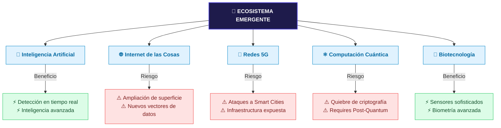
## 🚀 Ciberseguridad en Tecnologías Emergentes

El futuro de la seguridad informática está condicionado por la evolución tecnológica acelerada y la sofisticación de las amenazas. El análisis de riesgos exige evaluar las tecnologías emergentes bajo una perspectiva dual: su **potencial de amenaza** frente a su **capacidad de defensa operativa**.

```mermaid
graph TD
    %% Estilos del mapa tecnológico
    classDef core fill:#312e81,stroke:#4338ca,stroke-width:2px,color:#ffffff,font-weight:bold;
    classDef tech fill:#1e3a8a,stroke:#2563eb,stroke-width:1px,color:#ffffff;
    classDef risk fill:#7f1d1d,stroke:#ef4444,stroke-width:1px,color:#ffffff;
    classDef defense fill:#14532d,stroke:#22c55e,stroke-width:1px,color:#ffffff;

    Root["🌐 MATRIZ DE TECNOLOGÍAS EMERGENTES"]:::core

    %% Ramas Principales
    Root --> IA["🧠 Inteligencia Artificial (IA)"]:::tech
    Root --> IOT["🔌 Internet de las Cosas (IoT)"]:::tech
    Root --> G5["📶 Redes 5G"]:::tech
    Root --> Q["⚛️ Computación Cuántica"]:::tech
    Root --> BIO["🧬 Biotecnología"]:::tech

    %% Impacto IA
    IA --> IA_R["⚠️ Ciberataques más rápidos y sofisticados"]:::risk
    IA --> IA_D["🛡️ Detección en tiempo real y Threat Intel avanzada"]:::defense

    %% Impacto IoT
    IOT --> IOT_R["⚠️ Expansión masiva de la superficie de ataque"]:::risk
    IOT --> IOT_D["🛡️ Necesidad de nuevas arquitecturas de protección"]:::defense

    %% Impacto 5G
    G5 --> G5_R["⚠️ Amenazas a autos autónomos e infraestructura cívica"]:::risk
    G5 --> G5_D["🛡️ Conectividad crítica de ultra baja latencia"]:::defense

    %% Impacto Cuántica
    Q --> Q_R["⚠️ Ruptura potencial de algoritmos criptográficos actuales"]:::risk
    Q --> Q_D["🛡️ Desarrollo obligatorio de cifrado post-cuántico"]:::defense

    %% Impacto Biotecnología
    BIO --> BIO_R["⚠️ Nuevos vectores de alteración/robo de datos biológicos"]:::risk
    BIO --> BIO_D["🛡️ Autenticación biométrica de alta precisión y sensores avanzados"]:::defense
```
📋 Análisis de Impacto de la Próxima Generación Tecnológica
1. 🧠 Inteligencia Artificial (IA)
Perspectiva Defensiva: Transforma la operación del SOC al automatizar el triaje, analizar millones de logs de forma simultánea, y acelerar la detección y respuesta ante incidentes en tiempo real. Proporciona una inteligencia sobre amenazas avanzada y contextualizada.

Vector de Riesgo: Los adversarios emplean IA para automatizar el descubrimiento de vulnerabilidades, evadir sistemas de detección tradicionales y sofisticar la ingeniería social (phishing automatizado).

2. 🔌 Internet de las Cosas (IoT)
Desafío Técnico: La interconectividad digital de objetos cotidianos optimiza sectores como sanidad, transporte y fabricación. Sin embargo, al multiplicar los dispositivos conectados a la red, la superficie de ataque se amplía exponencialmente.

Estrategia Defensiva: Exige el abandono de la seguridad perimetral clásica para dar paso a modelos de microsegmentación y protecciones específicas para los endpoints IoT y los datos que estos generan.

3. 📶 Infraestructura de Redes 5G
Impacto Operativo: Al proveer velocidades ultrarrápidas, mayor capacidad y una latencia casi nula, viabiliza innovaciones críticas como ciudades inteligentes y transporte autónomo.

Vulnerabilidad: Esta dependencia de la red inalámbrica abre nuevas compuertas para ataques dirigidos contra organizaciones, individuos e infraestructura cívica crítica (sistemas de tránsito, redes de servicios públicos).

4. ⚛️ Computación Cuántica
La Amenaza Criptográfica: La capacidad de procesar datos empleando las propiedades de las partículas subatómicas otorga una potencia de cálculo exponencial. El riesgo crítico radica en su potencial para romper los métodos criptográficos actuales que resguardan la información global.

Mitigación Defensiva: Obliga a los profesionales de la seguridad a investigar y desplegar algoritmos de cifrado post-cuántico capaces de resistir ataques de fuerza bruta cuántica.

5. 🧬 Biotecnología
Innovación en Autenticación: Los avances en la aplicación del conocimiento biológico aplicados a la tecnología permiten diseñar sensores y algoritmos biométricos sumamente sofisticados.

Resultado: Habilita mecanismos de control de acceso y autenticación biométrica mucho más precisos, robustos y difíciles de suplantar que las credenciales tradicionales.

* 📝 Conclusión de Control: Debido a que es imposible predecir con precisión exacta el origen o vector de los futuros incidentes, el futuro de la ciberseguridad demanda innovación continua e inversión constante en estrategias dinámicas de protección.

## 🔬 Definición y Alcance de las Tecnologías Emergentes

> **¿Qué es una tecnología emergente?**
> Según se detalla en **image_65c1c2.jpg**, se refiere a cualquier producto o servicio innovador que aún se encuentra en las primeras etapas de desarrollo, prueba o adopción.

Los avances en la ciencia y la ingeniería han desarrollado tecnologías que están revolucionando la vida de las personas de maneras que antes se consideraban imposibles (image_65c1c2.jpg). Sin embargo, este progreso tecnológico conlleva de forma inherente una mayor vulnerabilidad a las amenazas cibernéticas (image_65c1c2.jpg).

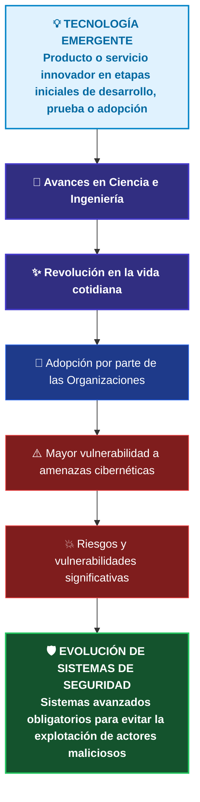
🗂️ Clasificación de Tecnologías con Alto Impacto Futuro
Aunque estas herramientas ya se encuentran en uso hasta cierto punto en la actualidad, cada una guarda una tremenda promesa para el futuro, acompañada de riesgos críticos que deben ser explorados a detalle:

🧠 Inteligencia Artificial (IA): Sistemas diseñados para el procesamiento avanzado de datos y automatización analítica.

🔌 Internet de las Cosas (IoT): Redes de dispositivos cotidianos interconectados que amplían la superficie de exposición.

📶 Redes 5G: Infraestructura inalámbrica de alta velocidad y ultra baja latencia que conecta servicios críticos.

⚛️ Computación Cuántica: Potencia de cálculo subatómica con capacidad para redefinir el paradigma criptográfico.

🧬 Mejoras en la Biotecnología: Aplicación del conocimiento biológico para el desarrollo de sensores y algoritmos biométricos de alta precisión.

📝 Directiva Forense y Defensiva: A medida que las organizaciones incorporan de forma agresiva estas innovaciones a sus procesos de negocio, nuestros sistemas y estrategias de seguridad deben evolucionar a la par de ellas (image_65c1c2.jpg). El objetivo técnico es neutralizar proactivamente la explotación y el abuso de estas plataformas por parte de actores maliciosos.

## 🧠 Inteligencia Artificial (IA) en el Ámbito Defensivo y Ofensivo

La **Inteligencia Artificial (IA)** se consolida como un campo de estudio y un desarrollo tecnológico orientado a la creación de sistemas y máquinas capaces de simular la inteligencia humana, interactuar mediante la resolución de problemas complejos y ejecutar clasificaciones o predicciones basadas en grandes volúmenes de datos. Incorpora subcampos críticos como el *Machine Learning* (Aprendizaje Automático) y el *Deep Learning* (Aprendizaje Profundo).

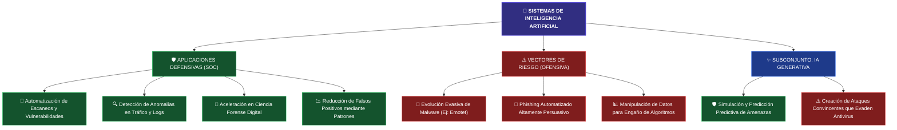
🛡️ Pilares Defensivos de la IA en Ciberseguridad
Los profesionales de ciberseguridad utilizan la IA para abordar tareas complejas, automatizar procesos y detectar patrones o anomalías en grandes volúmenes de datos corporativos (image_6554c2.jpg). Sus principales contribuciones operativas son:

🤖 Automatización de Procesos: Permite delegar tareas repetitivas como el escaneo continuo de redes y la evaluación automatizada de vulnerabilidades. Esto libera tiempo crítico del analista y mitiga sustancialmente el error humano.

🔍 Detección Temprana de Amenazas: Modela patrones basados en datos históricos para identificar comportamientos anómalos en el tráfico de red, registros de sistemas y conductas de usuario, neutralizando incidentes antes de que causen daños (image_654c2.jpg).

🔬 Ciencia Forense Digital Avanzada: Agiliza drásticamente el proceso de identificación, recopilación, examen, análisis y preservación de evidencia electrónica. La IA puede procesar cantidades de metadatos imposibles de abordar por un analista humano de manera independiente debido a las limitaciones de tiempo.

📉 Reducción de Falsos Positivos: El aprendizaje automático modela el comportamiento benigno o legítimo de la infraestructura (por ejemplo, picos de tráfico controlados por eventos normales en lugar de ataques DDoS masivos), permitiendo al sistema discriminar con precisión y reducir las alertas innecesarias que causan fatiga en el SOC.

⚠️ El Vector Ofensivo: Amenazas y Malware Evasivo
A la par de las defensas, los ciberdelincuentes diseñan aplicaciones impulsadas por IA para evadir la supervisión humana y eludir los mecanismos de detección tradicionales.

🦠 Caso de Estudio: La Botnet Emotet
Emotet es un troyano avanzado enfocado en la exfiltración de credenciales bancarias y datos personales que se propaga mediante ingeniería social (archivos adjuntos maliciosos de Microsoft Word).

Uso de Machine Learning: La alta peligrosidad y velocidad de propagación de Emotet radica en su capacidad de emplear modelos de aprendizaje automático para mutar, adaptar sus tácticas y evadir las firmas de los software antivirus tradicionales.

Impacto Global: Logró infectar más de 1.6 millones de computadoras a nivel mundial, constituyendo una de las botnets más agresivas registradas y provocando pérdidas de cientos de millones de dólares.

✨ El Rol de la IA Generativa
Definición Técnica: Como se detalla en image_6550dd.png, la IA generativa es un subconjunto de la IA que se centra en crear o generar texto, imágenes y otro contenido de alta calidad basado en los datos en los que se entrena el modelo. Su lógica subyacente codifica una representación simplificada de la información de entrenamiento (como textos indexados o imágenes artísticas) para producir resultados estadísticamente probables pero originales.

En el sector de la seguridad informática (image_655104.jpg), la IA generativa plantea un escenario de uso dual:

🛡️ Uso Defensivo: Permite a los equipos de ingeniería simular y predecir amenazas avanzadas. Los defensores pueden generar de forma controlada variantes de malware complejo o correos de phishing hiperrealistas con el fin de testear y blindar sus propias plataformas defensivas antes de un ataque real.

⚠️ Desafío Ofensivo: Los adversarios explotan exactamente estos mismos modelos generativos para optimizar la redacción de sus campañas de ingeniería social, haciéndolas sumamente convincentes para el usuario final y logrando eludir los filtros tradicionales de correo electrónico.

## 🔌 Internet de las Cosas (IoT) y la Expansión de la Superficie de Ataque

El **Internet de las Cosas (IoT)** representa la red de dispositivos físicos, vehículos, electrodomésticos y otros objetos integrados con sensores, software y conectividad de red, permitiéndoles recopilar, procesar y compartir datos de manera autónoma. La integración masiva de hardware inteligente en entornos domésticos y corporativos (como termostatos, cámaras, lavadoras y sistemas embebidos de infraestructura) expande exponencialmente las capacidades operativas mediante la conectividad en la nube, pero de manera paralela, altera de forma crítica el ecosistema de seguridad de las organizaciones.

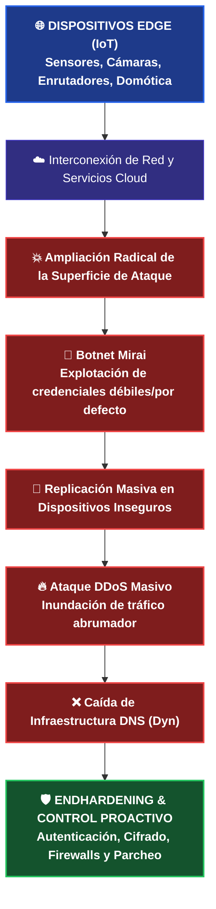

⚠️ El Desafío de Seguridad: Multiplicación de Nodos Inseguros
La transformación digital y el incremento del trabajo remoto aceleraron la adopción de arquitecturas en la nube y el despliegue de un número masivo de dispositivos en el borde (edge devices). Esta red interdependiente amplía radicalmente la superficie de ataque de cualquier organización, ofreciendo a los ciberdelincuentes miles de nuevos puntos de entrada potenciales si los dispositivos carecen de controles defensivos mínimos.

🦠 Caso de Estudio: El Malware Mirai y el Ataque a Dyn
El virus Mirai se convirtió en el hito histórico más representativo de los riesgos de seguridad en IoT al explotar activamente la negligencia en las configuraciones de fábrica.

Fase de Escaneo y Compromiso: Mirai escaneó de forma continua direcciones IP públicas apuntando de manera específica a routers y cámaras digitales inseguras. El malware lograba el acceso y control total de los equipos explotando credenciales de inicio de sesión predeterminadas o débiles (como admin/admin).

Constitución de la Botnet: Una vez comprometidos, el malware infectaba los sistemas embebidos, transformando los dispositivos legítimos en "robots" controlados remotamente por un servidor central (C2).

El Ataque DDoS a Dyn (Impacto en DNS): Mirai utilizó esta botnet masiva para inundar con tráfico abrumador y peticiones simultáneas a los servidores de Dyn, un proveedor crítico de servicios de infraestructura global. El ataque distribuyó tal cantidad de solicitudes que sobrecargó por completo sus sistemas, inhabilitando sus operaciones.

🗺️ El Rol Crítico del DNS
Como se resalta en image_64e785.png, el Sistema de Nombres de Dominio (DNS) es una parte fundamental de la infraestructura de Internet que actúa como una guía telefónica, traduciendo nombres de dominio legibles por humanos (como example.com) en sus correspondientes direcciones IP numéricas complejas (como 192.0.2.1). Al voltear a un proveedor troncal como Dyn, Mirai rompió esta traducción de nombres a nivel global, provocando la interrupción de la conectividad y afectando la disponibilidad de numerosas páginas web y plataformas de primer nivel en todo el mundo.

🛡️ Directivas Técnicas para la Mitigación y Hardening de IoT
Para contrarrestar los vectores de ataque dirigidos a dispositivos periféricos y proteger la infraestructura corporativa de incidentes similares a Mirai, es imperativo implementar un marco de defensa proactivo (image_64e062.png):

* Autenticación Robusta: Eliminar estrictamente las credenciales por defecto de fábrica. Implementar políticas de contraseñas complejas y rotativas para evitar ataques de fuerza bruta y diccionarios.
* Cifrado de Datos: Garantizar la confidencialidad e integridad mediante el cifrado de datos en movimiento y en reposo, evitando la * interceptación de tráfico o ataques Man-in-the-Middle.
* Segmentación y Firewalls: Aislar los despliegues de IoT en redes virtuales (VLANs) dedicadas y utilizar Firewalls perimetrales para restringir de manera estricta el tráfico entrante y saliente no autorizado.
* Gestión de Parches: Establecer ventanas periódicas de actualización de firmware para corregir vulnerabilidades conocidas expuestas públicamente en los sistemas embebidos.

📝 Conclusión de Seguridad: El resguardo de estos entornos requiere el compromiso y monitoreo constante tanto de gobiernos, corporaciones y analistas de ciberseguridad, manteniéndose actualizados respecto a las nuevas amenazas y técnicas de evasión de malware para proteger los activos de información (image_64e062.png).

## 📶 Redes 5G: Hiperconectividad y Nuevos Vectores de Exfiltración

La **quinta generación de redes celulares (5G)** redefine el paradigma de las comunicaciones móviles al ofrecer velocidades hasta 100 veces más rápidas que 4G, mayor ancho de banda y una **latencia ultrabaja**. Esta infraestructura de conectividad inalámbrica masiva impulsa innovaciones críticas en tiempo real como la telemedicina (*e-health*), el procesamiento de vehículos autónomos y la automatización de la infraestructura cívica (servicios públicos y tránsito). Sin embargo, la complejidad de su ecosistema descentralizado y su velocidad de transferencia abren compuertas críticas para la seguridad de los datos.

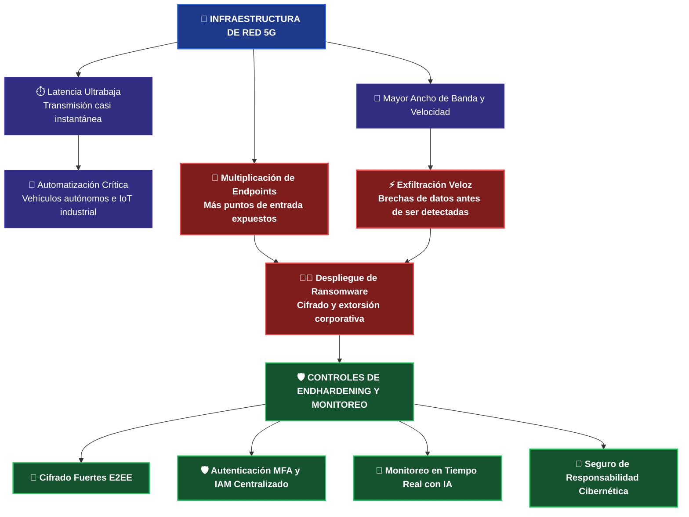

⏱️ El Núcleo Técnico del 5G: Latencia Ultrabaja
La latencia ultrabaja se define como un retraso extremadamente corto en los tiempos de transmisión y recepción de datos desde el endpoint hasta el nodo de red, garantizando una comunicación y respuesta casi instantánea.

Esta reducción drástica del tiempo de transferencia optimiza el despliegue de tecnologías complejas:

Entornos Críticos: En el desarrollo de vehículos autónomos, la comunicación instantánea en milisegundos entre los sensores perimetrales y los sistemas lógicos de control es obligatoria para garantizar un funcionamiento e interacción seguros.

Experiencia de Usuario: Habilita entornos fluidos y de alta disponibilidad para el streaming de video en ultra alta definición, juegos avanzados en la nube y aplicaciones inmersivas de realidad virtual.

⚠️ El Desafío del SOC: Puntos de Entrada y Ataques de Alta Velocidad
El futuro del 5G y la ciberseguridad se encuentran profundamente entrelazados. Al basarse en un ecosistema heterogéneo y denso de dispositivos interconectados (smartphones, laptops, terminales industriales y miles de dispositivos IoT), la cantidad de puntos de entrada potenciales para los ciberdelincuentes se multiplica de forma exponencial.

🏴‍☠️ Caso de Estudio: Incidente de Ransomware en Aseguradora Europea (2021)
En 2021, una compañía de seguros europea sufrió un ataque crítico que explotó las características nativas de esta tecnología:

El Vector de Acceso: Los atacantes identificaron y explotaron vulnerabilidades en los dispositivos IoT expuestos que estaban conectados directamente a la red móvil 5G de la organización.

El Factor Velocidad: Debido a que el 5G permite velocidades sustancialmente más rápidas, los actores maliciosos lograron vulnerar la red y exfiltrar grandes volúmenes de datos corporativos antes de que los monitores de red tradicionales lograran identificarlos o capturarlos.

El Desenlace: Una vez comprometida la infraestructura interna, desplegaron un ataque de ransomware que cifró los datos operativos y exigió el pago de una recompensa financiera a cambio de la clave de descifrado, paralizando las actividades de la organización.

🛡️ Controles Defensivos y Hardening para Redes 5G
Para neutralizar el acceso no autorizado y blindar la integridad forense de los flujos de datos en ciberarquitecturas móviles, las organizaciones deben desplegar la siguiente matriz de controles proactivos:

🔒 Implementación de Cifrado Fuerte: Forzar el uso de protocolos estándar de la industria mediante un esquema de Cifrado de Extremo a Extremo (E2EE). Esto garantiza que la información viaje de forma cifrada desde su origen en el nodo periférico hasta el destinatario final, volviéndola ilegible ante cualquier interceptación (Sniffing).

🔑 Autenticación de Doble Factor (MFA): Robustecer el perímetro lógico de los dispositivos 5G exigiendo múltiples factores de identificación (como contraseñas robustas complementadas con tokens dinámicos/OTP provistos a dispositivos móviles oficiales).

🗂️ Sistemas de Gestión de Identidades (IAM): Centralizar la autenticación, autorización y control de acceso. El uso de plataformas IAM asegura que únicamente el personal validado y bajo políticas de mínimo privilegio acceda a los recursos asociados a la red.

🧠 Monitoreo Proactivo con Inteligencia Artificial: Dado que las velocidades del 5G superan la capacidad de respuesta y detección de los análisis de logs humanos tradicionales, es indispensable implementar motores de IA dedicados a auditar el tráfico en tiempo real para interceptar anomalías de exfiltración de forma automatizada.

💼 Seguro de Responsabilidad Cibernética: Como medida de gestión de riesgos financieros ante brechas inevitables, la obtención de una póliza adecuada permite mitigar el impacto económico derivado de la respuesta ante incidentes, costos legales, notificaciones obligatorias a clientes y remediación de daños.

## ⚠️ Clarificación Técnica: Redes Celulares 5G vs. Wi-Fi de 5 GHz

Existe una confusión generalizada debido al uso de la letra **"G"** en el ámbito comercial. Sin embargo, representan arquitecturas de red y espectros de frecuencia completamente independientes:

1. **5G (Quinta Generación Celular):** Es el estándar global de redes móviles diseñado para conectar dispositivos a nivel macro (infraestructura pública, antenas de telefonía) utilizando múltiples bandas de frecuencia (sub-6 GHz y ondas milimétricas) para proveer latencia ultrabaja y velocidades masivas.
2. **Wi-Fi 5 GHz (Gigahertz):** No es una generación, sino una **banda de frecuencia de radio** (los 5 gigahertz) que utilizan los routers domésticos o corporativos para transmitir datos a corta distancia en redes de área local (WLAN).

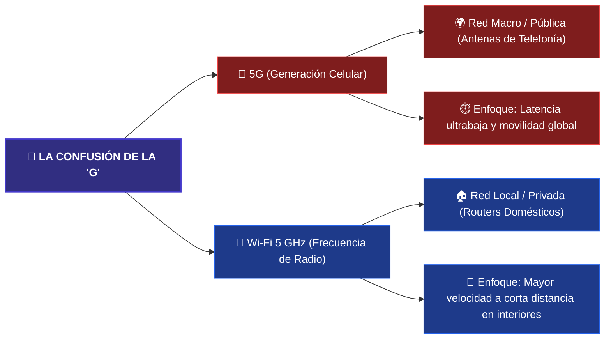

### 📊 Matriz de Comparación Técnica: 5G vs. Wi-Fi 5 GHz

| Característica | 📡 Red Móvil 5G (Generación) | 🔌 Wi-Fi 5 GHz (Frecuencia) |
| :--- | :--- | :--- |
| **¿Qué significa la "G"?** | **Generación.** Es la 5.ª etapa evolutiva de la tecnología móvil inalámbrica. | **Gigahertz.** Es la frecuencia física de la onda de radio (5.000 millones de ciclos por segundo). |
| **Ámbito de Cobertura** | **Red Externa (WAN).** Cobertura masiva a nivel nacional mediante celdas y antenas de telefonía distribuidas. | **Red Local (WLAN).** Cobertura limitada (habitaciones, oficinas, interiores de un edificio). |
| **Propiedad de la Red** | Operada y gestionada por proveedores de telecomunicaciones (Movistar, Claro, Personal, etc.). | **Privada.** Administrada de manera interna por el usuario o la organización dueña del router o Access Point. |
| **Espectro de Frecuencia** | Utiliza bandas licenciadas (compradas por las telefónicas), incluyendo bandas bajas, medias y ondas milimétricas. | Utiliza un espectro no licenciado de libre uso (coexistiendo con Wi-Fi de 2.4 GHz y las nuevas bandas de 6 GHz). |
| **Vectores de Riesgo Críticos** | Interceptación de tráfico en celdas falsas (*IMSI-catchers*), vulnerabilidades en el núcleo virtualizado y exfiltración veloz de datos. | Ataques de desautenticación, fallos en protocolos de cifrado (*WPA2/WPA3*) y routers mal configurados de fábrica. |

## ⚛️ Computación Cuántica: El Próximo Paradigma Criptográfico

La **computación cuántica** representa una tecnología emergente disruptiva que utiliza los principios fundamentales de la mecánica cuántica (como la superposición y el entrelazamiento) junto con hardware y algoritmos especializados para procesar información a velocidades exponenciales. Esta capacidad analítica le permite resolver problemas complejos que las computadoras convencionales o supercomputadoras clásicas son incapaces de abordar, o que les tomaría miles de años procesar.

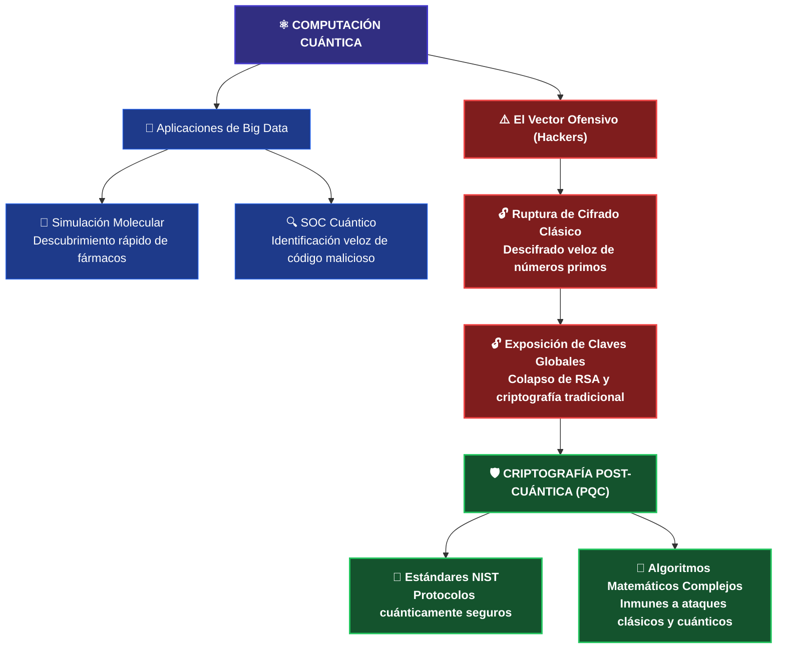

🔬 Aplicaciones Prácticas y Beneficios en Ciberseguridad
Más allá del ámbito teórico, la computación cuántica aporta un valor sin precedentes en campos con alta densidad de datos:
💊 Descubrimiento de Fármacos (Caso Civil): Permite a los científicos modelar interacciones entre átomos y moléculas con precisión absoluta. Esto acelera de manera drástica el diseño de nuevos medicamentos y la comprensión de su eficacia clínica sin depender exclusivamente de ensayos de laboratorio prolongados.
🛡️ Ecosistema Defensivo del SOC: Procesa volúmenes masivos de telemetría de red a velocidades de procesamiento cuántico, facilitando la detección temprana de anomalías. Habilita el desarrollo de algoritmos de búsqueda avanzada capaces de identificar código malicioso y mutaciones de malware de manera más rápida y precisa que cualquier motor heurístico actual.

⚠️ El Riesgo Crítico: El Fin de la Criptografía TradicionalEl poder computacional de las computadoras cuánticas representa un arma de doble filo, ya que los actores de amenazas pueden explotar estas capacidades para comprometer la infraestructura de clave pública global ($PKI$).

* Descifrado de Claves: Los métodos de cifrado asimétrico actuales (como RSA) basan su seguridad en la dificultad matemática de factorizar números primos extremadamente grandes en computadoras clásicas.
* El Impacto Ofensivo: Una computadora cuántica con la escala suficiente puede resolver estos problemas matemáticos de forma casi instantánea, desbloqueando las claves de cifrado y exponiendo datos confidenciales, comunicaciones gubernamentales, transacciones financieras e información corporativa inmutable.

🧱 Barreras Actuales para la Adopción Generalizada
A pesar de sus ventajas, la computación cuántica no ha sido adoptada de forma masiva debido a tres limitaciones estructurales complejas:

🥶 Alta Sensibilidad Ambiental: Los procesadores cuánticos (Qubits) son extremadamente sensibles al ruido, las interferencias electromagnéticas y la decoherencia. Requieren condiciones de infraestructura masivas y sumamente precisas, como temperaturas operativas cercanas al cero absoluto (criogenia), lo que dificulta su escalabilidad a nivel empresarial.
📈 Curva de Aprendizaje Pronunciada: El desarrollo, diseño e implementación de algoritmos cuánticos efectivos exige un nivel de especialización y conocimientos avanzados en física cuántica y matemática abstracta, limitando el número de profesionales calificados en el mercado actual.
💰 Costos de Infraestructura: El desarrollo, mantenimiento físico, consumo energético y operación de estos entornos tecnológicos conllevan presupuestos multimillonarios, restringiendo su acceso inicial a grandes corporaciones, centros de investigación universitaria y agencias gubernamentales.

📜 La Respuesta Defensiva: Criptografía Post-Cuántica (PQC)
Ante la inminente amenaza de la ruptura del cifrado clásico, la comunidad de ciberseguridad lidera un enfoque proactivo para blindar los activos de información:

* Protocolos de Cifrado Avanzados: Los desarrolladores diseñan algoritmos criptográficos basados en problemas matemáticos retorcidos (como la criptografía basada en retículos), los cuales se consideran computacionalmente imposibles de resolver tanto para las computadoras tradicionales como para las cuánticas.

* El Hito del NIST (Julio 2022): El Instituto Nacional de Estándares y Tecnología de EE. UU. marcó un hito histórico en la seguridad digital al introducir los primeros estándares oficiales para protocolos de criptografía cuántica segura. Este marco provee las pautas técnicas obligatorias para que las organizaciones migren sus sistemas de transferencia y almacenamiento de datos hacia un entorno inmune a ataques de fuerza bruta cuántica.

---

### 🚓 Criptoanálisis Cuántico Aplicado a la Investigación Criminal

Si bien el poder de procesamiento cuántico plantea un desafío severo para las infraestructuras de cifrado actuales, este mismo potencial representa una herramienta revolucionaria para los organismos encargados de hacer cumplir la ley y los analistas forenses en su lucha global contra la ciberdelincuencia (`image_6458fd.png`). 

Un claro ejemplo de esta transición tecnológica se observa en los flujos avanzados de investigación judicial y descifrado de evidencia:

* **Protección de Comunicaciones Delictivas:** Es habitual que los grupos de delincuencia organizada y ciberdelincuentes utilicen claves criptográficas complejas basadas en textos cifrados para proteger la confidencialidad de sus comunicaciones operativas (`image_64561d.png`).
* **La Vulnerabilidad de los Sistemas Heredados (*Legacy*):** Muchas de estas organizaciones criminales generan sus llaves empleando algoritmos tradicionales que resultan robustos en sistemas informáticos antiguos (`image_6455d6.png`). Sin embargo, dichos algoritmos se basan en problemas matemáticos de factorización que los algoritmos cuánticos pueden resolver de manera casi instantánea, rompiendo el esquema tradicional que va desde el texto no cifrado, pasa por el algoritmo de cifrado y decanta en el texto cifrado (`image_6455d6.png`).
* **Colaboración Forense y Evidencia:** Mediante la cooperación directa entre las fuerzas del orden y equipos especializados de investigadores, la potencia de las computadoras cuánticas permite quebrar estas claves criptográficas antiguas (`image_6458fd.png`, `image_645544.png`). Al descifrar los canales de comunicación, los peritos logran recopilar pruebas digitales de alto valor legal, fundamentales para identificar, localizar y enjuiciar formalmente a los actores maliciosos (`image_645544.png`).

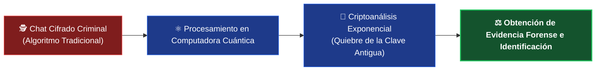

## 🧬 Biotecnología: Ciberdefensa Orgánica y Autenticación Avanzada

La **biotecnología** consiste en el aprovechamiento de organismos vivos o sus componentes celulares y biomoleculares para el desarrollo de soluciones innovadoras y productos útiles. Si bien su impacto histórico reside en la medicina (terapias dirigidas, vacunas optimizadas) y la agricultura (resistencia genética a estresores ambientales), su convergencia con los sistemas de información está redefiniendo el endurecimiento (*hardening*) de infraestructuras y el análisis heurístico de amenazas.

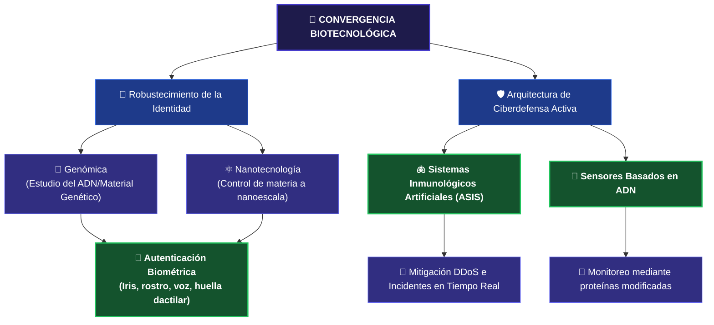
🔑 El Rol de la Genómica y la Nanotecnología en el Control de Acceso
A medida que los teléfonos inteligentes y los terminales corporativos conectados almacenan mayor volumen de datos personales y gestionan sistemas automatizados, se vuelve mandatorio elevar la complejidad de los métodos de cifrado y autenticación. Dos disciplinas asociadas a la biotecnología lideran este avance:

🧬 Genómica: Centrada en el estudio del genoma completo de los organismos (incluyendo su ADN y estructuras genéticas). Ha permitido perfeccionar los sistemas biométricos de alta fidelidad, tales como el escaneo de iris, reconocimiento facial, detección de voz y los sensores de huella dactilar integrados en smartphones. Estas características físicas únicas reducen de manera drástica la probabilidad de suplantación de identidad (spoofing) o falsificación.

⚛️ Nanotecnología: Enfocada en la manipulación y comprensión de la materia a nanoescala (una milmillonésima parte de un metro). Provee la base científica para fabricar sensores físicos miniaturizados hiperprecisos capaces de validar datos de acceso sin degradar el rendimiento del hardware.

🛡️ Ciberseguridad Inspirada en la Biología: ASIS y Sensores Moleculares
La integración de principios biológicos en sistemas de Inteligencia Artificial ha permitido desarrollar estrategias de defensa proactiva capaces de imitar los mecanismos naturales de preservación orgánica:

🫁 Sistemas Inmunológicos de Seguridad Artificial (ASIS)
Los investigadores diseñan plataformas de software que emulan el comportamiento del sistema inmunitario humano para la detección de anomalías lógicas.

* Mecanismo de Acción: Así como el cuerpo humano detecta la intrusión de un agente patógeno o virus porque reconoce que altera el estado normal del organismo, un sistema ASIS audita los patrones basales de una infraestructura.

* Caso de Aplicación: Frente a un ataque de Denegación de Servicio Distribuido (DDoS), el ASIS identifica el incremento súbito y anómalo de tráfico proveniente de múltiples fuentes simultáneas, activando contramedidas de mitigación inmediatas de forma automatizada.

🔬 Sensores Basados en ADN
Línea de investigación orientada al desarrollo de dispositivos bio-digitales encargados de inspeccionar el tráfico en tiempo real dentro de redes de alta disponibilidad.

* Funcionamiento: Emplean proteínas modificadas genéticamente capaces de reaccionar ante moléculas o patrones específicos directamente vinculados con firmas de ciberataques puntuales.

* Objetivo Táctico: Su incorporación en las interfaces de red busca automatizar el descubrimiento de vulnerabilidades y la contención de amenazas en fases tempranas del ciclo del ataque.

📈 Consideraciones Estratégicas para la Gestión del Riesgo

* Innovación Sin Explotar: Las soluciones de ciberseguridad fundamentadas en procesos biotecnológicos ofrecen respuestas dinámicas ante amenazas sofisticadas, pero su potencial comercial y técnico permanece aún en sus etapas iniciales de maduración.

* Ventaja Competitiva Activa: Las organizaciones con arquitecturas críticas deben evaluar e invertir en este vector de innovación para adelantarse a las tácticas de evasión empleadas por los atacantes.

* Rol en la Ciberdelincuencia: El despliegue a gran escala de defensas inmunológicas artificiales jugará un rol preponderante en la neutralización del cibercrimen organizado a nivel global.

---

## 🧠 Actividad: Reflexión Analítica sobre Ciberseguridad y Tecnologías Emergentes

> **Nota de Portafolio:** Esta sección representa una síntesis y análisis crítico sobre el impacto, riesgos y sinergias de la próxima ola tecnológica en el ecosistema de la seguridad de la información.

### 🌐 1. Evaluación del Impacto Tecnológico y Expansión de Riesgos

La adopción de tecnologías emergentes acelera la transformación digital, pero reconfigura de manera drástica el mapa de amenazas que los profesionales de seguridad debemos mitigar:

* **Inteligencia Artificial (IA):** Actúa como un catalizador defensivo en el SOC al automatizar tareas rutinarias de seguridad, agilizar el triaje y procesar millones de logs para mejorar la inteligencia sobre amenazas. Sin embargo, representa una simetría de capacidades: los ciberdelincuentes ya la emplean para automatizar el descubrimiento de vulnerabilidades y diseñar ataques de ingeniería social hiperpersonalizados y difíciles de detectar.
* **Internet de las Cosas (IoT):** La interconexión masiva de dispositivos cotidianos genera eficiencia operativa, pero degrada el perímetro de seguridad clásico. Al multiplicar los nodos desprotegidos o con configuraciones de fábrica deficientes, la superficie de ataque se expande exponencialmente, transformando hardware genérico en vectores potenciales de intrusión a redes corporativas.
* **Redes 5G:** Su despliegue masivo viabiliza infraestructuras futuristas como ciudades inteligentes y vehículos autónomos gracias a su latencia ultrabaja. No obstante, al soportar una densidad de endpoints drásticamente mayor, multiplica los puntos de entrada potenciales. Además, su velocidad extrema permite a los atacantes exfiltrar grandes volúmenes de datos antes de que los sistemas de monitoreo tradicionales logren interceptarlos.
* **Computación Cuántica:** Su descomunal capacidad de procesamiento optimizará la analítica de big data y la identificación de malware. A pesar de esto, se posiciona como una amenaza existencial para la criptografía asimétrica actual (como RSA), al ser capaz de factorizar números primos grandes en cuestión de segundos. Esto vuelve obligatoria la transición proactiva hacia algoritmos de cifrado post-cuánticos (PQC).
* **Biotecnología:** Ofrece metodologías disruptivas de autenticación biométrica de alta precisión (mediante genómica y nanotecnología) y modelos de defensa orgánica inspirados en sistemas inmunológicos artificiales (ASIS). El desafío crítico aquí radica en la gobernanza, privacidad y resguardo estricto de estos datos biométricos, ya que un compromiso de esta información comprometería la identidad inmutable del usuario de forma permanente.

---

### 📊 2. El Balance Estratégico: Innovación vs. Seguridad

Una conclusión es innegable: **nadie puede predecir con exactitud absoluta el origen o vector de los futuros incidentes digitales.** La ciberseguridad ya no puede concebirse como un conjunto de medidas estáticas o un freno a la innovación, sino como el habilitador resiliente de la misma.

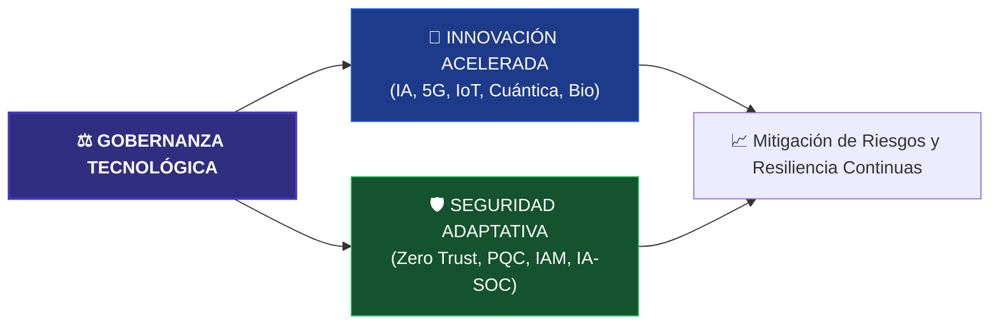


ASPECTO DESTACADO DE LA GESTION DE CARRERA: FLUIDEZ EN CIBERSEGURIDAD


A lo largo de este curso, aprendiste habilidades que mejoraron tu fluidez y tus habilidades
en ciberseguridad. Aumento tu conciencia sobre las amenazas ciberneticas, practicaste como
identificar vulnerabilidades, aprendiste lo importante que es proteger la seguridad de las
redes y los sistemas, y mas. Tambien investigaste una variedad de trabajos en los que podrias
querer trabajar, exploraste certificaciones que puedes obtener y practicaste habilidades en
el lugar de trabajo que los empleadores consideran esenciales.

```==========================================================================================
HABILIDADES, CERTIFICACIONES Y CARRERAS RELACIONADAS CON LA CIBERSEGURIDAD


Revisa las siguientes listas de habilidades de empleabilidad, certificaciones y carreras
que aprendiste y practicaste en este curso.

==========================================================================================
COMPETENCIAS DE EMPLEABILIDAD


En este curso, pusiste en practica una variedad de habilidades de empleabilidad, todas en el
contexto de la ciberseguridad. Estas habilidades son transferibles y te ayudaran en cualquier
trabajo que busques.

==========================================================================================
DATOS Y PRIVACIDAD


Habilidades practicadas:

- Pensamiento critico
- Mentalidad de crecimiento
- Pensamiento analitico
- Comunicacion escrita y documentacion

Actividades:
- Explicar por que las organizaciones necesitan invertir en ciberseguridad
- Identificar amenazas de ciberseguridad
- Clasificar tareas usando los elementos clave de ciberseguridad
- Categorizar tipos de datos
- Identificar las mejores practicas de privacidad
- Descifrar texto cifrado usando una clave de cifrado
- Ordenar los pasos para el cifrado
- Enumerar las razones por las que el cifrado es importante
- Aplicar las mejores practicas de cifrado
- Explicar tu interes en una carrera en ciberseguridad
- Describir las habilidades para una carrera en privacidad de datos
- Describir las habilidades para ser analista de seguridad de datos
- Resumir el proposito y beneficios del programa ECES del EC-Council
- Distinguir entre consecuencias de una violacion de privacidad de datos
- Aplicar la triada CIA a situaciones del mundo real
- Ordenar los controles por tipo
- Clasificar cifrado como simetrico o asimetrico
- Desarrollar un plan de respaldo

==========================================================================================
GOBERNANZA, RIESGO Y CUMPLIMIENTO


Habilidades practicadas:

- Mentalidad de crecimiento
- Pensamiento critico
- Comunicacion escrita
- Resolucion de problemas
- Documentacion

Actividades:
- Reflexionar sobre la aplicacion de politicas organizacionales
- Describir metodos para proteger datos, sistemas y redes
- Enumerar habilidades para puestos de analista de cumplimiento de seguridad
- Diferenciar entre politicas, estandares, pautas y procedimientos
- Enumerar razones por las que un programa de cumplimiento es fundamental
- Aplicar las leyes federales a situaciones del mundo real
- Evaluar el riesgo organizacional
- Crear un plan de control administrativo para el cumplimiento

==========================================================================================
AMENAZAS Y VULNERABILIDADES


Habilidades practicadas:

- Pensamiento critico
- Pensamiento sistemico
- Resolucion de problemas
- Pensamiento analitico
- Agilidad de aprendizaje
- Investigacion
- Atencion al detalle
- Comunicacion escrita
- Documentacion
- Mentalidad de crecimiento

Actividades:
- Enumerar tipos de malware
- Diferenciar entre diferentes tipos de malware
- Enumerar signos de un intento de ingenieria social
- Identificar amenazas de seguridad fisica
- Analizar el impacto de las amenazas de ciberseguridad
- Mitigar amenazas de malware usando Malwarebytes
- Describir habilidades para trabajar como analista de malware
- Aplicar caracteristicas del phishing a correos electronicos
- Desarrollar un plan de control de seguridad fisica
- Describir habilidades para ser tecnico de servicio de seguridad fisica

==========================================================================================
GESTION DE VULNERABILIDADES


Habilidades practicadas:

- Pensamiento critico
- Pensamiento analitico
- Mentalidad de crecimiento
- Investigacion
- Resolucion de problemas
- Agilidad de aprendizaje

Actividades:
- Identificar los pasos del ciclo de vida de inteligencia de amenazas
- Analizar inteligencia de amenazas
- Analizar una expresion STIX
- Clasificar vulnerabilidades por gravedad
- Identificar las cuatro fases de pruebas de penetracion
- Describir habilidades para ser analista de evaluacion de vulnerabilidades
- Enumerar los beneficios de la certificacion CompTIA Pentest+
- Evaluar el estado actual de la seguridad organizacional
- Analizar vulnerabilidades de una aplicacion web usando OWASP ZAP

==========================================================================================
SEGURIDAD DEL SISTEMA


Habilidades practicadas:

- Pensamiento analitico
- Comunicacion escrita
- Ingenio
- Mentalidad de crecimiento
- Pensamiento critico
- Resolucion de problemas
- Agilidad de aprendizaje
- Documentacion

Actividades:
- Explicar por que la seguridad del sistema es importante
- Crear un plan para garantizar la seguridad del firmware
- Enumerar los requisitos para ser ingeniero de firmware
- Enumerar informacion sobre la certificacion RHCSA
- Determinar el servidor apropiado
- Clasificar los sistemas operativos
- Describir el fortalecimiento del sistema
- Proteger un sistema operativo host
- Crear un plan para proteger un sistema operativo

==========================================================================================
SEGURIDAD DE LA RED


Habilidades practicadas:

- Pensamiento analitico
- Comunicacion escrita
- Pensamiento critico
- Mentalidad de crecimiento
- Investigacion
- Pensamiento creativo

Actividades:
- Enumerar medidas de seguridad de red
- Explicar como la autenticacion y autorizacion ayudan a mantener la seguridad
- Clasificar ataques a aplicaciones y servicios
- Clasificar ataques inalambricos
- Clasificar estrategias para proteger redes
- Disenar una red segura
- Describir protocolos de cifrado
- Describir el proposito de dispositivos de seguridad de red
- Identificar beneficios de dispositivos de seguridad de red
- Enumerar habilidades tecnicas para gestionar una red
- Explorar la certificacion CompTIA Network+
- Resumir tareas de un analista IAM
- Diferenciar entre controles de acceso a la red

==========================================================================================
COMPUTACION EN LA NUBE Y VIRTUALIZACION


Habilidades practicadas:

- Pensamiento analitico
- Comunicacion escrita
- Pensamiento critico
- Resolucion de problemas
- Agilidad de aprendizaje
- Mentalidad de crecimiento
- Investigacion
- Atencion al detalle
- Documentacion

Actividades:
- Explicar los beneficios de la computacion en la nube
- Identificar los beneficios de la virtualizacion
- Identificar caracteristicas de virtualizacion externa e interna
- Identificar el modelo de servicio en la nube adecuado
- Crear una maquina virtual
- Enumerar cursos para preparar una carrera como ingeniero de virtualizacion
- Describir habilidades para tener exito en computacion en la nube
- Aplicar el modelo de implementacion de nube adecuado
- Describir cuando implementar diferentes modelos de despliegue en la nube

==========================================================================================
PROTECCION DE LA INFRAESTRUCTURA EN LA NUBE


Habilidades practicadas:

- Pensamiento analitico
- Comunicacion escrita
- Atencion al detalle
- Mentalidad de crecimiento
- Investigacion
- Pensamiento critico
- Resolucion de problemas
- Agilidad de aprendizaje
- Adaptabilidad y resiliencia

Actividades:
- Enumerar amenazas exclusivas de la computacion en la nube
- Distinguir entre tipos de mitigacion de ataque DoS y DDoS
- Identificar desafios de visibilidad de infraestructura
- Reflexionar sobre pasos para ser analista de seguridad en la nube
- Describir la TI en la sombra
- Aplicar gestion de acceso a la identidad a situaciones reales
- Crear una maquina virtual segura con Microsoft Azure
- Enumerar efectos de una interrupcion del servicio en la nube
- Aplicar planes de recuperacion e infraestructura en la nube
- Reflexionar sobre habilidades evaluadas en la certificacion CompTIA Cloud+
- Aplicar principios de estrategia de seguridad a aplicaciones en la nube
- Resumir conceptos clave para proteger aplicaciones en la nube

==========================================================================================
OPERACIONES DE SEGURIDAD


Habilidades practicadas:

- Pensamiento analitico
- Comunicacion escrita
- Atencion al detalle
- Agilidad de aprendizaje
- Pensamiento creativo
- Mentalidad de crecimiento
- Investigacion
- Pensamiento critico

Actividades:
- Describir limitaciones de herramientas como IBM QRadar
- Explicar la importancia de habilidades de comunicacion
- Distinguir entre modelos de seguridad estandar
- Identificar metodos de preparacion, planeacion y prevencion
- Identificar responsabilidades de monitoreo, deteccion y respuesta
- Identificar responsabilidades de recuperacion y refinamiento
- Asignar roles y tareas al SOC
- Enumerar requisitos comunes para puestos del SOC
- Identificar tipos de formacion en concienciacion sobre seguridad
- Identificar componentes de la capacitacion en concientizacion sobre seguridad

==========================================================================================
MONITOREO DE SEGURIDAD


Habilidades practicadas:

- Pensamiento analitico
- Comunicacion escrita
- Pensamiento critico
- Resolucion de problemas
- Agilidad de aprendizaje
- Mentalidad de crecimiento
- Atencion al detalle
- Pensamiento creativo
- Investigacion

Actividades:
- Enumerar formas en que EDR mejora la seguridad de la red
- Identificar herramientas de diagnostico de red
- Identificar beneficios de herramientas EDR
- Identificar caracteristicas importantes en una herramienta EDR
- Identificar beneficios de herramientas SIEM
- Realizar reconocimiento de red
- Explorar la certificacion CompTIA CySA+
- Aplicar principios de gestion y monitorizacion de endpoints para usar EDR
- Explicar como SIEM ayuda a priorizar alertas
- Realizar una investigacion de amenazas con Splunk Enterprise
- Enumerar requisitos comunes para trabajos de cazador de amenazas

==========================================================================================
RESPUESTA A INCIDENTES


Habilidades practicadas:

- Pensamiento critico
- Comunicacion escrita
- Pensamiento analitico
- Mentalidad de crecimiento
- Investigacion
- Resolucion de problemas
- Agilidad de aprendizaje

Actividades:
- Enumerar elementos criticos de un plan de respuesta a incidentes
- Aplicar un marco de respuesta a incidentes adecuado
- Identificar las cuatro fases de un plan de respuesta a incidentes
- Identificar roles en el equipo de respuesta a incidentes
- Identificar participantes externos con responsabilidades
- Identificar preocupaciones especificas de cada fase
- Aplicar el marco Cyber Kill Chain
- Aplicar el marco MITRE ATT&CK
- Enumerar requisitos comunes para puestos de respuesta a incidentes
- Enumerar las nueve etapas de manejo de incidentes del EC-Council
- Distinguir entre areas clave del analisis de intrusiones
- Responder a un ataque de red

==========================================================================================
ANALISIS FORENSE DE SISTEMAS DIGITALES


Habilidades practicadas:

- Pensamiento sistemico
- Comunicacion escrita
- Pensamiento analitico
- Mentalidad de crecimiento
- Agilidad de aprendizaje
- Pensamiento critico
- Atencion al detalle
- Resolucion de problemas

Actividades:
- Explicar como diversas habilidades contribuyen al proceso forense digital
- Analizar un ciberataque a traves de la informatica forense
- Describir habilidades para tener exito como investigador forense digital
- Aplicar las cuatro fases de la ciencia forense digital a un escenario
- Describir aplicaciones de habilidades de resolucion de problemas
- Identificar el proposito de herramientas forenses digitales
- Analizar evidencia forense digital empleando FTK Imager y Autopsy

==========================================================================================
LAS AMENAZAS EMERGENTES Y EL FUTURO DE LAS TECNOLOGIAS DE CIBERSEGURIDAD


Habilidades practicadas:

- Mentalidad de crecimiento
- Comunicacion escrita
- Pensamiento analitico

Actividades:
- Enumerar tecnologias emergentes que ya conocias
- Examinar las habilidades que mejor conoces y las que te gustaria mejorar
- Identificar las certificaciones que te gustaria obtener
- Identificar los trabajos que mas te atraen y por que
- Resumir las amenazas emergentes a la ciberseguridad
- Describir el futuro de las tecnologias de ciberseguridad
- Describir el impacto de la tecnologia emergente en el campo de la ciberseguridad

==========================================================================================
CERTIFICACIONES EXPLORADAS EN EL CURSO


Las certificaciones son un paso adicional que puedes dar para aprender mas y avanzar en tu
carrera. Exploraste las siguientes certificaciones:

- Especialista Certificado en Cifrado EC-Council (ECES)
- Certificacion CompTIA PenTest+
- Red Hat Certified System Administrator (RHCSA)
- Certificacion CompTIA Network+
- Certificacion CompTIA Cloud+
- Certificacion de Analista de Ciberseguridad de CompTIA (CySA+)
- Certificacion Certified Incident Handler (CIH) del EC-Council

==========================================================================================
CARRERAS EXPLORADAS EN EL CURSO


Aprendiste sobre una variedad de carreras y trayectorias profesionales en ciberseguridad:

- Trayectoria profesional en ciberseguridad (roles y progresion tipica)
- Trayectorias profesionales en privacidad de datos
- Analista de seguridad de datos
- Seguridad de datos, sistemas y redes
- Analista de cumplimiento de seguridad
- Analista de malware
- Tecnico de servicio de seguridad fisica
- Analista de evaluacion de vulnerabilidades
- Gerente de evaluacion de vulnerabilidades
- Ingeniero de firmware
- Administrador de red
- Analista de gestion de identidad y acceso (IAM)
- Ingeniero de virtualizacion
- Computacion en la nube (roles generales)
- Analista de seguridad en la nube
- Analista de SOC
- Cazador de amenazas
- Respondedor de incidentes (analista de respuesta a incidentes)
- Investigador forense digital

==========================================================================================
```

---

## 🔮 Conclusión del Módulo: Resumen y Previsión Estratégica

El pilar fundamental de la ciberseguridad moderna radica en la **adaptabilidad continua**. Las infraestructuras de seguridad no pueden ser estáticas; deben evolucionar al mismo ritmo acelerado en que se despliegan las nuevas tecnologías y se sofistican los actores de amenazas. 

Al implementar de manera proactiva las medidas de control adecuadas (como arquitecturas *Zero Trust*, cifrado post-cuántico y análisis heurístico mediante IA), las organizaciones logran blindar la **Confidencialidad, Integridad y Disponibilidad (CÍA)** de sus activos más críticos. El objetivo final es garantizar que la adopción de tecnologías emergentes actúe como un catalizador de la seguridad de la información, en lugar de convertirse en una vulnerabilidad que la comprometa.

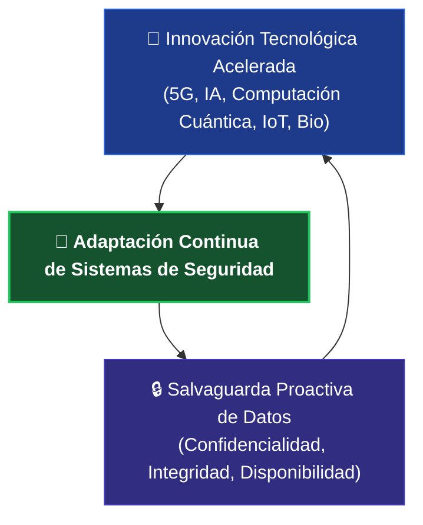

```
==========================================================================================
PUNTOS PARA RECORDAR - CONCEPTOS CLAVE
==========================================================================================

1. Las tecnologias emergentes son productos o servicios innovadores en las primeras fases
   de desarrollo, prueba o adopcion que tienen el potencial de revolucionar la vida, pero
   tambien de aumentar la vulnerabilidad a las ciberamenazas.

2. La inteligencia artificial (IA) es una tecnologia que involucra maquinas capaces de
   realizar tareas que normalmente requieren inteligencia humana.

3. La IA se puede emplear en ciberseguridad para tareas como la deteccion automatizada de
   malware, el analisis de comportamiento, la deteccion de patrones, el modelado predictivo,
   las evaluaciones automatizadas de vulnerabilidades y el analisis forense digital.

4. El Internet de las cosas (IoT) es una red de objetos fisicos integrados con sensores y
   tecnologias para conectarse e intercambiar datos. Los dispositivos IoT plantean riesgos
   para las ciberamenazas y requieren autenticacion solida, cifrado de datos, medidas de
   seguridad y actualizaciones periodicas.

5. 5G es la quinta generacion de redes celulares que proporciona conectividad mas rapida,
   baja latencia y mayor ancho de banda.

6. La 5G ofrece nuevas oportunidades, pero tambien crea vulnerabilidades en materia de
   proteccion de datos y privacidad.

7. Las organizaciones deben proteger las redes 5G con encriptacion, autenticacion, gestion
   de identidades y supervision proactiva.

8. La computacion cuantica emplea la mecanica cuantica para resolver problemas complejos
   mas rapido que las computadoras tradicionales.

9. La computacion cuantica tiene aplicaciones en ciberseguridad para una deteccion mas
   rapida de las amenazas, protocolos avanzados de encriptacion e identificacion mas
   precisa del codigo malicioso.

10. Las mejoras y tecnologias de biotecnologia pueden mejorar vidas, pero las medidas de
    ciberseguridad son necesarias para proteger la informacion personal y controlar los
    sistemas automatizados.

11. Los avances en genomica, nanotecnologia, IA, autenticacion biometrica y sensores
    basados en la biotecnologia se emplean para mejorar la ciberseguridad.

12. A medida que avanzan las tecnologias emergentes, los sistemas de seguridad deben
    evolucionar para contrarrestar las nuevas ciberamenazas. Una planeacion, unos recursos
    y unas medidas de seguridad adecuados pueden minimizar los riesgos y maximizar los
    beneficios potenciales de las tecnologias emergentes.

==========================================================================================
GRANDES IDEAS - HABILIDADES PRACTICADAS
==========================================================================================

Habilidades para la insercion laboral:

- Mentalidad de crecimiento
- Comunicacion escrita
- Pensamiento analitico

Actividades:

- Enumerar las tecnologias emergentes de las que ya eras consciente
- Examinar las habilidades que mejor conoces y las que te gustaria mejorar
- Identificar las certificaciones que te gustaria obtener
- Identificar los trabajos que mas te atraen y por que
- Resumir las amenazas emergentes a la ciberseguridad
- Describir el futuro de las tecnologias de ciberseguridad
- Describir el impacto de la tecnologia emergente en el campo de la ciberseguridad
- Explorar las carreras, certificaciones y habilidades de ciberseguridad que aprendiste

==========================================================================================
OBJETIVOS DE APRENDIZAJE
==========================================================================================

Ahora que has completado este modulo, deberias poder:

- Resumir las amenazas emergentes de ciberseguridad
- Describir el futuro de las tecnologias de ciberseguridad
- Describir el impacto de la tecnologia emergente en el ambito de la ciberseguridad

==========================================================================================

```

---

## 📚 Recursos de Profundización y Referencias Bibliográficas

### 🔍 Recursos Adicionales para el Desarrollo Profesional

Para profundizar en los conceptos de vanguardia discutidos a lo largo de este módulo, se listan los siguientes recursos audiovisuales y de investigación provistos por especialistas de la industria:

* **📺 Tendencias de Ciberseguridad:** Análisis de Jeff Crume (Ingeniero Distinguido de IBM Security) sobre la evolución del *ransomware*, el rol crítico de MFA, el avance de la Inteligencia Artificial, las amenazas de *deepfakes* y el impacto de la computación cuántica.
* **📺 Mapeo del Futuro de la Tecnología:** Conferencia de Darío Gil (Vicepresidente Sénior y Director de Investigación de IBM) enfocada en la importancia de trazar e interconectar guías de navegación para tecnologías que aún no se han descubierto.
* **📺 IA en Ciberseguridad (Multiplicador de Fuerza):** Explicación técnica de Jeff Crume sobre cómo la Inteligencia Artificial permite a las organizaciones optimizar la velocidad y la eficacia de sus defensas operativas.
* **📺 Convergencia Tecnológica (Quantum, AI y Nube Híbrida):** Panel de investigadores de IBM enfocado en el futuro de la computación mediante la integración sinérgica de la IA, el procesamiento cuántico y arquitecturas híbridas.
* **📺 Carreras y Oportunidades en Ciberseguridad:** Guía de orientación profesional a cargo de Jeff Crume que analiza las demandas del mercado actual y las trayectorias para profesionales de la seguridad.

---

### 📄 Fuentes y Referencias Oficiales del Módulo

A continuación se detalla el repositorio bibliográfico y las fuentes documentales utilizadas para el desarrollo de este módulo sobre amenazas emergentes y tecnologías de próxima generación:

1. **Inteligencia Artificial:** 
   * Feingold, Spencer. *¿Qué es la inteligencia artificial y qué no lo es?* Foro Económico Mundial (8 de marzo de 2023).
   * *¿Qué es la inteligencia artificial (IA)?* IBM (Consultado: junio 2024).
   * *IA y automatización para la ciberseguridad.* IBM Institute for Business Value (Consultado: junio 2024).
2. **Infraestructura de Conectividad y Redes Masivas:**
   * *¿Qué es Internet de las cosas (IoT)?* IBM (Consultado: junio 2024).
   * *5G explained.* Ericsson (Consultado: junio 2024).
3. **Casos de Estudio Forense y Operaciones de Seguridad:**
   * *Emotet Botnet Disrupted in International Cyber Operation.* Departamento de Justicia de los EE. UU. (28 de enero de 2021).
4. **Computación Avanzada y Ciencias Biológicas:**
   * *¿Qué es la computación cuántica?* IBM (Consultado: junio 2024).
   * *¿Qué es la biotecnología?* Organización de Innovación en Biotecnología (Consultado: junio 2024).

```
==========================================================================================
❓ PREGUNTA - PASOS PARA EMPLEAR UNA HERRAMIENTA EDR
==========================================================================================

Escenario:
Como profesional de la seguridad en TMBG Tecnologia Company, eres responsable de gestionar
la nueva herramienta de deteccion y respuesta de endpoints (EDR) de la compañia.

Pregunta:
Luego de instalar agentes en los dispositivos endpoint, cual es el siguiente paso?

==========================================================================================
✅ RESPUESTA CORRECTA
==========================================================================================

Gestion de los agentes a traves de una consola centralizada

==========================================================================================
📌 EXPLICACION - ORDEN CORRECTO DE LOS PASOS EDR
==========================================================================================

┌─────────────────────────────────────────────────────────────────────────────────────────┐
│  PASO 1: INSTALAR                                                                      │
├─────────────────────────────────────────────────────────────────────────────────────────┤
│  Instalar agentes en cada dispositivo endpoint (laptops, servidores, moviles)          │
└─────────────────────────────────────────────────────────────────────────────────────────┘
                                      │
                                      ▼
┌─────────────────────────────────────────────────────────────────────────────────────────┐
│  PASO 2: CONECTAR Y GESTIONAR (RESPUESTA CORRECTA)                                     │
├─────────────────────────────────────────────────────────────────────────────────────────┤
│  Gestionar los agentes a traves de una consola centralizada                            │
│  Monitorear la actividad en todos los endpoints desde un panel                         │
│  Analizar los datos con el motor de analytics                                          │
└─────────────────────────────────────────────────────────────────────────────────────────┘
                                      │
                                      ▼
┌─────────────────────────────────────────────────────────────────────────────────────────┐
│  PASO 3: IDENTIFICAR Y RESPONDER                                                       │
├─────────────────────────────────────────────────────────────────────────────────────────┤
│  Detectar actividad maliciosa                                                          │
│  Aislar el dispositivo afectado de la red                                              │
│  Bloquear el proceso malicioso                                                         │
└─────────────────────────────────────────────────────────────────────────────────────────┘
                                      │
                                      ▼
┌─────────────────────────────────────────────────────────────────────────────────────────┐
│  PASO 4: MAPEAR Y ANALIZAR                                                             │
├─────────────────────────────────────────────────────────────────────────────────────────┤
│  Mapear la secuencia de ataque mediante algoritmos avanzados                           │
│  Analizar patrones de comportamiento y tipos de archivos                               │
└─────────────────────────────────────────────────────────────────────────────────────────┘

==========================================================================================
❌ POR QUE LAS OTRAS OPCIONES SON POSTERIORES
==========================================================================================

┌─────────────────────────────────────────────────────────────────────────────────────────┐
│  OPCION              │  CUANDO OCURRE                                                 │
├─────────────────────────────────────────────────────────────────────────────────────────┤
│  Aislar dispositivo  │  DESPUES de detectar una actividad maliciosa                   │
│  Analizar patrones   │  DESPUES de aislar y durante la investigacion                  │
│  Mapear secuencia    │  DESPUES de aislar, durante el analisis profundo               │
└─────────────────────────────────────────────────────────────────────────────────────────┘

==========================================================================================
📊 ORDEN CORRECTO DE LOS PASOS EDR
==========================================================================================

  1. INSTALAR agentes en los endpoints
  2. GESTIONAR agentes desde consola centralizada ✓
  3. MONITOREAR actividad en tiempo real
  4. DETECTAR actividad maliciosa
  5. AISLAR dispositivo afectado
  6. BLOQUEAR proceso malicioso
  7. MAPEAR secuencia de ataque
  8. ANALIZAR patrones y archivos

==========================================================================================
```
```
==========================================================================================
❓ PREGUNTA - SISTEMA PARA ATRAER ATACANTES
==========================================================================================

Escenario:
Una compañia de servicios financieros establece un sistema para atraer a los atacantes
y recopilar informacion sobre sus tacticas sin poner en peligro la red.

==========================================================================================
✅ RESPUESTA CORRECTA
==========================================================================================

Honeypot

==========================================================================================
📌 EXPLICACION
==========================================================================================

┌─────────────────────────────────────────────────────────────────────────────────────────┐
│  HONEYPOT (TARRO DE MIEL)                                                              │
├─────────────────────────────────────────────────────────────────────────────────────────┤
│                                                                                         │
│  • Es un SISTEMA SEÑUELO que simula ser un objetivo valioso                           │
│  • Atrae a los atacantes para que intenten comprometerlo                               │
│  • Permite estudiar sus tacticas sin arriesgar sistemas reales                         │
│  • Recopila informacion sobre: metodos de ataque, herramientas utilizadas,             │
│    procedimientos del atacante                                                         │
│  • Da tiempo al equipo de seguridad para responder                                     │
│                                                                                         │
└─────────────────────────────────────────────────────────────────────────────────────────┘

==========================================================================================
❌ POR QUE LAS OTRAS OPCIONES NO SON CORRECTAS
==========================================================================================

┌─────────────────────────────────────────────────────────────────────────────────────────┐
│  SEGMENTACION DE LA RED                                                               │
├─────────────────────────────────────────────────────────────────────────────────────────┤
│  • Divide la red en subredes mas pequeñas y aisladas                                   │
│  • Limita el movimiento lateral de los atacantes                                       │
│  • NO atrae atacantes ni recopila informacion sobre ellos                              │
└─────────────────────────────────────────────────────────────────────────────────────────┘

┌─────────────────────────────────────────────────────────────────────────────────────────┐
│  NAT (TRADUCCION DE DIRECCIONES DE RED)                                                │
├─────────────────────────────────────────────────────────────────────────────────────────┤
│  • Traduce direcciones IP privadas a publicas y viceversa                              │
│  • Permite que multiples dispositivos compartan una IP publica                         │
│  • NO es un sistema señuelo ni recopila informacion de atacantes                       │
└─────────────────────────────────────────────────────────────────────────────────────────┘

┌─────────────────────────────────────────────────────────────────────────────────────────┐
│  EXTRANET                                                                              │
├─────────────────────────────────────────────────────────────────────────────────────────┤
│  • Extension de la red interna de una empresa para socios o clientes                   │
│  • Permite acceso controlado a ciertos recursos                                        │
│  • NO es un sistema para atraer atacantes                                              │
└─────────────────────────────────────────────────────────────────────────────────────────┘

==========================================================================================
📊 COMPARACION RAPIDA
==========================================================================================

┌─────────────────────────────────────────────────────────────────────────────────────────┐
│  HERRAMIENTA        │  PROPOSITO                                                      │
├─────────────────────────────────────────────────────────────────────────────────────────┤
│  Honeypot           │  Atraer atacantes y estudiar sus tacticas                       │
│  Segmentacion       │  Aislar partes de la red para limitar el dano                    │
│  NAT                │  Ocultar IPs privadas y traducir direcciones                     │
│  Extranet           │  Dar acceso controlado a externos autorizados                    │
└─────────────────────────────────────────────────────────────────────────────────────────┘

==========================================================================================
```
```
==========================================================================================
❓ PREGUNTA - SISTEMA OPERATIVO PARA COMPARTIR ARCHIVOS EN EQUIPO
==========================================================================================

Escenario:
Eres un pasante de ciberseguridad que colabora con un grupo mas grande de pasantes en un
proyecto. Necesitas compartir un archivo con los afiliados a tu grupo.

==========================================================================================
✅ RESPUESTA CORRECTA
==========================================================================================

Sistema operativo distribuido

==========================================================================================
📌 EXPLICACION
==========================================================================================

┌─────────────────────────────────────────────────────────────────────────────────────────┐
│  SISTEMA OPERATIVO DISTRIBUIDO                                                         │
├─────────────────────────────────────────────────────────────────────────────────────────┤
│                                                                                         │
│  • Permite que MULTIPLES USUARIOS trabajen juntos en red                               │
│  • Facilita COMPARTIR ARCHIVOS entre diferentes computadoras                          │
│  • Los recursos remotos parecen locales                                                │
│  • Ideal para TRABAJO COLABORATIVO y equipos                                           │
│  • Ejemplos: Unix, Linux, Windows Server en red                                        │
│                                                                                         │
└─────────────────────────────────────────────────────────────────────────────────────────┘

==========================================================================================
❌ POR QUE LAS OTRAS OPCIONES NO SON CORRECTAS
==========================================================================================

┌─────────────────────────────────────────────────────────────────────────────────────────┐
│  SISTEMA OPERATIVO POR LOTES                                                           │
├─────────────────────────────────────────────────────────────────────────────────────────┤
│  • Procesa trabajos en SECUENCIA, uno tras otro                                        │
│  • No permite interaccion del usuario durante el proceso                               │
│  • NO esta diseñado para compartir archivos en equipo                                  │
│  • Ejemplo: sistemas de procesamiento de transacciones bancarias                       │
└─────────────────────────────────────────────────────────────────────────────────────────┘

┌─────────────────────────────────────────────────────────────────────────────────────────┐
│  SISTEMA OPERATIVO MULTIPROGRAMACION                                                   │
├─────────────────────────────────────────────────────────────────────────────────────────┤
│  • Ejecuta VARIOS PROGRAMAS a la vez en un solo procesador                             │
│  • Mejora la eficiencia del CPU                                                        │
│  • NO esta diseñado especificamente para compartir archivos en red                     │
└─────────────────────────────────────────────────────────────────────────────────────────┘

┌─────────────────────────────────────────────────────────────────────────────────────────┐
│  SISTEMA OPERATIVO MULTIPROCESADOR                                                     │
├─────────────────────────────────────────────────────────────────────────────────────────┤
│  • Usa MULTIPLES CPUs para ejecutar tareas                                             │
│  • Mejora el rendimiento y la potencia de computo                                      │
│  • NO esta diseñado especificamente para compartir archivos en equipo                  │
└─────────────────────────────────────────────────────────────────────────────────────────┘

==========================================================================================
📊 COMPARACION RAPIDA
==========================================================================================

┌─────────────────────────────────────────────────────────────────────────────────────────┐
│  TIPO DE SO                    │  CARACTERISTICA PRINCIPAL                            │
├─────────────────────────────────────────────────────────────────────────────────────────┤
│  DISTRIBUIDO                   │  MULTIPLES USUARIOS comparten archivos en RED        │
│  POR LOTES                     │  Procesa tareas en SECUENCIA sin interaccion          │
│  MULTIPROGRAMACION             │  Ejecuta VARIOS PROGRAMAS en un CPU                   │
│  MULTIPROCESADOR               │  Usa VARIOS CPUs para mayor rendimiento               │
└─────────────────────────────────────────────────────────────────────────────────────────┘

==========================================================================================
```
```
==========================================================================================
❓ PREGUNTA - TIPO DE CIFRADO PARA TRANSFERENCIA DE DATOS
==========================================================================================

Escenario:
Una compañia esta transfiriendo datos entre su cliente y su servidor.
El cliente cifra los datos con la clave publica del servidor.
El servidor descifra los datos empleando su clave privada.

==========================================================================================
✅ RESPUESTA CORRECTA
==========================================================================================

Cifrado asimetrico

==========================================================================================
📌 EXPLICACION
==========================================================================================

┌─────────────────────────────────────────────────────────────────────────────────────────┐
│  CIFRADO ASIMETRICO                                                                     │
├─────────────────────────────────────────────────────────────────────────────────────────┤
│                                                                                         │
│  • Usa un PAR DE CLAVES: CLAVE PUBLICA y CLAVE PRIVADA                                 │
│  • Lo que se cifra con la clave PUBLICA solo se descifra con la clave PRIVADA          │
│  • Lo que se cifra con la clave PRIVADA solo se descifra con la clave PUBLICA          │
│                                                                                         │
│  En el escenario:                                                                       │
│  • Cliente cifra con CLAVE PUBLICA del servidor                                        │
│  • Servidor descifra con su CLAVE PRIVADA                                              │
│                                                                                         │
│  • Ejemplo: SSL/TLS, HTTPS, PGP                                                        │
│                                                                                         │
└─────────────────────────────────────────────────────────────────────────────────────────┘

==========================================================================================
❌ POR QUE LAS OTRAS OPCIONES NO SON CORRECTAS
==========================================================================================

┌─────────────────────────────────────────────────────────────────────────────────────────┐
│  CIFRADO SIMETRICO                                                                     │
├─────────────────────────────────────────────────────────────────────────────────────────┤
│  • Usa una SOLA CLAVE para cifrar y descifrar                                          │
│  • La misma clave se comparte entre ambas partes                                        │
│  • NO coincide con la descripcion (cliente y servidor usan claves diferentes)          │
│  • Ejemplo: AES, DES                                                                   │
└─────────────────────────────────────────────────────────────────────────────────────────┘

┌─────────────────────────────────────────────────────────────────────────────────────────┐
│  FIREWALL                                                                              │
├─────────────────────────────────────────────────────────────────────────────────────────┤
│  • Controla el trafico de red (permite o bloquea conexiones)                           │
│  • NO es un metodo de cifrado                                                          │
│  • NO aplica a la descripcion                                                          │
└─────────────────────────────────────────────────────────────────────────────────────────┘

┌─────────────────────────────────────────────────────────────────────────────────────────┐
│  CERTIFICADO DIGITAL                                                                   │
├─────────────────────────────────────────────────────────────────────────────────────────┤
│  • Es un documento digital que verifica la identidad                                   │
│  • Contiene la clave publica de una entidad                                            │
│  • NO es el metodo de cifrado en si mismo, sino que se USA en el cifrado asimetrico    │
└─────────────────────────────────────────────────────────────────────────────────────────┘

==========================================================================================
📊 COMPARACION CIFRADO SIMETRICO vs ASIMETRICO
==========================================================================================

┌─────────────────────────────────────────────────────────────────────────────────────────┐
│  CARACTERISTICA     │  CIFRADO SIMETRICO  │  CIFRADO ASIMETRICO                       │
├─────────────────────────────────────────────────────────────────────────────────────────┤
│  Claves             │  Una sola clave     │  Par de claves (publica + privada)         │
│  Velocidad          │  Rapido             │  Lento                                     │
│  Distribucion claves│  Dificil            │  Facil (clave publica es abierta)          │
│  Ejemplo            │  AES, DES           │  RSA, ECC                                   │
│  Uso tipico         │  Cifrado de datos   │  Intercambio de claves, firmas digitales   │
│                      │  masivos            │                                            │
└─────────────────────────────────────────────────────────────────────────────────────────┘

==========================================================================================
```

```
==========================================================================================
❓ PREGUNTA - VALOR DE LA HERRAMIENTA EDR
==========================================================================================

Contexto:
Las herramientas de EDR son componentes esenciales de los planes de respuesta, ya que
mejoran la capacidad de identificar y eliminar amenazas mientras responden a problemas
de seguridad.

Pregunta:
Cual es el valor de esta caracteristica de la herramienta EDR?

==========================================================================================
✅ RESPUESTA CORRECTA
==========================================================================================

Minimizar el impacto de los incidentes de seguridad

==========================================================================================
📌 EXPLICACION
==========================================================================================

┌─────────────────────────────────────────────────────────────────────────────────────────┐
│  VALOR PRINCIPAL DE EDR                                                                │
├─────────────────────────────────────────────────────────────────────────────────────────┤
│                                                                                         │
│  • Detecta amenazas en TIEMPO REAL                                                     │
│  • RESPUESTA RAPIDA para contener la amenaza                                           │
│  • Aisla endpoints infectados para evitar propagacion                                 │
│  • Reduce el TIEMPO DE RESPUESTA (MTTR)                                                │
│  • El objetivo final es MINIMIZAR EL DAÑO                                              │
│                                                                                         │
└─────────────────────────────────────────────────────────────────────────────────────────┘

==========================================================================================
❌ POR QUE LAS OTRAS OPCIONES NO SON CORRECTAS
==========================================================================================

┌─────────────────────────────────────────────────────────────────────────────────────────┐
│  MEJORA DE LA ESCALABILIDAD DE LA RED                                                  │
├─────────────────────────────────────────────────────────────────────────────────────────┤
│  • EDR NO mejora la escalabilidad de la red                                            │
│  • La escalabilidad es funcion del diseño de red, no de EDR                           │
└─────────────────────────────────────────────────────────────────────────────────────────┘

┌─────────────────────────────────────────────────────────────────────────────────────────┐
│  MITIGACION DE AMENAZAS FISICAS                                                        │
├─────────────────────────────────────────────────────────────────────────────────────────┤
│  • EDR protege ENDPOINTS (dispositivos), no amenazas fisicas                          │
│  • Amenazas fisicas se mitigan con controles fisicos (camaras, guardias, etc.)         │
└─────────────────────────────────────────────────────────────────────────────────────────┘

┌─────────────────────────────────────────────────────────────────────────────────────────┐
│  PREVENCION DE AMENAZAS INTERNAS                                                        │
├─────────────────────────────────────────────────────────────────────────────────────────┤
│  • EDR puede ayudar a detectar amenazas internas, pero NO es su valor principal        │
│  • Su valor principal es DETECTAR y RESPONDER a amenazas en general                    │
│  • La prevencion de amenazas internas requiere IAM, POLP, monitoreo de usuarios        │
└─────────────────────────────────────────────────────────────────────────────────────────┘

==========================================================================================
📊 BENEFICIOS CLAVE DE EDR
==========================================================================================

┌─────────────────────────────────────────────────────────────────────────────────────────┐
│  BENEFICIO                    │  DESCRIPCION                                           │
├─────────────────────────────────────────────────────────────────────────────────────────┤
│  DETECCION PROACTIVA          │  Identifica amenazas avanzadas y nuevas                │
│  RESPUESTA RAPIDA             │  Alertas en tiempo real, respuesta automatica          │
│  GESTION EFICIENTE            │  Panel centralizado para monitorear endpoints          │
│  REDUCCION DE IMPACTO         │  MINIMIZA el daño causado por incidentes (CORRECTO)   │
└─────────────────────────────────────────────────────────────────────────────────────────┘

==========================================================================================
```

```
==========================================================================================
❓ PREGUNTA - TIPO DE CAPACITACION PARA EMAILS SOSPECHOSOS
==========================================================================================

Escenario:
Una corporacion realiza de manera regular simulacros de seguridad para evaluar la conciencia
y la capacidad de respuesta de su personal para reconocer y marcar emails sospechosos.

==========================================================================================
✅ RESPUESTA CORRECTA
==========================================================================================

Capacitacion en phishing

==========================================================================================
📌 EXPLICACION
==========================================================================================

┌─────────────────────────────────────────────────────────────────────────────────────────┐
│  CAPACITACION EN PHISHING                                                              │
├─────────────────────────────────────────────────────────────────────────────────────────┤
│                                                                                         │
│  • SIMULA ataques de phishing del mundo real                                           │
│  • Ensea a los empleados a IDENTIFICAR emails sospechosos                              │
│  • Practica como REPORTAR intentos de phishing                                         │
│  • Evalua la conciencia y respuesta del personal                                       │
│  • Reduce el riesgo de caer en ataques reales                                          │
│                                                                                         │
└─────────────────────────────────────────────────────────────────────────────────────────┘

==========================================================================================
❌ POR QUE LAS OTRAS OPCIONES NO SON CORRECTAS
==========================================================================================

┌─────────────────────────────────────────────────────────────────────────────────────────┐
│  CAPACITACION RECURRENTE                                                               │
├─────────────────────────────────────────────────────────────────────────────────────────┤
│  • Se repite PERIODICAMENTE para reforzar conocimientos                                │
│  • Actualiza sobre nuevas amenazas y politicas                                         │
│  • NO se enfoca especificamente en simulaciones de phishing                            │
└─────────────────────────────────────────────────────────────────────────────────────────┘

┌─────────────────────────────────────────────────────────────────────────────────────────┐
│  CAPACITACION DE INCORPORACION                                                         │
├─────────────────────────────────────────────────────────────────────────────────────────┤
│  • Se da a NUEVOS EMPLEADOS al ingresar a la empresa                                   │
│  • Cubre requisitos, riesgos y protocolos basicos                                       │
│  • NO son simulacros regulares de phishing                                             │
└─────────────────────────────────────────────────────────────────────────────────────────┘

┌─────────────────────────────────────────────────────────────────────────────────────────┐
│  CAPACITACION EN CUMPLIMIENTO                                                          │
├─────────────────────────────────────────────────────────────────────────────────────────┤
│  • Se enfoca en LEYES, REGULACIONES y requisitos de la industria                       │
│  • Ejemplo: GDPR, HIPAA, PCI-DSS                                                       │
│  • NO incluye simulacros de phishing                                                   │
└─────────────────────────────────────────────────────────────────────────────────────────┘

==========================================================================================
📊 COMPARACION DE TIPOS DE CAPACITACION
==========================================================================================

┌─────────────────────────────────────────────────────────────────────────────────────────┐
│  TIPO                      │  ENFOQUE PRINCIPAL                                        │
├─────────────────────────────────────────────────────────────────────────────────────────┤
│  PHISHING                  │  Simular ataques para reconocer emails falsos ✓           │
│  RECURRENTE                │  Refrescar conocimientos periodicamente                   │
│  INCORPORACION             │  Capacitar a NUEVOS empleados                             │
│  CUMPLIMIENTO              │  Ensenar LEYES y regulaciones                             │
└─────────────────────────────────────────────────────────────────────────────────────────┘

==========================================================================================
```

```
==========================================================================================
❓ PREGUNTA - ESTRATEGIA DE CIBERSEGURIDAD
==========================================================================================

Escenario:
Una compañia implementa la segmentacion de la red, la autenticacion multifactor y la
capacitacion periodica de los empleados.

Pregunta:
Que estrategia de ciberseguridad ilustra este escenario?

==========================================================================================
✅ RESPUESTA CORRECTA
==========================================================================================

Capas

==========================================================================================
📌 EXPLICACION
==========================================================================================

┌─────────────────────────────────────────────────────────────────────────────────────────┐
│  SEGURIDAD POR CAPAS (DEFENSE IN DEPTH)                                                │
├─────────────────────────────────────────────────────────────────────────────────────────┤
│                                                                                         │
│  • Consiste en implementar MULTIPLES niveles de seguridad                              │
│  • Si una capa falla, las otras continúan protegiendo                                 │
│  • Ninguna medida por si sola es suficiente                                            │
│                                                                                         │
│  En el escenario:                                                                       │
│                                                                                         │
│  CAPA 1: Segmentacion de la red (control de trafico)                                   │
│  CAPA 2: Autenticacion multifactor (control de acceso)                                 │
│  CAPA 3: Capacitacion de empleados (factor humano)                                     │
│                                                                                         │
└─────────────────────────────────────────────────────────────────────────────────────────┘

==========================================================================================
❌ POR QUE LAS OTRAS OPCIONES NO SON CORRECTAS
==========================================================================================

┌─────────────────────────────────────────────────────────────────────────────────────────┐
│  INTEGRACION                                                                           │
├─────────────────────────────────────────────────────────────────────────────────────────┤
│  • Se refiere a como diferentes sistemas trabajan juntos                               │
│  • NO es la estrategia principal que describe multiples capas de seguridad            │
└─────────────────────────────────────────────────────────────────────────────────────────┘

┌─────────────────────────────────────────────────────────────────────────────────────────┐
│  REDUNDANCIA                                                                           │
├─────────────────────────────────────────────────────────────────────────────────────────┤
│  • Consiste en tener DUPLICADOS de sistemas para evitar caidas                         │
│  • Ejemplo: servidores espejo, fuentes de poder redundantes                            │
│  • NO describe diferentes TIPOS de medidas de seguridad                                │
└─────────────────────────────────────────────────────────────────────────────────────────┘

┌─────────────────────────────────────────────────────────────────────────────────────────┐
│  COMPLEJIDAD                                                                           │
├─────────────────────────────────────────────────────────────────────────────────────────┤
│  • Se refiere a lo dificil que es entender o gestionar un sistema                      │
│  • NO es una estrategia de seguridad deseable (la complejidad excesiva es mala)        │
└─────────────────────────────────────────────────────────────────────────────────────────┘

==========================================================================================
📊 EJEMPLO DE SEGURIDAD POR CAPAS
==========================================================================================

┌─────────────────────────────────────────────────────────────────────────────────────────┐
│  CAPA                      │  MEDIDA DE SEGURIDAD                                      │
├─────────────────────────────────────────────────────────────────────────────────────────┤
│  CAPA FISICA              │  Guardias, camaras, puertas con cerradura                   │
│  CAPA DE RED              │  Firewalls, segmentacion, IDS/IPS                           │
│  CAPA DE ACCESO           │  Autenticacion multifactor (MFA), RBAC                      │
│  CAPA DE APLICACION       │  Firewalls de aplicaciones (WAF), cifrado                   │
│  CAPA DE DATOS            │  Cifrado de datos en reposo y en transito                   │
│  CAPA HUMANA              │  Capacitacion, concienciacion, simulacros de phishing       │
└─────────────────────────────────────────────────────────────────────────────────────────┘

==========================================================================================
✅ CONCLUSION
==========================================================================================

  El escenario describe TRES medidas de seguridad diferentes:

  1. Segmentacion de red → protege la red
  2. Autenticacion multifactor → protege el acceso
  3. Capacitacion de empleados → protege el factor humano

  Esto es SEGURIDAD POR CAPAS (defense in depth).

==========================================================================================
```

```
==========================================================================================
❓ PREGUNTA - TIPO DE SISTEMA OPERATIVO
==========================================================================================

Escenario:
TechServe emplea un sistema de ciberseguridad que requiere un sistema operativo optimizado
para tareas como: navegacion web, acceso a email, creacion de documentos y diseño grafico.

Pregunta:
Que tipo de sistema operativo seria la opcion mas adecuada para sus necesidades?

==========================================================================================
✅ RESPUESTA CORRECTA
==========================================================================================

Sistema operativo de la estacion de trabajo

==========================================================================================
📌 EXPLICACION
==========================================================================================

┌─────────────────────────────────────────────────────────────────────────────────────────┐
│  SISTEMA OPERATIVO DE ESTACION DE TRABAJO (WORKSTATION OS)                             │
├─────────────────────────────────────────────────────────────────────────────────────────┤
│                                                                                         │
│  • Diseñado para TAREAS DE USUARIO FINAL                                               │
│  • Optimizado para INTERFAZ GRAFICA y aplicaciones de escritorio                       │
│  • Ejemplos: Windows 10/11, macOS, Linux (Ubuntu, Fedora)                              │
│                                                                                         │
│  Las tareas mencionadas son tipicas de una estacion de trabajo:                        │
│  • Navegacion web                                                                      │
│  • Acceso a email                                                                      │
│  • Creacion de documentos                                                              │
│  • Diseño grafico                                                                      │
│                                                                                         │
└─────────────────────────────────────────────────────────────────────────────────────────┘

==========================================================================================
❌ POR QUE LAS OTRAS OPCIONES NO SON CORRECTAS
==========================================================================================

┌─────────────────────────────────────────────────────────────────────────────────────────┐
│  SISTEMA OPERATIVO MOVIL                                                               │
├─────────────────────────────────────────────────────────────────────────────────────────┤
│  • Diseñado para dispositivos MOVILES (smartphones, tablets)                           │
│  • Ejemplos: Android, iOS                                                              │
│  • NO es optimo para diseño grafico o creacion extensiva de documentos                │
│  • Las aplicaciones son mas limitadas que en una estacion de trabajo                   │
└─────────────────────────────────────────────────────────────────────────────────────────┘

┌─────────────────────────────────────────────────────────────────────────────────────────┐
│  SISTEMA OPERATIVO DE SERVIDOR                                                         │
├─────────────────────────────────────────────────────────────────────────────────────────┤
│  • Diseñado para SERVIDORES (servir recursos a otros equipos)                          │
│  • Ejemplos: Windows Server, Linux Server (Red Hat, Ubuntu Server)                     │
│  • Optimizado para: manejo de conexiones, bases de datos, servicios web                │
│  • NO esta optimizado para tareas de usuario final como diseño grafico                 │
│  • Generalmente NO tiene interfaz grafica                                               │
└─────────────────────────────────────────────────────────────────────────────────────────┘

==========================================================================================
📊 COMPARACION DE SISTEMAS OPERATIVOS
==========================================================================================

┌─────────────────────────────────────────────────────────────────────────────────────────┐
│  TIPO DE SO               │  USO PRINCIPAL                                            │
├─────────────────────────────────────────────────────────────────────────────────────────┤
│  ESTACION DE TRABAJO      │  Tareas de USUARIO FINAL (web, email, documentos) ✓       │
│  MOVIL                    │  Dispositivos MOVILES (smartphones, tablets)               │
│  SERVIDOR                 │  Proveer SERVICIOS a otros equipos                         │
└─────────────────────────────────────────────────────────────────────────────────────────┘

==========================================================================================
✅ CONCLUSION
==========================================================================================

  Navegacion web, email, documentos y diseño grafico son tareas de USUARIO FINAL.
  Estas tareas se realizan en ESTACIONES DE TRABAJO.
  Por lo tanto, se necesita un SISTEMA OPERATIVO DE ESTACION DE TRABAJO.

==========================================================================================
```

```
==========================================================================================
❓ PREGUNTA - AMENAZA DE CIBERSEGURIDAD EN LA NUBE
==========================================================================================

Escenario:
CyberSecure experimenta una brecha resultante de la configuracion incorrecta de su
infraestructura en la nube, que expone los datos de los clientes. Esta violacion implica
el uso de soluciones tecnologicas no autorizadas dentro de la organizacion.

Pregunta:
Que amenaza ejemplifica este escenario?

==========================================================================================
✅ RESPUESTA CORRECTA
==========================================================================================

Configuracion incorrecta de la nube

==========================================================================================
📌 EXPLICACION
==========================================================================================

┌─────────────────────────────────────────────────────────────────────────────────────────┐
│  CONFIGURACION INCORRECTA DE LA NUBE (CLOUD MISCONFIGURATION)                          │
├─────────────────────────────────────────────────────────────────────────────────────────┤
│                                                                                         │
│  • Es UNA DE LAS PRINCIPALES CAUSAS de brechas en la nube                              │
│  • Ocurre cuando los recursos en la nube estan MAL CONFIGURADOS                        │
│  • Ejemplos: buckets de almacenamiento PUBLICOS, puertos abiertos,                     │
│    permisos excesivos, cifrado desactivado                                             │
│                                                                                         │
│  En el escenario:                                                                       │
│  • "configuracion incorrecta de su infraestructura en la nube" → CAUSA DIRECTA         │
│  • "expone los datos de los clientes" → CONSECUENCIA                                   │
│                                                                                         │
└─────────────────────────────────────────────────────────────────────────────────────────┘

==========================================================================================
❌ POR QUE LAS OTRAS OPCIONES NO SON CORRECTAS
==========================================================================================

┌─────────────────────────────────────────────────────────────────────────────────────────┐
│  IDENTIDADES MAL GESTIONADAS                                                           │
├─────────────────────────────────────────────────────────────────────────────────────────┤
│  • Se refiere a MAL manejo de usuarios, credenciales y permisos                        │
│  • Ejemplo: cuentas sin revocar, falta de MFA                                          │
│  • NO es la causa principal mencionada en el escenario                                 │
└─────────────────────────────────────────────────────────────────────────────────────────┘

┌─────────────────────────────────────────────────────────────────────────────────────────┐
│  DENEGACION DE SERVICIO (DOS)                                                          │
├─────────────────────────────────────────────────────────────────────────────────────────┤
│  • Es un ataque que busca SATURAR recursos para que no esten disponibles               │
│  • Causa INDISPONIBILIDAD, no exposicion de datos                                      │
│  • NO coincide con el escenario                                                        │
└─────────────────────────────────────────────────────────────────────────────────────────┘

┌─────────────────────────────────────────────────────────────────────────────────────────┐
│  USO NO AUTORIZADO DE CARGAS DE TRABAJO EN LA NUBE (TI EN LA SOMBRA)                   │
├─────────────────────────────────────────────────────────────────────────────────────────┤
│  • Se refiere al uso de SERVICIOS NO APROBADOS por empleados                           │
│  • Ejemplo: usar Dropbox personal para guardar datos de la empresa                     │
│  • Es una CAUSA POSIBLE (mencionada en el escenario), pero la brecha fue por           │
│    CONFIGURACION INCORRECTA de la infraestructura                                      │
└─────────────────────────────────────────────────────────────────────────────────────────┘

==========================================================================================
📊 COMPARACION DE AMENAZAS EN LA NUBE
==========================================================================================

┌─────────────────────────────────────────────────────────────────────────────────────────┐
│  AMENAZA                      │  DESCRIPCION                                           │
├─────────────────────────────────────────────────────────────────────────────────────────┤
│  CONFIGURACION INCORRECTA     │  Recursos MAL CONFIGURADOS (buckets publicos, etc.) ✓  │
│  IDENTIDADES MAL GESTIONADAS  │  Credenciales debiles, falta de MFA                    │
│  DOS                          │  Saturar recursos para causar caida                     │
│  TI EN LA SOMBRA              │  Uso de servicios NO APROBADOS por empleados            │
└─────────────────────────────────────────────────────────────────────────────────────────┘

==========================================================================================
✅ CONCLUSION
==========================================================================================

  La causa DIRECTA de la brecha fue la CONFIGURACION INCORRECTA de la nube.

  La TI en la sombra (uso no autorizado) puede haber contribuido, pero el problema
  principal que permitio la exposicion fue la MALA CONFIGURACION.

==========================================================================================
```

```
==========================================================================================
❓ PREGUNTA - COMPONENTE DE GOBERNANZA (CORREGIDO)
==========================================================================================

Escenario:
Buy4You establecio una regla de que todos los dispositivos de red deben tener firmware
actualizado y parches de seguridad aplicados dentro de las dos semanas posteriores al
lanzamiento.

Pregunta:
Que componente de gobernanza describe mejor este ejemplo?

==========================================================================================
✅ RESPUESTA CORRECTA
==========================================================================================

Directrices

==========================================================================================
📌 EXPLICACION CORREGIDA
==========================================================================================

┌─────────────────────────────────────────────────────────────────────────────────────────┐
│  DIRECTRICES (GUIDELINES)                                                              │
├─────────────────────────────────────────────────────────────────────────────────────────┤
│                                                                                         │
│  • Son RECOMENDACIONES o LINEAMIENTOS generales                                        │
│  • Indican el COMPORTAMIENTO ESPERADO                                                  │
│  • No son estrictamente obligatorias (no tienen sanciones explicadas)                  │
│  • Ejemplo: "Los dispositivos deben actualizarse dentro de 2 semanas"                  │
│                                                                                         │
│  DIFERENCIA CLAVE:                                                                     │
│  • Politica: "Es obligatorio actualizar" (con consecuencias por incumplimiento)        │
│  • Directriz: "Se debe actualizar dentro de 2 semanas" (recomendacion fuerte)          │
│                                                                                         │
└─────────────────────────────────────────────────────────────────────────────────────────┘

==========================================================================================
❌ POR QUE LAS OTRAS OPCIONES NO ENCAJAN
==========================================================================================

┌─────────────────────────────────────────────────────────────────────────────────────────┐
│  POLITICAS                                                                             │
├─────────────────────────────────────────────────────────────────────────────────────────┤
│  • Son reglas OBLIGATORIAS con consecuencias claras por incumplimiento                 │
│  • El escenario NO menciona sanciones ni consecuencias                                 │
│  • Por eso el sistema lo considero INCORRECTO                                           │
└─────────────────────────────────────────────────────────────────────────────────────────┘

┌─────────────────────────────────────────────────────────────────────────────────────────┐
│  ESTANDARES                                                                            │
├─────────────────────────────────────────────────────────────────────────────────────────┤
│  • Definen REQUISITOS TECNICOS ESPECIFICOS (versiones, configuraciones exactas)        │
│  • El escenario NO especifica que firmware version ni que parches                      │
└─────────────────────────────────────────────────────────────────────────────────────────┘

┌─────────────────────────────────────────────────────────────────────────────────────────┐
│  PROCEDIMIENTOS                                                                        │
├─────────────────────────────────────────────────────────────────────────────────────────┤
│  • Describen PASOS ESPECIFICOS para realizar una tarea                                 │
│  • El escenario NO da una secuencia de pasos                                           │
└─────────────────────────────────────────────────────────────────────────────────────────┘

==========================================================================================
📊 COMPARACION FINAL
==========================================================================================

┌─────────────────────────────────────────────────────────────────────────────────────────┐
│  COMPONENTE         │  ENFOQUE                     │  EJEMPLO                          │
├─────────────────────────────────────────────────────────────────────────────────────────┤
│  POLITICA           │  Regla obligatoria           │  "Es obligatorio actualizar"      │
│  DIRECTRIZ          │  Recomendacion / lineamiento │  "Actualizar en 2 semanas" ✓       │
│  ESTANDAR           │  Requisito tecnico exacto    │  "Firmware v2.0 o superior"       │
│  PROCEDIMIENTO      │  Pasos especificos           │  "Paso 1, Paso 2, Paso 3"         │
└─────────────────────────────────────────────────────────────────────────────────────────┘

==========================================================================================
```

```
==========================================================================================
❓ PREGUNTA - VULNERABILIDAD EN IMPRESORA INALAMBRICA
==========================================================================================

Escenario:
Confias en una impresora inalambrica en tu oficina para imprimir documentos importantes.
Recientemente, notaste que la impresora a veces imprime contenido no relacionado o ilegible
y experimenta fallas inesperadas. Tras la investigacion, descubres que la impresora tiene
una vulnerabilidad que permite a personas no autorizadas controlar la impresora y manipular
sus operaciones a distancia.

Pregunta:
Que vulnerabilidad describe este escenario?

==========================================================================================
✅ RESPUESTA CORRECTA
==========================================================================================

Vulnerabilidad del control remoto en el firmware

==========================================================================================
📌 EXPLICACION
==========================================================================================

┌─────────────────────────────────────────────────────────────────────────────────────────┐
│  VULNERABILIDAD DEL CONTROL REMOTO EN EL FIRMWARE                                      │
├─────────────────────────────────────────────────────────────────────────────────────────┤
│                                                                                         │
│  • El FIRMWARE es el software interno del dispositivo                                  │
│  • Una vulnerabilidad en el firmware puede permitir CONTROL REMOTO                     │
│  • Atacantes pueden MANIPULAR las operaciones del dispositivo                         │
│  • Esto explica: impresiones no relacionadas, fallas inesperadas                       │
│                                                                                         │
│  En el escenario:                                                                       │
│  • "Permite a personas no autorizadas CONTROLAR la impresora" → CLAVE                  │
│  • "Manipular sus operaciones a distancia" → CONTROL REMOTO                            │
│                                                                                         │
└─────────────────────────────────────────────────────────────────────────────────────────┘

==========================================================================================
❌ POR QUE LAS OTRAS OPCIONES NO SON CORRECTAS
==========================================================================================

┌─────────────────────────────────────────────────────────────────────────────────────────┐
│  FALTA DE CIFRADO DE DATOS                                                             │
├─────────────────────────────────────────────────────────────────────────────────────────┤
│  • Permite que alguien INTERCEPTE o LEA los datos enviados                             │
│  • NO permite CONTROLAR la impresora ni manipular sus operaciones                      │
│  • No explica las impresiones no relacionadas                                          │
└─────────────────────────────────────────────────────────────────────────────────────────┘

┌─────────────────────────────────────────────────────────────────────────────────────────┐
│  DESBORDAMIENTO DE BUFFER EN EL SOFTWARE                                               │
├─────────────────────────────────────────────────────────────────────────────────────────┤
│  • Permite ejecutar CODIGO MALICIOSO en el dispositivo                                 │
│  • PODRIA permitir control remoto, pero es un tipo ESPECIFICO de vulnerabilidad        │
│  • El escenario NO describe un desbordamiento de búfer                                │
└─────────────────────────────────────────────────────────────────────────────────────────┘

┌─────────────────────────────────────────────────────────────────────────────────────────┐
│  CROSS-SITE SCRIPTING (XSS) EN APLICACIONES WEB                                        │
├─────────────────────────────────────────────────────────────────────────────────────────┤
│  • Afecta a APLICACIONES WEB, no a impresoras                                          │
│  • Permite inyectar codigo malicioso en sitios web                                     │
│  • NO es relevante para este escenario                                                 │
└─────────────────────────────────────────────────────────────────────────────────────────┘

==========================================================================================
📊 COMPARACION DE VULNERABILIDADES
==========================================================================================

┌─────────────────────────────────────────────────────────────────────────────────────────┐
│  VULNERABILIDAD                       │  EFECTO PRINCIPAL                              │
├─────────────────────────────────────────────────────────────────────────────────────────┤
│  CONTROL REMOTO EN FIRMWARE           │  CONTROL TOTAL del dispositivo ✓               │
│  FALTA DE CIFRADO                     │  INTERCEPCION de datos (lectura)               │
│  DESBORDAMIENTO DE BUFFER             │  EJECUCION DE CODIGO malicioso                 │
│  CROSS-SITE SCRIPTING                 │  INYECCION en aplicaciones web                 │
└─────────────────────────────────────────────────────────────────────────────────────────┘

==========================================================================================
✅ CONCLUSION
==========================================================================================

  Las señales clave son:
  • "CONTROLAR la impresora"
  • "MANIPULAR sus operaciones"
  • "A DISTANCIA"

  Esto indica una vulnerabilidad de CONTROL REMOTO en el FIRMWARE del dispositivo.

==========================================================================================
```

```
==========================================================================================
❓ PREGUNTA - FASE DE RESPUESTA A INCIDENTES
==========================================================================================

Escenario:
Durante un ciberataque reciente, el equipo de respuesta a incidentes identifico rapidamente
la superficie de ataque, evaluo la gravedad del ataque y desarrollo una estrategia de
priorizacion de amenazas. A continuacion, investigaron y mitigaron el ataque, restablecieron
las operaciones y tomaron medidas preventivas para reducir la posibilidad de que se repitiera.

Pregunta:
Que fase de respuesta a incidentes se describe en este escenario?

==========================================================================================
✅ RESPUESTA CORRECTA
==========================================================================================

Contencion y erradicacion

==========================================================================================
📌 EXPLICACION
==========================================================================================

┌─────────────────────────────────────────────────────────────────────────────────────────┐
│  LAS 4 FASES DE RESPUESTA A INCIDENTES                                                 │
├─────────────────────────────────────────────────────────────────────────────────────────┤
│                                                                                         │
│  1. PREPARACION          → Antes del ataque (planificar, capacitar, herramientas)      │
│  2. DETECCION Y ANALISIS → Identificar y analizar el incidente                         │
│  3. CONTENCION Y         → DETENER la propagacion, ELIMINAR la amenaza,               │
│     ERRADICACION           RESTAURAR operaciones ✓                                     │
│  4. RECUPERACION         → Restaurar sistemas, aprender, mejorar                       │
│                                                                                         │
└─────────────────────────────────────────────────────────────────────────────────────────┘

==========================================================================================
🔍 ANALISIS DEL ESCENARIO
==========================================================================================

┌─────────────────────────────────────────────────────────────────────────────────────────┐
│  ACCION DEL EQUIPO                    │  FASE QUE CORRESPONDE                          │
├─────────────────────────────────────────────────────────────────────────────────────────┤
│  Identificar superficie de ataque     │  Deteccion y analisis                          │
│  Evaluar gravedad                     │  Deteccion y analisis                          │
│  Desarrollar priorizacion             │  Deteccion y analisis                          │
│  INVESTIGAR el ataque                 │  CONTENCION Y ERRADICACION ✓                   │
│  MITIGAR el ataque                    │  CONTENCION Y ERRADICACION ✓                   │
│  RESTABLECER operaciones              │  CONTENCION Y ERRADICACION / Recuperacion      │
│  Tomar medidas preventivas            │  Recuperacion (lecciones aprendidas)           │
└─────────────────────────────────────────────────────────────────────────────────────────┘

==========================================================================================
❌ POR QUE LAS OTRAS OPCIONES NO SON CORRECTAS
==========================================================================================

┌─────────────────────────────────────────────────────────────────────────────────────────┐
│  RECUPERACION                                                                          │
├─────────────────────────────────────────────────────────────────────────────────────────┤
│  • Se enfoca en RESTAURAR sistemas despues de erradicar la amenaza                     │
│  • Incluye: copias de seguridad, reincorporar sistemas, monitorear                     │
│  • El escenario incluye restablecer operaciones, PERO tambien investigar y mitigar     │
└─────────────────────────────────────────────────────────────────────────────────────────┘

┌─────────────────────────────────────────────────────────────────────────────────────────┐
│  DETECCION Y ANALISIS                                                                  │
├─────────────────────────────────────────────────────────────────────────────────────────┤
│  • Se enfoca en IDENTIFICAR que algo esta pasando                                      │
│  • Incluye: monitoreo, alertas, analisis de logs                                       │
│  • El escenario describe acciones posteriores (mitigar, restablecer)                   │
└─────────────────────────────────────────────────────────────────────────────────────────┘

┌─────────────────────────────────────────────────────────────────────────────────────────┐
│  PREPARACION                                                                           │
├─────────────────────────────────────────────────────────────────────────────────────────┤
│  • Ocurre ANTES del ataque                                                             │
│  • Incluye: planificar, capacitar, tener herramientas listas                           │
│  • El escenario describe acciones DURANTE el ataque                                    │
└─────────────────────────────────────────────────────────────────────────────────────────┘

==========================================================================================
✅ CONCLUSION
==========================================================================================

  Las acciones clave son: INVESTIGAR, MITIGAR y RESTABLECER.

  Esto corresponde a la fase de CONTENCION Y ERRADICACION.

  (Algunas acciones iniciales pertenecen a Deteccion y analisis, pero el nucleo
   del proceso descrito es la respuesta activa para detener y eliminar la amenaza.)

==========================================================================================
```

```
==========================================================================================
❓ PREGUNTA - PRINCIPIO DE SEGURIDAD DE APLICACIONES EN LA NUBE
==========================================================================================

Escenario:
CyberSecure evalua rutinariamente los posibles puntos debiles y puntos de acceso que los
actores maliciosos podrian aprovechar para infiltrarse en sus activos en la nube. Utilizan
herramientas automatizadas e inspecciones manuales para detectar activamente amenazas y
vulnerabilidades.

Pregunta:
Que principio de seguridad de aplicaciones en la nube demuestra este escenario?

==========================================================================================
✅ RESPUESTA CORRECTA
==========================================================================================

Monitorear la superficie de ataque

==========================================================================================
📌 EXPLICACION
==========================================================================================

┌─────────────────────────────────────────────────────────────────────────────────────────┐
│  MONITOREAR LA SUPERFICIE DE ATAQUE                                                     │
├─────────────────────────────────────────────────────────────────────────────────────────┤
│                                                                                         │
│  • Evalua PERIODICAMENTE las posibles VULNERABILIDADES                                 │
│  • Identifica PUNTOS DE ENTRADA que los atacantes podrian usar                          │
│  • Emplea herramientas AUTOMATIZADAS y revisiones MANUALES                             │
│  • Busca activamente amenazas y vulnerabilidades                                       │
│                                                                                         │
│  En el escenario:                                                                       │
│  • "Evaluar rutinariamente puntos debiles" → coincide                                   │
│  • "Puntos de acceso que los atacantes podrian aprovechar" → superficie de ataque       │
│  • "Herramientas automatizadas e inspecciones manuales" → monitoreo activo              │
│                                                                                         │
└─────────────────────────────────────────────────────────────────────────────────────────┘

==========================================================================================
❌ POR QUE LAS OTRAS OPCIONES NO SON CORRECTAS
==========================================================================================

┌─────────────────────────────────────────────────────────────────────────────────────────┐
│  CENTRARSE EN EL ADVERSARIO                                                             │
├─────────────────────────────────────────────────────────────────────────────────────────┤
│  • Se enfoca en COMPRENDER las motivaciones, tacticas y tecnicas del atacante           │
│  • Es un enfoque PROACTIVO (pensar como el atacante)                                   │
│  • El escenario NO menciona analisis de motivaciones del adversario                     │
└─────────────────────────────────────────────────────────────────────────────────────────┘

┌─────────────────────────────────────────────────────────────────────────────────────────┐
│  REDUCIR EL RIESGO DE EXPOSICION                                                        │
├─────────────────────────────────────────────────────────────────────────────────────────┤
│  • Se enfoca en MINIMIZAR el riesgo de que usuarios NO AUTORIZADOS accedan              │
│  • Incluye: controles de acceso, cifrado, evaluaciones de seguridad                     │
│  • El escenario se centra en IDENTIFICAR puntos debiles, no en REDUCIR exposicion       │
└─────────────────────────────────────────────────────────────────────────────────────────┘

┌─────────────────────────────────────────────────────────────────────────────────────────┐
│  IMPLEMENTAR POLITICA, MARCO Y ARQUITECTURA DE SEGURIDAD                                │
├─────────────────────────────────────────────────────────────────────────────────────────┤
│  • Se enfoca en un ENFOQUE HOLISTICO para proteger recursos                             │
│  • Incluye: politicas, marcos de trabajo, arquitectura                                 │
│  • El escenario NO menciona politicas, marcos o arquitectura                            │
└─────────────────────────────────────────────────────────────────────────────────────────┘

==========================================================================================
📊 LOS 4 PRINCIPIOS DE SEGURIDAD EN APLICACIONES EN LA NUBE
==========================================================================================

┌─────────────────────────────────────────────────────────────────────────────────────────┐
│  PRINCIPIO                              │  DESCRIPCION                                  │
├─────────────────────────────────────────────────────────────────────────────────────────┤
│  CENTRARSE EN EL ADVERSARIO             │  Pensar como el atacante                      │
│  REDUCIR EL RIESGO DE EXPOSICION        │  Minimizar acceso no autorizado               │
│  IMPLEMENTAR POLITICA, MARCO Y ARQUITECTURA │ Enfoque holistico                         │
│  MONITOREAR LA SUPERFICIE DE ATAQUE     │  Evaluar puntos debiles y de entrada ✓        │
└─────────────────────────────────────────────────────────────────────────────────────────┘

==========================================================================================
✅ CONCLUSION
==========================================================================================

  Las palabras clave son:
  • "Evaluar puntos debiles"
  • "Puntos de acceso"
  • "Herramientas automatizadas e inspecciones manuales"

  Esto es MONITOREAR LA SUPERFICIE DE ATAQUE.

==========================================================================================
```

```
==========================================================================================
❓ PREGUNTA - COMPONENTE DE CAPACITACION EN CIBERSEGURIDAD
==========================================================================================

Escenario:
Un programa de capacitacion en ciberseguridad educa a los empleados sobre la importancia
de usar contraseñas seguras para acceder o usar la informacion de la compañia.

Pregunta:
Cual de los siguientes describe este componente de capacitacion?

==========================================================================================
✅ RESPUESTA CORRECTA
==========================================================================================

Almacenamiento de datos confidenciales

==========================================================================================
📌 EXPLICACION
==========================================================================================

┌─────────────────────────────────────────────────────────────────────────────────────────┐
│  ALMACENAMIENTO DE DATOS CONFIDENCIALES                                                 │
├─────────────────────────────────────────────────────────────────────────────────────────┤
│                                                                                         │
│  • Ensea sobre CONTRASEÑAS SEGURAS                                                     │
│  • Explica la importancia de NO REUTILIZAR contraseñas                                 │
│  • Advierte sobre NO COMPARTIR contraseñas                                             │
│  • Recomienda el uso de ADMINISTRADORES DE CONTRASEÑAS                                 │
│  • Protege el acceso a datos sensibles                                                 │
│                                                                                         │
│  En el escenario:                                                                       │
│  • "Usar contraseñas seguras" → componente de ALMACENAMIENTO DE DATOS CONFIDENCIALES   │
│  • "Acceder a informacion de la compañia" → protege datos sensibles                    │
│                                                                                         │
└─────────────────────────────────────────────────────────────────────────────────────────┘

==========================================================================================
❌ POR QUE LAS OTRAS OPCIONES NO SON CORRECTAS
==========================================================================================

┌─────────────────────────────────────────────────────────────────────────────────────────┐
│  NAVEGACION SEGURA                                                                     │
├─────────────────────────────────────────────────────────────────────────────────────────┤
│  • Se enfoca en NAVEGAR POR INTERNET de manera segura                                  │
│  • Incluye: evitar sitios maliciosos, no descargar archivos no autorizados             │
│  • Actualizar navegadores                                                              │
│  • NO trata sobre contraseñas                                                          │
└─────────────────────────────────────────────────────────────────────────────────────────┘

┌─────────────────────────────────────────────────────────────────────────────────────────┐
│  PROTECCION DE COMPUTADORAS (SEGURIDAD DEL DISPOSITIVO)                                 │
├─────────────────────────────────────────────────────────────────────────────────────────┤
│  • Se enfoca en PROTEGER LOS DISPOSITIVOS                                               │
│  • Incluye: firewalls, antimalware, actualizaciones                                    │
│  • Autenticacion multifactor (MFA)                                                     │
│  • NO trata especificamente sobre CONTRASEÑAS SEGURAS                                   │
└─────────────────────────────────────────────────────────────────────────────────────────┘

┌─────────────────────────────────────────────────────────────────────────────────────────┐
│  INGENIERIA SOCIAL                                                                     │
├─────────────────────────────────────────────────────────────────────────────────────────┤
│  • Se enfoca en ENGAÑOS para que los empleados revelen informacion                     │
│  • Incluye: phishing, pretexting, baiting                                              │
│  • Ensea a IDENTIFICAR intentos de ingenieria social                                   │
│  • NO trata sobre CONTRASEÑAS SEGURAS                                                   │
└─────────────────────────────────────────────────────────────────────────────────────────┘

==========================================================================================
📊 COMPONENTES DE CAPACITACION EN SEGURIDAD
==========================================================================================

┌─────────────────────────────────────────────────────────────────────────────────────────┐
│  COMPONENTE                        │  ENFOQUE PRINCIPAL                                │
├─────────────────────────────────────────────────────────────────────────────────────────┤
│  ALMACENAMIENTO DE DATOS CONF.     │  CONTRASEÑAS SEGURAS, proteger datos ✓            │
│  NAVEGACION SEGURA                 │  Navegar seguro por Internet                       │
│  PROTECCION DE COMPUTADORAS        │  Firewalls, antimalware, MFA                      │
│  INGENIERIA SOCIAL                 │  Identificar PHISHING y enganos                    │
└─────────────────────────────────────────────────────────────────────────────────────────┘

==========================================================================================
✅ CONCLUSION
==========================================================================================

  El uso de CONTRASEÑAS SEGURAS es parte del componente:
  "ALMACENAMIENTO DE DATOS CONFIDENCIALES"

  Este componente ensena como proteger cuentas y accesos con contraseñas seguras.

==========================================================================================
```

```
==========================================================================================
❓ PREGUNTA - MODELO DE IMPLEMENTACION EN LA NUBE
==========================================================================================

Escenario:
WeInvest quiere tener un control total sobre sus opciones de hardware y software y
personalizar sus protocolos de seguridad y requisitos de cumplimiento.

Pregunta:
Que modelo de implementacion en la nube es el mas adecuado para este escenario?

==========================================================================================
✅ RESPUESTA CORRECTA
==========================================================================================

Nube privada

==========================================================================================
📌 EXPLICACION
==========================================================================================

┌─────────────────────────────────────────────────────────────────────────────────────────┐
│  NUBE PRIVADA                                                                          │
├─────────────────────────────────────────────────────────────────────────────────────────┤
│                                                                                         │
│  • Infraestructura DEDICADA exclusivamente a una sola organizacion                    │
│  • CONTROL TOTAL sobre hardware y software                                             │
│  • PERSONALIZACION completa de protocolos de seguridad                                 │
│  • CUMPLIMIENTO normativo a medida                                                     │
│  • Mayor nivel de SEGURIDAD y PRIVACIDAD                                               │
│                                                                                         │
│  En el escenario:                                                                       │
│  • "Control total sobre hardware y software" → Solo nube privada lo permite            │
│  • "Personalizar protocolos de seguridad" → Solo nube privada                         │
│  • "Personalizar requisitos de cumplimiento" → Solo nube privada                       │
│                                                                                         │
└─────────────────────────────────────────────────────────────────────────────────────────┘

==========================================================================================
❌ POR QUE LAS OTRAS OPCIONES NO SON CORRECTAS
==========================================================================================

┌─────────────────────────────────────────────────────────────────────────────────────────┐
│  NUBE PUBLICA                                                                          │
├─────────────────────────────────────────────────────────────────────────────────────────┤
│  • Infraestructura COMPARTIDA entre multiples organizaciones                           │
│  • MENOS control (el proveedor gestiona el hardware)                                   │
│  • Personalizacion LIMITADA                                                            │
│  • NO es adecuada para "control total"                                                 │
└─────────────────────────────────────────────────────────────────────────────────────────┘

┌─────────────────────────────────────────────────────────────────────────────────────────┐
│  NUBE HIBRIDA                                                                          │
├─────────────────────────────────────────────────────────────────────────────────────────┤
│  • Combina nube PUBLICA + PRIVADA                                                      │
│  • Ofrece control parcial (solo en la parte privada)                                   │
│  • NO da "control total" sobre todo el entorno                                         │
└─────────────────────────────────────────────────────────────────────────────────────────┘

┌─────────────────────────────────────────────────────────────────────────────────────────┐
│  NUBE COMUNITARIA                                                                      │
├─────────────────────────────────────────────────────────────────────────────────────────┤
│  • Infraestructura COMPARTIDA entre organizaciones con INTERESES COMUNES               │
│  • Ejemplo: varios hospitales comparten una nube                                       │
│  • NO da "control total" (es compartida)                                               │
└─────────────────────────────────────────────────────────────────────────────────────────┘

==========================================================================================
📊 COMPARACION DE MODELOS DE NUBE
==========================================================================================

┌─────────────────────────────────────────────────────────────────────────────────────────┐
│  MODELO          │  CONTROL       │  PERSONALIZACION  │  SEGURIDAD                     │
├─────────────────────────────────────────────────────────────────────────────────────────┤
│  NUBE PRIVADA    │  TOTAL ✓       │  COMPLETA ✓       │  MAXIMA ✓                      │
│  NUBE HIBRIDA    │  PARCIAL       │  PARCIAL          │  ALTA                          │
│  NUBE PUBLICA    │  BAJO          │  LIMITADA         │  MEDIA                         │
│  NUBE COMUNITARIA│  COMPARTIDO    │  POR GRUPO        │  ALTA                          │
└─────────────────────────────────────────────────────────────────────────────────────────┘

==========================================================================================
✅ CONCLUSION
==========================================================================================

  Las palabras clave son:
  • "CONTROL TOTAL sobre hardware y software"
  • "PERSONALIZAR protocolos de seguridad"
  • "PERSONALIZAR requisitos de cumplimiento"

  Esto solo es posible con una NUBE PRIVADA.

==========================================================================================
```

```
==========================================================================================
❓ PREGUNTA - CATEGORIZACION DE VULNERABILIDAD (CORREGIDO)
==========================================================================================

Escenario:
Un analista de seguridad realiza una evaluacion de vulnerabilidades e identifica una
vulnerabilidad de gravedad limitada en un sistema que expone informacion no critica o
no confidencial. A pesar de que la vulnerabilidad es relativamente sencilla de explotar,
encuentran parches que se pueden obtener y abordan el problema de manera efectiva.

Pregunta:
Cual es la categorizacion apropiada para esta vulnerabilidad?

==========================================================================================
✅ RESPUESTA CORRECTA (SEGUN EL SISTEMA)
==========================================================================================

Moderada

==========================================================================================
📌 EXPLICACION CORREGIDA
==========================================================================================

┌─────────────────────────────────────────────────────────────────────────────────────────┐
│  NIVEL MODERADO                                                                        │
├─────────────────────────────────────────────────────────────────────────────────────────┤
│                                                                                         │
│  • La vulnerabilidad es RELATIVAMENTE SENCILLA DE EXPLOTAR                             │
│  • El IMPACTO es limitado (informacion no critica)                                     │
│  • La combinacion de BAJO IMPACTO + ALTA FACILIDAD = MODERADA                          │
│  • Existen parches disponibles (mitigacion efectiva)                                   │
│                                                                                         │
│  En el escenario:                                                                       │
│  • "Gravedad limitada" + "sencilla de explotar" → MODERADA                             │
│  • "Informacion no critica" → el impacto es bajo                                       │
│  • "Parches disponibles" → se puede mitigar                                            │
│                                                                                         │
└─────────────────────────────────────────────────────────────────────────────────────────┘

==========================================================================================
📌 COMPARACION DE CRITERIOS
==========================================================================================

┌─────────────────────────────────────────────────────────────────────────────────────────┐
│  NIVEL       │  IMPACTO         │  EXPLOTACION      │  TIPO INFORMACION                │
├─────────────────────────────────────────────────────────────────────────────────────────┤
│  CRITICA     │  MUY ALTO        │  REMOTA / FACIL   │  SENSIBLE / CRITICA              │
│  ALTA        │  ALTO            │  FACIL            │  CONFIDENCIAL                    │
│  MODERADA    │  MEDIO / LIMITADO│  SENCILLA         │  NO CRITICA ✓                    │
│  BAJA        │  MINIMO          │  DIFICIL          │  PUBLICA                         │
└─────────────────────────────────────────────────────────────────────────────────────────┘

==========================================================================================
✅ CONCLUSION CORREGIDA
==========================================================================================

  La vulnerabilidad es:
  • "Sencilla de explotar" (facilidad alta)
  • "Informacion no critica" (impacto bajo)

  La combinacion de FACIL EXPLOTACION + IMPACTO LIMITADO la clasifica como MODERADA.

==========================================================================================
```

```
==========================================================================================
❓ PREGUNTA - RESPONSABILIDAD CLAVE DEL SOC (MONITOREO, DETECCION Y RESPUESTA)
==========================================================================================

Escenario:
Eres parte de un equipo del centro de operaciones de seguridad (SOC) responsable de
proteger la red de una institucion financiera.

En el area de monitoreo, deteccion y respuesta, cual de las siguientes opciones
identifica mejor una responsabilidad clave del equipo SOC?

==========================================================================================
✅ RESPUESTA CORRECTA
==========================================================================================

Respuesta a incidentes

==========================================================================================
📌 EXPLICACION
==========================================================================================

┌─────────────────────────────────────────────────────────────────────────────────────────┐
│  AREA: MONITOREO, DETECCION Y RESPUESTA                                                │
├─────────────────────────────────────────────────────────────────────────────────────────┤
│                                                                                         │
│  Responsabilidades clave:                                                              │
│  • Gestion de registros (logs)                                                         │
│  • DETECCION de amenazas                                                               │
│  • RESPUESTA A INCIDENTES ✓                                                            │
│                                                                                         │
│  Respuesta a incidentes incluye:                                                       │
│  • Detectar, investigar y abordar amenazas                                             │
│  • Mitigar el impacto                                                                  │
│  • Prevenir incidentes futuros                                                         │
│                                                                                         │
└─────────────────────────────────────────────────────────────────────────────────────────┘

==========================================================================================
📌 LAS 3 CATEGORIAS DE RESPONSABILIDADES DEL SOC
==========================================================================================

┌─────────────────────────────────────────────────────────────────────────────────────────┐
│  CATEGORIA                    │  ACTIVIDADES                                           │
├─────────────────────────────────────────────────────────────────────────────────────────┤
│  PREPARACION, PLANEACION,     │  Inventario de activos, mantenimiento rutina,         │
│  PREVENCION                   │  planeacion respuesta, pruebas                         │
├─────────────────────────────────────────────────────────────────────────────────────────┤
│  MONITOREO, DETECCION Y       │  Gestion de registros, DETECCION DE AMENAZAS,         │
│  RESPUESTA                    │  RESPUESTA A INCIDENTES ✓                              │
├─────────────────────────────────────────────────────────────────────────────────────────┤
│  RECUPERACION, REFINAMIENTO,  │  Recuperacion, analisis post mortem,                   │
│  CUMPLIMIENTO                 │  GESTION DEL CUMPLIMIENTO                              │
└─────────────────────────────────────────────────────────────────────────────────────────┘

==========================================================================================
❌ POR QUE LAS OTRAS OPCIONES NO PERTENECEN A ESTA AREA
==========================================================================================

┌─────────────────────────────────────────────────────────────────────────────────────────┐
│  GESTION DEL CUMPLIMIENTO                                                              │
├─────────────────────────────────────────────────────────────────────────────────────────┤
│  • Pertenece a la categoria: RECUPERACION, REFINAMIENTO Y CUMPLIMIENTO                │
│  • No es parte de monitoreo, deteccion y respuesta                                     │
└─────────────────────────────────────────────────────────────────────────────────────────┘

┌─────────────────────────────────────────────────────────────────────────────────────────┐
│  MANTENIMIENTO Y PREPARACION DE RUTINA                                                 │
├─────────────────────────────────────────────────────────────────────────────────────────┤
│  • Pertenece a la categoria: PREPARACION, PLANEACION Y PREVENCION                      │
│  • No es parte de monitoreo, deteccion y respuesta                                     │
└─────────────────────────────────────────────────────────────────────────────────────────┘

┌─────────────────────────────────────────────────────────────────────────────────────────┐
│  INVENTARIO DE ACTIVOS                                                                 │
├─────────────────────────────────────────────────────────────────────────────────────────┤
│  • Pertenece a la categoria: PREPARACION, PLANEACION Y PREVENCION                      │
│  • Se hace ANTES de que ocurra un incidente                                            │
│  • No es parte de monitoreo, deteccion y respuesta                                     │
└─────────────────────────────────────────────────────────────────────────────────────────┘

==========================================================================================
✅ CONCLUSION
==========================================================================================

  En el area de MONITOREO, DETECCION Y RESPUESTA,
  la responsabilidad clave es RESPUESTA A INCIDENTES.

==========================================================================================
```

```
==========================================================================================
❓ PREGUNTA - TIPO DE ATAQUE DE INGENIERIA SOCIAL
==========================================================================================

Escenario:
Un grupo de amigos recibe un mensaje de texto de un numero de telefono que dice ser DropIt,
un servicio de entrega popular. El mensaje les informa que han ganado un premio y les pide
informacion personal para reclamarlo.

Pregunta:
Que tipo de ataque de ingenieria social es este?

==========================================================================================
✅ RESPUESTA CORRECTA
==========================================================================================

Phishing

==========================================================================================
📌 EXPLICACION
==========================================================================================

┌─────────────────────────────────────────────────────────────────────────────────────────┐
│  PHISHING                                                                              │
├─────────────────────────────────────────────────────────────────────────────────────────┤
│                                                                                         │
│  • Ataque MASIVO (no dirigido a una persona especifica)                               │
│  • Mensaje GENERICO (no personalizado)                                                 │
│  • Suplanta la identidad de una entidad confiable (DropIt)                            │
│  • Ofrece un "premio" como gancho                                                      │
│  • Solicita INFORMACION PERSONAL                                                       │
│                                                                                         │
│  Por que NO es Spear Phishing:                                                         │
│  • Spear phishing es DIRIGIDO a una persona especifica                                │
│  • Utiliza informacion PERSONALIZADA (nombre, cargo, empresa)                          │
│  • Aquí el mensaje llega a un GRUPO de amigos (masivo)                                 │
│                                                                                         │
└─────────────────────────────────────────────────────────────────────────────────────────┘

==========================================================================================
📌 COMPARACION DE ATAQUES DE INGENIERIA SOCIAL
==========================================================================================

┌─────────────────────────────────────────────────────────────────────────────────────────┐
│  ATAQUE            │  DESCRIPCION                                                      │
├─────────────────────────────────────────────────────────────────────────────────────────┤
│  PHISHING          │  Masivo, generico, suplanta identidad (correo, SMS) ✓             │
│  SPEAR PHISHING    │  Dirigido, personalizado, investiga a la victima                  │
│  TAILGATING        │  Seguir a alguien autorizado para entrar a un lugar fisico        │
│  SHOULDER SURFING  │  Mirar por encima del hombro para ver contraseñas                 │
└─────────────────────────────────────────────────────────────────────────────────────────┘

==========================================================================================
✅ CONCLUSION
==========================================================================================

  Es PHISHING porque:
  • Llega a un GRUPO de personas (masivo)
  • No esta personalizado
  • Usa un gancho generico ("ganaron un premio")
  • Suplanta la identidad de una empresa conocida (DropIt)

==========================================================================================
```

```
==========================================================================================
❓ PREGUNTA - MODELO DE SOC
==========================================================================================

Escenario:
CyberSecure quiere externalizar sus operaciones de seguridad a un proveedor externo y
beneficiarse de las ultimas herramientas y experiencia en seguridad.

Pregunta:
Que modelo de SOC se alinea con estos requisitos?

==========================================================================================
✅ RESPUESTA CORRECTA
==========================================================================================

SOC como servicio (SOCaaS)

==========================================================================================
📌 EXPLICACION
==========================================================================================

┌─────────────────────────────────────────────────────────────────────────────────────────┐
│  SOC COMO SERVICIO (SOCaaS)                                                            │
├─────────────────────────────────────────────────────────────────────────────────────────┤
│                                                                                         │
│  • Subcontrata las operaciones de seguridad a un PROVEEDOR EXTERNO                     │
│  • El proveedor pone el EQUIPO, las HERRAMIENTAS y la EXPERIENCIA                      │
│  • Proporciona las ULTIMAS herramientas de seguridad                                   │
│  • Modelo de pago por SUSCRIPCION (rentable)                                           │
│  • Monitoreo 24/7                                                                      │
│                                                                                         │
│  En el escenario:                                                                       │
│  • "Externalizar a un proveedor externo" → SOCaaS                                      │
│  • "Ultimas herramientas y experiencia" → SOCaaS                                       │
│                                                                                         │
└─────────────────────────────────────────────────────────────────────────────────────────┘

==========================================================================================
📌 COMPARACION DE MODELOS DE SOC
==========================================================================================

┌─────────────────────────────────────────────────────────────────────────────────────────┐
│  MODELO        │  DESCRIPCION                                                          │
├─────────────────────────────────────────────────────────────────────────────────────────┤
│  SOCaaS        │  EXTERNALIZADO: proveedor externo da todo ✓                           │
│  V-SOC         │  EQUIPO INTERNO trabaja remoto (nube)                                 │
│  HIBRIDO       │  INTERNO + EXTERNO                                                    │
│  INTERNO       │  TODO INTERNO (infraestructura, personal, herramientas)               │
└─────────────────────────────────────────────────────────────────────────────────────────┘

==========================================================================================
✅ CONCLUSION
==========================================================================================

  Las palabras clave son:
  • "Externalizar a un proveedor externo"
  • "Ultimas herramientas"
  • "Experiencia en seguridad"

  Esto es SOC COMO SERVICIO (SOCaaS).

==========================================================================================
```

```
==========================================================================================
❓ PREGUNTA - PASO DEL MARCO DE GESTION DE RIESGOS DEL NIST
==========================================================================================

Escenario:
Broadcasting Enterprises clasifico sus sistemas y datos en funcion del impacto potencial
de su perdida o fracaso en las operaciones. Determinaron el nivel de daño asociado con
cada sistema.

Pregunta:
Que paso del marco de gestion de riesgos del NIST describe mejor este escenario?

==========================================================================================
✅ RESPUESTA CORRECTA
==========================================================================================

Categorizar

==========================================================================================
📌 EXPLICACION
==========================================================================================

┌─────────────────────────────────────────────────────────────────────────────────────────┐
│  PASO: CATEGORIZAR (NIST RISK MANAGEMENT FRAMEWORK)                                    │
├─────────────────────────────────────────────────────────────────────────────────────────┤
│                                                                                         │
│  • Se CLASIFICAN los sistemas y datos                                                  │
│  • Se evalua el IMPACTO POTENCIAL de su perdida o fracaso                              │
│  • Se determina el NIVEL DE DAÑO asociado                                              │
│  • Se asigna una CATEGORIA de riesgo                                                   │
│                                                                                         │
│  En el escenario:                                                                       │
│  • "Clasifico sus sistemas y datos" → CATEGORIZAR                                     │
│  • "Impacto potencial de su perdida o fracaso" → CATEGORIZAR                          │
│  • "Nivel de daño asociado" → CATEGORIZAR                                              │
│                                                                                         │
└─────────────────────────────────────────────────────────────────────────────────────────┘

==========================================================================================
📌 PASOS DEL MARCO DE GESTION DE RIESGOS DEL NIST
==========================================================================================

┌─────────────────────────────────────────────────────────────────────────────────────────┐
│  PASO            │  DESCRIPCION                                                         │
├─────────────────────────────────────────────────────────────────────────────────────────┤
│  CATEGORIZAR     │  Clasificar sistemas y datos por IMPACTO POTENCIAL ✓                 │
│  SELECCIONAR     │  Elegir controles de seguridad apropiados                            │
│  IMPLEMENTAR     │  Aplicar los controles seleccionados                                 │
│  EVALUAR         │  Verificar que los controles funcionan                              │
│  AUTORIZAR       │  Aceptar el riesgo residual                                         │
│  MONITOREAR      │  Supervisar continuamente                                           │
└─────────────────────────────────────────────────────────────────────────────────────────┘

==========================================================================================
❌ POR QUE LAS OTRAS OPCIONES NO SON CORRECTAS
==========================================================================================

┌─────────────────────────────────────────────────────────────────────────────────────────┐
│  PREPARAR                                                                              │
├─────────────────────────────────────────────────────────────────────────────────────────┤
│  • Implica preparar la organizacion para la gestion de riesgos                         │
│  • Incluye roles, responsabilidades, politicas                                         │
│  • NO es la clasificacion de sistemas                                                 │
└─────────────────────────────────────────────────────────────────────────────────────────┘

┌─────────────────────────────────────────────────────────────────────────────────────────┐
│  EVALUAR                                                                               │
├─────────────────────────────────────────────────────────────────────────────────────────┤
│  • Se enfoca en EVALUAR los controles de seguridad implementados                       │
│  • Verificar que funcionan correctamente                                               │
│  • NO es la clasificacion inicial de sistemas                                          │
└─────────────────────────────────────────────────────────────────────────────────────────┘

┌─────────────────────────────────────────────────────────────────────────────────────────┐
│  MONITOREAR                                                                            │
├─────────────────────────────────────────────────────────────────────────────────────────┤
│  • Es un proceso CONTINUO                                                              │
│  • Supervisar cambios, riesgos nuevos                                                  │
│  • NO es la clasificacion inicial de sistemas                                          │
└─────────────────────────────────────────────────────────────────────────────────────────┘

==========================================================================================
✅ CONCLUSION
==========================================================================================

  Las palabras clave son:
  • "Clasifico sus sistemas y datos"
  • "Impacto potencial de su perdida"
  • "Nivel de daño asociado"

  Esto es el paso de CATEGORIZAR.

==========================================================================================
```

```
==========================================================================================
NIST RISK MANAGEMENT FRAMEWORK (RMF) - MARCO DE GESTION DE RIESGOS
==========================================================================================

El NIST (National Institute of Standards and Technology) es una agencia del gobierno de EE.UU.
Su marco de gestion de riesgos (RMF) se usa para proteger sistemas y datos.

==========================================================================================
LOS 7 PASOS DEL RMF
==========================================================================================

1. PREPARAR
   • Establecer contexto, roles, politicas y apetito de riesgo
   • Pregunta: ¿Quien hace que y cuales son las reglas?

2. CATEGORIZAR
   • Clasificar sistemas y datos por IMPACTO POTENCIAL de su perdida
   • Determinar nivel de daño asociado (Bajo, Moderado, Alto)
   • Ejemplo: Sistema critico → Alto, Sistema interno → Bajo

3. SELECCIONAR
   • Elegir controles de seguridad apropiados segun la categoria
   • Se usa el catalogo NIST SP 800-53

4. IMPLEMENTAR
   • Aplicar los controles seleccionados
   • Ejemplo: instalar MFA, configurar cifrado, backups

5. EVALUAR
   • Verificar que los controles funcionan correctamente
   • Pruebas, auditorias, scans

6. AUTORIZAR
   • Aceptar formalmente el RIESGO RESIDUAL
   • Autorizacion para operar (ATO)

7. MONITOREAR
   • Supervisar continuamente los controles
   • Evaluar cambios en el riesgo (nuevas vulnerabilidades)

==========================================================================================
APLICACION AL ESCENARIO (Broadcasting Enterprises)
========================================================================================┐

  Ellos clasificaron sus sistemas por IMPACTO POTENCIAL y determinaron nivel de daño.

  → Esto es el paso de CATEGORIZAR.

==========================================================================================
```

```
==========================================================================================
NIST vs ISO 27001
==========================================================================================

┌─────────────────────────────────────────────────────────────────────────────────────────┐
│  NIST RMF                                   ISO 27001                                  │
├─────────────────────────────────────────────────────────────────────────────────────────┤
│  Origen: EE.UU.                             Origen: Internacional                     │
│  Obligatorio para agencias federales        Voluntario (certificacion)                 │
│  Enfoque: SISTEMAS                          Enfoque: ORGANIZACION completa            │
│  7 pasos                                     Clausulas + Anexo A                        │
│  Usa NIST SP 800-53                         Usa ISO 27002                              │
└─────────────────────────────────────────────────────────────────────────────────────────┘

CONCLUSION: Son PRIMOS, no gemelos.
• Si trabajas en gobierno de EE.UU. o contratista → NIST RMF
• Si trabajas internacionalmente o quieres certificacion → ISO 27001
• Muchas organizaciones usan AMBOS combinados

==========================================================================================
```

```
==========================================================================================
❓ PREGUNTA - GRUPO EXTERNO AL EQUIPO DE IR
==========================================================================================

Escenario:
Que grupo fuera del equipo de respuesta a incidentes ayuda proporcionando experiencia
tecnica, comunicandose con los usuarios y ayudando a mantenerlos informados y tranquilos?

==========================================================================================
✅ RESPUESTA CORRECTA
==========================================================================================

Soporte de TI

==========================================================================================
📌 EXPLICACION
==========================================================================================

┌─────────────────────────────────────────────────────────────────────────────────────────┐
│  POR QUE ES SOPORTE DE TI                                                              │
├─────────────────────────────────────────────────────────────────────────────────────────┤
│                                                                                         │
│  • Tiene EXPERIENCIA TECNICA                                                           │
│  • Se comunica DIRECTAMENTE con los usuarios                                           │
│  • Ayuda a mantenerlos INFORMADOS                                                      │
│  • Los mantiene TRANQUILOS                                                             │
│  • Es el puente entre el equipo IR y los usuarios                                      │
│                                                                                         │
└─────────────────────────────────────────────────────────────────────────────────────────┘

==========================================================================================
📌 POR QUE NO LAS OTRAS
==========================================================================================

┌─────────────────────────────────────────────────────────────────────────────────────────┐
│  DEPARTAMENTO JURIDICO                                                                 │
├─────────────────────────────────────────────────────────────────────────────────────────┤
│  • Solo se involucra en aspectos LEGALES                                               │
│  • No tiene experiencia tecnica                                                        │
│  • No se comunica con usuarios                                                        │
└─────────────────────────────────────────────────────────────────────────────────────────┘

┌─────────────────────────────────────────────────────────────────────────────────────────┐
│  GESTION                                                                               │
├─────────────────────────────────────────────────────────────────────────────────────────┤
│  • Toma decisiones EJECUTIVAS                                                          │
│  • No se comunica con usuarios                                                        │
└─────────────────────────────────────────────────────────────────────────────────────────┘

┌─────────────────────────────────────────────────────────────────────────────────────────┐
│  ASUNTOS PUBLICOS                                                                      │
├─────────────────────────────────────────────────────────────────────────────────────────┤
│  • Solo si el incidente trasciende a MEDIOS                                            │
│  • No es el contacto tecnico con usuarios                                              │
└─────────────────────────────────────────────────────────────────────────────────────────┘

==========================================================================================
✅ CONCLUSION
==========================================================================================

  El grupo que da EXPERIENCIA TECNICA y comunica a USUARIOS es:

  SOPORTE DE TI.

==========================================================================================
```

```
==========================================================================================
❓ PREGUNTA - TIPO DE INGENIERIA SOCIAL
==========================================================================================

Escenario:
Una persona no autorizada sigue de cerca a un empleado para obtener acceso a un area
restringida sin la debida autorizacion.

==========================================================================================
✅ RESPUESTA CORRECTA
==========================================================================================

Tailgating

==========================================================================================
📌 EXPLICACION
==========================================================================================

┌─────────────────────────────────────────────────────────────────────────────────────────┐
│  TAILGATING (cola, acceso por cola)                                                    │
├─────────────────────────────────────────────────────────────────────────────────────────┤
│                                                                                         │
│  • Una persona NO AUTORIZADA sigue a una autorizada                                   │
│  • Se cuela por una puerta de seguridad (fisica)                                       │
│  • No usa su propia tarjeta o credencial                                               │
│  • Aprovecha la confianza o la cortesia                                                │
│  • Ejemplo: "Disculpe, se me olvido la tarjeta ¿me abre?"                             │
│                                                                                         │
└─────────────────────────────────────────────────────────────────────────────────────────┘

==========================================================================================
📌 COMPARACION DE ATAQUES FISICOS
==========================================================================================

┌─────────────────────────────────────────────────────────────────────────────────────────┐
│  ATAQUE               │  DESCRIPCION                                                   │
├─────────────────────────────────────────────────────────────────────────────────────────┤
│  TAILGATING           │  Seguir a alguien autorizado para entrar ✓                     │
│  PIGGYBACKING         │  Similar, pero con CONOCIMIENTO del empleado                   │
│  SHOULDER SURFING     │  Mirar por encima del hombro para ver PASSWORD                 │
│  DUMPSTER DIVING      │  Bucear en contenedores en busca de documentos                 │
└─────────────────────────────────────────────────────────────────────────────────────────┘

==========================================================================================
❌ POR QUE LAS OTRAS OPCIONES NO SON CORRECTAS
==========================================================================================

┌─────────────────────────────────────────────────────────────────────────────────────────┐
│  BUCEO EN CONTENEDORES (DUMPSTER DIVING)                                               │
├─────────────────────────────────────────────────────────────────────────────────────────┤
│  • Buscar documentos o dispositivos en la basura                                       │
│  • No implica seguir a alguien                                                        │
└─────────────────────────────────────────────────────────────────────────────────────────┘

┌─────────────────────────────────────────────────────────────────────────────────────────┐
│  SHOULDER SURFING                                                                      │
├─────────────────────────────────────────────────────────────────────────────────────────┤
│  • Observar por encima del hombro mientras alguien teclea                             │
│  • Robo de contraseñas, datos visibles                                                 │
│  • No es seguimiento fisico                                                            │
└─────────────────────────────────────────────────────────────────────────────────────────┘

┌─────────────────────────────────────────────────────────────────────────────────────────┐
│  SPEAR PHISHING                                                                        │
├─────────────────────────────────────────────────────────────────────────────────────────┤
│  • Ataque DIRIGIDO por correo electronico o mensajes                                  │
│  • Personalizado, no es fisico                                                        │
└─────────────────────────────────────────────────────────────────────────────────────────┘

==========================================================================================
✅ CONCLUSION
==========================================================================================

  La descripcion:
  • "Sigue de cerca a un empleado"
  • "Para obtener acceso a un area restringida"

  Es TAILGATING.

==========================================================================================
```

```
==========================================================================================
❓ PREGUNTA - ASPECTO DE CIBERSEGURIDAD
==========================================================================================

Escenario:
WeInvest experimenta una interrupcion disruptiva en su infraestructura basada en la nube.

Para garantizar la continuidad del negocio y acelerar la recuperacion de datos, la
organizacion implementa una solucion que proporciona recuperacion ante desastres
automatizada basada en la nube con tiempos de recuperacion rapidos.

Pregunta:
Con que aspecto de la ciberseguridad se relaciona esta pista?

==========================================================================================
✅ RESPUESTA CORRECTA
==========================================================================================

Estrategia de recuperacion ante desastres como servicio (DRaaS)

==========================================================================================
📌 EXPLICACION
==========================================================================================

┌─────────────────────────────────────────────────────────────────────────────────────────┐
│  DRaaS - DISASTER RECOVERY AS A SERVICE                                                │
├─────────────────────────────────────────────────────────────────────────────────────────┤
│                                                                                         │
│  • Es un SERVICIO EN LA NUBE de recuperacion ante desastres                           │
│  • AUTOMATIZADO (no requiere intervencion manual constante)                            │
│  • TIEMPOS DE RECUPERACION RAPIDOS                                                     │
│  • Escalable (paga por lo que usas)                                                    │
│  • Permite continuidad del negocio                                                     │
│                                                                                         │
│  En el escenario:                                                                       │
│  • "Recuperacion ante desastres automatizada" → DRaaS                                  │
│  • "Basada en la nube" → DRaaS                                                         │
│  • "Tiempos de recuperacion rapidos" → DRaaS                                           │
│  • "Continuidad del negocio" → DRaaS                                                   │
│                                                                                         │
└─────────────────────────────────────────────────────────────────────────────────────────┘

==========================================================================================
📌 COMPARACION DE ESTRATEGIAS DE RECUPERACION
==========================================================================================

┌─────────────────────────────────────────────────────────────────────────────────────────┐
│  ESTRATEGIA                    │  DESCRIPCION                                          │
├─────────────────────────────────────────────────────────────────────────────────────────┤
│  DRaaS                         │  RECUPERACION AUTOMATIZADA en la NUBE ✓               │
│  COPIA DE SEGURIDAD            │  Hacer copias (backups) para restaurar datos         │
│  REPLICACION                   │  Duplicar datos en otra ubicacion                     │
│  PLAN DE RECUPERACION          │  Procedimientos documentados                          │
└─────────────────────────────────────────────────────────────────────────────────────────┘

==========================================================================================
❌ POR QUE LAS OTRAS OPCIONES NO SON CORRECTAS
==========================================================================================

┌─────────────────────────────────────────────────────────────────────────────────────────┐
│  ESTRATEGIA INTEGRAL DE COPIA DE SEGURIDAD Y REPLICACION                              │
├─────────────────────────────────────────────────────────────────────────────────────────┤
│  • Se enfoca en HACER COPIAS y REPLICAR datos                                         │
│  • NO es automaticamente "recuperacion ante desastres como servicio"                  │
│  • Es parte de una estrategia, pero no el servicio especifico                         │
└─────────────────────────────────────────────────────────────────────────────────────────┘

┌─────────────────────────────────────────────────────────────────────────────────────────┐
│  ESTRATEGIA DE CIFRADO DE DATOS                                                        │
├─────────────────────────────────────────────────────────────────────────────────────────┤
│  • Se enfoca en PROTEGER datos (confidencialidad)                                      │
│  • NO se relaciona con recuperacion ante desastres                                     │
└─────────────────────────────────────────────────────────────────────────────────────────┘

┌─────────────────────────────────────────────────────────────────────────────────────────┐
│  ESTRATEGIA DE SEGURIDAD DE LA RED                                                     │
├─────────────────────────────────────────────────────────────────────────────────────────┤
│  • Se enfoca en PROTEGER el trafico de red                                            │
│  • NO se relaciona con recuperacion ante desastres                                     │
└─────────────────────────────────────────────────────────────────────────────────────────┘

==========================================================================================
✅ CONCLUSION
==========================================================================================

  La solucion descrita es:
  • Recuperacion ante desastres
  • Automatizada
  • Basada en la nube
  • Tiempos de recuperacion rapidos

  = DRaaS (Disaster Recovery as a Service)

==========================================================================================
```

```
==========================================================================================
❓ PREGUNTA - FASE DEL ANALISIS FORENSE DIGITAL (CORREGIDO)
==========================================================================================

Escenario:
En una investigacion forense digital, los investigadores emplean software especializado
para revelar pruebas ocultas.

Pregunta:
A que fase del analisis forense digital pertenece esta actividad?

==========================================================================================
✅ RESPUESTA CORRECTA (SEGUN EL SISTEMA)
==========================================================================================

Fase de analisis

==========================================================================================
📌 EXPLICACION CORREGIDA
==========================================================================================

┌─────────────────────────────────────────────────────────────────────────────────────────┐
│  FASE DE ANALISIS                                                                      │
├─────────────────────────────────────────────────────────────────────────────────────────┤
│                                                                                         │
│  • En esta fase se INTERPRETAN los datos                                               │
│  • Se CORRELACIONA informacion de multiples fuentes                                   │
│  • Se "REVELAN" pruebas ocultas mediante herramientas especializadas                   │
│  • Se extraen CONCLUSIONES significativas                                              │
│  • Se prepara la narrativa del incidente                                               │
│                                                                                         │
└─────────────────────────────────────────────────────────────────────────────────────────┘

==========================================================================================
📌 LAS 4 FASES (CORREGIDO)
==========================================================================================

┌─────────────────────────────────────────────────────────────────────────────────────────┐
│  FASE            │  QUE HACE                                                           │
├─────────────────────────────────────────────────────────────────────────────────────────┤
│  RECOLECCION     │  Identificar fuentes, adquirir datos, crear imagenes forenses       │
│  EXAMEN          │  Revisar, extraer informacion, identificar datos relevantes         │
│  ANALISIS        │  INTERPRETAR, CORRELACIONAR, REVELAR pruebas ocultas, concluir ✓    │
│  INFORMES        │  Documentar hallazgos, preparar reporte                             │
└─────────────────────────────────────────────────────────────────────────────────────────┘

==========================================================================================
✅ CONCLUSION CORREGIDA
==========================================================================================

  "Emplean software especializado para REVELAR PRUEBAS OCULTAS"

  → Segun el sistema, esto pertenece a la FASE DE ANALISIS.

==========================================================================================
```

```
==========================================================================================
❓ PREGUNTA - MODELO DE SERVICIO EN LA NUBE (ÚLTIMA BALA)
==========================================================================================

Escenario:
Rose Productions es una compañia de desarrollo de software que busca una forma eficiente
de desarrollar y desplegar aplicaciones mientras reduce el tiempo y los costos rapidamente.

Pregunta:
Que modelo de servicio de computacion en la nube satisface mejor las necesidades de la
compañia?

==========================================================================================
✅ RESPUESTA CORRECTA
==========================================================================================

Plataforma como servicio (PaaS)

==========================================================================================
📌 EXPLICACION
==========================================================================================

┌─────────────────────────────────────────────────────────────────────────────────────────┐
│  POR QUE PaaS ES LA RESPUESTA CORRECTA                                                 │
├─────────────────────────────────────────────────────────────────────────────────────────┤
│                                                                                         │
│  • Es una empresa de DESARROLLO DE SOFTWARE                                           │
│  • Necesita DESARROLLAR y DESPLEGAR aplicaciones                                      │
│  • Quiere REDUCIR TIEMPO y COSTOS                                                     │
│  • PaaS da:                                                                           │
│    - Entorno de desarrollo preconfigurado                                             │
│    - Herramientas de desarrollo integradas                                            │
│    - Runtime para ejecutar aplicaciones                                               │
│    - Escalado automatico                                                              │
│    - Pago por uso                                                                     │
│                                                                                         │
└─────────────────────────────────────────────────────────────────────────────────────────┘

==========================================================================================
📌 POR QUE NO LAS OTRAS
==========================================================================================

┌─────────────────────────────────────────────────────────────────────────────────────────┐
│  IaaS (Infraestructura como servicio)                                                  │
├─────────────────────────────────────────────────────────────────────────────────────────┤
│  • Da servidores, almacenamiento, redes                                               │
│  • Requiere que la empresa administre OS, middleware, runtime                         │
│  • NO es la opcion mas eficiente para desarrollo rapido                               │
└─────────────────────────────────────────────────────────────────────────────────────────┘

┌─────────────────────────────────────────────────────────────────────────────────────────┐
│  SaaS (Software como servicio)                                                         │
├─────────────────────────────────────────────────────────────────────────────────────────┤
│  • Da aplicaciones LISTAS PARA USAR (ej. Gmail, Office 365)                           │
│  • NO se desarrollan aplicaciones propias                                             │
│  • NO sirve para una empresa de desarrollo de software                                │
└─────────────────────────────────────────────────────────────────────────────────────────┘

┌─────────────────────────────────────────────────────────────────────────────────────────┐
│  DBaaS (Base de datos como servicio)                                                   │
├─────────────────────────────────────────────────────────────────────────────────────────┤
│  • Solo da base de datos gestionada                                                   │
│  • NO da el entorno completo para desarrollar y desplegar aplicaciones                │
└─────────────────────────────────────────────────────────────────────────────────────────┘

==========================================================================================
📊 COMPARACION RAPIDA
==========================================================================================

┌─────────────────────────────────────────────────────────────────────────────────────────┐
│  MODELO        │  IDEAL PARA                                                           │
├─────────────────────────────────────────────────────────────────────────────────────────┤
│  PaaS          │  DESARROLLADORES que quieren CODIFICAR sin administrar servidores ✓   │
│  IaaS          │  Empresas que necesitan CONTROL TOTAL sobre servidores virtuales      │
│  SaaS          │  Usuarios finales que quieren USAR software listo                     │
│  DBaaS         │  Empresas que solo necesitan una BASE DE DATOS gestionada             │
└─────────────────────────────────────────────────────────────────────────────────────────┘

==========================================================================================
✅ CONCLUSION
==========================================================================================

  Rose Productions quiere DESARROLLAR y DESPLEGAR aplicaciones.

  → El modelo es PLATAFORMA COMO SERVICIO (PaaS).

==========================================================================================
```

```
==========================================================================================
🎯 PROYECTO FINAL DE CIBERSEGURIDAD - PARTE 1 Y 2
==========================================================================================

Bienvenido a la parte 1 del Proyecto Final de Ciberseguridad.

Este proyecto es la primera de las dos partes del proyecto final del Certificado
IBM SkillsBuild en Ciberseguridad: Mejorar la Ciberseguridad Organizacional y la
Respuesta a Incidentes.

==========================================================================================
📌 EMPRESA DEL CASO: BRISTOL Y ASOCIADOS
========================================================================================┐

  • Pequeño bufete de abogados
  • Sufrio un ataque de malware
  • Objetivo: evaluar y mejorar su postura de ciberseguridad

==========================================================================================
🎯 PARTE 1: RESPONDER A UN INCIDENTE DE CIBERSEGURIDAD
==========================================================================================

  • CONTENER la amenaza identificando, justificando e implementando tacticas de
    mitigacion de amenazas
  • INVESTIGAR la amenaza para determinar su origen

==========================================================================================
🎯 PARTE 2: ASEGURAR LA INFRAESTRUCTURA DE LA ORGANIZACION
==========================================================================================

  • REFORZAR la postura de ciberseguridad para prevenir futuros incidentes
  • Reconocimiento de red
  • Gestion de riesgos
  • Diseno de redes seguras
  • Medidas de seguridad en la nube
  • Configuracion del SOC

==========================================================================================
📚 APRENDIZAJE PREVIO (MODULOS REQUERIDOS)
==========================================================================================

  • Datos y privacidad
  • Gobernanza, riesgo y cumplimiento
  • Amenazas y vulnerabilidades
  • Gestion de vulnerabilidades
  • Seguridad del sistema
  • Seguridad de la red
  • Computacion en la nube y virtualizacion
  • Proteccion de la infraestructura en la nube
  • Operaciones de seguridad
  • Monitoreo de seguridad
  • Respuesta a incidentes
  • Analisis forense de sistemas digitales

==========================================================================================
✅ COMPETENCIAS - PARTE 1
==========================================================================================

  • Aplicar un marco de respuesta a incidentes adecuado
  • Justificar tacticas de mitigacion de amenazas
  • Categorizar vulnerabilidades por gravedad para priorizar controles
  • Proteger un sistema operativo host
  • Actualizar firmware en un dispositivo
  • Investigar informes de incidentes a traves de analisis forense digital
  • Crear una imagen de unidad
  • Analizar pruebas forenses digitales

==========================================================================================
✅ COMPETENCIAS - PARTE 2
==========================================================================================

  • Realizar reconocimiento de red
  • Disenar una red segura
  • Aplicar el modelo de despliegue en la nube adecuado
  • Gestionar endpoints
  • Distinguir entre modelos de seguridad estandar
  • Asignar roles y tareas del SOC
  • Evaluar el riesgo
  • Analizar el impacto de amenazas de ciberseguridad
  • Desarrollar un plan de copia de seguridad y recuperacion
  • Aplicar el cifrado de archivos y unidades

==========================================================================================
🧠 HABILIDADES PRACTICADAS
==========================================================================================

  ┌─────────────────────────────────────────────────────────────────────────────────────┐
  │  PENSAMIENTO CRITICO                                                               │
  │  • Evaluar la postura de seguridad                                                 │
  │  • Analizar impacto de amenazas                                                    │
  │  • Justificar tacticas de mitigacion                                               │
  └─────────────────────────────────────────────────────────────────────────────────────┘

  ┌─────────────────────────────────────────────────────────────────────────────────────┐
  │  PENSAMIENTO CREATIVO                                                              │
  │  • Asegurar sistema operativo host                                                 │
  │  • Actualizar firmware                                                             │
  │  • Disenar redes seguras                                                           │
  │  • Desarrollar planes de seguridad                                                 │
  └─────────────────────────────────────────────────────────────────────────────────────┘

  ┌─────────────────────────────────────────────────────────────────────────────────────┐
  │  RESOLUCION DE PROBLEMAS                                                           │
  │  • Identificar vulnerabilidades                                                    │
  │  • Disenar redes seguras                                                           │
  │  • Desarrollar planes de respuesta a incidentes                                    │
  └─────────────────────────────────────────────────────────────────────────────────────┘

  ┌─────────────────────────────────────────────────────────────────────────────────────┐
  │  HABILIDADES ANALITICAS                                                            │
  │  • Reconocimiento de red                                                           │
  │  • Evaluar riesgos                                                                 │
  │  • Categorizar vulnerabilidades                                                    │
  │  • Analizar evidencia forense digital                                              │
  └─────────────────────────────────────────────────────────────────────────────────────┘

  ┌─────────────────────────────────────────────────────────────────────────────────────┐
  │  AGILIDAD DE APRENDIZAJE                                                           │
  │  • Usar Nmap para reconocimiento de red                                            │
  │  • Usar Autopsy para analisis forense digital                                      │
  │  • Aplicar marcos de ciberseguridad                                                │
  └─────────────────────────────────────────────────────────────────────────────────────┘

  ┌─────────────────────────────────────────────────────────────────────────────────────┐
  │  ATENCION AL DETALLE                                                               │
  │  • Evaluar riesgos                                                                 │
  │  • Analizar pruebas forenses                                                       │
  │  • Implementar medidas de seguridad                                                │
  └─────────────────────────────────────────────────────────────────────────────────────┘

==========================================================================================
```
* Descripción general
* En el paso 1, investigar un incidente, revisarás la inteligencia sobre amenazas para comprender el malware implicado en el ataque a Bristol y Asociados. A continuación, identificarás y justificarás las tácticas de mitigación de amenazas para contener y erradicar el malware, y luego priorizarás los controles de seguridad que la compañía implementará. 

* En el paso 2, mitigar la amenaza, realizarás varias tareas para contener y erradicar el malware. En primer lugar, configurarás el firewall del host en una de las estaciones de trabajo de la compañía para demostrar el proceso al personal informático de Bristol y Asociados. A su vez, ellos configurarán los firewall de las demás estaciones de trabajo. A continuación, actualizarás el firmware del router de la oficina para reforzar la red. 

* En el paso 3, emplea la ciencia forense digital para determinar el origen de la amenaza, investigarás el incidente para determinar su origen. Explicarás cómo debe recoger y conservar el equipo informático las pruebas forenses digitales. A continuación, crearás una imagen completa de la fuente de datos relevante para la investigación: la unidad de disco duro de un portátil perteneciente a un posible sospechoso. A continuación, analizarás la imagen de la unidad. Emplearás una herramienta de recuperación de datos para buscar en la imagen archivos borrados que impliquen al sospechoso en el ataque de malware.


```
==========================================================================================
🏢 CASO: BRISTOL AND ASSOCIATES - INFORMACION DE FONDO
==========================================================================================

┌─────────────────────────────────────────────────────────────────────────────────────────┐
│  EMPRESA                                                                               │
├─────────────────────────────────────────────────────────────────────────────────────────┤
│  • Pequeño bufete de abogados                                                         │
│  • Edificio de oficinas modesto                                                        │
│  • Pequeña red de servidores y dispositivos de red interconectados                     │
└─────────────────────────────────────────────────────────────────────────────────────────┘

┌─────────────────────────────────────────────────────────────────────────────────────────┐
│  TU ROL                                                                                │
├─────────────────────────────────────────────────────────────────────────────────────────┤
│  • Analista de ciberseguridad contratado                                               │
│  • Primer dia de trabajo                                                               │
│  • En lugar de papeleo normal → enorme desafio de ciberseguridad                       │
└─────────────────────────────────────────────────────────────────────────────────────────┘

┌─────────────────────────────────────────────────────────────────────────────────────────┐
│  CONTACTO CLAVE                                                                        │
├─────────────────────────────────────────────────────────────────────────────────────────┤
│  • Szarka Attila - Directora de TI                                                     │
│  • Reporta: caidas frecuentes del sistema + rendimiento lento de la red                │
└─────────────────────────────────────────────────────────────────────────────────────────┘

==========================================================================================
🔍 IRREGULARIDADES DETECTADAS
==========================================================================================

  • Servidores que se comportan de manera extrana
  • Transferencias de datos a horas inusuales
  • Entradas de registro sospechosas

==========================================================================================
🦠 CODIGOS MALICIOSOS IDENTIFICADOS (3 TIPOS)
==========================================================================================

  ┌─────────────────────────────────────────────────────────────────────────────────────┐
  │  1. IMPACKET                                                                        │
  │     • Biblioteca de scripts de Python                                               │
  │     • Usada por evaluadores (pen testers) y grupos de ransomware                    │
  │     • Permite transferencias de datos NO AUTORIZADAS a horas inusuales              │
  │                                                                                      │
  │  2. GARMARUE                                                                        │
  │     • (sin detalles aun)                                                            │
  │                                                                                      │
  │  3. TRICKBOT (Robot de truco)                                                       │
  │     • (sin detalles aun)                                                            │
  └─────────────────────────────────────────────────────────────────────────────────────┘

==========================================================================================
🎯 OBJETIVOS INMEDIATOS
==========================================================================================

  • Trabajar con Szarka y el personal de TI
  • Investigar el incidente
  • MITIGAR la amenaza
  • Determinar el ORIGEN del ataque
  • Revisar inteligencia de amenazas relevante

==========================================================================================
```

```
==========================================================================================
🦠 LOS 3 CODIGOS MALICIOSOS - EXPLICACION FACIL
==========================================================================================

┌─────────────────────────────────────────────────────────────────────────────────────────┐
│  1. IMPACKET (HERRAMIENTA PYTHON)                                                      │
├─────────────────────────────────────────────────────────────────────────────────────────┤
│  • Es una BIBLIOTECA DE SCRIPTS DE PYTHON                                              │
│  • Permite interactuar con protocolos de red                                          │
│  • Los atacantes la usan para:                                                        │
│    - Moverse lateralmente                                                              │
│    - Ejecutar comandos en otras PCs                                                    │
│    - TRANSFERIR DATOS NO AUTORIZADOS a horas raras (lo que paso en el caso)            │
│                                                                                         │
│  Analogia: Es como tener una LLAVE MAESTRA que abre muchas puertas                   │
│            si sabes programar.                                                        │
└─────────────────────────────────────────────────────────────────────────────────────────┘

┌─────────────────────────────────────────────────────────────────────────────────────────┐
│  2. GARMARUE (GUSANO / WORM)                                                           │
├─────────────────────────────────────────────────────────────────────────────────────────┤
│  • Es un GUSANO que se PROPAGA SOLO                                                   │
│  • Se replica a traves de:                                                            │
│    - Unidades USB                                                                      │
│    - Unidades de red compartidas                                                      │
│  • Tambien puede:                                                                     │
│    - Robar credenciales                                                                │
│    - Descargar OTROS malware                                                          │
│                                                                                         │
│  Analogia: Es como un VIRUS que se pega a USBs y salta de computadora en computadora  │
└─────────────────────────────────────────────────────────────────────────────────────────┘

┌─────────────────────────────────────────────────────────────────────────────────────────┐
│  3. TRICKBOT (TROJAN BANCARIO MODULAR)                                                 │
├─────────────────────────────────────────────────────────────────────────────────────────┤
│  • Es un TROJAN avanzado (modular)                                                    │
│  • Comenzo robando datos bancarios                                                     │
│  • Hoy puede:                                                                          │
│    - Robar credenciales                                                                │
│    - Moverse lateralmente                                                              │
│    - DESCARGAR RANSOMWARE (Conti, Ryuk)                                                │
│    - Comunicarse con servidores C2 (comando y control)                                │
│                                                                                         │
│  Analogia: Es un "CAMALEON" que cambia de funcion segun lo que le orden el atacante   │
└─────────────────────────────────────────────────────────────────────────────────────────┘

==========================================================================================
📌 COMO ACTUARIAN JUNTOS EN EL ATAQUE (POSIBLE ESCENARIO)
==========================================================================================

  1. GARMARUE entra por una USB infectada o red compartida
  2. IMPACKET se usa para moverse lateralmente y transferir datos a horas raras
  3. TRICKBOT se instala, roba credenciales y prepara el terreno para ransomware

  = ATAQUE COORDINADO CON MULTIPLES HERRAMIENTAS

==========================================================================================
✅ QUE HACER SEGUN EL CASO
==========================================================================================

  • Contener: aislar equipos infectados, bloquear comunicaciones C2
  • Erradicar: limpiar los tres malwares con herramientas especificas
  • Investigar: revisar logs, USBs conectadas, horarios de transferencia
  • Prevenir: deshabilitar scripts no autorizados, actualizar firmwares

==========================================================================================
```

```
==========================================================================================
🚪 VECTORES DE ENTRADA DE LOS MALWARE
==========================================================================================

┌─────────────────────────────────────────────────────────────────────────────────────────┐
│  PHISHING (CORREO ELECTRONICO)                                                         │
├─────────────────────────────────────────────────────────────────────────────────────────┤
│  • Un empleado recibe un correo falso que parece legítimo                              │
│  • Hace clic en un enlace malicioso o descarga un archivo adjunto                      │
│  • El malware se instala silenciosamente                                               │
│  • Ejemplo: "Factura pendiente - Haga clic para ver"                                   │
└─────────────────────────────────────────────────────────────────────────────────────────┘

┌─────────────────────────────────────────────────────────────────────────────────────────┐
│  USB INFECTADA (ATAQUE DE MEDIO EXTRAIBLE)                                             │
├─────────────────────────────────────────────────────────────────────────────────────────┤
│  • Alguien deja una USB en el estacionamiento o en la oficina                         │
│  • Un empleado curioso la conecta a su computadora                                    │
│  • El USB tiene malware que se ejecuta automaticamente (ej. Garmarue)                 │
│  • O el USB contiene un archivo malicioso disfrazado de documento                     │
└─────────────────────────────────────────────────────────────────────────────────────────┘

┌─────────────────────────────────────────────────────────────────────────────────────────┐
│  SOFTWARE SIN PARCHES (VULNERABILIDADES)                                               │
├─────────────────────────────────────────────────────────────────────────────────────────┤
│  • La empresa no actualiza sus sistemas                                               │
│  • Un atacante explota una vulnerabilidad conocida                                    │
│  • Entra sin necesidad de que nadie haga clic                                         │
│  • Ejemplo: exploit de EternalBlue (usado por WannaCry)                               │
└─────────────────────────────────────────────────────────────────────────────────────────┘

┌─────────────────────────────────────────────────────────────────────────────────────────┐
│  INGENIERIA SOCIAL                                                                    │
├─────────────────────────────────────────────────────────────────────────────────────────┤
│  • Atacante llama por telefono fingiendo ser soporte tecnico                          │
│  • Convence a un empleado de instalar un programa "para ayudar"                       │
│  • O de dar su contraseña                                                             │
└─────────────────────────────────────────────────────────────────────────────────────────┘

┌─────────────────────────────────────────────────────────────────────────────────────────┐
│  DESCARGA DRIVE-BY (SITIOS WEB COMPROMETIDOS)                                          │
├─────────────────────────────────────────────────────────────────────────────────────────┤
│  • Un empleado visita un sitio web legitimo que fue hackeado                          │
│  • El sitio descarga malware automaticamente sin que el usuario haga clic             │
│  • Se aprovecha de vulnerabilidades del navegador o plugins                           │
└─────────────────────────────────────────────────────────────────────────────────────────┘

==========================================================================================
```

```
==========================================================================================
🔍 ¿COMO SE DESCUBRE UN MALWARE? (SEÑALES DE COMPROMISO)
==========================================================================================

┌─────────────────────────────────────────────────────────────────────────────────────────┐
│  SEÑALES TECNICAS (Lo que vieron en el caso)                                          │
├─────────────────────────────────────────────────────────────────────────────────────────┤
│                                                                                         │
│  • Caidas frecuentes del sistema                                                       │
│  • Rendimiento LENTO de la red                                                        │
│  • Servidores que se comportan de manera EXTRAÑA                                      │
│  • Transferencias de datos a horas INUSUALES (ej. 3 AM)                               │
│  • Entradas de registro (LOGS) SOSPECHOSAS                                            │
│                                                                                         │
└─────────────────────────────────────────────────────────────────────────────────────────┘

┌─────────────────────────────────────────────────────────────────────────────────────────┐
│  COMO SE DETECTAN (HERRAMIENTAS Y METODOS)                                             │
├─────────────────────────────────────────────────────────────────────────────────────────┤
│                                                                                         │
│  • ANTIVIRUS / EDR: Detectan firmas conocidas (ej. TrickBot)                          │
│  • SIEM: Correlaciona eventos y alerta sobre transferencias inusuales                │
│  • ANALISIS DE LOGS: Revisar registros del sistema                                    │
│  • MONITOREO DE RED: Ver trafico hacia IPs sospechosas                                │
│  • ANALISIS FORENSE: Herramientas como Autopsy para examinar discos                   │
│  • INTELIGENCIA DE AMENAZAS: Consultar bases de datos (VirusTotal, Red Canary)        │
│                                                                                         │
└─────────────────────────────────────────────────────────────────────────────────────────┘

==========================================================================================
==========================================================================================
📋 APLICACION AL CASO PRACTICO
========================================================================================┐

  LO QUE SABEMOS:

  1. Hay caidas frecuentes de sistema
  2. Rendimiento lento de red
  3. Servidores extranos
  4. Transferencias de datos a horas inusuales
  5. Logs sospechosos

  + Se identificaron:
     • Impacket (transferencias no autorizadas)
     • Garmarue (propagacion)
     • TrickBot (robo de credenciales, posible ransomware)

  POSIBLE EXPLICACION:
  • Alguien conecto una USB con Garmarue (o entro por phishing)
  • Garmarue se propago por la red
  • Atacante uso Impacket para moverse y transferir datos
  • Instalo TrickBot para robar informacion del bufete

==========================================================================================
```

```
==========================================================================================
❓ PREGUNTA - MITIGACION DE IMPACKET
==========================================================================================

Escenario:
Impacket permitio transferencias de datos no autorizadas a horas inusuales.

Pregunta:
Cual es el primer paso mas efectivo para mitigar la amenaza de Impacket?

==========================================================================================
✅ RESPUESTA CORRECTA
==========================================================================================

Aisla el endpoint y realice una consulta de red.

==========================================================================================
📌 EXPLICACION
==========================================================================================

┌─────────────────────────────────────────────────────────────────────────────────────────┐
│  POR QUE ES LA MEJOR OPCION                                                           │
├─────────────────────────────────────────────────────────────────────────────────────────┤
│                                                                                         │
│  • AISLAR el endpoint → evita que el malware siga moviendose lateralmente             │
│  • CONSULTA DE RED → permite identificar que otras maquinas estan comprometidas       │
│  • Tambien ayuda a detectar exfiltracion de datos                                     │
│                                                                                         │
└─────────────────────────────────────────────────────────────────────────────────────────┘

==========================================================================================
❌ POR QUE LAS OTRAS OPCIONES NO SON CORRECTAS
==========================================================================================

┌─────────────────────────────────────────────────────────────────────────────────────────┐
│  CERRAR TODA LA RED                                                                   │
├─────────────────────────────────────────────────────────────────────────────────────────┤
│  • Es una medida EXTREMA e innecesaria                                                │
│  • Detiene todas las operaciones de la empresa                                        │
│  • No es el primer paso                                                               │
└─────────────────────────────────────────────────────────────────────────────────────────┘

┌─────────────────────────────────────────────────────────────────────────────────────────┐
│  REINSTALAR SISTEMA OPERATIVO EN TODOS LOS SERVIDORES                                  │
├─────────────────────────────────────────────────────────────────────────────────────────┤
│  • Es una medida DRASTICA que se toma DESPUES de investigar                          │
│  • No se hace antes de saber el alcance                                               │
└─────────────────────────────────────────────────────────────────────────────────────────┘

┌─────────────────────────────────────────────────────────────────────────────────────────┐
│  COMUNICARSE CON LA POLICIA                                                            │
├─────────────────────────────────────────────────────────────────────────────────────────┤
│  • Se hace DESPUES de contener la amenaza y recopilar evidencia                       │
│  • No es el primer paso operativo                                                     │
└─────────────────────────────────────────────────────────────────────────────────────────┘

==========================================================================================
✅ CONCLUSION
==========================================================================================

  El orden correcto es:

  1. AISLAR el endpoint comprometido
  2. CONSULTAR RED para ver alcance
  3. INVESTIGAR (logs, transferencias)
  4. ERRADICAR
  5. RECUPERAR
  6. NOTIFICAR autoridades si aplica

==========================================================================================
```

```
==========================================================================================
🦠 GAMARUE (ANDROMEDA / WAUCHOS) - INTELIGENCIA DE AMENAZAS
==========================================================================================

┌─────────────────────────────────────────────────────────────────────────────────────────┐
│  QUE ES GAMARUE                                                                        │
├─────────────────────────────────────────────────────────────────────────────────────────┤
│  • Familia de malware que opera como parte de una BOTNET                               │
│  • Variante mas comun: GUSANO que se propaga por USB                                   │
│  • Se usa para:                                                                        │
│    - Propagar OTRO malware                                                             │
│    - Robar informacion                                                                 │
│    - Hacer fraudes de clics                                                            │
└─────────────────────────────────────────────────────────────────────────────────────────┘

┌─────────────────────────────────────────────────────────────────────────────────────────┐
│  DATOS CLAVE                                                                          │
├─────────────────────────────────────────────────────────────────────────────────────────┤
│  • Fue interrumpido en 2017                                                            │
│  • Años despues, SIGUE ACTIVO                                                         │
│  • Aun aparece en las 10 principales amenazas                                          │
│  • Es un signo de MALA HIGIENE DE SEGURIDAD                                           │
└─────────────────────────────────────────────────────────────────────────────────────────┘

┌─────────────────────────────────────────────────────────────────────────────────────────┐
│  COMO AFECTO A BRISTOL AND ASSOCIATES                                                  │
├─────────────────────────────────────────────────────────────────────────────────────────┤
│  • Se detecto en VARIAS estaciones de trabajo                                          │
│  • Provoco cambios NO AUTORIZADOS en configuracion del sistema                        │
│  • Redujo el RENDIMIENTO del sistema                                                   │
└─────────────────────────────────────────────────────────────────────────────────────────┘

==========================================================================================
🛡️ MEDIDAS DE MITIGACION PARA GAMARUE (SEGUN RED CANARY)
==========================================================================================

┌─────────────────────────────────────────────────────────────────────────────────────────┐
│  1. GESTION DE ACCESO A ALMACENAMIENTO EXTRAIBLE                                       │
├─────────────────────────────────────────────────────────────────────────────────────────┤
│  • Usar POLITICA DE GRUPO (GPO) de Windows                                             │
│  • Restringir acciones: LECTURA, ESCRITURA o EJECUCION desde USB                       │
└─────────────────────────────────────────────────────────────────────────────────────────┘

┌─────────────────────────────────────────────────────────────────────────────────────────┐
│  2. REGLA ASR (Attack Surface Reduction) de Windows                                     │
├─────────────────────────────────────────────────────────────────────────────────────────┤
│  • Habilitar regla para BLOQUEAR procesos NO CONFIABLES y NO FIRMADOS                  │
│  • Que se ejecutan desde unidades flash USB                                            │
└─────────────────────────────────────────────────────────────────────────────────────────┘

┌─────────────────────────────────────────────────────────────────────────────────────────┐
│  3. DESHABILITAR REPRODUCCION AUTOMATICA (AUTORUN)                                      │
├─────────────────────────────────────────────────────────────────────────────────────────┤
│  • Evita que los archivos se ejecuten AUTOMATICAMENTE al conectar un USB               │
│  • Reduce el riesgo de infeccion sin intervencion del usuario                          │
└─────────────────────────────────────────────────────────────────────────────────────────┘

┌─────────────────────────────────────────────────────────────────────────────────────────┐
│  4. ESCANEAR UNIDADES EXTRAIBLES                                                       │
├─────────────────────────────────────────────────────────────────────────────────────────┤
│  • Usar ANTIVIRUS que escanee USBs automaticamente durante el montaje                 │
│  • Detectar malware antes de que se ejecute                                            │
└─────────────────────────────────────────────────────────────────────────────────────────┘

==========================================================================================
✅ OPCIONES ADICIONALES (NO MENCIONADAS EN EL EXTRACTO PERO UTILES)
==========================================================================================

  • Educar a los empleados sobre NO conectar USBs desconocidas
  • Usar USBs cifradas y controladas por la empresa
  • Deshabilitar puertos USB si no son necesarios (control de endpoints)

==========================================================================================
```

```
==========================================================================================
❓ PREGUNTA - MITIGACION DE GAMARUE
==========================================================================================

Escenario:
Gamarue es un gusano que se propaga principalmente por USB.
Provoco cambios no autorizados en configuracion y bajo rendimiento.

Pregunta:
Cual es el primer paso mas efectivo para mitigar la amenaza de Gamarue?

==========================================================================================
✅ RESPUESTA CORRECTA
==========================================================================================

Deshabilita la reproduccion automatica en Windows para evitar la ejecucion automatica
de archivos.

==========================================================================================
📌 EXPLICACION
==========================================================================================

┌─────────────────────────────────────────────────────────────────────────────────────────┐
│  POR QUE ES EL MEJOR PRIMER PASO                                                       │
├─────────────────────────────────────────────────────────────────────────────────────────┤
│                                                                                         │
│  • Gamarue se propaga por USB                                                          │
│  • La reproduccion automatica (AutoRun) ejecuta archivos al conectar un USB           │
│  • Deshabilitarla CORTA LA CADENA DE INFECCION                                        │
│  • Es una medida RAPIDA y EFICAZ que no afecta la productividad general               │
│                                                                                         │
└─────────────────────────────────────────────────────────────────────────────────────────┘

==========================================================================================
❌ POR QUE LAS OTRAS OPCIONES NO SON CORRECTAS
==========================================================================================

┌─────────────────────────────────────────────────────────────────────────────────────────┐
│  NOTIFICAR A LOS CLIENTES                                                              │
├─────────────────────────────────────────────────────────────────────────────────────────┤
│  • Se hace DESPUES de contener, investigar y confirmar la filtración                  │
│  • No es el primer paso operativo                                                     │
└─────────────────────────────────────────────────────────────────────────────────────────┘

┌─────────────────────────────────────────────────────────────────────────────────────────┐
│  APAGAR LAS ESTACIONES Y ESPERAR                                                       │
├─────────────────────────────────────────────────────────────────────────────────────────┤
│  • No resuelve el problema                                                             │
│  • Solo detiene temporalmente la visibilidad                                          │
│  • No es una solucion activa                                                          │
└─────────────────────────────────────────────────────────────────────────────────────────┘

┌─────────────────────────────────────────────────────────────────────────────────────────┐
│  ELIMINAR MANUALMENTE EL MALWARE                                                       │
├─────────────────────────────────────────────────────────────────────────────────────────┤
│  • Es una medida que se hace DESPUES de contener (no es el PRIMER paso)               │
│  • Hacerlo sin plan puede propagar aun mas la amenaza                                 │
└─────────────────────────────────────────────────────────────────────────────────────────┘

==========================================================================================
✅ CONCLUSION
==========================================================================================

  El orden correcto para Gamarue:

  1. DESHABILITAR REPRODUCCION AUTOMATICA (cortar la via de infeccion)
  2. Aislar equipos infectados
  3. Escanear todas las USBs
  4. Eliminar malware
  5. Educar a usuarios

==========================================================================================

```

```
==========================================================================================
🦠 TRICKBOT (TROYANO BANCARIO MODULAR) - INTELIGENCIA DE AMENAZAS
==========================================================================================

┌─────────────────────────────────────────────────────────────────────────────────────────┐
│  QUE ES TRICKBOT                                                                       │
├─────────────────────────────────────────────────────────────────────────────────────────┤
│  • Troyano BANCARIO reconocido                                                         │
│  • Tambien llamado "TrickLoader"                                                       │
│  • Altamente MODULAR (se adapta al entorno)                                            │
│  • Activo desde 2016                                                                   │
└─────────────────────────────────────────────────────────────────────────────────────────┘

┌─────────────────────────────────────────────────────────────────────────────────────────┐
│  QUE ROBA                                                                              │
├─────────────────────────────────────────────────────────────────────────────────────────┤
│  • Informacion bancaria                                                                │
│  • Credenciales de cuentas                                                             │
│  • Informacion de identificacion personal (PII)                                        │
│  • Bitcoins                                                                            │
└─────────────────────────────────────────────────────────────────────────────────────────┘

┌─────────────────────────────────────────────────────────────────────────────────────────┐
│  CAPACIDADES ADICIONALES                                                               │
├─────────────────────────────────────────────────────────────────────────────────────────┤
│  • Se propaga DENTRO de la red (movimiento lateral)                                    │
│  • Descarga RANSOMWARE (especialmente Ryuk)                                            │
│  • Explora documentos y archivos multimedia en equipos infectados                      │
│  • Usa vulnerabilidades SMB: EternalBlue, EternalRomance, EternalChampion             │
└─────────────────────────────────────────────────────────────────────────────────────────┘

┌─────────────────────────────────────────────────────────────────────────────────────────┐
│  COMO LLEGA (VECTORES DE ENTRADA)                                                      │
├─────────────────────────────────────────────────────────────────────────────────────────┤
│  • Campañas de SPAM malicioso (malspam)                                                │
│  • URL integradas en correos                                                            │
│  • Archivos adjuntos infectados                                                         │
│  • Infeccion secundaria por EMOTET                                                     │
└─────────────────────────────────────────────────────────────────────────────────────────┘

==========================================================================================
⚠️ PROBLEMA ESPECIAL DE TRICKBOT
==========================================================================================

┌─────────────────────────────────────────────────────────────────────────────────────────┐
│  REINFECCION                                                                           │
├─────────────────────────────────────────────────────────────────────────────────────────┤
│  • Usa EternalBlue para propagarse                                                     │
│  • Cualquier maquina infectada en la red puede REINFECTAR a maquinas limpias           │
│  • Cuando una maquina limpia se VUELVE A UNIR a la red, puede ser reinfectada         │
└─────────────────────────────────────────────────────────────────────────────────────────┘

==========================================================================================
✅ PASOS DE CORRECCION PARA TRICKBOT (SEGUN MALWAREBYTES)
==========================================================================================

  Paso 1: IDENTIFICAR las maquinas infectadas
  Paso 2: DESCONECTAR las maquinas infectadas de la red
  Paso 3: PARCHAR para EternalBlue
  Paso 4: DESHABILITAR la funcion de compartir a nivel administrativo
  Paso 5: ELIMINAR el troyano TrickBot
  Paso 6: CAMBIAR las credenciales de las cuentas

==========================================================================================
📌 NOTA IMPORTANTE
========================================================================================┐

  Malwarebytes puede detectar y eliminar TrickBot automaticamente,
  pero para que sea efectivo en equipos en red, primero hay que seguir los 6 pasos.

==========================================================================================
```

```
==========================================================================================
🔑 ETERNALBLUE - EXPLICACION FACIL
==========================================================================================

┌─────────────────────────────────────────────────────────────────────────────────────────┐
│  QUE ES                                                                                │
├─────────────────────────────────────────────────────────────────────────────────────────┤
│  • Es una VULNERABILIDAD en Windows (protocolo SMB)                                   │
│  • Permite ejecutar codigo de forma REMOTA sin contraseña                             │
│  • Fue creada por la NSA de EE.UU.                                                    │
│  • Se filtro en 2017                                                                   │
└─────────────────────────────────────────────────────────────────────────────────────────┘

┌─────────────────────────────────────────────────────────────────────────────────────────┐
│  QUE MALWARE LA USAN                                                                   │
├─────────────────────────────────────────────────────────────────────────────────────────┤
│  • WANNACRY (ransomware masivo de 2017) - para propagarse como gusano                 │
│  • NOTPETYA (otro ransomware) - para propagarse                                       │
│  • TRICKBOT - para moverse lateralmente dentro de la red                              │
│  • RYUK (ransomware) - desplegado por TrickBot                                        │
└─────────────────────────────────────────────────────────────────────────────────────────┘

┌─────────────────────────────────────────────────────────────────────────────────────────┐
│  EN EL CASO DE BRISTOL AND ASSOCIATES                                                   │
├─────────────────────────────────────────────────────────────────────────────────────────┤
│                                                                                         │
│  • TrickBot usa EternalBlue para propagarse por la red                                │
│  • Por eso es tan DIFICIL de eliminar                                                  │
│  • Una maquina limpia se vuelve a infectar al reconectarse si otra aun tiene el malware│
│                                                                                         │
└─────────────────────────────────────────────────────────────────────────────────────────┘

==========================================================================================
✅ CONCLUSION
========================================================================================┐

  EternalBlue NO es exclusivo de WannaCry.

  Es una VULNERABILIDAD que usaron MULTIPLES malware:
    • WannaCry (para propagarse)
    • NotPetya (para propagarse)
    • TrickBot (para movimiento lateral)
    • Ryuk (desplegado por TrickBot)

  Lo que los diferencia es el OBJETIVO final:
    • WannaCry → extorsion con rescate
    • TrickBot → robo de datos y preparar ransomware

==========================================================================================
```

```
==========================================================================================
❓ PREGUNTA - MITIGACION DE TRICKBOT
==========================================================================================

Escenario:
TrickBot esta robando informacion sensible y extendiendose rapidamente por la red.
Usa EternalBlue para propagarse.

Pregunta:
Cual es el primer paso mas efectivo para mitigar la amenaza de TrickBot?

==========================================================================================
✅ RESPUESTA CORRECTA
==========================================================================================

Usa Malwarebytes para detectar y eliminar malware.

==========================================================================================
📌 EXPLICACION
==========================================================================================

┌─────────────────────────────────────────────────────────────────────────────────────────┐
│  POR QUE ES LA MEJOR OPCION                                                           │
├─────────────────────────────────────────────────────────────────────────────────────────┤
│  • Malwarebytes puede detectar y eliminar TrickBot                                     │
│  • Es una herramienta ESPECIFICA mencionada en el propio informe de amenazas          │
│  • Ofrece un punto de partida tecnico confiable                                       │
│  • Permite actuar sin tener que apagar toda la red o formatear equipos ciegamente     │
└─────────────────────────────────────────────────────────────────────────────────────────┘

==========================================================================================
❌ POR QUE LAS OTRAS OPCIONES NO SON CORRECTAS
==========================================================================================

┌─────────────────────────────────────────────────────────────────────────────────────────┐
│  FORMATEAR LAS UNIDADES DE DISCO DURO                                                  │
├─────────────────────────────────────────────────────────────────────────────────────────┤
│  • Es una medida DRASTICA que se toma si no hay otra opcion                           │
│  • No es el primer paso                                                                │
│  • Elimina evidencia que podria ser util para investigar                              │
└─────────────────────────────────────────────────────────────────────────────────────────┘

┌─────────────────────────────────────────────────────────────────────────────────────────┐
│  DESCONECTAR TODA LA RED DE INTERNET                                                    │
├─────────────────────────────────────────────────────────────────────────────────────────┤
│  • Es una medida de contencion EXTREMA                                                 │
│  • Detiene todas las operaciones                                                       │
│  • No resuelve la infeccion por si sola                                               │
└─────────────────────────────────────────────────────────────────────────────────────────┘

┌─────────────────────────────────────────────────────────────────────────────────────────┐
│  REINICIAR EN MODO SEGURO Y LIMPIEZA MANUAL                                            │
├─────────────────────────────────────────────────────────────────────────────────────────┤
│  • Es lento y manual                                                                   │
│  • Requiere mucho tiempo para muchas maquinas                                          │
│  • No aprovecha herramientas automaticas                                              │
└─────────────────────────────────────────────────────────────────────────────────────────┘

==========================================================================================
✅ LOS 6 PASOS RECOMENDADOS (SEGUN MALWAREBYTES)
==========================================================================================

  1. IDENTIFICAR las maquinas infectadas
  2. DESCONECTAR las maquinas infectadas de la red
  3. PARCHAR para EternalBlue
  4. DESHABILITAR compartir a nivel administrativo
  5. ELIMINAR TrickBot (ej. con Malwarebytes)
  6. CAMBIAR credenciales de cuentas

  Usar Malwarebytes se enmarca dentro del paso 5 (eliminar).

==========================================================================================
```

```
==========================================================================================
❓ PREGUNTA - MITIGACION INMEDIATA (EXFILTRACION DE DATOS)
==========================================================================================

Escenario:
Malware descubierto en VARIOS servidores. Esta EXFILTRANDO datos confidenciales.
Necesitas soluciones INMEDIATAS para reducir el impacto.

Pregunta:
Que metodo de control debe implementar primero la compañia?

==========================================================================================
✅ RESPUESTA CORRECTA
==========================================================================================

Actualiza y ejecuta software antimalware.

==========================================================================================
📌 EXPLICACION
==========================================================================================

┌─────────────────────────────────────────────────────────────────────────────────────────┐
│  POR QUE ES EL PRIMER PASO                                                            │
├─────────────────────────────────────────────────────────────────────────────────────────┤
│  • El malware YA ESTA ACTIVO y exfiltration datos                                     │
│  • Antimalware actualizado puede DETECTAR y BLOQUEAR la amenaza                       │
│  • Es la medida mas DIRECTA para frenar la exfiltracion                               │
│  • Puede eliminar el malware o ponerlo en cuarentena                                  │
└─────────────────────────────────────────────────────────────────────────────────────────┘

==========================================================================================
❌ POR QUE LAS OTRAS OPCIONES NO SON PRIORIDAD AHORA
==========================================================================================

┌─────────────────────────────────────────────────────────────────────────────────────────┐
│  REALIZAR AUDITORIAS DE SEGURIDAD PERIODICAS                                            │
├─────────────────────────────────────────────────────────────────────────────────────────┤
│  • Son MEDIDAS PREVENTIVAS                                                             │
│  • No contienen una amenaza ACTIVA                                                     │
│  • Llevan tiempo y no resuelven la urgencia                                            │
└─────────────────────────────────────────────────────────────────────────────────────────┘

┌─────────────────────────────────────────────────────────────────────────────────────────┐
│  DESHABILITAR SERVICIOS INNECESARIOS                                                    │
├─────────────────────────────────────────────────────────────────────────────────────────┤
│  • Reduce la superficie de ataque (PREVENCION)                                         │
│  • No elimina el malware que YA esta corriendo                                         │
│  • No detiene la exfiltracion en curso                                                 │
└─────────────────────────────────────────────────────────────────────────────────────────┘

┌─────────────────────────────────────────────────────────────────────────────────────────┐
│  IMPLEMENTAR CONTROLES DE ACCESO DE USUARIOS                                            │
├─────────────────────────────────────────────────────────────────────────────────────────┤
│  • Es una medida de CONTROL DE ACCESO (PREVENCION)                                     │
│  • No afecta al malware que ya tiene acceso                                            │
│  • No detiene la exfiltracion activa                                                   │
└─────────────────────────────────────────────────────────────────────────────────────────┘

==========================================================================================
✅ ORDEN DE PRIORIDADES (CONTENCION INMEDIATA)
==========================================================================================

  1. ACTUALIZAR y EJECUTAR software antimalware (detener la amenaza activa) ✓
  2. Aislar servidores infectados de la red (contener)
  3. Investigar alcance (que datos se exfiltraron)
  4. Planificar erradicacion completa
  5. Implementar medidas preventivas a largo plazo

==========================================================================================
```

```
==========================================================================================
❓ PREGUNTA - POR QUE ACTUALIZAR EL SOFTWARE ANTIMALWARE ES EL PRIMER PASO
==========================================================================================

Escenario:
Malware disenado para exfiltrar datos confidenciales en varios servidores.

Pregunta:
Por que actualizar el software antimalware es el primer paso para mitigar este malware?

==========================================================================================
✅ RESPUESTA CORRECTA
==========================================================================================

Detecta y elimina el malware de las estaciones de trabajo.

==========================================================================================
📌 EXPLICACION
==========================================================================================

┌─────────────────────────────────────────────────────────────────────────────────────────┐
│  CUAL ES LA FUNCION DIRECTA DEL ANTIMALWARE ACTUALIZADO                                │
├─────────────────────────────────────────────────────────────────────────────────────────┤
│  • Tiene las FIRMAS MAS RECIENTES para detectar variantes actuales de malware         │
│  • Puede IDENTIFICAR el malware en los sistemas infectados                            │
│  • Puede ELIMINARLO o ponerlo en CUARENTENA                                           │
│  • Es la forma mas RAPIDA de detener la exfiltracion activa                           │
└─────────────────────────────────────────────────────────────────────────────────────────┘

==========================================================================================
❌ POR QUE LAS OTRAS OPCIONES SON INCORRECTAS
==========================================================================================

┌─────────────────────────────────────────────────────────────────────────────────────────┐
│  FORTALECE EL CIFRADO DE DATOS CONFIDENCIALES                                           │
├─────────────────────────────────────────────────────────────────────────────────────────┤
│  • El antimalware NO cifra datos                                                       │
│  • Esa funcion corresponde a herramientas de cifrado (BitLocker, VeraCrypt, etc.)     │
└─────────────────────────────────────────────────────────────────────────────────────────┘

┌─────────────────────────────────────────────────────────────────────────────────────────┐
│  AUMENTA LA CONCIENCIACION DE LOS USUARIOS                                             │
├─────────────────────────────────────────────────────────────────────────────────────────┤
│  • Eso es CAPACITACION, no funcion de antimalware                                      │
│  • Importante a largo plazo, pero NO es el primer paso tecnico                        │
└─────────────────────────────────────────────────────────────────────────────────────────┘

┌─────────────────────────────────────────────────────────────────────────────────────────┐
│  MEJORA EL RENDIMIENTO DE LA RED AL REDUCIR LA CARGA                                   │
├─────────────────────────────────────────────────────────────────────────────────────────┤
│  • El antimalware NO mejora el rendimiento de la red                                   │
│  • Eliminar el malware puede indirectamente ayudar, pero no es el proposito principal │
└─────────────────────────────────────────────────────────────────────────────────────────┘

==========================================================================================
✅ CONCLUSION
==========================================================================================

  El antimalware actualizado sirve para:
  • DETECTAR malware (con firmas recientes)
  • ELIMINAR malware de los sistemas infectados

  Por eso es el PRIMER PASO para mitigar una amenaza activa.

==========================================================================================
```

```
==========================================================================================
❓ PREGUNTA - PRIORIZACION DE VULNERABILIDAD (MALWARE EN SERVIDORES)
==========================================================================================

Escenario:
Servidores afectados por malware. Exfiltracion de datos sensibles.
Impacto operativo ya presente (caidas, lentitud).

Pregunta:
Como debe priorizar la compañia esta vulnerabilidad relacionada con el malware
basado en el marco de evaluacion de vulnerabilidades?

==========================================================================================
✅ RESPUESTA CORRECTA
==========================================================================================

Critico

==========================================================================================
📌 EXPLICACION - NIVELES DE SEVERIDAD
==========================================================================================

┌─────────────────────────────────────────────────────────────────────────────────────────┐
│  CRITICO                                                                               │
├─────────────────────────────────────────────────────────────────────────────────────────┤
│  • Explotacion REMOTA                                                                  │
│  • Impacto GRAVE (perdida de datos confidenciales, toma de control)                    │
│  • Sin parche disponible o parche complejo                                             │
│  • La vulnerabilidad YA ESTA SIENDO EXPLOTADA                                          │
│  • Datos SENSIBLES de clientes                                                        │
│  • Consecuencias LEGALES y REPUTACIONALES graves                                       │
└─────────────────────────────────────────────────────────────────────────────────────────┘

┌─────────────────────────────────────────────────────────────────────────────────────────┐
│  POR QUE ES CRITICO EN ESTE CASO                                                       │
├─────────────────────────────────────────────────────────────────────────────────────────┤
│  • YA HAY malware activo en servidores                                                │
│  • YA HAY exfiltracion de datos SENSIBLES                                             │
│  • El impacto operativo YA es visible (caidas, lentitud)                              │
│  • La empresa es un bufete de abogados (datos de clientes altamente confidenciales)   │
└─────────────────────────────────────────────────────────────────────────────────────────┘

==========================================================================================
📌 COMPARACION DE NIVELES
==========================================================================================

┌─────────────────────────────────────────────────────────────────────────────────────────┐
│  NIVEL         │  DESCRIPCION                                                          │
├─────────────────────────────────────────────────────────────────────────────────────────┤
│  CRITICO       │  Explotacion activa o inminente, datos SENSIBLES, impacto GRAVE ✓     │
│  ALTO          │  Impacto SIGNIFICATIVO, datos importantes, parche disponible          │
│  MODERADO      │  Impacto LIMITADO, requiere condiciones especificas                   │
│  BAJO          │  Impacto MINIMO, datos no criticos, parche facil                      │
└─────────────────────────────────────────────────────────────────────────────────────────┘

==========================================================================================
✅ CONCLUSION
==========================================================================================

  Factores que determinan CRITICO:
  • Malware ACTIVO
  • Exfiltracion EN CURSO
  • Datos SENSIBLES de clientes
  • Impacto operativo YA visible
  • Consecuencias legales y reputacionales graves

  → PRIORIDAD MAXIMA (CRITICO)

==========================================================================================
```

```
==========================================================================================
🛡️ CONFIGURACION DEL WINDOWS DEFENDER FIREWALL (RED PRIVADA)
==========================================================================================

Escenario:
La empresa tiene malware activo. El firewall de red ya esta configurado correctamente.
Ahora se configuran los firewalls de host (Windows) para agregar una capa adicional.

Pregunta:
Observa que el Firewall de Windows Defender no usa la configuracion de seguridad recomendada
por Microsoft para una red privada. Selecciona la configuracion adecuada.

==========================================================================================
✅ RESPUESTA CORRECTA (SEGUN BUENAS PRACTICAS)
==========================================================================================

En la seccion "Private network settings":

  [X] Turn on Windows Defender Firewall
      [ ] Block all incoming connections (NO marcar a menos que sea extremo)
      [X] Notify me when Windows Defender Firewall blocks a new app

==========================================================================================
📌 EXPLICACION
==========================================================================================

┌─────────────────────────────────────────────────────────────────────────────────────────┐
│  CONFIGURACION RECOMENDADA POR MICROSOFT (RED PRIVADA)                                 │
├─────────────────────────────────────────────────────────────────────────────────────────┤
│                                                                                         │
│  • Turn on Windows Defender Firewall → SI (activado)                                   │
│  • Block all incoming connections → NO (solo si se necesita aislamiento extremo)       │
│  • Notify me when firewall blocks a new app → SI (para monitorear aplicaciones)        │
│                                                                                         │
└─────────────────────────────────────────────────────────────────────────────────────────┘

┌─────────────────────────────────────────────────────────────────────────────────────────┐
│  POR QUE ESTA CONFIGURACION                                                             │
├─────────────────────────────────────────────────────────────────────────────────────────┤
│  • El firewall de red YA protege el perimetro                                          │
│  • El firewall de host es una capa ADICIONAL                                           │
│  • Bloquear TODAS las conexiones entrantes puede romper aplicaciones internas          │
│  • Notificar al usuario ayuda a detectar comportamientos extranos                      │
└─────────────────────────────────────────────────────────────────────────────────────────┘

==========================================================================================
📌 OPCION COMPLEMENTARIA (RED PUBLICA)
==========================================================================================

  En la seccion "Public network settings" (si aplica):

  [X] Turn on Windows Defender Firewall
      [X] Block all incoming connections (RECOMENDADO para redes publicas)
      [X] Notify me when Windows Defender Firewall blocks a new app

==========================================================================================
```

```
==========================================================================================
🎯 PROPOSITO DE CONFIGURAR EL FIREWALL DE WINDOWS
==========================================================================================

┌─────────────────────────────────────────────────────────────────────────────────────────┐
│  QUE LOGRA                                                                             │
├─────────────────────────────────────────────────────────────────────────────────────────┤
│                                                                                         │
│  1. BLOQUEAR CONEXIONES NO DESEADAS                                                     │
│     • Evita que el malware se comunique con servidores externos (C2)                   │
│     • Impide que otros equipos infectados accedan a esta computadora                   │
│                                                                                         │
│  2. CONTROL PRECISO DEL TRAFICO                                                        │
│     • Decide que aplicaciones pueden recibir conexiones externas                       │
│     • Bloquea el resto                                                                 │
│                                                                                         │
│  3. NOTIFICACIONES AL USUARIO                                                          │
│     • Si una aplicacion legitima es bloqueada, el usuario lo sabe                      │
│     • Puede detectar comportamientos anormales                                         │
│                                                                                         │
└─────────────────────────────────────────────────────────────────────────────────────────┘

==========================================================================================
🔍 POR QUE SOLO LA RED PRIVADA (Y NO LA PUBLICA EN ESTE CASO)
==========================================================================================

┌─────────────────────────────────────────────────────────────────────────────────────────┐
│  RAZON                                                                                 │
├─────────────────────────────────────────────────────────────────────────────────────────┤
│                                                                                         │
│  • El equipo solo esta trabajando dentro de la red INTERNA de la empresa               │
│  • No estan configurando computadoras que se conectan directamente a redes publicas   │
│    (ej. un empleado desde su casa)                                                     │
│  • En este momento, la prioridad es proteger los equipos dentro de la oficina          │
│  • Por eso la pregunta del sistema se enfoca en la "Private network settings"          │
│                                                                                         │
└─────────────────────────────────────────────────────────────────────────────────────────┘

==========================================================================================
✅ EN EL CONTEXTO DEL MALWARE (TRICKBOT, GAMARUE, IMPACKET)
========================================================================================┐

  • TrickBot usa EternalBlue para moverse lateralmente entre equipos
  • Un firewall de host BIEN CONFIGURADO puede bloquear ese movimiento lateral
  • Aunque un equipo este infectado, el firewall puede impedir que ataque a otros

  Por eso es una capa de defensa CLAVE.

==========================================================================================
```

```
==========================================================================================
❓ PREGUNTA - POR QUE PERMITIR ALGUNAS CONEXIONES EN REDES PUBLICAS
==========================================================================================

Escenario:
Configuracion del firewall de Windows en redes publicas.

Pregunta:
Por que es necesario permitir algunas conexiones entrantes en las redes publicas?

==========================================================================================
✅ RESPUESTA CORRECTA
==========================================================================================

Para habilitar servicios como la navegacion del sitio web, el correo electronico y
el acceso remoto.

==========================================================================================
📌 EXPLICACION
==========================================================================================

┌─────────────────────────────────────────────────────────────────────────────────────────┐
│  SERVICIOS QUE REQUIEREN CONEXIONES ENTRANTES                                          │
├─────────────────────────────────────────────────────────────────────────────────────────┤
│                                                                                         │
│  • NAVEGACION WEB: puertos 80 (HTTP) y 443 (HTTPS)                                     │
│  • CORREO ELECTRONICO: puertos 25 (SMTP), 465 (SMTPS), 587 (SMTP),                     │
│                       995 (POP3S), 993 (IMAPS)                                         │
│  • ACCESO REMOTO: puertos para VPN, RDP, SSH                                           │
│  • ACTUALIZACIONES: descarga de parches y actualizaciones del sistema                  │
│                                                                                         │
└─────────────────────────────────────────────────────────────────────────────────────────┘

==========================================================================================
❌ POR QUE LAS OTRAS OPCIONES NO SON CORRECTAS
==========================================================================================

┌─────────────────────────────────────────────────────────────────────────────────────────┐
│  HABILITAR LAS ACTUALIZACIONES Y PARCHES                                               │
├─────────────────────────────────────────────────────────────────────────────────────────┤
│  • Las actualizaciones suelen ser SALIENTES (el equipo las busca)                      │
│  • No es la razon principal para permitir conexiones ENTRANTES                         │
└─────────────────────────────────────────────────────────────────────────────────────────┘

┌─────────────────────────────────────────────────────────────────────────────────────────┐
│  PERMITIR QUE LAS APLICACIONES SE COMUNIQUEN LIBREMENTE DENTRO DE LA RED                │
├─────────────────────────────────────────────────────────────────────────────────────────┤
│  • Eso aplica a REDES PRIVADAS, no publicas                                            │
│  • En redes publicas se RESTRINGE la comunicacion interna                              │
└─────────────────────────────────────────────────────────────────────────────────────────┘

┌─────────────────────────────────────────────────────────────────────────────────────────┐
│  AUMENTAR LA VELOCIDAD Y FIABILIDAD                                                    │
├─────────────────────────────────────────────────────────────────────────────────────────┤
│  • El firewall no acelera la red                                                        │
│  • Es una funcion de seguridad, no de rendimiento                                      │
└─────────────────────────────────────────────────────────────────────────────────────────┘

==========================================================================================
✅ COMPARACION RAPIDA
==========================================================================================

┌─────────────────────────────────────────────────────────────────────────────────────────┐
│  TIPO DE RED     │  CONFIGURACION DEL FIREWALL                                         │
├─────────────────────────────────────────────────────────────────────────────────────────┤
│  RED PRIVADA     │  Mas permisiva (confianza interna)                                  │
│  RED PUBLICA     │  Mas restrictiva, pero permite SERVICIOS BASICOS (web, email) ✓    │
└─────────────────────────────────────────────────────────────────────────────────────────┘

==========================================================================================
```

```
==========================================================================================
❓ PREGUNTA - COMO ACCEDER A LA INTERFAZ DEL ROUTER
==========================================================================================

Escenario:
Necesitas acceder a la interfaz de usuario del enrutador (router).

Pregunta:
Como se determina lo que se debe escribir en el campo de busqueda para acceder a la interfaz?

==========================================================================================
✅ RESPUESTA CORRECTA
==========================================================================================

Ingresa la direccion de la puerta de enlace predeterminada que figura en la configuracion
de red.

==========================================================================================
📌 EXPLICACION
==========================================================================================

┌─────────────────────────────────────────────────────────────────────────────────────────┐
│  QUE ES LA PUERTA DE ENLACE PREDETERMINADA (GATEWAY)                                   │
├─────────────────────────────────────────────────────────────────────────────────────────┤
│                                                                                         │
│  • Es la direccion IP del router en la red local                                       │
│  • Aparece en la configuracion de red de cualquier computadora conectada               │
│  • Ejemplos comunes: 192.168.0.1, 192.168.1.1, 10.0.0.1                                │
│                                                                                         │
└─────────────────────────────────────────────────────────────────────────────────────────┘

┌─────────────────────────────────────────────────────────────────────────────────────────┐
│  COMO ENCONTRARLA (WINDOWS)                                                            │
├─────────────────────────────────────────────────────────────────────────────────────────┤
│                                                                                         │
│  • ipconfig (simbolo del sistema)                                                      │
│  • Buscar "Puerta de enlace predeterminada"                                            │
│  • Esa direccion es la del router                                                      │
│                                                                                         │
└─────────────────────────────────────────────────────────────────────────────────────────┘

==========================================================================================
❌ POR QUE LAS OTRAS OPCIONES SON MENOS CONFIABLES
==========================================================================================

┌─────────────────────────────────────────────────────────────────────────────────────────┐
│  ETIQUETA DEL ROUTER (IP PREDETERMINADA)                                               │
├─────────────────────────────────────────────────────────────────────────────────────────┤
│  • El router PODRIA HABER SIDO RECONFIGURADO con otra IP                               │
│  • La etiqueta solo es valida si nunca se cambio la configuracion                      │
└─────────────────────────────────────────────────────────────────────────────────────────┘

┌─────────────────────────────────────────────────────────────────────────────────────────┐
│  GUIA DE CONFIGURACION RAPIDA                                                          │
├─────────────────────────────────────────────────────────────────────────────────────────┤
│  • Muestra la IP PREDETERMINADA (mismo problema que la etiqueta)                       │
│  • No refleja cambios posteriores                                                      │
└─────────────────────────────────────────────────────────────────────────────────────────┘

┌─────────────────────────────────────────────────────────────────────────────────────────┐
│  DOCUMENTACION DEL ROUTER                                                              │
├─────────────────────────────────────────────────────────────────────────────────────────┤
│  • Misma limitacion: IP predeterminada, no la real si fue modificada                   │
└─────────────────────────────────────────────────────────────────────────────────────────┘

==========================================================================================
✅ CONCLUSION
==========================================================================================

  El metodo mas SEGURO y CONFIABLE es verificar la IP REAL en uso:

  "Puerta de enlace predeterminada" en la configuracion de red.

==========================================================================================
```

```
==========================================================================================
❓ PREGUNTA - PARA QUE SE NECESITA LA DIRECCION IP DEL ROUTER
==========================================================================================

Pregunta:
Por que necesitas la direccion IP del enrutador?

==========================================================================================
✅ RESPUESTA CORRECTA
==========================================================================================

Para acceder a la interfaz de usuario del enrutador y configurar los ajustes.

==========================================================================================
📌 EXPLICACION
==========================================================================================

┌─────────────────────────────────────────────────────────────────────────────────────────┐
│  QUE SE LOGRA CON LA DIRECCION IP DEL ROUTER                                           │
├─────────────────────────────────────────────────────────────────────────────────────────┤
│                                                                                         │
│  • Acceder al PANEL DE ADMINISTRACION del router (interfaz web)                        │
│  • Configurar ajustes de red (IPs, DHCP, DNS)                                          │
│  • Actualizar el FIRMWARE                                                            │
│  • Modificar reglas del firewall                                                        │
│  • Administrar puertos y red Wi-Fi                                                     │
│                                                                                         │
└─────────────────────────────────────────────────────────────────────────────────────────┘

==========================================================================================
❌ POR QUE LAS OTRAS OPCIONES NO SON CORRECTAS
==========================================================================================

┌─────────────────────────────────────────────────────────────────────────────────────────┐
│  DESCARGAR ACTUALIZACIONES DE FIRMWARE                                                  │
├─────────────────────────────────────────────────────────────────────────────────────────┤
│  • Las actualizaciones se descargan DESDE LA INTERFAZ (una vez dentro)                 │
│  • No es la razon de NECESITAR la IP                                                  │
└─────────────────────────────────────────────────────────────────────────────────────────┘

┌─────────────────────────────────────────────────────────────────────────────────────────┐
│  MEJORAR LA INTENSIDAD DE LA SEÑAL                                                     │
├─────────────────────────────────────────────────────────────────────────────────────────┤
│  • La IP no tiene relacion con la intensidad de la señal                               │
│  • Eso depende de la ubicacion, antenas, interferencia                                 │
└─────────────────────────────────────────────────────────────────────────────────────────┘

┌─────────────────────────────────────────────────────────────────────────────────────────┐
│  RESTABLECER EL ROUTER A SU CONFIGURACION DE FABRICA                                    │
├─────────────────────────────────────────────────────────────────────────────────────────┤
│  • El reseteo se hace con un boton FISICO en el router                                 │
│  • No requiere la direccion IP                                                         │
└─────────────────────────────────────────────────────────────────────────────────────────┘

==========================================================================================
✅ CONCLUSION
========================================================================================┐

  La direccion IP del router es la PUERTA DE ENTRADA a su configuracion.

  Sin ella, no se puede administrar el dispositivo.

==========================================================================================
```

```
==========================================================================================
❓ PREGUNTA - DONDE ENCONTRAR INFORMACION DEL FIRMWARE EN EL ROUTER
==========================================================================================

Escenario:
Interfaz del router NETGEAR Nighthawk RAX50 con pestanas BASIC y ADVANCED.

Pregunta:
Seleccione la opcion adecuada para encontrar informacion sobre el firmware del enrutador.

==========================================================================================
✅ RESPUESTA CORRECTA
==========================================================================================

ADVANCED

==========================================================================================
📌 EXPLICACION
==========================================================================================

┌─────────────────────────────────────────────────────────────────────────────────────────┐
│  DONDE ESTA LA INFORMACION DEL FIRMWARE                                                │
├─────────────────────────────────────────────────────────────────────────────────────────┤
│                                                                                         │
│  • En la pestaña ADVANCED (Configuracion avanzada)                                     │
│  • Luego en: Administration → Firmware Update o Router Update                          │
│  • Ahi se ve la version actual y se pueden buscar actualizaciones                      │
│                                                                                         │
└─────────────────────────────────────────────────────────────────────────────────────────┘

┌─────────────────────────────────────────────────────────────────────────────────────────┐
│  QUE OPCIONES TIENE BASIC (NO ES AHI)                                                  │
├─────────────────────────────────────────────────────────────────────────────────────────┤
│                                                                                         │
│  • Home (inicio)                                                                       │
│  • Internet (configuracion WAN)                                                        │
│  • Wireless (Wi-Fi)                                                                    │
│  • Attached Devices (dispositivos conectados)                                          │
│  • QoS (calidad de servicio)                                                           │
│  • ReadySHARE (compartir USB)                                                          │
│  • Guest Network (red de invitados)                                                    │
│                                                                                         │
│  NINGUNA de estas opciones muestra informacion del firmware.                           │
│                                                                                         │
└─────────────────────────────────────────────────────────────────────────────────────────┘

==========================================================================================
✅ CONCLUSION
========================================================================================┐

  Para firmware:

  ADVANCED → Administration → Firmware Update

==========================================================================================
```

```
==========================================================================================
🔍 INVESTIGACION FORENSE - ALEX EL INGENIERO DE REDES
==========================================================================================

┌─────────────────────────────────────────────────────────────────────────────────────────┐
│  ANTECEDENTES DEL SOSPECHOSO                                                           │
├─────────────────────────────────────────────────────────────────────────────────────────┤
│                                                                                         │
│  • Alex: ingeniero de redes talentoso                                                  │
│  • Queria un ascenso, pero restricciones presupuestarias lo impidieron                 │
│  • Se sintio DESPRECIADO y no reconocido                                               │
│  • Presento su renuncia                                                                │
│  • Sospecha: pudo haber inyectado MALWARE en secreto                                   │
│  • Lo dejo INACTIVO hasta activarlo justo antes de su ultimo dia                      │
│  • Su ultimo dia fue el dia ANTES de que empezaras vos                                 │
│  • El caos en la red empezo en tu primer dia                                           │
│                                                                                         │
└─────────────────────────────────────────────────────────────────────────────────────────┘

┌─────────────────────────────────────────────────────────────────────────────────────────┐
│  EVIDENCIA DISPONIBLE                                                                  │
├─────────────────────────────────────────────────────────────────────────────────────────┤
│                                                                                         │
│  • Laptop de la compañia que uso Alex                                                   │
│  • Hay que examinar el contenido del DISCO DURO                                        │
│                                                                                         │
└─────────────────────────────────────────────────────────────────────────────────────────┘

==========================================================================================
🛠️ FTK IMAGER - CREACION DE IMAGEN FORENSE
==========================================================================================

┌─────────────────────────────────────────────────────────────────────────────────────────┐
│  TIPO DE IMAGEN SELECCIONADO                                                           │
├─────────────────────────────────────────────────────────────────────────────────────────┤
│                                                                                         │
│  • Raw (dd) → opcion por defecto                                                        │
│  • Formato estandar y ampliamente compatible                                          │
│  • Permite crear una copia bit a bit del disco                                        │
│                                                                                         │
└─────────────────────────────────────────────────────────────────────────────────────────┘

┌─────────────────────────────────────────────────────────────────────────────────────────┐
│  OTRAS OPCIONES DE FORMATO                                                             │
├─────────────────────────────────────────────────────────────────────────────────────────┤
│                                                                                         │
│  • E01 → formato EnCase (comprimido, puede incluir metadatos)                         │
│  • SMART → formato propio de SMART                                                     │
│  • AFF → Advanced Forensic Format (open source)                                        │
│                                                                                         │
└─────────────────────────────────────────────────────────────────────────────────────────┘

==========================================================================================
✅ PROXIMOS PASOS
==========================================================================================

  1. Crear imagen forense del disco de Alex (Raw/dd) ✓
  2. Verificar integridad con hash (MD5 o SHA)
  3. Analizar la imagen con Autopsy o FTK Imager
  4. Buscar evidencia de malware (TrickBot, Impacket, Gamarue)
  5. Investigar si hay archivos eliminados relacionados con el ataque
  6. Determinar si Alex fue el responsable

==========================================================================================
```

```
==========================================================================================
📋 CADENA DE CUSTODIA - CASO ALEX SPEARMAN
==========================================================================================

┌─────────────────────────────────────────────────────────────────────────────────────────┐
│  DATOS DEL CASO                                                                        │
├─────────────────────────────────────────────────────────────────────────────────────────┤
│                                                                                         │
│  NUMERO DE CASO:     OLI-2024A-0090                                                     │
│  CUESTION DELITO:    Ataque de malware que afecta la estabilidad de la red             │
│                     y la seguridad de los datos                                        │
│                                                                                         │
└─────────────────────────────────────────────────────────────────────────────────────────┘

┌─────────────────────────────────────────────────────────────────────────────────────────┐
│  EVIDENCIA                                                                             │
├─────────────────────────────────────────────────────────────────────────────────────────┤
│                                                                                         │
│  ELEMENTO NUM:      0090-001                                                            │
│  CANTIDAD:          1                                                                   │
│  DESCRIPCION:       Unidad de disco duro SaberSpeed                                     │
│  NUMERO DE SERIE:   BXC-7851-RC77                                                       │
│                                                                                         │
└─────────────────────────────────────────────────────────────────────────────────────────┘

┌─────────────────────────────────────────────────────────────────────────────────────────┐
│  INC AUTACION                                                                          │
├─────────────────────────────────────────────────────────────────────────────────────────┤
│                                                                                         │
│  FECHA Y HORA:       24 de julio, 10:32 a.m.                                           │
│  LUGAR:              Tecnologia de la Informacion, Escritorio de Alex Spearman         │
│  RECOGIDO POR:       Szarka Attila (Directora de TI)                                   │
│  ALMACENAMIENTO:     Caja fuerte cerrada dentro de la oficina de seguridad             │
│                                                                                         │
└─────────────────────────────────────────────────────────────────────────────────────────┘

┌─────────────────────────────────────────────────────────────────────────────────────────┐
│  TRANSFERENCIA PARA ANALISIS                                                           │
├─────────────────────────────────────────────────────────────────────────────────────────┤
│                                                                                         │
│  FECHA Y HORA:       24 de julio, 3:05 p.m.                                            │
│  ENTREGADO POR:      Szarka Attila (ID: 7777519)                                        │
│  RECIBIDO POR:       Jahn Dough (ID: 5552534) - EXAMINADOR                              │
│  PROPOSITO:          Crear una imagen de disco duro                                     │
│                                                                                         │
└─────────────────────────────────────────────────────────────────────────────────────────┘

==========================================================================================
✅ DATOS PARA COMPLETAR EN FTK IMAGER
========================================================================================┐

  Case Number:        OLI-2024A-0090
  Evidence Number:    0090-001
  Unique Description: SaberSpeed Hard Drive - Alex Spearman
  Examiner:           Jahn Dough

==========================================================================================
```

```
==========================================================================================
🎯 PROYECTO FINAL DE CIBERSEGURIDAD - PARTE 2
==========================================================================================

Bienvenido a la segunda parte del Proyecto Final de Ciberseguridad.

Este proyecto es la segunda de las dos partes del proyecto final del Certificado
IBM SkillsBuild en Ciberseguridad: Mejora de la Ciberseguridad Organizacional y
Respuesta a Incidentes.

==========================================================================================
📌 EMPRESA DEL CASO: BRISTOL AND ASSOCIATES (CONTINUACION)
==========================================================================================

  • Pequeño bufete de abogados
  • Ya se respondio al ataque de malware en la Parte 1
  • Ahora hay que REFORZAR la postura de ciberseguridad para PREVENIR futuros incidentes

==========================================================================================
🎯 QUE SE HARA EN LA PARTE 2
==========================================================================================

  ┌─────────────────────────────────────────────────────────────────────────────────────┐
  │  PROTEGER LA INFRAESTRUCTURA ORGANIZACIONAL                                        │
  ├─────────────────────────────────────────────────────────────────────────────────────┤
  │                                                                                      │
  │  • Reconocimiento de red                                                            │
  │  • Medidas de seguridad en la nube                                                  │
  │  • Gestion de endpoints                                                             │
  │  • Configuracion del SOC                                                            │
  │  • Gestion de riesgos                                                               │
  │  • Desarrollo de un plan de seguridad                                               │
  │                                                                                      │
  └─────────────────────────────────────────────────────────────────────────────────────┘

==========================================================================================
📚 APRENDIZAJE PREVIO (MODULOS REQUERIDOS)
==========================================================================================

  • Datos y privacidad
  • Gobernanza, riesgo y cumplimiento
  • Amenazas y vulnerabilidades
  • Gestion de vulnerabilidades
  • Seguridad del sistema
  • Seguridad de la red
  • Computacion en la nube y virtualizacion
  • Proteccion de la infraestructura en la nube
  • Operaciones de seguridad
  • Monitoreo de seguridad
  • Respuesta a incidentes
  • Analisis forense de sistemas digitales

==========================================================================================
✅ OBJETIVOS DE LA PARTE 2
==========================================================================================

  Al finalizar esta parte, deberias poder:

  • Realizar reconocimiento de red
  • Disenar una red segura
  • Aplicar el modelo de despliegue en la nube adecuado
  • Gestionar endpoints
  • Distinguir entre modelos de seguridad estandar
  • Asignar roles y tareas del SOC
  • Evaluar el riesgo
  • Analizar el impacto de amenazas de ciberseguridad
  • Desarrollar un plan de copia de seguridad y recuperacion
  • Aplicar el cifrado de archivos y unidades

==========================================================================================
```

```
==========================================================================================
📋 DESCRIPCION GENERAL - PARTE 2 (5 PASOS)
==========================================================================================

==========================================================================================
PASO 1: REALIZAR EL RECONOCIMIENTO DE LA RED
==========================================================================================

┌─────────────────────────────────────────────────────────────────────────────────────────┐
│  • Escanear el sitio web de Bristol and Associates para recopilar informacion de la red│
│  • Ver los resultados del escaneo                                                      │
│  • Identificar caracteristicas del host:                                               │
│    - Sistema operativo                                                                 │
│    - Numero de puertos abiertos                                                        │
│    - Servicios y versiones                                                             │
└─────────────────────────────────────────────────────────────────────────────────────────┘

==========================================================================================
PASO 2: DISEÑAR UNA RED SEGURA
==========================================================================================

┌─────────────────────────────────────────────────────────────────────────────────────────┐
│  • Determinar el mejor modelo de despliegue en la nube para Bristol and Associates     │
│    (infraestructura actual, objetivos, limitaciones)                                   │
│  • Responder preguntas para estandarizar la PROTECCION y SUPERVISION de endpoints      │
└─────────────────────────────────────────────────────────────────────────────────────────┘

==========================================================================================
PASO 3: ESTABLECER UN CENTRO DE OPERACIONES DE SEGURIDAD (SOC)
==========================================================================================

┌─────────────────────────────────────────────────────────────────────────────────────────┐
│  • Revisar los 4 modelos de SOC estandar                                               │
│  • Seleccionar el MEJOR modelo para Bristol and Associates                            │
│  • Revisar perfiles de candidatos para puestos del SOC                                 │
│  • Determinar que candidatos avanzan                                                   │
│  • Elegir el candidato mas adecuado para cada puesto                                   │
└─────────────────────────────────────────────────────────────────────────────────────────┘

==========================================================================================
PASO 4: REALIZAR UNA EVALUACION DE RIESGOS
==========================================================================================

┌─────────────────────────────────────────────────────────────────────────────────────────┐
│  • Identificar los riesgos de ciberseguridad de la compañia                           │
│  • Elegir los controles adecuados para abordarlos                                      │
│  • Determinar las consecuencias si NO se abordan los riesgos                           │
└─────────────────────────────────────────────────────────────────────────────────────────┘

==========================================================================================
PASO 5: DESARROLLAR PLANES DE COPIA DE SEGURIDAD, RECUPERACION Y ENCRIPTACION
==========================================================================================

┌─────────────────────────────────────────────────────────────────────────────────────────┐
│  • Establecer controles para reforzar la postura de seguridad de los datos             │
│  • Desarrollar planes de:                                                              │
│    - Copias de seguridad (backups)                                                     │
│    - Recuperacion de incidentes                                                        │
│  • Determinar practicas de ENCRIPTACION para proteger datos de los clientes           │
└─────────────────────────────────────────────────────────────────────────────────────────┘

==========================================================================================
✅ RESUMEN VISUAL
========================================================================================┐

  PASO 1: Reconocimiento de red (escaneo, puertos, SO)
     │
     ▼
  PASO 2: Diseñar red segura + proteccion de endpoints
     │
     ▼
  PASO 3: Establecer SOC (modelo + equipo)
     │
     ▼
  PASO 4: Evaluacion de riesgos (identificar + controles)
     │
     ▼
  PASO 5: Backups + recuperacion + encriptacion

==========================================================================================
```

```
==========================================================================================
❓ PREGUNTA - ZENMAP: CAMPO PARA ESCRIBIR LA DIRECCION WEB
==========================================================================================

Escenario:
Se emplea Zenmap para mapear dispositivos y documentar el diseno de la red.
Hay que escanear el host: bristolassociates.org

Pregunta:
Selecciona el campo donde escribira la direccion web del host que escaneara.

==========================================================================================
✅ RESPUESTA CORRECTA
==========================================================================================

Target

==========================================================================================
📌 EXPLICACION
==========================================================================================

┌─────────────────────────────────────────────────────────────────────────────────────────┐
│  CAMPOS PRINCIPALES DE ZENMAP                                                          │
├─────────────────────────────────────────────────────────────────────────────────────────┤
│                                                                                         │
│  • TARGET: destino del escaneo (IP, dominio, rango)                                    │
│  • PROFILE: perfil de escaneo (intenso, rapido, etc.)                                  │
│  • COMMAND: comando Nmap que se ejecutara                                              │
│                                                                                         │
└─────────────────────────────────────────────────────────────────────────────────────────┘

==========================================================================================
📌 EJEMPLO
========================================================================================┐

  Target: bristolassociates.org
  Profile: Quick scan
  Command: nmap -T4 -F bristolassociates.org

==========================================================================================
```

```
==========================================================================================
❓ PREGUNTA - ZENMAP: PERFIL PARA ANALISIS LENTO PERO COMPLETO
==========================================================================================

Escenario:
Se necesita un analisis LENTO pero COMPLETO del host.

Pregunta:
Selecciona el escaneo correcto de la lista Perfil.

==========================================================================================
✅ RESPUESTA CORRECTA
==========================================================================================

Intense scan (Escaneo intenso)

==========================================================================================
📌 EXPLICACION - PERFILES DE ZENMAP
==========================================================================================

┌─────────────────────────────────────────────────────────────────────────────────────────┐
│  PERFIL                    │  DESCRIPCION                                              │
├─────────────────────────────────────────────────────────────────────────────────────────┤
│  Intense scan              │  Escaneo COMPLETO (mas lento) ✓                           │
│  Intense scan + UDP        │  Escaneo completo + puertos UDP (mas lento aun)          │
│  Quick scan                │  Escaneo RAPIDO (menos puertos)                           │
│  Ping scan                 │  Solo detecta hosts activos (muy rapido)                  │
│  Regular scan              │  Escaneo estandar                                          │
└─────────────────────────────────────────────────────────────────────────────────────────┘

==========================================================================================
📌 COMPARACION DE VELOCIDAD
========================================================================================┐

  Rapido (pocos puertos)         Completo (todos los puertos)
  ─────────────────────          ─────────────────────────────
  Quick scan                      Intense scan
  Ping scan                       Intense scan + UDP

  "Lento pero completo" → INTENSE SCAN

==========================================================================================
```

```
==========================================================================================
❓ PREGUNTA - PUERTOS MAS SUSCEPTIBLES A ATAQUES
==========================================================================================

Escenario:
Resultados del escaneo en bristolassociates.org

Puertos encontrados:
  22/tcp    abierto     ssh
  25/tcp    filtrado    smtp
  80/tcp    abierto     http
  5431/tcp  filtrado    park-agent
  9929/tcp  abierto     nping-echo
  31337/tcp abierto     tcpwrapped

Pregunta:
Cuantos puertos cumplen los criterios de ser los mas susceptibles a ataques?

==========================================================================================
✅ RESPUESTA CORRECTA
==========================================================================================

4

==========================================================================================
📌 EXPLICACION
==========================================================================================

┌─────────────────────────────────────────────────────────────────────────────────────────┐
│  QUE PUERTOS SON MAS SUSCEPTIBLES?                                                     │
├─────────────────────────────────────────────────────────────────────────────────────────┤
│                                                                                         │
│  • Los puertos en estado ABIERTO (open)                                                │
│  • Los puertos FILTRADOS (filtered) no son directamente accesibles                     │
│                                                                                         │
└─────────────────────────────────────────────────────────────────────────────────────────┘

┌─────────────────────────────────────────────────────────────────────────────────────────┐
│  CONTEO                                                                                │
├─────────────────────────────────────────────────────────────────────────────────────────┤
│                                                                                         │
│  Puertos abiertos:                                                                     │
│  • 22 (ssh)                                                                            │
│  • 80 (http)                                                                           │
│  • 9929 (nping-echo)                                                                   │
│  • 31337 (tcpwrapped)                                                                  │
│                                                                                         │
│  TOTAL: 4                                                                              │
│                                                                                         │
└─────────────────────────────────────────────────────────────────────────────────────────┘

==========================================================================================
✅ CONCLUSION
========================================================================================┐

  Los puertos abiertos son el punto de entrada para los atacantes.
  Por eso son los mas susceptibles.

  En este caso: 4 puertos abiertos.

==========================================================================================
```

```
==========================================================================================
❓ PREGUNTA - ZENMAP: PESTAÑA PARA VER MAPA INTERACTIVO DE LA RUTA DE RED
==========================================================================================

Escenario:
Se realizo un escaneo a bristolassociates.org.
Se quiere ver un mapa interactivo de la ruta de red desde tu computadora hasta el host.

Pregunta:
Selecciona la pestaña correcta.

==========================================================================================
✅ RESPUESTA CORRECTA
==========================================================================================

Topology

==========================================================================================
📌 EXPLICACION - PESTAÑAS DE ZENMAP
==========================================================================================

┌─────────────────────────────────────────────────────────────────────────────────────────┐
│  PESTAÑA         │  QUE MUESTRA                                                        │
├─────────────────────────────────────────────────────────────────────────────────────────┤
│  Nmap Output     │  Resultado del escaneo en texto                                     │
│  Ports / Hosts   │  Lista de puertos y hosts                                           │
│  TOPOLOGY        │  MAPA INTERACTIVO de la ruta de red (saltos entre nodos) ✓          │
│  Host Details    │  Detalles del host (SO, direcciones)                                │
│  Scans           │  Historial de escaneos                                              │
└─────────────────────────────────────────────────────────────────────────────────────────┘

==========================================================================================
📌 QUE MUESTRA LA PESTAÑA TOPOLOGY
========================================================================================┐

  • Visualizacion grafica de la red
  • Cada nodo (router, switch, host) representado como un circulo
  • Lineas que muestran las conexiones
  • La ruta completa desde tu PC hasta el destino
  • Colores que indican cantidad de puertos abiertos

==========================================================================================
```

```
==========================================================================================
❓ PREGUNTA - COLOR AMARILLO EN TOPOLOGIA (ZENMAP)
==========================================================================================

Escenario:
En el panel Topologia, el color del host de destino es AMARILLO.

Pregunta:
Que indica el color amarillo sobre el numero de puertos abiertos en bristolassociates.org?

==========================================================================================
✅ RESPUESTA CORRECTA
==========================================================================================

De 3 a 6 puertos abiertos

==========================================================================================
📌 EXPLICACION - CODIGO DE COLORES EN TOPOLOGIA
==========================================================================================

┌─────────────────────────────────────────────────────────────────────────────────────────┐
│  COLOR          │  NUMERO DE PUERTOS ABIERTOS                                          │
├─────────────────────────────────────────────────────────────────────────────────────────┤
│  VERDE          │  Menos de 3 puertos abiertos                                         │
│  AMARILLO       │  De 3 a 6 puertos abiertos ✓                                         │
│  ROJO           │  Mas de 6 puertos abiertos                                           │
│  BLANCO         │  No se escaneo (numero desconocido)                                  │
└─────────────────────────────────────────────────────────────────────────────────────────┘

==========================================================================================
📌 APLICACION AL ESCANEO
========================================================================================┐

  Puertos abiertos encontrados: 4 (22, 80, 9929, 31337)
  4 esta en el rango de 3 a 6

  Por lo tanto: COLOR AMARILLO

==========================================================================================
```

```
==========================================================================================
☁️ MODELO DE DESPLIEGUE EN LA NUBE - BRISTOL AND ASSOCIATES
==========================================================================================

┌─────────────────────────────────────────────────────────────────────────────────────────┐
│  INFRAESTRUCTURA ACTUAL                    │  REQUISITOS                               │
├────────────────────────────────────────────┼───────────────────────────────────────────┤
│  • Infraestructura existente (modesta)     │  • Eficacia y escalabilidad               │
│  • Red con servidores y dispositivos       │  • Gestion de costos                      │
│  • Aplicaciones variadas                   │  • Entorno informatico SEGURO             │
│  • Datos SENSIBLES de clientes             │  • Recuperacion estable ante desastres    │
├────────────────────────────────────────────┼───────────────────────────────────────────┤
│  RESTRICCIONES                             │                                           │
├────────────────────────────────────────────┼───────────────────────────────────────────┤
│  • Infraestructura existente (limitada)    │                                           │
│  • Rendimiento de red (variable)           │                                           │
│  • Experiencia limitada en la nube         │                                           │
│  • Datos SENSIBLES (requieren control)     │                                           │
└─────────────────────────────────────────────────────────────────────────────────────────┘

==========================================================================================
✅ MODELO ELEGIDO: NUBE HIBRIDA
==========================================================================================┐

  Justificacion:

  1. DATOS SENSIBLES (clientes de un bufete de abogados)
     → Se quedan en la NUBE PRIVADA o local (control total)

  2. ESCALABILIDAD Y COSTOS
     → La NUBE PUBLICA permite escalar bajo demanda y pagar solo por uso

  3. RECUPERACION ANTE DESASTRES
     → La nube publica puede ser el sitio de respaldo (DR)

  4. EXPERIENCIA LIMITADA EN NUBE
     → El modelo hibrido permite migracion gradual

  5. APLICACIONES VARIADAS
     → Algunas pueden ir a la nube publica, otras quedan locales

==========================================================================================
📌 POR QUE NO LOS OTROS MODELOS
==========================================================================================

  • NUBE PUBLICA sola → no da control suficiente para datos sensibles
  • NUBE PRIVADA sola → muy costosa, no escala tan facilmente
  • NUBE COMUNITARIA → no aplica (bufete de abogados solo)

==========================================================================================
```

```
==========================================================================================
❓ PREGUNTA - MODELO DE NUBE POR RENTABILIDAD, ESCALABILIDAD Y CONTROL LIMITADO
==========================================================================================

Pregunta:
Que modelo de nube es mas conocido por su rentabilidad y escalabilidad, aunque ofrece
un control limitado sobre la seguridad de los datos?

==========================================================================================
✅ RESPUESTA CORRECTA
==========================================================================================

Nube publica

==========================================================================================
📌 EXPLICACION - CARACTERISTICAS DE CADA MODELO
==========================================================================================

┌─────────────────────────────────────────────────────────────────────────────────────────┐
│  MODELO            │  RENTABILIDAD │  ESCALABILIDAD │  CONTROL DE SEGURIDAD            │
├─────────────────────────────────────────────────────────────────────────────────────────┤
│  NUBE PUBLICA      │  ALTA (pago por uso)   │  ALTA   │  BAJO (compartida) ✓           │
│  NUBE PRIVADA      │  BAJA (inversion alta) │  MEDIA  │  ALTO (dedicada)                │
│  NUBE HIBRIDA      │  MEDIA                 │  ALTA   │  MEDIO                          │
│  NUBE COMUNITARIA  │  MEDIA (costos compartidos) │ MEDIA  │  MEDIO (por grupo)            │
└─────────────────────────────────────────────────────────────────────────────────────────┘

==========================================================================================
✅ CONCLUSION
========================================================================================┐

  NUBE PUBLICA:
  • Rentabilidad: pago por uso, sin inversion inicial
  • Escalabilidad: recursos bajo demanda
  • Control limitado: la seguridad la gestiona el proveedor (responsabilidad compartida)

==========================================================================================
```

```
==========================================================================================
❓ PREGUNTA - ASPECTO DE LA NUBE PRIVADA QUE RESPALDA UN ENTORNO SEGURO
==========================================================================================

Escenario:
Bristol and Associates (bufete de abogados) necesita un entorno de TI SEGURO.

Pregunta:
Que aspecto del modelo de nube privada respalda este requisito?

==========================================================================================
✅ RESPUESTA CORRECTA
==========================================================================================

Proporciona control sobre la seguridad y el cumplimiento.

==========================================================================================
📌 EXPLICACION
==========================================================================================

┌─────────────────────────────────────────────────────────────────────────────────────────┐
│  BENEFICIOS DE LA NUBE PRIVADA PARA SEGURIDAD                                          │
├─────────────────────────────────────────────────────────────────────────────────────────┤
│                                                                                         │
│  1. CONTROL TOTAL sobre politicas de seguridad                                         │
│  2. Personalizacion de medidas de proteccion                                           │
│  3. Cumplimiento normativo a medida                                                    │
│  4. Infraestructura DEDICADA (no compartida)                                           │
│  5. Los datos SENSIBLES permanecen bajo control de la empresa                          │
│                                                                                         │
└─────────────────────────────────────────────────────────────────────────────────────────┘

==========================================================================================
❌ POR QUE LAS OTRAS OPCIONES NO SON CORRECTAS
==========================================================================================

┌─────────────────────────────────────────────────────────────────────────────────────────┐
│  SIMPLIFICA LA INFRAESTRUCTURA A UNA SOLA PLATAFORMA                                   │
├─────────────────────────────────────────────────────────────────────────────────────────┤
│  • No es el aspecto principal de seguridad                                             │
│  • Es mas una ventaja administrativa                                                   │
└─────────────────────────────────────────────────────────────────────────────────────────┘

┌─────────────────────────────────────────────────────────────────────────────────────────┐
│  RESTRINGE LAS ACTUALIZACIONES A UNA VEZ AL AÑO                                        │
├─────────────────────────────────────────────────────────────────────────────────────────┤
│  • Falso: las actualizaciones se pueden aplicar cuando se necesite                     │
│  • No es una caracteristica de seguridad                                               │
└─────────────────────────────────────────────────────────────────────────────────────────┘

┌─────────────────────────────────────────────────────────────────────────────────────────┐
│  LIMITA EL ACCESO SOLO A EMPLEADOS EN EL SITIO                                          │
├─────────────────────────────────────────────────────────────────────────────────────────┤
│  • No es exclusivo de nube privada                                                     │
│  • El control de acceso se configura, no es una limitacion fisica                      │
└─────────────────────────────────────────────────────────────────────────────────────────┘

==========================================================================================
✅ CONCLUSION
========================================================================================┐

  La principal ventaja de la nube privada para un entorno SEGURO es:

  CONTROL SOBRE SEGURIDAD Y CUMPLIMIENTO.

==========================================================================================
```

```
==========================================================================================
❓ PREGUNTA - NUBE PRIVADA: LATENCIA Y ANCHO DE BANDA EN UBICACIONES REMOTAS
==========================================================================================

Escenario:
Bristol and Associates tiene ubicaciones remotas con posible latencia y ancho de banda limitado.

Pregunta:
Como aborda el modelo de nube privada la latencia de red y las restricciones de ancho de banda?

==========================================================================================
✅ RESPUESTA CORRECTA
==========================================================================================

Almacena datos localmente con acceso remoto seguro.

==========================================================================================
📌 EXPLICACION
==========================================================================================

┌─────────────────────────────────────────────────────────────────────────────────────────┐
│  BENEFICIO DE LA NUBE PRIVADA PARA UBICACIONES REMOTAS                                 │
├─────────────────────────────────────────────────────────────────────────────────────────┤
│                                                                                         │
│  • Los datos CRITICOS se almacenan LOCALMENTE (en la oficina principal)                │
│  • Los empleados remotos acceden a traves de VPN o conexiones seguras                  │
│  • No se depende de un ancho de banda constante hacia la nube publica                  │
│  • La LATENCIA se reduce porque los datos criticos no viajan largas distancias         │
│                                                                                         │
└─────────────────────────────────────────────────────────────────────────────────────────┘

==========================================================================================
❌ POR QUE LAS OTRAS OPCIONES NO SON CORRECTAS
==========================================================================================

┌─────────────────────────────────────────────────────────────────────────────────────────┐
│  OBLIGA A TODAS LAS UBICACIONES REMOTAS A ACTUALIZAR                                   │
├─────────────────────────────────────────────────────────────────────────────────────────┤
│  • Falso: no es obligatorio                                                            │
│  • No resuelve la latencia                                                             │
└─────────────────────────────────────────────────────────────────────────────────────────┘

┌─────────────────────────────────────────────────────────────────────────────────────────┐
│  ELIMINA LA NECESIDAD DE ALMACENAMIENTO LOCAL                                          │
├─────────────────────────────────────────────────────────────────────────────────────────┤
│  • Falso: la nube privada PUEDE incluir almacenamiento local                           │
│  • Es todo lo contrario                                                               │
└─────────────────────────────────────────────────────────────────────────────────────────┘

┌─────────────────────────────────────────────────────────────────────────────────────────┐
│  PROCESA TODOS LOS DATOS A TRAVES DE UNA UBICACION CENTRALIZADA                        │
├─────────────────────────────────────────────────────────────────────────────────────────┤
│  • Puede empeorar la latencia en lugar de mejorarla                                    │
│  • No es una ventaja para ubicaciones remotas                                          │
└─────────────────────────────────────────────────────────────────────────────────────────┘

==========================================================================================
✅ CONCLUSION
========================================================================================┐

  La nube privada permite:

  • Datos LOCALES (cerca de quien los necesita)
  • Acceso REMOTO seguro (sin depender de gran ancho de banda)

  = Soluciona problemas de LATENCIA y ANCHO DE BANDA.

==========================================================================================
```

```
==========================================================================================
❓ PREGUNTA - PRIMERA ACCION PARA GESTIONAR ENDPOINTS
==========================================================================================

Escenario:
Bristol and Associates necesita gestionar endpoints para la seguridad de la red.

Pregunta:
Cual es la primera accion a tomar?

==========================================================================================
✅ RESPUESTA CORRECTA
==========================================================================================

Agregar todos los dispositivos a la gestion de puntos finales.

==========================================================================================
📌 EXPLICACION - ORDEN LOGICO DE LA GESTION DE ENDPOINTS
==========================================================================================

┌─────────────────────────────────────────────────────────────────────────────────────────┐
│  PASO 1: IDENTIFICAR Y AGREGAR                                                        │
├─────────────────────────────────────────────────────────────────────────────────────────┤
│  • Inventariar todos los dispositivos (PC, laptops, servidores, etc.)                  │
│  • Agregarlos a la plataforma de gestion de endpoints (ej. EDR)                        │
│  • Sin esto, no se pueden aplicar politicas ni monitorear                              │
└─────────────────────────────────────────────────────────────────────────────────────────┘
                                      │
                                      ▼
┌─────────────────────────────────────────────────────────────────────────────────────────┐
│  PASO 2: CONFIGURAR Y MONITOREAR                                                      │
├─────────────────────────────────────────────────────────────────────────────────────────┤
│  • Aplicar politicas de seguridad                                                     │
│  • Configurar alertas                                                                 │
│  • Monitorear actividad                                                               │
└─────────────────────────────────────────────────────────────────────────────────────────┘

==========================================================================================
❌ POR QUE LAS OTRAS OPCIONES NO SON EL PRIMER PASO
==========================================================================================

┌─────────────────────────────────────────────────────────────────────────────────────────┐
│  ESTABLECER UN SOC                                                                    │
├─────────────────────────────────────────────────────────────────────────────────────────┤
│  • El SOC es para OPERACIONES de seguridad, no es el primer paso para gestionar       │
│    endpoints                                                                          │
│  • Primero se agregan los dispositivos, luego se define como se operan                │
└─────────────────────────────────────────────────────────────────────────────────────────┘

┌─────────────────────────────────────────────────────────────────────────────────────────┐
│  REALIZAR PRUEBAS DE PENETRACION                                                       │
├─────────────────────────────────────────────────────────────────────────────────────────┤
│  • Son pruebas OFENSIVAS que se hacen DESPUES de tener gestion basica                 │
│  • No es el primer paso                                                               │
└─────────────────────────────────────────────────────────────────────────────────────────┘

┌─────────────────────────────────────────────────────────────────────────────────────────┐
│  REALIZAR ANALISIS DE TRAFICO DE RED                                                   │
├─────────────────────────────────────────────────────────────────────────────────────────┤
│  • El analisis de trafico es parte del monitoreo                                       │
│  • Para analizar trafico, los dispositivos ya deben estar integrados                  │
└─────────────────────────────────────────────────────────────────────────────────────────┘

==========================================================================================
✅ CONCLUSION
========================================================================================┐

  La gestion de endpoints comienza con:

  "AGREGAR TODOS LOS DISPOSITIVOS A LA GESTION DE PUNTOS FINALES"

  (inventario + plataforma centralizada)

==========================================================================================
```

```
==========================================================================================
🖥️ GESTION DE ENDPOINTS (PUNTOS FINALES) - EXPLICACION FACIL
==========================================================================================

┌─────────────────────────────────────────────────────────────────────────────────────────┐
│  PASO 1: INVENTARIO                                                                    │
├─────────────────────────────────────────────────────────────────────────────────────────┤
│  • Identificar TODOS los dispositivos conectados a la red                              │
│  • Registrar: tipo de dispositivo, sistema operativo, ubicacion, usuario              │
│  • Ejemplo: "Hay 30 PCs con Windows 10, 5 servidores Linux, 15 laptops"               │
└─────────────────────────────────────────────────────────────────────────────────────────┘
                                      │
                                      ▼
┌─────────────────────────────────────────────────────────────────────────────────────────┐
│  PASO 2: AGREGAR A UNA PLATAFORMA CENTRAL (EDR)                                       │
├─────────────────────────────────────────────────────────────────────────────────────────┤
│  • Instalar un AGENTE (software) en cada dispositivo                                   │
│  • El agente se comunica con un servidor central (consola)                             │
│  • Desde ahi se monitorean TODOS los dispositivos                                      │
└─────────────────────────────────────────────────────────────────────────────────────────┘
                                      │
                                      ▼
┌─────────────────────────────────────────────────────────────────────────────────────────┐
│  PASO 3: APLICAR POLITICAS DE SEGURIDAD                                                │
├─────────────────────────────────────────────────────────────────────────────────────────┤
│  • Configurar: firewalls, antivirus, restricciones de USB, etc.                        │
│  • Las politicas se aplican a TODOS los endpoints desde la consola                     │
└─────────────────────────────────────────────────────────────────────────────────────────┘
                                      │
                                      ▼
┌─────────────────────────────────────────────────────────────────────────────────────────┐
│  PASO 4: MONITOREAR Y RESPONDER                                                        │
├─────────────────────────────────────────────────────────────────────────────────────────┤
│  • Detectar comportamientos extranos (ej. un proceso intentando cifrar archivos)       │
│  • Responder: aislar el endpoint, bloquear el proceso, etc.                            │
└─────────────────────────────────────────────────────────────────────────────────────────┘

==========================================================================================
📌 EJEMPLO CON BRISTOL AND ASSOCIATES
========================================================================================┐

  ANTES: No sabian cuantas computadoras tenian realmente.
         Un empleado se llevaba su laptop sin control.

  DESPUES (gestion de endpoints):
    1. Inventariaron 30 PCs, 5 servidores, 15 laptops.
    2. Instalaron un agente EDR en cada uno.
    3. Desde una consola ven la actividad de todos.
    4. Pueden bloquear una laptop infectada remotamente.

==========================================================================================
✅ EN LA PRACTICA (HERRAMIENTAS)
==========================================================================================

  • Microsoft Intune (si usan Windows)
  • CrowdStrike, SentinelOne, Carbon Black (EDR)
  • Wazuh (open source)

==========================================================================================
```

```
==========================================================================================
❓ PREGUNTA - PROTECCION Y SUPERVISION INTEGRAL DE ENDPOINTS
==========================================================================================

Pregunta:
Que combinacion de acciones proporcionaria una proteccion y supervision integral de
endpoints?

==========================================================================================
✅ RESPUESTA CORRECTA
==========================================================================================

Desplegar software de gestion de endpoints y un sistema de deteccion de intrusiones (IDS).

==========================================================================================
📌 EXPLICACION - QUE CUBRE CADA ACCION
==========================================================================================

┌─────────────────────────────────────────────────────────────────────────────────────────┐
│  ACCION                               │  QUE APORTA                                   │
├─────────────────────────────────────────────────────────────────────────────────────────┤
│  SOFTWARE DE GESTION DE ENDPOINTS     │  Control centralizado de dispositivos         │
│                                       │  Aplicacion de politicas                      │
│                                       │  Monitoreo de actividad                       │
│                                       │  Respuesta remota                             │
├─────────────────────────────────────────────────────────────────────────────────────────┤
│  SISTEMA DE DETECCION DE INTRUSIONES  │  Detecta amenazas en la red                    │
│  (IDS)                                │  Alerta sobre trafico sospechoso               │
└─────────────────────────────────────────────────────────────────────────────────────────┘

==========================================================================================
❌ POR QUE LAS OTRAS COMBINACIONES NO SON INTEGRALES
==========================================================================================

┌─────────────────────────────────────────────────────────────────────────────────────────┐
│  FIREWALL + VPN                                                                        │
├─────────────────────────────────────────────────────────────────────────────────────────┤
│  • Firewall: protege el perimetro (no gestiona endpoints)                              │
│  • VPN: acceso remoto seguro (no es proteccion de endpoints)                           │
│  • Falta GESTION centralizada                                                         │
└─────────────────────────────────────────────────────────────────────────────────────────┘

┌─────────────────────────────────────────────────────────────────────────────────────────┐
│  CIFRADO + MFA                                                                         │
├─────────────────────────────────────────────────────────────────────────────────────────┤
│  • Cifrado: protege datos, no detecta intrusiones                                      │
│  • MFA: control de acceso, no monitorea actividad                                      │
│  • No hay supervision de endpoints                                                     │
└─────────────────────────────────────────────────────────────────────────────────────────┘

┌─────────────────────────────────────────────────────────────────────────────────────────┐
│  EVALUACION DE RIESGOS + SOC                                                           │
├─────────────────────────────────────────────────────────────────────────────────────────┤
│  • Evaluacion de riesgos: es una actividad PUNTUAL (no supervision continua)           │
│  • SOC: operaciones de seguridad, pero necesita herramientas para ejecutar             │
│  • Falta el SOFTWARE DE GESTION concreto                                               │
└─────────────────────────────────────────────────────────────────────────────────────────┘

==========================================================================================
✅ CONCLUSION
========================================================================================┐

  Proteccion integral = GESTION (control) + DETECCION (alertas)

  = Software de gestion de endpoints + IDS

==========================================================================================
```

```
==========================================================================================
❓ PREGUNTA - POR QUE UNA STARTUP (FINANCIERA) ELIGIO SOCaaS
==========================================================================================

Escenario:
Faster Financial, una pequeña empresa emergente de tecnologia financiera, eligio SOCaaS.

Pregunta:
Por que Faster Financial eligio el modelo SOCaaS?

==========================================================================================
✅ RESPUESTA CORRECTA
==========================================================================================

Para garantizar servicios escalables y rentables.

==========================================================================================
📌 EXPLICACION
==========================================================================================

┌─────────────────────────────────────────────────────────────────────────────────────────┐
│  CARACTERISTICAS DE UNA STARTUP                                                       │
├─────────────────────────────────────────────────────────────────────────────────────────┤
│  • Presupuesto LIMITADO                                                               │
│  • Poco personal interno                                                              │
│  • Necesidad de CRECER rapidamente                                                    │
│  • No puede invertir en infraestructura propia                                        │
└─────────────────────────────────────────────────────────────────────────────────────────┘

┌─────────────────────────────────────────────────────────────────────────────────────────┐
│  BENEFICIOS DE SOCaaS PARA UNA STARTUP                                                │
├─────────────────────────────────────────────────────────────────────────────────────────┤
│                                                                                         │
│  1. ESCALABILIDAD: el servicio crece con la empresa                                   │
│  2. RENTABILIDAD: pago por suscripcion (sin inversion inicial)                        │
│  3. No necesita contratar personal especializado                                      │
│  4. Proveedor externo se encarga de todo                                              │
│                                                                                         │
└─────────────────────────────────────────────────────────────────────────────────────────┘

==========================================================================================
❌ POR QUE LAS OTRAS OPCIONES NO SON LA RAZON PRINCIPAL
==========================================================================================

┌─────────────────────────────────────────────────────────────────────────────────────────┐
│  COMBINAR RECURSOS INTERNOS CON EXPERTOS EXTERNOS                                      │
├─────────────────────────────────────────────────────────────────────────────────────────┤
│  • Eso es SOC HIBRIDO, no SOCaaS                                                      │
│  • SOCaaS es COMPLETAMENTE externo, no combina                                         │
└─────────────────────────────────────────────────────────────────────────────────────────┘

┌─────────────────────────────────────────────────────────────────────────────────────────┐
│  PROPORCIONAR MONITOREO REMOTO LAS 24 HORAS                                            │
├─────────────────────────────────────────────────────────────────────────────────────────┤
│  • Es un beneficio, pero NO es la razon PRINCIPAL para una STARTUP                     │
│  • Muchos modelos ofrecen monitoreo 24/7                                               │
└─────────────────────────────────────────────────────────────────────────────────────────┘

┌─────────────────────────────────────────────────────────────────────────────────────────┐
│  MANTENER CONTROL TOTAL SOBRE LAS MEDIDAS DE SEGURIDAD                                 │
├─────────────────────────────────────────────────────────────────────────────────────────┤
│  • SOCaaS da MENOS control (dependes del proveedor)                                    │
│  • Eso es caracteristico de SOC INTERNO                                                │
└─────────────────────────────────────────────────────────────────────────────────────────┘

==========================================================================================
✅ CONCLUSION
========================================================================================┐

  Para una startup, la prioridad es:

  ESCALABILIDAD + RENTABILIDAD

  Por eso eligio SOCaaS.

==========================================================================================
```

```
==========================================================================================
❓ PREGUNTA - INICIATIVA ESTRATEGICA PARA OPTIMIZAR UN SOC INTERNO
==========================================================================================

Escenario:
Bristol and Associates recomienda implementar un SOC interno.

Pregunta:
Que iniciativa estrategica deberia emprender la compañia para optimizar la eficacia
de su SOC interno?

==========================================================================================
✅ RESPUESTA CORRECTA
==========================================================================================

Desarrolle un plan estable de respuesta a incidentes adaptado a las necesidades
especificas de la compañia.

==========================================================================================
📌 EXPLICACION
==========================================================================================

┌─────────────────────────────────────────────────────────────────────────────────────────┐
│  POR QUE ES LA MEJOR OPCION                                                            │
├─────────────────────────────────────────────────────────────────────────────────────────┤
│                                                                                         │
│  • Un SOC interno ya tiene PERSONAL y HERRAMIENTAS                                     │
│  • Lo que necesita es un PROCESO CLARO para responder                                  │
│  • El PLAN DE RESPUESTA A INCIDENTES (IRP) define:                                     │
│    - Roles y responsabilidades                                                         │
│    - Pasos a seguir ante un incidente                                                  │
│    - Comunicacion y escalamiento                                                       │
│    - Recuperacion y lecciones aprendidas                                               │
│                                                                                         │
└─────────────────────────────────────────────────────────────────────────────────────────┘

==========================================================================================
❌ POR QUE LAS OTRAS OPCIONES NO SON LA MEJOR INICIATIVA ESTRATEGICA
==========================================================================================

┌─────────────────────────────────────────────────────────────────────────────────────────┐
│  SUBCONTRATAR ALGUNAS FUNCIONES                                                        │
├─────────────────────────────────────────────────────────────────────────────────────────┤
│  • Eso es un modelo HIBRIDO, no es optimizar un SOC interno                            │
│  • Puede ser util, pero no es la iniciativa principal                                  │
└─────────────────────────────────────────────────────────────────────────────────────────┘

┌─────────────────────────────────────────────────────────────────────────────────────────┐
│  IMPLEMENTAR HERRAMIENTAS AVANZADAS                                                     │
├─────────────────────────────────────────────────────────────────────────────────────────┤
│  • Es necesario, pero SIN UN PLAN las herramientas no tienen direccion                │
│  • El plan define COMO se usan esas herramientas                                       │
└─────────────────────────────────────────────────────────────────────────────────────────┘

┌─────────────────────────────────────────────────────────────────────────────────────────┐
│  IMPLEMENTAR UN SOC VIRTUAL                                                            │
├─────────────────────────────────────────────────────────────────────────────────────────┤
│  • Eso es otro modelo, no optimizar el SOC interno                                     │
│  • Un SOC virtual reemplazaria o complementaria, no "optimizaria"                      │
└─────────────────────────────────────────────────────────────────────────────────────────┘

==========================================================================================
✅ CONCLUSION
========================================================================================┐

  La iniciativa estrategica clave es:

  TENER UN PLAN DE RESPUESTA A INCIDENTES ADAPTADO.

  (herramientas y personal + plan = SOC interno eficaz)

==========================================================================================
```

```
==========================================================================================
👥 SELECCION DE CANDIDATOS PARA EL EQUIPO SOC
==========================================================================================

┌─────────────────────────────────────────────────────────────────────────────────────────┐
│  CANDIDATO            │  ROL SUGERIDO                       │  HABILIDADES CLAVE       │
├─────────────────────────────────────────────────────────────────────────────────────────┤
│  Aisha Khatri         │  INGENIERO DE SEGURIDAD             │  Monitoreo trafico,       │
│                        │                                     │  diseno arquitecturas,    │
│                        │                                     │  politicas seguridad      │
├─────────────────────────────────────────────────────────────────────────────────────────┤
│  Ikenna Nnamdi         │  CAZADOR DE AMENAZAS                │  Investigacion forense,   │
│                         │                                     │  analisis patrones,       │
│                         │                                     │  contencion amenazas      │
├─────────────────────────────────────────────────────────────────────────────────────────┤
│  (Perfil sin nombre)   │  ESPECIALISTA EN COMUNICACION      │  Distribucion alertas,    │
│                         │                                     │  capacitacion,            │
│                         │                                     │  relaciones medios        │
├─────────────────────────────────────────────────────────────────────────────────────────┤
│  (Perfil sin nombre)   │  INGENIERO DE SEGURIDAD /           │  Gestion hardware/software│
│                         │  SOPORTE TECNICO                   │  resolucion problemas     │
├─────────────────────────────────────────────────────────────────────────────────────────┤
│  (Perfil sin nombre)   │  ESPECIALISTA EN GESTION DE         │  Evaluacion vulnerabilidades│
│                         │  VULNERABILIDADES                  │  mitigacion riesgos       │
└─────────────────────────────────────────────────────────────────────────────────────────┘

==========================================================================================
❌ CANDIDATOS QUE PODRIAN NO AVANZAR (SEGUN NECESIDAD)
==========================================================================================

  • Hazel Oliver (relaciones publicas y comunicacion) → similar al especialista en comunicacion
  • Rosa De La Cruz (analisis alertas, respuesta incidentes) → podria ser Analista de seguridad
    si hay puesto disponible

==========================================================================================
✅ RECOMENDACION FINAL
========================================================================================┐

  Priorizar perfiles que cubran los roles BASICOS del SOC:

  1. Analista de seguridad (respuesta a incidentes)
  2. Ingeniero de seguridad (infraestructura)
  3. Cazador de amenazas (busqueda proactiva)
  4. Especialista en vulnerabilidades
  5. Especialista en comunicacion (capacitacion y alertas)

==========================================================================================
```

```
==========================================================================================
👥 SELECCION DE 5 CANDIDATOS PARA EL SOC (DE 7)
==========================================================================================

┌─────────────────────────────────────────────────────────────────────────────────────────┐
│  ✅ AVANZAN (5)                                                                        │
├─────────────────────────────────────────────────────────────────────────────────────────┤
│                                                                                         │
│  1. Aisha Khatri                     → INGENIERO DE SEGURIDAD                          │
│  2. Ikenna Nnamdi                     → CAZADOR DE AMENAZAS                             │
│  3. Perfil (evaluacion vulnerabilidades) → ESPECIALISTA EN VULNERABILIDADES            │
│  4. Rosa De La Cruz                   → ANALISTA DE SEGURIDAD                           │
│  5. Perfil (distribucion alertas y capacitacion) → ESPECIALISTA EN COMUNICACION        │
│                                                                                         │
└─────────────────────────────────────────────────────────────────────────────────────────┘

┌─────────────────────────────────────────────────────────────────────────────────────────┐
│  ❌ NO AVANZAN (2)                                                                     │
├─────────────────────────────────────────────────────────────────────────────────────────┤
│                                                                                         │
│  • Perfil (gestion hardware/software) → rol mas de SOPORTE TI que SOC                  │
│  • Hazel Oliver                       → redundante (comunicacion ya cubierta)           │
│                                                                                         │
└─────────────────────────────────────────────────────────────────────────────────────────┘

==========================================================================================
📌 CRITERIOS DE SELECCION
========================================================================================┐

  Se priorizaron los roles BASICOS del SOC:

  • Ingeniero de seguridad (infraestructura y politicas)
  • Cazador de amenazas (busqueda proactiva)
  • Especialista en vulnerabilidades (evaluacion y remediacion)
  • Analista de seguridad (respuesta a incidentes)
  • Especialista en comunicacion (alertas y capacitacion)
☑️ Aisha Khatri
☑️ Ikenna Nnamdi
☑️ Ravi Desai
☑️ Rosa De La Cruz
☑️ Zhi Chang
==========================================================================================
```
```
==========================================================================================
❓ PREGUNTA - RIESGO INTERNO TRAS EL ATAQUE DE MALWARE
==========================================================================================

Escenario:
Bristol and Associates sufrio un ataque de malware (involucro a Alex Spearman, ex empleado).
Se busca identificar un riesgo INTERNO.

Pregunta:
A que riesgo interno podria enfrentar la compania tras el ataque de malware?

==========================================================================================
✅ RESPUESTA CORRECTA
==========================================================================================

Amenazas internas de empleados actuales.

==========================================================================================
📌 EXPLICACION
==========================================================================================

┌─────────────────────────────────────────────────────────────────────────────────────────┐
│  POR QUE AMENAZAS INTERNAS                                                             │
├─────────────────────────────────────────────────────────────────────────────────────────┤
│                                                                                         │
│  • El ataque fue cometido por Alex Spearman (ex empleado)                              │
│  • Esto demuestra que PERSONAS CON ACCESO pueden ser una amenaza                       │
│  • Empleados ACTUALES tambien podrian:                                                 │
│    - Robar datos                                                                       │
│    - Instalar malware                                                                  │
│    - Hacer mal uso de sus privilegios                                                  │
│                                                                                         │
└─────────────────────────────────────────────────────────────────────────────────────────┘

==========================================================================================
❌ POR QUE LAS OTRAS OPCIONES NO SON RIESGOS INTERNOS
==========================================================================================

┌─────────────────────────────────────────────────────────────────────────────────────────┐
│  ATAQUES DDoS                                                                          │
├─────────────────────────────────────────────────────────────────────────────────────────┤
│  • Es un riesgo EXTERNO (atacantes desde Internet)                                     │
└─────────────────────────────────────────────────────────────────────────────────────────┘

┌─────────────────────────────────────────────────────────────────────────────────────────┐
│  DESASTRES NATURALES                                                                   │
├─────────────────────────────────────────────────────────────────────────────────────────┤
│  • Es un riesgo FISICO / AMBIENTAL, no interno                                         │
└─────────────────────────────────────────────────────────────────────────────────────────┘

┌─────────────────────────────────────────────────────────────────────────────────────────┐
│  ATAQUES DE INGENIERIA SOCIAL                                                          │
├─────────────────────────────────────────────────────────────────────────────────────────┤
│  • Generalmente son ataques EXTERNOS (phishing, llamadas)                              │
│  • Pueden involucrar empleados como victimas, pero la amenaza es externa               │
└─────────────────────────────────────────────────────────────────────────────────────────┘

==========================================================================================
✅ CONCLUSION
========================================================================================┐

  Despues de un ataque con un sospechoso interno, la leccion es:

  PREPARARSE CONTRA AMENAZAS INTERNAS DE EMPLEADOS ACTUALES.

==========================================================================================
```

```
==========================================================================================
❓ PREGUNTA - OTRO RIESGO INTERNO
==========================================================================================

Escenario:
Bristol and Associates necesita identificar un riesgo INTERNO adicional.

Pregunta:
Cual es otro riesgo interno que la compañia deberia considerar?

==========================================================================================
✅ RESPUESTA CORRECTA
==========================================================================================

Malas practicas de gestion de contraseñas.

==========================================================================================
📌 EXPLICACION - RIESGOS INTERNOS VS EXTERNOS
==========================================================================================

┌─────────────────────────────────────────────────────────────────────────────────────────┐
│  RIESGO                                    │  TIPO                                     │
├────────────────────────────────────────────┼───────────────────────────────────────────┤
│  Malas practicas de gestion de contraseñas  │  INTERNO (empleados) ✓                    │
│  Falta de encriptacion en transmision      │  TECNICO (puede ser interno)              │
│  Vulnerabilidades en software terceros     │  EXTERNO (proveedor)                       │
│  Phishing focalizado a ejecutivos          │  EXTERNO (atacante)                        │
└─────────────────────────────────────────────────────────────────────────────────────────┘

==========================================================================================
❌ POR QUE LAS OTRAS OPCIONES NO SON RIESGOS INTERNOS (EN SENTIDO ESTRICTO)
==========================================================================================

┌─────────────────────────────────────────────────────────────────────────────────────────┐
│  FALTA DE ENCRIPTACION EN TRANSMISION                                                   │
├─────────────────────────────────────────────────────────────────────────────────────────┤
│  • Es una deficiencia TECNICA, no necesariamente un "riesgo interno" clasico           │
│  • La empresa puede decidir no implementarla, pero la amenaza es externa               │
└─────────────────────────────────────────────────────────────────────────────────────────┘

┌─────────────────────────────────────────────────────────────────────────────────────────┐
│  VULNERABILIDADES EN SOFTWARE DE TERCEROS                                               │
├─────────────────────────────────────────────────────────────────────────────────────────┤
│  • Es un riesgo EXTERNO (depende del proveedor de software)                            │
└─────────────────────────────────────────────────────────────────────────────────────────┘

┌─────────────────────────────────────────────────────────────────────────────────────────┐
│  PHISHING FOCALIZADO A EJECUTIVOS                                                      │
├─────────────────────────────────────────────────────────────────────────────────────────┤
│  • Es un riesgo EXTERNO (el atacante es externo)                                       │
│  • El ejecutivo es la VICTIMA, no la fuente del riesgo                                 │
└─────────────────────────────────────────────────────────────────────────────────────────┘

==========================================================================================
✅ CONCLUSION
========================================================================================┐

  El riesgo interno MAS CLARO de las opciones es:

  MALAS PRACTICAS DE GESTION DE CONTRASEÑAS.

==========================================================================================
```

```
==========================================================================================
❓ PREGUNTA - REGLA DE COPIA DE SEGURIDAD 3-2-1
==========================================================================================

Pregunta:
De acuerdo con la regla de copia de seguridad 3-2-1, donde debe almacenar Bristol and
Associates sus copias de seguridad?

==========================================================================================
✅ RESPUESTA CORRECTA
==========================================================================================

En las instalaciones en un servidor local y en una unidad de disco duro y fuera del
sitio en la nube.

==========================================================================================
📌 EXPLICACION - REGLA 3-2-1
==========================================================================================

┌─────────────────────────────────────────────────────────────────────────────────────────┐
│  REGLA 3-2-1                                                                          │
├─────────────────────────────────────────────────────────────────────────────────────────┤
│                                                                                         │
│  3: Tener al menos TRES copias de los datos (1 original + 2 backups)                   │
│  2: Usar al menos DOS tipos de medios DIFERENTES                                       │
│  1: Mantener al menos UNA copia FUERA DEL SITIO (off-site)                            │
│                                                                                         │
└─────────────────────────────────────────────────────────────────────────────────────────┘

==========================================================================================
📌 APLICACION AL ESCENARIO
========================================================================================┐

  Opcion correcta:

  • En las instalaciones: servidor local (copia 1)
  • En las instalaciones: unidad de disco duro (copia 2, medio diferente)
  • Fuera del sitio: nube (copia 3, off-site)

  Cumple: 3 copias, 2 medios, 1 off-site ✓

==========================================================================================
❌ POR QUE LAS OTRAS OPCIONES NO CUMPLEN
==========================================================================================

┌─────────────────────────────────────────────────────────────────────────────────────────┐
│  SERVIDOR LOCAL + DOS SERVICIOS EN LA NUBE                                             │
├─────────────────────────────────────────────────────────────────────────────────────────┤
│  • No hay DOS tipos de medios DIFERENTES (nube y nube son similares)                   │
└─────────────────────────────────────────────────────────────────────────────────────────┘

┌─────────────────────────────────────────────────────────────────────────────────────────┐
│  SERVIDOR LOCAL + DISCO DURO + USB                                                     │
├─────────────────────────────────────────────────────────────────────────────────────────┤
│  • Todo en las instalaciones (sin copia OFF-SITE) ❌                                    │
└─────────────────────────────────────────────────────────────────────────────────────────┘

┌─────────────────────────────────────────────────────────────────────────────────────────┐
│  CINTA + DISCO DURO + USB                                                              │
├─────────────────────────────────────────────────────────────────────────────────────────┤
│  • Todo en las instalaciones (sin copia OFF-SITE) ❌                                    │
└─────────────────────────────────────────────────────────────────────────────────────────┘

==========================================================================================
```

```
==========================================================================================
❓ PREGUNTA - MEDIDAS PARA EVITAR INCIDENTES SIMILARES EN EL FUTURO
==========================================================================================

Escenario:
Bristol and Associates sufrio un ataque de malware (ex empleado descontento).

Pregunta:
Que medidas debe tomar la compania para EVITAR incidentes similares en el futuro?

==========================================================================================
✅ RESPUESTA CORRECTA
==========================================================================================

Reforzar las normas de seguridad de la red y los controles de acceso.

==========================================================================================
📌 EXPLICACION
==========================================================================================

┌─────────────────────────────────────────────────────────────────────────────────────────┐
│  PREVENCION VS REACCION                                                                │
├─────────────────────────────────────────────────────────────────────────────────────────┤
│                                                                                         │
│  MEDIDA                                      │  TIPO                                  │
├──────────────────────────────────────────────┼────────────────────────────────────────┤
│  Reforzar normas de seguridad y controles   │  PREVENCION (evita que vuelva a pasar) ✓ │
│  Realizar analisis de vulnerabilidades       │  DETECCION / ANALISIS                   │
│  Revisar y mejorar procedimientos de respuesta│  REACCION / MEJORA                     │
│  Ofrecer proteccion de identidad             │  MITIGACION DE CONSECUENCIAS            │
└─────────────────────────────────────────────────────────────────────────────────────────┘

==========================================================================================
❌ POR QUE LAS OTRAS OPCIONES NO SON PREVENTIVAS (O NO SON LAS MAS DIRECTAS)
==========================================================================================

┌─────────────────────────────────────────────────────────────────────────────────────────┐
│  OFRECER PROTECCION DE IDENTIDAD                                                        │
├─────────────────────────────────────────────────────────────────────────────────────────┤
│  • Mitiga el daño a los clientes, pero NO PREVIENE el incidente                        │
└─────────────────────────────────────────────────────────────────────────────────────────┘

┌─────────────────────────────────────────────────────────────────────────────────────────┐
│  REALIZAR ANALISIS DE VULNERABILIDADES                                                  │
├─────────────────────────────────────────────────────────────────────────────────────────┤
│  • Ayuda a IDENTIFICAR debilidades, pero la accion PREVENTIVA es aplicar los parches   │
│  • Es parte del proceso, no la medida en si                                            │
└─────────────────────────────────────────────────────────────────────────────────────────┘

┌─────────────────────────────────────────────────────────────────────────────────────────┐
│  REVISAR Y MEJORAR PROCEDIMIENTOS DE RESPUESTA                                         │
├─────────────────────────────────────────────────────────────────────────────────────────┤
│  • Mejora la REACCION ante futuros incidentes, pero NO los PREVIENE                    │
└─────────────────────────────────────────────────────────────────────────────────────────┘

==========================================================================================
✅ CONCLUSION
========================================================================================┐

  Para EVITAR que vuelva a pasar un incidente similar (empleado malicioso o negligente):

  REFORZAR NORMAS DE SEGURIDAD DE RED Y CONTROLES DE ACCESO.

==========================================================================================
```

```
==========================================================================================
❓ PREGUNTA - ACTIVIDADES POSTERIORES AL INCIDENTE PARA MEJORA CONTINUA
==========================================================================================

Escenario:
Bristol and Associates quiere garantizar una MEJORA CONTINUA despues del incidente.

Pregunta:
Que deben hacer como parte de las actividades posteriores al incidente?

==========================================================================================
✅ RESPUESTA CORRECTA
==========================================================================================

Llevar a cabo una reunion de "lecciones aprendidas" con todos los involucrados.

==========================================================================================
📌 EXPLICACION - MEJORA CONTINUA
==========================================================================================

┌─────────────────────────────────────────────────────────────────────────────────────────┐
│  ACTIVIDAD                             │  PROPÓSITO                                    │
├────────────────────────────────────────┼───────────────────────────────────────────────┤
│  Lecciones aprendidas                  │  ANALIZAR que paso, que funcionó, que falló,  │
│  (post-mortem)                         │  y definir MEJORAS para el futuro ✓           │
│  Restaurar sistemas                    │  RECUPERACION (no es mejora continua)         │
│  Cambiar contraseñas                   │  MITIGACION (no es mejora continua)           │
│  Instalar parches                      │  CORRECCION (no es mejora continua)           │
└─────────────────────────────────────────────────────────────────────────────────────────┘

==========================================================================================
❌ POR QUE LAS OTRAS OPCIONES NO SON ACTIVIDADES DE MEJORA CONTINUA
==========================================================================================

┌─────────────────────────────────────────────────────────────────────────────────────────┐
│  RESTAURAR SISTEMAS                                                                   │
├─────────────────────────────────────────────────────────────────────────────────────────┤
│  • Es parte de la RECUPERACION, no de la mejora continua                               │
└─────────────────────────────────────────────────────────────────────────────────────────┘

┌─────────────────────────────────────────────────────────────────────────────────────────┐
│  CAMBIAR CONTRASEÑAS                                                                  │
├─────────────────────────────────────────────────────────────────────────────────────────┤
│  • Es una accion de MITIGACION (contencion)                                           │
└─────────────────────────────────────────────────────────────────────────────────────────┘

┌─────────────────────────────────────────────────────────────────────────────────────────┐
│  INSTALAR PARCHES                                                                     │
├─────────────────────────────────────────────────────────────────────────────────────────┤
│  • Es una accion CORRECTIVA, no esta enfocada en la mejora continua                    │
│  • La mejora continua implica ANALISIS y CAMBIOS EN PROCESOS                          │
└─────────────────────────────────────────────────────────────────────────────────────────┘

==========================================================================================
✅ CONCLUSION
========================================================================================┐

  La mejora continua despues de un incidente se logra con:

  REUNION DE "LECCIONES APRENDIDAS" (post-mortem).

==========================================================================================
```

```
==========================================================================================
❓ PREGUNTA - METODO DE CIFRADO PARA EMAILS CONFIDENCIALES
==========================================================================================

Escenario:
Emails que contienen informacion confidencial de clientes.

Pregunta:
Que metodo de cifrado debe emplear Bristol and Associates?

==========================================================================================
✅ RESPUESTA CORRECTA
==========================================================================================

Cifrado asimetrico.

==========================================================================================
📌 EXPLICACION - CIFRADO DE EMAILS
==========================================================================================

┌─────────────────────────────────────────────────────────────────────────────────────────┐
│  METODO                    │  APLICA PARA EMAILS                        │  VIABLE     │
├────────────────────────────┼────────────────────────────────────────────┼─────────────┤
│  CIFRADO ASIMETRICO        │  PGP, S/MIME (clave publica/privada)       │  SI ✓       │
│  CIFRADO SIMETRICO         │  Requiere compartir la misma clave         │  NO         │
│                            │  por otro canal                            │  (poco practico)
│  CIFRADO A NIVEL DE ARCHIVO│  Solo para adjuntos, no el cuerpo          │  PARCIAL    │
│  CIFRADO DE DISCO COMPLETO │  Protege el disco, no emails enviados      │  NO         │
└─────────────────────────────────────────────────────────────────────────────────────────┘

==========================================================================================
📌 COMO FUNCIONA EL CIFRADO ASIMETRICO EN EMAILS
========================================================================================┐

  1. El destinatario genera un par de claves: PUBLICA y PRIVADA
  2. El remitente obtiene la CLAVE PUBLICA del destinatario
  3. El remitente CIFRA el email con la clave publica
  4. El destinatario DESCIFRA con su CLAVE PRIVADA

  Nadie mas puede leer el mensaje.

==========================================================================================
```

```
==========================================================================================
❓ PREGUNTA - BENEFICIO DEL CIFRADO ASIMETRICO
==========================================================================================

Escenario:
Comunicacion segura entre abogados de Bristol and Associates.

Pregunta:
Cual es un beneficio significativo del uso del cifrado asimetrico?

==========================================================================================
✅ RESPUESTA CORRECTA
==========================================================================================

No requiere claves previamente compartidas.

==========================================================================================
📌 EXPLICACION - DIFERENCIA CLAVE ENTRE CIFRADO SIMETRICO Y ASIMETRICO
==========================================================================================

┌─────────────────────────────────────────────────────────────────────────────────────────┐
│  CARACTERISTICA        │  CIFRADO SIMETRICO      │  CIFRADO ASIMETRICO                │
├────────────────────────┼────────────────────────┼────────────────────────────────────┤
│  CLAVES                │  UNA SOLA (compartida)  │  PAR (publica + privada)            │
│  CLAVES PREVIAMENTE    │  REQUIERE ✓             │  NO REQUIERE ✓                     │
│  COMPARTIDAS           │                        │                                    │
│  VELOCIDAD             │  RAPIDO                 │  LENTO                              │
│  POTENCIA COMPUTACIONAL│  BAJA                   │  ALTA                               │
│  ALGORITMOS            │  AES, DES               │  RSA, ECC                           │
└─────────────────────────────────────────────────────────────────────────────────────────┘

==========================================================================================
📌 POR QUE ESTE BENEFICIO ES IMPORTANTE PARA ABOGADOS
========================================================================================┐

  • Un abogado puede comunicarse con un CLIENTE NUEVO sin haber intercambiado claves antes
  • Solo necesita la CLAVE PUBLICA del destinatario (ej. publicada en el sitio web)
  • El cliente usa esa clave publica para cifrar el mensaje
  • Solo el abogado (con su clave privada) puede descifrarlo

==========================================================================================
❌ POR QUE LAS OTRAS OPCIONES SON INCORRECTAS
==========================================================================================

  • Emplea algoritmos mas simples? → FALSO, los algoritmos asimetricos son MAS COMPLEJOS
  • Es mas rapido que el simetrico? → FALSO, es MAS LENTO
  • Requiere menos potencia computacional? → FALSO, requiere MAS

==========================================================================================
```