MODULO 14: TECNOLOGIAS EMERGENTES Y CIBERSEGURIDAD
==========================================================================================

ACERCA DE ESTE MODULO

ANALOGIA

Las tecnologias emergentes son como niños pequeños que dan sus primeros pasos.
Tienen infinitas posibilidades.
Cada movimiento los pone en riesgo de CAER.
Pero en lugar de caer al suelo, caen en las CIBERAMENAZAS.

ENFOQUE DEL MODULO

BENEFICIOS Y RIESGOS

Las tecnologias emergentes pueden revolucionar la vida de las personas.
Las organizaciones deben implementarlas con MEDIDAS DE SEGURIDAD ADECUADAS
para garantizar que sus BENEFICIOS superen las ciberamenazas.

CLAVE PARA EL EXITO

Con una PLANEACION CUIDADOSA y el uso de los recursos disponibles:

- Minimizar los riesgos asociados con nuevas y poderosas herramientas
- Maximizar su potencial para el bien

EN ESTE MODULO APRENDERAS

- Beneficios y riesgos asociados con las nuevas tecnologias
- Como pueden aumentar los riesgos de ciberseguridad
- Como las organizaciones pueden usarlos para combatir los delitos ciberneticos

==========================================================================================


OBJETIVOS DE APRENDIZAJE
==========================================================================================

Luego de completar este modulo, deberias ser capaz de lo siguiente:

- Resumir las amenazas emergentes a la ciberseguridad
- Describir el futuro de las tecnologias de ciberseguridad
- Describir el impacto de la tecnologia emergente en el campo de la ciberseguridad

==========================================================================================

### 🗺️ Mapa de Impacto: Oportunidades y Riesgos

# 🚀 Ciberseguridad y Tecnologías Emergentes

El futuro de la ciberseguridad depende de la rápida evolución tecnológica y de la creciente frecuencia y sofisticación de los ciberataques.

---

### 🗺️ Mapa de Impacto: Oportunidades y Riesgos

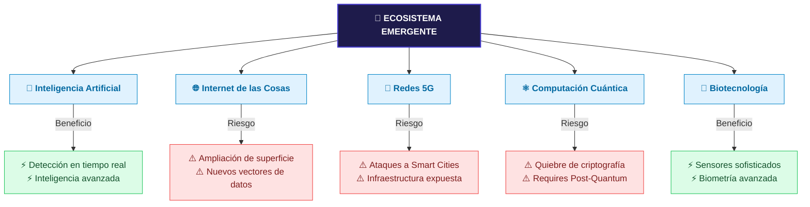
## 🚀 Ciberseguridad en Tecnologías Emergentes

El futuro de la seguridad informática está condicionado por la evolución tecnológica acelerada y la sofisticación de las amenazas. El análisis de riesgos exige evaluar las tecnologías emergentes bajo una perspectiva dual: su **potencial de amenaza** frente a su **capacidad de defensa operativa**.

```mermaid
graph TD
    %% Estilos del mapa tecnológico
    classDef core fill:#312e81,stroke:#4338ca,stroke-width:2px,color:#ffffff,font-weight:bold;
    classDef tech fill:#1e3a8a,stroke:#2563eb,stroke-width:1px,color:#ffffff;
    classDef risk fill:#7f1d1d,stroke:#ef4444,stroke-width:1px,color:#ffffff;
    classDef defense fill:#14532d,stroke:#22c55e,stroke-width:1px,color:#ffffff;

    Root["🌐 MATRIZ DE TECNOLOGÍAS EMERGENTES"]:::core

    %% Ramas Principales
    Root --> IA["🧠 Inteligencia Artificial (IA)"]:::tech
    Root --> IOT["🔌 Internet de las Cosas (IoT)"]:::tech
    Root --> G5["📶 Redes 5G"]:::tech
    Root --> Q["⚛️ Computación Cuántica"]:::tech
    Root --> BIO["🧬 Biotecnología"]:::tech

    %% Impacto IA
    IA --> IA_R["⚠️ Ciberataques más rápidos y sofisticados"]:::risk
    IA --> IA_D["🛡️ Detección en tiempo real y Threat Intel avanzada"]:::defense

    %% Impacto IoT
    IOT --> IOT_R["⚠️ Expansión masiva de la superficie de ataque"]:::risk
    IOT --> IOT_D["🛡️ Necesidad de nuevas arquitecturas de protección"]:::defense

    %% Impacto 5G
    G5 --> G5_R["⚠️ Amenazas a autos autónomos e infraestructura cívica"]:::risk
    G5 --> G5_D["🛡️ Conectividad crítica de ultra baja latencia"]:::defense

    %% Impacto Cuántica
    Q --> Q_R["⚠️ Ruptura potencial de algoritmos criptográficos actuales"]:::risk
    Q --> Q_D["🛡️ Desarrollo obligatorio de cifrado post-cuántico"]:::defense

    %% Impacto Biotecnología
    BIO --> BIO_R["⚠️ Nuevos vectores de alteración/robo de datos biológicos"]:::risk
    BIO --> BIO_D["🛡️ Autenticación biométrica de alta precisión y sensores avanzados"]:::defense
```
📋 Análisis de Impacto de la Próxima Generación Tecnológica
1. 🧠 Inteligencia Artificial (IA)
Perspectiva Defensiva: Transforma la operación del SOC al automatizar el triaje, analizar millones de logs de forma simultánea, y acelerar la detección y respuesta ante incidentes en tiempo real. Proporciona una inteligencia sobre amenazas avanzada y contextualizada.

Vector de Riesgo: Los adversarios emplean IA para automatizar el descubrimiento de vulnerabilidades, evadir sistemas de detección tradicionales y sofisticar la ingeniería social (phishing automatizado).

2. 🔌 Internet de las Cosas (IoT)
Desafío Técnico: La interconectividad digital de objetos cotidianos optimiza sectores como sanidad, transporte y fabricación. Sin embargo, al multiplicar los dispositivos conectados a la red, la superficie de ataque se amplía exponencialmente.

Estrategia Defensiva: Exige el abandono de la seguridad perimetral clásica para dar paso a modelos de microsegmentación y protecciones específicas para los endpoints IoT y los datos que estos generan.

3. 📶 Infraestructura de Redes 5G
Impacto Operativo: Al proveer velocidades ultrarrápidas, mayor capacidad y una latencia casi nula, viabiliza innovaciones críticas como ciudades inteligentes y transporte autónomo.

Vulnerabilidad: Esta dependencia de la red inalámbrica abre nuevas compuertas para ataques dirigidos contra organizaciones, individuos e infraestructura cívica crítica (sistemas de tránsito, redes de servicios públicos).

4. ⚛️ Computación Cuántica
La Amenaza Criptográfica: La capacidad de procesar datos empleando las propiedades de las partículas subatómicas otorga una potencia de cálculo exponencial. El riesgo crítico radica en su potencial para romper los métodos criptográficos actuales que resguardan la información global.

Mitigación Defensiva: Obliga a los profesionales de la seguridad a investigar y desplegar algoritmos de cifrado post-cuántico capaces de resistir ataques de fuerza bruta cuántica.

5. 🧬 Biotecnología
Innovación en Autenticación: Los avances en la aplicación del conocimiento biológico aplicados a la tecnología permiten diseñar sensores y algoritmos biométricos sumamente sofisticados.

Resultado: Habilita mecanismos de control de acceso y autenticación biométrica mucho más precisos, robustos y difíciles de suplantar que las credenciales tradicionales.

* 📝 Conclusión de Control: Debido a que es imposible predecir con precisión exacta el origen o vector de los futuros incidentes, el futuro de la ciberseguridad demanda innovación continua e inversión constante en estrategias dinámicas de protección.

## 🔬 Definición y Alcance de las Tecnologías Emergentes

> **¿Qué es una tecnología emergente?**
> Según se detalla en **image_65c1c2.jpg**, se refiere a cualquier producto o servicio innovador que aún se encuentra en las primeras etapas de desarrollo, prueba o adopción.

Los avances en la ciencia y la ingeniería han desarrollado tecnologías que están revolucionando la vida de las personas de maneras que antes se consideraban imposibles (image_65c1c2.jpg). Sin embargo, este progreso tecnológico conlleva de forma inherente una mayor vulnerabilidad a las amenazas cibernéticas (image_65c1c2.jpg).

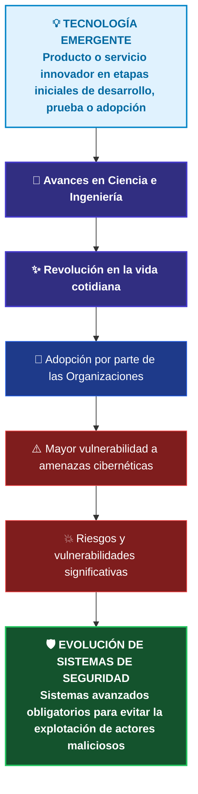
🗂️ Clasificación de Tecnologías con Alto Impacto Futuro
Aunque estas herramientas ya se encuentran en uso hasta cierto punto en la actualidad, cada una guarda una tremenda promesa para el futuro, acompañada de riesgos críticos que deben ser explorados a detalle:

🧠 Inteligencia Artificial (IA): Sistemas diseñados para el procesamiento avanzado de datos y automatización analítica.

🔌 Internet de las Cosas (IoT): Redes de dispositivos cotidianos interconectados que amplían la superficie de exposición.

📶 Redes 5G: Infraestructura inalámbrica de alta velocidad y ultra baja latencia que conecta servicios críticos.

⚛️ Computación Cuántica: Potencia de cálculo subatómica con capacidad para redefinir el paradigma criptográfico.

🧬 Mejoras en la Biotecnología: Aplicación del conocimiento biológico para el desarrollo de sensores y algoritmos biométricos de alta precisión.

📝 Directiva Forense y Defensiva: A medida que las organizaciones incorporan de forma agresiva estas innovaciones a sus procesos de negocio, nuestros sistemas y estrategias de seguridad deben evolucionar a la par de ellas (image_65c1c2.jpg). El objetivo técnico es neutralizar proactivamente la explotación y el abuso de estas plataformas por parte de actores maliciosos.

## 🧠 Inteligencia Artificial (IA) en el Ámbito Defensivo y Ofensivo

La **Inteligencia Artificial (IA)** se consolida como un campo de estudio y un desarrollo tecnológico orientado a la creación de sistemas y máquinas capaces de simular la inteligencia humana, interactuar mediante la resolución de problemas complejos y ejecutar clasificaciones o predicciones basadas en grandes volúmenes de datos. Incorpora subcampos críticos como el *Machine Learning* (Aprendizaje Automático) y el *Deep Learning* (Aprendizaje Profundo).

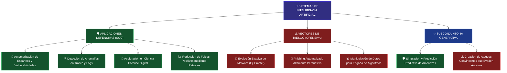
🛡️ Pilares Defensivos de la IA en Ciberseguridad
Los profesionales de ciberseguridad utilizan la IA para abordar tareas complejas, automatizar procesos y detectar patrones o anomalías en grandes volúmenes de datos corporativos (image_6554c2.jpg). Sus principales contribuciones operativas son:

🤖 Automatización de Procesos: Permite delegar tareas repetitivas como el escaneo continuo de redes y la evaluación automatizada de vulnerabilidades. Esto libera tiempo crítico del analista y mitiga sustancialmente el error humano.

🔍 Detección Temprana de Amenazas: Modela patrones basados en datos históricos para identificar comportamientos anómalos en el tráfico de red, registros de sistemas y conductas de usuario, neutralizando incidentes antes de que causen daños (image_654c2.jpg).

🔬 Ciencia Forense Digital Avanzada: Agiliza drásticamente el proceso de identificación, recopilación, examen, análisis y preservación de evidencia electrónica. La IA puede procesar cantidades de metadatos imposibles de abordar por un analista humano de manera independiente debido a las limitaciones de tiempo.

📉 Reducción de Falsos Positivos: El aprendizaje automático modela el comportamiento benigno o legítimo de la infraestructura (por ejemplo, picos de tráfico controlados por eventos normales en lugar de ataques DDoS masivos), permitiendo al sistema discriminar con precisión y reducir las alertas innecesarias que causan fatiga en el SOC.

⚠️ El Vector Ofensivo: Amenazas y Malware Evasivo
A la par de las defensas, los ciberdelincuentes diseñan aplicaciones impulsadas por IA para evadir la supervisión humana y eludir los mecanismos de detección tradicionales.

🦠 Caso de Estudio: La Botnet Emotet
Emotet es un troyano avanzado enfocado en la exfiltración de credenciales bancarias y datos personales que se propaga mediante ingeniería social (archivos adjuntos maliciosos de Microsoft Word).

Uso de Machine Learning: La alta peligrosidad y velocidad de propagación de Emotet radica en su capacidad de emplear modelos de aprendizaje automático para mutar, adaptar sus tácticas y evadir las firmas de los software antivirus tradicionales.

Impacto Global: Logró infectar más de 1.6 millones de computadoras a nivel mundial, constituyendo una de las botnets más agresivas registradas y provocando pérdidas de cientos de millones de dólares.

✨ El Rol de la IA Generativa
Definición Técnica: Como se detalla en image_6550dd.png, la IA generativa es un subconjunto de la IA que se centra en crear o generar texto, imágenes y otro contenido de alta calidad basado en los datos en los que se entrena el modelo. Su lógica subyacente codifica una representación simplificada de la información de entrenamiento (como textos indexados o imágenes artísticas) para producir resultados estadísticamente probables pero originales.

En el sector de la seguridad informática (image_655104.jpg), la IA generativa plantea un escenario de uso dual:

🛡️ Uso Defensivo: Permite a los equipos de ingeniería simular y predecir amenazas avanzadas. Los defensores pueden generar de forma controlada variantes de malware complejo o correos de phishing hiperrealistas con el fin de testear y blindar sus propias plataformas defensivas antes de un ataque real.

⚠️ Desafío Ofensivo: Los adversarios explotan exactamente estos mismos modelos generativos para optimizar la redacción de sus campañas de ingeniería social, haciéndolas sumamente convincentes para el usuario final y logrando eludir los filtros tradicionales de correo electrónico.

## 🔌 Internet de las Cosas (IoT) y la Expansión de la Superficie de Ataque

El **Internet de las Cosas (IoT)** representa la red de dispositivos físicos, vehículos, electrodomésticos y otros objetos integrados con sensores, software y conectividad de red, permitiéndoles recopilar, procesar y compartir datos de manera autónoma. La integración masiva de hardware inteligente en entornos domésticos y corporativos (como termostatos, cámaras, lavadoras y sistemas embebidos de infraestructura) expande exponencialmente las capacidades operativas mediante la conectividad en la nube, pero de manera paralela, altera de forma crítica el ecosistema de seguridad de las organizaciones.

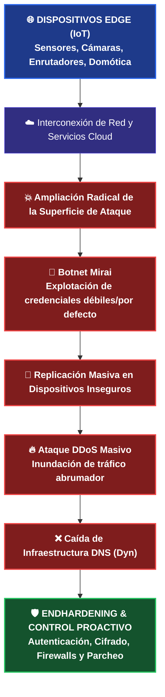

⚠️ El Desafío de Seguridad: Multiplicación de Nodos Inseguros
La transformación digital y el incremento del trabajo remoto aceleraron la adopción de arquitecturas en la nube y el despliegue de un número masivo de dispositivos en el borde (edge devices). Esta red interdependiente amplía radicalmente la superficie de ataque de cualquier organización, ofreciendo a los ciberdelincuentes miles de nuevos puntos de entrada potenciales si los dispositivos carecen de controles defensivos mínimos.

🦠 Caso de Estudio: El Malware Mirai y el Ataque a Dyn
El virus Mirai se convirtió en el hito histórico más representativo de los riesgos de seguridad en IoT al explotar activamente la negligencia en las configuraciones de fábrica.

Fase de Escaneo y Compromiso: Mirai escaneó de forma continua direcciones IP públicas apuntando de manera específica a routers y cámaras digitales inseguras. El malware lograba el acceso y control total de los equipos explotando credenciales de inicio de sesión predeterminadas o débiles (como admin/admin).

Constitución de la Botnet: Una vez comprometidos, el malware infectaba los sistemas embebidos, transformando los dispositivos legítimos en "robots" controlados remotamente por un servidor central (C2).

El Ataque DDoS a Dyn (Impacto en DNS): Mirai utilizó esta botnet masiva para inundar con tráfico abrumador y peticiones simultáneas a los servidores de Dyn, un proveedor crítico de servicios de infraestructura global. El ataque distribuyó tal cantidad de solicitudes que sobrecargó por completo sus sistemas, inhabilitando sus operaciones.

🗺️ El Rol Crítico del DNS
Como se resalta en image_64e785.png, el Sistema de Nombres de Dominio (DNS) es una parte fundamental de la infraestructura de Internet que actúa como una guía telefónica, traduciendo nombres de dominio legibles por humanos (como example.com) en sus correspondientes direcciones IP numéricas complejas (como 192.0.2.1). Al voltear a un proveedor troncal como Dyn, Mirai rompió esta traducción de nombres a nivel global, provocando la interrupción de la conectividad y afectando la disponibilidad de numerosas páginas web y plataformas de primer nivel en todo el mundo.

🛡️ Directivas Técnicas para la Mitigación y Hardening de IoT
Para contrarrestar los vectores de ataque dirigidos a dispositivos periféricos y proteger la infraestructura corporativa de incidentes similares a Mirai, es imperativo implementar un marco de defensa proactivo (image_64e062.png):

* Autenticación Robusta: Eliminar estrictamente las credenciales por defecto de fábrica. Implementar políticas de contraseñas complejas y rotativas para evitar ataques de fuerza bruta y diccionarios.
* Cifrado de Datos: Garantizar la confidencialidad e integridad mediante el cifrado de datos en movimiento y en reposo, evitando la * interceptación de tráfico o ataques Man-in-the-Middle.
* Segmentación y Firewalls: Aislar los despliegues de IoT en redes virtuales (VLANs) dedicadas y utilizar Firewalls perimetrales para restringir de manera estricta el tráfico entrante y saliente no autorizado.
* Gestión de Parches: Establecer ventanas periódicas de actualización de firmware para corregir vulnerabilidades conocidas expuestas públicamente en los sistemas embebidos.

📝 Conclusión de Seguridad: El resguardo de estos entornos requiere el compromiso y monitoreo constante tanto de gobiernos, corporaciones y analistas de ciberseguridad, manteniéndose actualizados respecto a las nuevas amenazas y técnicas de evasión de malware para proteger los activos de información (image_64e062.png).

## 📶 Redes 5G: Hiperconectividad y Nuevos Vectores de Exfiltración

La **quinta generación de redes celulares (5G)** redefine el paradigma de las comunicaciones móviles al ofrecer velocidades hasta 100 veces más rápidas que 4G, mayor ancho de banda y una **latencia ultrabaja**. Esta infraestructura de conectividad inalámbrica masiva impulsa innovaciones críticas en tiempo real como la telemedicina (*e-health*), el procesamiento de vehículos autónomos y la automatización de la infraestructura cívica (servicios públicos y tránsito). Sin embargo, la complejidad de su ecosistema descentralizado y su velocidad de transferencia abren compuertas críticas para la seguridad de los datos.

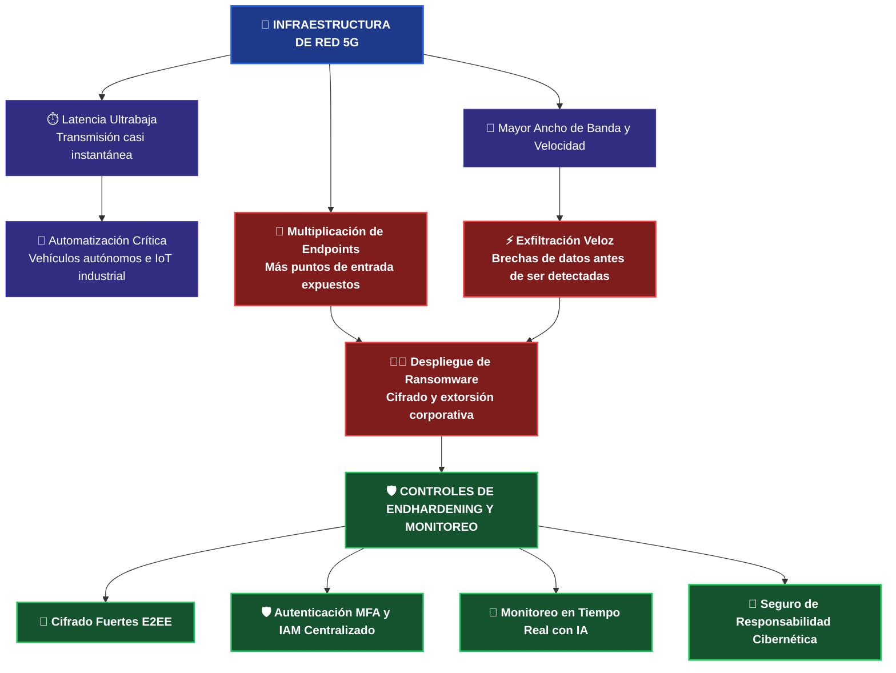

⏱️ El Núcleo Técnico del 5G: Latencia Ultrabaja
La latencia ultrabaja se define como un retraso extremadamente corto en los tiempos de transmisión y recepción de datos desde el endpoint hasta el nodo de red, garantizando una comunicación y respuesta casi instantánea.

Esta reducción drástica del tiempo de transferencia optimiza el despliegue de tecnologías complejas:

Entornos Críticos: En el desarrollo de vehículos autónomos, la comunicación instantánea en milisegundos entre los sensores perimetrales y los sistemas lógicos de control es obligatoria para garantizar un funcionamiento e interacción seguros.

Experiencia de Usuario: Habilita entornos fluidos y de alta disponibilidad para el streaming de video en ultra alta definición, juegos avanzados en la nube y aplicaciones inmersivas de realidad virtual.

⚠️ El Desafío del SOC: Puntos de Entrada y Ataques de Alta Velocidad
El futuro del 5G y la ciberseguridad se encuentran profundamente entrelazados. Al basarse en un ecosistema heterogéneo y denso de dispositivos interconectados (smartphones, laptops, terminales industriales y miles de dispositivos IoT), la cantidad de puntos de entrada potenciales para los ciberdelincuentes se multiplica de forma exponencial.

🏴‍☠️ Caso de Estudio: Incidente de Ransomware en Aseguradora Europea (2021)
En 2021, una compañía de seguros europea sufrió un ataque crítico que explotó las características nativas de esta tecnología:

El Vector de Acceso: Los atacantes identificaron y explotaron vulnerabilidades en los dispositivos IoT expuestos que estaban conectados directamente a la red móvil 5G de la organización.

El Factor Velocidad: Debido a que el 5G permite velocidades sustancialmente más rápidas, los actores maliciosos lograron vulnerar la red y exfiltrar grandes volúmenes de datos corporativos antes de que los monitores de red tradicionales lograran identificarlos o capturarlos.

El Desenlace: Una vez comprometida la infraestructura interna, desplegaron un ataque de ransomware que cifró los datos operativos y exigió el pago de una recompensa financiera a cambio de la clave de descifrado, paralizando las actividades de la organización.

🛡️ Controles Defensivos y Hardening para Redes 5G
Para neutralizar el acceso no autorizado y blindar la integridad forense de los flujos de datos en ciberarquitecturas móviles, las organizaciones deben desplegar la siguiente matriz de controles proactivos:

🔒 Implementación de Cifrado Fuerte: Forzar el uso de protocolos estándar de la industria mediante un esquema de Cifrado de Extremo a Extremo (E2EE). Esto garantiza que la información viaje de forma cifrada desde su origen en el nodo periférico hasta el destinatario final, volviéndola ilegible ante cualquier interceptación (Sniffing).

🔑 Autenticación de Doble Factor (MFA): Robustecer el perímetro lógico de los dispositivos 5G exigiendo múltiples factores de identificación (como contraseñas robustas complementadas con tokens dinámicos/OTP provistos a dispositivos móviles oficiales).

🗂️ Sistemas de Gestión de Identidades (IAM): Centralizar la autenticación, autorización y control de acceso. El uso de plataformas IAM asegura que únicamente el personal validado y bajo políticas de mínimo privilegio acceda a los recursos asociados a la red.

🧠 Monitoreo Proactivo con Inteligencia Artificial: Dado que las velocidades del 5G superan la capacidad de respuesta y detección de los análisis de logs humanos tradicionales, es indispensable implementar motores de IA dedicados a auditar el tráfico en tiempo real para interceptar anomalías de exfiltración de forma automatizada.

💼 Seguro de Responsabilidad Cibernética: Como medida de gestión de riesgos financieros ante brechas inevitables, la obtención de una póliza adecuada permite mitigar el impacto económico derivado de la respuesta ante incidentes, costos legales, notificaciones obligatorias a clientes y remediación de daños.

## ⚠️ Clarificación Técnica: Redes Celulares 5G vs. Wi-Fi de 5 GHz

Existe una confusión generalizada debido al uso de la letra **"G"** en el ámbito comercial. Sin embargo, representan arquitecturas de red y espectros de frecuencia completamente independientes:

1. **5G (Quinta Generación Celular):** Es el estándar global de redes móviles diseñado para conectar dispositivos a nivel macro (infraestructura pública, antenas de telefonía) utilizando múltiples bandas de frecuencia (sub-6 GHz y ondas milimétricas) para proveer latencia ultrabaja y velocidades masivas.
2. **Wi-Fi 5 GHz (Gigahertz):** No es una generación, sino una **banda de frecuencia de radio** (los 5 gigahertz) que utilizan los routers domésticos o corporativos para transmitir datos a corta distancia en redes de área local (WLAN).

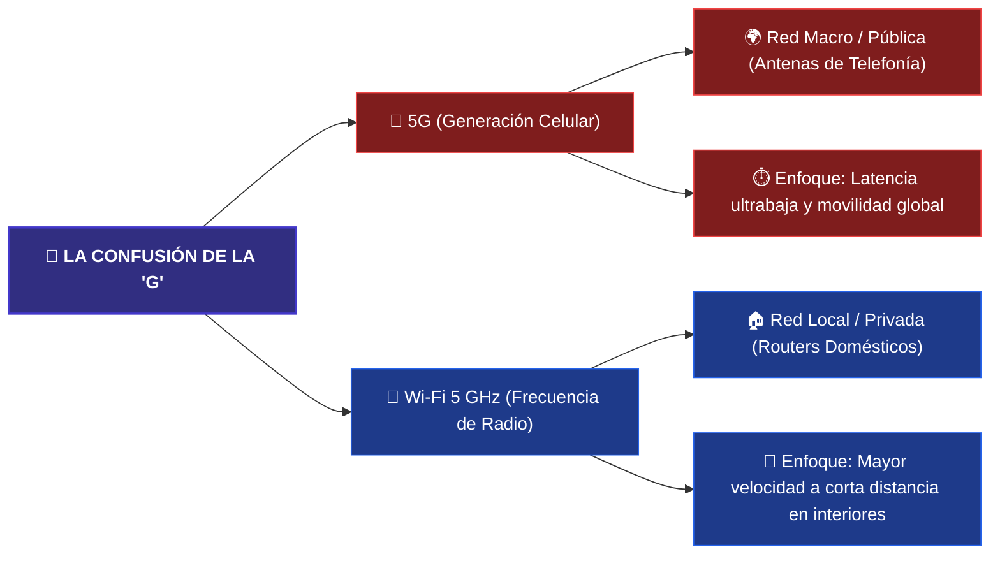

### 📊 Matriz de Comparación Técnica: 5G vs. Wi-Fi 5 GHz

| Característica | 📡 Red Móvil 5G (Generación) | 🔌 Wi-Fi 5 GHz (Frecuencia) |
| :--- | :--- | :--- |
| **¿Qué significa la "G"?** | **Generación.** Es la 5.ª etapa evolutiva de la tecnología móvil inalámbrica. | **Gigahertz.** Es la frecuencia física de la onda de radio (5.000 millones de ciclos por segundo). |
| **Ámbito de Cobertura** | **Red Externa (WAN).** Cobertura masiva a nivel nacional mediante celdas y antenas de telefonía distribuidas. | **Red Local (WLAN).** Cobertura limitada (habitaciones, oficinas, interiores de un edificio). |
| **Propiedad de la Red** | Operada y gestionada por proveedores de telecomunicaciones (Movistar, Claro, Personal, etc.). | **Privada.** Administrada de manera interna por el usuario o la organización dueña del router o Access Point. |
| **Espectro de Frecuencia** | Utiliza bandas licenciadas (compradas por las telefónicas), incluyendo bandas bajas, medias y ondas milimétricas. | Utiliza un espectro no licenciado de libre uso (coexistiendo con Wi-Fi de 2.4 GHz y las nuevas bandas de 6 GHz). |
| **Vectores de Riesgo Críticos** | Interceptación de tráfico en celdas falsas (*IMSI-catchers*), vulnerabilidades en el núcleo virtualizado y exfiltración veloz de datos. | Ataques de desautenticación, fallos en protocolos de cifrado (*WPA2/WPA3*) y routers mal configurados de fábrica. |

## ⚛️ Computación Cuántica: El Próximo Paradigma Criptográfico

La **computación cuántica** representa una tecnología emergente disruptiva que utiliza los principios fundamentales de la mecánica cuántica (como la superposición y el entrelazamiento) junto con hardware y algoritmos especializados para procesar información a velocidades exponenciales. Esta capacidad analítica le permite resolver problemas complejos que las computadoras convencionales o supercomputadoras clásicas son incapaces de abordar, o que les tomaría miles de años procesar.

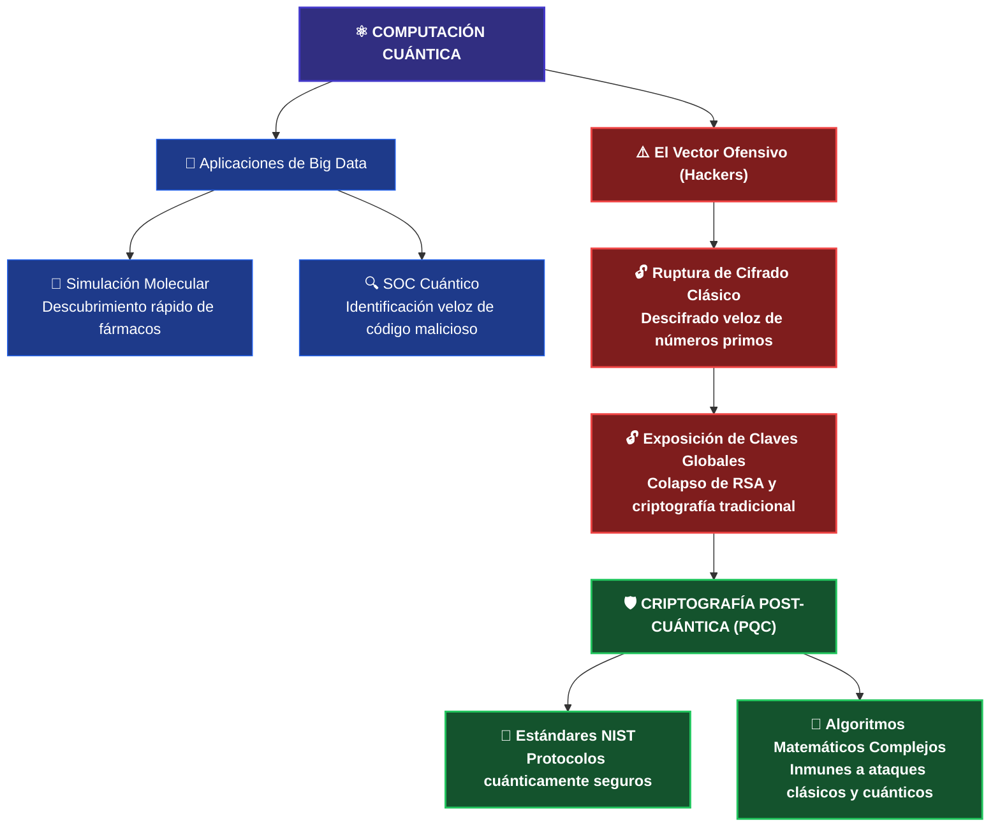

🔬 Aplicaciones Prácticas y Beneficios en Ciberseguridad
Más allá del ámbito teórico, la computación cuántica aporta un valor sin precedentes en campos con alta densidad de datos:
💊 Descubrimiento de Fármacos (Caso Civil): Permite a los científicos modelar interacciones entre átomos y moléculas con precisión absoluta. Esto acelera de manera drástica el diseño de nuevos medicamentos y la comprensión de su eficacia clínica sin depender exclusivamente de ensayos de laboratorio prolongados.
🛡️ Ecosistema Defensivo del SOC: Procesa volúmenes masivos de telemetría de red a velocidades de procesamiento cuántico, facilitando la detección temprana de anomalías. Habilita el desarrollo de algoritmos de búsqueda avanzada capaces de identificar código malicioso y mutaciones de malware de manera más rápida y precisa que cualquier motor heurístico actual.

⚠️ El Riesgo Crítico: El Fin de la Criptografía TradicionalEl poder computacional de las computadoras cuánticas representa un arma de doble filo, ya que los actores de amenazas pueden explotar estas capacidades para comprometer la infraestructura de clave pública global ($PKI$).

* Descifrado de Claves: Los métodos de cifrado asimétrico actuales (como RSA) basan su seguridad en la dificultad matemática de factorizar números primos extremadamente grandes en computadoras clásicas.
* El Impacto Ofensivo: Una computadora cuántica con la escala suficiente puede resolver estos problemas matemáticos de forma casi instantánea, desbloqueando las claves de cifrado y exponiendo datos confidenciales, comunicaciones gubernamentales, transacciones financieras e información corporativa inmutable.

🧱 Barreras Actuales para la Adopción Generalizada
A pesar de sus ventajas, la computación cuántica no ha sido adoptada de forma masiva debido a tres limitaciones estructurales complejas:

🥶 Alta Sensibilidad Ambiental: Los procesadores cuánticos (Qubits) son extremadamente sensibles al ruido, las interferencias electromagnéticas y la decoherencia. Requieren condiciones de infraestructura masivas y sumamente precisas, como temperaturas operativas cercanas al cero absoluto (criogenia), lo que dificulta su escalabilidad a nivel empresarial.
📈 Curva de Aprendizaje Pronunciada: El desarrollo, diseño e implementación de algoritmos cuánticos efectivos exige un nivel de especialización y conocimientos avanzados en física cuántica y matemática abstracta, limitando el número de profesionales calificados en el mercado actual.
💰 Costos de Infraestructura: El desarrollo, mantenimiento físico, consumo energético y operación de estos entornos tecnológicos conllevan presupuestos multimillonarios, restringiendo su acceso inicial a grandes corporaciones, centros de investigación universitaria y agencias gubernamentales.

📜 La Respuesta Defensiva: Criptografía Post-Cuántica (PQC)
Ante la inminente amenaza de la ruptura del cifrado clásico, la comunidad de ciberseguridad lidera un enfoque proactivo para blindar los activos de información:

* Protocolos de Cifrado Avanzados: Los desarrolladores diseñan algoritmos criptográficos basados en problemas matemáticos retorcidos (como la criptografía basada en retículos), los cuales se consideran computacionalmente imposibles de resolver tanto para las computadoras tradicionales como para las cuánticas.

* El Hito del NIST (Julio 2022): El Instituto Nacional de Estándares y Tecnología de EE. UU. marcó un hito histórico en la seguridad digital al introducir los primeros estándares oficiales para protocolos de criptografía cuántica segura. Este marco provee las pautas técnicas obligatorias para que las organizaciones migren sus sistemas de transferencia y almacenamiento de datos hacia un entorno inmune a ataques de fuerza bruta cuántica.

---

### 🚓 Criptoanálisis Cuántico Aplicado a la Investigación Criminal

Si bien el poder de procesamiento cuántico plantea un desafío severo para las infraestructuras de cifrado actuales, este mismo potencial representa una herramienta revolucionaria para los organismos encargados de hacer cumplir la ley y los analistas forenses en su lucha global contra la ciberdelincuencia (`image_6458fd.png`). 

Un claro ejemplo de esta transición tecnológica se observa en los flujos avanzados de investigación judicial y descifrado de evidencia:

* **Protección de Comunicaciones Delictivas:** Es habitual que los grupos de delincuencia organizada y ciberdelincuentes utilicen claves criptográficas complejas basadas en textos cifrados para proteger la confidencialidad de sus comunicaciones operativas (`image_64561d.png`).
* **La Vulnerabilidad de los Sistemas Heredados (*Legacy*):** Muchas de estas organizaciones criminales generan sus llaves empleando algoritmos tradicionales que resultan robustos en sistemas informáticos antiguos (`image_6455d6.png`). Sin embargo, dichos algoritmos se basan en problemas matemáticos de factorización que los algoritmos cuánticos pueden resolver de manera casi instantánea, rompiendo el esquema tradicional que va desde el texto no cifrado, pasa por el algoritmo de cifrado y decanta en el texto cifrado (`image_6455d6.png`).
* **Colaboración Forense y Evidencia:** Mediante la cooperación directa entre las fuerzas del orden y equipos especializados de investigadores, la potencia de las computadoras cuánticas permite quebrar estas claves criptográficas antiguas (`image_6458fd.png`, `image_645544.png`). Al descifrar los canales de comunicación, los peritos logran recopilar pruebas digitales de alto valor legal, fundamentales para identificar, localizar y enjuiciar formalmente a los actores maliciosos (`image_645544.png`).


## 🧬 Biotecnología: Ciberdefensa Orgánica y Autenticación Avanzada

La **biotecnología** consiste en el aprovechamiento de organismos vivos o sus componentes celulares y biomoleculares para el desarrollo de soluciones innovadoras y productos útiles. Si bien su impacto histórico reside en la medicina (terapias dirigidas, vacunas optimizadas) y la agricultura (resistencia genética a estresores ambientales), su convergencia con los sistemas de información está redefiniendo el endurecimiento (*hardening*) de infraestructuras y el análisis heurístico de amenazas.

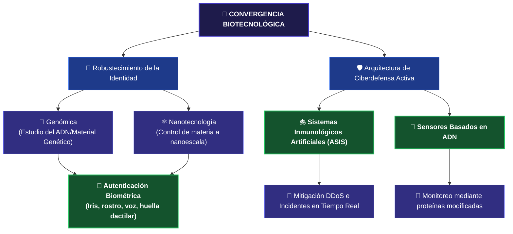
🔑 El Rol de la Genómica y la Nanotecnología en el Control de Acceso
A medida que los teléfonos inteligentes y los terminales corporativos conectados almacenan mayor volumen de datos personales y gestionan sistemas automatizados, se vuelve mandatorio elevar la complejidad de los métodos de cifrado y autenticación. Dos disciplinas asociadas a la biotecnología lideran este avance:

🧬 Genómica: Centrada en el estudio del genoma completo de los organismos (incluyendo su ADN y estructuras genéticas). Ha permitido perfeccionar los sistemas biométricos de alta fidelidad, tales como el escaneo de iris, reconocimiento facial, detección de voz y los sensores de huella dactilar integrados en smartphones. Estas características físicas únicas reducen de manera drástica la probabilidad de suplantación de identidad (spoofing) o falsificación.

⚛️ Nanotecnología: Enfocada en la manipulación y comprensión de la materia a nanoescala (una milmillonésima parte de un metro). Provee la base científica para fabricar sensores físicos miniaturizados hiperprecisos capaces de validar datos de acceso sin degradar el rendimiento del hardware.

🛡️ Ciberseguridad Inspirada en la Biología: ASIS y Sensores Moleculares
La integración de principios biológicos en sistemas de Inteligencia Artificial ha permitido desarrollar estrategias de defensa proactiva capaces de imitar los mecanismos naturales de preservación orgánica:

🫁 Sistemas Inmunológicos de Seguridad Artificial (ASIS)
Los investigadores diseñan plataformas de software que emulan el comportamiento del sistema inmunitario humano para la detección de anomalías lógicas.

* Mecanismo de Acción: Así como el cuerpo humano detecta la intrusión de un agente patógeno o virus porque reconoce que altera el estado normal del organismo, un sistema ASIS audita los patrones basales de una infraestructura.

* Caso de Aplicación: Frente a un ataque de Denegación de Servicio Distribuido (DDoS), el ASIS identifica el incremento súbito y anómalo de tráfico proveniente de múltiples fuentes simultáneas, activando contramedidas de mitigación inmediatas de forma automatizada.

🔬 Sensores Basados en ADN
Línea de investigación orientada al desarrollo de dispositivos bio-digitales encargados de inspeccionar el tráfico en tiempo real dentro de redes de alta disponibilidad.

* Funcionamiento: Emplean proteínas modificadas genéticamente capaces de reaccionar ante moléculas o patrones específicos directamente vinculados con firmas de ciberataques puntuales.

* Objetivo Táctico: Su incorporación en las interfaces de red busca automatizar el descubrimiento de vulnerabilidades y la contención de amenazas en fases tempranas del ciclo del ataque.

📈 Consideraciones Estratégicas para la Gestión del Riesgo

* Innovación Sin Explotar: Las soluciones de ciberseguridad fundamentadas en procesos biotecnológicos ofrecen respuestas dinámicas ante amenazas sofisticadas, pero su potencial comercial y técnico permanece aún en sus etapas iniciales de maduración.

* Ventaja Competitiva Activa: Las organizaciones con arquitecturas críticas deben evaluar e invertir en este vector de innovación para adelantarse a las tácticas de evasión empleadas por los atacantes.

* Rol en la Ciberdelincuencia: El despliegue a gran escala de defensas inmunológicas artificiales jugará un rol preponderante en la neutralización del cibercrimen organizado a nivel global.

---

## 🧠 Actividad: Reflexión Analítica sobre Ciberseguridad y Tecnologías Emergentes

> **Nota de Portafolio:** Esta sección representa una síntesis y análisis crítico sobre el impacto, riesgos y sinergias de la próxima ola tecnológica en el ecosistema de la seguridad de la información.

### 🌐 1. Evaluación del Impacto Tecnológico y Expansión de Riesgos

La adopción de tecnologías emergentes acelera la transformación digital, pero reconfigura de manera drástica el mapa de amenazas que los profesionales de seguridad debemos mitigar:

* **Inteligencia Artificial (IA):** Actúa como un catalizador defensivo en el SOC al automatizar tareas rutinarias de seguridad, agilizar el triaje y procesar millones de logs para mejorar la inteligencia sobre amenazas. Sin embargo, representa una simetría de capacidades: los ciberdelincuentes ya la emplean para automatizar el descubrimiento de vulnerabilidades y diseñar ataques de ingeniería social hiperpersonalizados y difíciles de detectar.
* **Internet de las Cosas (IoT):** La interconexión masiva de dispositivos cotidianos genera eficiencia operativa, pero degrada el perímetro de seguridad clásico. Al multiplicar los nodos desprotegidos o con configuraciones de fábrica deficientes, la superficie de ataque se expande exponencialmente, transformando hardware genérico en vectores potenciales de intrusión a redes corporativas.
* **Redes 5G:** Su despliegue masivo viabiliza infraestructuras futuristas como ciudades inteligentes y vehículos autónomos gracias a su latencia ultrabaja. No obstante, al soportar una densidad de endpoints drásticamente mayor, multiplica los puntos de entrada potenciales. Además, su velocidad extrema permite a los atacantes exfiltrar grandes volúmenes de datos antes de que los sistemas de monitoreo tradicionales logren interceptarlos.
* **Computación Cuántica:** Su descomunal capacidad de procesamiento optimizará la analítica de big data y la identificación de malware. A pesar de esto, se posiciona como una amenaza existencial para la criptografía asimétrica actual (como RSA), al ser capaz de factorizar números primos grandes en cuestión de segundos. Esto vuelve obligatoria la transición proactiva hacia algoritmos de cifrado post-cuánticos (PQC).
* **Biotecnología:** Ofrece metodologías disruptivas de autenticación biométrica de alta precisión (mediante genómica y nanotecnología) y modelos de defensa orgánica inspirados en sistemas inmunológicos artificiales (ASIS). El desafío crítico aquí radica en la gobernanza, privacidad y resguardo estricto de estos datos biométricos, ya que un compromiso de esta información comprometería la identidad inmutable del usuario de forma permanente.

---

### 📊 2. El Balance Estratégico: Innovación vs. Seguridad

Una conclusión es innegable: **nadie puede predecir con exactitud absoluta el origen o vector de los futuros incidentes digitales.** La ciberseguridad ya no puede concebirse como un conjunto de medidas estáticas o un freno a la innovación, sino como el habilitador resiliente de la misma.

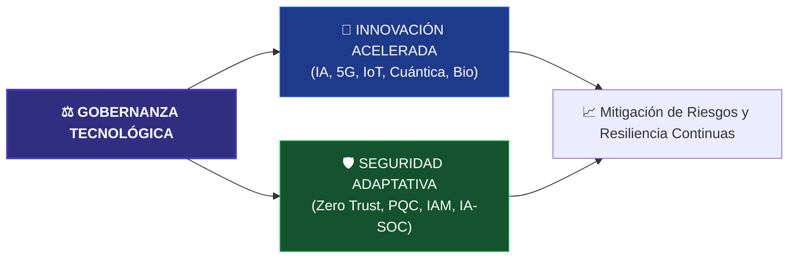


ASPECTO DESTACADO DE LA GESTION DE CARRERA: FLUIDEZ EN CIBERSEGURIDAD


A lo largo de este curso, aprendiste habilidades que mejoraron tu fluidez y tus habilidades
en ciberseguridad. Aumento tu conciencia sobre las amenazas ciberneticas, practicaste como
identificar vulnerabilidades, aprendiste lo importante que es proteger la seguridad de las
redes y los sistemas, y mas. Tambien investigaste una variedad de trabajos en los que podrias
querer trabajar, exploraste certificaciones que puedes obtener y practicaste habilidades en
el lugar de trabajo que los empleadores consideran esenciales.

```==========================================================================================
HABILIDADES, CERTIFICACIONES Y CARRERAS RELACIONADAS CON LA CIBERSEGURIDAD


Revisa las siguientes listas de habilidades de empleabilidad, certificaciones y carreras
que aprendiste y practicaste en este curso.

==========================================================================================
COMPETENCIAS DE EMPLEABILIDAD


En este curso, pusiste en practica una variedad de habilidades de empleabilidad, todas en el
contexto de la ciberseguridad. Estas habilidades son transferibles y te ayudaran en cualquier
trabajo que busques.

==========================================================================================
DATOS Y PRIVACIDAD


Habilidades practicadas:

- Pensamiento critico
- Mentalidad de crecimiento
- Pensamiento analitico
- Comunicacion escrita y documentacion

Actividades:
- Explicar por que las organizaciones necesitan invertir en ciberseguridad
- Identificar amenazas de ciberseguridad
- Clasificar tareas usando los elementos clave de ciberseguridad
- Categorizar tipos de datos
- Identificar las mejores practicas de privacidad
- Descifrar texto cifrado usando una clave de cifrado
- Ordenar los pasos para el cifrado
- Enumerar las razones por las que el cifrado es importante
- Aplicar las mejores practicas de cifrado
- Explicar tu interes en una carrera en ciberseguridad
- Describir las habilidades para una carrera en privacidad de datos
- Describir las habilidades para ser analista de seguridad de datos
- Resumir el proposito y beneficios del programa ECES del EC-Council
- Distinguir entre consecuencias de una violacion de privacidad de datos
- Aplicar la triada CIA a situaciones del mundo real
- Ordenar los controles por tipo
- Clasificar cifrado como simetrico o asimetrico
- Desarrollar un plan de respaldo

==========================================================================================
GOBERNANZA, RIESGO Y CUMPLIMIENTO


Habilidades practicadas:

- Mentalidad de crecimiento
- Pensamiento critico
- Comunicacion escrita
- Resolucion de problemas
- Documentacion

Actividades:
- Reflexionar sobre la aplicacion de politicas organizacionales
- Describir metodos para proteger datos, sistemas y redes
- Enumerar habilidades para puestos de analista de cumplimiento de seguridad
- Diferenciar entre politicas, estandares, pautas y procedimientos
- Enumerar razones por las que un programa de cumplimiento es fundamental
- Aplicar las leyes federales a situaciones del mundo real
- Evaluar el riesgo organizacional
- Crear un plan de control administrativo para el cumplimiento

==========================================================================================
AMENAZAS Y VULNERABILIDADES


Habilidades practicadas:

- Pensamiento critico
- Pensamiento sistemico
- Resolucion de problemas
- Pensamiento analitico
- Agilidad de aprendizaje
- Investigacion
- Atencion al detalle
- Comunicacion escrita
- Documentacion
- Mentalidad de crecimiento

Actividades:
- Enumerar tipos de malware
- Diferenciar entre diferentes tipos de malware
- Enumerar signos de un intento de ingenieria social
- Identificar amenazas de seguridad fisica
- Analizar el impacto de las amenazas de ciberseguridad
- Mitigar amenazas de malware usando Malwarebytes
- Describir habilidades para trabajar como analista de malware
- Aplicar caracteristicas del phishing a correos electronicos
- Desarrollar un plan de control de seguridad fisica
- Describir habilidades para ser tecnico de servicio de seguridad fisica

==========================================================================================
GESTION DE VULNERABILIDADES


Habilidades practicadas:

- Pensamiento critico
- Pensamiento analitico
- Mentalidad de crecimiento
- Investigacion
- Resolucion de problemas
- Agilidad de aprendizaje

Actividades:
- Identificar los pasos del ciclo de vida de inteligencia de amenazas
- Analizar inteligencia de amenazas
- Analizar una expresion STIX
- Clasificar vulnerabilidades por gravedad
- Identificar las cuatro fases de pruebas de penetracion
- Describir habilidades para ser analista de evaluacion de vulnerabilidades
- Enumerar los beneficios de la certificacion CompTIA Pentest+
- Evaluar el estado actual de la seguridad organizacional
- Analizar vulnerabilidades de una aplicacion web usando OWASP ZAP

==========================================================================================
SEGURIDAD DEL SISTEMA


Habilidades practicadas:

- Pensamiento analitico
- Comunicacion escrita
- Ingenio
- Mentalidad de crecimiento
- Pensamiento critico
- Resolucion de problemas
- Agilidad de aprendizaje
- Documentacion

Actividades:
- Explicar por que la seguridad del sistema es importante
- Crear un plan para garantizar la seguridad del firmware
- Enumerar los requisitos para ser ingeniero de firmware
- Enumerar informacion sobre la certificacion RHCSA
- Determinar el servidor apropiado
- Clasificar los sistemas operativos
- Describir el fortalecimiento del sistema
- Proteger un sistema operativo host
- Crear un plan para proteger un sistema operativo

==========================================================================================
SEGURIDAD DE LA RED


Habilidades practicadas:

- Pensamiento analitico
- Comunicacion escrita
- Pensamiento critico
- Mentalidad de crecimiento
- Investigacion
- Pensamiento creativo

Actividades:
- Enumerar medidas de seguridad de red
- Explicar como la autenticacion y autorizacion ayudan a mantener la seguridad
- Clasificar ataques a aplicaciones y servicios
- Clasificar ataques inalambricos
- Clasificar estrategias para proteger redes
- Disenar una red segura
- Describir protocolos de cifrado
- Describir el proposito de dispositivos de seguridad de red
- Identificar beneficios de dispositivos de seguridad de red
- Enumerar habilidades tecnicas para gestionar una red
- Explorar la certificacion CompTIA Network+
- Resumir tareas de un analista IAM
- Diferenciar entre controles de acceso a la red

==========================================================================================
COMPUTACION EN LA NUBE Y VIRTUALIZACION


Habilidades practicadas:

- Pensamiento analitico
- Comunicacion escrita
- Pensamiento critico
- Resolucion de problemas
- Agilidad de aprendizaje
- Mentalidad de crecimiento
- Investigacion
- Atencion al detalle
- Documentacion

Actividades:
- Explicar los beneficios de la computacion en la nube
- Identificar los beneficios de la virtualizacion
- Identificar caracteristicas de virtualizacion externa e interna
- Identificar el modelo de servicio en la nube adecuado
- Crear una maquina virtual
- Enumerar cursos para preparar una carrera como ingeniero de virtualizacion
- Describir habilidades para tener exito en computacion en la nube
- Aplicar el modelo de implementacion de nube adecuado
- Describir cuando implementar diferentes modelos de despliegue en la nube

==========================================================================================
PROTECCION DE LA INFRAESTRUCTURA EN LA NUBE


Habilidades practicadas:

- Pensamiento analitico
- Comunicacion escrita
- Atencion al detalle
- Mentalidad de crecimiento
- Investigacion
- Pensamiento critico
- Resolucion de problemas
- Agilidad de aprendizaje
- Adaptabilidad y resiliencia

Actividades:
- Enumerar amenazas exclusivas de la computacion en la nube
- Distinguir entre tipos de mitigacion de ataque DoS y DDoS
- Identificar desafios de visibilidad de infraestructura
- Reflexionar sobre pasos para ser analista de seguridad en la nube
- Describir la TI en la sombra
- Aplicar gestion de acceso a la identidad a situaciones reales
- Crear una maquina virtual segura con Microsoft Azure
- Enumerar efectos de una interrupcion del servicio en la nube
- Aplicar planes de recuperacion e infraestructura en la nube
- Reflexionar sobre habilidades evaluadas en la certificacion CompTIA Cloud+
- Aplicar principios de estrategia de seguridad a aplicaciones en la nube
- Resumir conceptos clave para proteger aplicaciones en la nube

==========================================================================================
OPERACIONES DE SEGURIDAD


Habilidades practicadas:

- Pensamiento analitico
- Comunicacion escrita
- Atencion al detalle
- Agilidad de aprendizaje
- Pensamiento creativo
- Mentalidad de crecimiento
- Investigacion
- Pensamiento critico

Actividades:
- Describir limitaciones de herramientas como IBM QRadar
- Explicar la importancia de habilidades de comunicacion
- Distinguir entre modelos de seguridad estandar
- Identificar metodos de preparacion, planeacion y prevencion
- Identificar responsabilidades de monitoreo, deteccion y respuesta
- Identificar responsabilidades de recuperacion y refinamiento
- Asignar roles y tareas al SOC
- Enumerar requisitos comunes para puestos del SOC
- Identificar tipos de formacion en concienciacion sobre seguridad
- Identificar componentes de la capacitacion en concientizacion sobre seguridad

==========================================================================================
MONITOREO DE SEGURIDAD


Habilidades practicadas:

- Pensamiento analitico
- Comunicacion escrita
- Pensamiento critico
- Resolucion de problemas
- Agilidad de aprendizaje
- Mentalidad de crecimiento
- Atencion al detalle
- Pensamiento creativo
- Investigacion

Actividades:
- Enumerar formas en que EDR mejora la seguridad de la red
- Identificar herramientas de diagnostico de red
- Identificar beneficios de herramientas EDR
- Identificar caracteristicas importantes en una herramienta EDR
- Identificar beneficios de herramientas SIEM
- Realizar reconocimiento de red
- Explorar la certificacion CompTIA CySA+
- Aplicar principios de gestion y monitorizacion de endpoints para usar EDR
- Explicar como SIEM ayuda a priorizar alertas
- Realizar una investigacion de amenazas con Splunk Enterprise
- Enumerar requisitos comunes para trabajos de cazador de amenazas

==========================================================================================
RESPUESTA A INCIDENTES


Habilidades practicadas:

- Pensamiento critico
- Comunicacion escrita
- Pensamiento analitico
- Mentalidad de crecimiento
- Investigacion
- Resolucion de problemas
- Agilidad de aprendizaje

Actividades:
- Enumerar elementos criticos de un plan de respuesta a incidentes
- Aplicar un marco de respuesta a incidentes adecuado
- Identificar las cuatro fases de un plan de respuesta a incidentes
- Identificar roles en el equipo de respuesta a incidentes
- Identificar participantes externos con responsabilidades
- Identificar preocupaciones especificas de cada fase
- Aplicar el marco Cyber Kill Chain
- Aplicar el marco MITRE ATT&CK
- Enumerar requisitos comunes para puestos de respuesta a incidentes
- Enumerar las nueve etapas de manejo de incidentes del EC-Council
- Distinguir entre areas clave del analisis de intrusiones
- Responder a un ataque de red

==========================================================================================
ANALISIS FORENSE DE SISTEMAS DIGITALES


Habilidades practicadas:

- Pensamiento sistemico
- Comunicacion escrita
- Pensamiento analitico
- Mentalidad de crecimiento
- Agilidad de aprendizaje
- Pensamiento critico
- Atencion al detalle
- Resolucion de problemas

Actividades:
- Explicar como diversas habilidades contribuyen al proceso forense digital
- Analizar un ciberataque a traves de la informatica forense
- Describir habilidades para tener exito como investigador forense digital
- Aplicar las cuatro fases de la ciencia forense digital a un escenario
- Describir aplicaciones de habilidades de resolucion de problemas
- Identificar el proposito de herramientas forenses digitales
- Analizar evidencia forense digital empleando FTK Imager y Autopsy

==========================================================================================
LAS AMENAZAS EMERGENTES Y EL FUTURO DE LAS TECNOLOGIAS DE CIBERSEGURIDAD


Habilidades practicadas:

- Mentalidad de crecimiento
- Comunicacion escrita
- Pensamiento analitico

Actividades:
- Enumerar tecnologias emergentes que ya conocias
- Examinar las habilidades que mejor conoces y las que te gustaria mejorar
- Identificar las certificaciones que te gustaria obtener
- Identificar los trabajos que mas te atraen y por que
- Resumir las amenazas emergentes a la ciberseguridad
- Describir el futuro de las tecnologias de ciberseguridad
- Describir el impacto de la tecnologia emergente en el campo de la ciberseguridad

==========================================================================================
CERTIFICACIONES EXPLORADAS EN EL CURSO


Las certificaciones son un paso adicional que puedes dar para aprender mas y avanzar en tu
carrera. Exploraste las siguientes certificaciones:

- Especialista Certificado en Cifrado EC-Council (ECES)
- Certificacion CompTIA PenTest+
- Red Hat Certified System Administrator (RHCSA)
- Certificacion CompTIA Network+
- Certificacion CompTIA Cloud+
- Certificacion de Analista de Ciberseguridad de CompTIA (CySA+)
- Certificacion Certified Incident Handler (CIH) del EC-Council

==========================================================================================
CARRERAS EXPLORADAS EN EL CURSO


Aprendiste sobre una variedad de carreras y trayectorias profesionales en ciberseguridad:

- Trayectoria profesional en ciberseguridad (roles y progresion tipica)
- Trayectorias profesionales en privacidad de datos
- Analista de seguridad de datos
- Seguridad de datos, sistemas y redes
- Analista de cumplimiento de seguridad
- Analista de malware
- Tecnico de servicio de seguridad fisica
- Analista de evaluacion de vulnerabilidades
- Gerente de evaluacion de vulnerabilidades
- Ingeniero de firmware
- Administrador de red
- Analista de gestion de identidad y acceso (IAM)
- Ingeniero de virtualizacion
- Computacion en la nube (roles generales)
- Analista de seguridad en la nube
- Analista de SOC
- Cazador de amenazas
- Respondedor de incidentes (analista de respuesta a incidentes)
- Investigador forense digital

==========================================================================================
```

---

## 🔮 Conclusión del Módulo: Resumen y Previsión Estratégica

El pilar fundamental de la ciberseguridad moderna radica en la **adaptabilidad continua**. Las infraestructuras de seguridad no pueden ser estáticas; deben evolucionar al mismo ritmo acelerado en que se despliegan las nuevas tecnologías y se sofistican los actores de amenazas. 

Al implementar de manera proactiva las medidas de control adecuadas (como arquitecturas *Zero Trust*, cifrado post-cuántico y análisis heurístico mediante IA), las organizaciones logran blindar la **Confidencialidad, Integridad y Disponibilidad (CÍA)** de sus activos más críticos. El objetivo final es garantizar que la adopción de tecnologías emergentes actúe como un catalizador de la seguridad de la información, en lugar de convertirse en una vulnerabilidad que la comprometa.

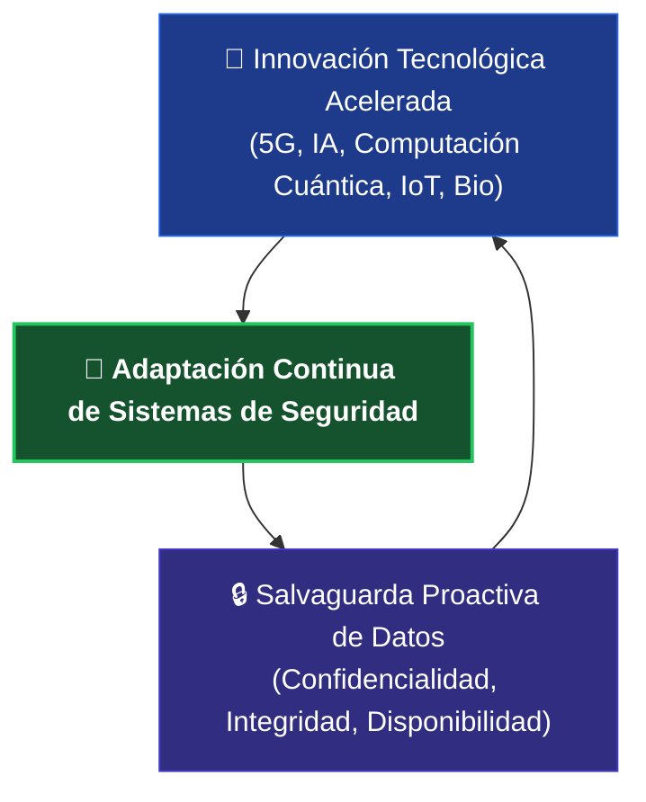

```
==========================================================================================
PUNTOS PARA RECORDAR - CONCEPTOS CLAVE
==========================================================================================

1. Las tecnologias emergentes son productos o servicios innovadores en las primeras fases
   de desarrollo, prueba o adopcion que tienen el potencial de revolucionar la vida, pero
   tambien de aumentar la vulnerabilidad a las ciberamenazas.

2. La inteligencia artificial (IA) es una tecnologia que involucra maquinas capaces de
   realizar tareas que normalmente requieren inteligencia humana.

3. La IA se puede emplear en ciberseguridad para tareas como la deteccion automatizada de
   malware, el analisis de comportamiento, la deteccion de patrones, el modelado predictivo,
   las evaluaciones automatizadas de vulnerabilidades y el analisis forense digital.

4. El Internet de las cosas (IoT) es una red de objetos fisicos integrados con sensores y
   tecnologias para conectarse e intercambiar datos. Los dispositivos IoT plantean riesgos
   para las ciberamenazas y requieren autenticacion solida, cifrado de datos, medidas de
   seguridad y actualizaciones periodicas.

5. 5G es la quinta generacion de redes celulares que proporciona conectividad mas rapida,
   baja latencia y mayor ancho de banda.

6. La 5G ofrece nuevas oportunidades, pero tambien crea vulnerabilidades en materia de
   proteccion de datos y privacidad.

7. Las organizaciones deben proteger las redes 5G con encriptacion, autenticacion, gestion
   de identidades y supervision proactiva.

8. La computacion cuantica emplea la mecanica cuantica para resolver problemas complejos
   mas rapido que las computadoras tradicionales.

9. La computacion cuantica tiene aplicaciones en ciberseguridad para una deteccion mas
   rapida de las amenazas, protocolos avanzados de encriptacion e identificacion mas
   precisa del codigo malicioso.

10. Las mejoras y tecnologias de biotecnologia pueden mejorar vidas, pero las medidas de
    ciberseguridad son necesarias para proteger la informacion personal y controlar los
    sistemas automatizados.

11. Los avances en genomica, nanotecnologia, IA, autenticacion biometrica y sensores
    basados en la biotecnologia se emplean para mejorar la ciberseguridad.

12. A medida que avanzan las tecnologias emergentes, los sistemas de seguridad deben
    evolucionar para contrarrestar las nuevas ciberamenazas. Una planeacion, unos recursos
    y unas medidas de seguridad adecuados pueden minimizar los riesgos y maximizar los
    beneficios potenciales de las tecnologias emergentes.

==========================================================================================
GRANDES IDEAS - HABILIDADES PRACTICADAS
==========================================================================================

Habilidades para la insercion laboral:

- Mentalidad de crecimiento
- Comunicacion escrita
- Pensamiento analitico

Actividades:

- Enumerar las tecnologias emergentes de las que ya eras consciente
- Examinar las habilidades que mejor conoces y las que te gustaria mejorar
- Identificar las certificaciones que te gustaria obtener
- Identificar los trabajos que mas te atraen y por que
- Resumir las amenazas emergentes a la ciberseguridad
- Describir el futuro de las tecnologias de ciberseguridad
- Describir el impacto de la tecnologia emergente en el campo de la ciberseguridad
- Explorar las carreras, certificaciones y habilidades de ciberseguridad que aprendiste

==========================================================================================
OBJETIVOS DE APRENDIZAJE
==========================================================================================

Ahora que has completado este modulo, deberias poder:

- Resumir las amenazas emergentes de ciberseguridad
- Describir el futuro de las tecnologias de ciberseguridad
- Describir el impacto de la tecnologia emergente en el ambito de la ciberseguridad

==========================================================================================

```

---

## 📚 Recursos de Profundización y Referencias Bibliográficas

### 🔍 Recursos Adicionales para el Desarrollo Profesional

Para profundizar en los conceptos de vanguardia discutidos a lo largo de este módulo, se listan los siguientes recursos audiovisuales y de investigación provistos por especialistas de la industria:

* **📺 Tendencias de Ciberseguridad:** Análisis de Jeff Crume (Ingeniero Distinguido de IBM Security) sobre la evolución del *ransomware*, el rol crítico de MFA, el avance de la Inteligencia Artificial, las amenazas de *deepfakes* y el impacto de la computación cuántica.
* **📺 Mapeo del Futuro de la Tecnología:** Conferencia de Darío Gil (Vicepresidente Sénior y Director de Investigación de IBM) enfocada en la importancia de trazar e interconectar guías de navegación para tecnologías que aún no se han descubierto.
* **📺 IA en Ciberseguridad (Multiplicador de Fuerza):** Explicación técnica de Jeff Crume sobre cómo la Inteligencia Artificial permite a las organizaciones optimizar la velocidad y la eficacia de sus defensas operativas.
* **📺 Convergencia Tecnológica (Quantum, AI y Nube Híbrida):** Panel de investigadores de IBM enfocado en el futuro de la computación mediante la integración sinérgica de la IA, el procesamiento cuántico y arquitecturas híbridas.
* **📺 Carreras y Oportunidades en Ciberseguridad:** Guía de orientación profesional a cargo de Jeff Crume que analiza las demandas del mercado actual y las trayectorias para profesionales de la seguridad.

---

### 📄 Fuentes y Referencias Oficiales del Módulo

A continuación se detalla el repositorio bibliográfico y las fuentes documentales utilizadas para el desarrollo de este módulo sobre amenazas emergentes y tecnologías de próxima generación:

1. **Inteligencia Artificial:** 
   * Feingold, Spencer. *¿Qué es la inteligencia artificial y qué no lo es?* Foro Económico Mundial (8 de marzo de 2023).
   * *¿Qué es la inteligencia artificial (IA)?* IBM (Consultado: junio 2024).
   * *IA y automatización para la ciberseguridad.* IBM Institute for Business Value (Consultado: junio 2024).
2. **Infraestructura de Conectividad y Redes Masivas:**
   * *¿Qué es Internet de las cosas (IoT)?* IBM (Consultado: junio 2024).
   * *5G explained.* Ericsson (Consultado: junio 2024).
3. **Casos de Estudio Forense y Operaciones de Seguridad:**
   * *Emotet Botnet Disrupted in International Cyber Operation.* Departamento de Justicia de los EE. UU. (28 de enero de 2021).
4. **Computación Avanzada y Ciencias Biológicas:**
   * *¿Qué es la computación cuántica?* IBM (Consultado: junio 2024).
   * *¿Qué es la biotecnología?* Organización de Innovación en Biotecnología (Consultado: junio 2024).

