# Microcredencial 2: Gestión de vulnerabilidades 🛡️

En este módulo, exploro las diversas ciberamenazas y las mejores prácticas para combatirlas, enfocándome en la protección de activos y la gestión de riesgos humanos y físicos.

## 🎯 Objetivos de Aprendizaje
Basado en el programa oficial de IBM SkillsBuild:
* **Análisis de Impacto:** Evaluar cómo las ciberamenazas afectan a los sistemas y procesos de una organización.
* **Mitigación de Malware:** Uso práctico de herramientas como Malwarebytes para eliminar virus y amenazas.
* **Ingeniería Social:** Identificación de tácticas de phishing en correos electrónicos.
* **Seguridad Física:** Desarrollo de planes de control para proteger edificios y dispositivos.

---

## 🗒️ Temario y Notas de Estudio

### 1. Tipos de Malware
* **Definición:** Software malicioso diseñado para infiltrarse o dañar un sistema.
* **Práctica:** Ejecución de escaneos de antivirus para detectar y eliminar amenazas comunes.

### 2. Ingeniería Social
* **Concepto:** Explotación de vulnerabilidades en la psicología humana.
* **Phishing:** Análisis de correos fraudulentos y sus características principales para evitar el robo de credenciales.

### 3. Amenazas Físicas y Controles Ambientales
* Protección de activos valiosos (servidores, dispositivos).
* **Controles Físicos:** Diseño de planes de seguridad para el acceso a instalaciones.

---

## 🛠️ Laboratorios Realizados
* [ ] Escaneo de amenazas con Malwarebytes.
* [ ] Análisis de casos de Phishing.
* [ ] Creación de un plan de control de seguridad física.

---

## 🌐 Peligros al Navegar por Internet
Al procesar y compartir información digital, nos exponemos a una gran variedad de ataques diseñados para obtener control o causar daño.

### 🚨 Tipos de Amenazas Digitales
* **Virus:** Cualquier programa que infecta un sistema sin permiso del usuario para ganar control o causar daño.
* **Adware:** Software no deseado diseñado para mostrar anuncios en el navegador, exponiéndonos a ataques maliciosos.
* **Keyloggers:** Herramientas que registran cada tecla presionada, permitiendo el robo de contraseñas, datos médicos y financieros.

### 🛡️ Controles de Seguridad y Soluciones
Para prevenir que estos ataques tengan éxito, se deben implementar diferentes tipos de controles:
* **Basados en Software:** Uso de programas antivirus y bloqueadores de anuncios (ad blockers).
* **Estándares de la Industria:** Implementación de marcos de trabajo como **CIS Controls** y **NIST**.

---
> *“A medida que los atacantes se vuelven más inteligentes, es vital conocer las amenazas y las debilidades que buscan explotar.”*
---

 
### 🦠 El Virus Informático: El riesgo de la interacción
Inspirados en los virus biológicos, estos programas se replican y propagan dañando los sistemas a su paso.

* **Definición:** Malware que se adjunta a archivos o programas legítimos para replicarse y saltar de un dispositivo a otro.
* **El factor humano (Activación):** Los virus **necesitan interacción del usuario** para ejecutarse. No actúan solos; necesitan que alguien "abra la puerta".
* **Vectores de infección comunes:**
    * Archivos adjuntos en correos electrónicos (documentos que parecen inofensivos pero son ejecutables disfrazados).
    * Descargas desde sitios web no confiables.
    * Conexión de dispositivos ya infectados (como pendrives o discos externos) a tu equipo.
* **Impacto y Daño:** * Disrupción de operaciones y alteración de datos críticos.
    * Borrado completo de discos duros.
    * El daño se intensifica exponencialmente a medida que el virus logra replicarse y extenderse por la red.
    

    **Worm (Gusano):** Malware independiente que se propaga automáticamente a través de las redes explotando vulnerabilidades, a diferencia del virus sin necesidad de intervención humana.
    Los gusanos pueden eliminar datos, saturar redes, degradar el rendimiento del hardware e instalar otro software malicioso.

    
---

## ☣️ Caso de Estudio: El Gusano Stuxnet
Stuxnet es uno de los ejemplos más famosos de cómo un malware puede saltar del mundo digital al mundo físico para causar daño real.

### 🔍 ¿Qué fue Stuxnet?
* **Definición:** Un gusano informático extremadamente complejo diseñado para sabotear infraestructuras críticas (específicamente centrífugas de procesamiento de uranio en Irán).
* **Vector de Infección:** Se propagó inicialmente a través de **unidades USB infectadas**, logrando saltar el "Air Gap" (aislamiento de red).
* **Modus Operandi:** * El malware enviaba señales falsas a los sensores de control industrial para ocultar su presencia mientras dañaba físicamente la maquinaria.
    * Fue diseñado para operar de forma totalmente sigilosa y mezclarse con las operaciones normales de la planta.

---

## ⏱️ Vulnerabilidades de Día Cero (Zero-day)
Stuxnet fue revolucionario porque utilizó múltiples vulnerabilidades de este tipo al mismo tiempo.

* **Concepto:** Son fallos de seguridad en un software o hardware que son previamente desconocidos por el fabricante.
* **El Riesgo:** Como el fabricante aún no conoce la debilidad, **no existe un parche o actualización** disponible para arreglarla.
* **Ataque de Día Cero:** Ocurre cuando un atacante descubre y explota esta vulnerabilidad antes de que el desarrollador tenga oportunidad de crear una defensa.

---
**Trojan (Troyano):** Se disfraza de software legítimo y útil para engañar al usuario. Su objetivo suele ser crear "puertas traseras" (backdoors) para el atacante.
Los atacantes disfrazan los troyanos como programas o archivos benignos, como juegos, fondos de pantalla u otras descargas.
Cuando ejecutas el troyano, el atacante puede controlar tu ordenador de forma remota, robar datos, espiar tu actividad, instalar malware,o realizar otras acciones maliciosas.
Y al igual que los gusanos, algunos troyanos no requieren la interacción del usuario para ejecutarse.

***

## 🐎 Troyanos (Trojans): El engaño como arma
A diferencia de los virus, los troyanos no se replican por sí mismos; utilizan el engaño para que el usuario les permita la entrada al sistema.

### 🔍 Caso de Estudio: Emotet
**Emotet** es un troyano avanzado diseñado originalmente para robar credenciales bancarias.

* **Vector de ataque:** Se propaga mediante archivos adjuntos de correo electrónico disfrazados de documentos de Microsoft Word.
* **Activación:** El malware se activa en cuanto el usuario hace clic en el archivo adjunto.
* **Persistencia:** Una vez dentro, utiliza ataques de **fuerza bruta** para adivinar contraseñas y propagarse por la red hacia unidades compartidas.

### 🔑 Concepto: Ataque de Fuerza Bruta (Brute Force)
* **Definición:** Es un método de "ensayo y error" donde el atacante intenta adivinar contraseñas o credenciales probando múltiples combinaciones hasta encontrar la correcta.
* **Uso en Emotet:** Sirve para ganar acceso a otros equipos y servidores dentro de la misma red una vez que el troyano inicial ha infectado una máquina.
###
## 🔒 Ransomware: El secuestro de datos
El Ransomware es un tipo de malware que toma como "rehén" a un sistema o a sus datos, restringiendo el acceso hasta que se pague un rescate.

### 🧠 Tácticas de Ataque y Psicología
Este malware es altamente efectivo porque utiliza el **miedo y el pánico** del usuario mediante mensajes alarmantes:
* **Falsas alertas de virus:** "Tu dispositivo tiene un virus. Para eliminarlo, haz clic aquí".
* **Amenazas de cifrado:** "Tus archivos están cifrados. Paga el rescate en menos de 48 horas para recuperar el acceso".

> **Nota Crítica:** A veces, el mensaje es un truco inicial; el malware puede no estar instalado hasta que el usuario interactúa con la alerta.

### ⚠️ Consecuencias y Recuperación
* **Complejidad:** La recuperación es tan difícil que suele requerir especialistas en recuperación de datos.
* **Sin garantías:** Pagar el rescate **no garantiza** que el atacante devuelva el acceso a los archivos.

### 😷 Caso de Estudio: WannaCry (El Ransomware Global)
WannaCry es uno de los ataques de ransomware más devastadores de la historia, destacando la importancia de mantener los sistemas actualizados.

* **Impacto Global:** En tan solo unas pocas horas, afectó a más de **150 países** y **230,000 computadoras**.
* **Modus Operandi:** * Una vez activado, cifraba los datos del usuario.
    * Instruía a las víctimas a pagar un rescate utilizando **criptomonedas** (monedas digitales no reguladas) para dificultar el rastreo del dinero.
* **El factor clave (Software desactualizado):** El ataque capitalizó vulnerabilidades en software antiguo, ensañándose particularmente con la **industria de la salud** (hospitales).
* **Costo Económico:** Se estima que WannaCry costó a las organizaciones más de **4 mil millones de dólares** en todo el mundo.

> **Lección de Seguridad:** La mayoría de las infecciones se habrían evitado si los sistemas hubieran tenido los parches de seguridad al día. Esto demuestra que la "Gobernanza" (gestión de actualizaciones) es una barrera técnica vital.

## 💣 Bomba Lógica (Logic Bomb)
Una bomba lógica es un código malicioso que permanece inactivo en un sistema hasta que se cumple una condición o evento específico para "detonarse".

### ⚙️ ¿Cómo funciona?
A diferencia de los virus o gusanos que atacan de inmediato, la bomba lógica espera un disparador (trigger):
* **Condición de tiempo:** Una fecha o hora específica (por ejemplo, el viernes 13 o el inicio de un nuevo año).
* **Condición de acción:** Que un usuario realice una tarea específica, como abrir un programa determinado o borrar un archivo.
* **Condición de ausencia:** Se puede programar para que se active si un empleado deja de ingresar su código (común en casos de "venganza" de empleados descontentos).

### ⚠️ Impacto y Peligro
* **Saboteo:** Puede borrar bases de datos completas, corromper archivos o apagar sistemas críticos de forma repentina.
* **Dificultad de Detección:** Al no realizar actividades sospechosas hasta su activación, puede pasar desapercibida por mucho tiempo para los antivirus tradicionales.

💣 Caso de Estudio: La Bomba Lógica en Siemens
Este caso demuestra que el malware también puede ser utilizado por empleados o consultores para crear una necesidad artificial de sus servicios.

El Incidente: Un consultor de programación externo para Siemens ocultó bombas lógicas dentro de programas de hojas de cálculo (spreadsheets) que él mismo había desarrollado para la empresa.

Modus Operandi: * Programó el malware para que se activara en fechas específicas, causando que los programas fallaran sistemáticamente.

Cada vez que los programas fallaban, la empresa lo volvía a contratar para "reparar" el problema.

Gracias a este esquema de engaño, el consultor ganó decenas de miles de dólares durante años.

Cómo fue descubierto: Una de las bombas se detonó mientras el consultor estaba fuera de la ciudad por otro motivo. Al no estar disponible para "arreglarlo", tuvo que proporcionar las contraseñas de acceso a los empleados de planta de Siemens, quienes al revisar el código descubrieron las instrucciones maliciosas ocultas.

Lección de Ciberseguridad: Este caso resalta la importancia de la Revisión de Código y el principio de Mínimo Privilegio. No se debe confiar ciegamente en el software proporcionado por terceros sin auditorías de seguridad, especialmente si tienen el control total del código 
### 🕵️ Spyware: El espía silencioso
# El Spyware es un software diseñado para recopilar datos de un dispositivo y enviarlos a un tercero sin que el usuario se dé cuenta.

🔍 Características y Funciones
Sigilo total: A diferencia del Ransomware, el Spyware no quiere que sepas que está ahí; su valor reside en permanecer oculto el mayor tiempo posible.

Recopilación de datos: Puede capturar historial de navegación, correos electrónicos y datos personales.

Keyloggers: Un tipo común de spyware que registra cada tecla que presionas, permitiendo a los atacantes robar contraseñas y números de tarjetas de crédito.

⚠️ Caso de Estudio: Pegasus
¿Qué es?: Uno de los spywares más sofisticados del mundo, desarrollado por NSO Group.

Impacto: Se hizo famoso por infectar teléfonos de periodistas, activistas y políticos de alto nivel.

Capacidad: Puede activar el micrófono, la cámara y leer mensajes de aplicaciones cifradas como WhatsApp sin que el usuario haga clic en ningún enlace (ataques de "clic cero").uente.

### 🕵️ Caso de Estudio: Dark Hotel (Keylogger & Wi-Fi)
Este ataque demuestra que incluso una red de hotel que solicita número de habitación y apellido puede ser una trampa para el espionaje corporativo.

* **El Método:** Los atacantes comprometen las redes Wi-Fi de hoteles de lujo para atacar a objetivos específicos (ejecutivos, periodistas).
* **El Engaño:** Al conectar el dispositivo, el usuario recibe una notificación para descargar una "actualización crítica" de software legítimo.
* **La Carga Útil (Keylogger):** El archivo descargado registra cada pulsación de tecla, permitiendo el robo de contraseñas, correos y datos bancarios.
* **Sigilo:** El programa está diseñado para autodestruirse después de recolectar una cantidad específica de datos, eliminando rastros antes de ser detectado.

---

## 🛡️ Tips de Seguridad: Viajero Seguro
Para evitar ataques como Dark Hotel o el robo de datos en tránsito, sigue estas prácticas:

1. **Uso de VPN:** Cifra siempre tu conexión cuando utilices redes Wi-Fi públicas o de hoteles.
2. **Desconfiar de Actualizaciones:** Nunca descargues actualizaciones de software mientras estés conectado a una red que no sea la de tu hogar u oficina.
3. **Autenticación de Dos Factores (2FA):** Incluso si un Keylogger roba tu contraseña, el 2FA evitará que el atacante entre a tus cuentas.
4. **Olvidar Redes:** Configura tu dispositivo para que no se conecte automáticamente a redes Wi-Fi abiertas.

## 📢 Adware (Advertising-supported Software)
El adware es software diseñado para mostrar anuncios no deseados de forma automática en tu dispositivo.

### 🔍 Características Principales
* **Propósito:** Generar ingresos para el desarrollador mediante la visualización de publicidad (pop-ups, banners o redirecciones en el navegador).
* **Método de entrada:** Suele venir "empaquetado" con software gratuito (freeware) o programas descargados de sitios no oficiales.
* **Comportamiento:** * Cambia la página de inicio del navegador sin permiso.
    * Muestra anuncios emergentes incluso cuando no estás navegando.
    * Puede ralentizar el rendimiento del sistema y consumir ancho de banda.

### ⚠️ El riesgo oculto: Malvertising
Aunque el adware suele ser solo molesto, puede cruzar la línea hacia el peligro real:
1. **Rastreo:** Puede actuar como un spyware básico, recolectando tu historial de búsqueda para "personalizar" los anuncios.
2. **Puerta de enlace:** Algunos anuncios pueden contener scripts maliciosos que instalan otros tipos de malware (como troyanos o ransomware) si haces clic en ellos.

### 🛠️ Prevención
* Utilizar bloqueadores de anuncios (**Ad-blockers**).
* Leer cuidadosamente los pasos de instalación de programas gratuitos para desmarcar "software adicional".
* Realizar escaneos periódicos con herramientas como **Malwarebytes**.

### 📦 Caso de Estudio: Fireball (Adware Masivo)
Descubierto en 2017, Fireball demostró que el adware puede ser una herramienta de espionaje y control a nivel global.

Escala del Ataque: Infectó a más de 250 millones de computadoras en todo el mundo.

Método de Infección: Se distribuía "empaquetado" (bundled) con otros programas de software legítimos e instalándose sin que el usuario se diera cuenta.

Acciones Maliciosas:

Secuestro del Navegador: Cambiaba el motor de búsqueda predeterminado por uno controlado por los atacantes para rastrear toda la actividad de navegación.

Ejecución de Código: Instalaba extensiones en el navegador capaces de ejecutar cualquier código que los creadores desearan, convirtiendo el equipo en una puerta abierta para otros malware.
####
### 🍪 Nota Técnica: Adware y el Rastreo de Cookies
Muchos tipos de Adware (como Fireball) no se limitan a mostrar anuncios; actúan como "espías comerciales" para monetizar tu actividad.

* **Perfilamiento de Usuario:** El adware recolecta cookies para rastrear hábitos de navegación y búsquedas, creando un perfil detallado que se vende a terceros.
* **Secuestro de Sesión (Session Hijacking):** En versiones avanzadas, si el adware roba una cookie de sesión activa, un atacante podría acceder a cuentas privadas sin necesidad de contraseña.
* **Extensiones Maliciosas:** Al instalar extensiones sin consentimiento, el adware puede leer y modificar datos de los sitios que visitas, comprometiendo toda tu privacidad.

> **🛡️ Tip de Seguridad:** Para mitigar este riesgo, es fundamental realizar limpiezas periódicas de cookies y utilizar bloqueadores de rastreo (trackers) en el navegador.

## 🤖 Bots y Botnets: El ejército zombi
Un **Bot** es un software malicioso diseñado para realizar tareas automáticas en internet bajo el control de un atacante remoto.

### 🕸️ ¿Qué es una Botnet?
Cuando miles o millones de dispositivos infectados (llamados "zombies") se conectan entre sí y son controlados por un único atacante (Botmaster), forman una **Botnet**.

* **Control Remoto:** Los bots esperan instrucciones de un servidor de "Comando y Control" (C2).
* **Propósito:** Se utilizan para realizar ataques a gran escala que un solo computador no podría lograr por sí solo.
* **Impacto:** Los dispositivos infectados suelen volverse lentos, ya que sus recursos (procesador y red) están siendo utilizados para tareas maliciosas sin que el dueño lo sepa.

### 🚨 Acciones comunes de una Botnet
1. **Ataques DDoS (Distributed Denial of Service):** Inundar un sitio web con tanto tráfico que se cae y deja de funcionar.
2. **Spam Masivo:** Enviar millones de correos basura o phishing de forma simultánea.
3. **Fuerza Bruta:** Usar miles de IPs diferentes para intentar adivinar contraseñas, evitando que el sistema bloquee una sola dirección.
4. **Minería de Criptomonedas:** Utilizar la potencia de cálculo de los dispositivos infectados para minar monedas digitales para el atacante.

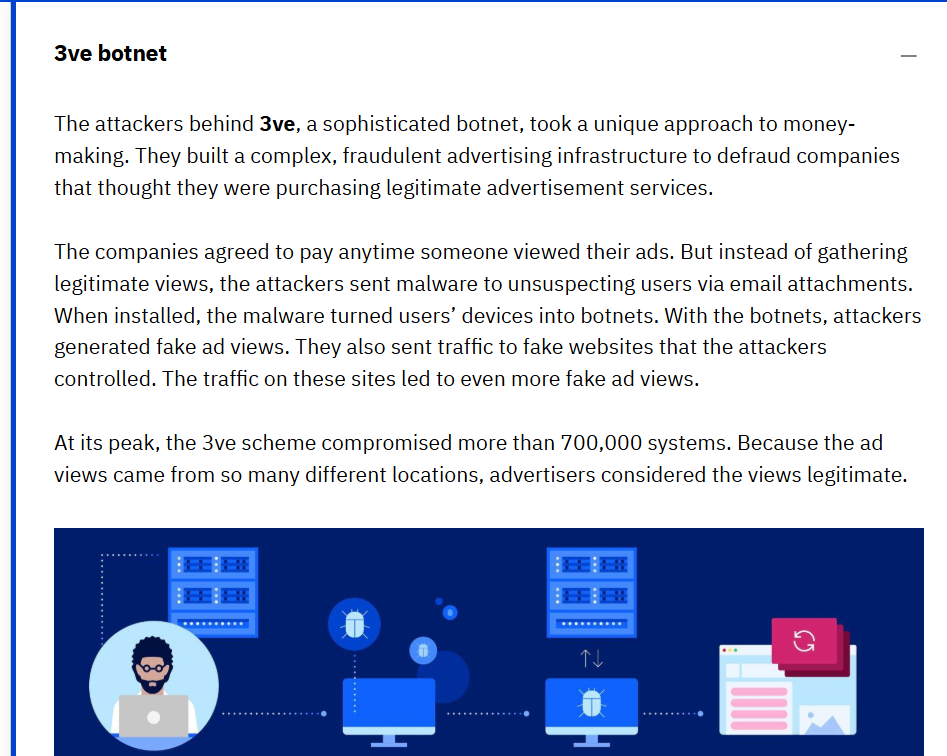

## 🕸️ Caso de Estudio: Botnet 3ve
Este caso es un ejemplo de una infraestructura criminal compleja diseñada para defraudar a empresas mediante publicidad engañosa.

El Objetivo: Engañar a empresas para que pagaran por servicios publicitarios que nunca llegaban a personas reales.

Método de Infección: Los atacantes enviaban malware a través de archivos adjuntos en correos electrónicos. Una vez instalados, estos archivos convertían los dispositivos de los usuarios en "bots".

Funcionamiento del Fraude:

Los dispositivos infectados (bots) generaban vistas de anuncios falsas.

También enviaban tráfico a sitios web falsos controlados por los mismos atacantes para generar aún más visualizaciones ficticias.

Escala y Sofisticación: En su punto máximo, el esquema comprometió más de 700,000 sistemas. Al venir de tantas ubicaciones diferentes, los anunciantes creían que las vistas eran legítimas.

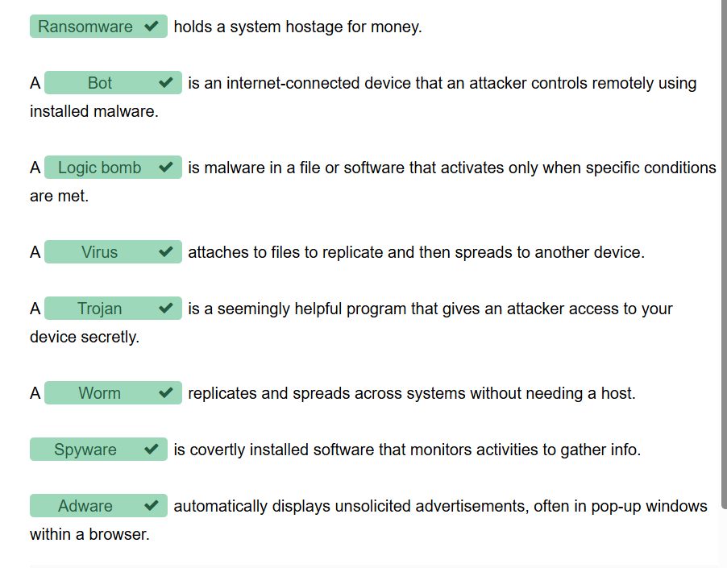

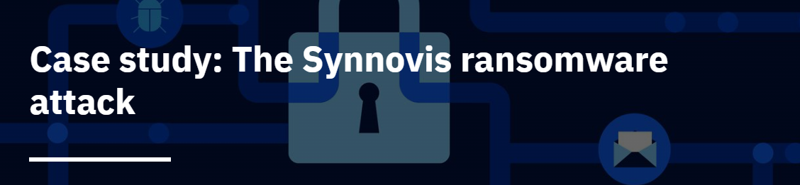

## 🏥 Caso de Estudio: Ataque de Ransomware a Synnovis (Londres, 2024)
Este incidente es un ejemplo crítico de cómo un ataque a un proveedor de servicios puede paralizar toda una red hospitalaria.

El Objetivo: Synnovis, un proveedor de servicios de diagnóstico y laboratorio para el Servicio Nacional de Salud (NHS) del Reino Unido.

El Incidente: El 3 de junio de 2024, un ataque de ransomware sofisticado explotó debilidades en la red, cifrando sistemas esenciales para la comunicación con los servidores del NHS.

Impacto en la Operación:

Cancelaciones Masivas: Se cancelaron miles de cirugías y citas médicas.

Falla en Patología: El departamento de patología quedó incomunicado, impidiendo el procesamiento de análisis de sangre de forma automatizada.

Crisis de Suministro: Se lanzó un llamado urgente para donaciones de sangre tipo O, ya que los hospitales no podían verificar las compatibilidades mediante sus sistemas habituales.

Respuesta ante el Incidente:

Creación de una fuerza de tareas con expertos internos y del NHS.

Colaboración con el National Cyber Security Centre (NCSC) y el equipo de Operaciones Cibernéticas.

Denuncia ante las autoridades policiales.

Lecciones de Ciberseguridad: Este caso resalta la necesidad de infraestructuras IT resilientes, monitoreo de red en tiempo real, sistemas de identidad seguros y, sobre todo, planes robustos de respuesta ante incidentes en el sector salud.

## 📚 Casos de Estudio: Análisis de Amenazas Reales

Esta sección analiza incidentes históricos y recientes que demuestran el impacto crítico del malware en infraestructuras globales y servicios esenciales.

### 1. Emotet: El Troyano de Propagación por Red
* **Tipo:** Troyano avanzado.
* **Objetivo:** Robo de credenciales bancarias de las víctimas.
* **Mecanismo:** Se propaga mediante archivos de Microsoft Word adjuntos en correos electrónicos. Al activarse, utiliza **fuerza bruta** (ensayo y error con contraseñas) para propagarse lateralmente por la red y replicarse en unidades compartidas.

### 2. WannaCry: Ransomware a Escala Global
* **Impacto:** Infectó más de 230,000 computadoras en 150 países en cuestión de horas.
* **Consecuencias:** Cifró datos críticos y exigió rescates en criptomonedas (moneda digital no regulada).
* **Lección:** Aprovechó software desactualizado, afectando gravemente a la industria de la salud y costando más de 4 mil millones de dólares a nivel mundial.

### 3. Caso Siemens: La Amenaza Interna (Bomba Lógica)
* **Incidente:** Un consultor externo insertó bombas lógicas en programas de hojas de cálculo.
* **Modus Operandi:** El malware se activaba en fechas específicas causando fallos en los programas, lo que obligaba a la empresa a recontratarlo para "repararlos".
* **Detección:** El esquema fue descubierto cuando una bomba se activó mientras el consultor estaba fuera de la ciudad y el personal interno tuvo acceso al código.

### 4. Synnovis (Junio 2024): Ransomware en Infraestructura Crítica
Este caso reciente (basado en reportes de *Dark Reading*, *The Standard* y *The Record*) destaca la vulnerabilidad actual de los sistemas de salud:
* **El Ataque:** Un ransomware interrumpió las operaciones del proveedor de laboratorios Synnovis, afectando a múltiples hospitales en Londres.
* **Impacto Humano:** * Cancelación masiva de cirugías y citas médicas.
    * Declaración de "incidente crítico" debido a la imposibilidad de procesar análisis de sangre.
    * Llamados urgentes a donantes de sangre tipo O porque los hospitales no podían verificar la compatibilidad de forma automatizada.

### 📖 Fuentes y Referencias (Case Study: Synnovis)
*Este análisis se basa en la recopilación de información de las siguientes fuentes oficiales y de prensa técnica:*

* **Montalbano, Elizabeth.** *Ransomware Attack Disrupts Operations Across London Hospital*. [Dark Reading](https://www.darkreading.com), 5 de junio, 2024.
* **Dollar, Mark.** *Synnovis’ Statement on This Week’s Cyberattack*. [Synnovis Official](https://www.synnovis.co.uk), 4 de junio, 2024.
* **Davidson, Tom.** *Critical incident at London hospitals due to cyber attack with surgeries cancelled*. [The Standard](https://www.standard.co.uk), 4 de junio, 2024.
* **Martin, Alexander.** *Urgent call for O-type blood donations following London hospitals ransomware attack*. [The Record](https://therecord.media), 10 de junio, 2024.
### 🔬 Impacto Técnico en el Departamento de Patología
El ataque no solo cifró archivos, sino que rompió la interconectividad, que es el corazón de la medicina moderna.

### 1. Afectación de Operaciones Técnicas (El "Cómo")
Corte de Comunicación con el NHS: El malware bloqueó la conexión entre los laboratorios de Synnovis y los servidores de los hospitales del NHS. Esto significó que, aunque se hiciera un análisis de sangre, no había forma digital de enviar el resultado al médico.

Parálisis del Sistema LIMS (Laboratory Information Management System): Estos sistemas automatizan el seguimiento de muestras. Al estar cifrados, el departamento tuvo que volver a registros manuales con papel y lápiz, lo que redujo la eficiencia en un 80-90%.

Inaccesibilidad a Datos Críticos: Se perdió el acceso inmediato a historiales clínicos y, lo más grave, a las bases de datos de tipificación sanguínea.

### 2. Efectos a Corto Plazo: Caos Operativo
Cancelación de Cirugías: Sin resultados de laboratorio (especialmente pruebas de compatibilidad sanguínea), las cirugías no son seguras. Miles de procedimientos fueron suspendidos.

Riesgo de Vida Inmediato: Las necesidades urgentes de transfusiones se volvieron críticas. Al no poder cruzar datos sanguíneos digitalmente, se dependió de donaciones universales (Tipo O), agotando las reservas de emergencia.

Carga de Trabajo Humana: El personal técnico tuvo que procesar todo manualmente, aumentando exponencialmente el riesgo de error humano.

### 3. Efectos a Largo Plazo: La Huella del Desastre
Recuperación de Datos (El Gran Desafío): Como bien dijiste, recuperar la información es un proceso lento. Si los backups fueron comprometidos o si el cifrado es demasiado complejo, existe la posibilidad real de pérdida permanente de historiales clínicos.

Efecto Dominó en la Salud: La mora en los diagnósticos de hoy se traduce en complicaciones médicas en meses o años. Los pacientes con cáncer o enfermedades crónicas perdieron semanas de seguimiento crítico.

Desconfianza y Costos de Reconstrucción: El departamento de TI ahora debe reconstruir la infraestructura desde cero con un enfoque de "Confianza Cero" (Zero Trust), lo cual es costoso y requiere meses de reajuste técnico.

### 🏛️ Impacto en Procesos y Servicios: El Efecto Dominó de Synnovis
El ataque no solo detuvo servidores; alteró la naturaleza misma de la atención médica en Londres.

1. Atención al Paciente (Patient Care)
Segmentación del Impacto: Como bien notaste, el impacto fue catastrófico para el paciente crítico. Las cirugías programadas y trasplantes (que requieren pruebas de sangre en tiempo real) se detuvieron.

Paciente Ambulatorio: Si bien los que "caminan" pudieron ser reprogramados, el retraso en diagnósticos de rutina (como análisis de glucosa o colesterol) genera una "bola de nieve" de casos sin tratar que afectará al sistema meses después.

2. Carga de Trabajo de los Empleados (Employee Workload)
Regreso al Papel: El personal técnico y médico pasó de procesos digitales instantáneos a registros manuales. Esto triplica el tiempo de cada tarea.

Estrés y Fatiga: Aunque no se informe oficialmente de inmediato, la presión de manejar emergencias sin datos precisos genera un agotamiento extremo (burnout) en el personal de guardia.

3. Complicaciones en Respuesta de Emergencias
Derivación de Pacientes: Al no poder procesar análisis urgentes, las ambulancias tuvieron que desviar pacientes a otros centros de salud fuera de su zona, aumentando los tiempos de respuesta y saturando otros hospitales que no estaban preparados para esa carga extra.

4. Finanzas
Costos Directos e Indirectos:

Inversión de Emergencia: Contratación de expertos forenses y firmas de ciberseguridad para la recuperación.

Horas Extras: Pago de personal trabajando 24/7 para restablecer sistemas y atender pacientes manualmente.

Pérdida de Ingresos: Cirugías canceladas representan una pérdida económica masiva para el proveedor.

5. Asignación de Recursos (Resource Allocation)
Priorización de Ciberseguridad: Reasignación de presupuestos destinados a otras áreas para fortalecer la infraestructura de red y sistemas de identidad.

Recursos Humanos: Movilización de equipos de TI de otras sedes del NHS para apoyar en la limpieza de los 700,000 sistemas comprometidos.

6. Relaciones Públicas (Public Relations)
Crisis de Reputación: Como mencionas, genera desconfianza social. La sociedad se pregunta: "¿Están mis datos médicos seguros?".

Transparencia: La organización debe gestionar una comunicación constante para mitigar el pánico, especialmente cuando se lanzan pedidos públicos de donación de sangre, lo que hace que la amenaza sea visible para todos.

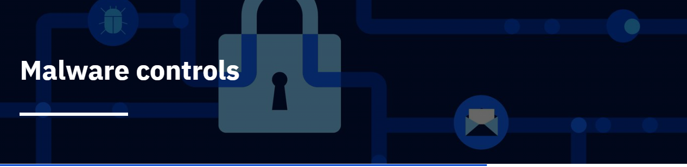
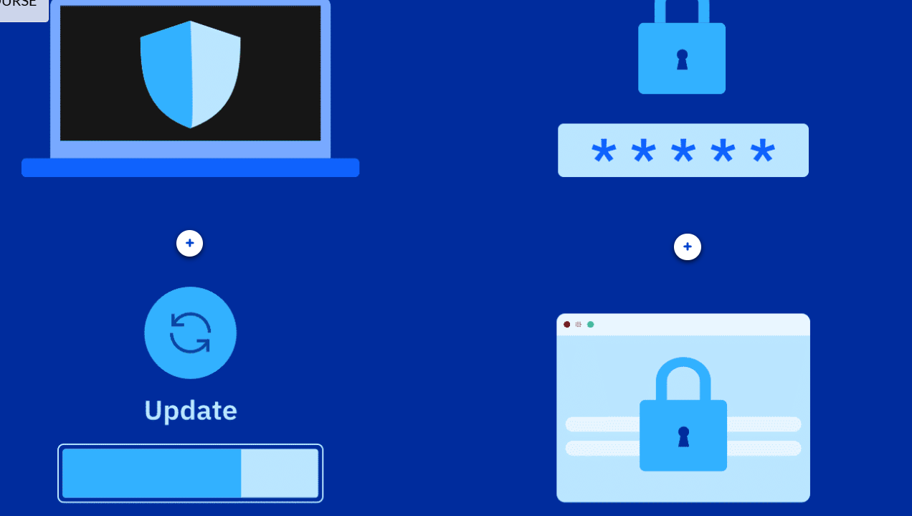
## 🛡️ Software Antimalware: El Motor de Detección
El software antimalware (o antivirus) actúa como un guardia de seguridad que compara a cada visitante con una base de datos de "delincuentes conocidos".

🔍 Detección por Firmas (Signature-based Detection)
Es el método más común y efectivo para amenazas ya identificadas.

¿Qué es una Firma? Es un patrón de atributos único (como un hash o una secuencia de código) que identifica un malware específico.

El Proceso: El software escanea cada archivo del dispositivo y compara su "huella digital" con una base de datos global de firmas.

Acciones tras la detección:

Eliminación: Borra el archivo infectado permanentemente.

Cuarentena: Mueve el archivo a una zona aislada y segura donde no puede ejecutarse ni dañar el sistema.

Alerta: Notifica al usuario sobre una posible infección para que tome una decisión manual.

🌐 Implementación en Entornos Profesionales
Como futuro Analista, es importante distinguir las dos formas de gestionar estos sistemas:

Local: Instalación individual en cada dispositivo (ideal para usuarios finales).

Centralizada: El software se corre y administra desde un servidor central. Esto permite a los administradores de TI monitorear toda la red de la empresa, desplegar actualizaciones de firmas y responder a amenazas en miles de equipos al mismo tiempo.

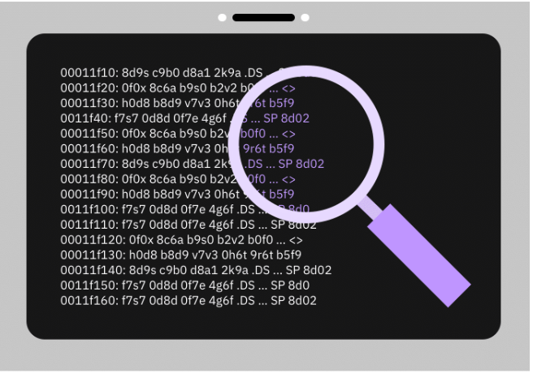

# 🛡️ Unidad 2: Controles y Mitigación de Malware

En esta sección se documentan las estrategias y herramientas fundamentales para prevenir, detectar y neutralizar las amenazas informáticas.

## ⚙️ El Motor de Detección: Software Antimalware
El software antimalware (antivirus) es una pieza crítica de la seguridad del endpoint. Su funcionamiento principal se basa en:

* **Detección por Firmas (Signatures):** El software compara archivos con una base de datos de "huellas digitales" de malware conocido.
* **Análisis Heurístico:** Identifica amenazas nuevas basándose en comportamientos sospechosos, no solo en patrones fijos.
* **Acciones de Respuesta:**
    * **Cuarentena:** Aislamiento lógico del archivo en una zona segura donde no puede ejecutarse ni dañar el sistema.
    * **Eliminación:** Borrado permanente del código malicioso.
    * **Alerta:** Notificación al usuario para una toma de decisión manual (especialmente ante "falsos positivos").

---

## 📊 Comparativa Técnica: Antivirus vs. Firewall
Es común confundirlos, pero operan en capas diferentes de la **Defensa en Profundidad**.

| Característica | Antivirus / Antimalware | Firewall (Cortafuegos) |
| :--- | :--- | :--- |
| **Nivel de Acción** | Analiza archivos internos (Disco/Memoria). | Analiza el tráfico de red (Internet/LAN). |
| **Función** | Detectar y eliminar código malicioso. | Bloquear accesos no autorizados. |
| **Metodología** | Escaneo de firmas y comportamiento. | Filtrado de puertos y direcciones IP. |
| **Analogía** | El guardia de seguridad **interno**. | El portero o **reja** del edificio. |

---

## 🛠️ Buenas Prácticas de Mitigación
Ninguna herramienta es 100% infalible; la seguridad requiere un conjunto de controles:

1. **Gestión de Parches (Patch Management):** Mantener el sistema operativo y aplicaciones al día para cerrar vulnerabilidades conocidas.
2. **Higiene de Contraseñas:** Uso de frases robustas y **MFA** (Autenticación de Múltiples Factores).
3. **Navegación Segura:** Bloqueo de URLs maliciosas y desconfianza ante adjuntos sospechosos (anti-phishing).
4. **Gestión Centralizada:** En entornos empresariales, el antimalware se administra desde un servidor central para monitorear toda la red simultáneamente.

---

## 🧪 Práctica de Laboratorio: Malwarebytes
## 🛠️ Herramientas de Defensa: Malwarebytes
Malwarebytes es una solución de seguridad avanzada que complementa a los antivirus tradicionales mediante la detección de exploits, ransomware y programas potencialmente no deseados (PUPs).

### 🔍 Tipos de Análisis y Protección
Para mantener la integridad del sistema, se utilizan tres modalidades de defensa:

1. **Escaneo Programado (Scheduled Scan):**
    * Se ejecuta automáticamente en intervalos definidos (ej: lunes a las 9:00 AM).
    * **Ventaja:** Garantiza que el sistema se revise periódicamente sin intervención del usuario.
    * *Nota:* El dispositivo debe estar encendido para completar la tarea.

2. **Escaneo Bajo Demanda (On-demand Scan):**
    * Se inicia manualmente mediante la interacción del usuario.
    * **Uso ideal:** Tras descargar archivos sospechosos o notar un comportamiento inusual en el sistema.

3. **Protección en Tiempo Real (Real-time Protection):**
    * Monitoreo constante de la actividad del sistema y la red.
    * **Funciones clave:**
        * Bloquea malware antes de que se ejecute.
        * Evita el acceso a sitios web maliciosos conocidos.
        * Detiene intentos de explotación de vulnerabilidades en aplicaciones.

---

### 🧪 Guía de Laboratorio: Mitigación con Malwarebytes
*En esta sección se documentará la experiencia práctica utilizando la herramienta.*

#### Pasos realizados:
* **Escaneo Crítico:** Análisis de objetos en memoria, elementos de inicio y registro.
* **Detección de Amenazas:** Identificación de firmas de malware y heurística de comportamiento.
* **Gestión de Resultados:**
    * **Cuarentena:** Aislamiento de archivos detectados para prevenir su ejecución.
    * **Informe de Escaneo:** Revisión de las rutas de archivos afectados y nombres de las amenazas.

> **💡 Dato de carrera:** Los **Analistas de Malware** utilizan estas herramientas no solo para limpiar sistemas, sino para estudiar el comportamiento de las amenazas en entornos controlados (Sandboxing) y fortalecer las reglas del Firewall.
* **Estado:** Pendiente de ejecución.
* **Objetivo:** Realizar un escaneo completo, identificar PUPs (Programas Potencialmente No Deseados) y gestionar la cuarentena.

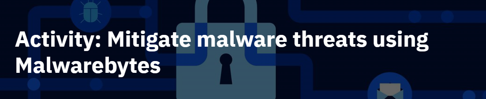

### 📝 Resolución de Incidente: Caso Martino
* **Problema:** El usuario reportó programas no autorizados, lentitud extrema y desactivación de software de seguridad.
* **Diagnóstico:** Infección por **Troyano (Trojan)**.
* **Justificación técnica:** Los troyanos actúan como "puertas traseras" (*backdoors*). A diferencia del spyware (que busca ser invisible), este incidente fue "ruidoso" debido a la instalación masiva de software adicional y la manipulación directa de las políticas de seguridad del sistema.
* **Acción Correctiva:** Ejecución de análisis profundo con **Malwarebytes** para identificar y remover los ejecutables maliciosos y restaurar la configuración del sistema.

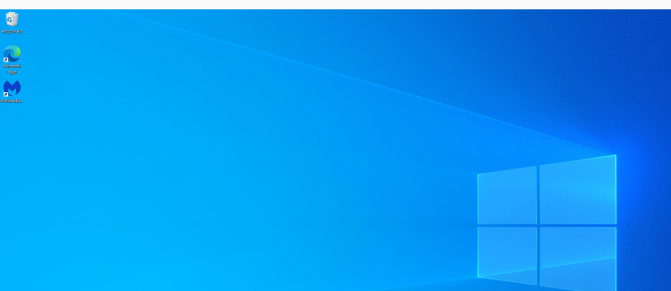
## paso 1
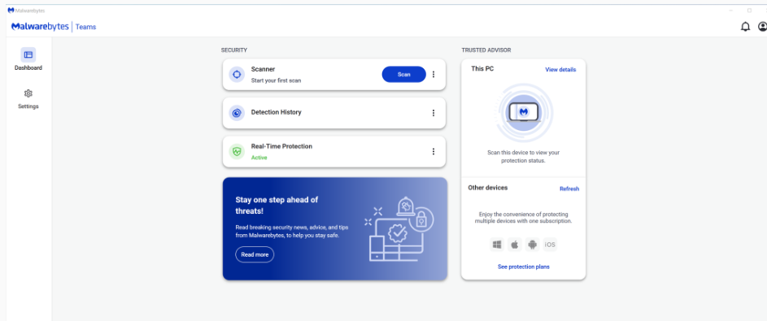
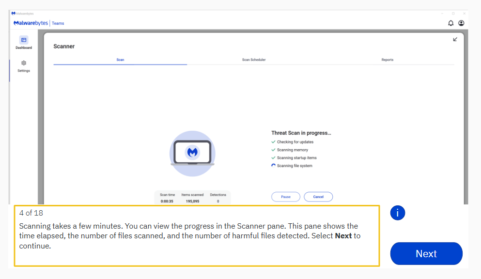
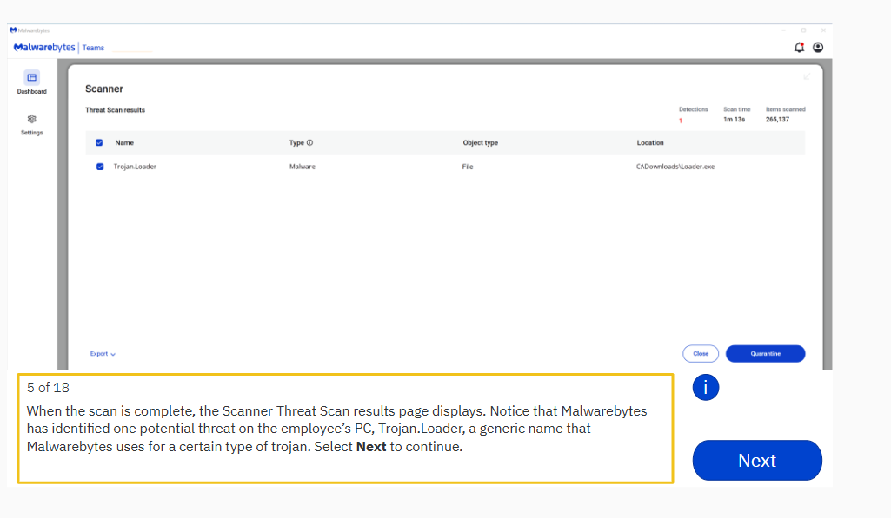
### 🔬 Reporte de Escaneo: Caso Martino
Tras ejecutar un **Threat Scan** (Análisis de Amenazas) con Malwarebytes, se obtuvieron los siguientes resultados:

* **Amenaza Detectada:** `Trojan.Loader`
* **Tipo:** Malware / Troyano.
* **Ubicación:** `C:\Downloads\Loader.exe`
* **Estado:** Identificado y listo para ser enviado a **Cuarentena**.
* **Análisis Técnico:** El archivo se encontraba en la carpeta de Descargas, lo que sugiere que el usuario pudo haberlo bajado pensando que era un software legítimo (ingeniería social). Este tipo de troyano es responsable de instalar otros programas maliciosos, explicando por qué Martino veía aplicaciones nuevas en su sistema.

#### Acciones Realizadas en la Simulación:
1.  **Escaneo Completo:** Se analizaron más de 265,000 elementos en 1 minuto y 13 segundos.
2.  **Identificación:** El motor de firmas detectó el hash malicioso de `Loader.exe`.
3.  **Aislamiento:** El siguiente paso es seleccionar **"Quarantine"** para mover el archivo a un entorno seguro donde no pueda ejecutarse.
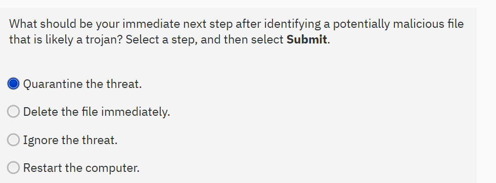
## 💡 Un detalle de "pro" 
En la ruta del archivo: C:\Downloads\Loader.exe.
Como futuro analista, esto me dice que la capacitación en concientización de seguridad para los empleados es tan importante como tener el antivirus. Si Martino no hubiera descargado ese archivo, el troyano nunca habría entrado.
#### 🔍 ¿Por qué fallaron los controles preventivos?
En el incidente de Martino, se identificaron las siguientes brechas:
1. **Falla de Capa de Red (Firewall):** El malware ingresó mediante una descarga web autorizada (Puerto 443), evadiendo el filtrado de paquetes básico.
2. **Ausencia de Protección Endpoint:** Sin un agente activo (como Malwarebytes en tiempo real), el sistema no pudo analizar el archivo en el momento de la descarga.
3. **Factor Humano:** La ejecución manual del archivo `Loader.exe` permitió que el troyano escalara privilegios y deshabilitara las defensas locales del sistema.
## Moraleja técnica: Por eso hoy se habla de "Zero Trust" (Nunca confiar, siempre verificar). No alcanza con un Firewall; necesitás que el Antivirus esté siempre vigilando y que el usuario esté capacitado.

## "La seguridad no es un producto, es un proceso. El hecho de que un archivo sea descargado exitosamente no garantiza su integridad; la ejecución de ejecutables desconocidos sin un análisis multiplataforma representa el mayor vector de riesgo para el sistema."

### Nota técnica: "Para una defensa robusta, se recomienda el uso complementario de VirusTotal como herramienta de análisis estático (previo a la ejecución) y Malwarebytes como herramienta de análisis dinámico y remediación de incidentes."

### ⚠️ Incidente Real: Detección de Troyano en Software de Streaming (experiencia de campo)
* **Escenario:** Tras la instalación de complementos (add-ons) en Stremio, Windows Defender emitió una alerta de troyano.
* **Acción de Respuesta:**
    1. Aislamiento y eliminación inmediata mediante Windows Defender.
    2. Ejecución de análisis secundario con Malwarebytes para asegurar que no existan restos de persistencia.
* **Lección Aprendida:** Los repositorios de terceros y complementos de comunidad son vectores comunes para la distribución de malware. La defensa en capas (Defender + escaneo manual) es vital incluso en software de uso cotidiano.

