# Microcredencial 2: Gestión de vulnerabilidades 🛡️

En este módulo, exploro las diversas ciberamenazas y las mejores prácticas para combatirlas, enfocándome en la protección de activos y la gestión de riesgos humanos y físicos.

## 🎯 Objetivos de Aprendizaje
Basado en el programa oficial de IBM SkillsBuild:
* **Análisis de Impacto:** Evaluar cómo las ciberamenazas afectan a los sistemas y procesos de una organización.
* **Mitigación de Malware:** Uso práctico de herramientas como Malwarebytes para eliminar virus y amenazas.
* **Ingeniería Social:** Identificación de tácticas de phishing en correos electrónicos.
* **Seguridad Física:** Desarrollo de planes de control para proteger edificios y dispositivos.

---

## 🗒️ Temario y Notas de Estudio

### 1. Tipos de Malware
* **Definición:** Software malicioso diseñado para infiltrarse o dañar un sistema.
* **Práctica:** Ejecución de escaneos de antivirus para detectar y eliminar amenazas comunes.

### 2. Ingeniería Social
* **Concepto:** Explotación de vulnerabilidades en la psicología humana.
* **Phishing:** Análisis de correos fraudulentos y sus características principales para evitar el robo de credenciales.

### 3. Amenazas Físicas y Controles Ambientales
* Protección de activos valiosos (servidores, dispositivos).
* **Controles Físicos:** Diseño de planes de seguridad para el acceso a instalaciones.

---

## 🛠️ Laboratorios Realizados
* [ ] Escaneo de amenazas con Malwarebytes.
* [ ] Análisis de casos de Phishing.
* [ ] Creación de un plan de control de seguridad física.

---

## 🌐 Peligros al Navegar por Internet
Al procesar y compartir información digital, nos exponemos a una gran variedad de ataques diseñados para obtener control o causar daño.

### 🚨 Tipos de Amenazas Digitales
* **Virus:** Cualquier programa que infecta un sistema sin permiso del usuario para ganar control o causar daño.
* **Adware:** Software no deseado diseñado para mostrar anuncios en el navegador, exponiéndonos a ataques maliciosos.
* **Keyloggers:** Herramientas que registran cada tecla presionada, permitiendo el robo de contraseñas, datos médicos y financieros.

### 🛡️ Controles de Seguridad y Soluciones
Para prevenir que estos ataques tengan éxito, se deben implementar diferentes tipos de controles:
* **Basados en Software:** Uso de programas antivirus y bloqueadores de anuncios (ad blockers).
* **Estándares de la Industria:** Implementación de marcos de trabajo como **CIS Controls** y **NIST**.


---
> *“A medida que los atacantes se vuelven más inteligentes, es vital conocer las amenazas y las debilidades que buscan explotar.”*
---


 
### 🦠 El Virus Informático: El riesgo de la interacción
Inspirados en los virus biológicos, estos programas se replican y propagan dañando los sistemas a su paso.

* **Definición:** Malware que se adjunta a archivos o programas legítimos para replicarse y saltar de un dispositivo a otro.
* **El factor humano (Activación):** Los virus **necesitan interacción del usuario** para ejecutarse. No actúan solos; necesitan que alguien "abra la puerta".
* **Vectores de infección comunes:**
    * Archivos adjuntos en correos electrónicos (documentos que parecen inofensivos pero son ejecutables disfrazados).
    * Descargas desde sitios web no confiables.
    * Conexión de dispositivos ya infectados (como pendrives o discos externos) a tu equipo.
* **Impacto y Daño:** * Disrupción de operaciones y alteración de datos críticos.
    * Borrado completo de discos duros.
    * El daño se intensifica exponencialmente a medida que el virus logra replicarse y extenderse por la red.
    

    **Worm (Gusano):** Malware independiente que se propaga automáticamente a través de las redes explotando vulnerabilidades, a diferencia del virus sin necesidad de intervención humana.
    Los gusanos pueden eliminar datos, saturar redes, degradar el rendimiento del hardware e instalar otro software malicioso.

    
---

## ☣️ Caso de Estudio: El Gusano Stuxnet
Stuxnet es uno de los ejemplos más famosos de cómo un malware puede saltar del mundo digital al mundo físico para causar daño real.

### 🔍 ¿Qué fue Stuxnet?
* **Definición:** Un gusano informático extremadamente complejo diseñado para sabotear infraestructuras críticas (específicamente centrífugas de procesamiento de uranio en Irán).
* **Vector de Infección:** Se propagó inicialmente a través de **unidades USB infectadas**, logrando saltar el "Air Gap" (aislamiento de red).
* **Modus Operandi:** * El malware enviaba señales falsas a los sensores de control industrial para ocultar su presencia mientras dañaba físicamente la maquinaria.
    * Fue diseñado para operar de forma totalmente sigilosa y mezclarse con las operaciones normales de la planta.

---

## ⏱️ Vulnerabilidades de Día Cero (Zero-day)
Stuxnet fue revolucionario porque utilizó múltiples vulnerabilidades de este tipo al mismo tiempo.

* **Concepto:** Son fallos de seguridad en un software o hardware que son previamente desconocidos por el fabricante.
* **El Riesgo:** Como el fabricante aún no conoce la debilidad, **no existe un parche o actualización** disponible para arreglarla.
* **Ataque de Día Cero:** Ocurre cuando un atacante descubre y explota esta vulnerabilidad antes de que el desarrollador tenga oportunidad de crear una defensa.

---
**Trojan (Troyano):** Se disfraza de software legítimo y útil para engañar al usuario. Su objetivo suele ser crear "puertas traseras" (backdoors) para el atacante.
Los atacantes disfrazan los troyanos como programas o archivos benignos, como juegos, fondos de pantalla u otras descargas.
Cuando ejecutas el troyano, el atacante puede controlar tu ordenador de forma remota, robar datos, espiar tu actividad, instalar malware,o realizar otras acciones maliciosas.
Y al igual que los gusanos, algunos troyanos no requieren la interacción del usuario para ejecutarse.

***


## 🐎 Troyanos (Trojans): El engaño como arma
A diferencia de los virus, los troyanos no se replican por sí mismos; utilizan el engaño para que el usuario les permita la entrada al sistema.

### 🔍 Caso de Estudio: Emotet
**Emotet** es un troyano avanzado diseñado originalmente para robar credenciales bancarias.

* **Vector de ataque:** Se propaga mediante archivos adjuntos de correo electrónico disfrazados de documentos de Microsoft Word.
* **Activación:** El malware se activa en cuanto el usuario hace clic en el archivo adjunto.
* **Persistencia:** Una vez dentro, utiliza ataques de **fuerza bruta** para adivinar contraseñas y propagarse por la red hacia unidades compartidas.


### 🔑 Concepto: Ataque de Fuerza Bruta (Brute Force)
* **Definición:** Es un método de "ensayo y error" donde el atacante intenta adivinar contraseñas o credenciales probando múltiples combinaciones hasta encontrar la correcta.
* **Uso en Emotet:** Sirve para ganar acceso a otros equipos y servidores dentro de la misma red una vez que el troyano inicial ha infectado una máquina.
###
## 🔒 Ransomware: El secuestro de datos
El Ransomware es un tipo de malware que toma como "rehén" a un sistema o a sus datos, restringiendo el acceso hasta que se pague un rescate.

### 🧠 Tácticas de Ataque y Psicología
Este malware es altamente efectivo porque utiliza el **miedo y el pánico** del usuario mediante mensajes alarmantes:
* **Falsas alertas de virus:** "Tu dispositivo tiene un virus. Para eliminarlo, haz clic aquí".
* **Amenazas de cifrado:** "Tus archivos están cifrados. Paga el rescate en menos de 48 horas para recuperar el acceso".

> **Nota Crítica:** A veces, el mensaje es un truco inicial; el malware puede no estar instalado hasta que el usuario interactúa con la alerta.

### ⚠️ Consecuencias y Recuperación
* **Complejidad:** La recuperación es tan difícil que suele requerir especialistas en recuperación de datos.
* **Sin garantías:** Pagar el rescate **no garantiza** que el atacante devuelva el acceso a los archivos.


### 😷 Caso de Estudio: WannaCry (El Ransomware Global)
WannaCry es uno de los ataques de ransomware más devastadores de la historia, destacando la importancia de mantener los sistemas actualizados.

* **Impacto Global:** En tan solo unas pocas horas, afectó a más de **150 países** y **230,000 computadoras**.
* **Modus Operandi:** * Una vez activado, cifraba los datos del usuario.
    * Instruía a las víctimas a pagar un rescate utilizando **criptomonedas** (monedas digitales no reguladas) para dificultar el rastreo del dinero.
* **El factor clave (Software desactualizado):** El ataque capitalizó vulnerabilidades en software antiguo, ensañándose particularmente con la **industria de la salud** (hospitales).
* **Costo Económico:** Se estima que WannaCry costó a las organizaciones más de **4 mil millones de dólares** en todo el mundo.


> **Lección de Seguridad:** La mayoría de las infecciones se habrían evitado si los sistemas hubieran tenido los parches de seguridad al día. Esto demuestra que la "Gobernanza" (gestión de actualizaciones) es una barrera técnica vital.

## 💣 Bomba Lógica (Logic Bomb)
Una bomba lógica es un código malicioso que permanece inactivo en un sistema hasta que se cumple una condición o evento específico para "detonarse".

### ⚙️ ¿Cómo funciona?
A diferencia de los virus o gusanos que atacan de inmediato, la bomba lógica espera un disparador (trigger):
* **Condición de tiempo:** Una fecha o hora específica (por ejemplo, el viernes 13 o el inicio de un nuevo año).
* **Condición de acción:** Que un usuario realice una tarea específica, como abrir un programa determinado o borrar un archivo.
* **Condición de ausencia:** Se puede programar para que se active si un empleado deja de ingresar su código (común en casos de "venganza" de empleados descontentos).

### ⚠️ Impacto y Peligro
* **Saboteo:** Puede borrar bases de datos completas, corromper archivos o apagar sistemas críticos de forma repentina.
* **Dificultad de Detección:** Al no realizar actividades sospechosas hasta su activación, puede pasar desapercibida por mucho tiempo para los antivirus tradicionales.


💣 Caso de Estudio: La Bomba Lógica en Siemens
Este caso demuestra que el malware también puede ser utilizado por empleados o consultores para crear una necesidad artificial de sus servicios.

El Incidente: Un consultor de programación externo para Siemens ocultó bombas lógicas dentro de programas de hojas de cálculo (spreadsheets) que él mismo había desarrollado para la empresa.

Modus Operandi: * Programó el malware para que se activara en fechas específicas, causando que los programas fallaran sistemáticamente.

Cada vez que los programas fallaban, la empresa lo volvía a contratar para "reparar" el problema.

Gracias a este esquema de engaño, el consultor ganó decenas de miles de dólares durante años.

Cómo fue descubierto: Una de las bombas se detonó mientras el consultor estaba fuera de la ciudad por otro motivo. Al no estar disponible para "arreglarlo", tuvo que proporcionar las contraseñas de acceso a los empleados de planta de Siemens, quienes al revisar el código descubrieron las instrucciones maliciosas ocultas.

Lección de Ciberseguridad: Este caso resalta la importancia de la Revisión de Código y el principio de Mínimo Privilegio. No se debe confiar ciegamente en el software proporcionado por terceros sin auditorías de seguridad, especialmente si tienen el control total del código 
### 🕵️ Spyware: El espía silencioso
# El Spyware es un software diseñado para recopilar datos de un dispositivo y enviarlos a un tercero sin que el usuario se dé cuenta.

🔍 Características y Funciones
Sigilo total: A diferencia del Ransomware, el Spyware no quiere que sepas que está ahí; su valor reside en permanecer oculto el mayor tiempo posible.

Recopilación de datos: Puede capturar historial de navegación, correos electrónicos y datos personales.

Keyloggers: Un tipo común de spyware que registra cada tecla que presionas, permitiendo a los atacantes robar contraseñas y números de tarjetas de crédito.

⚠️ Caso de Estudio: Pegasus
¿Qué es?: Uno de los spywares más sofisticados del mundo, desarrollado por NSO Group.

Impacto: Se hizo famoso por infectar teléfonos de periodistas, activistas y políticos de alto nivel.

Capacidad: Puede activar el micrófono, la cámara y leer mensajes de aplicaciones cifradas como WhatsApp sin que el usuario haga clic en ningún enlace (ataques de "clic cero").uente.

### 🕵️ Caso de Estudio: Dark Hotel (Keylogger & Wi-Fi)
Este ataque demuestra que incluso una red de hotel que solicita número de habitación y apellido puede ser una trampa para el espionaje corporativo.

* **El Método:** Los atacantes comprometen las redes Wi-Fi de hoteles de lujo para atacar a objetivos específicos (ejecutivos, periodistas).
* **El Engaño:** Al conectar el dispositivo, el usuario recibe una notificación para descargar una "actualización crítica" de software legítimo.
* **La Carga Útil (Keylogger):** El archivo descargado registra cada pulsación de tecla, permitiendo el robo de contraseñas, correos y datos bancarios.
* **Sigilo:** El programa está diseñado para autodestruirse después de recolectar una cantidad específica de datos, eliminando rastros antes de ser detectado.


---

## 🛡️ Tips de Seguridad: Viajero Seguro
Para evitar ataques como Dark Hotel o el robo de datos en tránsito, sigue estas prácticas:

1. **Uso de VPN:** Cifra siempre tu conexión cuando utilices redes Wi-Fi públicas o de hoteles.
2. **Desconfiar de Actualizaciones:** Nunca descargues actualizaciones de software mientras estés conectado a una red que no sea la de tu hogar u oficina.
3. **Autenticación de Dos Factores (2FA):** Incluso si un Keylogger roba tu contraseña, el 2FA evitará que el atacante entre a tus cuentas.
4. **Olvidar Redes:** Configura tu dispositivo para que no se conecte automáticamente a redes Wi-Fi abiertas.

## 📢 Adware (Advertising-supported Software)
El adware es software diseñado para mostrar anuncios no deseados de forma automática en tu dispositivo.

### 🔍 Características Principales
* **Propósito:** Generar ingresos para el desarrollador mediante la visualización de publicidad (pop-ups, banners o redirecciones en el navegador).
* **Método de entrada:** Suele venir "empaquetado" con software gratuito (freeware) o programas descargados de sitios no oficiales.
* **Comportamiento:** * Cambia la página de inicio del navegador sin permiso.
    * Muestra anuncios emergentes incluso cuando no estás navegando.
    * Puede ralentizar el rendimiento del sistema y consumir ancho de banda.

### ⚠️ El riesgo oculto: Malvertising
Aunque el adware suele ser solo molesto, puede cruzar la línea hacia el peligro real:
1. **Rastreo:** Puede actuar como un spyware básico, recolectando tu historial de búsqueda para "personalizar" los anuncios.
2. **Puerta de enlace:** Algunos anuncios pueden contener scripts maliciosos que instalan otros tipos de malware (como troyanos o ransomware) si haces clic en ellos.

### 🛠️ Prevención
* Utilizar bloqueadores de anuncios (**Ad-blockers**).
* Leer cuidadosamente los pasos de instalación de programas gratuitos para desmarcar "software adicional".
* Realizar escaneos periódicos con herramientas como **Malwarebytes**.


### 📦 Caso de Estudio: Fireball (Adware Masivo)
Descubierto en 2017, Fireball demostró que el adware puede ser una herramienta de espionaje y control a nivel global.

Escala del Ataque: Infectó a más de 250 millones de computadoras en todo el mundo.

Método de Infección: Se distribuía "empaquetado" (bundled) con otros programas de software legítimos e instalándose sin que el usuario se diera cuenta.

Acciones Maliciosas:

Secuestro del Navegador: Cambiaba el motor de búsqueda predeterminado por uno controlado por los atacantes para rastrear toda la actividad de navegación.

Ejecución de Código: Instalaba extensiones en el navegador capaces de ejecutar cualquier código que los creadores desearan, convirtiendo el equipo en una puerta abierta para otros malware.
####
### 🍪 Nota Técnica: Adware y el Rastreo de Cookies
Muchos tipos de Adware (como Fireball) no se limitan a mostrar anuncios; actúan como "espías comerciales" para monetizar tu actividad.

* **Perfilamiento de Usuario:** El adware recolecta cookies para rastrear hábitos de navegación y búsquedas, creando un perfil detallado que se vende a terceros.
* **Secuestro de Sesión (Session Hijacking):** En versiones avanzadas, si el adware roba una cookie de sesión activa, un atacante podría acceder a cuentas privadas sin necesidad de contraseña.
* **Extensiones Maliciosas:** Al instalar extensiones sin consentimiento, el adware puede leer y modificar datos de los sitios que visitas, comprometiendo toda tu privacidad.

> **🛡️ Tip de Seguridad:** Para mitigar este riesgo, es fundamental realizar limpiezas periódicas de cookies y utilizar bloqueadores de rastreo (trackers) en el navegador.


## 🤖 Bots y Botnets: El ejército zombi
Un **Bot** es un software malicioso diseñado para realizar tareas automáticas en internet bajo el control de un atacante remoto.

### 🕸️ ¿Qué es una Botnet?
Cuando miles o millones de dispositivos infectados (llamados "zombies") se conectan entre sí y son controlados por un único atacante (Botmaster), forman una **Botnet**.

* **Control Remoto:** Los bots esperan instrucciones de un servidor de "Comando y Control" (C2).
* **Propósito:** Se utilizan para realizar ataques a gran escala que un solo computador no podría lograr por sí solo.
* **Impacto:** Los dispositivos infectados suelen volverse lentos, ya que sus recursos (procesador y red) están siendo utilizados para tareas maliciosas sin que el dueño lo sepa.

### 🚨 Acciones comunes de una Botnet
1. **Ataques DDoS (Distributed Denial of Service):** Inundar un sitio web con tanto tráfico que se cae y deja de funcionar.
2. **Spam Masivo:** Enviar millones de correos basura o phishing de forma simultánea.
3. **Fuerza Bruta:** Usar miles de IPs diferentes para intentar adivinar contraseñas, evitando que el sistema bloquee una sola dirección.
4. **Minería de Criptomonedas:** Utilizar la potencia de cálculo de los dispositivos infectados para minar monedas digitales para el atacante.


## 🕸️ Caso de Estudio: Botnet 3ve
Este caso es un ejemplo de una infraestructura criminal compleja diseñada para defraudar a empresas mediante publicidad engañosa.

El Objetivo: Engañar a empresas para que pagaran por servicios publicitarios que nunca llegaban a personas reales.

Método de Infección: Los atacantes enviaban malware a través de archivos adjuntos en correos electrónicos. Una vez instalados, estos archivos convertían los dispositivos de los usuarios en "bots".

Funcionamiento del Fraude:

Los dispositivos infectados (bots) generaban vistas de anuncios falsas.

También enviaban tráfico a sitios web falsos controlados por los mismos atacantes para generar aún más visualizaciones ficticias.

Escala y Sofisticación: En su punto máximo, el esquema comprometió más de 700,000 sistemas. Al venir de tantas ubicaciones diferentes, los anunciantes creían que las vistas eran legítimas.


## 🏥 Caso de Estudio: Ataque de Ransomware a Synnovis (Londres, 2024)
Este incidente es un ejemplo crítico de cómo un ataque a un proveedor de servicios puede paralizar toda una red hospitalaria.

El Objetivo: Synnovis, un proveedor de servicios de diagnóstico y laboratorio para el Servicio Nacional de Salud (NHS) del Reino Unido.

El Incidente: El 3 de junio de 2024, un ataque de ransomware sofisticado explotó debilidades en la red, cifrando sistemas esenciales para la comunicación con los servidores del NHS.

Impacto en la Operación:

Cancelaciones Masivas: Se cancelaron miles de cirugías y citas médicas.

Falla en Patología: El departamento de patología quedó incomunicado, impidiendo el procesamiento de análisis de sangre de forma automatizada.

Crisis de Suministro: Se lanzó un llamado urgente para donaciones de sangre tipo O, ya que los hospitales no podían verificar las compatibilidades mediante sus sistemas habituales.

Respuesta ante el Incidente:

Creación de una fuerza de tareas con expertos internos y del NHS.

Colaboración con el National Cyber Security Centre (NCSC) y el equipo de Operaciones Cibernéticas.

Denuncia ante las autoridades policiales.

Lecciones de Ciberseguridad: Este caso resalta la necesidad de infraestructuras IT resilientes, monitoreo de red en tiempo real, sistemas de identidad seguros y, sobre todo, planes robustos de respuesta ante incidentes en el sector salud.

## 📚 Casos de Estudio: Análisis de Amenazas Reales

Esta sección analiza incidentes históricos y recientes que demuestran el impacto crítico del malware en infraestructuras globales y servicios esenciales.

### 1. Emotet: El Troyano de Propagación por Red
* **Tipo:** Troyano avanzado.
* **Objetivo:** Robo de credenciales bancarias de las víctimas.
* **Mecanismo:** Se propaga mediante archivos de Microsoft Word adjuntos en correos electrónicos. Al activarse, utiliza **fuerza bruta** (ensayo y error con contraseñas) para propagarse lateralmente por la red y replicarse en unidades compartidas.

### 2. WannaCry: Ransomware a Escala Global
* **Impacto:** Infectó más de 230,000 computadoras en 150 países en cuestión de horas.
* **Consecuencias:** Cifró datos críticos y exigió rescates en criptomonedas (moneda digital no regulada).
* **Lección:** Aprovechó software desactualizado, afectando gravemente a la industria de la salud y costando más de 4 mil millones de dólares a nivel mundial.

### 3. Caso Siemens: La Amenaza Interna (Bomba Lógica)
* **Incidente:** Un consultor externo insertó bombas lógicas en programas de hojas de cálculo.
* **Modus Operandi:** El malware se activaba en fechas específicas causando fallos en los programas, lo que obligaba a la empresa a recontratarlo para "repararlos".
* **Detección:** El esquema fue descubierto cuando una bomba se activó mientras el consultor estaba fuera de la ciudad y el personal interno tuvo acceso al código.

### 4. Synnovis (Junio 2024): Ransomware en Infraestructura Crítica
Este caso reciente (basado en reportes de *Dark Reading*, *The Standard* y *The Record*) destaca la vulnerabilidad actual de los sistemas de salud:
* **El Ataque:** Un ransomware interrumpió las operaciones del proveedor de laboratorios Synnovis, afectando a múltiples hospitales en Londres.
* **Impacto Humano:** * Cancelación masiva de cirugías y citas médicas.
    * Declaración de "incidente crítico" debido a la imposibilidad de procesar análisis de sangre.
    * Llamados urgentes a donantes de sangre tipo O porque los hospitales no podían verificar la compatibilidad de forma automatizada.

### 📖 Fuentes y Referencias (Case Study: Synnovis)
*Este análisis se basa en la recopilación de información de las siguientes fuentes oficiales y de prensa técnica:*

* **Montalbano, Elizabeth.** *Ransomware Attack Disrupts Operations Across London Hospital*. [Dark Reading](https://www.darkreading.com), 5 de junio, 2024.
* **Dollar, Mark.** *Synnovis’ Statement on This Week’s Cyberattack*. [Synnovis Official](https://www.synnovis.co.uk), 4 de junio, 2024.
* **Davidson, Tom.** *Critical incident at London hospitals due to cyber attack with surgeries cancelled*. [The Standard](https://www.standard.co.uk), 4 de junio, 2024.
* **Martin, Alexander.** *Urgent call for O-type blood donations following London hospitals ransomware attack*. [The Record](https://therecord.media), 10 de junio, 2024.
### 🔬 Impacto Técnico en el Departamento de Patología
El ataque no solo cifró archivos, sino que rompió la interconectividad, que es el corazón de la medicina moderna.

### 1. Afectación de Operaciones Técnicas (El "Cómo")
Corte de Comunicación con el NHS: El malware bloqueó la conexión entre los laboratorios de Synnovis y los servidores de los hospitales del NHS. Esto significó que, aunque se hiciera un análisis de sangre, no había forma digital de enviar el resultado al médico.

Parálisis del Sistema LIMS (Laboratory Information Management System): Estos sistemas automatizan el seguimiento de muestras. Al estar cifrados, el departamento tuvo que volver a registros manuales con papel y lápiz, lo que redujo la eficiencia en un 80-90%.

Inaccesibilidad a Datos Críticos: Se perdió el acceso inmediato a historiales clínicos y, lo más grave, a las bases de datos de tipificación sanguínea.

### 2. Efectos a Corto Plazo: Caos Operativo
Cancelación de Cirugías: Sin resultados de laboratorio (especialmente pruebas de compatibilidad sanguínea), las cirugías no son seguras. Miles de procedimientos fueron suspendidos.

Riesgo de Vida Inmediato: Las necesidades urgentes de transfusiones se volvieron críticas. Al no poder cruzar datos sanguíneos digitalmente, se dependió de donaciones universales (Tipo O), agotando las reservas de emergencia.

Carga de Trabajo Humana: El personal técnico tuvo que procesar todo manualmente, aumentando exponencialmente el riesgo de error humano.

### 3. Efectos a Largo Plazo: La Huella del Desastre
Recuperación de Datos (El Gran Desafío): Como bien dijiste, recuperar la información es un proceso lento. Si los backups fueron comprometidos o si el cifrado es demasiado complejo, existe la posibilidad real de pérdida permanente de historiales clínicos.

Efecto Dominó en la Salud: La mora en los diagnósticos de hoy se traduce en complicaciones médicas en meses o años. Los pacientes con cáncer o enfermedades crónicas perdieron semanas de seguimiento crítico.

Desconfianza y Costos de Reconstrucción: El departamento de TI ahora debe reconstruir la infraestructura desde cero con un enfoque de "Confianza Cero" (Zero Trust), lo cual es costoso y requiere meses de reajuste técnico.

### 🏛️ Impacto en Procesos y Servicios: El Efecto Dominó de Synnovis
El ataque no solo detuvo servidores; alteró la naturaleza misma de la atención médica en Londres.

1. Atención al Paciente (Patient Care)
Segmentación del Impacto: Como bien notaste, el impacto fue catastrófico para el paciente crítico. Las cirugías programadas y trasplantes (que requieren pruebas de sangre en tiempo real) se detuvieron.

Paciente Ambulatorio: Si bien los que "caminan" pudieron ser reprogramados, el retraso en diagnósticos de rutina (como análisis de glucosa o colesterol) genera una "bola de nieve" de casos sin tratar que afectará al sistema meses después.

2. Carga de Trabajo de los Empleados (Employee Workload)
Regreso al Papel: El personal técnico y médico pasó de procesos digitales instantáneos a registros manuales. Esto triplica el tiempo de cada tarea.

Estrés y Fatiga: Aunque no se informe oficialmente de inmediato, la presión de manejar emergencias sin datos precisos genera un agotamiento extremo (burnout) en el personal de guardia.

3. Complicaciones en Respuesta de Emergencias
Derivación de Pacientes: Al no poder procesar análisis urgentes, las ambulancias tuvieron que desviar pacientes a otros centros de salud fuera de su zona, aumentando los tiempos de respuesta y saturando otros hospitales que no estaban preparados para esa carga extra.

4. Finanzas
Costos Directos e Indirectos:

Inversión de Emergencia: Contratación de expertos forenses y firmas de ciberseguridad para la recuperación.

Horas Extras: Pago de personal trabajando 24/7 para restablecer sistemas y atender pacientes manualmente.

Pérdida de Ingresos: Cirugías canceladas representan una pérdida económica masiva para el proveedor.

5. Asignación de Recursos (Resource Allocation)
Priorización de Ciberseguridad: Reasignación de presupuestos destinados a otras áreas para fortalecer la infraestructura de red y sistemas de identidad.

Recursos Humanos: Movilización de equipos de TI de otras sedes del NHS para apoyar en la limpieza de los 700,000 sistemas comprometidos.

6. Relaciones Públicas (Public Relations)
Crisis de Reputación: Como mencionas, genera desconfianza social. La sociedad se pregunta: "¿Están mis datos médicos seguros?".

Transparencia: La organización debe gestionar una comunicación constante para mitigar el pánico, especialmente cuando se lanzan pedidos públicos de donación de sangre, lo que hace que la amenaza sea visible para todos.


## 🛡️ Software Antimalware: El Motor de Detección
El software antimalware (o antivirus) actúa como un guardia de seguridad que compara a cada visitante con una base de datos de "delincuentes conocidos".

🔍 Detección por Firmas (Signature-based Detection)
Es el método más común y efectivo para amenazas ya identificadas.

¿Qué es una Firma? Es un patrón de atributos único (como un hash o una secuencia de código) que identifica un malware específico.

El Proceso: El software escanea cada archivo del dispositivo y compara su "huella digital" con una base de datos global de firmas.

Acciones tras la detección:

Eliminación: Borra el archivo infectado permanentemente.

Cuarentena: Mueve el archivo a una zona aislada y segura donde no puede ejecutarse ni dañar el sistema.

Alerta: Notifica al usuario sobre una posible infección para que tome una decisión manual.

🌐 Implementación en Entornos Profesionales
Como futuro Analista, es importante distinguir las dos formas de gestionar estos sistemas:

Local: Instalación individual en cada dispositivo (ideal para usuarios finales).

Centralizada: El software se corre y administra desde un servidor central. Esto permite a los administradores de TI monitorear toda la red de la empresa, desplegar actualizaciones de firmas y responder a amenazas en miles de equipos al mismo tiempo.


# 🛡️ Unidad 2: Controles y Mitigación de Malware

En esta sección se documentan las estrategias y herramientas fundamentales para prevenir, detectar y neutralizar las amenazas informáticas.

## ⚙️ El Motor de Detección: Software Antimalware
El software antimalware (antivirus) es una pieza crítica de la seguridad del endpoint. Su funcionamiento principal se basa en:

* **Detección por Firmas (Signatures):** El software compara archivos con una base de datos de "huellas digitales" de malware conocido.
* **Análisis Heurístico:** Identifica amenazas nuevas basándose en comportamientos sospechosos, no solo en patrones fijos.
* **Acciones de Respuesta:**
    * **Cuarentena:** Aislamiento lógico del archivo en una zona segura donde no puede ejecutarse ni dañar el sistema.
    * **Eliminación:** Borrado permanente del código malicioso.
    * **Alerta:** Notificación al usuario para una toma de decisión manual (especialmente ante "falsos positivos").

---

## 📊 Comparativa Técnica: Antivirus vs. Firewall
Es común confundirlos, pero operan en capas diferentes de la **Defensa en Profundidad**.

| Característica | Antivirus / Antimalware | Firewall (Cortafuegos) |
| :--- | :--- | :--- |
| **Nivel de Acción** | Analiza archivos internos (Disco/Memoria). | Analiza el tráfico de red (Internet/LAN). |
| **Función** | Detectar y eliminar código malicioso. | Bloquear accesos no autorizados. |
| **Metodología** | Escaneo de firmas y comportamiento. | Filtrado de puertos y direcciones IP. |
| **Analogía** | El guardia de seguridad **interno**. | El portero o **reja** del edificio. |


---

## 🛠️ Buenas Prácticas de Mitigación
Ninguna herramienta es 100% infalible; la seguridad requiere un conjunto de controles:

1. **Gestión de Parches (Patch Management):** Mantener el sistema operativo y aplicaciones al día para cerrar vulnerabilidades conocidas.
2. **Higiene de Contraseñas:** Uso de frases robustas y **MFA** (Autenticación de Múltiples Factores).
3. **Navegación Segura:** Bloqueo de URLs maliciosas y desconfianza ante adjuntos sospechosos (anti-phishing).
4. **Gestión Centralizada:** En entornos empresariales, el antimalware se administra desde un servidor central para monitorear toda la red simultáneamente.


---

## 🧪 Práctica de Laboratorio: Malwarebytes
## 🛠️ Herramientas de Defensa: Malwarebytes
Malwarebytes es una solución de seguridad avanzada que complementa a los antivirus tradicionales mediante la detección de exploits, ransomware y programas potencialmente no deseados (PUPs).

### 🔍 Tipos de Análisis y Protección
Para mantener la integridad del sistema, se utilizan tres modalidades de defensa:

1. **Escaneo Programado (Scheduled Scan):**
    * Se ejecuta automáticamente en intervalos definidos (ej: lunes a las 9:00 AM).
    * **Ventaja:** Garantiza que el sistema se revise periódicamente sin intervención del usuario.
    * *Nota:* El dispositivo debe estar encendido para completar la tarea.

2. **Escaneo Bajo Demanda (On-demand Scan):**
    * Se inicia manualmente mediante la interacción del usuario.
    * **Uso ideal:** Tras descargar archivos sospechosos o notar un comportamiento inusual en el sistema.

3. **Protección en Tiempo Real (Real-time Protection):**
    * Monitoreo constante de la actividad del sistema y la red.
    * **Funciones clave:**
        * Bloquea malware antes de que se ejecute.
        * Evita el acceso a sitios web maliciosos conocidos.
        * Detiene intentos de explotación de vulnerabilidades en aplicaciones.


---

### 🧪 Guía de Laboratorio: Mitigación con Malwarebytes
*En esta sección se documentará la experiencia práctica utilizando la herramienta.*

#### Pasos realizados:
* **Escaneo Crítico:** Análisis de objetos en memoria, elementos de inicio y registro.
* **Detección de Amenazas:** Identificación de firmas de malware y heurística de comportamiento.
* **Gestión de Resultados:**
    * **Cuarentena:** Aislamiento de archivos detectados para prevenir su ejecución.
    * **Informe de Escaneo:** Revisión de las rutas de archivos afectados y nombres de las amenazas.

> **💡 Dato de carrera:** Los **Analistas de Malware** utilizan estas herramientas no solo para limpiar sistemas, sino para estudiar el comportamiento de las amenazas en entornos controlados (Sandboxing) y fortalecer las reglas del Firewall.
* **Estado:** Pendiente de ejecución.
* **Objetivo:** Realizar un escaneo completo, identificar PUPs (Programas Potencialmente No Deseados) y gestionar la cuarentena.


### 📝 Resolución de Incidente: Caso Martino
* **Problema:** El usuario reportó programas no autorizados, lentitud extrema y desactivación de software de seguridad.
* **Diagnóstico:** Infección por **Troyano (Trojan)**.
* **Justificación técnica:** Los troyanos actúan como "puertas traseras" (*backdoors*). A diferencia del spyware (que busca ser invisible), este incidente fue "ruidoso" debido a la instalación masiva de software adicional y la manipulación directa de las políticas de seguridad del sistema.
* **Acción Correctiva:** Ejecución de análisis profundo con **Malwarebytes** para identificar y remover los ejecutables maliciosos y restaurar la configuración del sistema.


## paso 1


### 🔬 Reporte de Escaneo: Caso Martino
Tras ejecutar un **Threat Scan** (Análisis de Amenazas) con Malwarebytes, se obtuvieron los siguientes resultados:

* **Amenaza Detectada:** `Trojan.Loader`
* **Tipo:** Malware / Troyano.
* **Ubicación:** `C:\Downloads\Loader.exe`
* **Estado:** Identificado y listo para ser enviado a **Cuarentena**.
* **Análisis Técnico:** El archivo se encontraba en la carpeta de Descargas, lo que sugiere que el usuario pudo haberlo bajado pensando que era un software legítimo (ingeniería social). Este tipo de troyano es responsable de instalar otros programas maliciosos, explicando por qué Martino veía aplicaciones nuevas en su sistema.

#### Acciones Realizadas en la Simulación:
1.  **Escaneo Completo:** Se analizaron más de 265,000 elementos en 1 minuto y 13 segundos.
2.  **Identificación:** El motor de firmas detectó el hash malicioso de `Loader.exe`.
3.  **Aislamiento:** El siguiente paso es seleccionar **"Quarantine"** para mover el archivo a un entorno seguro donde no pueda ejecutarse.

## 💡 Un detalle de "pro" 
En la ruta del archivo: C:\Downloads\Loader.exe.
Como futuro analista, esto me dice que la capacitación en concientización de seguridad para los empleados es tan importante como tener el antivirus. Si Martino no hubiera descargado ese archivo, el troyano nunca habría entrado.
#### 🔍 ¿Por qué fallaron los controles preventivos?
En el incidente de Martino, se identificaron las siguientes brechas:
1. **Falla de Capa de Red (Firewall):** El malware ingresó mediante una descarga web autorizada (Puerto 443), evadiendo el filtrado de paquetes básico.
2. **Ausencia de Protección Endpoint:** Sin un agente activo (como Malwarebytes en tiempo real), el sistema no pudo analizar el archivo en el momento de la descarga.
3. **Factor Humano:** La ejecución manual del archivo `Loader.exe` permitió que el troyano escalara privilegios y deshabilitara las defensas locales del sistema.
## Moraleja técnica: Por eso hoy se habla de "Zero Trust" (Nunca confiar, siempre verificar). No alcanza con un Firewall; necesitás que el Antivirus esté siempre vigilando y que el usuario esté capacitado.

## "La seguridad no es un producto, es un proceso. El hecho de que un archivo sea descargado exitosamente no garantiza su integridad; la ejecución de ejecutables desconocidos sin un análisis multiplataforma representa el mayor vector de riesgo para el sistema."

### Nota técnica: "Para una defensa robusta, se recomienda el uso complementario de VirusTotal como herramienta de análisis estático (previo a la ejecución) y Malwarebytes como herramienta de análisis dinámico y remediación de incidentes."

### ⚠️ Incidente Real: Detección de Troyano en Software de Streaming (experiencia de campo)
* **Escenario:** Tras la instalación de complementos (add-ons) en Stremio, Windows Defender emitió una alerta de troyano.
* **Acción de Respuesta:**
    1. Aislamiento y eliminación inmediata mediante Windows Defender.
    2. Ejecución de análisis secundario con Malwarebytes para asegurar que no existan restos de persistencia.
* **Lección Aprendida:** Los repositorios de terceros y complementos de comunidad son vectores comunes para la distribución de malware. La defensa en capas (Defender + escaneo manual) es vital incluso en software de uso cotidiano.

### ✅ Arquitectura de Seguridad Finalizada
Se ha implementado una estrategia de **Defensa en Profundidad** (Defense in Depth) en el host local:

1. **Protección Primaria:** Microsoft Defender Antivirus (Capa activa 24/7).
2. **Protección Secundaria:** Malwarebytes Free Edition (Capa de auditoría bajo demanda).

**Resultado:** Se eliminaron los conflictos de registro en el Security Center de Windows, permitiendo que el sistema operativo mantenga sus defensas nativas activas mientras se conserva un motor heurístico avanzado para escaneos manuales de seguridad.

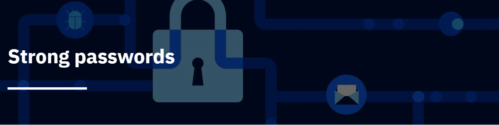

## 🔐 Gestión de Accesos y Seguridad de Credenciales

Tras asegurar la integridad del host, se implementaron políticas de control de acceso basadas en los estándares del curso para mitigar ataques de **Fuerza Bruta**.

### 1. Robustez de Contraseñas (Método de Inicialismo)
Se adoptó la técnica de creación de contraseñas mediante **inicialismos** para balancear la complejidad técnica con la usabilidad humana.

* **Técnica:** Utilizar la primera letra de cada palabra de una frase memorable (ej. una rima o canción).
* **Requisitos implementados:** * Mínimo de 12 caracteres.
    * Uso de mayúsculas, minúsculas, números y caracteres especiales.
    * Exclusión de datos personales (fechas, nombres) y términos de diccionario.

### 2. Mitigación de Ataques de Fuerza Bruta
El uso de contraseñas largas y complejas previene que herramientas automatizadas de "trial and error" logren descifrar las credenciales en tiempos operativos. 

> **Dato Técnico:** Una contraseña de 8 caracteres puede ser crackeada en minutos; una passphrase de 12+ caracteres con inicialismo puede requerir décadas para ser vulnerada por fuerza bruta.

### 3. Autenticación Multifactor (MFA)
Como capa final de seguridad de acceso, se refuerza la política de que la contraseña no sea el único factor. El uso de aplicaciones de autenticación (2FA) es obligatorio para proteger el acceso a las herramientas de análisis y cuentas críticas de contenido.

---

## 📝 Aplicando el ejemplo del curso:
La frase es: "Mary had a little lamb. Its fleece was white as snow. Everywhere that Mary went, the lamb was sure to go."

Si tomamos la primera letra de cada palabra y le agregamos los requisitos de longitud y caracteres especiales, nos quedaría algo así:

Frase original: "Mary had a little lamb. Its fleece was white as snow..."

Inicialismo: MhallIfwwasEtmwtlwstg

Haciéndola "Robusta" (Agregando números y símbolos):

Podés cambiar el "as" por un "2" (sonido parecido en inglés).

Podés agregar un símbolo al final.

Resultado: Mhall.Ifww2sEtmw!2026

🚀 Concepto clave para tu portafolio: El ataque de Brute Force
El curso menciona el Brute Force (Fuerza Bruta). Como analista, tenés que saber que:

Ataque de Diccionario: El hacker usa una lista de palabras comunes (como "password" o "123456").

Fuerza Bruta: Una computadora prueba trillones de combinaciones por segundo.

Por qué funciona el inicialismo: Porque para una computadora, Mhall.Ifww2s parece una secuencia aleatoria de caracteres, lo que hace que el tiempo para crackearla pase de minutos a decenas de años.

🎯 Practice Quiz (Simulación)
Seguramente la siguiente pregunta del quiz te pida identificar cuál de estas opciones es una contraseña fuerte basándose en ese texto.

¿Cuál elegirías vos siguiendo estas reglas?
A) Mary1234
B) Mhall.IfwwasEtmw!
C) whiteassnow

(Pista: La B cumple con longitud, símbolos, mayúsculas y no es una palabra de diccionario).

## Your password might be Mh1llifwwasetMwtlwstg!. You used capital letters for names, the number 1 to indicate one little lamb, and an exclamation mark at the end of the phrase. This password seems nonsensical at first, but it’s long and easy to remember. 

> **Estatus del Módulo:** ✅ Lección de Contraseñas Completada.
> 
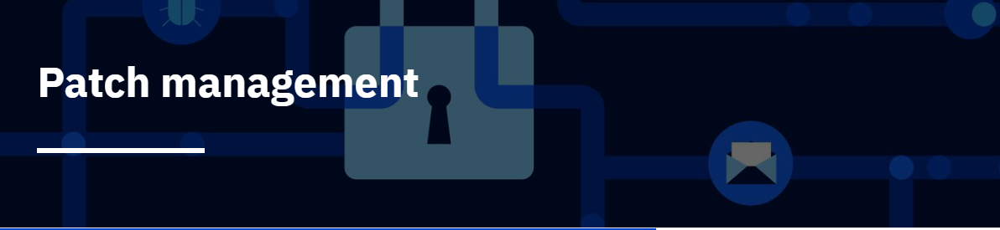

## 🆙 Gestión de Parches (Patch Management)

La seguridad no es estática. El software, por bien diseñado que esté, siempre presenta vulnerabilidades que son descubiertas con el tiempo. El **Patch Management** es el proceso crítico de aplicar actualizaciones para mitigar estos riesgos.

### ⚠️ El Riesgo del Software "End of Life" (EoL)
Como se analiza en el curso, el uso de software sin soporte oficial es un vector de ataque mayor:
* **Caso de estudio (Windows 7):** Al finalizar el soporte oficial, Microsoft dejó de lanzar parches de seguridad. Esto convierte a cualquier dispositivo con Windows 7 en un "blanco fácil", ya que las nuevas vulnerabilidades descubiertas jamás serán reparadas por el fabricante.
* **Lección para Organizaciones:** Es imperativo utilizar versiones de software con soporte activo para garantizar la recepción de parches de seguridad.

### 🛠️ Estrategia Implementada
En mi estación de trabajo, se aplica la política de **Actualización Continua**:
1. **Priorización:** Instalación inmediata de parches de "Seguridad Crítica" que resuelven vulnerabilidades de ejecución de código remoto.
2. **Ciclo de Vida:** Monitoreo del estado de soporte (Life Cycle) de las herramientas de análisis utilizadas (Burp Suite, Metasploit, etc.) para asegurar que operen en versiones protegidas.
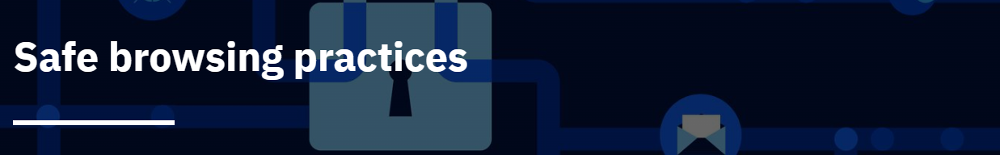
## 🌐 Prácticas de Navegación Segura (Safe Browsing)

Como analista, la prevención en el navegador es la primera línea de defensa para evitar que el malware llegue al sistema. He implementado las siguientes directrices de higiene digital:

### ✅ Lista de Verificación de Seguridad
* **Gestión de Mensajería:** Política de "Cero Confianza" ante correos, archivos adjuntos o SMS de remitentes desconocidos.
* **Escrutinio de Archivos:** Análisis obligatorio de cualquier adjunto, incluso si el remitente parece legítimo (prevención de suplantación de identidad).
* **Control de Navegación:** * Activación de bloqueadores de ventanas emergentes (Pop-up blockers) para mitigar ataques de *drive-by download*.
    * Instalación de **Ad Blockers** para prevenir el *malvertising* (publicidad maliciosa que inyecta código).
* **Confidencialidad:** Prohibición estricta de compartir credenciales de acceso bajo cualquier circunstancia.

---

> **Estatus Final del Módulo 1:** 🏆 **COMPLETADO**
> Todos los controles técnicos (Malwarebytes/Defender), de acceso (Passphrases) y de mantenimiento (Patch Management) han sido documentados y aplicados.

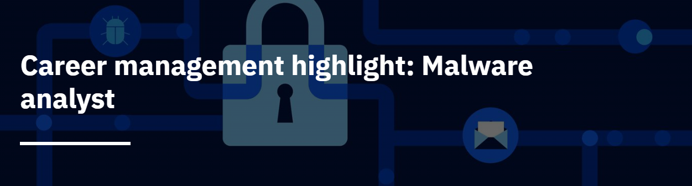

## 🎯 Horizonte Profesional: Malware Analyst

Tras completar esta lección, identifico el rol de **Analista de Malware** como un objetivo clave en mi desarrollo profesional. Este rol integra habilidades de investigación, ingeniería y programación para:

* **Análisis Profundo:** Estudiar diversos tipos de malware para determinar su funcionamiento y métodos de mitigación.
* **Respuesta ante Incidentes:** Actuar como primer respondiente ante amenazas detectadas, limitando su propagación y liderando los esfuerzos de recuperación (como en el caso de estudio de Synnovis).
* **Políticas de Seguridad:** Colaborar en la redacción de estándares y procedimientos de ciberseguridad corporativa.

> **Habilidades en desarrollo:** Conocimiento profundo de sistemas operativos, lenguajes de programación y monitoreo constante de las últimas amenazas y controles de seguridad.

## 🔎 Investigación de Rol: Analista de Malware

Basado en la investigación de habilidades técnicas necesarias para el éxito en la industria, he identificado las tres áreas de conocimiento fundamentales para dominar este rol:

### 1. Taxonomía y Comportamiento de Malware
Es esencial dominar la clasificación de amenazas (Ransomware, Spyware, Rootkits, Infostealers). Un analista debe entender no solo qué es el malware, sino su **comportamiento en el sistema**: cómo logra la persistencia, cómo se comunica con el servidor de Comando y Control (C2) y qué vectores de ataque utiliza.

### 2. Análisis de Código y Programación (Reversing)
Para identificar códigos maliciosos, se requiere conocimiento en lenguajes como **Python, C/C++ y Assembly**. Esto permite realizar:
* **Análisis Estático:** Leer el código sin ejecutarlo para buscar indicadores de compromiso (IoCs).
* **Análisis Dinámico:** Observar el comportamiento del código en un entorno seguro (Sandbox).

### 3. Psicología de la Ingeniería Social
El malware no siempre se autoinstala; suele requerir un error humano. Comprender las tácticas de manipulación psicológica (urgencia, autoridad, miedo) es clave para anticipar cómo los atacantes logran que un usuario ejecute un archivo malicioso, permitiendo diseñar mejores políticas de prevención y concientización.
## 🚀 RoadMap de Especialización Técnica

Para evolucionar mi perfil hacia un rol de **Senior Malware Analyst**, me he propuesto dominar las siguientes áreas técnicas:

1. **Análisis de Tráfico de Red:** Dominio de Wireshark para detectar exfiltración de datos y comunicaciones con servidores de Comando y Control (C2).
2. **Análisis Dinámico Avanzado:** Implementación de Sandboxes aisladas para el monitoreo de procesos, cambios en el registro y persistencia de amenazas en memoria.
3. **Ingeniería Inversa (RE):** Introducción al uso de herramientas como Ghidra para el desensamblado de binarios maliciosos y comprensión de la lógica del atacante.

## 🔎 Investigación de Rol: Analista de Malware (Consolidado)

Tras comparar mis hipótesis iniciales con los estándares de la industria, he definido las tres áreas de conocimiento críticas que un analista debe dominar para tener éxito:

### 1. Programación y Análisis de Código
No basta con identificar que un archivo es malicioso; hay que entender **cómo** fue construido. 
* **Lenguajes Clave:** C, C++, Python y especialmente **Assembly** (ensamblador), que es el lenguaje que "habla" el procesador.
* **Habilidad:** Comprender cómo se compila, vincula y ejecuta el código para realizar ingeniería inversa (Reverse Engineering).

### 2. Arquitectura de Sistemas Operativos (Windows, Linux, Unix)
Un analista debe ser un experto en el "terreno de juego". Esto incluye:
* **Estructura Interna:** Entender el sistema de archivos, los procesos y la arquitectura del kernel.
* **Seguridad Nativa:** Conocer las funciones de seguridad del SO para entender cómo el malware intenta evadirlas o desactivarlas.

### 3. Redes y Comunicación (Networking)
El malware moderno rara vez actúa solo; necesita comunicarse.
* **Interacción:** Entender cómo el código malicioso interactúa con otras máquinas o servidores de Comando y Control (C2).
* **Protocolos:** Conocimiento profundo de redes para rastrear la exfiltración de datos y el movimiento lateral dentro de una organización.

---
> **Reflexión Personal:** Mis ideas sobre Ingeniería Social y Tipos de Malware son el complemento perfecto para esta base técnica, ya que cubren el "quién" y el "qué", mientras que estos puntos del curso cubren el "cómo" a nivel profundo.

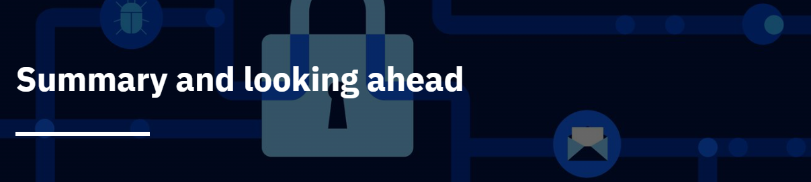
## 🏁 Conclusión del Módulo 1 y Transición

He completado el estudio de las amenazas de software, comprendiendo cómo los atacantes buscan comprometer la **Tríada CIA** (Confidentiality, Integrity, Availability) para obtener beneficios económicos.

### ⏭️ Próximo Objetivo: El Factor Humano (Social Engineering)
La siguiente fase del laboratorio se centrará en las amenazas físicas y psicológicas, incluyendo:
* **Phishing:** Identificación de correos y mensajes fraudulentos.
* **Tácticas de Manipulación:** Cómo reconocer intentos de engaño en escenarios del mundo real.
* **Seguridad Física:** Protección de activos más allá del código.

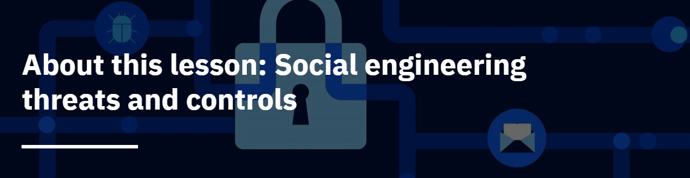

## 👥 Módulo 2: Ingeniería Social - El Factor Humano

En esta fase, analizo cómo los atacantes explotan el error emocional o el comportamiento social para vulnerar la seguridad.

### 🔍 Tipos de Ataques Identificados:
1. **Phishing (Digital):** Suplantación de identidad de fuentes confiables para captura de datos sensibles.
2. **Trampa de Miel (Honey Trap):** Manipulación emocional para generar confianza y exfiltrar información.
3. **Tailgating (Físico):** Infiltración en instalaciones físicas aprovechando la cortesía o falta de control en accesos.
4. **Shoulder Surfing:** Recolección de información mediante observación directa de credenciales en uso.

### 🛡️ Mitigación:
* **Concientización:** El entrenamiento de los usuarios es la única defensa efectiva contra la ingeniería social.
* **MFA (Multifactor):** Reduce el impacto si el atacante logra obtener la contraseña mediante Phishing o Shoulder Surfing.

### 🛡️ Caso de Estudio: Phishing de Servicios de Logística

**Escenario:** Recepción de un correo sobre un paquete retenido que solicita un pago pequeño por "tasas de aduana".

**Irregularidades Detectadas (Red Flags):**
* **Solicitud de Acción Financiera:** Exigencia de introducir datos de tarjeta de crédito o realizar pagos mediante enlaces externos.
* **Inconsistencia de Dominio:** El remitente no coincide con el dominio oficial de la empresa de logística.
* **Urgencia Psicológica:** Uso de amenazas de devolución o destrucción del paquete para forzar una decisión rápida (vulnerabilidad emocional).
* **Enlaces Maliciosos:** URLs que redirigen a sitios de captura de datos (Harvesting) en lugar de portales oficiales de seguimiento.

**Protocolo de Respuesta:**
1. No interactuar con los enlaces.
2. Reportar el correo como Phishing.
3. Verificar el estado del envío directamente en la web oficial ingresando el número de seguimiento manualmente.

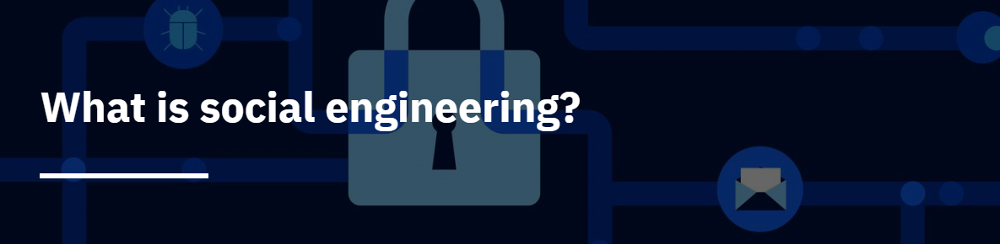

## ⚖️ Malware vs. Ingeniería Social: El Blanco del Ataque

Es fundamental diferenciar el vector de ataque para aplicar los controles correctos.

| Característica | Malware (Ataque Técnico) | Ingeniería Social (Human Hacking) |
| :--- | :--- | :--- |
| **Objetivo Principal** | Vulnerabilidades en software/hardware. | Vulnerabilidades en la psicología humana. |
| **Método** | Explotación de código, troyanos, virus. | Decepción, manipulación, falsas promesas. |
| **Punto Débil** | Sistemas desactualizados. | Impulso de tomar "atajos" o decisiones rápidas. |
| **Control Primario** | Antimalware, Parches (Updates). | Concientización, Entrenamiento, Políticas. |

### 🧠 ¿Por qué funciona el "Human Hacking"?
Como indica el material de estudio, los atacantes se aprovechan de que las personas son imperfectas. Explotan tres factores psicológicos clave:
1. **Confianza:** El deseo natural de ayudar o creer en fuentes aparentemente legítimas.
2. **Urgencia:** Forzar una decisión rápida para que el usuario ignore las señales de alerta.
3. **Atajos:** La tendencia humana a buscar la solución más fácil o rápida.

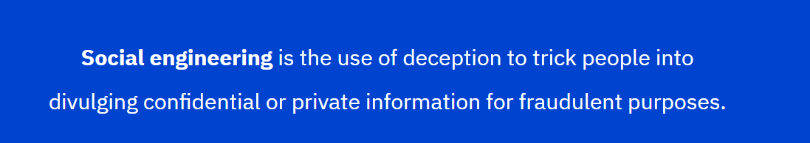

## 🚀 ¿Qué trucos usan para "fomentar malas decisiones"?
El texto menciona que los atacantes usan "otros trucos". En ciberseguridad, estos se conocen como Principios de Influencia de Cialdini, y seguramente sean el próximo tema de tu video o lectura:

## Autoridad: "Soy el jefe de IT, pasame tu clave ya".

## Escasez: "Última oportunidad para reclamar tu premio".

## Consenso: "Todos tus compañeros ya actualizaron sus datos aquí".

## Why does social engineering work? 

Social engineering works because people are imperfect. Attackers exploit people’s propensity to take shortcuts and make quick decisions based on false promises. 

Attackers use other tricks to encourage bad decisions. 

## OTROS CASOS  
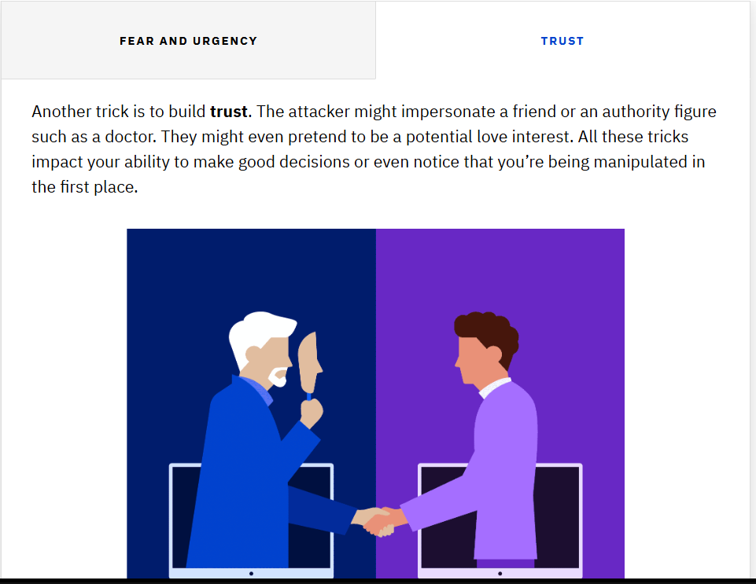
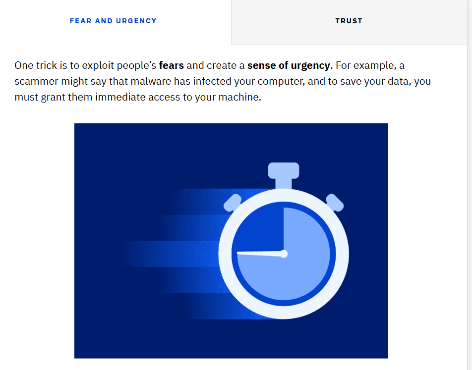

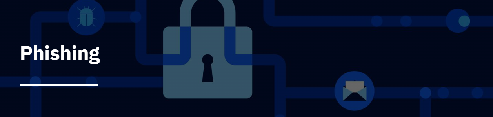
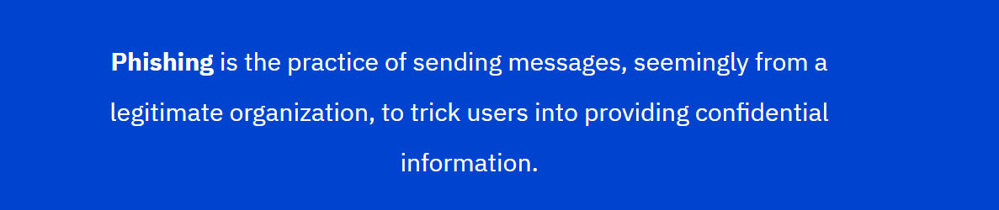
## Phishing attempts come in various forms, including phone calls, text messages, social media, and even mail. One of the most common forms of phishing is through email. Out of the 800,944 reports of cybercrime reported to the FBI in 2022, 300,497 involved phishing. Phishing caused over USD 50,000,000 in losses, not including lost business, time, wages, data, or remediation services.

## Most phishing emails don’t target a specific victim. Instead, attackers send them far and wide. Think of phishing like the activity from which its name derives: fishing. When fishing, you cast your reel into the water and wait. Plenty of fish might swim by the bait, but many will ignore it. You’re satisfied as long as at least one fish takes the bait. Likewise, phishing scammers assume most recipients won’t fall for their scam. They only need a few victims to reap potentially huge rewards. 

### 📊 El Impacto Global del Phishing (Estadísticas FBI 2022)

El phishing no es solo un correo molesto; es el vector de cibercrimen más reportado a nivel mundial debido a su alta tasa de retorno para el atacante.

* **Volumen de Incidencias:** Representó aproximadamente el **37.5%** de todos los reportes de cibercrimen (300,497 de 800,944 casos).
* **Impacto Económico:** Más de **USD 50,000,000** en pérdidas directas (sin contar costos de remediación, pérdida de datos o tiempo operativo).

### 🎣 La Analogía del "Pescador" (Massive Outreach)
A diferencia de los ataques dirigidos (Spear Phishing), el phishing masivo opera bajo la lógica de la pesca comercial:
1. **Lanzamiento:** El atacante envía miles o millones de correos (lanza el anzuelo).
2. **Bait (Cebo):** El mensaje engañoso diseñado para atraer a cualquier "pez" (usuario).
3. **Conversión:** No importa si el 99% ignora el correo; con que un pequeño porcentaje muerda el anzuelo, el ataque es rentable y exitoso.

## How phishing works

## So, how does phishing work?

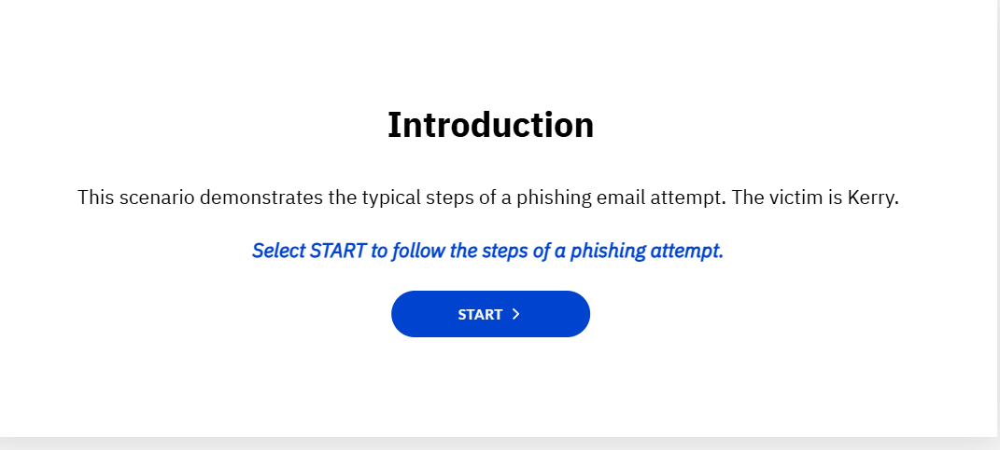
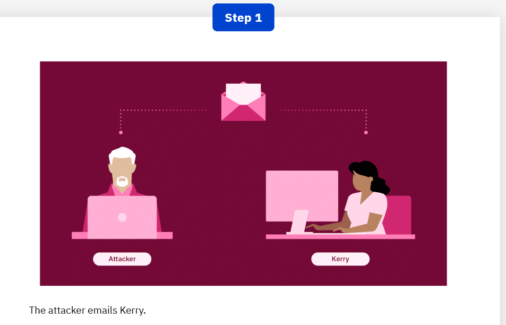
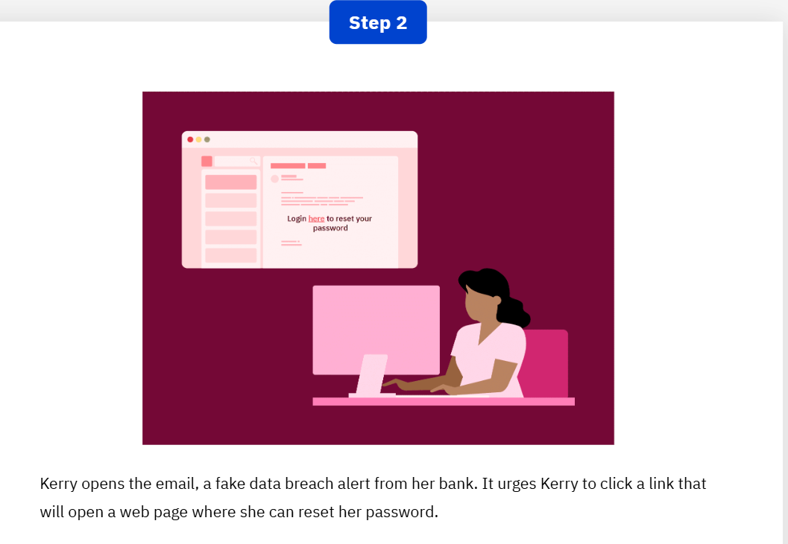
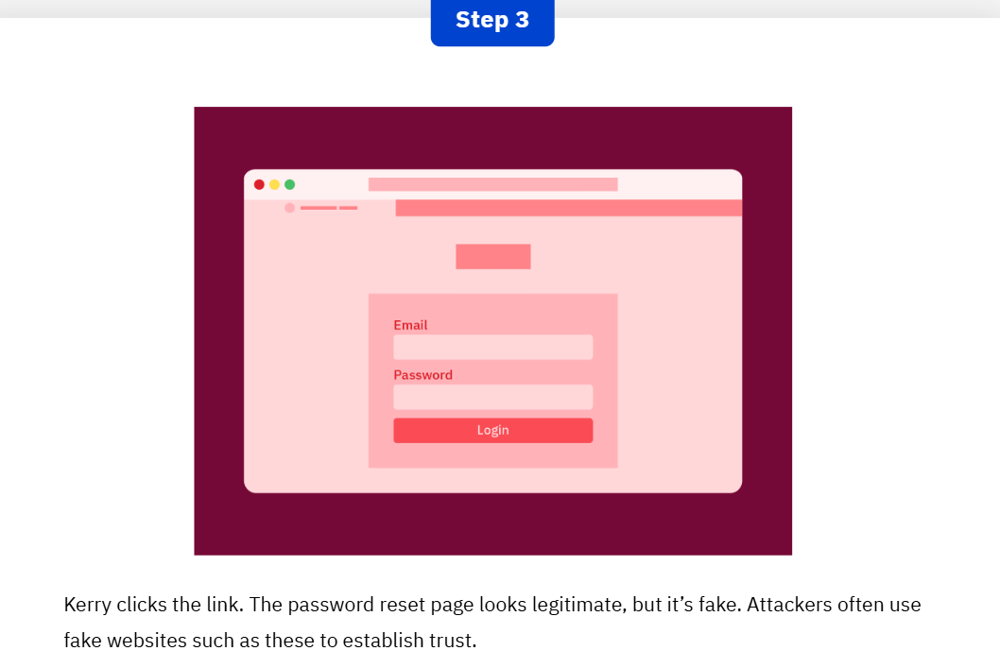
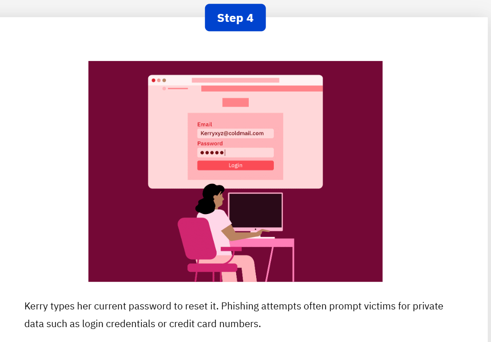
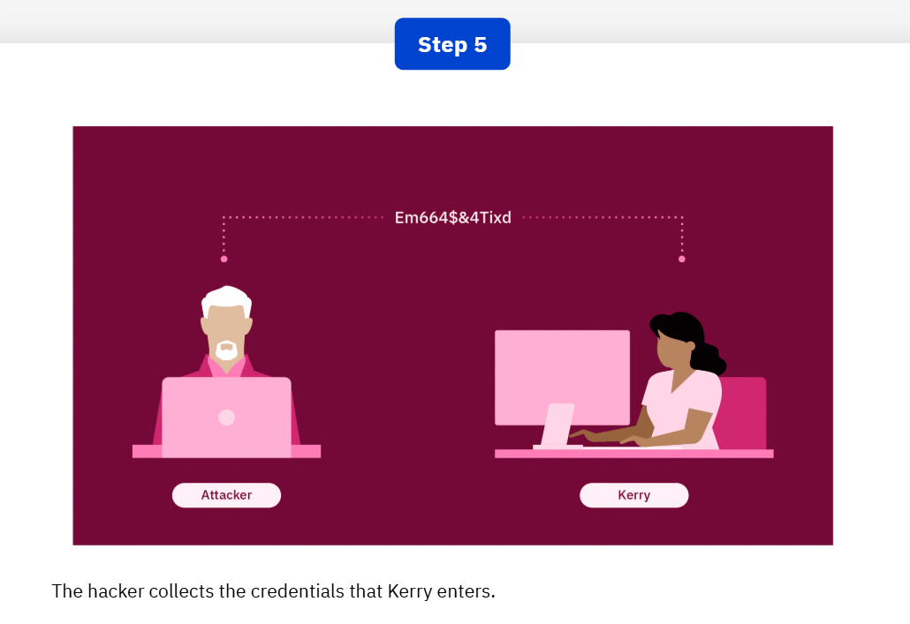
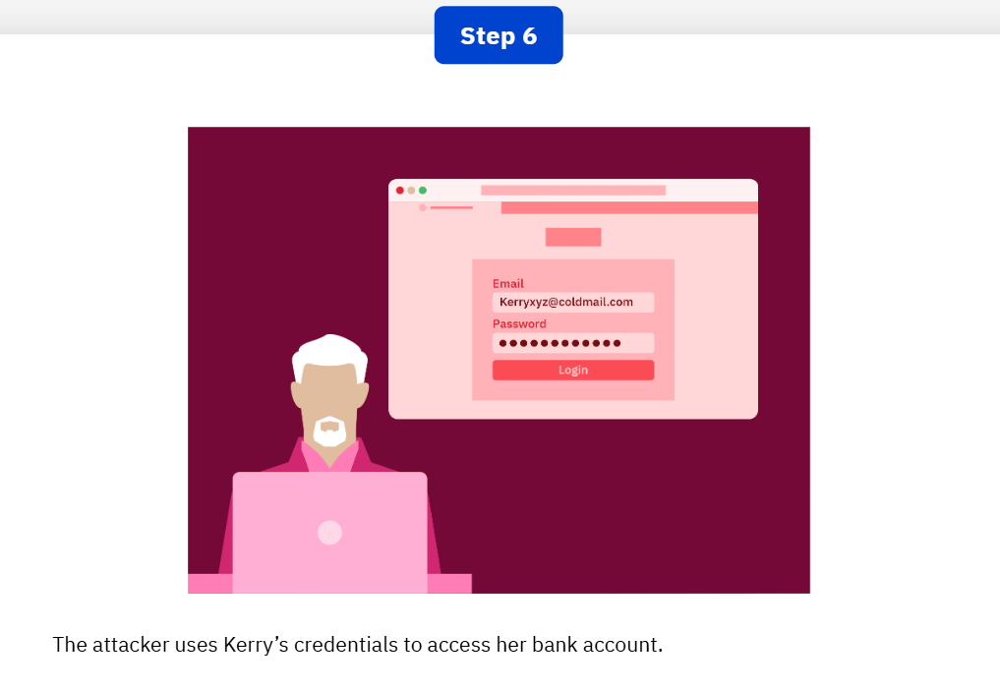
## Resumen

## ¡Así es como funcionan las estafas de phishing! Los detalles pueden variar de un intento a otro, pero los pasos son prácticamente los mismos. El atacante, haciéndose pasar por una figura de confianza, envía un mensaje aparentemente legítimo que engaña a la víctima para que proporcione información confidencial.

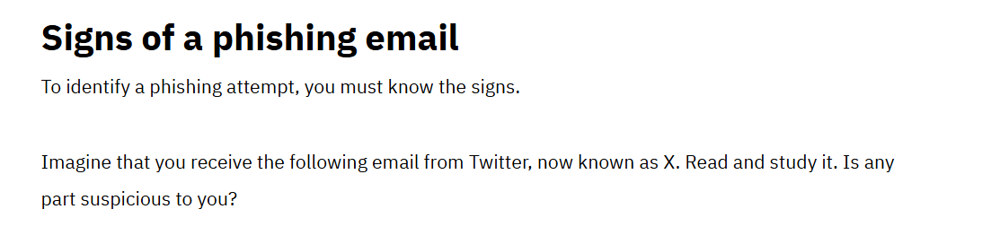
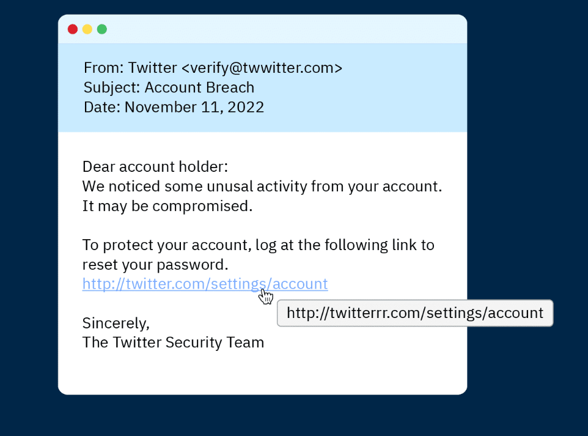
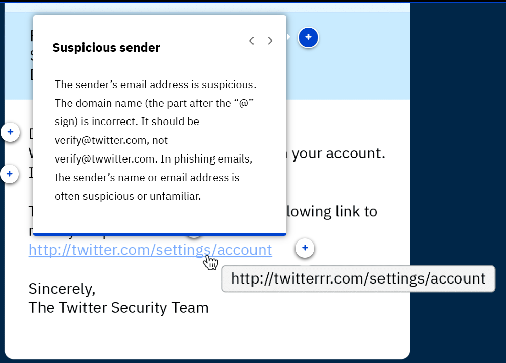
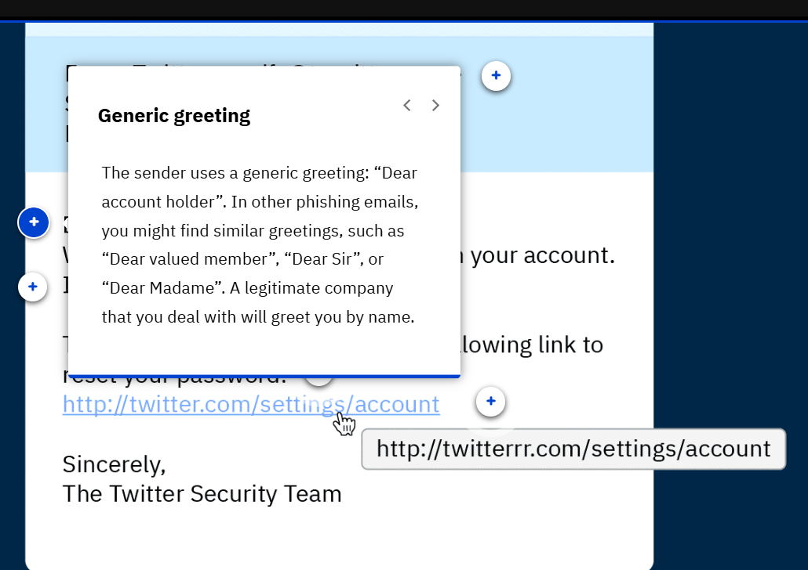
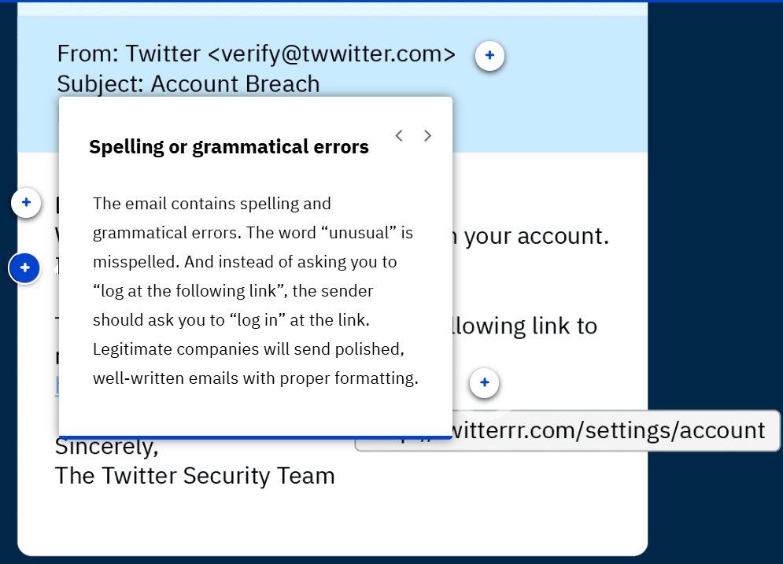

### 🕵️ Análisis Técnico: Anatomía de un correo de Phishing

A través del análisis de un caso simulado de suplantación de identidad (Twitter/X), se identificaron las siguientes técnicas de engaño:

| Indicador | Hallazgo en el ejemplo | Concepto Técnico |
| :--- | :--- | :--- |
| **Remitente** | `verify@twwitter.com` | **Typosquatting:** Uso de carácteres extra para imitar dominios legítimos. |
| **Hipervínculo** | Texto: `twitter.com` / Destino: `twitterrr.com` | **Link Masking:** Enmascaramiento de la URL real mediante etiquetas de texto engañosas. |
| **Saludo** | "Dear account holder" | **Generic Salutation:** Falta de personalización, indicativo de una campaña masiva (Broadcasting). |
| **Protocolo** | `http://` (en lugar de `https://`) | **Insecure Connection:** Falta de cifrado SSL, inusual en portales de seguridad legítimos. |

### 🚩 Indicadores Lingüísticos de Fraude

Al analizar el contenido del correo, se detectaron fallos en la profesionalidad del mensaje que confirman el intento de ingeniería social:

1. **Errores Ortográficos:** El uso de palabras mal escritas (ej. "unusual" mal deletreado) es una técnica común para evadir filtros de spam básicos y denota falta de legitimidad.
2. **Gramática Deficiente:** El uso de frases como "log at the link" en lugar de "log in" indica que el atacante probablemente utilizó un traductor automático o no tiene fluidez en el idioma, algo que una empresa global no permitiría.
3. **Formato Inconsistente:** Las empresas legítimas mantienen estándares de diseño y redacción pulidos. Cualquier error en el formato es una señal de que el correo es una imitación.

## 🚀 Tip de Oro 
Siempre que veas un link sospechoso, el truco de "pasar el mouse por arriba" es tu mejor amigo. Pero como analista, si alguna vez tenés que investigar ese link sin infectarte, podrías usar herramientas como VirusTotal o URLScan.io para ver qué hay del otro lado sin entrar vos mismo.

**Conclusión del Analista:** Se trata de un ataque de *Credential Harvesting* diseñado para capturar el usuario y contraseña de la víctima mediante una página de inicio de sesión falsa.

## This example phishing email demonstrates a few typical traits of phishing emails. Let’s explore a few other signs to watch for.

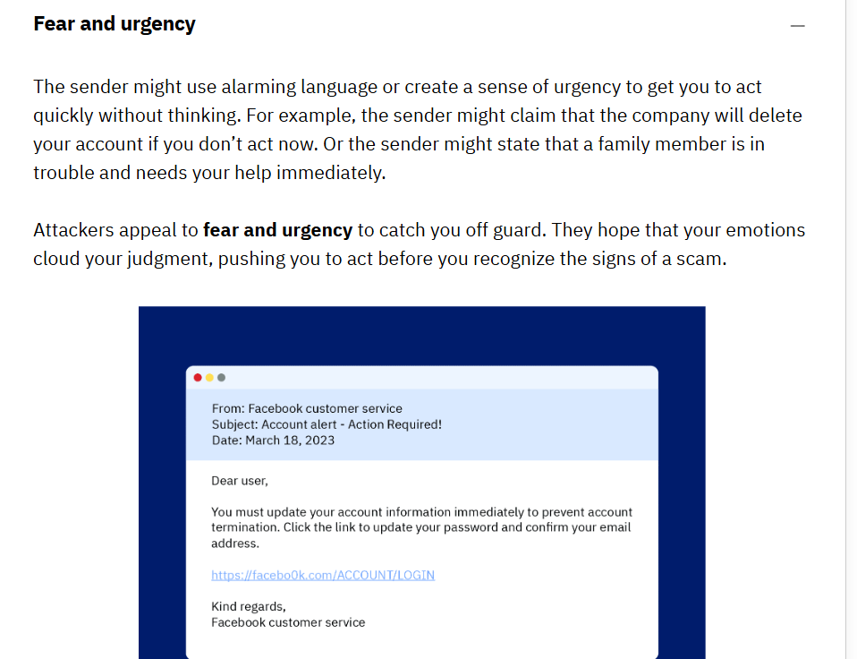
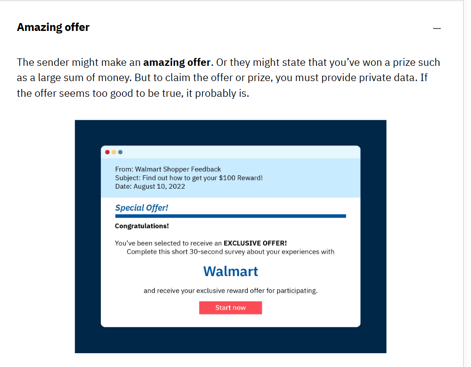
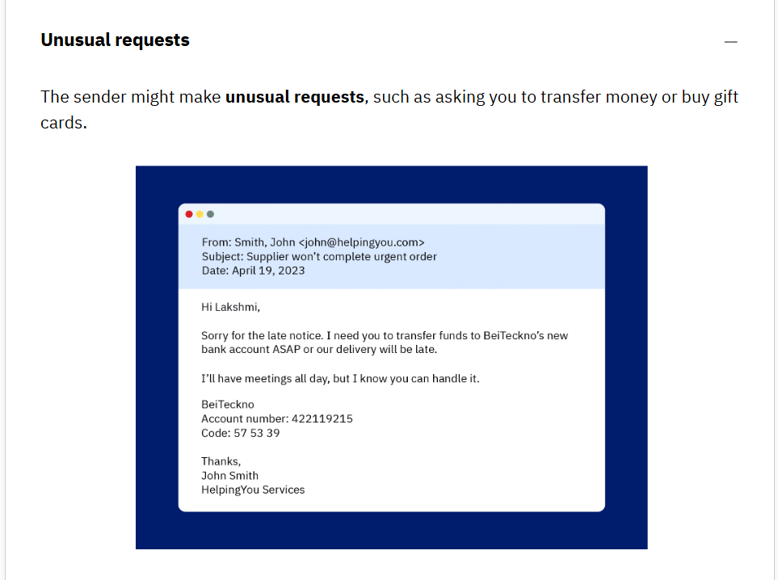
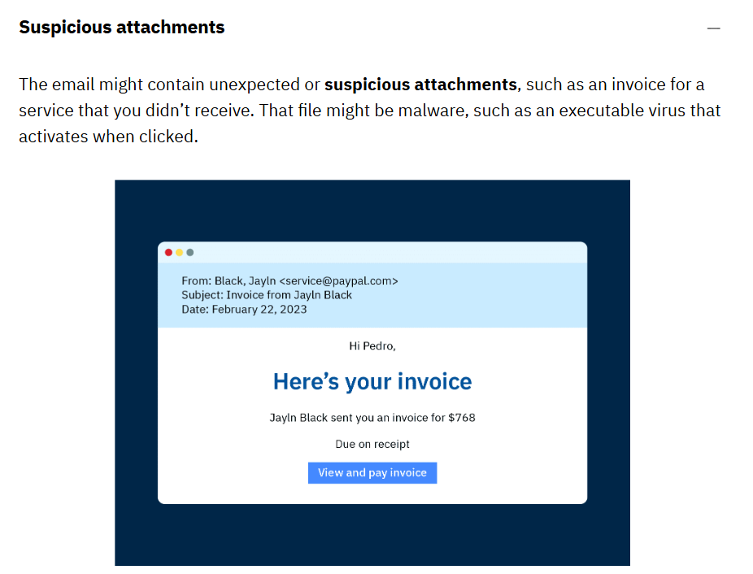
## 🛡️ Estrategias de Defensa contra el Phishing

Para mitigar los ataques de ingeniería social, he implementado un modelo de defensa dual que combina herramientas técnicas con protocolos de conducta.

### ⚙️ 1. Controles Tecnológicos (La Red de Seguridad)
Son las herramientas que actúan como primera barrera para filtrar o bloquear la amenaza:
* **Filtros de Spam:** Configuración de motores de detección para cuarentena automática de correos sospechosos.
* **Endpoint Protection:** Uso de software antimalware para interceptar ejecuciones accidentales de archivos adjuntos.
* **Hardening del Navegador:** Instalación de extensiones de seguridad (ej. Malwarebytes Browser Guard) para bloquear el acceso a sitios de phishing conocidos mediante listas negras (Blacklisting).

### 🧠 2. Protocolos de Comportamiento (Higiene Digital)
La tecnología puede fallar, por lo que el analista debe aplicar el criterio de "Confianza Cero" (Zero Trust):
* **Acceso Directo:** Ante un pedido de login de una fuente conocida, se ignora el enlace del mail y se accede manualmente escribiendo la URL oficial en el navegador.
* **Verificación por Canal Secundario (Out-of-band):** Si un conocido pide información sensible, se verifica la identidad por un medio distinto (ej. llamada telefónica o chat interno) antes de responder.
* **Eliminación Preventiva:** Los correos cuestionables no se abren; se eliminan o se reportan al equipo de seguridad de inmediato.

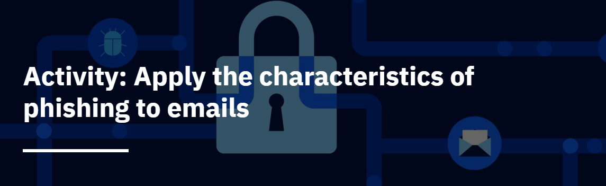
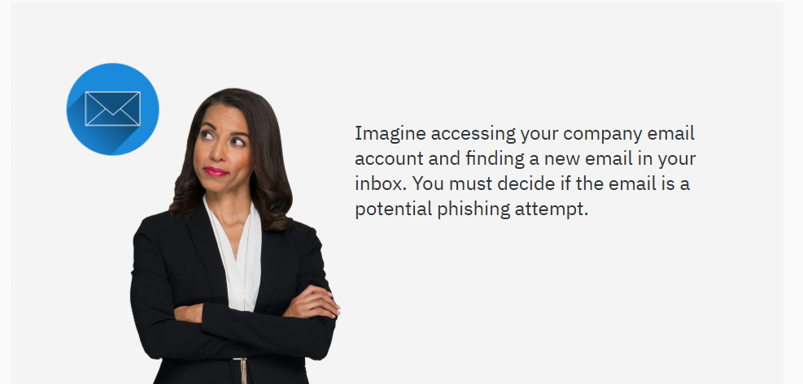
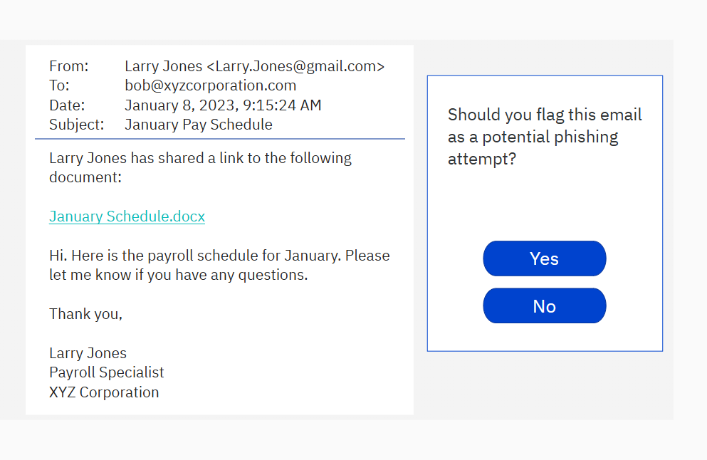
## 🕵️ Análisis del correo de Larry Jones
A simple vista parece inofensivo porque es "un compañero de trabajo", pero fijate en estos detalles críticos:

El Dominio del Remitente: Larry dice ser "Payroll Specialist" (Especialista en Nómina) de XYZ Corporation. Sin embargo, su mail es Larry.Jones@gmail.com.

Regla de oro: Alguien que maneja pagos en una empresa nunca te va a mandar documentos oficiales desde una cuenta personal de Gmail. Usaría @xyzcorporation.com.

El Gancho (The Bait): El tema es "January Pay Schedule" (Calendario de pagos de enero). Es un tema de alta importancia para cualquier empleado. Los atacantes usan temas de dinero o recursos humanos para que hagas clic rápido sin pensar.

El Enlace al Documento: Está pidiendo que hagas clic en un link para ver un archivo .docx. Este es el vector perfecto para descargar malware o llevarte a una página donde te pida "loguearte con tu cuenta de la empresa" para ver el archivo, robándote las credenciales.


### 🕵️ Caso de Análisis #1: Suplantación de Identidad Interna

**Escenario:** Correo de un supuesto especialista en nómina enviando el calendario de pagos.

**Hallazgos de Phishing:**
* **Uso de Cuentas Personales:** El remitente utiliza un servicio de correo gratuito (Gmail) en lugar del dominio corporativo oficial.
* **Ingeniería Social:** Se utiliza el interés financiero del empleado (pagos) para incentivar la interacción con un enlace externo.
* **Riesgo de Documentos:** Los enlaces a documentos compartidos fuera de la intranet oficial son vectores comunes para la entrega de malware o robo de sesiones.
* **Tambien el documento .docx. al pasar el scroll con el mouse por arriba me dirige a otro sitio web.**
### 🔗 Análisis del Vector de Ataque: Link Masking

Se identificó una discrepancia crítica entre el texto del hipervínculo y la URL de destino:
* **Texto visual:** `January Schedule.docx` (Sugiere un documento de Word inofensivo).
* **Destino real:** URL externa no relacionada con los servidores de XYZ Corporation.

**Riesgos Técnicos:**
1. **Malware Delivery:** El enlace podría iniciar la descarga automática de un archivo con macros maliciosas (ej. un troyano).
2. **Credential Harvesting:** Redirección a un portal de inicio de sesión falso (ej. una imitación de Microsoft 365) para capturar el usuario y contraseña del empleado.
**Acción Correcta:** Marcar como Phishing y verificar con el departamento de RR.HH. a través de un canal oficial interno.
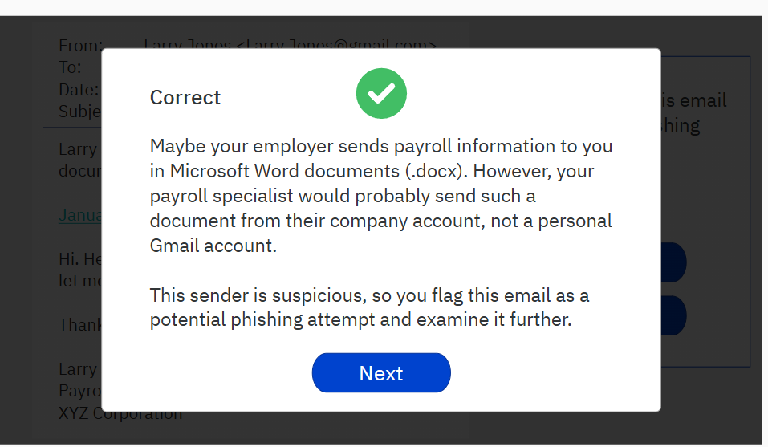

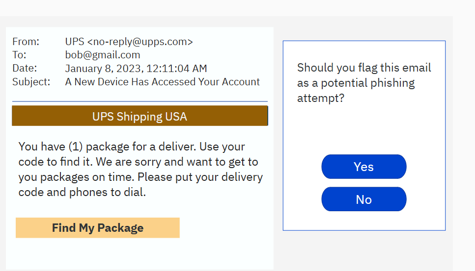

## 🕵️ Análisis Forense: El caso "UPS Shipping USA"
Typosquatting descarado: Mira el remitente: no-reply@upps.com. UPS solo tiene una "P". Agregar letras extra (UPPS) es la técnica clásica para engañar a usuarios distraídos.

Inconsistencia Total (Subject vs Body): El asunto dice "A New Device Has Accessed Your Account" (Un nuevo dispositivo accedió a tu cuenta), pero el cuerpo del mensaje habla de un paquete listo para entregar. Los estafadores a veces reciclan plantillas y se olvidan de cambiar el asunto. Esa falta de coherencia es una señal de alerta inmediata.

Gramática y Sintaxis Desastrosas: * "You have (1) package for a deliver" (Sintaxis rota).

"We are sorry and want to get to you packages on time" (No tiene sentido gramatical).

"Please put your delivery code and phones to dial" (Traducción muy pobre).

Una empresa multinacional como UPS jamás enviaría algo con este nivel de errores.

### 🚩 Caso de Análisis #2: Phishing de Suplantación de Marca (UPS)

**Hallazgos Técnicos:**
* **Dominio Fraudulento:** Uso de `upps.com` (Typosquatting) para imitar el dominio oficial de UPS.
* **Falta de Coherencia:** Discrepancia total entre el asunto del correo (alerta de seguridad) y el contenido (entrega de paquete).
* **Calidad del Mensaje:** Presencia de errores gramaticales graves y redacción inconsistente, lo que indica un origen no profesional.
* **Llamado a la Acción (CTA):** Uso de un botón llamativo ("Find My Package") diseñado para redirigir a un sitio de captura de datos o descarga de malware.

**Conclusión:** Intento de phishing masivo que utiliza el reconocimiento de marca para inducir al error mediante la curiosidad por un supuesto paquete.
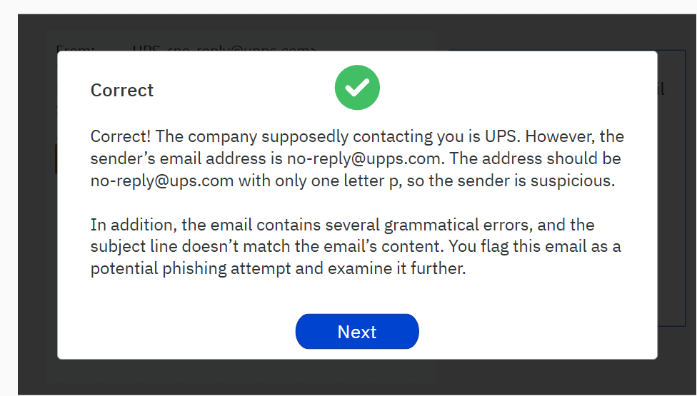
## 🎯 Phishing vs. Spear Phishing: Precisión del Ataque

En mi estudio de vectores de ingeniería social, he diferenciado dos niveles de sofisticación:

| Concepto | Analogía | Objetivo | Personalización |
| :--- | :--- | :--- | :--- |
| **Phishing** | Pesca con red | Masivo / Aleatorio | Muy baja (genérica) |
| **Spear Phishing** | Pesca con arpón | Individuo o Empresa específica | Muy alta (detalles reales) |

### 🔍 Características del Spear Phishing:
* **Investigación Previa:** El atacante recolecta datos públicos (OSINT) de la víctima para generar confianza.
* **Mensaje a Medida:** Utiliza nombres reales, cargos específicos o referencias a proyectos actuales del usuario.
* **Mayor Tasa de Éxito:** Al parecer una comunicación legítima del trabajo o de un conocido, es mucho más difícil de detectar para un usuario promedio.
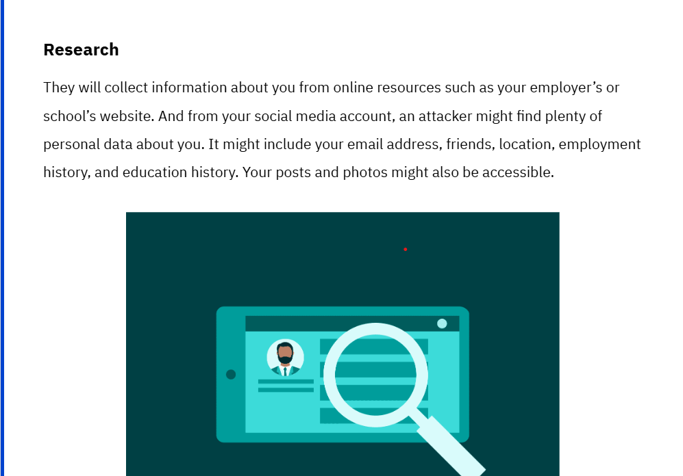

### 🔄 Ciclo de un Ataque de Spear Phishing

A diferencia del phishing masivo, el Spear Phishing sigue un proceso de inteligencia detallado:

#### 1. Fase de Investigación (Research / OSINT)
El atacante recolecta información pública de la víctima (Open Source Intelligence) utilizando:
* **Redes Sociales:** LinkedIn (puesto, empresa, colegas), Facebook/Instagram (ubicación, amigos, intereses).
* **Sitios Corporativos:** Estructura de la organización, proyectos actuales o software que utiliza la empresa.
* **Datos Personales:** Direcciones de correo, historial educativo y laboral.

#### 2. Fase de Mensajería (The Message)
Con los datos recolectados, el atacante construye un mensaje altamente persuasivo:
* **Personalización:** Usa nombres reales y referencias a personas de confianza (amigos o jefes).
* **Relevancia:** El tema del correo es algo que la víctima está esperando o que le interesa legítimamente.
* **Detección Difícil:** Al no tener los errores obvios de un phishing masivo, el usuario tiende a bajar la guardia.

### 💼 Caso Real: Spear Phishing a Twitter (X)
### Spear phishing example

Attackers get creative with their research methods. 

One of the most well-known social engineering incidents involved phone spear phishing. The attacker manipulated a small group of employees at Twitter, now known as X, into providing access to their internal support tools. 

With those tools, the attacker took over 100 prominent Twitter accounts. The accounts included those for business leaders such as Jeff Bezos, celebrities such as Kim Kardashian, and corporations such as Uber. From each account, he posted a tweet encouraging followers to send bitcoin, claiming that they would receive twice the amount that they gave. This scam netted the attacker USD 100,000 worth of bitcoin.

**Objetivo:** Obtener acceso a herramientas de soporte interno de la red social.
**Método:** Vishing (Spear Phishing por teléfono) dirigido a empleados específicos del equipo de soporte.

**Cronología del Ataque:**
1. **Research:** El atacante identificó empleados con acceso a herramientas administrativas.
2. **Engaño:** Se hizo pasar por personal del departamento de IT de la propia empresa para obtener credenciales.
3. **Escalación de Privilegios:** Con el acceso interno, tomó el control de cuentas de alto perfil (Elon Musk, Bill Gates, Apple, etc.).
4. **Monetización:** Publicó una estafa de duplicación de Bitcoin, recaudando **USD 100,000** en pocas horas.

**Lección para el Analista:** Los atacantes no siempre buscan la puerta principal (el usuario final); a menudo buscan al "administrador" para comprometer a miles de usuarios a la vez.

## 🛡️ Defensas Críticas: Hardening de tu Presencia Online
* * El curso te da la clave: Controlar tu huella digital (Digital Footprint). Como sos Systems Technician y estás en Cybersecurity, esto es algo que tenés que aplicar ya mismo en tus propias cuentas.

Estrategias de Reducción de Superficie de Ataque:
Privacidad en Redes: No dejes tu lista de amigos o contactos pública (los atacantes la usan para saber a quién suplantar).

Geolocalización: Evitá subir fotos que revelen tu ubicación exacta en tiempo real (oficina, casa, universidad).

Separación de Perfiles: Usar un mail específico para redes sociales y otro totalmente distinto para recuperaciones de cuentas bancarias o laborales.

## 🏟️ Ingeniería Social Física (In-Person Attacks)

No todas las amenazas son digitales. He analizado cómo los atacantes utilizan la presencia física para comprometer la seguridad.

### 🔍 Vectores Identificados:
1. **Shoulder Surfing:** Espionaje visual directo para captura de credenciales en tiempo real.
2. **Tailgating:** Explotación de la cortesía social para evadir controles de acceso físicos (puertas, molinetes).
3. **Dumpster Diving:** Recuperación de información sensible a partir de desechos no destruidos correctamente.

### 🛡️ Controles de Mitigación Física:
* **Cultura de Seguridad:** Instruir a los empleados para que no permitan el ingreso de personas sin credencial (anti-tailgating).
* **Destrucción de Documentos:** Uso de trituradoras de papel y políticas de borrado seguro de hardware.
* **Privacidad Visual:** Uso de filtros de pantalla para laptops en lugares públicos.

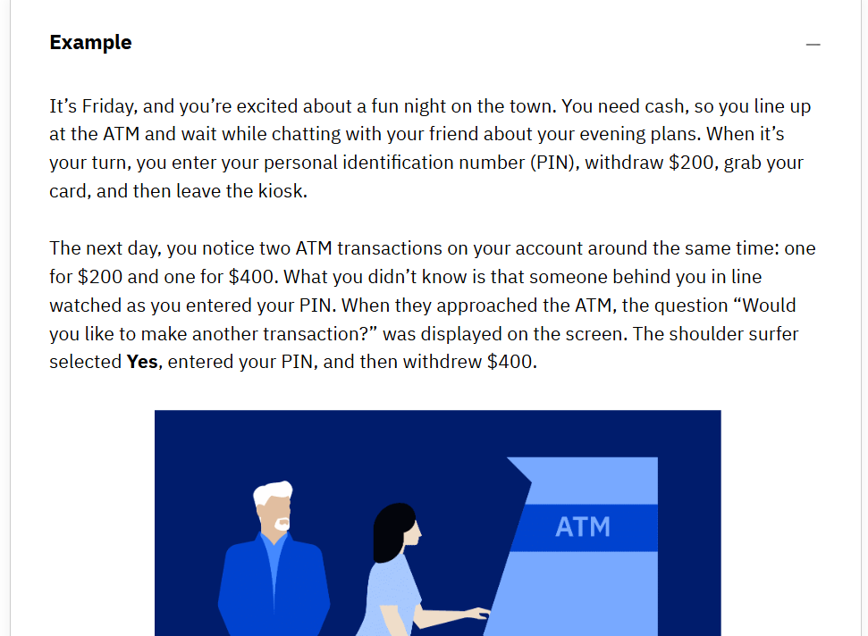

### 🛡️ Medidas de Prevención contra el Espionaje Físico

Para mitigar riesgos como el **Shoulder Surfing**, se deben aplicar los siguientes controles:

1. **Controles Físicos:**
   * Uso de filtros de privacidad en pantallas de notebooks (reducen el ángulo de visión).
   * Posicionamiento estratégico: Sentarse de espaldas a la pared en lugares públicos.
   * Cobertura de teclados al ingresar PINs o credenciales.

2. **Controles Técnicos (Defensa en Profundidad):**
   * **Multifactor Authentication (MFA):** Implementar obligatoriamente un segundo factor de autenticación. Esto garantiza que el robo de una contraseña por observación directa no sea suficiente para comprometer la cuenta.

   ### 🗑️ Dumpster Diving: El riesgo de los desechos
El atacante busca información confidencial en la basura física o digital de una organización.

**Información crítica recolectada:**
* Hábitos de compra (vía empaques y recibos).
* Especificaciones técnicas de hardware (vía cajas de equipos).
* Datos financieros y números de cuenta (vía ofertas de crédito y facturas).

**Control de Mitigación:**
* **Shredding (Triturado):** Implementar el uso de trituradoras de papel de corte cruzado para todos los documentos sensibles.
* **Política de Escritorio Limpio:** No dejar notas con claves y asegurar que el hardware viejo sea destruido por empresas certificadas.

## EJEMPLO

##### 🔗 Del Dumpster Diving al Spear Phishing: El rompecabezas de la identidad

Un atacante no necesita robarte la billetera si puede reconstruir tu vida desde el tacho de basura. 

**Ejemplo de vector de ataque combinado:**
1. **Recolección:** El atacante obtiene tu banco y el nombre de tu mascota de la basura.
2. **El Engaño (Spear Phishing):** Te envía un mail que dice: *"Hola [Tu Nombre], detectamos un cargo inusual en tu cuenta de [Tu Banco]. Para verificar tu identidad, por favor ingresa el nombre de tu mascota (pregunta de seguridad) y tu fecha de nacimiento"*.
3. **Resultado:** Al usar datos reales (tu banco y el nombre de Fluffy), la confianza es total y entregás el resto de tus credenciales sin dudar. 

### 🛡️ Checklist de Prevención de Dumpster Diving

✅Destrucción Total (Shredding): No basta con romper el papel a mano. Usar trituradoras que corten en partículas (corte cruzado) para que sea imposible reconstruir el documento.

✅Gestión de Cajas: Desarmar las cajas de tecnología, darlas vuelta (que no se vea la marca) y, si es posible, llevarlas directamente al centro de reciclaje en lugar de dejarlas en la puerta.

✅Higiene de Etiquetas: Arrancá siempre las etiquetas de envío. Tienen tu nombre, dirección y, a veces, hasta tu número de celular.

### 🚪 Tailgating: La Explotación de la Cortesía

El Tailgating ocurre cuando una persona no autorizada sigue a una autorizada hacia un área restringida.

**Escenario Típico:**
* El atacante se disfraza de repartidor o técnico y carga objetos pesados para forzar a un empleado a sostenerle la puerta por cortesía.

**Controles de Mitigación (Prevención):**
* **Cero Excepciones:** No permitir el ingreso de nadie sin su propia credencial, sin importar qué lleve en las manos.
* **Redirección:** Si alguien no tiene acceso, debe ser derivado siempre a la recepción o al guardia de seguridad.
* **Infraestructura:** Uso de molinetes, esclusas (man-traps) o cámaras de seguridad con analítica de conteo de personas.

## 🏁 Conclusión: Ingeniería Social y Mitigación

Tras completar el análisis de vectores de ataque humano, se desprenden las siguientes conclusiones para un Analista de Ciberseguridad:

1. **La Concientización es el Firewall Humano:** La capacitación de empleados en la detección de Phishing y Spear Phishing es la defensa más efectiva contra ataques digitales dirigidos.
2. **Políticas y Procedimientos:** Combatir el Tailgating y el Dumpster Diving requiere protocolos claros, como el uso obligatorio de trituradoras y el reporte de accesos no autorizados.
3. **Defensa en Profundidad:** La seguridad física y la digital deben trabajar juntas; por ejemplo, la MFA anula el éxito de un ataque de Shoulder Surfing.

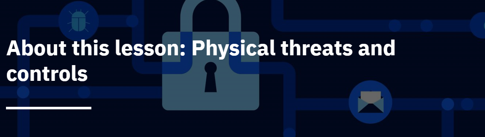
# Cybersecurity attacks often include digital elements, such as malware, and psychological elements, such as phishing. But no cybersecurity program is complete without accounting for physical threats to the buildings and devices housing valuable assets. 

## In this lesson, you’ll learn about physical security, types of physical threats, and strategies for addressing them. You’ll then explore types of physical controls and environmental controls and practice developing a plan to implement them in a realistic scenario. 

## 🏛️ Seguridad Física y Resiliencia de Infraestructura

La seguridad física es la primera línea de defensa para garantizar la tríada de la CIA (Confidencialidad, Integridad y Disponibilidad).

### 🔍 Gestión de Amenazas Ambientales
He analizado cómo factores no humanos impactan en la disponibilidad de los sistemas:
* **Monitoreo Térmico:** Implementación de controles detectivos (termostatos) y correctivos (climatización automática) para prevenir daños por calor.
* **Protección de Hardware:** Defensa contra sobretensiones e interferencias electromagnéticas.

### 🔐 Capas de Control Implementadas (Defensa en Profundidad)
1. **Acceso Perimetral:** Cámaras y seguridad física.
2. **Acceso a Instalaciones:** Uso de Key Cards y registros de ingreso.
3. **Acceso al Endpoint:** Autenticación biométrica (huella dactilar) y contraseñas robustas.

### 📉 Análisis de Incidente: Intento de Acceso No Autorizado
**Escenario:** Sujeto con vestimenta formal intenta ingresar a la zona restringida alegando olvido de credencial (Key Card).

**Vectores de Ataque Identificados:**
* **Pretexting:** Uso de una excusa creíble (olvido de tarjeta) para ganar acceso.
* **Impersonation:** Vestimenta de negocios para aparentar ser un ejecutivo o empleado de alto nivel.

**Resultado:** Control Exitoso. El personal de seguridad actuó como control administrativo, derivando al sujeto según el protocolo y manteniendo la integridad del perímetro físico.

## Amenazas a la Infraestructura y Datos
Acceso Directo: Ningún software de seguridad puede evitar que alguien conecte físicamente un dispositivo a un puerto de red si logra entrar.

Instalación de Malware: Una vez dentro, podría insertar una unidad USB en una estación de trabajo para instalar un virus que se propague por toda la red.

Robo de Hardware: Podría sustraer computadoras portátiles o incluso discos duros directamente de un centro de datos.

Daño Físico: Existe el riesgo de vandalismo o sabotaje que deshabilite la energía o dañe dispositivos de red críticos.

🛡️ Controles de Seguridad Aplicados
En este caso, el personal de seguridad actuó como un control administrativo efectivo al seguir las políticas de la empresa. Los controles físicos están diseñados para:

Disuadir, prevenir o retrasar a los actores maliciosos.

Identificar personas no autorizadas mediante la verificación de credenciales (como la key card que el hombre decía no tener).

## 🏛️ Seguridad Física y Defensa en Profundidad
La seguridad física es la protección del hardware y la infraestructura contra amenazas directas como el robo, el daño o el acceso no autorizado. Las organizaciones suelen adoptar un enfoque de defensa en profundidad, utilizando capas de controles para que, si uno falla, otro pueda compensarlo.

Niveles de Control y Ejemplo Práctico
Considerando el recorrido de un analista de ciberseguridad hacia su puesto de trabajo, se pueden identificar múltiples controles en capas:

* Acceso Perimetral y de Instalaciones: Uso de una tarjeta de acceso (key card) para entrar al vestíbulo y ser reconocido por el personal de seguridad.

* Vigilancia y Monitoreo: Cámaras ubicadas en vestíbulos, pasillos y ascensores.

* Control de Áreas Restringidas: Segundo uso de la tarjeta de acceso para ingresar a áreas específicas, como un Centro de Operaciones de Seguridad (SOC).

* Controles Automáticos: Luces con sensores de movimiento que se activan al detectar presencia.

* Acceso al Endpoint: Requisito de contraseñas y verificación de identidad mediante biometría (huella dactilar) en el equipo de trabajo.

⚠️ Gestión de Amenazas Físicas
Las amenazas físicas pueden comprometer la tríada de seguridad (Confidencialidad, Integridad y Disponibilidad) de maneras que los firewalls digitales no pueden detener.

* Tipos de Amenazas
# Amenazas Externas: Atacantes que utilizan ingeniería social física, como el tailgating, para ingresar a áreas restringidas y robar laptops o instalar virus mediante unidades USB.

# Amenazas Internas: Trabajadores malintencionados que abusan de su acceso autorizado para sustraer componentes, como discos duros, para vender la información al mejor postor.

# Amenazas Ambientales: Factores naturales o de infraestructura que pueden destruir el hardware, incluyendo temperaturas extremas, humedad, incendios, inundaciones, sobretensiones eléctricas o interferencia electromagnética.

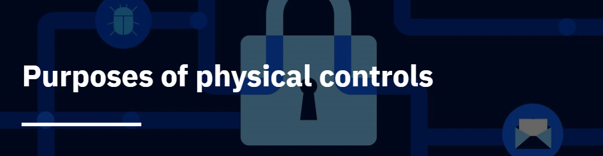

# 🏛️ Laboratorio de Seguridad Física y Organizacional

En este módulo del certificado de IBM, he analizado cómo las organizaciones protegen sus activos tangibles, hardware e infraestructura crítica mediante una estrategia de **Defensa en Profundidad**.

## 🛡️ Estrategia de Defensa en Profundidad
La seguridad física no depende de un solo control, sino de capas superpuestas. Si una capa es vulnerada, las demás deben ser capaces de detectar o mitigar la amenaza.

### 🧱 Niveles de Control y Acceso
He documentado el flujo de seguridad que protege los datos desde el exterior hacia el núcleo de la empresa:

1. **Perímetro y Fachada:** Guardias de seguridad y recepción (filtros administrativos y humanos).
2. **Vigilancia Constante:** Sistemas de CCTV en pasillos y puntos de tránsito (controles detectivos).
3. **Áreas Restringidas:** Acceso a salas de servidores o el SOC mediante **Key Cards** y lectores magnéticos.
4. **Endpoint Seguro:** Acceso final al hardware protegido por biometría (huella dactilar) y contraseñas robustas.


## 📊 Matriz de Clasificación de Controles
Para una gestión eficiente del riesgo, clasificamos los controles según su función técnica:

| Función | Propósito | Ejemplo del Mundo Real |
| :--- | :--- | :--- |
| **Disuadir / Prevenir** | Evitar que el incidente ocurra. | Muros, guardias, biometría y políticas de acceso. |
| **Detectar** | Identificar la amenaza en tiempo real. | Sensores de movimiento, alarmas de humo y cámaras. |
| **Corregir** | Mitigar el daño tras la detección. | Sistemas de supresión de incendios o climatización automática. |

## 🌪️ Gestión de Amenazas Ambientales y Disponibilidad
La tríada de la CIA (Confidencialidad, Integridad y Disponibilidad) también depende de factores ambientales. El hardware debe ser protegido contra:

* **Clima Extremo:** Temperaturas y humedad fuera de rango que dañan los componentes.
* **Incidentes Eléctricos:** Sobretensiones o interferencias electromagnéticas.
* **Respuesta Automática:** Implementación de termostatos vinculados a sistemas de enfriamiento (controles correctivos).


## 📑 Caso de Análisis: Intento de Acceso No Autorizado
Se analizó un escenario donde un atacante utilizó **Ingeniería Social (Pretexting)** para intentar ingresar a una oficina alegando el olvido de su credencial.
* **Conclusión:** El éxito de la seguridad dependió de la rigidez de los **Controles Administrativos** (políticas de la empresa) y la capacitación del personal para no ceder ante la presión social.

## 🧱 Catálogo de Controles de Seguridad Física

La protección de los activos de IT requiere una combinación de barreras materiales y sistemas tecnológicos. A continuación, se detallan los controles implementados y analizados en este laboratorio:

### 1. Seguridad de Perímetro (Exterior)
*Son la primera línea de defensa para disuadir e impedir el acceso a la propiedad.*
* **Muros y Cercas:** Barreras físicas que delimitan el área segura.
* **Alambre de Púas / Concertina:** Elementos disuasorios sobre muros para evitar escaladas.
* **Iluminación de Seguridad:** Luces con sensores de movimiento que eliminan puntos ciegos.
* **Bolardos:** Postes resistentes para evitar ataques con vehículos (ramming).
* **Guardias de Seguridad:** Personal humano para vigilancia activa y respuesta inmediata.

### 2. Control de Acceso (Entradas y Áreas Internas)
*Mecanismos para verificar la identidad y restringir el movimiento de personas.*
* **Key Cards (RFID):** Tarjetas magnéticas o de proximidad programadas con permisos específicos.
* **Controles Biométricos:** Escáneres de huellas dactilares, reconocimiento facial o de iris.
* **Mantraps (Esclusas):** Sistema de doble puerta donde la segunda no abre hasta que la primera esté cerrada (evita el tailgating).
* **Molinetes / Torniquetes:** Barreras mecánicas que permiten el paso de una sola persona a la vez.

### 3. Vigilancia y Detección
*Sistemas que monitorean y registran eventos para auditoría y respuesta.*
* **CCTV (Circuito Cerrado de Televisión):** Cámaras con grabación 24/7 y analítica de video.
* **Sensores de Movimiento:** Detectores infrarrojos que activan alertas ante intrusos.
* **Sensores de Contacto:** Alarmas en puertas y ventanas que detectan aperturas no autorizadas.

### 4. Protección de Infraestructura y Datos
*Controles específicos para el hardware crítico.*
* **Racks Cerrados con Llave:** Gabinetes que impiden el acceso físico a servidores y switches.
* **Cerraduras Electrónicas:** Registran qué empleado abrió qué puerta y a qué hora.
* **Pantallas de Privacidad:** Filtros físicos que evitan el "Shoulder Surfing" en oficinas abiertas.
* **Protección de Puertos:** Bloqueadores físicos de puertos USB y RJ45 para evitar la conexión de dispositivos maliciosos.

### 5. Controles Ambientales (Resiliencia)
*Garantizan la disponibilidad del hardware frente a fallos del entorno.*
* **Sistemas de Supresión de Incendios:** Extintores automáticos de gas inerte (no dañan la electrónica).
* **UPS (SAI) y Generadores:** Garantizan energía continua ante cortes de suministro.
* **Sensores de Inundación y Humedad:** Previenen daños por filtraciones o condensación.
* **Climatización de Precisión (HVAC):** Mantiene los servidores a la temperatura óptima.

### 🔄 Funciones Estratégicas: Retrasar y Defender

Para que la seguridad física sea efectiva, los controles deben cumplir funciones temporales y defensivas:

#### ⏳ Retraso (Delay)
Su propósito es ralentizar al atacante para permitir una respuesta operativa.
* **Controles de acceso vehicular:** Portones y bloqueos en parkings.
* **Filtros humanos:** Recepcionistas entrenados para demorar perfiles sospechosos mientras se alerta a seguridad.

#### 🛡️ Defensa (Defense)
La última barrera física para prevenir la pérdida de activos.
* **Physical Locks:** Uso de cerraduras en puertas, racks y gabinetes de datos.
* **Device Tethering:** Cables de acero y bloqueos físicos para evitar el robo de laptops y estaciones de trabajo.
* **Almacenamiento Seguro:** Safes y vaults para activos de alta criticidad.
* **Apprehension:** Protocolos de respuesta con fuerzas de seguridad (Law Enforcement).

## ACTIVITY

## Activity: Develop a physical security control plan (step 1) 

Imagine that you’re a member of a cybersecurity team working for a corporation bidding on a government contract. All confidential information must remain onsite. Therefore, the contract prohibits saving confidential information to USB flash drives or other removable storage devices usable for transporting files offsite. 

The corporation must improve its security measures to prevent this type of data breach. Currently, the corporation has the following security measures: 

The server room is locked. Each IT staff member has a key to the server room. 

The door to the shared workspaces is not locked. However, a sign outside this door clearly states, “Authorized personnel only”, and a receptionist screens all visitors. 

All employees have their own usernames and passwords. 

All employees have been instructed not to plug USB flash drives or external hard disk drives into their work computers. 

Your supervisor tasks you with developing a plan for meeting the contract’s requirements.

Step 1 

In this step, you will design the physical controls for an organization that is undertaking a government contract. In the following diagram, explore the layout of the first floor and experiment with the placement of new physical controls. 

Drag the physical controls into the appropriate locations to meet the contract’s requirements. You can select the Reset button to adjust your design. When you have placed the physical controls in the appropriate locations, take a screen capture of your design, and then insert it into the “Physical Security Control Plan” and write your plan.

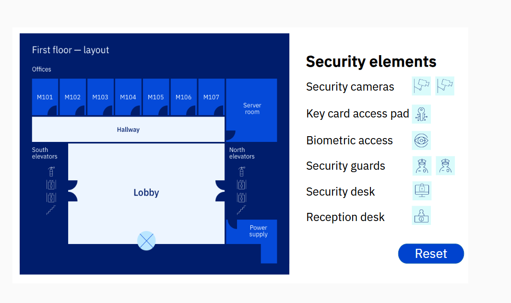
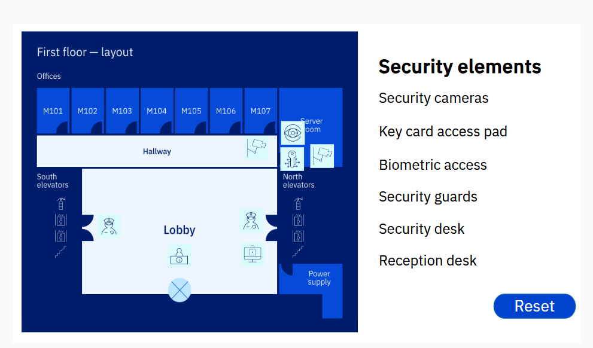
### 📋 Fase 2: Justificación Técnica del Plan de Seguridad

Para cumplir con las cláusulas de "No almacenamiento removible" del contrato, he definido la siguiente matriz de controles:

| Control Físico | Función Primaria | Impacto en la Seguridad |
| :--- | :--- | :--- |
| **Biometría** | Prevención / Acceso | Elimina el riesgo de llaves físicas perdidas o duplicadas en el Server Room. |
| **CCTV (Cámaras)** | Detección / Disuasión | Monitoreo constante de workstations para prevenir el uso de USBs no autorizados. |
| **Guardias** | Defensa / Retraso | Validación física de identidad y prevención de exfiltración de hardware. |

**Mitigación de Riesgos:** El plan aborda tanto la amenaza externa (intrusos) como la interna (empleados con acceso que intentan extraer datos), cumpliendo con el estándar de "Confidencialidad Onsite".

### 📋 Fase 2: Mejora del Plan de Seguridad Física

Basado en los requerimientos del contrato, he añadido capas de detección específicas para mitigar amenazas internas y externas:

* **Monitoreo Crítico:** Se añadieron cámaras dentro del Server Room para prevenir la conexión física de medios de almacenamiento (USB/Discos).
* **Detección Activa:** Implementación de sensores de movimiento para alertar sobre accesos no autorizados en áreas de alta sensibilidad.
* **Respuesta Inmediata:** Instalación de alarmas perimetrales para apoyar la labor de los guardias y la recepción.

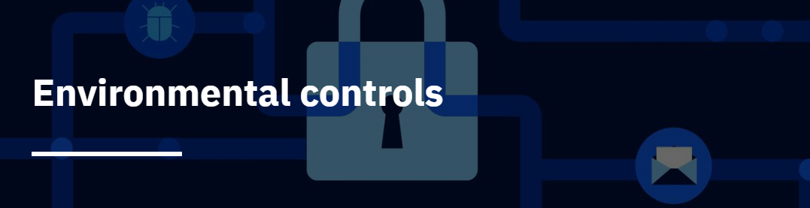

## 🌡️ Gestión de Amenazas Ambientales y Resiliencia
La disponibilidad de los sistemas no solo depende de la seguridad contra ataques humanos, sino de mantener el hardware dentro de parámetros operativos seguros.

## . Parámetros Ideales de Funcionamiento
Para maximizar la vida útil del equipo y evitar fallos catastróficos, se deben mantener los siguientes rangos en salas de servidores y data centers:

Temperatura: 18°C – 24°C (65°F – 75°F).

Humedad: 40% – 60% (un nivel muy bajo genera electricidad estática; un nivel muy alto causa corrosión y cortocircuitos).

## 2. Estrategias de Climatización (Airflow)
La disposición física del hardware es un control de prevención ambiental:

Pasillos Fríos y Calientes (Cold/Hot Aisles): El aire frío se dirige al frente de los dispositivos y el aire caliente se expulsa hacia un pasillo trasero independiente.

Sensores y Alertas: Uso de controles detectivos conectados a servicios de monitoreo remoto que notifican a los administradores ante cualquier desviación de los rangos ideales.

## 3. Otras Amenazas de Infraestructura
Incendios: Necesidad de sistemas de supresión que no dañen la electrónica (gas en lugar de agua).

Interferencia Electromagnética (EMI): Protección contra campos magnéticos que puedan corromper datos en tránsito o almacenados.

### 🌪️ Control Ambiental y Disponibilidad (Availability)

He documentado las medidas preventivas para proteger el hardware contra factores físicos externos:

* **Monitoreo de Precisión:** Implementación de sensores de temperatura (18°C-24°C) y humedad (40%-60%) para evitar fallos por calor o estática.
* **Diseño de Flujo de Aire:** Configuración de pasillos fríos/calientes para optimizar la disipación térmica en racks.
* **Controles Correctivos:** Configuración de alertas automáticas y sistemas de climatización redundantes para mitigar picos térmicos.

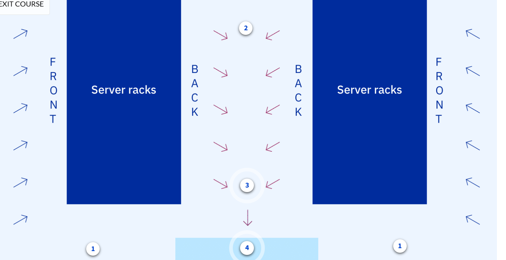
## 🌬️ Proceso de Enfriamiento por Pasillos (Hot/Cold Aisles)
* Entrada de Aire Frío (1): El aire refrigerado fluye hacia los pasillos fríos situados frente a los racks. Los servidores succionan este aire para mantener sus componentes internos a la temperatura ideal de 18°C–24°C.

* Emisión de Aire Caliente (2): A medida que el aire pasa por los procesadores y fuentes de energía, absorbe el calor y es expulsado por la parte trasera de los servidores.

* Flujo hacia el Intercambiador (3): Este aire caliente se concentra en el pasillo caliente y es dirigido hacia el extremo del pasillo.

* Tratamiento del Aire (4): El intercambiador de calor enfría y deshumidifica el aire (manteniendo la humedad entre 40% y 60%) antes de reintroducirlo al ciclo.

## 🛡️ ¿Por qué esto es Seguridad Física?
Como estás estudiando para Analista de Ciberseguridad, es clave recordar que estos son controles preventivos ambientales:

Disponibilidad (Availability): Si el intercambio de calor falla, los sistemas se apagan automáticamente para evitar daños físicos, lo que provoca una caída del servicio.

Controles Detectivos: Se utilizan sensores de temperatura y humedad vinculados a alertas para que el personal de IT actúe antes de que el hardware falle.

Controles Correctivos: El sistema de aire acondicionado (HVAC) actúa automáticamente para corregir desviaciones térmicas detectadas por los termostatos.

## 🔥 Prevención y Supresión de Incendios
El fuego en una sala de servidores es una amenaza crítica de disponibilidad. Las causas comunes incluyen fallos en el equipo de IT, cables recalentados bajo el suelo técnico o incendios externos.

Medidas Preventivas Recomendadas:
Evaluación de Riesgos: Programar inspecciones periódicas para identificar puntos de ignición.

Limpieza Regular: El polvo es altamente inflamable y puede causar cortocircuitos por sobrecalentamiento.

Monitoreo Térmico: Controlar la temperatura para evitar que los componentes alcancen su punto de ignición.

Sistemas de Supresión: Implementar sistemas que utilicen agentes limpios (gas inerte o agentes químicos) que extinguen el fuego sin dañar los circuitos electrónicos con agua.

* ⚡ Interferencia Electromagnética (EMI)
La radiación electromagnética puede degradar el rendimiento de los dispositivos o corromper los datos. Puede provenir de tormentas eléctricas o, más comúnmente, de otros dispositivos electrónicos cercanos (microondas, luces LED, celulares).

* Técnicas de Mitigación:
EMI Shielding (Blindaje): Uso de cables de red y AV recubiertos con materiales conductores o magnéticos que bloquean las ondas externas.

Jaulas y Bolsas de Faraday: Recintos fabricados con materiales metálicos especiales que protegen a los dispositivos sensibles de ráfagas o pulsos electromagnéticos.
### 🛡️ Resiliencia ante Desastres Físicos

Para completar el esquema de seguridad física, se han integrado controles contra amenazas ambientales extremas:

* **Protección contra Incendios:** Se prioriza la limpieza, el monitoreo térmico y la implementación de sistemas de supresión de incendios por gas (Clean Agents) para proteger la integridad del hardware.
* **Blindaje Electromagnético (EMI):** * Uso de **EMI Shielding** en cableado estructurado.
    * Disponibilidad de recintos de **Faraday** para proteger equipos críticos contra interferencias y pulsos electromagnéticos.

## 🌪️ Fase 3: Plan de Controles Ambientales y Disponibilidad

En esta etapa final del diseño, implementé controles específicos para minimizar la pérdida de datos ante desastres naturales, incendios o fallos en el suministro eléctrico, garantizando la continuidad del negocio (**Business Continuity**).

### 📋 Selección de Controles Ambientales

#### 1. Sistema de Supresión de Incendios (Clean Agent System)
* **Razonamiento:** El uso de agua en una sala de servidores es contraproducente. Implementé un sistema basado en **agentes gaseosos** que extinguen el fuego eliminando el calor o el oxígeno sin dañar los componentes electrónicos. Es un control **correctivo** vital para proteger la integridad física de los discos duros y servidores ante un inicio de ignición por sobrecalentamiento.

#### 2. Generador de Emergencia (Backup Generator)
* **Razonamiento:** Un corte de energía no solo apaga los servidores, sino que detiene los sistemas de enfriamiento. En minutos, la temperatura puede subir a niveles críticos. El generador garantiza que el sistema **HVAC** mantenga el rango ideal de **18°C–24°C**, protegiendo el hardware de daños permanentes y asegurando la **Disponibilidad** de la información onsite exigida por el contrato.

#### 3. Mantenimiento y Limpieza Programada
* **Razonamiento:** Actúa como un control **preventivo**. La acumulación de polvo es una de las principales causas de incendios por cortocircuitos y fallos en el flujo de aire. Mantener el entorno limpio reduce la probabilidad de incidentes térmicos y extiende la vida útil de la infraestructura crítica.

### 📊 Resumen de Mitigación de Riesgos

| Amenaza | Control Implementado | Tipo de Control | Objetivo |
| :--- | :--- | :--- | :--- |
| **Incendio** | Supresión por Gas | Correctivo | Integridad |
| **Apagón Eléctrico** | Generador / UPS | Preventivo | Disponibilidad |
| **Calor / Estática** | Sensores y Limpieza | Detectivo | Confiabilidad |


---

### 🏁 Conclusión del Proyecto de Seguridad Física
Con la integración de estos controles físicos, administrativos y ambientales, la corporación ahora cumple con los requisitos del contrato gubernamental. Se ha pasado de una seguridad basada en "buena voluntad" (carteles y llaves comunes) a una **Defensa en Profundidad** robusta que mitiga tanto amenazas externas como internas.

### 🚀 Proyección Profesional: Physical Security Service Technician

Como parte de mi formación en Cybersecurity, he analizado el rol del Técnico de Seguridad Física, un puesto que combina mis habilidades previas como **Técnico en Sistemas** con la protección de infraestructura crítica:

* **Gestión de Dispositivos:** Capacidad para instalar y mantener cámaras, biometría y controles de acceso.
* **Integración IT:** Los sistemas modernos dependen de servidores y redes, áreas donde mi experiencia técnica permite una administración eficiente.
* **Sectores Críticos:** Preparado para trabajar en entornos de alta seguridad (Banca/Energía), protegiendo activos tangibles e información confidencial.

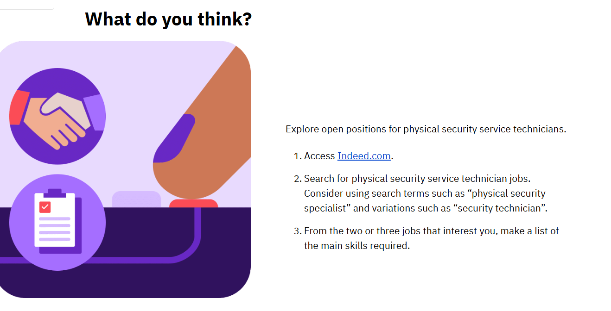
### 🔍 Investigación de Mercado: Perfil de IT Support & Security

He analizado posiciones abiertas que integran el soporte técnico con la seguridad física, identificando a **ShipHero** como un referente en trabajo remoto.

**Habilidades Clave Identificadas:**
1. **Administración Multi-Plataforma:** Gestión de entornos híbridos (Linux, Windows, MacOS).
2. **Infraestructura de Seguridad Física:** Implementación de cámaras PoE y dispositivos de red, reforzando la **Defensa en Profundidad**.
3. **Ciberseguridad Proactiva:** Identificación de amenazas como Phishing para proteger la integridad de la organización.
4. **Soporte Bilingüe:** Competencia técnica tanto en Inglés como en Español para entornos globales.

### 🚀 Profesional en Formación: Cybersecurity & IT Support

Mi enfoque combina la robustez de los sistemas informáticos con la precisión de la seguridad física. 

* **Especialidad:** Integración de infraestructura (Cámaras PoE, Networking) con ciberseguridad lógica.
* **Sistemas:** Dominio de entornos Windows, Linux y virtualización avanzada.
* **Idiomas:** Capacidad para brindar soporte técnico bilingüe (Español/Inglés) en entornos globales.
* **Meta:** Aplicar controles de "Defensa en Profundidad" para proteger la integridad y disponibilidad de la información en sectores críticos.

## 🛡️ Laboratorio: Diseño de Seguridad Física para Contratos Gubernamentales

Este ejercicio consistió en el rediseño de la seguridad de una corporación para cumplir con normativas estrictas de "Confidencialidad Onsite", prohibiendo la extracción de datos mediante dispositivos extraíbles (USB/Discos).

### 📍 Paso 1 & 2: Implementación de Controles Físicos
He transformado el layout de la planta baja pasando de una seguridad pasiva a una **Defensa en Profundidad**:

* **Server Room (Máxima Seguridad):** Sustitución de llaves físicas por **Acceso Biométrico** y **Key Card Readers**. Se añadió monitoreo constante mediante **CCTV** para prevenir amenazas internas.
* **Lobby y Perímetro:** Ubicación estratégica de **Guardias de Seguridad** y **Cámaras** en puntos ciegos y ascensores para actuar como controles de **Retraso (Delay)** y **Detección**.
* **Shared Workspaces:** Instalación de cerraduras electrónicas en puertas que anteriormente estaban abiertas, asegurando que solo el personal autorizado acceda a las estaciones de trabajo.

### 🌪️ Paso 3: Resiliencia Ambiental
Para garantizar la **Disponibilidad** y la integridad del hardware ante desastres:
1. **Supresión de Incendios:** Implementación de sistemas por gas inerte para proteger los servidores sin usar agua.
2. **Control Térmico:** Diseño de pasillos fríos/calientes y sensores de humedad (40-60%) para evitar fallos por estática o calor.
3. **Energía Redundante:** Generadores de respaldo para mantener los sistemas de enfriamiento operativos durante apagones.

### 💼 Perfil Profesional y Mercado Laboral
La investigación de mercado (ej. vacante de **IT Support en ShipHero**) demuestra que el rol del técnico moderno es híbrido. El perfil desarrollado para este proyecto incluye:
* **Habilidades IT:** Gestión de Windows, Mac, Linux e iOS.
* **Habilidades de Seguridad:** Instalación de cámaras PoE, configuración de redes y respuesta ante Phishing.
* **Habilidades Blandas:** Comunicación bilingüe (Español/Inglés) y priorización basada en riesgo.

### 🔐 Glosario de Conceptos Clave en Ciberseguridad
* 🦠 1. Malware y Protección Lógica
El malware es software diseñado para comprometer la Tríada CIA (Confidencialidad, Integridad y Disponibilidad).

Tipos comunes: Virus, gusanos, troyanos, ransomware (como el Rhadamanthys que eliminamos antes), bombas lógicas, spyware y adware.

Controles esenciales: * Software antimalware (ej. Malwarebytes para escaneos y protección en tiempo real).

Gestión de parches (Patch Management).

Políticas de navegación segura.

* 🧠 2. Ingeniería Social y Factor Humano
El uso del engaño para manipular a las personas y obtener datos confidenciales.

Phishing: Identificable por remitentes sospechosos, errores gramaticales, lenguaje urgente o archivos adjuntos extraños.

Tácticas Físicas: * Shoulder Surfing: Mirar por encima del hombro.

Dumpster Diving: Buscar información sensible en la basura.

Tailgating: Seguir a alguien a un área restringida sin autorización.

* 🏢 3. Seguridad Física y Estrategia
Protección directa de los activos tangibles contra intrusiones o peligros naturales.

Defense in Depth (Defensa en Profundidad): Estrategia de múltiples capas donde, si una falla, otra compensa la seguridad.

Propósitos de los Controles Físicos:

Deter (Disuadir): Que no lo intenten.

Deny (Denegar): Bloquear el acceso.

Detect (Detectar): Saber si entraron.

Delay (Retrasar): Ganar tiempo para responder.

Defend (Defender): Protección final de los activos en sitio.

* 🌪️ 4. Resiliencia Ambiental
Monitoreo para evitar daños por factores del entorno.

Variables Críticas: Temperatura, humedad, incendios e interferencia electromagnética (EMI).

Objetivo: Mantener el hardware operativo dentro de rangos ideales para asegurar la disponibilidad de los servicios.

### 🔑 Conceptos Fundamentales de Seguridad

He consolidado los pilares de la ciberseguridad analizados en este módulo:

* **Gestión de Amenazas:** Identificación de tipos de malware y técnicas de ingeniería social (Phishing/Tailgating).
* **Defensa en Profundidad:** Implementación de controles físicos bajo los principios de Disuadir, Denegar, Detectar, Retrasar y Defender.
* **Seguridad Ambiental:** Importancia del monitoreo de condiciones críticas para garantizar la resiliencia del hardware.
* **Herramientas:** Uso de soluciones como Malwarebytes para la protección de endpoints y mitigación de amenazas digitales.

### 🎓 Habilidades Desarrolladas: Pensamiento Crítico y Sistémico

He completado el análisis de roles y amenazas, adquiriendo las siguientes capacidades:

1. **Análisis de Malware:** Capacidad para diferenciar tipos de software malicioso y aplicar medidas de remediación activa.
2. **Detección de Ingeniería Social:** Identificación de patrones de engaño tanto en medios digitales (Phishing) como físicos (Tailgating).
3. **Planificación Estratégica:** Desarrollo de planes de control físico que integran la seguridad lógica con la protección de infraestructura.
4. **Orientación de Carrera:** Comprensión de las tareas y habilidades necesarias para desempeñarse como Analista de Malware o Técnico en Seguridad Física.

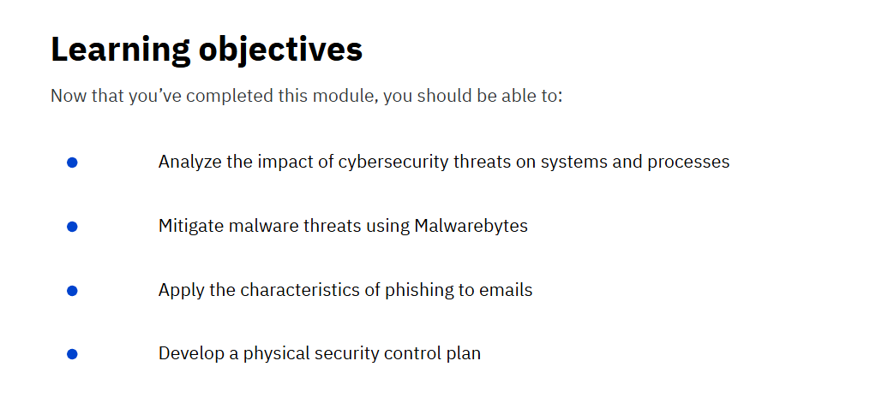
## 📚 Referencias Bibliográficas y Casos de Estudio

Para el desarrollo de este proyecto y el fortalecimiento de los controles de seguridad, se han tomado como referencia los siguientes recursos técnicos y estudios de casos reales:

### 1. Ransomware: Mecánicas de Secuestro de Datos
* **Referencia:** [What is Ransomware? - IBM Technology (YouTube)](https://www.youtube.com/watch?v=imNfrtvYYbw)
* **Concepto:** Análisis profundo sobre cómo el software malicioso cifra la información crítica y los métodos de mitigación, como la regla de backups 3-2-1, el parcheo de vulnerabilidades CVE y la importancia de no pagar rescates para no financiar el ecosistema criminal.

### 2. Amenazas Internas (Insider Threats)
* **Referencia:** [What are Insider Threats? - IBM Topic Guide](https://www.ibm.com/think/topics/insider-threats)
* **Concepto:** Definición de los vectores de riesgo que provienen de usuarios autorizados. Se categorizan en:
    * **Maliciosos:** Búsqueda de beneficio económico o sabotaje.
    * **Negligentes:** Errores humanos y falta de concienciación.
    * **Comprometidos:** Credenciales legítimas robadas por atacantes externos.

### 3. Casos Reales de Brechas de Seguridad por Insiders
* **Referencia:** [7 Real-Life Data Breaches Caused by Unmitigated Insider Threats - Syteca](https://www.syteca.com/en/blog/real-life-examples-insider-threat-caused-breaches)
* **Estudios de Caso:**
    * **Google (2024):** Robo de 500 archivos de propiedad intelectual sobre arquitectura de chips de IA por parte de un ingeniero de software.
    * **Coinbase (2025):** Empleados de soporte técnico sobornados para filtrar datos de 70,000 usuarios.
    * **Marks & Spencer (2025):** Ataque de ingeniería social a un proveedor externo que derivó en la implementación de ransomware en sus servidores.
    * **FinWise Bank (2024):** Brecha de datos causada por un ex-empleado que aún mantenía acceso activo tras su desvinculación (Fallo en el proceso de Offboarding).

---

### 🛠️ Aplicación Práctica en este Proyecto
Los conocimientos extraídos de estas referencias fueron aplicados en el **Plan de Control de Seguridad Física** de este repositorio, específicamente en:
* Implementación de **MFA (Multi-Factor Authentication)** para mitigar credenciales comprometidas.
* Procesos de **Offboarding Automatizado** para revocar accesos de inmediato.
* Diseño de **Resiliencia Ambiental** para asegurar la disponibilidad de los datos ante ataques de sabotaje físico.

### 📚 Fuentes y Lecturas de Referencia (Módulo 1)

Para el análisis de amenazas y el diseño de controles, se han consultado las siguientes fuentes técnicas y reportes de la industria:

#### Lección 1: Malware y Controles de Software
* **Causas de Brechas:** [80% de las brechas de datos se deben a contraseñas débiles](https://www.insightsforprofessionals.com/it/security/80-percent-data-breaches-weak-passwords) - *IFP: Insights for Professionals (2021).*
* **Bombas Lógicas:** [Contratista de Siemens encarcelado por plantar bombas lógicas](https://www.infosecurity-magazine.com/news/siemens-contractor-jailed-for/) - *Infosecurity (2019).*
* **Adware:** [Fireball: Adware con potenciales consecuencias nucleares](https://www.kaspersky.com/blog/fireball-adware/17013/) - *Kaspersky Daily (2017).*

#### Lección 2: Amenazas de Ingeniería Social
* **Reporte de Crímenes:** [2022 Internet Crime Report](https://www.ic3.gov/Media/PDF/AnnualReport/2022_IC3Report.pdf) - *Internet Crime Complaint Center (IC3).*
* **Casos Reales:** [El hackeo de Twitter 2020: Estafa de Bitcoin a cuentas de Biden, Musk y Obama](https://www.cnbc.com/2021/07/21/man-busted-in-2020-twitter-hack-bitcoin-scam-of-biden-obama-musk-buffett-accounts.html) - *CNBC (2021).*

#### Lección 3: Amenazas y Controles Físicos
* **Prevención de Incendios:** [6 consejos de prevención de incendios en salas de computadoras y servidores](https://www.impactfire.com/6-computer-and-server-room-fire-prevention-tips-you-cant-ignore/) - *Impact Fire (2022).*

## ---------------------------------------------------------------------------------------##

## Modulo 2

## En este módulo, explorarás la inteligencia de amenazas, el conocimiento que ayuda a las organizaciones a comprender, identificar y responder a las amenazas que enfrentan. Aprenderás sobre los tres tipos de inteligencia de amenazas y descubrirás cómo los expertos en ciberseguridad la recopilan, crean y comparten. A continuación, aprenderás sobre la evaluación de vulnerabilidades, un proceso clave para crear inteligencia de amenazas específica para una organización en particular. Aprenderás los cuatro pasos de la evaluación de vulnerabilidades y cómo priorizar las vulnerabilidades descubiertas según su gravedad. Luego, explorarás las pruebas de penetración, un proceso que simula técnicas de hacking reales para encontrar más vulnerabilidades que los atacantes podrían explotar. Aprenderás sobre las cuatro fases de las pruebas de penetración e incluso practicarás probando una aplicación en busca de vulnerabilidades.

---

## 🔍 Microcredencial 2 | Módulo 2: Gestión de Vulnerabilidades

Este módulo se centra en la proactividad: cómo las organizaciones utilizan la inteligencia y las pruebas técnicas para cerrar brechas antes de que sean explotadas.

### 🧠 1. Inteligencia de Amenazas (Threat Intelligence)
Es el conocimiento basado en evidencia que permite comprender e identificar las amenazas. Se divide en tres tipos:
* **Estratégica:** Panorama general de amenazas para la toma de decisiones de alto nivel.
* **Táctica:** Detalles sobre las tácticas, técnicas y procedimientos (TTPs) de los atacantes.
* **Operacional:** Información específica sobre ataques inminentes o en curso.

### 🛡️ 2. Evaluación de Vulnerabilidades (Vulnerability Assessment)
Proceso sistemático para identificar y priorizar debilidades en una organización específica. Consta de 4 pasos clave:
1. **Identificación:** Localizar vulnerabilidades en sistemas y aplicaciones.
2. **Análisis:** Determinar la causa raíz y el impacto potencial.
3. **Evaluación de Riesgos:** Priorizar según la gravedad (utilizando marcos como CVSS).
4. **Remediación:** Aplicar parches o controles para mitigar el riesgo.

### ⚔️ 3. Pruebas de Penetración (Pentesting)
Simulación de ataques reales para descubrir qué tan vulnerables son los sistemas ante técnicas de hacking.
* **Fases del Pentesting:**
    1. **Planificación y Reconocimiento:** Definir alcance y recolectar info.
    2. **Escaneo:** Uso de herramientas para entender cómo responde el objetivo.
    3. **Obtención de Acceso:** Explotar vulnerabilidades para entrar al sistema.
    4. **Ma### 🕵️ Inteligencia de Amenazas y Evaluación de Vulnerabilidades

Como dice la máxima de Sun Tzu: *"Conoce a tu enemigo y conócete a ti mismo"*. En este módulo, he profundizado en cómo aplicar este principio a la ciberseguridad moderna.

#### 🧠 Clasificación de la Inteligencia de Amenazas (Threat Intelligence)
Para fortalecer las defensas, clasificamos la inteligencia en tres niveles críticos:
1. **Estratégica:** Análisis de alto nivel sobre tendencias de ataques y motivos de los adversarios.
2. **Táctica:** Detalles técnicos sobre el funcionamiento del malware y los pasos específicos que los atacantes utilizan para evadir detecciones.
3. **Operacional:** Información en tiempo real sobre amenazas específicas: de dónde viene el ataque, qué hace y cómo responder de inmediato.

#### 🔄 El Ciclo de Vida de la Inteligencia
Para que la información sea útil, sigo un proceso de 5 etapas:
* **Requerimientos:** Determinar qué necesitamos saber.
* **Recolección:** Obtener los datos.
* **Análisis:** Convertir los datos en información procesable.
* **Diseminación:** Compartir los hallazgos con los equipos relevantes.
* **Feedback:** Evaluar si la inteligencia ayudó a fortalecer los controles.

#### 🔍 Evaluación de Vulnerabilidades (Vulnerability Assessment)
A diferencia de la inteligencia de amenazas (que mira hacia afuera), la evaluación de vulnerabilidades mira hacia adentro.
* **Escaneo:** Análisis de redes, hosts, aplicaciones y bases de datos.
* **Priorización:** Identificar, clasificar y ordenar las vulnerabilidades según su criticidad para garantizar la **Confidencialidad, Integridad y Disponibilidad (CIA)**.

---

### 💼 Habilidades Profesionales Identificadas (Soft & Hard Skills)
Basado en los perfiles de **Physical Security Service Technicians**, he integrado las siguientes competencias a mi perfil técnico:

* **Gestión de Riesgos y Cumplimiento:** Capacidad para manejar controles de privacidad y normativas de seguridad IT.
* **Seguridad en la Nube:** Habilidad para implementar soluciones de seguridad en entornos multicloud.
* **Pensamiento Analítico:** Capacidad para analizar problemas complejos y proponer soluciones técnicas precisas.
* **Comunicación Efectiva:** Habilidades de comunicación escrita y verbal, esenciales para documentar incidentes y colaborar bajo supervisión general mantenimiento del Acceso y Análisis:** Ver qué tan profundo se puede llegar y documentar los hallazgos.

## Imagine that you’re a vulnerability assessment analyst. While performing a network security check at a community hospital, you gather threat intelligence on malware trying to gain access to confidential patient data. 

## Which steps of the threat intelligence lifecycle do you still need to complete to ensure the organization gets the information it needs to understand and act on the threat?

## 🔍 Pasos para completar el Ciclo de Inteligencia
1. Análisis (Lo que te faltaba definir)
¿Cómo lo harías?
No es solo mirar el código; es darle contexto. Como analista en ese hospital, deberías:

Correlacionar: Ver si ese malware ya atacó a otros hospitales (Inteligencia Táctica).

Evaluar el impacto: ¿Qué pasa si esos datos se filtran? (Cumplimiento de leyes de privacidad de salud).

Identificar el "Cómo": ¿El malware entra por una vulnerabilidad en las máquinas de rayos X o por un correo de phishing?

Resultado: Transformás logs crudos en un informe de riesgo.

2. Diseminación (Compartir con los equipos)
¿Con quiénes?

Equipo Técnico: Para que bloqueen las IP sospechosas en el firewall o instalen parches.

Directivos: Para que entiendan el riesgo financiero y legal.

Personal del Hospital: Para alertarlos si hay una campaña de phishing activa.

3. Feedback (Retroalimentación)
¿Qué evaluamos?

¿La información que diste llegó a tiempo?

¿Se logró bloquear el malware antes de que toque los datos de los pacientes?

Mejora continua: Si algo falló, ajustamos los "Requerimientos" para la próxima vez.

### 🏥 Caso Práctico: Análisis en Entorno Hospitalario

**Escenario:** Detección de malware intentando acceder a registros confidenciales de pacientes.

**Fases del Ciclo de Inteligencia aplicadas:**
1. **Análisis:** Procesamiento de indicadores de compromiso (IoC) para determinar el vector de ataque y el riesgo para la privacidad de los datos.
2. **Diseminación:** Comunicación estratégica de hallazgos al equipo de infraestructura para el bloqueo inmediato de amenazas y al personal administrativo para concienciación.
3. **Feedback:** Revisión de la efectividad de las medidas tomadas, fortaleciendo los controles de red y ajustando los sensores de detección para futuras amenazas similares.


### 🔬 Simulación: Analista de Vulnerabilidades en Entorno de Salud

He documentado la resolución de una amenaza de malware en un hospital comunitario aplicando las fases finales del ciclo de inteligencia que faltaba :

* **Análisis:** Transformación de indicadores de compromiso (IoC) en un mapa de riesgo específico para el sector salud, priorizando la protección de servidores de bases de datos SQL de pacientes.
* **Diseminación:** Distribución de reportes de impacto a las áreas de infraestructura y cumplimiento legal para asegurar una respuesta coordinada.
* **Feedback:** Evaluación post-incidente para ajustar los requisitos de inteligencia, optimizando los sensores de red para detectar variantes similares de malware de forma proactiva.

### 🔄 Ciclo de Vida de la Inteligencia de Amenazas (5 Etapas)

He aplicado el marco de trabajo de 5 pasos para la gestión de incidentes:

1. **Dirección/Requisitos:** Definición de activos críticos a proteger.
2. **Recolección:** Obtención de datos brutos y telemetría de red.
3. **Análisis:** Procesamiento técnico para identificar patrones de ataque (TTPs).
4. **Diseminación:** Comunicación de alertas y reportes a los stakeholders.
5. **Feedback:** Mejora continua del proceso basada en la efectividad de la respuesta.

## what is intelligense ?

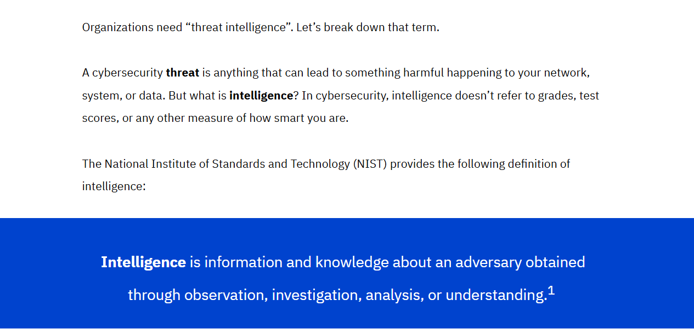

##  Datos(Amenaza) vs. Inteligencia: El valor del Análisis
En ciberseguridad, la inteligencia no es solo acumular datos; es el conocimiento derivado de una investigación profunda y un análisis reflexivo.

Información (Datos Brutos): Son los hechos aislados sin procesar.

Ejemplo: Registrar cuántas veces un usuario postea en X por día. En seguridad, esto sería ver una IP intentando conectarse 100 veces a un puerto.

Conocimiento (Inteligencia): Es la conclusión con significado que extraemos tras examinar los patrones en los datos.

Ejemplo: Notar patrones en los temas que postea esa persona o a quién responde para concluir cuáles son sus intereses políticos. En seguridad, esto sería concluir que esos 100 intentos de conexión provienen de un botnet específico que busca vulnerabilidades en bases de datos SQL.

### 💡 Diferencia Crítica: Datos(Amenaza) vs. Inteligencia

Como analista, mi objetivo no es solo recolectar **información** (datos brutos), sino generar **inteligencia** (conocimiento accionable).

* **Dato(Amenaza):** Una alerta de malware detectada en un endpoint.
* **Inteligencia:** El análisis de los patrones de ese malware, su origen probable y la intención del adversario, permitiendo fortalecer los controles de forma estratégica.

La inteligencia requiere **observación, investigación y análisis** para transformar lo que vemos en una defensa efectiva.

### 🧠 Metodología: Creación de Inteligencia Específica

Mi enfoque como analista no es solo observar ataques globales, sino filtrar esa información para generar **Inteligencia Organizacional**:

1. **Análisis de Tendencias:** Identificación de patrones de ataque en el sector [Industria] mediante la correlación de datos de diversas fuentes.
2. **Evaluación de Impacto:** Mapeo de amenazas externas contra las vulnerabilidades internas identificadas en el sistema.
3. **Estrategia de Mitigación:** Desarrollo de planes de acción basados en mejores prácticas para la remediación de vulnerabilidades críticas.

### 📖 Terminología de Seguridad

Para un análisis preciso de la superficie de ataque, distingo entre los siguientes conceptos:

* **Attacker:** Entidad que intenta activamente vulnerar la seguridad de un activo con fines maliciosos.
* **Threat Actor / Malicious Actor:** Entidad (individuo o grupo organizado) con la capacidad e intención de comprometer la seguridad. El uso de este término permite un enfoque proactivo, centrado en el riesgo potencial antes de que ocurra la intrusión.

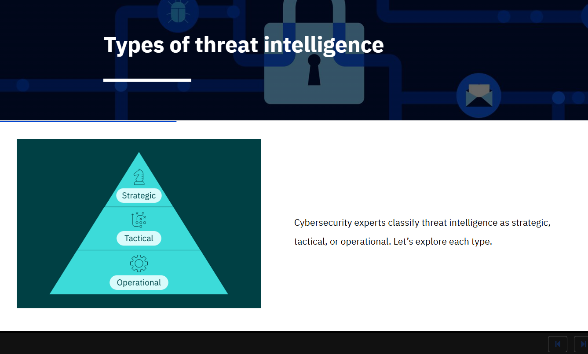

### 🌐 Inteligencia Estratégica: El "Quién" y el "Por qué"

La inteligencia estratégica es el nivel más alto de análisis de amenazas. Su objetivo es proporcionar a los niveles ejecutivos una visión panorámica del riesgo para la toma de decisiones financieras y operativas.

#### 🎯 Enfoque y Objetivos
A diferencia de la inteligencia técnica, la estratégica busca responder:
* **¿Quién?** Identificación de los *Threat Actors* con interés real en la organización.
* **¿Por qué?** Análisis de las motivaciones (económicas, políticas o ideológicas) que impulsan a los atacantes.

#### 📊 Factores de Análisis
Para generar esta inteligencia, se monitorean tres áreas clave:
1. **Motivos e Intenciones:** ¿Qué activos específicos buscan (ej: propiedad intelectual, datos de clientes)?
2. **Tendencias de la Industria:** Patrones de ataques detectados en organizaciones del mismo sector.
3. **Geopolítica y Política Global:** Cómo los movimientos sociales o conflictos internacionales pueden convertir a la empresa en un objetivo.

> **💡 Caso de Estudio: Empresa de Infraestructura Crítica**
>
**💡 Caso de Estudio: Empresa de Infraestructura Crítica**
> Si una empresa de servicios públicos detecta un movimiento político regional que promueve el sabotaje de infraestructura, la **Inteligencia Estratégica** permite a los directivos reasignar presupuesto de inmediato para fortalecer la seguridad física y lógica antes de que el primer ataque ocurra.

### 🛡️ Inteligencia Táctica: Detección y Respuesta en Tiempo Real

Mientras que la inteligencia estratégica mira el panorama general, la **Inteligencia Táctica** se enfoca en el "qué" y el "cómo". Es la herramienta fundamental para los equipos de respuesta que operan en la primera línea de defensa.

#### 🔍 El concepto de IOC (Indicadores de Compromiso)
En ciberseguridad, los "síntomas" de un ataque se denominan **IOCs**. Identificar estos indicadores nos permite confirmar una intrusión y determinar su naturaleza.
* **Ejemplos de IOCs:** Asuntos de correos sospechosos, hashes de archivos maliciosos, direcciones IP de comando y control (C2).
* **Función:** Permiten realizar un **triaje** efectivo, asignando prioridades de respuesta basadas en la evidencia técnica.

#### 🛠️ Fuentes de Información Táctica
Para construir esta inteligencia, los profesionales utilizamos:
1. **Threat Intelligence Feeds:** Listas automatizadas de amenazas globales conocidas.
2. **Security Tools:** Logs de firewalls, antivirus y sistemas de detección de intrusos.
3. **Análisis Interno:** Monitoreo y búsqueda de anomalías dentro de la propia infraestructura.


#### 👥 Aplicación por Perfiles Técnicos
* **Security Analysts (SOC):** Utilizan esta info para monitorear alertas diarias.
* **Incident Responders:** Actúan basándose en tácticas conocidas para contener brechas de datos activas.

> **💡 Caso Práctico: Respuesta ante una Brecha de Datos**
> Ante un intento de robo de información, el personal técnico recopila inteligencia táctica para identificar la fuente y el método (ej: phishing). Con estos datos, se ejecutan acciones inmediatas de aislamiento y limpieza para evitar que el daño se propague a otros activos críticos.

### ⚙️ Inteligencia Operacional: Anticipación y Prevención

La inteligencia operacional es el pilar preventivo de la ciberseguridad. Se utiliza en el día a día para identificar y reducir riesgos antes de que un *threat actor* pueda explotarlos.

#### 🎯 Enfoque: El "Cómo" y el "Dónde"
* **¿Cómo atacarán?** Anticipación de técnicas de ataque futuras.
* **¿Dónde atacarán?** Identificación de vulnerabilidades en activos críticos (software desactualizado, malas configuraciones).

#### 🛠️ Herramientas de Recolección
Para generar esta inteligencia, realizo:
1. **Vulnerability Scans:** Evaluaciones asistidas por software para detectar fallos conocidos.
2. **Análisis de Logs:** Seguimiento del rendimiento y comportamiento del sistema.
3. **Evaluación de Controles:** Pruebas constantes para verificar si las defensas actuales son efectivas.

> **💡 Ejemplo Operativo:**
> Mediante un escaneo periódico, detectamos que un servidor tiene un puerto abierto innecesariamente. La inteligencia operacional nos dicta la **mejor práctica** para cerrar ese puerto y actualizar el firmware, eliminando la oportunidad de ataque antes de que sea detectada por un tercero.

### 📚 Fuentes y Herramientas de Inteligencia

Para mantenerme actualizado y fortalecer la postura de seguridad, utilizo diversos canales de recolección de datos:

1. **OSINT (Open-Source Intelligence):** Monitoreo activo de fuentes públicas como blogs especializados (Krebs on Security, Dark Reading), repositorios de GitHub y comunidades de seguridad para identificar tendencias emergentes.
2. **Feeds de Amenazas:** Uso de bases de datos compartidas y recursos públicos (como AlienVault OTX o VirusTotal) para obtener IOCs actualizados.
3. **Documentación Técnica:** Análisis de registros públicos y sitios web oficiales de fabricantes para detectar vulnerabilidades en software específico.

## 🌐 Fuentes de Inteligencia: Colaboración y OSINT
Dada la velocidad con la que evolucionan los threat actors, las organizaciones no pueden depender solo de sus propios datos. La clave está en el intercambio de información y el uso de fuentes abiertas.

🔓 Inteligencia de Fuentes Abiertas (OSINT)
OSINT (Open-Source Intelligence) es cualquier inteligencia que se genera a partir de información disponible públicamente. Es una de las herramientas más poderosas para un analista inicial.

Fuentes Comunes: Blogs de seguridad, bibliotecas técnicas, noticias, sitios web corporativos, redes sociales (como X/Twitter para alertas rápidas) y registros públicos.

Ventaja: Es accesible para cualquiera y permite aprender de las experiencias de otros investigadores.

🔐 Recursos Privados y Suscripciones
Para obtener datos más críticos o inmediatos, las organizaciones utilizan servicios pagos:

Actualización en Tiempo Real: Estos servicios suelen actualizarse en menos de 24 horas tras detectar un nuevo tipo de ataque o actor.

Contenido Especializado: Ofrecen técnicas de mitigación específicas y detalles profundos sobre la infraestructura de los atacantes que no siempre son públicos.

🤝 Colaboración Inter-Organizacional
Muchas empresas forman alianzas para compartir inteligencia específica de su industria, creando una red de defensa colectiva donde el ataque a una sirve de lección para todas.

> ### 🔍 Evaluación de Vulnerabilidades: El arte de conocerse a uno mismo

Para garantizar la tríada **CIA** (Confidencialidad, Integridad y Disponibilidad), aplico un proceso sistemático de evaluación:

1. **Identificación:** Escaneo exhaustivo de activos (redes, bases de datos y apps) en busca de debilidades.
2. **Análisis:** Determinación de la naturaleza técnica de la vulnerabilidad identificada.
3. **Clasificación y Priorización:** Uso de inteligencia operativa y marcos como CVSS para determinar el impacto potencial y el orden de atención.
4. **Remediación:** Implementación de medidas correctivas (parches, endurecimiento de sistemas) para mitigar el riesgo.

#### 🌐 Fuentes de Consulta de Élite
En mis procesos de investigación, integro datos de fuentes reconocidas como:
* **CISA** (Alertas gubernamentales)
* **IBM X-Force Exchange** (Colaboración global)
* **Yeti** (Gestión de IoCs)
* **InfraGard** (Guías del FBI para infraestructura crítica) Clave:** La ciberseguridad es un esfuerzo colaborativo. El uso de OSINT permite anticipar ataques basándose en la experiencia global de la comunidad técnica.

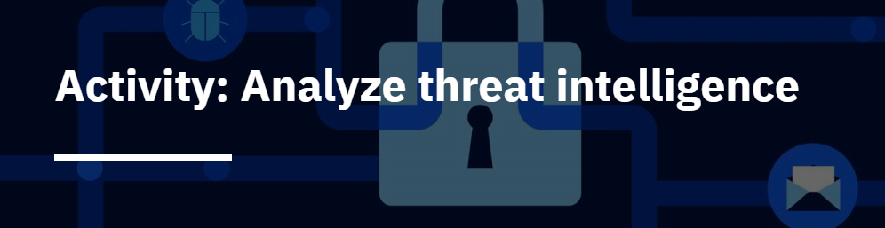

## Report 1: IBM X-Force Exchange intelligence report for CVE-2023-2541 


## 📄 Caso de Estudio: Análisis de Inteligencia (IBM X-Force Exchange)

Como parte de las actividades prácticas del Módulo 2, realicé un análisis detallado de un reporte de inteligencia real utilizando la plataforma **IBM X-Force Exchange**.

### Report 1: Intelligence Analysis for CVE-2023-2541
**Vulnerabilidad:** KNIME Business Hub Information Disclosure (Divulgación de Información)

#### 🔍 1. Descripción del Hallazgo
Se identificó una vulnerabilidad en el producto **KNIME Business Hub** que permite a un atacante remoto obtener información sensible (como versiones de software, nombres de host e IPs) debido a un **control de acceso inadecuado**.

#### 📊 2. Análisis del Vector de Ataque (Métricas CVSS 3.0)
La vulnerabilidad posee un **Base Score de 5.3 (Medio)**. A continuación, el desglose técnico de los vectores:

| Métrica | Valor | Descripción Técnica |
| :--- | :--- | :--- |
| **Attack Vector** | Network | El ataque es ejecutable de forma remota a través de la red. |
| **Attack Complexity** | Low | No requiere condiciones especiales para ser explotado. |
| **Privileges Required** | None | No se requiere autenticación previa del atacante. |
| **User Interaction** | None | El ataque se realiza de forma autónoma sin intervención del usuario. |
| **Confidentiality** | Low | Existe filtrado de datos del sistema, pero no compromiso total. |

#### 🧠 3. Aplicación de Inteligencia Táctica y Operacional
* **Táctica (El "Cómo"):** El atacante utiliza una **solicitud especialmente diseñada** (*specially crafted request*) para engañar los mecanismos de control de acceso.
* **Operacional (Estado):** El reporte indica un nivel de confianza **"Confirmed"**, aunque el estado de explotabilidad actual es **"Unproven"** (no se han reportado ataques masivos aún), lo que permite una ventana de acción para la remediación proactiva.

#### 🛠️ 4. Plan de Remediación (Remedy)
Basado en la inteligencia recolectada, las acciones recomendadas son:
1. **Consultar:** Revisar el aviso de seguridad oficial de KNIME (*Security Advisory*).
2. **Actualizar:** Aplicar el parche oficial o la actualización de software recomendada para corregir el fallo de control de acceso.
3. **Validar:** Realizar un escaneo de seguimiento para confirmar que la vulnerabilidad ha sido mitigada.

## "La combinación de AC: Low, PR: None y UI: None clasifica a esta vulnerabilidad como una prioridad de remediación inmediata. A pesar de que el impacto directo es bajo, la facilidad de explotación permite a un atacante realizar una fase de reconocimiento exitosa de forma automatizada, aumentando drásticamente e🕒 CVSS 3.0 Temporal Score: 4.6

Notarás que el puntaje bajó de 5.3 a 4.6. Esto es una buena noticia para el analista, y estas tres variables explican por qué:

1. Exploitability: Unproven (Explotabilidad: No probada)
Esto significa que, aunque se sabe que el agujero existe, no hay un código de ataque (exploit) público o funcional que cualquiera pueda descargar y usar.

En criollo: Sabemos que la ventana está mal cerrada, pero todavía no vimos a ningún ladrón con la escalera adecuada para subir. Esto reduce la urgencia inmediata.

2. Remediation Level: Official Fix (Nivel de Remediación: Parche Oficial)
Indica que el fabricante (en este caso KNIME) ya se puso las pilas y ya existe un parche oficial o una actualización para arreglarlo.

En criollo: No tienes que inventar nada raro ni apagar el servidor; solo tienes que instalar la actualización oficial para estar protegido.

3. Report Confidence: Confirmed (Confianza del Reporte: Confirmado)
Significa que la existencia de la vulnerabilidad ha sido totalmente verificada por el fabricante o por investigadores de confianza. No es un rumor ni una teoría; el fallo es real.

En criollo: Es 100% seguro que el problema está ahí, así que no ignores el parche.

## 📝 Resumen :

"El Temporal Score de 4.6 ajusta la prioridad de la vulnerabilidad basándose en el estado actual del ecosistema de amenazas. Dado que la explotabilidad es Unproven y ya existe un Official Fix, la organización tiene una oportunidad crítica para remediar el sistema antes de que se desarrolle un exploit público, aprovechando que el reporte ya está Confirmed."l riesgo de ataques dirigidos posteriores."

**Reflexión Técnica:** Este análisis demuestra cómo el uso de herramientas como **IBM X-Force Exchange** permite transformar datos brutos en **Inteligencia Táctica** para priorizar el parcheo de sistemas antes de que un *threat actor* logre la explotación.

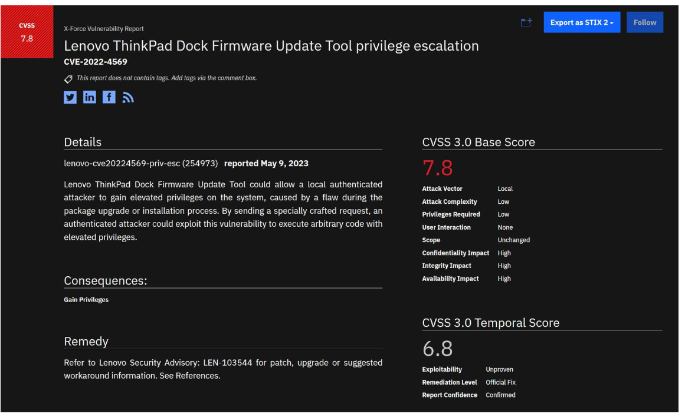

## Este reporte del CVE-2022-4569 es mucho más serio que el anterior. Si bien el de KNIME era una "curiosidad" de información, este es un problema de Escalación de Privilegios.
## Aquí la cosa se pone picante: un atacante que ya tiene un acceso básico a la computadora (por ejemplo, un empleado con permisos limitados) podría aprovechar este fallo para convertirse en Administrador/Root.

* 🔍 2. El Vector de Ataque (Diferencia clave)
A diferencia del anterior, este dice Attack Vector: Local.

* ¿Qué significa? El atacante no puede entrar desde China por Internet directamente. Tiene que tener acceso físico o remoto a la máquina (por ejemplo, a través de otro malware o siendo un usuario de la empresa).

Una vez adentro, envía una "solicitud especialmente diseñada" durante la actualización del firmware y ¡pum!, gana control total.

* 🕒 3. Análisis Temporal (Score: 6.8)
Al igual que el otro, el puntaje baja un poco porque:

Exploitability: Unproven: Todavía no hay un virus "suelto" en la calle que use esto de forma masiva.

Remediation Level: Official Fix: Lenovo ya sacó el parche.

### Report 2: Análisis de Escalación de Privilegios (CVE-2022-4569)
**Producto:** Lenovo ThinkPad Dock Firmware Update Tool

#### 🚨 Análisis de Riesgo Elevado
A diferencia de los casos de divulgación de información, este reporte detalla una vulnerabilidad de **Escalación de Privilegios** con un **Base Score de 7.8**. 

* **El Peligro:** Un atacante local autenticado puede obtener privilegios elevados y ejecutar código arbitrario con total control sobre los tres pilares de la seguridad (**CIA**): Confidencialidad, Integridad y Disponibilidad (todos en **High**).
* **Vector Local:** Aunque requiere acceso al sistema, la baja complejidad (**AC: Low**) y la falta de interacción del usuario (**UI: None**) hacen que, una vez que el atacante está dentro, la escalación sea casi automática.

#### ✅ Acción Recomendada
El reporte tiene una confianza **Confirmed** y existe un **Official Fix** (Lenovo Security Advisory: LEN-103544). La prioridad de actualización para laptops corporativas que usen este dock es **CRÍTICA**.

## ¿La diferencia?

El de KNIME (5.3) era: "Cualquiera puede entrar desde afuera pero se lleva poca cosa".

El de Lenovo (7.8) es: "Solo entra el que ya está adentro, pero si entra, rompe todo".

### 📡 ¿De dónde provienen estos reportes?

La inteligencia de amenazas que analizo en este repositorio proviene de un ecosistema colaborativo global:

* **CVE (Common Vulnerabilities and Exposures):** Identificador único asignado por la organización **MITRE** para estandarizar el reporte.
* **NIST & NVD:** Organismos que validan el impacto técnico y asignan el puntaje de severidad **CVSS**.
* **Vendors (Fabricantes):** Empresas como Lenovo o Microsoft que emiten avisos oficiales y parches de seguridad.
* **IBM X-Force:** Plataforma de agregación que utilizo para centralizar esta inteligencia y agilizar la toma de decisiones.

### ⚖️ Comparativa de Inteligencia: Priorización de Vulnerabilidades

Como analista, la clave no es solo detectar fallos, sino saber cuál parchear primero. A continuación, presento una comparativa técnica de los dos reportes de **IBM X-Force Exchange** analizados:

| Característica | Reporte 1 (CVE-2023-2541) | Reporte 2 (CVE-2022-4569) |
| :--- | :--- | :--- |
| **Producto afectado** | KNIME Business Hub | Lenovo ThinkPad Dock Tool |
| **Severidad (Base Score)** | **5.3 (Medio)** | **7.8 (Alto)** |
| **Vector de Ataque** | **Network** (Remoto) | **Local** (Requiere acceso) |
| **Complejidad / Privilegios** | Baja / Ninguno (Fácil) | Baja / Bajos (Fácil) |
| **Impacto Principal** | Divulgación de Información (IPs) | **Escalación de Privilegios (Admin)** |
| **Tríada CIA afectada** | Solo Confidencialidad (Low) | **Conf., Integridad y Disp. (High)** |
| **Prioridad de Acción** | Monitoreo y actualización programada. | **Remediación Crítica e Inmediata.** |
* 🛠️ ¿Cómo es el "paso a paso" en la vida real?
Cuando ves un reporte de estos, tu cerebro de analista hace este proceso en segundos:

*Inventario*: ¿Tenemos este software o hardware en la empresa? (Ej: ¿Hay docks de Lenovo?).

*Exposición*: Si lo tenemos, ¿quién lo usa? ¿Son los directivos? ¿Es la gente de ventas?

*Priorización*: Mirás el Score CVSS. Si es un 7.8 (Alto) como el de Lenovo, dejás el café y te ponés a trabajar. Si es un 2.0 (Bajo), quizás lo anotás para la semana que viene.

*Remediación*: Buscás el link que dice "Official Fix" en el reporte, bajás el parche y lo instalás en todas las máquinas.

#### 🧠 Conclusión del Analista
La inteligencia de amenazas nos muestra dos escenarios distintos:
1. El caso de **KNIME** es una "puerta entreabierta" por donde cualquiera puede mirar desde afuera. Es un riesgo de reconocimiento.
2. El caso de **Lenovo** es una "llave maestra" que alguien ya dentro de la casa puede usar para abrir todas las cajas fuertes. Aunque el vector es local, el impacto es total sobre el sistema.

## "El monitoreo constante de plataformas como IBM X-Force permite realizar una gestión de vulnerabilidades basada en riesgos. No se trata solo de ver números, sino de entender el contexto: mientras que el CVE-2023-2541 nos advierte sobre fugas de información, el CVE-2022-4569 representa un peligro crítico de control total del sistema. Mi rol como analista es filtrar esta inteligencia para aplicar parches donde el impacto sea mayor."

> **Estrategia Aplicada:** Mi rol como analista es utilizar el **Temporal Score** y el **Impacto en el Negocio** para filtrar el ruido de las alertas y enfocar los recursos de defensa donde el daño potencial sea mayor.

## explicación real :
* Como SOC Nivel 1, tu pantalla principal va a ser el SIEM (como QRadar o Splunk). El SIEM es el que "grita" cuando algo anda mal. Pero para que el SIEM sepa qué es peligroso, necesita alimentarse de esos reportes que estuvimos viendo.

* Mirá cómo funciona la cadena en la vida real:

1. El SIEM (Tu herramienta de monitoreo)
El SIEM recibe millones de datos (logs) de toda la empresa. Pero el SIEM por sí solo no sabe que el proceso lenovo_update.exe es peligroso.

¿Cómo se entera? A través de los Threat Intelligence Feeds. El administrador del SIEM configura que se descarguen automáticamente las bases de datos de IBM X-Force o CISA.

2. La Alerta (Tu "Uh, qué pasó acá")
Cuando el SIEM detecta que una notebook Lenovo está ejecutando ese proceso de actualización y ve un comportamiento raro, te dispara un Alert/Offense.

*Tu tarea:* Ahí es donde entrás vos. Abrís el alerta y ves: "Posible explotación de CVE-2022-4569".

3. Tu investigación (El reporte que analizamos)
Como Analista Nivel 1, tu trabajo es validar si esa alerta es real o un error (Falso Positivo).

*¿Qué hacés?* Te vas a IBM X-Force Exchange (la ficha que me pasaste), leés que el Base Score es 7.8 y que causa Escalación de Privilegios.

*Tu conclusión:* "Che, esto es en serio. Es un riesgo Alto (7.8), el vector es local y el impacto es total sobre la tríada CIA".

4. La Escalación
Ahí es donde hacés el triaje:

"Paso este ticket al Nivel 2 (Incident Response) porque confirmé que este software es vulnerable y el comportamiento en la máquina coincide con el reporte de inteligencia".

### 🖥️ El Rol del Analista SOC y la Inteligencia de Amenazas

En un entorno operativo real, el **SIEM (Security Information and Event Management)** actúa como el sistema de alerta temprana, integrando **Threat Intelligence Feeds** para identificar comportamientos maliciosos. 

Como **Analista SOC Nivel 1**, mi responsabilidad es:
1. **Monitorear:** Observar las alertas generadas por el SIEM.
2. **Investigar:** Utilizar fuentes como **IBM X-Force** para entender la naturaleza de la vulnerabilidad (CVE) detectada.
3. **Validar:** Analizar las métricas CVSS (Base y Temporal) para confirmar la severidad del incidente.
4. **Escalar:** Proveer un informe técnico preciso al equipo de Respuesta a Incidentes para su mitigación.

## Expand for some more thoughts
The summary that you wrote should summarize the current intelligence detailed in the report. IBM X-Force Exchange vulnerability reports provide the following information about a specific vulnerability: 

Date of the report 

Name of the vulnerability 

Description of the vulnerability 

Consequences if a threat actor exploits the vulnerability 

Recommendation for fixing the vulnerability 

Common Vulnerability Scoring System (CVSS) score, an industry-standard vulnerability assessment score that rates vulnerabilities’ severity on a 0–10 scale.
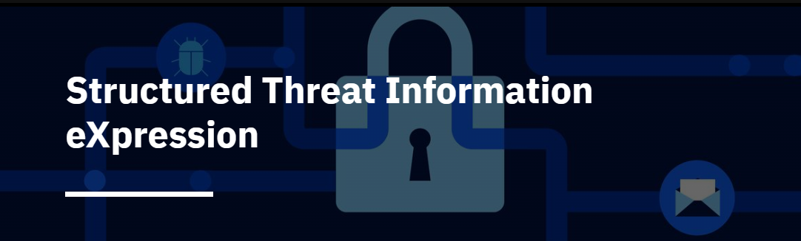
## 🧬 STIX: El Idioma Universal de las Amenazas
*Structured Threat Information eXpression (STIX)* es un lenguaje de programación de código abierto que estandariza cómo se comparte la inteligencia. En lugar de mandar un PDF largo, mandamos "objetos" de código que cualquier software de seguridad entiende.

🧱 ¿Cómo funciona? (La arquitectura de Objetos)
STIX trata cada dato como un bloque de código llamado Objeto. Cada objeto tiene propiedades que lo definen:

Type (Tipo): Define qué es la información (ej: attack-pattern, threat-actor, malware, location).

Name (Nombre): El nombre específico (ej: "Spear Phishing").

Description (Descripción): Detalles técnicos sobre cómo funciona.

🔗 El Poder de las Relaciones
Lo más valioso de STIX no son solo los objetos, sino cómo se conectan. Podés crear un mapa que diga:

El Threat Actor "APT28" (Objeto 1) utiliza el Malware "X-Tunnel" (Objeto 2) para realizar un Attack Pattern de "Exfiltración de datos" (Objeto 3).

### 🤖 STIX: Estandarización y Automatización de Inteligencia

Para gestionar el enorme volumen de datos de amenazas, utilizo el estándar **STIX (Structured Threat Information eXpression)**. Este lenguaje permite que la inteligencia sea "legible por máquinas" (*machine-readable*), facilitando el intercambio entre plataformas de seguridad.

#### Conceptos Clave de STIX:
* **Objetos (SDO):** Bloques de información estandarizados (ej: Atacantes, Campañas, Indicadores).
* **Propiedades:** Atributos que definen al objeto, como su `type` (tipo) y `description`.
* **Interoperabilidad:** Permite que un reporte de **IBM X-Force** se integre automáticamente en un **SIEM** o un **EDR** sin intervención manual.

> **💡 Visión del Analista:** > STIX transforma la narrativa de un ataque en un gráfico de relaciones técnicas. Esto permite que, como analista SOC, pueda visualizar conexiones entre diferentes incidentes y responder de forma mucho más rápida y precisa.

## Common STIX object types

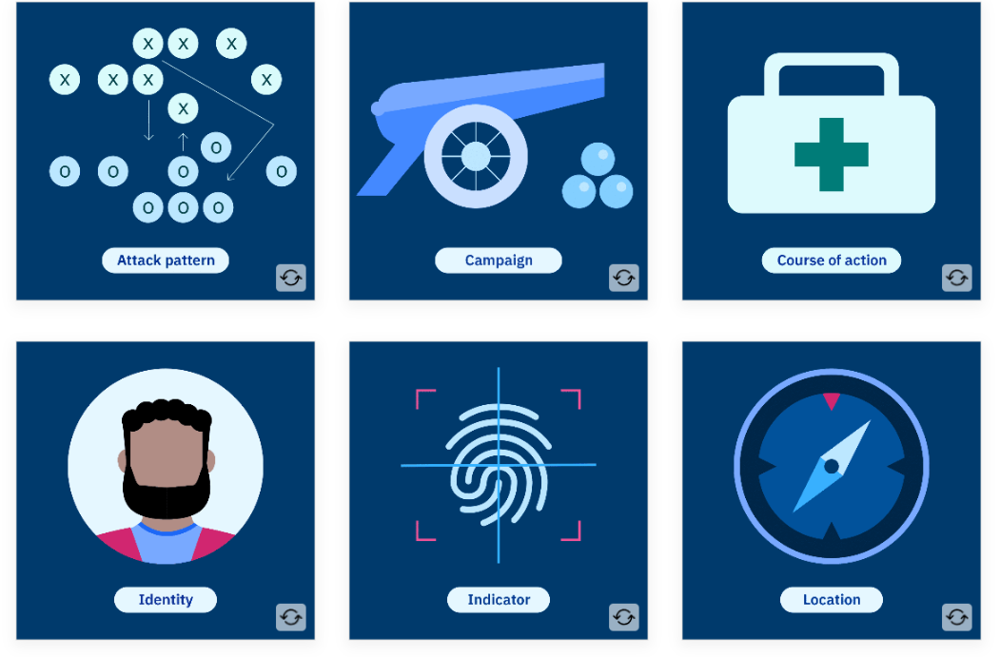
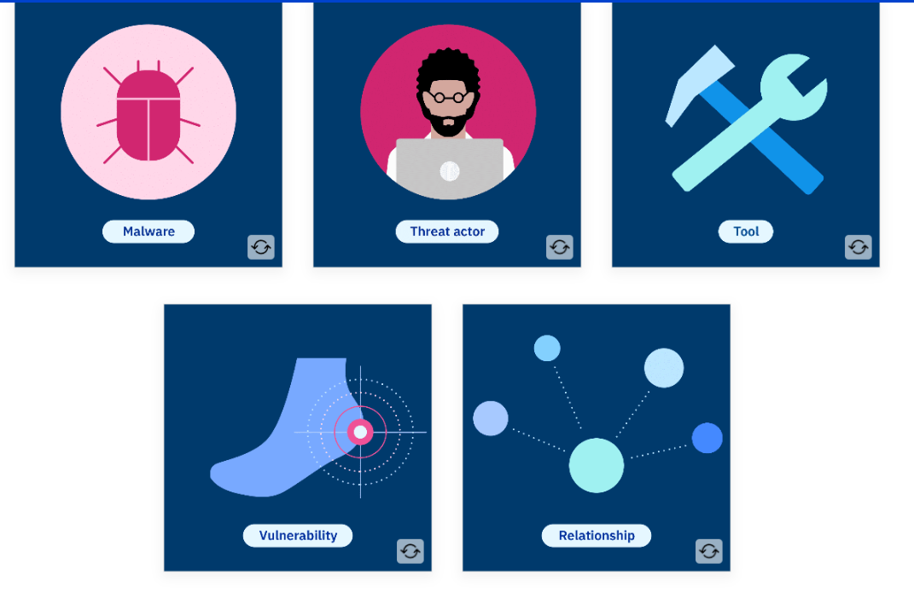

### 🧩 Estructura de Datos STIX: Objetos de Inteligencia

Para estandarizar la comunicación de amenazas, utilizo el framework **STIX**, el cual desglosa la inteligencia en los siguientes objetos clave:

| Objeto | Descripción Técnica |
| :--- | :--- |
| **Attack Pattern** | Tácticas y procedimientos de ataque (TTPs). |
| **Campaign** | Conjunto de ataques coordinados en un tiempo definido. |
| **Course of Action** | Medidas de mitigación y respuesta recomendadas. |
| **Identity / Actor** | Identificación de víctimas o grupos atacantes específicos. |
| **Indicator** | Evidencia técnica (IoCs) que activa las alertas en el SIEM. |
| **Malware / Tool** | Código malicioso o herramientas usadas en la intrusión. |
| **Vulnerability** | Fallos técnicos identificados (CVE) que permiten el ataque. |
| **Relationship** | Conexiones lógicas que dan sentido a la narrativa del ataque. |

> **Nota de Analista:** La potencia de STIX reside en su capacidad de crear un **Grafo de Relaciones**. Al conectar estos objetos, puedo visualizar no solo "qué" pasó, sino "quién" lo hizo, "cómo" lo logró y "qué" debo hacer para frenarlo.


## – Introduction to STIX, OASIS Open  https://oasis-open.github.io/cti-documentation/stix/intro.html

*STIX expressions*

Now that you know some common STIX object types, you’ll discover how to use them in STIX expressions. In programming, an expression is a combination of code components that a program can interpret and use. Every STIX object is an expression consisting of the object’s type and properties. 

STIX expressions come in JavaScript Object Notation (JSON), a standard text-based data format. JSON uses human-readable text that you can easily store and transmit using an automated system. 

Examine this example STIX expression:

{ 

“type”: “indicator”, 

“id”: “indicator--2f54e292-8b64-4495-bc02-6a9198a365e3”, 

“created”: “2022-02-01T08:08:15.000Z”, 

“modified”: “2023-02-15T08:08:15.000Z”, 

“pattern”: “[file:hashes.MD5 = ‘d41d8cd98f00b204e9800998ecf8427e’]”, 

“valid_from”: “2022-03-15T08:08:15.000Z”, 

“labels”: [“malware”], 

“name”: “Empty file MD5 hash”, 

“description”: “Indicates the presence of an empty file with an MD5 hash value of d41d8cd98f00b204e9800998ecf8427e which is a common tactic used by malware authors to evade detection.” 

}

## 💻 Anatomía de una Expresión STIX (Formato JSON)
Cuando exportás un reporte de IBM X-Force (como el botón azul que vimos), lo que descargás es exactamente esto. Vamos a desglosar el ejemplo del Indicator:

*"type":* "indicator": Define que este objeto sirve para detectar algo (una señal de humo).

*"id":* Es el "DNI" único de este objeto en todo el mundo.

*"created" / "modified":* Marcas de tiempo para saber qué tan vieja es la información.

*"pattern":* ¡Esta es la parte más importante! Es la regla técnica. En este caso, dice: "Buscá cualquier archivo cuyo hash MD5 sea d41d8cd98f00b204e9800998ecf8427e".

*"labels":* ["malware"]: Clasifica la amenaza.

*"description":* Explica por qué esto es peligroso (en este caso, un archivo vacío usado por malware para evadir detección).

### 💻 Implementación Técnica: Expresiones STIX en JSON

La inteligencia de amenazas se intercambia mediante archivos **JSON**, lo que permite la automatización entre plataformas de seguridad. A continuación, un ejemplo de cómo se representa un **Indicador (Indicator)** en el estándar STIX 2.1:

```json
{ 
  "type": "indicator", 
  "id": "indicator--2f54e292-8b64-4495-bc02-6a9198a365e3", 
  "name": "Empty file MD5 hash", 
  "pattern": "[file:hashes.MD5 = 'd41d8cd98f00b204e9800998ecf8427e']", 
  "description": "Indica la presencia de un archivo vacío con hash MD5 específico, táctica común para evadir detección." 
}
```

### 🚀 Activity: Analyze a STIX expression


