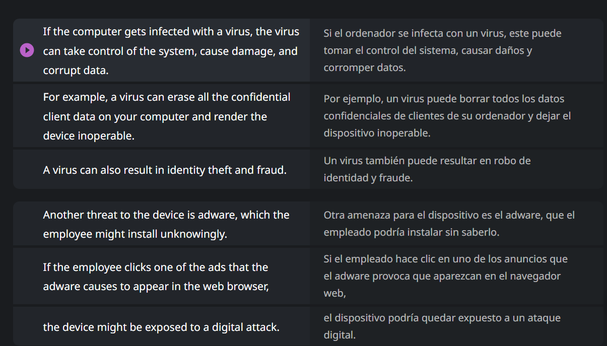
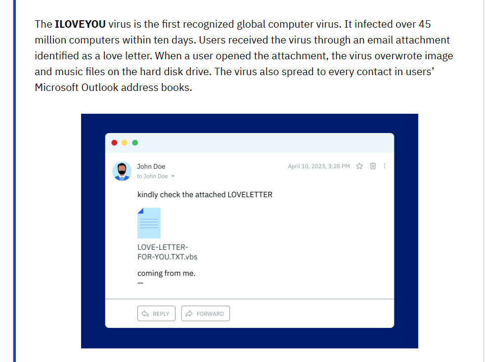
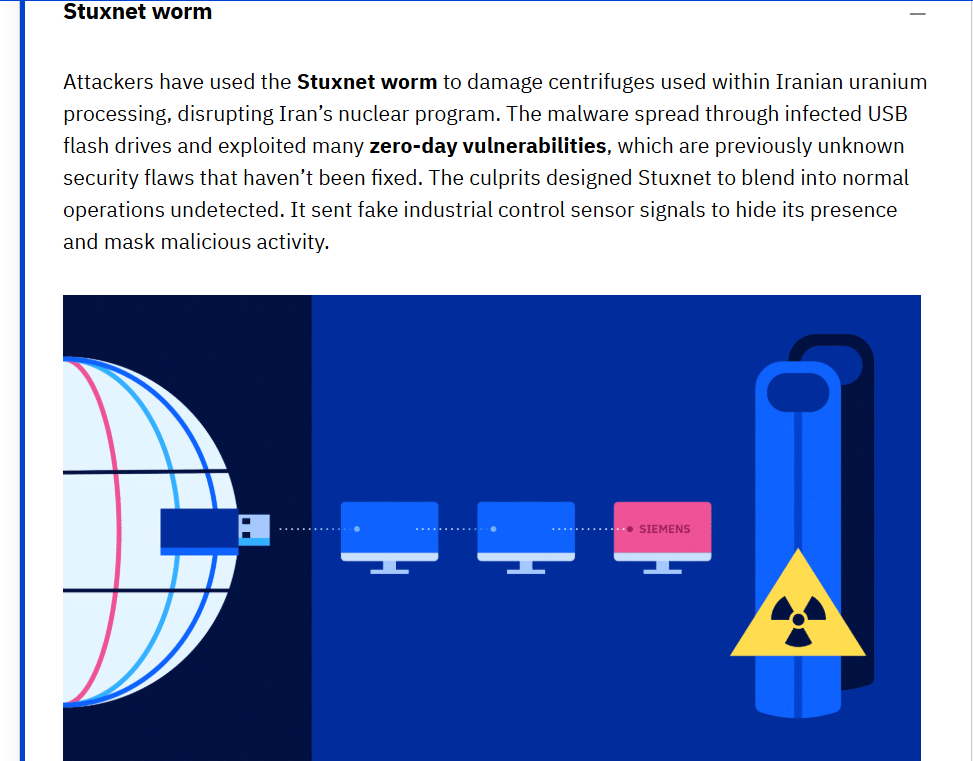
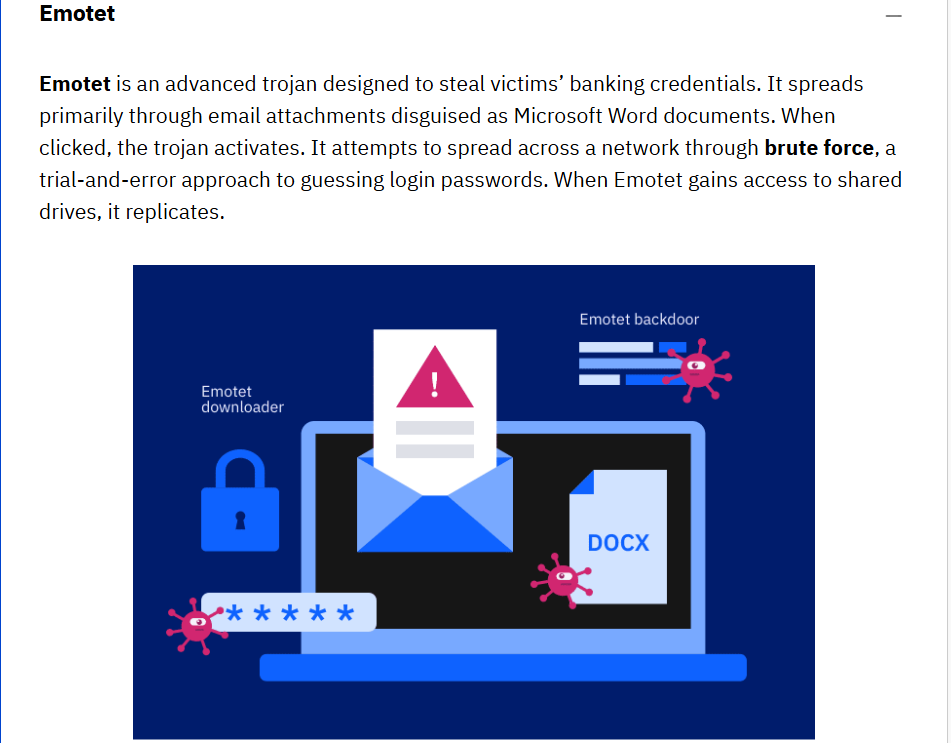
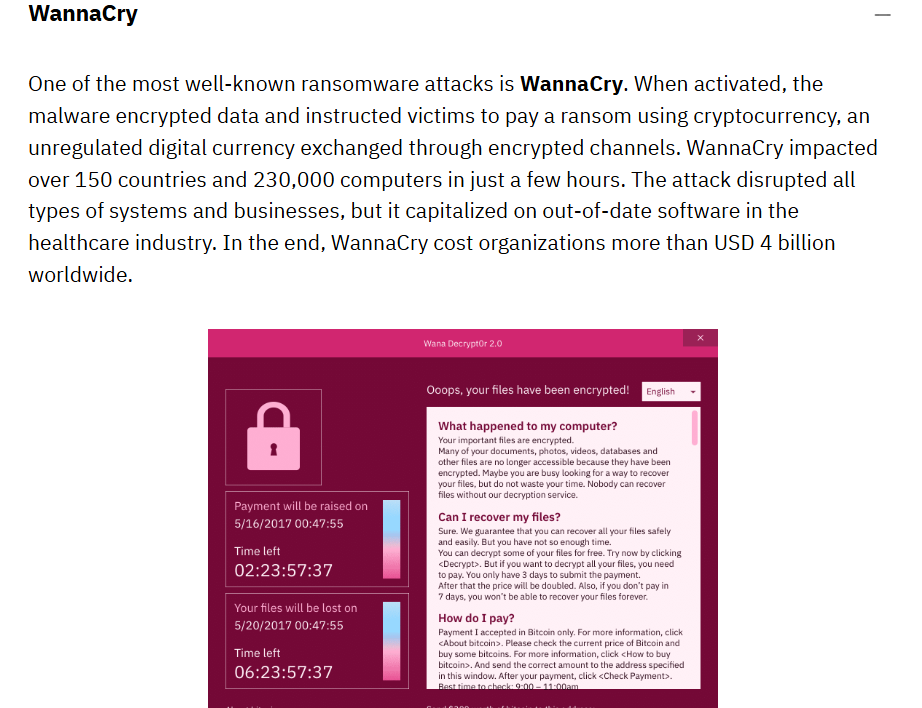
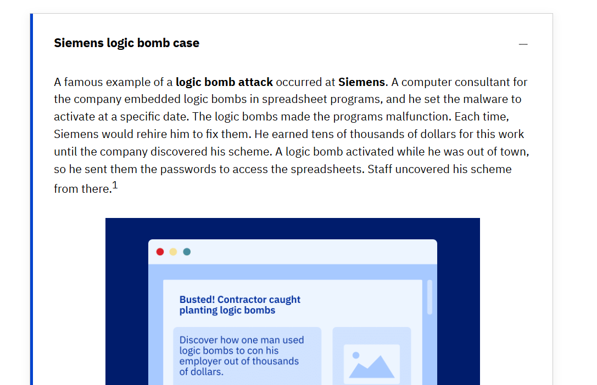
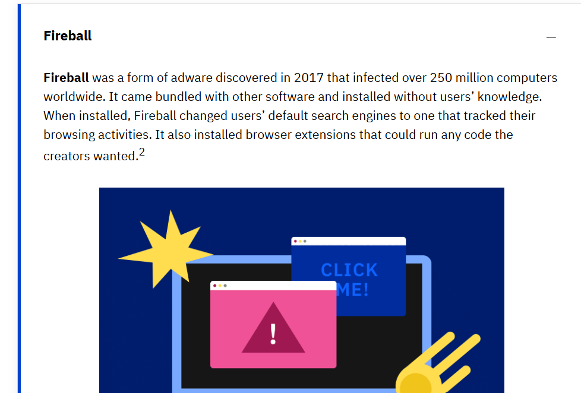
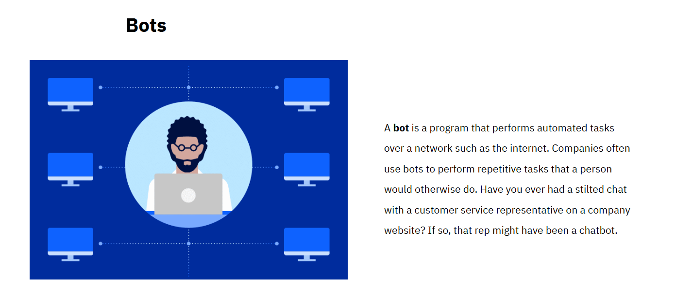

# Microcredencial 2: Gestión de vulnerabilidades 🛡️

En este módulo, exploro las diversas ciberamenazas y las mejores prácticas para combatirlas, enfocándome en la protección de activos y la gestión de riesgos humanos y físicos.

## 🎯 Objetivos de Aprendizaje
Basado en el programa oficial de IBM SkillsBuild:
* **Análisis de Impacto:** Evaluar cómo las ciberamenazas afectan a los sistemas y procesos de una organización.
* **Mitigación de Malware:** Uso práctico de herramientas como Malwarebytes para eliminar virus y amenazas.
* **Ingeniería Social:** Identificación de tácticas de phishing en correos electrónicos.
* **Seguridad Física:** Desarrollo de planes de control para proteger edificios y dispositivos.

---

## 🗒️ Temario y Notas de Estudio

### 1. Tipos de Malware
* **Definición:** Software malicioso diseñado para infiltrarse o dañar un sistema.
* **Práctica:** Ejecución de escaneos de antivirus para detectar y eliminar amenazas comunes.

### 2. Ingeniería Social
* **Concepto:** Explotación de vulnerabilidades en la psicología humana.
* **Phishing:** Análisis de correos fraudulentos y sus características principales para evitar el robo de credenciales.

### 3. Amenazas Físicas y Controles Ambientales
* Protección de activos valiosos (servidores, dispositivos).
* **Controles Físicos:** Diseño de planes de seguridad para el acceso a instalaciones.

---

## 🛠️ Laboratorios Realizados
* [ ] Escaneo de amenazas con Malwarebytes.
* [ ] Análisis de casos de Phishing.
* [ ] Creación de un plan de control de seguridad física.

---

## 🌐 Peligros al Navegar por Internet
Al procesar y compartir información digital, nos exponemos a una gran variedad de ataques diseñados para obtener control o causar daño.

### 🚨 Tipos de Amenazas Digitales
* **Virus:** Cualquier programa que infecta un sistema sin permiso del usuario para ganar control o causar daño.
* **Adware:** Software no deseado diseñado para mostrar anuncios en el navegador, exponiéndonos a ataques maliciosos.
* **Keyloggers:** Herramientas que registran cada tecla presionada, permitiendo el robo de contraseñas, datos médicos y financieros.

### 🛡️ Controles de Seguridad y Soluciones
Para prevenir que estos ataques tengan éxito, se deben implementar diferentes tipos de controles:
* **Basados en Software:** Uso de programas antivirus y bloqueadores de anuncios (ad blockers).
* **Estándares de la Industria:** Implementación de marcos de trabajo como **CIS Controls** y **NIST**.

---
> *“A medida que los atacantes se vuelven más inteligentes, es vital conocer las amenazas y las debilidades que buscan explotar.”*
---

 
### 🦠 El Virus Informático: El riesgo de la interacción
Inspirados en los virus biológicos, estos programas se replican y propagan dañando los sistemas a su paso.

* **Definición:** Malware que se adjunta a archivos o programas legítimos para replicarse y saltar de un dispositivo a otro.
* **El factor humano (Activación):** Los virus **necesitan interacción del usuario** para ejecutarse. No actúan solos; necesitan que alguien "abra la puerta".
* **Vectores de infección comunes:**
    * Archivos adjuntos en correos electrónicos (documentos que parecen inofensivos pero son ejecutables disfrazados).
    * Descargas desde sitios web no confiables.
    * Conexión de dispositivos ya infectados (como pendrives o discos externos) a tu equipo.
* **Impacto y Daño:** * Disrupción de operaciones y alteración de datos críticos.
    * Borrado completo de discos duros.
    * El daño se intensifica exponencialmente a medida que el virus logra replicarse y extenderse por la red.
    

    **Worm (Gusano):** Malware independiente que se propaga automáticamente a través de las redes explotando vulnerabilidades, a diferencia del virus sin necesidad de intervención humana.
    Los gusanos pueden eliminar datos, saturar redes, degradar el rendimiento del hardware e instalar otro software malicioso.

    
---

## ☣️ Caso de Estudio: El Gusano Stuxnet
Stuxnet es uno de los ejemplos más famosos de cómo un malware puede saltar del mundo digital al mundo físico para causar daño real.

### 🔍 ¿Qué fue Stuxnet?
* **Definición:** Un gusano informático extremadamente complejo diseñado para sabotear infraestructuras críticas (específicamente centrífugas de procesamiento de uranio en Irán).
* **Vector de Infección:** Se propagó inicialmente a través de **unidades USB infectadas**, logrando saltar el "Air Gap" (aislamiento de red).
* **Modus Operandi:** * El malware enviaba señales falsas a los sensores de control industrial para ocultar su presencia mientras dañaba físicamente la maquinaria.
    * Fue diseñado para operar de forma totalmente sigilosa y mezclarse con las operaciones normales de la planta.

---

## ⏱️ Vulnerabilidades de Día Cero (Zero-day)
Stuxnet fue revolucionario porque utilizó múltiples vulnerabilidades de este tipo al mismo tiempo.

* **Concepto:** Son fallos de seguridad en un software o hardware que son previamente desconocidos por el fabricante.
* **El Riesgo:** Como el fabricante aún no conoce la debilidad, **no existe un parche o actualización** disponible para arreglarla.
* **Ataque de Día Cero:** Ocurre cuando un atacante descubre y explota esta vulnerabilidad antes de que el desarrollador tenga oportunidad de crear una defensa.

---
**Trojan (Troyano):** Se disfraza de software legítimo y útil para engañar al usuario. Su objetivo suele ser crear "puertas traseras" (backdoors) para el atacante.
Los atacantes disfrazan los troyanos como programas o archivos benignos, como juegos, fondos de pantalla u otras descargas.
Cuando ejecutas el troyano, el atacante puede controlar tu ordenador de forma remota, robar datos, espiar tu actividad, instalar malware,o realizar otras acciones maliciosas.
Y al igual que los gusanos, algunos troyanos no requieren la interacción del usuario para ejecutarse.

***

## 🐎 Troyanos (Trojans): El engaño como arma
A diferencia de los virus, los troyanos no se replican por sí mismos; utilizan el engaño para que el usuario les permita la entrada al sistema.

### 🔍 Caso de Estudio: Emotet
**Emotet** es un troyano avanzado diseñado originalmente para robar credenciales bancarias.

* **Vector de ataque:** Se propaga mediante archivos adjuntos de correo electrónico disfrazados de documentos de Microsoft Word.
* **Activación:** El malware se activa en cuanto el usuario hace clic en el archivo adjunto.
* **Persistencia:** Una vez dentro, utiliza ataques de **fuerza bruta** para adivinar contraseñas y propagarse por la red hacia unidades compartidas.

### 🔑 Concepto: Ataque de Fuerza Bruta (Brute Force)
* **Definición:** Es un método de "ensayo y error" donde el atacante intenta adivinar contraseñas o credenciales probando múltiples combinaciones hasta encontrar la correcta.
* **Uso en Emotet:** Sirve para ganar acceso a otros equipos y servidores dentro de la misma red una vez que el troyano inicial ha infectado una máquina.
###
## 🔒 Ransomware: El secuestro de datos
El Ransomware es un tipo de malware que toma como "rehén" a un sistema o a sus datos, restringiendo el acceso hasta que se pague un rescate.

### 🧠 Tácticas de Ataque y Psicología
Este malware es altamente efectivo porque utiliza el **miedo y el pánico** del usuario mediante mensajes alarmantes:
* **Falsas alertas de virus:** "Tu dispositivo tiene un virus. Para eliminarlo, haz clic aquí".
* **Amenazas de cifrado:** "Tus archivos están cifrados. Paga el rescate en menos de 48 horas para recuperar el acceso".

> **Nota Crítica:** A veces, el mensaje es un truco inicial; el malware puede no estar instalado hasta que el usuario interactúa con la alerta.

### ⚠️ Consecuencias y Recuperación
* **Complejidad:** La recuperación es tan difícil que suele requerir especialistas en recuperación de datos.
* **Sin garantías:** Pagar el rescate **no garantiza** que el atacante devuelva el acceso a los archivos.

### 😷 Caso de Estudio: WannaCry (El Ransomware Global)
WannaCry es uno de los ataques de ransomware más devastadores de la historia, destacando la importancia de mantener los sistemas actualizados.

* **Impacto Global:** En tan solo unas pocas horas, afectó a más de **150 países** y **230,000 computadoras**.
* **Modus Operandi:** * Una vez activado, cifraba los datos del usuario.
    * Instruía a las víctimas a pagar un rescate utilizando **criptomonedas** (monedas digitales no reguladas) para dificultar el rastreo del dinero.
* **El factor clave (Software desactualizado):** El ataque capitalizó vulnerabilidades en software antiguo, ensañándose particularmente con la **industria de la salud** (hospitales).
* **Costo Económico:** Se estima que WannaCry costó a las organizaciones más de **4 mil millones de dólares** en todo el mundo.

> **Lección de Seguridad:** La mayoría de las infecciones se habrían evitado si los sistemas hubieran tenido los parches de seguridad al día. Esto demuestra que la "Gobernanza" (gestión de actualizaciones) es una barrera técnica vital.

## 💣 Bomba Lógica (Logic Bomb)
Una bomba lógica es un código malicioso que permanece inactivo en un sistema hasta que se cumple una condición o evento específico para "detonarse".

### ⚙️ ¿Cómo funciona?
A diferencia de los virus o gusanos que atacan de inmediato, la bomba lógica espera un disparador (trigger):
* **Condición de tiempo:** Una fecha o hora específica (por ejemplo, el viernes 13 o el inicio de un nuevo año).
* **Condición de acción:** Que un usuario realice una tarea específica, como abrir un programa determinado o borrar un archivo.
* **Condición de ausencia:** Se puede programar para que se active si un empleado deja de ingresar su código (común en casos de "venganza" de empleados descontentos).

### ⚠️ Impacto y Peligro
* **Saboteo:** Puede borrar bases de datos completas, corromper archivos o apagar sistemas críticos de forma repentina.
* **Dificultad de Detección:** Al no realizar actividades sospechosas hasta su activación, puede pasar desapercibida por mucho tiempo para los antivirus tradicionales.

💣 Caso de Estudio: La Bomba Lógica en Siemens
Este caso demuestra que el malware también puede ser utilizado por empleados o consultores para crear una necesidad artificial de sus servicios.

El Incidente: Un consultor de programación externo para Siemens ocultó bombas lógicas dentro de programas de hojas de cálculo (spreadsheets) que él mismo había desarrollado para la empresa.

Modus Operandi: * Programó el malware para que se activara en fechas específicas, causando que los programas fallaran sistemáticamente.

Cada vez que los programas fallaban, la empresa lo volvía a contratar para "reparar" el problema.

Gracias a este esquema de engaño, el consultor ganó decenas de miles de dólares durante años.

Cómo fue descubierto: Una de las bombas se detonó mientras el consultor estaba fuera de la ciudad por otro motivo. Al no estar disponible para "arreglarlo", tuvo que proporcionar las contraseñas de acceso a los empleados de planta de Siemens, quienes al revisar el código descubrieron las instrucciones maliciosas ocultas.

Lección de Ciberseguridad: Este caso resalta la importancia de la Revisión de Código y el principio de Mínimo Privilegio. No se debe confiar ciegamente en el software proporcionado por terceros sin auditorías de seguridad, especialmente si tienen el control total del código 
### 🕵️ Spyware: El espía silencioso
# El Spyware es un software diseñado para recopilar datos de un dispositivo y enviarlos a un tercero sin que el usuario se dé cuenta.

🔍 Características y Funciones
Sigilo total: A diferencia del Ransomware, el Spyware no quiere que sepas que está ahí; su valor reside en permanecer oculto el mayor tiempo posible.

Recopilación de datos: Puede capturar historial de navegación, correos electrónicos y datos personales.

Keyloggers: Un tipo común de spyware que registra cada tecla que presionas, permitiendo a los atacantes robar contraseñas y números de tarjetas de crédito.

⚠️ Caso de Estudio: Pegasus
¿Qué es?: Uno de los spywares más sofisticados del mundo, desarrollado por NSO Group.

Impacto: Se hizo famoso por infectar teléfonos de periodistas, activistas y políticos de alto nivel.

Capacidad: Puede activar el micrófono, la cámara y leer mensajes de aplicaciones cifradas como WhatsApp sin que el usuario haga clic en ningún enlace (ataques de "clic cero").uente.

### 🕵️ Caso de Estudio: Dark Hotel (Keylogger & Wi-Fi)
Este ataque demuestra que incluso una red de hotel que solicita número de habitación y apellido puede ser una trampa para el espionaje corporativo.

* **El Método:** Los atacantes comprometen las redes Wi-Fi de hoteles de lujo para atacar a objetivos específicos (ejecutivos, periodistas).
* **El Engaño:** Al conectar el dispositivo, el usuario recibe una notificación para descargar una "actualización crítica" de software legítimo.
* **La Carga Útil (Keylogger):** El archivo descargado registra cada pulsación de tecla, permitiendo el robo de contraseñas, correos y datos bancarios.
* **Sigilo:** El programa está diseñado para autodestruirse después de recolectar una cantidad específica de datos, eliminando rastros antes de ser detectado.

---

## 🛡️ Tips de Seguridad: Viajero Seguro
Para evitar ataques como Dark Hotel o el robo de datos en tránsito, sigue estas prácticas:

1. **Uso de VPN:** Cifra siempre tu conexión cuando utilices redes Wi-Fi públicas o de hoteles.
2. **Desconfiar de Actualizaciones:** Nunca descargues actualizaciones de software mientras estés conectado a una red que no sea la de tu hogar u oficina.
3. **Autenticación de Dos Factores (2FA):** Incluso si un Keylogger roba tu contraseña, el 2FA evitará que el atacante entre a tus cuentas.
4. **Olvidar Redes:** Configura tu dispositivo para que no se conecte automáticamente a redes Wi-Fi abiertas.

## 📢 Adware (Advertising-supported Software)
El adware es software diseñado para mostrar anuncios no deseados de forma automática en tu dispositivo.

### 🔍 Características Principales
* **Propósito:** Generar ingresos para el desarrollador mediante la visualización de publicidad (pop-ups, banners o redirecciones en el navegador).
* **Método de entrada:** Suele venir "empaquetado" con software gratuito (freeware) o programas descargados de sitios no oficiales.
* **Comportamiento:** * Cambia la página de inicio del navegador sin permiso.
    * Muestra anuncios emergentes incluso cuando no estás navegando.
    * Puede ralentizar el rendimiento del sistema y consumir ancho de banda.

### ⚠️ El riesgo oculto: Malvertising
Aunque el adware suele ser solo molesto, puede cruzar la línea hacia el peligro real:
1. **Rastreo:** Puede actuar como un spyware básico, recolectando tu historial de búsqueda para "personalizar" los anuncios.
2. **Puerta de enlace:** Algunos anuncios pueden contener scripts maliciosos que instalan otros tipos de malware (como troyanos o ransomware) si haces clic en ellos.

### 🛠️ Prevención
* Utilizar bloqueadores de anuncios (**Ad-blockers**).
* Leer cuidadosamente los pasos de instalación de programas gratuitos para desmarcar "software adicional".
* Realizar escaneos periódicos con herramientas como **Malwarebytes**.

### 📦 Caso de Estudio: Fireball (Adware Masivo)
Descubierto en 2017, Fireball demostró que el adware puede ser una herramienta de espionaje y control a nivel global.

Escala del Ataque: Infectó a más de 250 millones de computadoras en todo el mundo.

Método de Infección: Se distribuía "empaquetado" (bundled) con otros programas de software legítimos e instalándose sin que el usuario se diera cuenta.

Acciones Maliciosas:

Secuestro del Navegador: Cambiaba el motor de búsqueda predeterminado por uno controlado por los atacantes para rastrear toda la actividad de navegación.

Ejecución de Código: Instalaba extensiones en el navegador capaces de ejecutar cualquier código que los creadores desearan, convirtiendo el equipo en una puerta abierta para otros malware.
####
### 🍪 Nota Técnica: Adware y el Rastreo de Cookies
Muchos tipos de Adware (como Fireball) no se limitan a mostrar anuncios; actúan como "espías comerciales" para monetizar tu actividad.

* **Perfilamiento de Usuario:** El adware recolecta cookies para rastrear hábitos de navegación y búsquedas, creando un perfil detallado que se vende a terceros.
* **Secuestro de Sesión (Session Hijacking):** En versiones avanzadas, si el adware roba una cookie de sesión activa, un atacante podría acceder a cuentas privadas sin necesidad de contraseña.
* **Extensiones Maliciosas:** Al instalar extensiones sin consentimiento, el adware puede leer y modificar datos de los sitios que visitas, comprometiendo toda tu privacidad.

> **🛡️ Tip de Seguridad:** Para mitigar este riesgo, es fundamental realizar limpiezas periódicas de cookies y utilizar bloqueadores de rastreo (trackers) en el navegador.

