## Módulo 11: Respuesta a Incidentes

### Acerca de este módulo

Nadie puede prevenir todos los ataques cibernéticos. La seguridad de un sistema realmente radica en **qué tan bien la organización puede responder a un ataque cuando ocurre**.

Esta respuesta incluye:

- **Detener** un ataque en curso
- **Reparar y restaurar** el sistema
- **Analizar ataques** para aprender de ellos y mejorar el sistema antes de que llegue el próximo ataque

Te damos la bienvenida al módulo de **Respuesta a Incidentes**.

#### En este módulo aprenderás:

- Las **fases de respuesta a incidentes**
- Las **responsabilidades del equipo de respuesta a incidentes**
- Los **planes de respuesta a incidentes** y cómo crear uno sólido
- El **análisis de intrusiones** y cómo un marco de análisis de intrusiones te ayuda a planificar la respuesta al enseñarte a **pensar como un atacante**

### Objetivos de aprendizaje

Luego de completar este módulo, deberías ser capaz de:

- **Aplicar un marco de respuesta a incidentes adecuado** en función de las necesidades de una organización
- **Identificar las funciones del equipo de respuesta a incidentes**
- **Aplicar el marco MITRE ATT&CK**
- **Aplicar el marco Cyber Kill Chain**
- **Responder a un ataque de red**

### Acerca de esta lección: Descripción general de la respuesta a incidentes

Los ciberataques siguen ocurriendo. Independientemente de cuántas precauciones y protecciones contengan las redes, **algunos ataques inevitablemente pasan por sus defensas**.

> Los administradores de TI deben entender que un **ataque ocurrirá en algún momento** y considerar qué hacer cuando eso suceda.

#### En esta lección aprenderás:

- **Qué tipo de ataques** pueden ocurrir
- **Qué pasos** pueden tomar los administradores para **detener un ataque** y **mitigar sus efectos**
- Cómo las organizaciones pueden **recuperarse** de un ataque
- **Qué pueden aprender** de un ataque

### Visión general: Respuesta a incidentes

#### El escenario

Es una mañana tranquila, hasta que empiezan a llegar alertas sobre **accesos no autorizados** y **descargas no autorizadas**. ¡Los atacantes obtuvieron acceso a tu red! Es una emergencia que nadie quiere ver: una **filtración de datos**.

---

#### ¿Qué es un plan de respuesta a incidentes?

Un **plan de respuesta a incidentes** es un conjunto de **acciones y responsabilidades** para aplicar en caso de un incidente de ciberseguridad.

> Los analistas y otros miembros del equipo elaboran el plan **antes** de que se necesite, para que esté listo para una respuesta rápida.

---

#### Pasos de la respuesta a incidentes (según el video)

| Paso | Acción | Propósito |
|------|--------|-----------|
| **1** | Activar el equipo de respuesta a incidentes | Enviar mensaje de emergencia a todos los miembros |
| **2** | Revisar el plan | Cada miembro encuentra sus tareas asignadas |
| **3** | **Aislar** los sistemas afectados | Desconectarlos de la red para evitar más daños |
| **4** | **Deshabilitar** cuentas comprometidas | Forzar cambios de contraseña |
| **5** | **Analizar** sistemas afectados | Determinar el alcance de la violación |
| **6** | **Recopilar evidencia** | Archivos de registro para entender el alcance e identificar atacantes |
| **7** | **Erradicar** el malware | Eliminar software malicioso de sistemas afectados |
| **8** | **Restaurar** sistemas | Usar copias de seguridad para reparar datos dañados |
| **9** | **Actualizar defensas** | Firewalls, sistemas de detección de intrusiones |
| **10** | **Comunicar** a empleados | Actualizar sobre el estado y orientar sobre cómo evitar incidentes futuros |
| **11** | **Evaluar** procesos existentes | Identificar áreas de mejora |

---

#### Causa del incidente

> *"Descubres que la violación ocurrió por una **vulnerabilidad en un sistema** causada por un **malware que descargó un usuario desprevenido**."*

---

#### Beneficio de tener un plan

> *"Los ataques son estresantes, pero la **respuesta inteligente y organizada** ante incidentes reduce la preocupación y la posibilidad de **errores en la toma de decisiones** en el momento en que ocurren los ataques."*

---

#### En general

Todos están muy agradecidos de tener un plan listo cuando fue necesario. El equipo sigue el plan paso a paso:

1. **Aislar** sistemas afectados
2. **Erradicar** el malware
3. **Restaurar** sistemas (usando copias de seguridad)
4. **Actualizar** defensas
5. **Evaluar** procesos para mejorar

### ¿Qué es la respuesta a incidentes?

Los incidentes de ciberseguridad pueden ocurrir en **cualquier organización**, incluso con medidas preventivas estrictas. El riesgo hace que la **respuesta a incidentes (IR)** sea esencial para el programa de tecnologías de la información (TI) de cualquier organización.

#### Definición

La **respuesta a incidentes (IR)** comprende el **conjunto de acciones** que realiza una organización para:

| Acción | Propósito |
|--------|-----------|
| **Preparar** | Estar listos antes de que ocurra un ataque |
| **Detectar** | Identificar cuándo ocurre un ataque |
| **Detener** | Contener y erradicar la amenaza |
| **Reparar** | Arreglar cualquier daño causado por el ataque |
| **Recopilar datos** | Aprender para prevenir ataques similares en el futuro |

#### Beneficios de la respuesta a incidentes

- **Reduce el daño** que causan los incidentes
- **Produce información** que puedes emplear para prevenir o manejar incidentes similares en el futuro

#### Naturaleza continua

> La IR puede responder a un **solo evento**, pero a nivel global es un **proceso continuo** que presenta:
> - **Aprendizaje continuo** para descubrir cómo proteger mejor a la organización
> - **Avances** para poner ese conocimiento a trabajar

### Marcos de respuesta a incidentes

¿Cómo comienzan las organizaciones a recopilar toda la información necesaria para un plan integral de respuesta a incidentes? Afortunadamente, comienzan con un **marco de respuesta a incidentes establecido**.

#### ¿Qué es un marco de respuesta a incidentes?

Un **marco de respuesta a incidentes** proporciona una **estructura** para respaldar las operaciones de respuesta a incidentes.

| Característica | Descripción |
|----------------|-------------|
| **Proporciona orientación** | Sobre **qué** se debe hacer (no sobre **cómo** se hace) |
| **Flexible** | Permite agregar o eliminar elementos según sea necesario para satisfacer las necesidades de cada organización |

---

#### ¿Por qué es importante elegir el marco adecuado?

> Identificar el **mejor marco** garantiza que una organización esté preparada para el éxito.

El mejor marco:
- Aborda las **necesidades** de una organización
- Se puede aplicar **fácilmente** en todas las operaciones

---

#### El marco NIST

**¿Qué es el NIST?**  
El **National Institute of Standards and Technology (NIST)** es una agencia operada por el **Departamento de Comercio de Estados Unidos** que proporciona estándares y recomendaciones para muchos sectores tecnológicos.

**¿Qué desarrolló?**  
El NIST desarrolló la **Guía de manejo de incidentes de seguridad informática** como marco de respuesta a incidentes.

> Aunque el marco NIST es **popular** y se considera el **estándar líder**, los equipos pueden elegir otro marco y adaptarlo a las necesidades de su organización.

---

#### Beneficio de un marco común

Un marco de respuesta a incidentes **armoniza** el plan de respuesta en una red más amplia de personas.

**Ejemplo:** Una gran corporación multinacional podría tener centros distribuidos en todo el mundo. Adoptar un **marco común** permite a los empleados trabajar junto con colegas de todo el mundo.

---

### Resumen

| Concepto | Explicación |
|----------|-------------|
| **Marco IR** | Estructura que guía **qué** hacer en respuesta a incidentes |
| **NIST** | Agencia de EE.UU. que creó el marco IR más popular |
| **Flexibilidad** | Los marcos se pueden adaptar a cada organización |
| **Beneficio clave** | Armoniza la respuesta entre equipos globales |

1. ¿El marco es lo mismo que "respuesta a incidentes (IR)"?
NO exactamente. Son conceptos relacionados pero diferentes:

## Concepto	Explicación
Respuesta a incidentes (IR)	Es el conjunto de acciones que hacés cuando ocurre un ataque (detectar, contener, erradicar, recuperar). Es lo que hacés.
Marco de respuesta a incidentes	Es la estructura o guía que te dice cómo organizar esas acciones. Es cómo lo hacés (el método, los pasos, las fases).
Analogía fácil:

## Concepto	Analogía
Respuesta a incidentes (IR)	Apagar un incendio (las acciones: agarrar el matafuegos, llamar a los bomberos, evacuar)
Marco de IR	El protocolo del cuartel de bomberos (qué hace cada uno, en qué orden, quién manda, cómo se comunica)
Resumen: La IR son las acciones. El marco es la estructura que organiza esas acciones.

2. ¿El marco más popular/líder es el NIST?
✅ SÍ. El marco del NIST (National Institute of Standards and Technology, EE.UU.) es el más popular y considerado el estándar líder para respuesta a incidentes.

El NIST divide la respuesta a incidentes en 4 fases:

Fase	Acciones
1. Preparación	Tener el plan, el equipo, las herramientas
2. Detección y análisis	Identificar que ocurrió un incidente
3. Contención, erradicación y recuperación	Detener el ataque, eliminar la amenaza, restaurar sistemas
4. Actividad posterior	Aprender y mejorar para el futuro
3. ¿El marco es como la ISO 27001?
✅ Excelente analogía. Sí, es una idea similar, pero con un enfoque diferente:

## Concepto	Enfoque	¿Para qué sirve?
ISO 27001	Sistema de Gestión de Seguridad de la Información (SGSI)	Es un marco general para implementar, mantener y mejorar la seguridad de la información en toda la organización (preventivo + correctivo).
NIST (para IR)	Respuesta a incidentes	Es un marco específico para saber qué hacer cuando ya ocurrió un ataque (reactivo).
Analogía final:

## Concepto	Analogía
ISO 27001	El manual de construcción de una casa (cimientos, paredes, techos, instalaciones eléctricas) → todo el edificio
NIST (IR)	El protocolo de evacuación en caso de incendio → situación de emergencia específica
En resumen:

* ISO 27001 → marco general de seguridad (previene, gestiona, mejora)

* NIST (IR) → marco específico para respuesta a incidentes (qué hacer cuando falla la prevención).

### Fases de respuesta a incidentes

#### Punto de partida: Identificar la superficie de ataque

El proceso de IR comienza con la **identificación de una superficie de ataque**. Este análisis ayuda a **priorizar las áreas más vulnerables y críticas** que requieren una supervisión y protección sólidas.

##### ¿Qué es una superficie de ataque?

Una **superficie de ataque** abarca **todos los puntos** de los componentes de un sistema, los puntos de acceso y otros lugares donde un atacante puede intentar:

- **Extraer datos** del sistema
- **Ingresar** al sistema
- **Afectar** el sistema

> Comprender y mapear exhaustivamente la superficie de ataque permite priorizar las defensas.

---

#### El flujo de la respuesta a incidentes

A continuación, el equipo:

1. **Evalúa la gravedad** de un ataque
2. **Desarrolla una estrategia de priorización** de amenazas
3. **Investiga y mitiga** el ataque
4. **Restaura las operaciones**
5. **Toma medidas preventivas** para reducir la posibilidad de que se repita

---

#### Las 4 fases principales de respuesta a incidentes

Los equipos suelen realizar las tareas de respuesta a incidentes en **cuatro fases principales**:

| Fase | Descripción |
|------|-------------|
| **1. Preparación** | Establecer el plan, el equipo, las herramientas y los procedimientos antes de que ocurra un incidente |
| **2. Detección y análisis** | Identificar que ha ocurrido un incidente, analizar alertas y determinar el alcance |
| **3. Contención y erradicación** | Detener la propagación del ataque y eliminar la amenaza de los sistemas afectados |
| **4. Recuperación** | Restaurar los sistemas a su estado normal y asegurar que la amenaza haya sido completamente eliminada |

---

### 📊 Diagrama del Proceso de Respuesta a Incidentes (IR)


### Resumen de cada fase

| Fase | Actividades clave |
|------|-------------------|
| **Preparación** | - Crear plan de respuesta a incidentes<br>- Formar equipo IR<br>- Implementar herramientas de monitoreo<br>- Realizar capacitaciones y simulacros |
| **Detección y análisis** | - Monitorear alertas (SIEM, EDR, etc.)<br>- Analizar indicadores de compromiso (IOCs)<br>- Determinar alcance y gravedad<br>- Priorizar incidentes |
| **Contención y erradicación** | - Aislar sistemas afectados<br>- Deshabilitar cuentas comprometidas<br>- Eliminar malware y amenazas<br>- Parchear vulnerabilidades |
| **Recuperación** | - Restaurar sistemas desde backups<br>- Verificar que la amenaza fue erradicada<br>- Reincorporar sistemas a la red<br>- Monitorear para detectar reinfección |

---

> **Nota:** El marco más popular para estas 4 fases es el del **NIST** (National Institute of Standards and Technology).

### Actividad: Fase 1 - Preparación (HealthGuard Medical Services)

#### Antecedentes

HealthGuard Medical Services es un proveedor líder de servicios médicos (telesalud y citas en línea). El equipo de TI implementó múltiples medidas de preparación:

| Medida de preparación | Propósito |
|----------------------|-----------|
| Programa regular de parches | Abordar vulnerabilidades conocidas con prontitud |
| Autenticación multifactor (MFA) | Evitar el acceso no autorizado |
| Sistema de detección de intrusiones (IDS) | Monitorear tráfico y detectar posibles amenazas |
| Pruebas de simulación de phishing | Capacitar a empleados para identificar y evitar emails de phishing |
| Plan de copia de seguridad y recuperación ante desastres | Restaurar datos críticos de forma rápida y segura |

#### Elementos clave de la Fase de Preparación

Según el módulo, la preparación incluye:

- **Evaluación de riesgos** (monitoreo de la superficie de ataque)
- **Seguridad del host** (configuración de dispositivos, listas de control de acceso)
- **Seguridad de la red** (perímetro configurado para rechazar actividad no permitida)
- **Prevención de malware** (software antimalware, limpieza de sistemas)
- **Concientización y capacitación de usuarios** (prácticas seguras, políticas actualizadas)

#### Política de respuesta a incidentes

La política debe incluir:

1. Estructura del equipo de respuesta a incidentes
2. Funciones y responsabilidades de los miembros
3. Medios, herramientas y recursos para identificar y recuperar datos
4. Pruebas de políticas (quiénes son responsables)
5. Plan de acción para ejecutar la respuesta de principio a fin

### Fase 1: Preparación - Prevención vs. Respuesta

#### La distinción clave

| Concepto | Acciones | Cuándo |
|----------|----------|--------|
| **Prevención** | Parches, MFA, firewalls, capacitación | **Antes** del ataque |
| **Respuesta a incidentes (IR)** | Detener, contener, erradicar, recuperar | **Durante/después** del ataque |

#### ¿Por qué la Fase 1 de IR incluye prevención?

Porque el **marco NIST** define la **Preparación** como la primera fase de la respuesta a incidentes. Esta fase incluye:

1. **Medidas de prevención** (para reducir la cantidad de incidentes)
2. **Medidas de preparación** (para estar listos cuando ocurran)

El equipo de IR **no es dueño de toda la prevención**, pero **tiene interés en reducir incidentes** y en **estar listo** para cuando ocurran.

#### Ejemplo: HealthGuard Medical Services

| Acción | Tipo | ¿Por qué está en Fase 1? |
|--------|------|-------------------------|
| Parches regulares | Prevención | Reduce vulnerabilidades (menos incidentes) |
| Autenticación multifactor | Prevención | Evita accesos no autorizados |
| Plan de backups y recuperación | **Preparación IR** | Permite recuperar datos durante un incidente |
| Capacitación anti-phishing | Prevención | Empleados más alerta |

> **Conclusión:** La Fase 1 mezcla prevención y preparación. La prevención NO es respuesta a incidentes, pero es una actividad preparatoria que el equipo de IR promueve para reducir la carga de trabajo.

### El rol del equipo de IR en la preparación

El equipo de **Respuesta a Incidentes (IR)** no ejecuta toda la seguridad, pero cumple un rol clave:

| Función | Descripción |
|---------|-------------|
| **Guían** | Establecen las políticas y procedimientos de seguridad |
| **Asesoran** | Recomiendan medidas de prevención a TI y otros equipos |
| **Coordinan** | Trabajan con TI para implementar controles |
| **Responden** | Activan el plan cuando ocurre un incidente real |

#### En el caso de HealthGuard:

| Acción | ¿Quién la ejecuta? | ¿Quién la guía/asesora? |
|--------|-------------------|------------------------|
| Parches regulares | Equipo de TI | Equipo de IR |
| Autenticación multifactor | Equipo de TI | Equipo de IR |
| Detección de intrusiones (IDS) | Equipo de TI | Equipo de IR |
| Pruebas de phishing | Equipo de TI | Equipo de IR |
| Plan de backup y recuperación | **Equipo de IR** | Equipo de IR |

> **Conclusión:** El equipo de IR **guía y asesora** sobre prevención, pero **ejecuta y coordina** la respuesta activa durante un incidente.

## Fase 2: Detección y Análisis

En esta fase se reconoce que, independientemente de las medidas preventivas implementadas, los incidentes de seguridad pueden ocurrir. Por ello, es fundamental detectarlos y analizarlos rápidamente para minimizar su impacto en los sistemas y usuarios.

Actualmente, el uso de herramientas de detección de amenazas es común en los entornos tecnológicos. Sin embargo, si estas soluciones no están correctamente adaptadas a la organización, pueden no identificar amenazas emergentes. Por esta razón, contar con un plan detallado de detección y análisis mejora significativamente la capacidad de respuesta.

### Precursores e Indicadores

La detección de incidentes se basa en la identificación de señales que se clasifican en dos tipos:

* **Precursores:** Son señales que indican que un incidente podría ocurrir en el futuro.
  *Ejemplo:* registros de un servidor web que muestran el uso de herramientas de escaneo de puertos.
  Estos permiten actuar de forma preventiva reforzando la seguridad antes de un ataque.

* **Indicadores:** Son señales de que un incidente está ocurriendo o ya ocurrió.
  *Ejemplo:* alertas de antivirus detectando un troyano en un dispositivo.
  Son de naturaleza reactiva y suelen ser más frecuentes que los precursores.

#### Fuentes de detección

Los precursores e indicadores pueden provenir de:

* Sistemas de seguridad (IDS/IPS, SIEM, antivirus)
* Registros de red, sistemas y aplicaciones
* Información pública (como la NVD o noticias)
* Reportes de usuarios o personal interno/externo

---

### Documentación de Incidentes

Una vez detectado un posible incidente, el equipo de respuesta debe documentarlo de inmediato. Esto permite una mejor gestión del evento actual y sirve como referencia para incidentes futuros.

#### Información básica a registrar:

* ¿Dónde ocurrió el incidente?
* ¿Quién lo detectó o reportó?
* ¿Cómo fue detectado?
* ¿Qué otras áreas fueron afectadas y cuándo?
* ¿Se identificó la fuente del incidente? ¿Dónde y cuándo?

---

### Priorización de Incidentes

Los incidentes deben priorizarse según su impacto, no por el orden en que ocurren. Se consideran tres tipos de impacto:

* Impacto funcional
* Impacto informativo
* Impacto de recuperabilidad

#### Impacto de la Recuperabilidad

Evalúa el nivel de daño y el tiempo necesario para restaurar el sistema:

* **Regular:** Recuperación predecible con recursos actuales.
* **Complementado:** Requiere recursos adicionales, pero es predecible.
* **Ampliado:** No se puede estimar el tiempo de recuperación; requiere ayuda externa.
* **No recuperable:** No es posible recuperar (por ejemplo, filtración de datos sensibles).

---

### Notificación de Incidentes

Una vez documentado y evaluado el incidente, se debe notificar a las partes relevantes dentro de la organización para iniciar la respuesta adecuada.

#### Personal que debe ser notificado:

* Director de Información (CIO)
* Gerentes y responsables de seguridad
* Equipos internos de respuesta a incidentes
* Equipos externos (si aplica)

#### Otras áreas que pueden intervenir:

* Propietarios del sistema afectado
* Recursos Humanos (si hay implicación de usuarios)
* Asuntos públicos (si puede haber impacto mediático)
* Área legal o fuerzas de seguridad (si corresponde)

---

Esta fase es clave para una respuesta efectiva ante incidentes, ya que una detección temprana y un análisis adecuado permiten reducir daños, optimizar recursos y mejorar la seguridad organizacional.


### Actividad: Fase 2 - Detección y análisis (HealthGuard Medical Services)
#### Antecedentes

El equipo de TI de HealthGuard detectó actividad sospechosa en su red:

| Herramienta | Función |
|-------------|---------|
| **IDS/IPS** | Detectan anomalías y posibles violaciones de seguridad |
| **SIEM** | Analizó el tráfico y detectó intentos fallidos de inicio de sesión desde IP desconocida |

### ¿Qué son IDS e IPS?

| Herramienta | Nombre | ¿Qué hace? | ¿Actúa solo? |
|-------------|--------|------------|--------------|
| **IDS** | Sistema de Detección de Intrusiones | Detecta y alerta | ❌ No (solo avisa) |
| **IPS** | Sistema de Prevención de Intrusiones | Detecta, alerta y **bloquea** | ✅ Sí (actúa automáticamente) |

**Analogía:**
- **IDS** = Cámara de seguridad (te avisa, pero no detiene al ladrón)
- **IPS** = Guardia de seguridad (te avisa Y detiene al ladrón)

**En el caso de HealthGuard:**
- Usaron **IDS** para detectar actividad sospechosa
- Usaron **IPS** para detectar Y PREVENIR la intrusión

### ¿IDS e IPS se usan juntos o separados?

**Las 3 opciones son válidas:**

| Opción | Ventaja | Desventaja |
|--------|---------|------------|
| **Solo IDS** | Más económico, no interrumpe el tráfico | No bloquea automáticamente |
| **Solo IPS** | Bloquea automáticamente | Puede bloquear tráfico legítimo (falso positivo) |
| **IDS + IPS** | Lo mejor de ambos mundos | Más caro, más complejo de configurar |

**En la práctica:** Hoy en día, los **firewalls de nueva generación (NGFW)** suelen incluir **ambas funciones** en un solo dispositivo.

**En HealthGuard:** Usaron tanto IDS como IPS, probablemente como parte de su estrategia de seguridad en capas.

#### Acciones tomadas

| Paso | Acción |
|------|--------|
| 1 | Detección de actividad sospechosa (IDS/IPS) |
| 2 | Análisis de tráfico (SIEM) |
| 3 | Activación del plan de respuesta a incidentes |
| 4 | Documentación de la información del ataque |
| 5 | Notificación a la gerencia |
| 6 | Investigación de la fuente y alcance del ataque |

#### Conceptos clave de la Fase 2

| Concepto | Definición | Ejemplo del caso |
|----------|-----------|------------------|
| **Precursor** | Señal de que un incidente **podría ocurrir** | Intentos fallidos de inicio de sesión |
| **Indicador** | Señal de que un incidente **está ocurriendo** | Alerta de IDS/IPS por tráfico anómalo |

#### Evaluación de impactos

| Tipo de impacto | Pregunta que responde |
|----------------|----------------------|
| **Funcional** | ¿Cómo afecta el ataque a la eficacia del sistema? |
| **Informativo** | ¿Qué información fue robada o destruida? |
| **Recuperabilidad** | ¿Cuánto tiempo tomará restaurar el sistema? |

#### Notificaciones

El equipo de IR notificó a la gerencia según el componente de comunicación del plan de respuesta a incidentes.
Posibles preguntas de la actividad
Pregunta 1: ¿Qué herramienta utilizó HealthGuard para detectar actividad sospechosa en su red?

✅ Sistemas de detección de intrusiones (IDS) y sistemas de prevención de intrusiones (IPS)

Pregunta 2: ¿Qué herramienta utilizó HealthGuard para analizar el tráfico y descubrir el acceso no autorizado?

✅ Sistema de gestión de eventos e información de seguridad (SIEM)

Pregunta 3: Los intentos fallidos de inicio de sesión desde una IP desconocida son un ejemplo de:

✅ Precursor (señal de que un incidente podría ocurrir en el futuro)

Pregunta 4: ¿Qué acciones tomó el equipo de IR inmediatamente después de detectar el ataque?

✅ Documentar la información del ataque y notificar a la gerencia

Análisis de la Fase 2: Detección y análisis
Acciones que tomó HealthGuard en esta fase:
Acción	Herramienta/Método	Tipo
Detectó actividad sospechosa	IDS/IPS (detección/prevención de intrusiones)	Indicador (señal de que el incidente está ocurriendo ahora)
Analizó el tráfico	SIEM (gestión de eventos e información de seguridad)	Análisis
Detectó intentos fallidos de inicio de sesión desde IP desconocida	SIEM	Precursor (señal de que un incidente podría ocurrir)
Activó el plan de respuesta a incidentes	Plan establecido	Respuesta
Documentó información del ataque	Registro de incidentes	Documentación
Notificó a la gerencia	Plan de comunicación	Notificación
Investigó fuente y alcance	Análisis	Investigación
Conceptos clave de esta fase
Precursores vs. Indicadores
Concepto	Definición	Ejemplo
Precursor	Señal de que un incidente podría ocurrir en el futuro	Escáner de puertos, intentos fallidos de inicio de sesión
Indicador	Señal de que un incidente está ocurriendo ahora	Alerta de antivirus, tráfico anómalo detectado por IDS
Fuentes de precursores e indicadores
Fuente	Ejemplo
Alertas (IDS/IPS, SIEM, antivirus)	✅ HealthGuard usó IDS/IPS y SIEM
Registros (logs)	Registros de red, dispositivos, aplicaciones
Información pública	NVD, noticias
Personas	Reportes internos o externos
Categorías para evaluar el impacto
Tipo de impacto	Describe	Niveles
Impacto funcional	Cómo afecta el ataque a la eficacia del sistema	Ninguno, Bajo, Medio, Alto
Impacto informativo	Cómo afecta a la información (robo, destrucción)	Ninguno, Violación de privacidad, Violación de propiedad, Pérdida de integridad
Impacto de recuperabilidad	Cuánto tiempo tomará restaurar el sistema	Regular, Complementado, Ampliado, No recuperable
Documentación de incidentes
La documentación debe incluir:

Pregunta	Propósito
¿Dónde ocurrió?	Localizar el incidente
¿Quién lo descubrió?	Rastrear la fuente del reporte
¿Cómo se descubrió?	Entender el método de detección
¿Qué otras áreas se vieron comprometidas?	Determinar el alcance
¿Se localizó la fuente?	Identificar al atacante (si es posible)
Notificaciones
Personas a notificar:

Director de información (CIO)

Gerentes locales y jefes de seguridad

Otros equipos IR (si aplica)

Equipos externos (si aplica)

Propietario del sistema

Recursos humanos (si hay implicación de usuarios)

Asuntos públicos (si puede llegar a medios)

Departamento legal y aplicación de la ley (si corresponde)

## Fase 3: Contención y Erradicación

Una vez detectado y analizado un incidente de seguridad, el equipo de respuesta a incidentes (IR) debe actuar rápidamente para contener el daño y eliminar la amenaza. Esta fase es crítica, ya que busca evitar que el ataque continúe propagándose y afecte más recursos.

Se puede entender esta etapa con una analogía: el sistema es como un barco bajo ataque. Primero se deben tapar los daños más graves que podrían hundirlo, controlar situaciones críticas como incendios y proteger a las personas, antes de atender problemas menores. Del mismo modo, el equipo debe priorizar las acciones que reduzcan el impacto inmediato.

---

### Contención

La contención es el proceso de evitar que un ataque continúe y cause más daños o inutilice el sistema.

El objetivo principal es aislar el incidente y limitar su propagación. Para ello, el equipo puede tomar distintas decisiones, como:

* Desconectar dispositivos afectados de la red
* Apagar sistemas comprometidos
* Deshabilitar servicios o funcionalidades vulnerables
* Segmentar partes de la red

Estas decisiones dependen del tipo de ataque y de las políticas de seguridad de la organización. Un buen plan de respuesta a incidentes ya debería definir cómo actuar en estos casos y quién es responsable de cada acción.

---

### Estrategia de Contención

La estrategia de contención busca evitar que el incidente consuma más recursos o incremente el daño.

Algunas preguntas clave que debe responder el equipo son:

* ¿Se puede aislar el problema?
* ¿Qué sistemas o redes deben desconectarse?
* ¿Qué impacto tendrá la contención en la operación del negocio?

El objetivo es encontrar un equilibrio entre detener el ataque y mantener la continuidad operativa.

---

### Análisis Forense

Durante la contención, es fundamental preservar evidencia del incidente, especialmente si puede derivar en acciones legales.

Para ello, se deben seguir buenas prácticas de análisis forense digital:

* Realizar una copia o imagen del sistema afectado antes de modificarlo
* Trabajar siempre sobre la copia, no sobre el sistema original
* Recopilar evidencia en un entorno controlado
* Mantener la cadena de custodia, documentando cada paso realizado

Esto garantiza que la evidencia sea válida y utilizable en investigaciones legales.

---

### Erradicación

La erradicación consiste en eliminar completamente la amenaza de todos los sistemas afectados.

Algunas acciones comunes incluyen:

* Eliminación de malware
* Desactivación de cuentas comprometidas
* Aplicación de parches de seguridad
* Reinstalación o reimaginado de sistemas
* Actualización de software vulnerable

Durante este proceso, es fundamental identificar todos los equipos comprometidos para evitar reinfecciones.

---

### Consideraciones Clave

Para asegurar una erradicación efectiva, el equipo debe evaluar:

* ¿Es posible eliminar completamente la amenaza?
* ¿Se eliminaron todos los rastros del ataque?
* ¿Se pueden reforzar los sistemas para prevenir futuros incidentes?

En algunos casos, la erradicación puede combinarse con la fase de recuperación, priorizando los sistemas más críticos para la organización.

Además, es importante tener en cuenta que, si un atacante logró comprometer un sistema, es probable que intente hacerlo nuevamente. Por ello, fortalecer la seguridad tras el incidente es esencial.

---

Esta fase permite estabilizar el entorno afectado, eliminar la amenaza y sentar las bases para una recuperación segura y controlada del sistema.

## Actividad: Aplicación de la Fase 3 (Contención y Erradicación)

### Antecedentes

El equipo de respuesta a incidentes de HealthGuard Medical Services puso en marcha su plan de respuesta y comenzó a aislar los sistemas afectados para evitar la propagación del ataque. En primer lugar, desconectó de la red los sistemas comprometidos. Luego, se aseguró de que ningún otro sistema pudiera comunicarse con ellos, evitando así una posible expansión del incidente.

Posteriormente, el equipo investigó la amenaza y descubrió la existencia de un parche de seguridad. A continuación, procedió a eliminar el código malicioso de los sistemas afectados, actualizar los sistemas vulnerables y aplicar medidas de seguridad adicionales para prevenir futuros ataques.

---

### Análisis y Opinión

En mi opinión, el equipo de respuesta a incidentes actuó de manera correcta y alineada con las buenas prácticas de la fase 3 del manejo de incidentes.

En primer lugar, la acción de aislar los sistemas afectados fue clave para contener el ataque. La desconexión de la red y la restricción de comunicaciones evitaron la propagación lateral, lo cual es fundamental en este tipo de situaciones.

Además, el análisis de la amenaza permitió identificar una vulnerabilidad existente y su correspondiente parche, lo que demuestra una correcta investigación técnica. La eliminación del malware y la actualización de los sistemas reflejan una adecuada ejecución de la fase de erradicación.

Otro aspecto positivo es la implementación de medidas de seguridad adicionales, lo que indica un enfoque preventivo para reducir la probabilidad de futuros incidentes.

Como punto de mejora, no se menciona explícitamente la realización de un análisis forense ni la preservación de evidencia, lo cual sería importante en caso de una investigación legal o para un análisis más profundo del incidente.

---

### Conclusión

El equipo aplicó correctamente las etapas de contención y erradicación, logrando mitigar el incidente de forma efectiva. Además, no solo resolvió el problema actual, sino que también fortaleció la seguridad del entorno, lo cual es fundamental para la resiliencia de la organización frente a futuras amenazas.

## Fase 4: Recuperación y Actividades Posteriores al Incidente

Una vez que el equipo ha contenido el ataque y eliminado la amenaza, comienza la fase de recuperación. En esta etapa, el objetivo principal es restaurar los sistemas afectados a su funcionamiento normal, asegurando que sean seguros y estén libres de vulnerabilidades.

La recuperación no solo implica volver a poner en marcha los sistemas, sino también garantizar que el incidente no vuelva a ocurrir.

---

### Recuperación

Durante esta fase, los administradores trabajan para restaurar completamente la operación de los sistemas y verificar su correcto funcionamiento.

Algunas de las acciones más comunes incluyen:

* Restaurar sistemas a partir de copias de seguridad limpias
* Reconstruir sistemas comprometidos desde cero
* Reemplazar archivos afectados por versiones seguras
* Aplicar parches de seguridad
* Cambiar credenciales (contraseñas)
* Reforzar la seguridad de la red (firewalls, ACLs, etc.)

Además, es habitual implementar niveles más altos de monitoreo y registro (logging) para detectar posibles ataques futuros de manera más rápida.

El proceso de recuperación puede requerir pruebas exhaustivas y monitoreo continuo durante semanas o incluso meses, dependiendo de la gravedad del incidente. En algunos casos, puede ser necesario restaurar el sistema a un punto anterior al ataque, lo que podría generar impacto operativo en la organización.

---

### Actividades Posteriores al Incidente

Una vez finalizada la recuperación, es fundamental realizar actividades de mejora continua. Estas acciones permiten fortalecer la seguridad y optimizar la respuesta ante futuros incidentes.

---

#### Lecciones Aprendidas

Se debe organizar una reunión con todas las partes involucradas para analizar lo ocurrido y detectar oportunidades de mejora.

Algunas preguntas clave son:

* ¿Se siguieron los procedimientos establecidos?
* ¿Funcionaron correctamente o deben mejorarse?
* ¿Qué información faltó durante el incidente?
* ¿Qué acciones dificultaron la recuperación?
* ¿Qué se haría diferente en un caso similar?
* ¿Qué recursos adicionales se necesitan?

---

#### Informe de Respuesta a Incidentes

Es fundamental elaborar un informe completo que incluya:

* Línea de tiempo del incidente
* Impacto técnico y financiero
* Sistemas afectados
* Acciones realizadas
* Vulnerabilidades detectadas
* Recomendaciones de mejora

Este documento sirve como referencia futura y puede ser clave en procesos legales.

---

#### Retención de Evidencia

La organización debe contar con políticas claras para la conservación de evidencia, ya que el incidente podría derivar en acciones legales.

Es importante:

* Almacenar correctamente la evidencia digital
* Mantener la cadena de custodia
* Garantizar la integridad de los datos a lo largo del tiempo

---

#### Mejora Continua

Los datos recopilados durante el incidente (tiempos de respuesta, impacto, recuperación, etc.) deben analizarse para identificar patrones y mejorar los procesos.

Esto permite:

* Optimizar la detección de incidentes
* Reducir tiempos de respuesta
* Fortalecer la seguridad general
* Anticiparse a futuras amenazas

---

### Conclusión

La fase de recuperación no solo busca restablecer los sistemas, sino también aprender del incidente. A través del análisis, la documentación y la mejora continua, la organización puede volverse más resiliente y estar mejor preparada para enfrentar futuros ataques.

## Actividad: Aplicación de la Fase 4 (Recuperación)

### Antecedentes

En la fase de recuperación, el equipo de TI de HealthGuard Medical Services trabajó para restaurar los sistemas afectados y verificó que el parche se aplicara correctamente en todos los sistemas necesarios. Además, realizó un análisis del incidente con el objetivo de identificar otras posibles vulnerabilidades y aplicó medidas de seguridad adicionales para prevenir futuros ataques.

Por otro lado, la organización comunicó el incidente a todos los pacientes afectados y les ofreció servicios de protección de identidad como medida preventiva. Asimismo, revisó su plan de respuesta a incidentes y realizó mejoras para fortalecer su preparación ante futuros incidentes de ciberseguridad.

---

### Análisis y Opinión

En mi opinión, el equipo de TI actuó de manera muy adecuada y alineada con las mejores prácticas de la fase de recuperación dentro de un marco de respuesta a incidentes.

En primer lugar, la restauración de los sistemas y la verificación de la correcta aplicación del parche demuestran que el equipo priorizó asegurar que la vulnerabilidad explotada quedara completamente mitigada. Esto es fundamental para evitar una reinfección o un nuevo ataque similar.

Además, el análisis posterior del incidente para identificar otras posibles debilidades evidencia un enfoque proactivo orientado a la mejora continua de la seguridad.

Otro punto muy importante es la comunicación con los pacientes afectados. Esto refleja transparencia y responsabilidad por parte de la organización, además de ayudar a reducir el impacto en los usuarios. La oferta de servicios de protección de identidad también es una medida adecuada para mitigar posibles consecuencias del incidente.

Por último, la revisión y mejora del plan de respuesta a incidentes demuestra madurez organizacional, ya que permite aprender del incidente y optimizar los procesos para el futuro.

Como posible mejora, se podría reforzar aún más el monitoreo continuo posterior a la recuperación para detectar comportamientos anómalos en etapas tempranas.

---

### Conclusión

El equipo de HealthGuard Medical Services ejecutó correctamente la fase de recuperación, no solo restaurando los sistemas, sino también fortaleciendo la seguridad, mejorando sus procesos internos y protegiendo a los usuarios afectados. Esto demuestra una respuesta integral y madura frente a incidentes de ciberseguridad.

* Análisis del caso HealthGuard Medical Services con respecto a los avisos a los clientes.

En la fase de recuperación, el equipo de TI de HealthGuard Medical Services llevó a cabo acciones fundamentales para restablecer el funcionamiento normal de los sistemas afectados tras el incidente de ciberseguridad. En primer lugar, se encargaron de restaurar los sistemas comprometidos, asegurándose de que el parche de seguridad correspondiente fuera aplicado correctamente en todos los dispositivos vulnerables. Esta acción es clave para evitar que la misma vulnerabilidad pueda ser explotada nuevamente.

Además, el equipo realizó un análisis exhaustivo del incidente con el objetivo de identificar posibles debilidades adicionales en la infraestructura tecnológica. A partir de este análisis, se implementaron medidas de seguridad complementarias para fortalecer la protección de los sistemas y reducir el riesgo de futuros ataques.

* Un aspecto destacable de esta fase fue la decisión de la organización de comunicar el incidente a los pacientes afectados. Si bien esta acción puede generar un impacto negativo en la reputación a corto plazo, resulta fundamental desde el punto de vista legal, ético y de confianza. Informar a los usuarios permite que tomen medidas preventivas, como el monitoreo de su identidad o el cambio de credenciales, reduciendo así el posible impacto del incidente. Asimismo, la empresa ofreció servicios de protección de identidad como medida adicional de mitigación.

Por otro lado, HealthGuard revisó su plan de respuesta a incidentes e introdujo mejoras basadas en lo ocurrido. Este proceso de retroalimentación es esencial, ya que permite a la organización aprender del incidente y estar mejor preparada ante futuros eventos de ciberseguridad.

En conclusión, la fase de recuperación no solo implica restaurar sistemas, sino también fortalecer la seguridad, proteger a los usuarios afectados y mejorar continuamente los procesos internos. La transparencia en la comunicación y la implementación de medidas correctivas adecuadas son factores clave para mantener la confianza y garantizar la resiliencia de la organización frente a futuros incidentes.

**Estudio de caso: SilverHedge Financial – Identificación de las fases de respuesta a incidentes**

En el caso de SilverHedge Financial, se pueden identificar claramente las cuatro fases del proceso de respuesta a incidentes: preparación, detección y análisis, contención y erradicación, y recuperación.

**1. Fase de Preparación**
SilverHedge Financial demostró estar preparada para enfrentar incidentes de seguridad al implementar diversas medidas preventivas. Entre ellas, se destacan el uso de firewalls, sistemas de detección de intrusiones (IDS) y controles de acceso. Estas herramientas permiten reducir la probabilidad de ataques y facilitan la detección temprana de actividades sospechosas.
Además, la empresa contaba con un plan de respuesta a incidentes previamente definido, lo que permitió actuar de manera rápida y organizada ante la detección del problema.

**2. Fase de Detección y Análisis**
El equipo de seguridad detectó actividad inusual en la red, como múltiples intentos fallidos de inicio de sesión, bajo rendimiento del sistema, comportamiento extraño de archivos y tráfico de red sospechoso.
A partir de estas señales, se activó el plan de respuesta a incidentes y se inició una investigación. El análisis permitió identificar que el origen del incidente fue un correo electrónico de phishing que engañó a un empleado, quien descargó malware en su equipo. Este malware se propagó por la red y permitió el acceso no autorizado a datos confidenciales.

**3. Fase de Contención y Erradicación**
Una vez identificado el incidente, el equipo actuó rápidamente para contener la amenaza. Se aislaron y desconectaron de la red las máquinas infectadas, evitando así una mayor propagación del malware.
Posteriormente, se procedió a la eliminación completa del software malicioso de los sistemas afectados. Estas acciones fueron clave para detener el ataque y evitar daños adicionales a la infraestructura y a los datos de la organización.

**4. Fase de Recuperación**
En esta etapa, SilverHedge Financial trabajó para restaurar el funcionamiento normal de sus sistemas. Se recuperaron los datos alterados utilizando copias de seguridad y se verificó la instalación de actualizaciones y parches de seguridad en todos los sistemas.
Asimismo, se realizó una revisión exhaustiva del incidente para identificar posibles mejoras en los procesos y controles de seguridad.
Dado que los datos de los clientes fueron comprometidos, la empresa tomó la decisión de informar a los afectados, cumpliendo con sus responsabilidades legales y éticas. También brindó garantías de que se implementaron medidas adecuadas para proteger la información en el futuro.

**Conclusión**
El caso de SilverHedge Financial demuestra la importancia de contar con un plan de respuesta a incidentes bien definido y de aplicar correctamente cada una de sus fases. La rápida detección, la efectiva contención del ataque y la adecuada recuperación permitieron minimizar el impacto del incidente y fortalecer la seguridad de la organización frente a futuras amenazas.

## Resumen y perspectivas

### Resumen de la lección

En esta lección, aprendiste sobre el **proceso de respuesta a incidentes**.

#### Puntos clave aprendidos

- Las **cuatro fases** de la respuesta a incidentes y los pasos dentro de cada una:
  - **Fase 1: Preparación**
  - **Fase 2: Detección y análisis**
  - **Fase 3: Contención y erradicación**
  - **Fase 4: Recuperación**

- Seguiste un **ejemplo** en cada fase del proceso de IR (HealthGuard Medical Services)
- Aplicaste tus conocimientos a un **estudio de caso**

---

### Resumen de las 4 fases

| Fase | Descripción |
|------|-------------|
| **1. Preparación** | Establecer el plan, el equipo, las herramientas y los procedimientos antes de que ocurra un incidente |
| **2. Detección y análisis** | Identificar que ha ocurrido un incidente, analizar alertas y determinar el alcance |
| **3. Contención y erradicación** | Detener la propagación del ataque y eliminar la amenaza de los sistemas afectados |
| **4. Recuperación** | Restaurar los sistemas a su estado normal y asegurar que la amenaza haya sido completamente eliminada |

---

### Perspectivas

**En la siguiente lección**, aprenderás a **formular un plan de respuesta a incidentes**.

Explorarás:
- Qué información necesita **recopilar** un equipo de IR
- Cómo puede usarla para **planear** qué hacer cuando ocurre un ataque

### Acerca de esta lección: Planeación de la respuesta a incidentes

Los profesionales de la ciberseguridad a menudo dicen que no se trata de **"si"** sino de **"cuándo"** ocurrirá un ataque.

Invariablemente, un ataque cibernético ocurre **cuando menos lo esperas**:
- Cerca del final de una semana laboral ocupada
- En medio de un evento planeado de migración del sistema
- A altas horas de la noche después de que todos se fueron a casa

> Una organización debe contar con un **plan de respuesta a incidentes (IR)** para que, cuando se produzca el ataque, el equipo de IR pueda **detenerlo y mitigarlo rápidamente**.

#### En esta lección aprenderás

- Cómo los administradores crean un **plan de IR** que funcione para su organización
- **Quién trabaja** en el equipo de IR y qué otros equipos pueden ayudar con la respuesta a incidentes
- **Inquietudes** que debes abordar relacionadas con cada fase de IR
- **Planes básicos** que deben incluirse sobre cómo **mantener el plan** en sí

### El plan de respuesta a incidentes

#### ¿Por qué es necesario un plan?

Los primeros momentos frenéticos de la identificación de un incidente pueden causar **pánico**, especialmente sin una guía clara.

> Tomar buenas decisiones y recordar todo lo que debe abarcar la respuesta puede ser un reto incluso para el mejor equipo de respuesta a incidentes mientras se produce un ataque.

Un **plan de respuesta a incidentes (IRP)** actúa como una **hoja de ruta** a seguir, ahorrando tiempo valioso y garantizando que el equipo centre sus esfuerzos adecuadamente.

#### ¿Qué es un plan de respuesta a incidentes (IRP)?

Un **IRP** detalla:
- Las **acciones necesarias** en caso de un ciberataque
- El **orden** en que deben llevarse a cabo
- Los **miembros del equipo** que deben realizarlas

---

### Pautas para crear un IRP efectivo

#### 1. Observar el panorama general

| Aspecto | Descripción |
|---------|-------------|
| **Considerar las 4 fases** | Preparación, detección y análisis, contención y erradicación, recuperación |
| **Nivel superior primero** | Mantener el desarrollo del IRP a un nivel alto al principio, agregar detalles a medida que se refina |
| **Adaptar a la organización** | Ningún IRP se adapta a todas las organizaciones; cada equipo debe adaptarlo a sus operaciones únicas |

---

#### 2. Planear el plan (estructura del IRP)

Todo IRP debe tener una **política** que establezca las partes importantes de forma general:

| Elemento | Descripción |
|----------|-------------|
| **Estructura del equipo de IR** | Cómo está organizado el equipo |
| **Funciones y responsabilidades** | Qué hace cada miembro |
| **Medios, herramientas y recursos** | Qué se usará para identificar y recuperar datos |
| **Pruebas del plan** | Cómo debe probarse el plan y quién es responsable |
| **Plan de acción** | Cómo llevar a cabo el IRP de principio a fin |

---

#### 3. Mantener un manual físico del IRP

| Problema | Solución |
|----------|----------|
| Un ataque puede **interrumpir el acceso** a sistemas clave | Mantener **versiones físicas y digitales** del IRP |
| El IRP en línea podría ser **inaccesible** cuando más se necesita | Tener una copia física disponible |

> Mantener el IRP **solo en línea** es un riesgo. Un ataque podría dejar el sistema inaccesible justo cuando más se necesita el plan.

---

#### 4. Eliminar las dependencias de miembros clave

| Problema | Solución |
|----------|----------|
| ¿Qué pasa si un miembro clave **no está disponible** cuando ocurre un ataque? | Crear el IRP para que **cualquier persona** de la organización pueda usarlo |
| La jerga técnica puede ser confusa | Escribir los pasos básicos en **lenguaje claro** con jerga técnica limitada |
| Se necesita expertise técnica | El IRP puede contener contactos adecuados para gestionar aspectos técnicos |

---

#### 5. Documentar el mantenimiento del IRP

El IRP solo es efectivo si se **mantiene actualizado**.

| Acción | Responsabilidad |
|--------|----------------|
| Documentar cambios futuros | ¿Quién lo hará? |
| Copiar cambios a diferentes versiones | ¿Quién lo hará? |
| Notificar a personas afectadas | ¿Quién lo hará? |
| Indicar dónde encontrar el IRP en emergencias | Documentar la ubicación |

---

### Resumen de pautas para un IRP efectivo

| Pauta | Clave |
|-------|-------|
| **Observar el panorama general** | Considerar las 4 fases, adaptar a la organización |
| **Planear el plan** | Definir política, estructura, roles, recursos |
| **Manual físico** | Tener copia física disponible (no solo digital) |
| **Sin dependencias críticas** | Cualquiera puede usar el plan, lenguaje claro |
| **Mantenimiento documentado** | Actualizar, notificar, documentar ubicación |

### El equipo de respuesta a incidentes

#### ¿Por qué es importante el equipo?

Los primeros momentos frenéticos de la identificación de un incidente pueden causar **pánico**. Tomar buenas decisiones y recordar todo lo que debe abarcar la respuesta puede ser un reto incluso para el mejor equipo.

> Un **plan de respuesta a incidentes (IRP)** actúa como una hoja de ruta, pero el **equipo** es quien lo ejecuta.

---

### Elementos clave del equipo de respuesta a incidentes

#### 1. Jefe de equipo

| Responsabilidad | Descripción |
|-----------------|-------------|
| **Responsable único** | Una sola persona es responsable de llevar a cabo el IRP |
| **Punto de contacto** | Actúa como enlace con otros equipos y organizaciones |
| **Recursos y personal** | Garantiza que el equipo tenga el personal, recursos y habilidades necesarios |
| **Líderes alternativos** | El plan debe designar alternativas si el jefe habitual no está disponible |

**Habilidades necesarias:**
- Sólidos conocimientos técnicos
- Excelentes habilidades de comunicación (con diferentes audiencias)
- Responsabilidad final de que el equipo realice correctamente las actividades de IR

---

#### 2. Líderes técnicos y de incidentes

| Rol | Descripción |
|-----|-------------|
| **Líder técnico** | Persona con sólidas habilidades técnicas y experiencia en IR que **dirige el trabajo técnico** del equipo y asume la responsabilidad final del mismo |
| **Líder de incidentes** (equipos grandes) | Punto de contacto principal para un incidente específico. **Coordina** actividades, recopila información, proporciona actualizaciones a otros grupos y garantiza que se satisfagan las necesidades del equipo |

> En equipos grandes, el líder de incidentes puede **no manejar incidentes directamente**, sino coordinar al equipo.

---

#### 3. Habilidades de los miembros del equipo

| Habilidad | ¿Quién la necesita? |
|-----------|---------------------|
| **Buenas habilidades técnicas** | Todos los miembros |
| **Habilidades de resolución de problemas** | Todos los miembros |
| **Habilidades de pensamiento crítico** | Todos los miembros |
| **Competencias técnicas específicas** | Al menos un miembro por cada área clave |

**Áreas de especialización necesarias:**

| Especialidad | Descripción |
|--------------|-------------|
| **Administración de sistemas** | SO y aplicaciones comúnmente atacadas |
| **Administración de redes** | Infraestructura de red |
| **Programación** | Análisis de código, automatización |
| **Soporte técnico** | Asistencia a usuarios y sistemas |
| **Detección de intrusiones** | IDS/IPS, monitoreo |
| **Análisis de malware** | Estudio de software malicioso |
| **Análisis forense** | Investigación de evidencia digital |

---

#### 4. Modelos de dotación de personal

| Modelo | Descripción | Cuándo se usa |
|--------|-------------|---------------|
| **Interno** | Solo empleados de la organización | Empresas grandes con presupuesto y personal calificado |
| **Subcontratado** | Equipo externo especializado en IR | Empresas sin personal interno de seguridad |
| **Híbrido** | Equipo interno + especialistas externos | Empresas que tienen algo de personal pero necesitan expertise adicional |

**Factores para elegir un modelo:**
- **Tamaño de la empresa**
- **Presupuesto disponible**
- **Habilidades técnicas** de los empleados actuales

---

### 👥 Estructura del Equipo de Respuesta a Incidentes (IR)

```text
==========================================================================================
[ ESTRUCTURA: EQUIPO DE RESPUESTA A INCIDENTES ]
==========================================================================================

                      [ JEFE DE EQUIPO (Incident Commander) ]
                                         │
       ┌─────────────────────────────────┼─────────────────────────────────┐
       ▼                                 ▼                                 ▼
[ LÍDER TÉCNICO ]                 [ LÍDER TÉCNICO ]                 [ LÍDER TÉCNICO ]
   ( Redes )                         ( Sistemas )                      ( Malware )

------------------------------------------------------------------------------------------
MODELOS DE EQUIPO:
• Interno: Integrado únicamente por empleados propios de la organización.
• Subcontratado: Servicio tercerizado 100% por personal externo (ej. MSSP).
• Híbrido: Combinación de recursos internos y externos trabajando en conjunto.
==========================================================================================
```
---

### Habilidades clave del equipo de IR

| Habilidad | ¿Por qué es importante? |
|-----------|------------------------|
| **Conocimiento técnico** | Para entender y combatir las amenazas |
| **Resolución de problemas** | Para encontrar soluciones bajo presión |
| **Pensamiento crítico** | Para evaluar situaciones y tomar decisiones |
| **Comunicación** | Para coordinar con otros equipos y explicar situaciones |

### Actividad: Identificar los roles del equipo de respuesta a incidentes

#### Preguntas y respuestas

| Pregunta | Respuesta |
|----------|-----------|
| ¿Quién lleva a cabo el plan de respuesta a incidentes? | **Equipo de respuesta a incidentes** |
| ¿Quién sirve como punto de contacto para el plan de respuesta a incidentes? | **Jefe de equipo** |
| ¿Quién actúa como enlace con otros equipos y organizaciones y se asegura de que el equipo tenga el personal, los recursos y las habilidades necesarios? | **Jefe de equipo** |
| ¿Quién dirige el trabajo técnico del equipo de respuesta a incidentes y asume la responsabilidad final por ello? | **Líder técnico** |

---

### Resumen de roles

| Rol | Responsabilidades clave |
|-----|------------------------|
| **Equipo de respuesta a incidentes** | Ejecuta el plan de respuesta a incidentes |
| **Jefe de equipo** | - Punto de contacto principal<br>- Enlace con otros equipos y organizaciones<br>- Garantiza personal, recursos y habilidades necesarias |
| **Líder técnico** | - Dirige el trabajo técnico<br>- Asume la responsabilidad final del trabajo técnico |

---

### 👥 Estructura Detallada del Equipo de Respuesta a Incidentes (IR)

```text
==========================================================================================
[ ORGANIGRAMA OPERATIVO: EQUIPO DE RESPUESTA A INCIDENTES ]
==========================================================================================

  [ JEFE DE EQUIPO ]
  • Punto de contacto principal.
  • Enlace estratégico con la alta dirección y otros equipos de la empresa.
         │
         ▼
  [ LÍDER TÉCNICO ]
  • Dirige, coordina y supervisa directamente todo el trabajo técnico en terreno.
         │
         ├───────────────────────────────┼───────────────────────────────┐
         ▼                               ▼                               ▼
  [ MIEMBRO TÉCNICO ]             [ MIEMBRO TÉCNICO ]             [ MIEMBRO TÉCNICO ]
       (Redes)                       (Sistemas)                      (Malware)

------------------------------------------------------------------------------------------
📌 NOTA OPERATIVA: Todo el EQUIPO DE RESPUESTA A INCIDENTES ejecuta el plan de forma coordinada.
==========================================================================================
```

### Otros participantes en la respuesta a incidentes

Cada equipo de respuesta a incidentes depende de la **experiencia, el juicio y las habilidades de otros**. El IRP debe asociarse con otros grupos relevantes de la organización para que:

- Los miembros del equipo puedan entender cómo pueden ayudar
- Los otros grupos sepan cuándo contactarlos

> El equipo de IR deberá **analizar el plan con cada uno de estos grupos** antes de que ocurra un incidente.

---

### Participantes clave y sus responsabilidades

| Participante | Responsabilidades |
|--------------|-------------------|
| **Gestión** | - Promulga la política de respuesta a incidentes<br>- Establece estándares para personal y presupuesto<br>- Coordina la respuesta a incidentes<br>- Minimiza daños<br>- Notifica a agencias reguladoras<br>- Planifica la continuidad del negocio |
| **Soporte de TI** | - Expertos técnicos (administradores de sistemas y redes)<br>- Mejor entendimiento de la tecnología diaria<br>- Asistencia a usuarios confundidos y preocupados<br>- Mantiene a los usuarios informados y tranquilos |
| **Departamento jurídico** | - Revisa planes, políticas y procedimientos de IR<br>- Garantiza cumplimiento de leyes y regulaciones<br>- Asesora sobre consecuencias legales<br>- Ayuda con mediaciones o enjuiciamiento de sospechosos |
| **Asuntos públicos** | - Gestiona la comunicación con el público y medios<br>- Trabaja eficazmente si se mantiene en estrecho contacto con el equipo de IR |
| **Recursos humanos** | - Ayuda con procedimientos disciplinarios si un empleado causó el incidente<br>- Asiste en etapas posteriores de recuperación |
| **Gestión de instalaciones** | - Investiga violaciones de seguridad física<br>- Investiga ataques lógicos y físicos coordinados<br>- Proporciona acceso a instalaciones (ej. adquirir una workstation comprometida) |

---

### ¿Por qué es importante involucrar a estos grupos?

| Razón | Explicación |
|-------|-------------|
| **Preparación** | Todos deben saber su rol antes de que ocurra un incidente |
| **Respuesta rápida** | No se pierde tiempo decidiendo quién debe hacer qué |
| **Cumplimiento** | Aspectos legales y regulatorios deben ser manejados correctamente |
| **Comunicación** | Los afectados (usuarios, público, medios) reciben información adecuada |
| **Continuidad** | El negocio puede seguir operando durante y después del incidente |

---

### 🌐 Otros Participantes en la Respuesta a Incidentes (IR)

```text
==========================================================================================
[ ROLES SATELES Y COMPLEMENTARIOS EN LA RESPUESTA A INCIDENTES ]
==========================================================================================

• GESTIÓN Y DIRECCIÓN
  --> Define las políticas internas, aprueba el presupuesto de emergencia y asegura
      los objetivos de continuidad de negocio de la organización.

• SOPORTE DE TI
  --> Aporta los expertos técnicos de la infraestructura tradicional para colaborar 
      con los analistas de seguridad en el aislamiento y remediación de sistemas.

• JURÍDICO / LEGAL
  --> Analiza las implicaciones legales del ataque, gestiona los seguros de ciberriesgo
      y evalúa el cumplimiento de las regulaciones gubernamentales.

• ASUNTOS PÚBLICOS / PRENSA
  --> Controla la narrativa de la crisis, diseña los comunicados oficiales de prensa
      y mitiga el daño reputacional frente a los medios de comunicación y clientes.

• RECURSOS HUMANOS (RR.HH.)
  --> Gestiona las acciones disciplinarias si el incidente involucró a empleados, y
      coordina los planes de apoyo y contención para el personal afectado.

• INSTALACIONES / SEGURIDAD FÍSICA
  --> Monitorea el acceso a centros de datos, resguarda el perímetro edilicio y provee
      evidencia clave (como bitácoras de entrada o grabaciones de cámaras).
==========================================================================================
```

> **Importante:** Todos estos grupos deben ser **consultados y entrenados** antes de que ocurra un incidente, para que cuando ocurra, sepan exactamente qué hacer y cómo coordinar con el equipo de IR.

### Planeación de las fases de respuesta a incidentes

El **IRP** debe contener instrucciones para **cada fase** de la respuesta a un incidente:

| Fase | Nombre |
|------|--------|
| 1 | Preparación |
| 2 | Detección y análisis |
| 3 | Contención y erradicación |
| 4 | Recuperación |

#### Elementos que debe incluir el IRP para cada fase

| Elemento | Descripción |
|----------|-------------|
| **Indicadores** | Qué señales buscar |
| **Acciones** | Qué acciones tomar |
| **Responsables** | Qué miembros del equipo realizan cada acción |
| **Resultado medible** | Cómo saber cuándo se completaron todas las tareas |

> Cada fase tiene preocupaciones y requisitos particulares. Las siguientes pautas se aplican a la mayoría de las organizaciones.

---

### Fase 1: Preparación

#### Planificación

| Actividad | Descripción |
|-----------|-------------|
| **Evaluación general de seguridad** | Analizar toda la organización |
| **Identificar preocupaciones exclusivas** | Cada sector tiene riesgos particulares (ej. bancos → información financiera y personal) |
| **Revisión de superficies de ataque** | Identificar todos los puntos donde un atacante puede obtener acceso (vulnerabilidades de software, conexiones de red abiertas) |
| **Riesgos de geolocalización** | Ej. centros de datos en zonas de huracanes o terremotos |

#### Analogía: Sala de emergencias de un hospital

> *Antes de que cualquier paciente llegue, el personal debe considerar qué problemas podrían presentarse y hacer un plan. Se aseguran de tener el equipo necesario para admitir, diagnosticar, estabilizar y tratar. El liderazgo garantiza que el personal esté capacitado y listo.*

---

### Fase 2: Detección y análisis

#### Planificación

| Actividad | Descripción |
|-----------|-------------|
| **Adquirir herramientas de detección** | IDS, IPS, SIEM, etc. (no hay solución única, se personaliza según necesidades) |
| **Implementar herramientas de registro** | Registrar continuamente la actividad del sistema para revisión manual y análisis |
| **Analizar registros** | Descubrir qué pudo haber visto, modificado o extraído el atacante |

#### Analogía: Sala de emergencias de un hospital

> *Cuando los pacientes llegan, el personal tiene un plan para clasificarlos y descubrir sus lesiones. Piden información sobre síntomas, emplean equipos especiales para recopilar más información y determinar la naturaleza de la crisis.*

---

### Fase 3: Contención y erradicación

#### Planificación

| Actividad | Descripción |
|-----------|-------------|
| **Contener la amenaza** | Detener la propagación, neutralizar el ataque |
| **Evaluar el daño** | Acceso no autorizado, malware, destrucción de recursos, extracción de datos, manipulación de cuentas |
| **Erradicar** | Eliminar malware, restaurar información dañada, restablecer cuentas comprometidas |
| **Probar** | Verificar que todo vuelva a funcionar correctamente |

#### Analogía: Sala de emergencias de un hospital

> *El equipo estabiliza la lesión para que no empeore. Luego repara cualquier daño inmediato y prepara la lesión para que comience el proceso de curación (ej. limpiar, coser y aplicar yeso a una pierna fracturada).*

---

### Fase 4: Recuperación

#### Planificación

| Acción | Descripción |
|--------|-------------|
| **Restaurar particiones** | A partir de copias de seguridad |
| **Intercambiar archivos** | Reemplazar archivos afectados por archivos limpios |
| **Actualizar contraseñas** | Restablecer cuentas comprometidas |
| **Parchear y endurecer sistemas** | Corregir vulnerabilidades explotadas |

#### Otras consideraciones en la recuperación

| Consideración | Descripción |
|---------------|-------------|
| **Preservar conocimiento** | Aprender cómo ocurrió el ataque para mejorar preparativos futuros |
| **Informar partes interesadas** | Con ayuda de relaciones públicas |
| **Notificar afectados** | Proveer instrucciones para corrección |
| **Aspectos legales** | Recopilar y almacenar evidencia adecuadamente (con ayuda legal) |

#### Analogía: Sala de emergencias de un hospital

> *Cuando el paciente es dado de alta, el equipo tiene políticas para proporcionar recursos que ayuden a curar y restaurar su salud: medicamentos, cita de seguimiento, derivación a fisioterapeuta.*

---

### Resumen: Las 4 fases con analogía del hospital

| Fase | Acción en IR | Analogía en el hospital |
|------|--------------|------------------------|
| **1. Preparación** | Evaluar riesgos, planificar, tener herramientas | Equipo listo, materiales preparados |
| **2. Detección y análisis** | Monitorear, detectar, analizar | Clasificar, diagnosticar, preguntar síntomas |
| **3. Contención y erradicación** | Contener, eliminar amenaza | Estabilizar, tratar, aplicar yeso |
| **4. Recuperación** | Restaurar, comunicar, aprender | Medicación, seguimiento, rehabilitación |

---

### 🏥 Analogía del Proceso de Respuesta a Incidentes (IR) con un Hospital

```text
==========================================================================================
[ LAS 4 FASES DE RESPUESTA A INCIDENTES: ANALOGÍA HOSPITALARIA ]
==========================================================================================

1. PREPARACIÓN
   • En Ciberseguridad: Políticas, herramientas y equipo técnico listo para actuar.
   • En el Hospital:    Personal de guardia preparado y material médico esterilizado.

2. DETECCIÓN Y ANÁLISIS
   • En Ciberseguridad: Identificar alertas, clasificar el incidente y analizar el impacto.
   • En el Hospital:    Triage en la guardia, clasificar gravedad y dar un diagnóstico.

3. CONTENCIÓN Y ERRADICACIÓN
   • En Ciberseguridad: Aislar equipos afectados de la red y eliminar la amenaza/malware.
   • En el Hospital:    Estabilizar los signos vitales del paciente y operarlo o tratarlo.

4. RECUPERACIÓN
   • En Ciberseguridad: Volver a levantar los servicios de forma segura y monitorear.
   • En el Hospital:    Etapa de rehabilitación del paciente y consultas de seguimiento.
==========================================================================================
```


Ejemplos de trabajos reales en Respuesta a Incidentes
Puesto y Empresa	Funciones Principales (¿Qué hacen?)	Requisitos Clave (¿Qué piden?)
Tech_Analista de Ciberseguridad DFIR (Telefónica, México) 	Investigar incidentes, hacer análisis forense en endpoints, determinar causa raíz, elaborar informes técnicos.	2.5-5 años de exp. en DFIR, manejo de SIEM/EDR (Splunk, QRadar, CrowdStrike), herramientas forenses (FTK, Autopsy), inglés valorable.
Tech_Analista forense y respuesta a incidentes DFIR N3 (Telefónica, España) 	Conducir investigaciones forenses, coordinar equipos, analizar malware (en sandbox), preparar informes detallados.	+3 años en ciberseguridad (+1 en IR/forense), conocimiento de TTPs de atacantes, experiencia en cloud (AWS, Azure), inglés B2 obligatorio.
Cybersecurity Incident Response Analyst (Endava, remoto) 	Responder a incidentes, analizar alertas con EDR/SIEM, hacer análisis de malware básico, participar en revisiones post-incidente.	+3 años en ciberseguridad (+2 en SOC/IR), experiencia práctica con SIEM y EDR, conocimiento de MITRE ATT&CK, capacidad para trabajar bajo presión.
Tech_Analista N3 CSIRT (Telefónica, España) 	Diseñar planes de respuesta, gestionar incidentes complejos, crear "playbooks" y casos de uso para SIEM, generar informes forenses.	+5 años en roles de seguridad, experiencia en banca, conocimiento de marcos (NIST, ISO 27001), manejo de SIEM/EDR/XDR, scripting (Python, PowerShell), inglés B2.
Análisis y conclusiones (Para tu actividad)
Después de revisar estas ofertas, noté varios patrones muy claros.

1. Patrones en los requisitos (¿Qué se repite en todos lados?)
Experiencia base: La mayoría pide entre 2 y 5 años de experiencia en roles de seguridad. Para los perfiles senior, puede subir a 5-10 años. La entrada al campo IR no es de nivel inicial; suele ser un rol avanzado al que se llega tras pasar por el SOC (analista de seguridad) .

Herramientas SIEM y EDR: Es fundamental saber manejar herramientas de monitoreo (SIEM) y de protección de endpoints (EDR). Ejemplos que se repiten: Splunk, QRadar, CrowdStrike, SentinelOne, Elastic .

Conocimiento de frameworks: Casi todos piden conocer marcos como MITRE ATT&CK, NIST o ISO 27001. Esto es el "idioma común" para hablar de tácticas de atacantes .

Análisis forense: La mayoría requiere habilidades en forensia digital (análisis de discos, memoria, logs) y uso de herramientas como Autopsy, FTK, Volatility, Wireshark .

Habilidades blandas: Se valora mucho la capacidad de trabajar bajo presión, el pensamiento crítico y la comunicación efectiva (saber explicar un ataque a un gerente no técnico) .

Inglés: En roles más especializados, el inglés B2 o superior es excluyente .

2. Habilidades que podrías necesitar desarrollar más
Basado en lo que piden estas ofertas, estas son las áreas donde deberías enfocarte para ser competitivo para puestos de Analista de Incidentes:

Forense Digital: Aprender a usar herramientas como Autopsy, FTK Imager, o KAPE. Es una habilidad muy demandada y específica.

Respuesta a Incidentes (IR): Practicar el proceso completo (detección, contención, erradicación, recuperación). Te sugiero realizar simulaciones en laboratorios controlados o buscar ejemplos de "tabletop exercises" (ejercicios de mesa).

Análisis de malware: No necesitas ser un experto reversero de entrada, pero entender cómo analizar malware en una "sandbox" (como Any.Run o Joe Sandbox) es un gran plus .

Scripting (Python/PowerShell): Aprender a programar para automatizar tareas es un requisito que aparece en roles de mayor seniority .

## Resumen y perspectivas

### Resumen de la lección

En esta lección, aprendiste las **consideraciones básicas para elaborar un plan de respuesta a incidentes**.

#### Puntos clave aprendidos

- Los **miembros clave** del equipo de respuesta a incidentes:
  - Jefe de equipo
  - Líder técnico
  - Líder de incidentes (en equipos grandes)
  - Miembros técnicos especializados

- **Otros grupos** de la organización que podrían ayudar con la respuesta:
  - Gestión
  - Soporte de TI
  - Departamento jurídico
  - Asuntos públicos
  - Recursos humanos
  - Gestión de instalaciones

- **Preocupaciones específicas** relacionadas con las fases de respuesta a incidentes:
  - Fase 1: Preparación (evaluación de riesgos, superficies de ataque)
  - Fase 2: Detección y análisis (herramientas, registros, clasificación)
  - Fase 3: Contención y erradicación (contener, evaluar daño, eliminar)
  - Fase 4: Recuperación (restaurar, comunicar, aprender)

---

### Perspectivas

**En la siguiente lección**, aprenderás:

- Cómo **encaja el análisis de incidentes** en la respuesta a incidentes
- **Mejores prácticas** para recopilar y analizar información relacionada con un ataque

### Acerca de esta lección: Análisis de intrusiones

Cuando un sistema alerta a un equipo de respuesta a incidentes sobre un ciberataque, es fácil **entrar en pánico**.

> El plan de respuesta a incidentes tiene muchas instrucciones, pero ¿cómo decide el equipo cuáles seguir?

#### En esta lección aprenderás

- **Qué es el análisis de intrusiones**
- El proceso de **recopilación e interpretación** de información sobre un ataque
- Cómo el equipo de respuesta a incidentes puede **formular una respuesta eficaz** basada en ese análisis

### ¿Qué es el análisis de intrusiones?

Cuando las herramientas de monitoreo detectan un incidente de ciberseguridad, el equipo de respuesta a incidentes (IR) recopila cualquier información disponible de:

- Registros del sistema
- Usuarios
- Otras fuentes

> Luego, el equipo realiza un **análisis de intrusiones** como uno de sus **primeros pasos**.

#### Definición

El **análisis de intrusiones** es el proceso de emplear información sobre un ataque para determinar:

| Aspecto | Pregunta que responde |
|---------|----------------------|
| **Alcance del ataque** | ¿Qué tan grande es el ataque? |
| **Método de acceso** | ¿Cómo entró el atacante? |
| **Daño causado** | ¿Qué afectó y cuánto daño hizo? |

---

### Áreas clave del análisis de intrusiones

A grandes rasgos, el análisis de intrusiones incluye **cuatro áreas clave**. Los equipos de IR deben investigar cada una para desarrollar una **imagen completa del ataque**.

| Área | Preguntas clave |
|------|-----------------|
| **Adversario** | ¿Quiénes son los atacantes? ¿Tienen un patrocinador? ¿Desde dónde atacaron? ¿Por qué atacaron? ¿Cómo planearon el ataque? |
| **Infraestructura** | ¿Hay equipos infectados, nombres de dominio comprometidos, servidores no autorizados? ¿Hay credenciales comprometidas? ¿Hubo violación física? |
| **Capacidad** | ¿Qué habilidades tienen los atacantes? ¿Pueden explotar vulnerabilidades, desplegar malware, hacer reconocimiento? ¿Pueden recuperar acceso? |
| **Objetivo** | ¿Qué datos atacaron y por qué? ¿El ataque apunta a una persona específica? ¿Apunta a un sector industrial, competidor o país? |

---

### 💎 Modelo de Diamante: Las 4 Áreas Clave del Análisis de Intrusiones

```text
==========================================================================================
[ MODELO DE DIAMANTE: 4 ÁREAS CLAVE DEL ANÁLISIS DE INTRUSIONES ]
==========================================================================================

1. ADVERSARIO (¿Quién realiza el ataque?)
   • ¿Quiénes son los actores de la amenaza? (Hacktivistas, cibercrimen, estado-nación).
   • ¿Desde qué ubicaciones geográficas o direcciones IP operan?
   • ¿Cuál es su motivación principal? (Venganza, espionaje, ganancia económica).

2. INFRAESTRUCTURA (¿Qué camino o herramientas de red utilizaron?)
   • ¿Qué servidores, servicios web o endpoints resultaron comprometidos?
   • ¿Se detectó el robo y uso de credenciales legítimas de la empresa?
   • ¿Existió alguna brecha o violación de seguridad física en las instalaciones?

3. CAPACIDAD (¿Qué nivel técnico y herramientas tiene el atacante?)
   • ¿Qué tipo de malware, exploits o técnicas supieron desplegar?
   • ¿Tienen la persistencia necesaria para volver a ingresar si se cierran los accesos?
   • ¿Qué nivel de sofisticación demostraron durante la intrusión?

4. OBJETIVO (¿Hacia dónde iba dirigido el esfuerzo?)
   • ¿Qué datos, bases de datos o propiedad intelectual buscaban extraer?
   • ¿El ataque estaba dirigido a una persona o puesto específico de la alta dirección?
   • ¿El impacto buscado es de índole política, económica o de espionaje industrial?
==========================================================================================
```

---

### Importancia del análisis de intrusiones

| Beneficio | Descripción |
|-----------|-------------|
| **Entender al atacante** | Saber quién es y por qué atacó ayuda a prepararse para futuros ataques |
| **Determinar el alcance** | Saber qué sistemas están comprometidos permite priorizar la respuesta |
| **Planear la erradicación** | Saber cómo entraron ayuda a cerrar la puerta |
| **Mejorar defensas** | Aprender del ataque para prevenir incidentes similares |

### Marcos de análisis de intrusiones

El análisis eficaz de intrusiones se deriva de aprender a **"pensar como un atacante"**.

#### ¿Qué es un marco de análisis de intrusiones?

Un **marco de análisis de intrusiones** es una herramienta de planificación esencial porque **describe las tácticas, estrategias y objetivos típicos de los atacantes**.

| Beneficio | Descripción |
|-----------|-------------|
| **Punto de partida sólido** | Proporciona al equipo de IR una base para comprender lo que se pretende lograr con los ataques |
| **Mejor respuesta** | Al comprender los métodos y objetivos de los atacantes, el equipo puede planear la mejor respuesta para bloquear los ataques |

> Ningún marco único se adaptará a las necesidades de **todas** las organizaciones. Cada equipo debe adaptar el marco a su organización.

---

#### Dos marcos populares y efectivos

| Marco | Descripción |
|-------|-------------|
| **MITRE ATT&CK** | Matriz de tácticas, técnicas y procedimientos (TTPs) de atacantes |
| **Cyber Kill Chain** | Modelo de las fases que sigue un atacante para completar un ataque |

---

#### ¿Por qué usar estos marcos?

| Razón | Explicación |
|-------|-------------|
| **Pensar como atacante** | Ayudan a entender cómo piensan y operan los atacantes |
| **Estandarización** | Proporcionan un lenguaje común para describir ataques |
| **Mejora continua** | Se actualizan constantemente con nuevas tácticas y técnicas |

En las siguientes secciones, exploraremos cada uno de estos marcos en detalle.

## Marco MITRE ATT&CK - Explicación fácil
¿Qué es MITRE ATT&CK?
Es una matriz (una tabla) que describe todas las tácticas y técnicas que usan los atacantes para realizar un ciberataque.

ATT&CK significa Adversarial Tactics, Techniques & Common Knowledge (Tácticas, Técnicas y Conocimiento Común del Adversario).

Analogía: Es como un manual de jugadas de los atacantes. Si sabes qué jugadas pueden hacer, podés preparar tu defensa.

Las 14 tácticas del marco MITRE ATT&CK
El marco se divide en 14 tácticas (pasos o fases) que sigue un atacante, desde que empieza a investigar hasta que logra su objetivo final.

### 🛡️ Marco MITRE ATT&CK: Las 14 Tácticas del Ciclo de Vida del Ataque

```text
==========================================================================================
[ MARCO MITRE ATT&CK: LAS 14 TÁCTICAS OPERATIVAS ]
==========================================================================================

FASES PREVIAS Y ACCESO:
  [01] Reconocimiento         --> Investigar el objetivo (OSINT, escaneos activos).
  [02] Desarrollo de Recursos --> Comprar dominios, armar botnets, preparar malware.
  [03] Acceso Inicial         --> Entrar a la red (Phishing, exploits, contraseñas débiles).
  [04] Ejecución              --> Correr código malicioso en el sistema de la víctima.
  [05] Persistencia           --> Mantener el acceso (crear usuarios, tareas programadas).

MOVIMIENTO INTERNO Y EXPLORACIÓN:
  [06] Escalada de Privilegios--> Conseguir permisos de Administrador o SYSTEM.
  [07] Evasión de Defensa     --> Esquivar el Antivirus, borrar logs, ocultar procesos.
  [08] Acceso a Credenciales  --> Robar usuarios y contraseñas de la memoria (LSASS).
  [09] Descubrimiento         --> Explorar la red interna para ver qué otros equipos hay.
  [10] Movimiento Lateral     --> Saltarse de una computadora comprometida a otra más crítica.

ETAPA FINAL Y OBJETIVOS:
  [11] Recopilación           --> Buscar y juntar los datos valiosos (archivos, correos).
  [12] Mando y Control (C2)   --> Conectarse al servidor del atacante para recibir órdenes.
  [13] Exfiltración           --> Sacar los datos robados de la empresa de forma oculta.
  [14] Impacto                --> Destruir, cifrar (Ransomware) o alterar la información.
==========================================================================================
```
¿Cómo se usa MITRE ATT&CK?
Uso	Descripción
Análisis de intrusiones	Identificar en qué etapa del ataque están los atacantes
Planificación de defensa	Implementar controles para cada táctica (ej. MFA para acceso inicial)
Detección	Crear reglas en SIEM para detectar técnicas específicas
Respuesta a incidentes	Entender qué pasó y cómo responder según la etapa del ataque
Comunicación	Lenguaje común entre profesionales de seguridad
Ejemplo práctico: Ataque de phishing
Táctica	Lo que hace el atacante	Cómo se detecta/defiende
Reconocimiento	Investiga empleados de la empresa	Monitorear escaneos
Acceso inicial	Envía email con link malicioso	Filtro anti-phishing
Ejecución	Usuario hace clic y descarga malware	Antivirus, EDR
Persistencia	Se instala en el sistema	Monitoreo de cambios en el sistema
Exfiltración	Sube datos a servidor externo	Monitoreo de tráfico saliente

### Marco MITRE ATT&CK - Explicación fácil

#### ¿Qué es?

MITRE ATT&CK es una **matriz** que describe las **tácticas y técnicas** que usan los atacantes. Es como un "manual de jugadas" que ayuda a los profesionales de seguridad a entender y defenderse de los ataques.

#### Las 14 tácticas (pasos del atacante)

| Táctica | ¿Qué hace? |
|---------|-----------|
| 1. Reconocimiento | Investiga a la víctima (escaneos, búsquedas) |
| 2. Desarrollo de recursos | Prepara herramientas y dominios falsos |
| 3. Acceso inicial | Logra entrar por primera vez (phishing, vulnerabilidad) |
| 4. Ejecución | Corre código malicioso |
| 5. Persistencia | Se asegura de no perder el acceso |
| 6. Escalada de privilegios | Obtiene permisos de administrador |
| 7. Evasión de defensa | Evita ser detectado (ofusca código, desactiva antivirus) |
| 8. Acceso a credenciales | Roba contraseñas |
| 9. Descubrimiento | Explora el sistema buscando datos valiosos |
| 10. Movimiento lateral | Se mueve a otros sistemas |
| 11. Recopilación | Junta la información que quiere robar |
| 12. Mando y control (C2) | Se comunica con su servidor externo |
| 13. Exfiltración | Saca los datos robados de la red |
| 14. Impacto | Causa daño final (ransomware, destrucción) |

#### ¿Para qué sirve?

- **Análisis de intrusiones**: identificar en qué etapa está el ataque
- **Planificación de defensa**: implementar controles para cada táctica
- **Detección**: crear reglas en SIEM
- **Respuesta a incidentes**: entender y responder según la etapa
- **Comunicación**: lenguaje común entre profesionales


### Marco Cyber Kill Chain

El **marco Cyber Kill Chain** es otra herramienta valiosa para el análisis de intrusiones. Al igual que MITRE ATT&CK, proporciona una **estructura** para:

- **Identificar** comportamiento malicioso
- **Comprender** el ataque
- **Aislar** al atacante
- **Responder** al incidente

---

#### Diferencia clave entre MITRE ATT&CK y Cyber Kill Chain

| Aspecto | MITRE ATT&CK | Cyber Kill Chain |
|---------|--------------|------------------|
| **Enfoque** | Contrarrestar **técnicas** específicas | Contrarrestar **objetivos** del atacante |
| **Orden** | Flexible (los pasos pueden variar) | **Estricto** (deben seguir el orden para tener éxito) |
| **Número de pasos** | 14 tácticas | 8 fases |

> **Idea principal del marco Cyber Kill Chain:** Los atacantes deben seguir el orden establecido de pasos para tener éxito. Si se rompe un eslabón de la cadena, el ataque falla.

---

#### Las 8 fases de la Cyber Kill Chain

| Fase | Nombre | ¿Qué hace el atacante? | Cómo detenerlo |
|------|--------|------------------------|----------------|
| 1 | **Reconocimiento** | Investiga a la víctima (recopila información) | Monitorear escaneos, educar empleados |
| 2 | **Armamentización** | Crea o adquiere herramientas de ataque (malware, exploits) | Usar antimalware, mantener sistemas actualizados |
| 3 | **Entrega** | Envía el ataque a la víctima (email, USB, web) | Filtros de correo, controles de USB |
| 4 | **Explotación** | Ejecuta el código malicioso en el sistema | Parches de seguridad, EDR, antivirus |
| 5 | **Instalación** | Instala malware o puerta trasera en el sistema | Monitoreo de cambios, whitelisting de aplicaciones |
| 6 | **Mando y control (C2)** | Establece comunicación con el sistema comprometido | Monitoreo de tráfico saliente, firewalls |
| 7 | **Acción sobre el objetivo** | Logra su objetivo final (robar datos, ransomware) | Backup, segmentación de red, controles de acceso |

---

#### Diagrama de la Cyber Kill Chain
┌─────────────────────────────────────────────────────────────────────────────────────┐
│ CYBER KILL CHAIN - LAS 7 FASES │
├─────────────────────────────────────────────────────────────────────────────────────┤
│ │
│ Reconocimiento ──▶ Armamentización ──▶ Entrega ──▶ Explotación │
│ │
│ Instalación ──▶ Mando y control ──▶ Acción sobre el objetivo │
│ (C2) │
│ │
└─────────────────────────────────────────────────────────────────────────────────────┘

> **Si rompes un eslabón de la cadena, el ataque falla.**

---

#### Comparación: MITRE ATT&CK vs. Cyber Kill Chain

| Característica | MITRE ATT&CK | Cyber Kill Chain |
|----------------|--------------|------------------|
| **Enfoque** | Técnicas y tácticas | Objetivos y fases |
| **Orden** | Flexible (puede variar) | Estricto (debe seguir el orden) |
| **Cantidad** | 14 tácticas | 7-8 fases |
| **Nivel de detalle** | Muy detallado (muchas técnicas por táctica) | Alto nivel (fases generales) |
| **Mejor para** | Análisis profundo, detección específica | Visión estratégica, planificación de defensa |

---

#### ¿Cuándo usar cada uno?

| Situación | Marco recomendado |
|-----------|-------------------|
| **Análisis detallado de un ataque** (¿qué técnica usó?) | MITRE ATT&CK |
| **Planificación estratégica de defensa** (¿en qué fase detener al atacante?) | Cyber Kill Chain |
| **Respuesta a incidentes** (¿dónde estamos en el ataque?) | Ambos (se complementan) |
| **Creación de reglas de detección** (SIEM, EDR) | MITRE ATT&CK |

---

### Analogía fácil

| Concepto | Analogía |
|----------|----------|
| **Cyber Kill Chain** | El **mapa del viaje** (las ciudades que visita el atacante en orden) |
| **MITRE ATT&CK** | El **manual de técnicas** (qué hace en cada ciudad: cómo entra, cómo se esconde, qué roba) |

> **Cyber Kill Chain** te dice **dónde** está el atacante en su viaje.
> **MITRE ATT&CK** te dice **cómo** está operando en ese lugar.

### Cyber Kill Chain - Versión de 8 fases

#### Las 8 fases del ataque

| Fase | Nombre | Explicación |
|------|--------|-------------|
| 1 | **Reconocimiento** | El atacante investiga a la víctima: busca empleados, tecnologías que usan, direcciones de email, etc. |
| 2 | **Armamento y entrega** | Prepara el malware (arma) y lo envía por email, USB, o sitio web malicioso |
| 3 | **Explotación** | El malware se ejecuta aprovechando una vulnerabilidad del sistema |
| 4 | **Escalada de privilegios** | El atacante obtiene permisos de administrador para tener control total |
| 5 | **Movimiento lateral** | Se mueve de un sistema a otro dentro de la red para expandir el control |
| 6 | **Ofuscación y antiforense** | Oculta sus rastros: borra logs, ofusca código, desactiva herramientas de monitoreo |
| 7 | **Denegación de servicio** | Interrumpe servicios (puede ser el objetivo final o una distracción) |
| 8 | **Exfiltración** | Saca los datos robados de la red (los envía a su servidor) |

#### Cómo detener al atacante en cada fase

| Fase | Estrategia de defensa |
|------|----------------------|
| Reconocimiento | Monitorear escaneos, educar empleados, limitar información pública |
| Armamento y entrega | Filtros de correo, controles de USB, antivirus |
| Explotación | Parches de seguridad, EDR, hardening de sistemas |
| Escalada de privilegios | Principio de mínimo privilegio (POLP), MFA |
| Movimiento lateral | Segmentación de red, monitoreo de conexiones anómalas |
| Ofuscación y antiforense | Logs centralizados (SIEM), integridad de logs |
| Denegación de servicio | Protección DDoS, balanceadores de carga |
| Exfiltración | Monitoreo de tráfico saliente, DLP (Data Loss Prevention) |

1. ¿Cuándo usar MITRE ATT&CK y cuándo usar Cyber Kill Chain?
Situación	Marco recomendado	¿Por qué?
Análisis detallado de un ataque (¿qué técnica usó el atacante?)	MITRE ATT&CK	Tiene muchísimo detalle (más de 200 técnicas)
Respuesta a incidentes (¿en qué etapa del ataque estamos?)	Ambos	ATT&CK da detalle, Kill Chain da visión general
Planificación de defensa (¿en qué fase debemos bloquear?)	Cyber Kill Chain	Te muestra los puntos críticos donde detener al atacante
Creación de reglas de detección (para SIEM, EDR)	MITRE ATT&CK	Te dice exactamente qué comportamientos buscar
Presentación a gerencia (explicar un ataque de forma simple)	Cyber Kill Chain	Tiene pocas fases, es más fácil de entender
Análisis forense profundo	MITRE ATT&CK	Tiene el nivel de detalle que necesitas
Regla práctica
Si querés...	Usá...
El "mapa" del ataque (visión general)	Cyber Kill Chain
El "manual técnico" (detalle de cada paso)	MITRE ATT&CK
2. ¿Se pueden usar los dos juntos?
✅ SÍ, absolutamente. De hecho, es lo mejor que podés hacer.

Analogía: Son dos herramientas que se complementan:

Herramienta	Analogía
Cyber Kill Chain	El mapa de ruta del viaje (las ciudades que visita el atacante en orden)
MITRE ATT&CK	La guía detallada de qué hace el atacante en cada ciudad
Usarlos juntos:
```text
==========================================================================================
[ INTEGRACIÓN ESTRATÉGICA: CYBER KILL CHAIN + MITRE ATT&CK ]
==========================================================================================

🎯 ENFOQUE DE CADA MARCO:
• Cyber Kill Chain ──▶ Define el "CUÁNDO" y el "DÓNDE" (Línea de tiempo macro del ataque).
• MITRE ATT&CK     ──▶ Define el "CÓMO" y el "QUÉ" (El catálogo táctico y técnico micro).

------------------------------------------------------------------------------------------
MAPEO DE COMPLEMENTARIEDAD:

  [ FASE: RECONOCIMIENTO ] ───▶ Corresponde a Técnicas de MITRE como:
                                • Escaneo de bloques IP activos (T1595)
                                • Recopilación de correos de empleados (T1589)

  [ FASE: ENTREGA ]        ───▶ Corresponde a Técnicas de MITRE como:
                                • Envío de Spearphishing con adjunto (T1566.001)
                                • Enlaces maliciosos dirigidos (T1566.002)

  [ FASE: EXPLOTACIÓN ]    ───▶ Corresponde a Técnicas de MITRE como:
                                • Ejecución de exploits en navegadores (T1203)
                                • Abuso de vulnerabilidades del Sistema (T1068)

------------------------------------------------------------------------------------------
📌 EJEMPLO PRÁCTICO EN EL REPORTE DE INCIDENTES:
1. Cyber Kill Chain te dice: "El atacante está actualmente en la fase de ENTREGA".
2. MITRE ATT&CK te detalla:   "La técnica específica fue un Phishing con adjunto malicioso".
==========================================================================================
```
En la práctica: Los profesionales de seguridad usan primero Cyber Kill Chain para entender en qué fase están, y luego MITRE ATT&CK para obtener el detalle técnico de esa fase.

3. ¿Tienen costo?
Marco	¿Es gratuito?	¿Quién lo creó?
MITRE ATT&CK	✅ 100% gratuito (código abierto)	MITRE (organización sin fines de lucro de EE.UU.)
Cyber Kill Chain	✅ 100% gratuito	Lockheed Martin (compañía privada, pero el marco es público)
¿Dónde acceder?
Marco	Acceso
MITRE ATT&CK	https://attack.mitre.org (sitio web gratuito con toda la matriz)
Cyber Kill Chain	Documentación pública, se encuentra en artículos y libros de ciberseguridad
Importante: No hay que pagar nada. Son marcos de conocimiento (frameworks), no software. No se "instalan", se "estudian" y "aplican".

### ¿Cuándo usar MITRE ATT&CK vs. Cyber Kill Chain?

#### Respuestas rápidas

| Pregunta | Respuesta |
|----------|-----------|
| **¿Cuándo usar MITRE ATT&CK?** | Cuando necesitás **detalle técnico** (qué técnica usó el atacante) |
| **¿Cuándo usar Cyber Kill Chain?** | Cuando necesitás **visión general** (en qué fase está el atacante) |
| **¿Se pueden usar juntos?** | ✅ **Sí**, se complementan perfectamente |
| **¿Tienen costo?** | ❌ **No**, ambos son gratuitos |

#### Tabla comparativa

| Característica | MITRE ATT&CK | Cyber Kill Chain |
|----------------|--------------|------------------|
| **Enfoque** | Técnicas y tácticas | Fases del ataque |
| **Cantidad** | 14 tácticas, +200 técnicas | 7-8 fases |
| **Detalle** | Muy detallado | Alto nivel |
| **Orden** | Flexible (puede variar) | Estricto (debe seguir el orden) |
| **Costo** | Gratuito | Gratuito |
| **Acceso** | attack.mitre.org | Documentación pública |

#### Mejor práctica

Usar **ambos**:
1. **Cyber Kill Chain** para el contexto general (¿dónde estamos?)
2. **MITRE ATT&CK** para el detalle técnico (¿cómo opera?)

#### Ejercicio: Determinar el alcance de un ataque de fuerza bruta

**Escenario:**  
Eres un analista de seguridad revisando un informe de Splunk para BetterBytes Games. Identificaste un ataque de fuerza bruta desde la IP `64.66.0.20`.

**Pregunta:** ¿Qué debes hacer primero para determinar el alcance de la amenaza?

- [x] **Analiza el informe en busca de intentos de inicio de sesión fallidos desde la dirección IP 64.66.0.20**
- [ ] Comprueba si hay actualizaciones de software en todos los sistemas de la empresa
- [ ] Ponte en contacto con el administrador del sistema para restablecer todas las contraseñas de los usuarios
- [ ] Notifica a todos los usuarios de una posible filtración de datos de inmediato

<details>
<summary>Ver explicación</summary>

La respuesta correcta es **Analizar el informe en busca de intentos fallidos desde la IP**. El primer paso ante una alerta es **investigar y analizar** la evidencia disponible para entender el alcance de la amenaza (cuántos intentos, qué usuarios, qué sistemas). Actuar sin analizar (restablecer contraseñas, notificar usuarios) puede ser prematuro e ineficaz.

</details>

#### Ejercicio: Información adicional para entender un ataque de fuerza bruta

**Escenario:**  
Descubriste repetidos intentos fallidos de inicio de sesión desde una IP en un informe de Splunk.

**Pregunta:** ¿Qué información adicional deberías buscar para entender mejor la amenaza?

- [x] **Inicios de sesión exitosos desde la misma dirección IP**
- [ ] Registros de correo electrónico para intentos de phishing
- [ ] Errores del sistema no relacionados durante el mismo tiempo
- [ ] Patrones de tráfico del sitio web durante el último mes

<details>
<summary>Ver explicación</summary>

La respuesta correcta es **Inicios de sesión exitosos desde la misma IP**. Al analizar un ataque de fuerza bruta, lo más crítico es determinar si el atacante logró acceder exitosamente. Si hubo algún inicio de sesión exitoso, significa que una cuenta fue comprometida y se debe actuar de inmediato (restablecer contraseña, revisar actividades posteriores).

</details>

#### Ejercicio: Información para entender el alcance de intentos de fuerza bruta

**Escenario:**  
Al analizar el reporte, encuentras que se intentan varios nombres de usuario. Un atacante podría estar probando sistemáticamente diferentes nombres de usuario para obtener acceso no autorizado.

**Pregunta:** ¿Qué información específica debes buscar para comprender el alcance de estos intentos?

- [x] **Nombres de usuario y frecuencia de cada intento desde la dirección IP**
- [ ] Sistema operativo de las máquinas a las que se dirige
- [ ] Hora del día en que se realizaron los intentos
- [ ] Patrones de otro tráfico de red

<details>
<summary>Ver explicación</summary>

La respuesta correcta es **Nombres de usuario y frecuencia de cada intento desde la IP**. Para entender el alcance de un ataque de fuerza bruta, es fundamental saber:
- **Qué usuarios** están siendo atacados (¿son reales? ¿son genéricos?)
- **Con qué frecuencia** (¿hay un usuario específico siendo atacado más que otros?)

Esta información ayuda a determinar si el ataque es dirigido o masivo, y qué cuentas están en mayor riesgo.

</details>

#### Ejercicio: Acciones inmediatas para mitigar un ataque de fuerza bruta

**Escenario:**  
BetterBytes Games está sufriendo un ataque de fuerza bruta en curso desde la IP `64.66.0.20`.

**Pregunta:** ¿Cuál es tu acción inmediata para mitigar la amenaza?

- [ ] Informar a los usuarios y pedirles que cambien sus contraseñas
- [x] **Emplear la configuración del firewall para bloquear la dirección IP 64.66.0.20**
- [ ] Resetear el servidor principal para interrumpir el ataque de inmediato
- [ ] Desactivar temporalmente la funcionalidad de inicio de sesión para todos los usuarios

<details>
<summary>Ver explicación</summary>

La respuesta correcta es **Bloquear la IP en el firewall**. Es la acción más rápida y efectiva para detener un ataque de fuerza bruta en curso sin afectar a los usuarios legítimos.

- **Resetear el servidor** es extremo y no resuelve el problema
- **Desactivar el login** afecta a todos los usuarios
- **Cambiar contraseñas** es útil después, pero no detiene el ataque actual

</details>

#### Ejercicio: Paso adicional para fortalecer defensas después de un ataque

**Escenario:**  
Después de bloquear la IP maliciosa que estaba realizando un ataque de fuerza bruta.

**Pregunta:** ¿Qué paso adicional debes tomar para fortalecer las defensas del sistema?

- [ ] Apagar toda la red para una auditoría de seguridad completa
- [x] **Revise y actualice la política de contraseñas para aplicar contraseñas más seguras**
- [ ] Eliminar todos los registros con más de un mes de antigüedad para ahorrar espacio
- [ ] Enviar un correo a toda la empresa sobre la mitigación exitosa

<details>
<summary>Ver explicación</summary>

La respuesta correcta es **Revisar y actualizar la política de contraseñas**.

- **Apagar la red** es extremo e innecesario
- **Eliminar registros** es contraproducente (se pierde evidencia)
- **Enviar un correo** es informativo, pero no fortalece las defensas

Actualizar la política de contraseñas (exigir contraseñas más seguras, implementar MFA) es una medida preventiva clave para evitar que futuros ataques de fuerza bruta tengan éxito.

</details>

### Actualización de la política de contraseñas después de un ataque de fuerza bruta

#### Política de contraseñas ANTES del ataque

| Requisito | Estado |
|-----------|--------|
| Longitud mínima | 8 caracteres |
| Complejidad | Al menos un número y un carácter especial |
| Caducidad | Cada 90 días |
| Reutilización | Sin restricciones |
| Contraseñas comunes | No prohibidas |

---

#### Política de contraseñas ACTUALIZADA (después del ataque)

| Requisito | Nueva regla | Por qué |
|-----------|-------------|---------|
| **Longitud mínima** | **12 caracteres** | Más caracteres = más difícil de adivinar por fuerza bruta |
| **Complejidad** | Mayúsculas + minúsculas + números + caracteres especiales | Más combinaciones posibles |
| **Caducidad** | 90 días (se mantiene) | Renovación periódica |
| **Reutilización** | **Impedir las últimas 5 contraseñas** | Evita que los usuarios reciclen contraseñas viejas (posiblemente comprometidas) |
| **Contraseñas comunes** | **Prohibidas** (lista de contraseñas restringidas) | Evita "123456", "password", "admin123", etc. |

---

#### Acciones adicionales tomadas

| Acción | Propósito |
|--------|-----------|
| **Actualizar configuración de seguridad** | Implementar técnicamente los nuevos requisitos |
| **Enviar correo a todos los usuarios** | Comunicar el cambio |
| **Proporcionar enlace con instrucciones** | Ayudar a los usuarios a crear contraseñas seguras |

---

#### ¿Por qué estas actualizaciones ayudan a prevenir futuros ataques?

| Medida | Cómo previene ataques de fuerza bruta |
|--------|--------------------------------------|
| **12 caracteres mínimo** | Un atacante necesitaría muchísimo más tiempo para adivinar (por prueba y error) |
| **Complejidad (4 tipos)** | Multiplica las combinaciones posibles exponencialmente |
| **Prohibir contraseñas comunes** | Evita que los usuarios usen contraseñas que están en listas de atacantes |
| **No reutilizar últimas 5** | Evita que, si una contraseña se filtra, se vuelva a usar |

---

```text
==========================================================================================
[ MATRIZ DE EVOLUCIÓN: CONTROL DE AUTENTICACIÓN Y CONTRASEÑAS ]
==========================================================================================

   [ ANTES: POLÍTICA OBSOLETA ]              ──▶              [ DESPUÉS: NUEVA POLÍTICA ]
  ──────────────────────────────                              ──────────────────────────────
  • Mínimo: 8 caracteres.                                     • Mínimo: 12 caracteres. ✅
  • Un número y un carácter especial.                         • Obligatorio 4 tipos de caracteres. ✅
  • Sin restricción de palabras comunes.                      • Prohibición de uso de contraseñas comunes. ✅
  • Reutilización libre e inmediata.                         • Restricción: No repetir las últimas 5. ✅
  ──────────────────────────────                              ──────────────────────────────
  ⚠️ EVALUACIÓN DEL AUDITOR:                                  🛡️ EVALUACIÓN DEL AUDITOR:
     Alta exposición a incidentes de                             Mitigación robusta ante vectores de
     fuerza bruta y relleno de credenciales.                    ataque por diccionario y spoofing.
==========================================================================================
```

#### Ejercicio: Acción después de bloquear una IP maliciosa

**Escenario:**  
Bloqueaste la IP `64.66.0.20` que estaba realizando un ataque de fuerza bruta.

**Pregunta:** ¿Qué debes hacer después para asegurar la efectividad de tus acciones?

- [x] **Supervisar si hay más intentos desde diferentes direcciones IP**
- [ ] Revisar todos los correos enviados a los usuarios durante el ataque
- [ ] Comprobar si hay nuevas actualizaciones de software disponibles
- [ ] Contar el número de usuarios afectados por el ataque

<details>
<summary>Ver explicación</summary>

La respuesta correcta es **Supervisar si hay más intentos desde diferentes direcciones IP**. Los atacantes suelen tener múltiples IPs (botnets, VPNs) y pueden cambiar de origen después de ser bloqueados. La supervisión continua permite detectar si el ataque persiste desde nuevas direcciones.

- **Revisar correos** no es relevante para un ataque de fuerza bruta
- **Actualizar software** es una buena práctica general, pero no es la acción inmediata posterior al bloqueo
- **Contar usuarios afectados** ya se determinó que los usuarios probados eran inválidos

</details>

#### Actividad: Pros y Contras de la Autenticación Multifactor (MFA)

##### Beneficios de MFA (Pros)

- [x] **MFA aumenta significativamente la seguridad de las cuentas de usuario**
- [x] **MFA ayuda a proteger los datos confidenciales de los usuarios**
- [ ] MFA reduce el costo de las medidas de seguridad necesarias (Falso)
- [ ] MFA simplifica el proceso de inicio de sesión (Falso)

##### Inconvenientes de MFA (Contras)

- [x] **MFA agrega un paso al proceso, lo que posiblemente frustre a algunos usuarios**
- [x] **Es posible que MFA requiera más recursos para implementar y gestionar**
- [ ] MFA garantiza que no se producirán violaciones de seguridad (Falso)
- [ ] MFA hace imposible recuperar cuentas perdidas (Falso)

#### Resumen

| Pros | Contras |
|------|---------|
| Mayor seguridad | Más pasos (frustración) |
| Protege datos confidenciales | Requiere más recursos |
| Previene accesos no autorizados | Posible costo adicional |
| Defensa contra fuerza bruta | Curva de aprendizaje para usuarios |

### Estrategias para implementar MFA (Autenticación Multifactor)

Después del ataque de fuerza bruta, el equipo de seguridad debate cómo implementar MFA. Tres opciones presentadas:

---

#### Opción 1: Implementar MFA de inmediato (Angella Pauling)

| Aspecto | Descripción |
|---------|-------------|
| **Qué propone** | Activar MFA en **todas las cuentas de usuario de inmediato** |
| **Ventaja** | Mejora significativamente la seguridad **desde el principio** |
| **Desventaja** | Inconvenientes inmediatos para usuarios no familiarizados con MFA |

> **Ideal para:** Organizaciones que priorizan la **seguridad máxima** por sobre la experiencia de usuario

---

#### Opción 2: Implementación gradual de MFA (Dennis Bowen)

| Aspecto | Descripción |
|---------|-------------|
| **Qué propone** | Introducir MFA **progresivamente**: comenzar con actividades de alto riesgo, aumentar gradualmente hasta cubrir todos los inicios de sesión |
| **Ventaja** | Da tiempo a los usuarios para **adaptarse**, minimiza interrupciones abruptas |
| **Desventaja** | Lleva **más tiempo** obtener protección completa |

> **Ideal para:** Organizaciones que priorizan la **experiencia de usuario** y quieren una transición suave

---

#### Opción 3: MFA solo para dispositivos nuevos (Rosa de La Cruz)

| Aspecto | Descripción |
|---------|-------------|
| **Qué propone** | Requerir MFA **solo cuando el usuario inicia sesión desde un dispositivo nuevo o no reconocido** |
| **Ventaja** | **Equilibrio** entre seguridad y conveniencia: verificación solo cuando es necesario |
| **Desventaja** | Dispositivos familiares siguen siendo un punto débil (si se comprometen) |

> **Ideal para:** Organizaciones que buscan un **balance** entre seguridad y experiencia de usuario

---

### Comparativa de las 3 opciones

| Criterio | Opción 1 (Inmediata) | Opción 2 (Gradual) | Opción 3 (Dispositivos nuevos) |
|----------|---------------------|-------------------|-------------------------------|
| **Velocidad de implementación** | ✅ Muy rápida | ❌ Lenta | ⚠️ Media |
| **Seguridad inmediata** | ✅ Alta | ❌ Baja al principio | ⚠️ Media |
| **Experiencia de usuario** | ❌ Puede frustrar | ✅ Buena (adaptación) | ✅ Buena (solo cuando es necesario) |
| **Complejidad** | Baja | Media | Media |
| **Protección contra fuerza bruta** | ✅ Alta | ⚠️ Gradual | ✅ Buena |

---

### Resumen de las posiciones del equipo

| Miembro | Opción preferida | Razón principal |
|---------|-----------------|-----------------|
| **Angella Pauling** | Implementación inmediata | Seguridad máxima desde el principio |
| **Dennis Bowen** | Implementación gradual | Menos interrupciones para usuarios |
| **Rosa de La Cruz** | MFA solo para dispositivos nuevos | Equilibrio entre seguridad y conveniencia |

---

### Conclusión del equipo

> *"La mejor opción depende de las **necesidades de seguridad** y las **prioridades de experiencia del usuario** de la organización."*

| Si priorizas... | Elegí... |
|-----------------|----------|
| **Seguridad máxima** (ej. banca, salud) | Opción 1 (Inmediata) |
| **Experiencia de usuario** (ej. juegos, retail) | Opción 2 (Gradual) o Opción 3 (Dispositivos nuevos) |
| **Balance** entre ambos | Opción 3 (Dispositivos nuevos) |

✅ Actividad: Certificación EC-Council Certified Incident Handler (CIH)
Habilidades de gestión profesional: EC-Council ofrece la certificación Certified Incident Handler (CIH) para ayudar a los profesionales a prepararse y responder ante incidentes de ciberseguridad .

📋 Las 9 Etapas del Manejo de Incidentes (ECIH v3)
El corazón de esta certificación es un proceso estructurado de 9 pasos para manejar cualquier incidente :

Preparación para el Manejo y Respuesta a Incidentes: Establecer políticas, herramientas y un equipo antes de que ocurra un incidente.

Registro y Asignación del Incidente: Documentar formalmente el incidente y designar a los responsables.

Clasificación del Incidente (Triage): Evaluar la urgencia, el impacto y la prioridad del incidente .

Notificación: Alertar a las partes interesadas internas (directivos, legal) y externas (clientes, reguladores) según el plan.

Contención: Aislar los sistemas afectados para detener la propagación y minimizar el daño .

Recolección de Evidencia y Análisis Forense: Recopilar y preservar pruebas digitales (logs, discos) de forma segura para su análisis .

Erradicación: Eliminar completamente la amenaza del sistema (malware, cuentas comprometidas, puertas traseras) .

Recuperación: Restaurar los sistemas y datos afectados a su estado operativo normal (ej. usando copias de seguridad seguras) .

Actividades Posteriores al Incidente: Realizar una revisión para identificar lecciones aprendidas, mejorar las defensas y actualizar el plan de respuesta .

Áreas que Cubre la Certificación CIH (y mi análisis)
He investigado el temario y aquí te explico los 6 tipos de incidentes críticos que se abordan, incluyendo tu consulta sobre amenazas internas .

1. Incidentes de Malware
Se estudia cómo detectar, contener y analizar software malicioso, así como eliminarlo y recuperar los sistemas infectados .

2. Incidentes de Seguridad en la Nube
Aprenderás a manejar incidentes específicos en entornos como AWS, Azure y Google Cloud . Esto incluye desde configuraciones erróneas hasta accesos no autorizados.

3. Incidentes de Seguridad del Correo Electrónico
Te enseñan a responder a amenazas como el phishing, el business email compromise (BEC) y la propagación de malware a través del correo, incluyendo cómo analizar cabeceras y archivos adjuntos maliciosos .

4. Incidentes de Seguridad de Aplicaciones Web
Se enfoca en ataques como inyección SQL, cross-site scripting (XSS) y cómo investigar y contener una violación en una aplicación web .

5. Incidentes de Seguridad de la Red
Aquí se cubren los ataques a la infraestructura de red (DoS/DDoS, accesos no autorizados, etc.), aprendiendo a detectarlos, contenerlos y erradicarlos .

6. Amenazas Internas
Explicación: Aunque ya viste este tema en el Módulo 8, la certificación ECIH lo profundiza desde la perspectiva de la respuesta a incidentes .

Se centra en cómo detectar actividades anómalas que indiquen un abuso de privilegios.

Detalla cómo contener el acceso de un empleado malicioso o negligente.

Incluye el análisis forense específico para este tipo de amenazas, y las estrategias de erradicación y recuperación.

💡 Reflexión y Notas Personales (para tu actividad)
Aquí te comparto algunas notas sobre conceptos que pueden generar dudas y que me parecen clave para profundizar. Siéntete libre de usarlas o agregar las tuyas:

Diferencia entre Triage, Contención y Erradicación: Es fácil confundirlas.

Triage (Paso 3): Es evaluar el incidente para priorizar ("¿Esto es un incendio forestal o una vela encendida?").

Contención (Paso 5): Es la primera acción para detener el daño ("Poner la vela dentro de un frasco de cristal para que no queme la mesa").

Erradicación (Paso 7): Es eliminar limpiamente la raíz del problema ("Apagar la vela y tirarla a la basura"). El curso de ECIH ayuda a trazar estas líneas con claridad.

Complementariedad con Módulos Anteriores: Me interesa mucho cómo la certificación CIH conecta directamente con lo que vimos en el Módulo 11 (Respuesta a Incidentes) y Módulo 8 (Seguridad en la Nube) . Es una forma de validar oficialmente esos conocimientos.

Relación con Marcos de Análisis: Sería interesante explorar a fondo cómo las 9 etapas de ECIH se integran con marcos como MITRE ATT&CK y Cyber Kill Chain, los cuales vimos en el curso .

📚 Para más información
Te sugiero visitar el sitio oficial de EC-Council o las plataformas de formación como Coursera o Learning Tree para ver los requisitos y el temario actualizado .

#### Ejercicio: Identificar la fase de ocultamiento en Cyber Kill Chain

**Escenario:**  
SilverHedge Financial sufrió un ataque. Los atacantes **eliminaron registros y crearon pistas falsas** para confundir al equipo de respuesta a incidentes.

**Pregunta:** ¿En qué etapa de la Cyber Kill Chain ocultarían sus acciones?

- [ ] Armamento y entrega
- [ ] Reconocimiento
- [ ] Exfiltración
- [x] **Ofuscación y antiforense**

<details>
<summary>Ver explicación</summary>

La respuesta correcta es **Ofuscación y antiforense**. Esta fase se caracteriza por acciones como:
- Borrar registros (logs) para eliminar evidencia
- Crear pistas falsas para desviar la investigación
- Ofuscar código para dificultar el análisis
- Deshabilitar herramientas de monitoreo

Las otras fases tienen otros propósitos:
- **Armamento y entrega** → preparar y enviar el ataque
- **Reconocimiento** → investigar a la víctima
- **Exfiltración** → sacar los datos robados

</details>

```text
==========================================================================================
[ MAPA DE RUTA MITRE ATT&CK: FOCO EN MANDO Y CONTROL (C2) ]
==========================================================================================

FASES PREVIAS COMPLETADAS:
  [✔] 01. Reconocimiento
  [✔] 02. Acceso Inicial
  [✔] 03. Ejecución
  [✔] 04. Persistencia
  [✔] 05. Escalada de Privilegios
  [✔] 06. Evasión de Defensa
  [✔] 07. Acceso a Credenciales
  [✔] 08. Descubrimiento
  [✔] 09. Movimiento Lateral
  [✔] 10. Recopilación

------------------------------------------------------------------------------------------
🔥 FASE ACTUAL BAJO ANÁLISIS:
  ▶ [11. MANDO Y CONTROL (C2)] ◀ ─── ¡ESTAMOS ANALIZANDO ESTE PUNTO CRÍTICO!
  --> El atacante ya estableció comunicación bidireccional oculta con el sistema
      comprometido para enviar órdenes y preparar las acciones finales.
------------------------------------------------------------------------------------------

FASES POSTERIORES (SIGUIENTES PASOS DEL ATACANTE):
  [ ] 12. Exfiltración
  [ ] 13. Impacto
==========================================================================================
```
#### Ejercicio: Identificar la fase de Mando y control en MITRE ATT&CK

**Escenario:**  
HealthGuard Medical Services sufrió un ataque. Los atacantes **establecieron una conexión con los sistemas comprometidos para controlarlos y manipularlos de forma remota**.

**Pregunta:** ¿Qué paso del marco MITRE ATT&CK implica esta acción?

- [ ] Reconocimiento
- [x] **Mando y control**
- [ ] Exfiltración
- [ ] Escalada de privilegios

<details>
<summary>Ver explicación</summary>

La respuesta correcta es **Mando y control (C2)**. Esta fase se caracteriza por:
- Establecer una conexión remota con sistemas comprometidos
- Recibir órdenes del atacante
- Enviar información al atacante
- Mantener un canal de comunicación persistente

Las otras fases tienen otros propósitos:
- **Reconocimiento** → investigar a la víctima
- **Exfiltración** → sacar datos robados
- **Escalada de privilegios** → obtener permisos de administrador

</details>

#### Ejercicio: Identificar la fase de Acceso inicial en MITRE ATT&CK

**Escenario:**  
Healthy U sufrió un ataque. Los atacantes **aprovecharon una vulnerabilidad en la aplicación web** para obtener acceso no autorizado a la red interna.

**Pregunta:** ¿Qué paso del marco MITRE ATT&CK incluye los esfuerzos del atacante para obtener acceso no autorizado mediante la explotación de un error de software?

- [ ] Persistencia
- [x] **Acceso inicial**
- [ ] Recopilación
- [ ] Descubrimiento

<details>
<summary>Ver explicación</summary>

La respuesta correcta es **Acceso inicial**. Esta fase incluye técnicas como la explotación de vulnerabilidades (aprovechar errores de software), phishing, fuerza bruta, etc. Es el momento en que el atacante logra entrar al sistema por primera vez.

</details>

#### Ejercicio: Identificar la táctica de Ejecución en MITRE ATT&CK

**Escenario:**  
TechSecure Inc. sufre un ataque. Los atacantes desplegaron ransomware para cifrar archivos confidenciales.

**Pregunta:** ¿Cuál de las siguientes acciones se clasificaría bajo la **táctica de ejecución**?

- [ ] Obtener permisos de nivel superior, como usar una vulnerabilidad
- [x] **Ejecutar código malicioso, como desplegar un virus**
- [ ] Intentar evitar la detección, como usar procesos confiables para ocultar malware
- [ ] Recopilar datos de interés, como acceder a los datos almacenados

<details>
<summary>Ver explicación</summary>

La respuesta correcta es **Ejecutar código malicioso, como desplegar un virus**. En MITRE ATT&CK, la táctica de **Ejecución** se refiere a técnicas que permiten al atacante correr código malicioso en el sistema (ej. malware, scripts, ransomware).

- **Escalada de privilegios** → obtener permisos
- **Evasión de defensa** → evitar detección
- **Recopilación** → juntar datos

</details>

#### Ejercicio: Identificar la fase de Armamento y entrega en Cyber Kill Chain

**Escenario:**  
YouSave Bank sufre un ataque. Los atacantes **enviaron un correo de phishing con un enlace malicioso** que instalaba malware al hacer clic.

**Pregunta:** ¿Cuál de las siguientes acciones se clasificaría como **"Armamento y entrega"** ?

- [ ] Desarrollar herramientas y crear infraestructura para el ataque
- [x] **Entregar la carga maliciosa a través de correos electrónicos de phishing**
- [ ] Evaluar la situación para identificar objetivos y tácticas para el ataque
- [ ] Entrar en el sistema de destino mediante malware o vulnerabilidades de seguridad

<details>
<summary>Ver explicación</summary>

La respuesta correcta es **Entregar la carga maliciosa a través de correos electrónicos de phishing**. En la Cyber Kill Chain, la fase de **Armamento y entrega** comprende:
- **Armamentización**: crear/desarrollar el arma (malware)
- **Entrega**: enviar el arma a la víctima (email, USB, sitio web)

El envío del correo de phishing es el acto de **entrega** de la carga maliciosa.

- **Reconocimiento** → investigar a la víctima
- **Explotación** → ejecutar el malware

</details>

## Puntos para recordar - Conceptos clave

### Respuesta a incidentes

| # | Concepto |
|---|----------|
| 1 | Una **respuesta eficaz a los incidentes** es crucial para una buena seguridad del sistema |
| 2 | La respuesta a incidentes tiene **cuatro fases**: Preparación → Detección y análisis → Contención y erradicación → Recuperación |
| 3 | Una buena respuesta a incidentes se basa en un **plan sólido de respuesta a incidentes (IRP)** |
| 4 | Un IRP debe abordar las fases de IR, incluidas las **tareas** en cada fase y las **personas responsables** |
| 5 | Los equipos de IR tienen **miembros clave**, y cada uno debe tener las habilidades pertinentes (jefe, líder técnico, etc.) |
| 6 | **Otras partes** de la organización pueden desempeñar papeles importantes (gestión, TI, legal, RR.HH., etc.) |

### Análisis de intrusiones y marcos

| # | Concepto |
|---|----------|
| 7 | El **análisis de intrusiones** es el proceso de emplear información sobre un ataque para determinar y aprender de sus características clave |
| 8 | Existen **marcos de análisis de intrusiones** que los equipos pueden emplear para aprender cómo piensan y crean los atacantes los ataques |
| 9 | Dos marcos populares son **MITRE ATT&CK** (14 tácticas, enfoque en técnicas) y **Cyber Kill Chain** (7-8 fases, enfoque en objetivos) |

---

## Grandes ideas - Habilidades practicadas

| Habilidad | Aplicación en el módulo |
|-----------|-------------------------|
| **Pensamiento crítico** | Enumerar elementos críticos de un plan de IR, identificar las 4 fases |
| **Comunicación escrita** | Aplicar marco de IR adecuado a las necesidades de una organización |
| **Atención al detalle** | Identificar funciones en el equipo de IR y participantes externos |
| **Pensamiento analítico** | Distinguir entre áreas clave de análisis de intrusiones (Adversario, Infraestructura, Capacidad, Objetivo) |
| **Resolución de problemas** | Responder a un ataque de red |
| **Agilidad de aprendizaje** | Aplicar marcos MITRE ATT&CK y Cyber Kill Chain |
| **Mentalidad de crecimiento** | Explorar certificaciones (EC-Council CIH, etc.) |
| **Investigación** | Enumerar requisitos para puestos de IR y las 9 etapas de manejo de incidentes de EC-Council |

### Habilidades de gestión profesional

- Recordar las **tareas típicas** que realiza un analista de incidentes
- Resumir las **habilidades necesarias** para ser un analista de incidentes certificado

---

## Objetivos de aprendizaje - Módulo 11 completado

Ahora que has completado este módulo, deberías ser capaz de:

- ✅ **Aplicar un marco de respuesta a incidentes adecuado** dadas las necesidades de una organización
- ✅ **Identificar las funciones del equipo de respuesta a incidentes**
- ✅ **Aplicar el marco MITRE ATT&CK**
- ✅ **Aplicar el marco Cyber Kill Chain**
- ✅ **Responder a un ataque de red**

---

## Resumen de los dos marcos principales

| Característica | MITRE ATT&CK | Cyber Kill Chain |
|----------------|--------------|------------------|
| **Enfoque** | Técnicas y tácticas | Fases del ataque |
| **Cantidad** | 14 tácticas, +200 técnicas | 7-8 fases |
| **Orden** | Flexible (puede variar) | Estricto (debe seguir el orden) |
| **Mejor para** | Análisis detallado, detección | Visión estratégica, planificación |
| **Costo** | Gratuito | Gratuito |

---

## ¡Módulo 11 completado! 🎉

### Resumen de las 4 fases de respuesta a incidentes

| Fase | Acción |
|------|--------|
| **1. Preparación** | Planificar, capacitar, tener herramientas listas |
| **2. Detección y análisis** | Monitorear, detectar, analizar el incidente |
| **3. Contención y erradicación** | Detener la propagación, eliminar la amenaza |
| **4. Recuperación** | Restaurar sistemas, comunicar, aprender |

#### Ejercicio: Identificar la fase de respuesta a incidentes

**Escenario:**  
Cybertech Corporation identificó un **aumento inesperado en el tráfico de red**.

**Pregunta:** ¿En qué fase de respuesta a incidentes se encuadra?

- [ ] Recuperación
- [ ] Contención y erradicación
- [ ] Preparación
- [x] **Detección y análisis**

<details>
<summary>Ver explicación</summary>

La respuesta correcta es **Detección y análisis**. Esta fase consiste en identificar y analizar posibles incidentes de seguridad (como un aumento anómalo de tráfico). Las otras fases tienen otros propósitos:
- **Preparación** → antes del incidente
- **Contención y erradicación** → detener la amenaza
- **Recuperación** → restaurar después del incidente

</details>

## Módulo 12: Ciencia forense de sistemas digitales

### Acerca de este módulo

El campo de la ciberseguridad gira en torno a los **datos** de las personas u organizaciones. La mayoría de los profesionales de la ciberseguridad trabajan para preservar la **confidencialidad, integridad o disponibilidad** de estos datos.

Pero los **investigadores forenses digitales** emplean los datos como medio para un fin diferente: **llevar a los delincuentes cibernéticos ante la justicia**.

Te damos la bienvenida al módulo de **Ciencia forense de sistemas digitales**.

#### En este módulo aprenderás:

- **Qué es la ciencia forense digital**
- Las **fuentes y usos** de los datos forenses digitales
- Las **consideraciones legales** para los investigadores, incluida la **cadena de custodia**
- Las **fases del proceso forense digital**
- Las **medidas** que toman los expertos en cada fase para preservar la **integridad de las pruebas** y la investigación
- **Herramientas forenses digitales** y técnicas específicas para trabajar con datos
- Practicar el uso de **herramientas estándar** para analizar evidencia forense digital

* Objetivos de aprendizaje
Luego de completar este módulo, deberías ser capaz de:

•
Analizar un ciberataque mediante ciencia forense digital

•
Aplicar las cuatro fases de la ciencia forense digital a un escenario

•
Analizar la evidencia forense digital

### Acerca de esta lección: Introducción a la ciencia forense digital

La mayor parte del trabajo de ciberseguridad se centra en **prevenir, detectar y mitigar** incidentes cibernéticos o recuperarse de ellos.

Pero los **investigadores forenses digitales** van a la ofensiva, empleando sus conocimientos y habilidades para **llevar a los delincuentes cibernéticos ante la justicia**.

#### En esta lección aprenderás:

- Los **conceptos básicos** de ciencia forense digital
- Las **fuentes y los usos** de los datos forenses digitales
- Las **consideraciones legales** para los investigadores forenses digitales

### Visión general: Ciencia forense digital

#### ¿Qué es la ciencia forense digital?

Cuando un delito ocurre en línea, puede ser complejo y difícil de rastrear o entender. ¿Cómo puede alguien encontrar a los malhechores para que no puedan cometer más delitos y se enfrenten a la justicia?

La **ciencia forense digital** es un proceso que implica **profundizar en los datos y dispositivos digitales** para descubrir evidencia de actividad delictiva.

> Los expertos en ciencia forense digital requieren **conocimientos y habilidades especializados**. Deben usar las herramientas y procesos adecuados para **recopilar, examinar, analizar e informar** meticulosamente la evidencia digital.

---

#### ¿Para qué sirve la evidencia forense digital?

| Ámbito | Ejemplos |
|--------|----------|
| **Tribunales** | Hackeo, fraude, piratería de software, acoso cibernético |
| **Decisiones internas** | Decisiones de recursos humanos |

> La ciencia forense digital ayuda a proporcionar una revisión **integral** de la evidencia digital para garantizar que sea **confiable y precisa**.

---

#### Las 4 fases del proceso forense digital

| Fase | Descripción |
|------|-------------|
| **1. Recopilación** | Reunir datos digitales de diversas fuentes. El perito debe **preservar la integridad** de la evidencia. Una vez adquiridos los datos, deben **almacenarse de forma segura** |
| **2. Examen** | Revisión exhaustiva de los datos recopilados para **identificar y extraer información relevante**. Incluye búsquedas por palabras clave, extracción de datos y descifrado |
| **3. Análisis** | Los datos se **correlacionan e interpretan** para crear una narración cohesionada. Se deben identificar e interpretar diversos formatos (texto, gráficos, audio, video) |
| **4. Informes** | Preparar un informe **detallado y exhaustivo** de las conclusiones. Debe incluir: descripción del proceso y metodología, resumen de la evidencia, análisis realizados y conclusiones extraídas |

---

#### Habilidades necesarias para la ciencia forense digital

| Habilidad | Descripción |
|-----------|-------------|
| **Conocimiento técnico** | Muchos tipos de dispositivos y medios digitales |
| **Análisis de datos** | Manejo de herramientas y técnicas de análisis |
| **Comunicación** | Capacidad de comunicar conclusiones de manera efectiva y precisa |

> El informe debe presentarse de tal manera que las partes interesadas **no técnicas** (profesionales del derecho, jueces, jurados) puedan comprenderlo fácilmente.

---

```text
==========================================================================================
[ LAS 4 FASES DEL PROCESO EN INFORMÁTICA FORENSE DIGITAL ]
==========================================================================================

1. RECOPILACIÓN (Collection)
   • Objetivo:  Adquirir y resguardar los dispositivos físicos o datos virtuales.
   • Foco:      Preservar la integridad absoluta de la escena y asegurar la Cadena de Custodia.

2. EXAMEN (Examination)
   • Objetivo:  Procesar las copias bit a bit (imágenes forenses) para visibilizar la información.
   • Foco:      Identificar archivos ocultos, extraer metadatos y recuperar datos borrados.

3. ANÁLISIS (Analysis)
   • Objetivo:  Estudiar los datos extraídos para responder al qué, quién, cuándo y cómo.
   • Foco:      Correlacionar logs, interpretar registros del sistema y reconstruir la línea de tiempo.

4. INFORMES (Reporting)
   • Objetivo:  Documentar todo el procedimiento y los descubrimientos para presentarlos ante la justicia o el directorio.
   • Foco:      Explicar claramente los hallazgos técnicos en un lenguaje comprensible y libre de tecnicismos innecesarios.
==========================================================================================

```

---

#### Frase final

> *"En resumen, siempre que necesites evidencia para asegurarte de que un proceso sea justo y legítimo, llama a un perito en ciencia forense digital."*

### Fuentes de datos forenses digitales

#### Definición del NIST

El **National Institute of Standards and Technology (NIST)** ofrece la siguiente definición de ciencia forense digital:

> *"[La ciencia forense digital es] la aplicación de la ciencia a la **identificación, recopilación, examen y análisis** de datos, **preservando la integridad** de la información y manteniendo una **estricta cadena de custodia** de los datos."*
> 
> *– Fuente: NIST*

---

#### Fuentes comunes de datos forenses

Los investigadores pueden recuperar datos, incluso **datos borrados o cifrados**, de varias fuentes:

| Categoría | Ejemplos |
|-----------|----------|
| **Unidades de disco duro internas** | Computadoras portátiles, tabletas, computadoras de escritorio, servidores físicos |
| **Medios de almacenamiento extraíbles** | Memorias USB, unidades de disco duro externas |
| **Almacenamiento de dispositivos móviles** | Tarjetas de memoria, tarjetas SD de smartphones y cámaras digitales |
| **Dispositivos de seguridad física** | Grabaciones de cámaras de seguridad, registros de sistemas de control de acceso, alertas de alarmas y sensores |
| **Dispositivos de red** | Enrutadores, firewalls |
| **Medios de almacenamiento óptico** | CD, DVD |
| **Dispositivos periféricos** | Impresoras |
| **Archivos de registro** | Registros de red (logs) |

---

#### Memoria volátil vs. no volátil

| Tipo de memoria | ¿Qué es? | Ejemplo | Desafío forense |
|----------------|----------|---------|-----------------|
| **No volátil (NVM)** | Conserva los datos almacenados incluso cuando apagas el dispositivo | Discos duros, USB, tarjetas SD | Se pueden recuperar datos fácilmente |
| **Volátil** | Datos de una sesión en vivo que se **pierden cuando finaliza la sesión** | Memoria RAM, archivos temporales abiertos | **Recuperarlos es un reto** (se pierden al apagar) |

> ⚠️ **Advertencia:** Cuando apagas la computadora, el sistema operativo cierra todos los archivos abiertos. Podrías perder archivos temporales para siempre si no capturaste una **imagen de copia de seguridad** o una **instantánea del sistema** en ese estado. Perder esos datos será **perjudicial** para las investigaciones forenses.

---

```text
==========================================================================================
[ INVENTARIO DE FUENTES DE DATOS Y EVIDENCIA FORENSE DIGITAL ]
==========================================================================================

1. ALMACENAMIENTO INTERNO (Evidencia Persistente)
   • Dispositivos: Discos duros (HDD/SSD) en laptops, estaciones de trabajo y servidores.
   • Interés:      Sistemas operativos, bases de datos, software instalado y archivos de usuario.

2. MEDIOS EXTRAÍBLES (Evidencia Periférica)
   • Dispositivos: Memorias USB, discos duros externos, tarjetas SD y medios ópticos (CD/DVD).
   • Interés:      Vectores de exfiltración de información o ingreso de malware local (BadUSB).

3. DISPOSITIVOS DE RED (Evidencia de Tránsito)
   • Dispositivos: Enrutadores (Routers), Firewalls, Switches y balanceadores de carga.
   • Interés:      Registros de tráfico (NetFlow), logs de conexiones de red y bloqueos perimetrales.

4. DISPOSITIVOS DE SEGURIDAD FÍSICA (Evidencia de Entorno)
   • Dispositivos: Cámaras de seguridad (CCTV), lectores biométricos y tarjetas de proximidad.
   • Interés:      Correlación de accesos físicos al datacenter con las horas de los eventos lógicos.

5. DATOS VOLÁTILES (Evidencia Crítica - Desaparece al apagar el equipo)
   • Componentes:  Memoria RAM, registros del procesador, conexiones de red activas, caché del sistema.
   • Interés:      Procesos en ejecución, malware inyectado en memoria, claves de cifrado activas.
==========================================================================================
```
---

### Importancia de preservar la integridad de los datos

| Concepto | Significado |
|----------|-------------|
| **Integridad de los datos** | Los datos no deben ser alterados, modificados o dañados durante la investigación |
| **Cadena de custodia** | Registro documentado de quién manejó la evidencia, cuándo y con qué propósito |
| **Imagen forense** | Copia exacta bit a bit del dispositivo original (no solo los archivos visibles) |

### Usos de la ciencia forense digital

La ciencia forense digital (o ciencia forense de computadoras o redes) es cada vez más importante para las **autoridades**, las **investigaciones corporativas** y la **seguridad nacional**.

---

#### 1. Autoridades (investigaciones criminales)

Las autoridades emplean la ciencia forense digital para investigar delitos que involucran datos digitales.

**Ejemplo: Caso de acoso**

| Tipo de evidencia | Qué puede revelar |
|-------------------|-------------------|
| **Correos electrónicos, mensajes de texto** | Pistas sobre la identidad y ubicación del acosador |
| **Dirección IP** | Permite establecer la ubicación del acosador |
| **Datos de GPS de teléfonos inteligentes** | Demuestra que el sospechoso está en los mismos lugares que la víctima (seguimiento) |
| **Marcas de tiempo** | Ayuda a desarrollar una cronología detallada de las actividades del acosador |

> Todos estos datos pueden proporcionar pruebas suficientes para **identificar, arrestar y procesar** al sospechoso.

---

#### 2. Corporaciones (entornos empresariales)

En entornos corporativos, los investigadores forenses investigan:

| Tipo de incidente | Ejemplos |
|-------------------|----------|
| **Filtraciones de datos** | Exfiltración de información confidencial |
| **Robo de propiedad intelectual** | Patentes, secretos comerciales, código fuente |
| **Mala conducta de empleados** | Uso inapropiado de recursos, acoso laboral |

> Pueden **recuperar datos** para determinar **quién** accedió a ellos y **cuándo**.

---

#### 3. Seguridad nacional

Las agencias gubernamentales emplean la ciencia forense digital para investigar:

| Tipo de incidente | Descripción |
|-------------------|-------------|
| **Fugas de datos** | Documentos clasificados filtrados |
| **Terrorismo** | Planes de atentados, comunicaciones entre terroristas |
| **Espionaje** | Robo de secretos de estado |
| **Delincuencia cibernética** | Ataques a infraestructura crítica |

**Ejemplo: Atentado terrorista**

| Evidencia | Qué puede revelar |
|-----------|-------------------|
| **Historial de navegación** | Horas dedicadas a investigar cómo crear bombas |
| **Historial de compras en Internet** | Materiales necesarios para crear una bomba |

**Ejemplo: Filtración gubernamental**

| Tipo de evidencia | Qué puede revelar |
|-------------------|-------------------|
| **Metadatos de archivos** | El sospechoso accedió a un archivo confidencial sin autorización |
| **Correos electrónicos, mensajes de chat** | Evidencia de que compartió el archivo |
| **Paquetes de red** | Envío del archivo a un usuario o dispositivo externo |
| **Registros del sistema y almacenamiento** | Almacenamiento en discos externos o compartición externa |

> **Nota:** Un **paquete** es un pequeño fragmento de datos en tránsito a través de una red. Con un **analizador de paquetes** (como Wireshark), puedes examinar las actividades de red de un usuario, incluso los tipos de datos que envía.

---

### Resumen de los usos por ámbito

| Ámbito | Aplicaciones principales |
|--------|-------------------------|
| **Autoridades** | Acoso, fraudes, delitos digitales, identificación de sospechosos |
| **Corporaciones** | Filtraciones, robo de propiedad intelectual, mala conducta de empleados |
| **Seguridad nacional** | Terrorismo, espionaje, fugas de datos, delincuencia cibernética |

---

```text
==========================================================================================
[ ÁMBITOS DE APLICACIÓN COMPLETA DE LA CIENCIA FORENSE DIGITAL ]
==========================================================================================

1. AUTORIDADES Y ENTORNO JUDICIAL (Forense Policial / Litigios)
   • Delitos:    Acoso, extorsión, estafas informáticas, suplantación de identidad.
   • Enfoque:    Búsqueda y aseguramiento de evidencia digital penal para la imputación
                 de sospechosos y presentación de pruebas válidas ante tribunales.

2. CORPORACIONES (Forense Corporativo / Investigaciones Internas)
   • Delitos:    Filtración de secretos comerciales, robo de propiedad intelectual,
                 fraude financiero interno y violación de políticas de la empresa.
   • Enfoque:    Determinar el alcance de la brecha interna, recolectar evidencia para 
                 despidos justificados o sustentar demandas comerciales civiles.

3. SEGURIDAD NACIONAL (Forense Estatal / Alta Ciberseguridad)
   • Delitos:    Ataques dirigidos a infraestructuras críticas, ciberespionaje estatal,
                 sabotajes masivos y operaciones de grupos Advanced Persistent Threat (APT).
   • Enfoque:    Defensa soberana, atribución técnica de ataques a actores patrocinados 
                 por estados extranjeros y mitigación de amenazas de alto impacto.
==========================================================================================
```
### Cadena de custodia

#### Consideraciones legales en la ciencia forense digital

Los investigadores forenses digitales trabajan junto con las investigaciones criminales. Las leyes y regulaciones varían según los gobiernos locales, estatales y federales y entre países.

> Los investigadores forenses digitales deben conocer los requisitos pertinentes para garantizar que la evidencia que manejan siga siendo **admisible** en los procedimientos legales. No deben **comprometer la integridad** de la investigación.

Uno de los requisitos legales más importantes para los investigadores forenses de datos es **observar la cadena de custodia**.

---

#### ¿Qué es la cadena de custodia?

La **cadena de custodia** es un proceso en el que se **documenta el ciclo de vida** de la evidencia.

> Es el **rastro de auditoría** de la evidencia. Indica a **todos y todo** lo que entró en contacto con la evidencia y **cuándo, dónde y por qué** ocurrió ese contacto.

Ya sea manejando evidencia **digital o física**, siempre necesitas una **cadena de custodia confiable**.

---

#### Documentación de la cadena de custodia

Cuando los investigadores obtienen su primera evidencia, siguen la cadena de custodia y comienzan a completar un **formulario de cadena de custodia**. Deben actualizar el formulario **cada vez que alguien manipule la evidencia**.

**Información que se debe registrar:**

| Información | Descripción |
|-------------|-------------|
| **Fecha, hora y duración** | Cuándo y por cuánto tiempo cada persona manipuló la evidencia |
| **Acciones realizadas** | Transferir, copiar, analizar evidencia, verificar integridad de la copia vs. original |
| **Ubicación de almacenamiento** | Dónde se almacena la evidencia cuando no está en uso |

---

#### Ejemplo de formulario de cadena de custodia

| Campo | Descripción |
|-------|-------------|
| **Número de caso** | Identificador único del caso |
| **Descripción de la evidencia** | Tipo de dispositivo, modelo, número de serie |
| **Recolectado por** | Nombre de quien recolectó la evidencia |
| **Fecha y hora de recolección** | Cuándo se obtuvo la evidencia |
| **Ubicación de recolección** | Dónde se encontró la evidencia |
| **Transferencias** | De quién a quién, fecha, hora, propósito |
| **Análisis realizados** | Qué análisis se hicieron y por quién |
| **Almacenamiento** | Ubicación física cuando no se usa |

---

### Importancia de la cadena de custodia

| Razón | Explicación |
|-------|-------------|
| **Admisibilidad legal** | Sin una cadena de custodia clara, la evidencia puede ser rechazada en un tribunal |
| **Integridad de la evidencia** | Demuestra que la evidencia no fue alterada o manipulada |
| **Rastro de auditoría** | Permite reconstruir quién manejó la evidencia y cuándo |
| **Credibilidad** | Una cadena de custodia bien documentada fortalece la credibilidad de la investigación |

---

### Analogía fácil

| Situación | Analogía |
|-----------|----------|
| **Cadena de custodia** | Es como el **registro de visitas a una prisión**: anotas quién entró, a qué hora, por cuánto tiempo y con qué propósito. Si falta esa información, cualquiera podría haber entrado sin control. |

---

```text
==========================================================================================
[ TEORÍA: CICLO DE VIDA DE LA CADENA DE CUSTODIA ]
==========================================================================================

1. RECOLECCIÓN   ──▶ Documentar de forma precisa: quién, cuándo, dónde y cómo se obtuvo.
2. ALMACENAMIENTO ──▶ Documentar el inventario: ubicación física exacta y condiciones de resguardo.
3. TRANSFERENCIA  ──▶ Documentar la trazabilidad: motivo del traslado, quién entrega y quién recibe.
4. ANÁLISIS       ──▶ Documentar el peritaje: herramientas utilizadas y resultados técnicos.

📌 REGLA DE ORO: Cada vez que alguien interactúa con la evidencia, se DEBE DOCUMENTAR.
==========================================================================================

==========================================================================================
[ CASO PRÁCTICO: CADENA DE CUSTODIA EN UN CASO DE ACOSO ]
==========================================================================================
```
[Fase 1: RECOLECCIÓN]
  • Custodio: Detective López.
  • Registro: 14:30 hs. Extracción primaria de almacenamiento.
       │
       ▼
[Fase 2: ALMACENAMIENTO]
  • Custodio: Caja sellada / Evidencia física en Gabinete de Seguridad #3.
  • Registro: 15:00 hs. Resguardo perimetral bajo llave.
       │
       ▼
[Fase 3: TRANSFERENCIA]
  • Custodio: Analista Gómez (Recibe del Detective López).
  • Registro: 09:00 hs (Día siguiente). Envío formal para peritaje de laboratorio.
       │
       ▼
[Fase 4: ANÁLISIS]
  • Custodio: Laboratorio Forense.
  • Registro: Trabajo técnico exclusivo sobre una Imagen Forense (Copia exacta bit a bit).
       │
       ▼
[Fase 5: JUICIO / PRESENTACIÓN]
  • Custodio: Fiscal del caso.
  • Registro: Apertura de la evidencia sellada frente al tribunal para validar el hallazgo.

📌 NOTA OPERATIVA: El documento de Cadena de Custodia viaja físicamente junto con el 
   indicio. Cualquier firma faltante anula la validez legal de la prueba en el juicio.
```
#### Cadena de custodia - Ejemplo práctico: Caso de acoso digital

**El delito:** María recibe mensajes amenazantes. Denuncia a la policía.

**Paso 1: Recolección**
- Detective López recibe el teléfono de María a las 14:30 hs
- Registra: fecha, hora, quién, estado del dispositivo
- Guarda el teléfono en bolsa de Faraday (evita señales remotas)

**Paso 2: Almacenamiento**
- Guarda la bolsa en caja de evidencia sellada
- Registra: ubicación (gabinete #3), número de sello
- Nadie puede abrirla sin romper el sello

**Paso 3: Transferencia**
- Detective López entrega la caja a la analista Gómez a las 09:00 hs
- Ambos firman el traspaso (se documenta quién tiene la evidencia)

**Paso 4: Análisis**
- Analista Gómez crea una **imagen forense** (copia exacta)
- Trabaja sobre la copia, el original queda intacto
- Verifica la copia con hash (huella digital única)

**Paso 5: Juicio**
- El fiscal presenta la evidencia con la cadena de custodia completa
- La defensa no puede argumentar manipulación (todo está documentado)

> **Regla de oro:** SIEMPRE documentar QUIÉN, CUÁNDO, DÓNDE, POR QUÉ y CÓMO se manipuló la evidencia. Sin cadena de custodia, la evidencia es **inadmisible** en un tribunal.

### Recopilación de evidencia - Ejemplo de lo que NO hay que hacer

#### El caso
Un detective encuentra una computadora portátil del sospechoso. Decide investigarla por su cuenta porque el laboratorio está saturado.

#### Error 1: Manipular la evidencia original
- Inicia sesión en la computadora
- **MODIFICA** el sistema (cambia fechas de acceso, archivos temporales)
- ⚠️ **La evidencia original queda contaminada**

#### Error 2: Copiar archivos sueltos
- Copia correos, imágenes y chats a una USB
- NO crea una imagen forense bit a bit
- ⚠️ **Se pierden archivos borrados, metadatos, espacio no asignado**

#### Error 3: Sobrescribe archivos originales
- Sin querer, destruye la evidencia original
- ⚠️ **Ya no se puede verificar qué había originalmente**

#### Error 4: Sin imagen forense verificable
- No hay hash para demostrar que la copia es fiel al original
- ⚠️ **La defensa puede argumentar falsificación**

#### Error 5: Juicio - Evidencia inadmisible
- La defensa impugna la evidencia
- No se puede probar que los archivos no fueron alterados
- ⚠️ **EL CASO SE DEBILITA O SE PIERDE**

#### El procedimiento correcto

| Paso | Acción correcta |
|------|-----------------|
| 1 | Llevar al laboratorio SIN encender |
| 2 | Crear imagen forense bit a bit |
| 3 | Calcular hash (MD5/SHA) |
| 4 | Analizar la copia, NO el original |
| 5 | Documentar TODO en la cadena de custodia |

> **Regla de oro:** El original NUNCA se toca. Siempre se trabaja sobre una **copia forense verificada**.

* ¿Qué es una imagen forense bit a bit?
* Definición simple
Una imagen forense bit a bit es una copia exacta de TODO el contenido de un dispositivo de almacenamiento (disco duro, USB, memoria, etc.), incluyendo:

* Archivos visibles (los que ves normalmente)

* Archivos borrados (que aún no fueron sobrescritos)

* Metadatos (fechas de creación, modificación, acceso)

* Espacio no asignado (donde pueden haber restos de archivos antiguos)

* Particiones ocultas

* El sistema operativo completo

* En criollo: Es como hacer un "gemelo exacto" del disco duro. No solo copias los archivos que ves, sino TODO lo que hay en el disco, incluyendo lo que está "invisible".

#### Analogía: La fotocopia de un libro

| Copia normal | Imagen bit a bit |
|--------------|------------------|
| Copias solo las páginas que te interesan | Fotocopias **todas** las páginas (incluso las en blanco) |
| No ves las páginas arrancadas | Se ve la marca de donde se arrancó la página |

#### Copia normal vs. Imagen forense

| Aspecto | Copia normal | Imagen forense |
|---------|--------------|----------------|
| Archivos borrados | ❌ No | ✅ Sí |
| Metadatos | ⚠️ Algunos se pierden | ✅ Todos |
| Verificación (hash) | ❌ No | ✅ Sí |
| Admisible en juicio | ❌ No | ✅ Sí |


¿Cómo se hace una imagen forense bit a bit?
Se usan herramientas especializadas como:


#### Herramientas para crear imágenes forenses

| Herramienta | Tipo | Plataforma |
|-------------|------|-------------|
| FTK Imager | Gratuita | Windows |
| DD (comando) | Gratuita | Linux/Mac |
| Guymager | Gratuita | Linux |
| EnCase | Paga | Windows |

Ejemplo con comando dd en Linux:
dd if=/dev/sda of=/ruta/imagen_forense.dd bs=4096

if: dispositivo original (input file)

of: archivo de destino (output file) - la imagen

bs: bloque de tamaño (eficiencia)

* El hash: la "huella digital" de la imagen
Después de crear la imagen, se calcula un hash (MD5 o SHA):

* Concepto	Explicación
Hash	Un código único que identifica el contenido exacto de la imagen
Si cambia 1 bit	El hash cambia completamente
Para qué sirve	Verificar que la copia es idéntica al original
Ejemplo de hash MD5:
Original: 7F83B1657FF1FC53B92DC18148A1D65D
Copia idéntica: 7F83B1657FF1FC53B92DC18148A1D65D (mismo hash → todo bien)
Copia alterada: A1B2C3D4E5F67890ABCDEF1234567890 (hash diferente → algo cambió)

En el juicio: El perito forense dice "El hash de la imagen que analicé coincide con el hash de la evidencia original. Por lo tanto, la copia es EXACTAMENTE igual."
```text
==========================================================================================
[ ESQUEMA DE ADQUISICIÓN: DISCO ORIGINAL VS IMAGEN FORENSE ]
==========================================================================================

💻 DISCO ORIGINAL (Estructura interna del dispositivo del sospechoso)
  ├── [ÁREA 1] Archivos Visibles    ──▶ Documentos, fotos, base de datos de correos.
  ├── [ÁREA 2] Archivos Borrados    ──▶ Inodos o punteros eliminados, datos aún recuperables.
  ├── [ÁREA 3] Metadatos del Sistema──▶ Atributos MAC (Modified, Accessed, Created).
  └── [ÁREA 4] Espacio No Asignado  ──▶ Sectores libres, remanentes de archivos pasados.
       │
       ▼ [Operación técnica: Volcado Bit a Bit / Herramientas como DD, FTK Imager]
       │
💿 IMAGEN FORENSE (Archivo contenedor con extensión .E01, .RAW, o .DD)
  ├── 📦 Duplicación Absoluta: Se extrae hasta el último bit del disco (Sectores 0 al final).
  ├── 🔒 Control de Integridad: El contenido de las 4 áreas se empaqueta sin modificaciones.
  └── 🧮 Huella Digital Única: 
         • Hash MD5: 7F83B1657FF1FC53B92DC18148A1D65D
         • Nota: Cualquier cambio mínimo en el disco original alteraría este valor.
==========================================================================================
```
### Actividad: JobCorp - Identificar fuentes de datos forenses

#### Antecedentes

**JobCorp** sufrió recientemente un ciberataque que afectó **únicamente a la red** (no se conectaron dispositivos móviles ni personales).

**Objetivos de la investigación:**
- Determinar **cómo se produjo** el ataque
- Determinar **qué datos** se vieron comprometidos
- Determinar **quiénes** podrían ser los atacantes
- Identificar **malware** empleado por los atacantes
- Determinar **cómo el malware evadió** la detección de los sistemas de seguridad

---

#### Fuentes de datos relevantes (3 de 4)

| Fuente de datos | ¿Relevante? | ¿Por qué? |
|-----------------|-------------|-----------|
| **Registros de red** | ✅ **Sí** | El ataque afectó la red. Los registros de red muestran tráfico entrante/saliente, IPs sospechosas, etc. |
| **Archivos del sistema** | ✅ **Sí** | Permite identificar archivos modificados, procesos sospechosos y malware instalado |
| **Cuentas de correo electrónico** | ✅ **Sí** | Permite identificar correos de phishing, IOCs y cuentas comprometidas |
| **Datos móviles** | ❌ **No** | El ataque no afectó dispositivos móviles (solo la red) |

---

#### Hallazgos por fuente de datos

##### 1. Registros de red

| Hallazgo | Indicador |
|----------|-----------|
| **Tráfico de correo electrónico saliente** | Cuenta de empleado envió mensaje a dirección sospechosa → **cuenta comprometida** |
| **Tráfico entrante inusual** | Tráfico desde IP/dominio sospechoso → **bot malicioso** controlado remotamente |

##### 2. Archivos del sistema

| Hallazgo | Indicador |
|----------|-----------|
| **Archivos de sistema modificados** | Archivos originales reemplazados por archivos maliciosos → **acceso no autorizado** |
| **Procesos en ejecución sospechosos** | Procesos no habituales, posible código malicioso → **malware instalado** |

##### 3. Cuentas de correo electrónico

| Hallazgo | Indicador |
|----------|-----------|
| **Correo sospechoso abierto** | Empleado recibió correo de phishing de fuente conocida |
| **Indicadores de compromiso (IoC)** | Enlace malicioso en el que el empleado hizo clic |
| **Correos de seguimiento** | Correo con dirección mal escrita, contiene malware |

##### 4. Datos móviles

| Hallazgo | Indicador |
|----------|-----------|
| **No relevante** | El ataque solo afectó la red, no los dispositivos móviles |

---
## 🏢 Caso Práctico (JOB CORP): Clasificación de Fuentes de Datos Forenses

Durante el proceso de clasificación inicial (*Triage*) en el incidente de **Job Corp**, se evaluaron los diferentes activos tecnológicos para determinar cuáles contenían evidencia digital relevante (Artefactos Forenses) y descartar el ruido operativo.

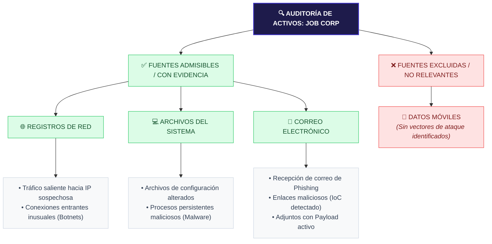
---

#### Pregunta de selección

**¿Cuál de las siguientes fuentes de datos NO es relevante para este caso?**

- [ ] Registros de red
- [ ] Archivos del sistema
- [ ] Cuentas de correo electrónico
- [x] **Datos móviles**

> **Explicación:** El ataque afectó **únicamente a la red**, no se conectaron dispositivos móviles ni personales, por lo que los datos móviles no son relevantes para la investigación.

### Aspecto destacado de la gestión profesional: investigador forense digital

#### Habilidades de gestión profesional

Aprendiste mucho sobre lo que hacen los investigadores forenses digitales. Exploremos el trabajo más a fondo.

#### ¿Qué hace un investigador forense digital?

Un **investigador forense digital** recupera, examina y analiza evidencia digital para **investigar delitos cibernéticos**.

**Otros nombres para esta función:**
- Investigador cibernético
- Investigador forense informático
- Especialista forense digital
- Examinador forense digital

#### Tareas principales

| Tarea | Descripción |
|-------|-------------|
| **Recuperar datos** | De dispositivos virtuales y físicos |
| **Analizar datos** | Usando software forense especializado |
| **Preservar datos** | Asegurar su integridad (imágenes forenses, hash, cadena de custodia) |
| **Colaborar** | Con recursos humanos, aplicación de la ley y otras partes |
| **Compartir conclusiones** | En informes forenses y procedimientos legales |

---

#### Habilidades necesarias para tener éxito

| Categoría | Habilidades específicas |
|-----------|------------------------|
| **Técnicas** | Computadoras, redes, almacenamiento de datos, sistemas operativos, cifrado, software forense |
| **Analíticas** | Razonamiento sólido, atención al detalle, capacidad para sacar conclusiones válidas |
| **Legales** | Conocimiento de leyes y regulaciones de privacidad de datos (para garantizar que los métodos soporten escrutinio legal) |
| **Comunicación** | Documentación clara y persuasiva para audiencias de distintos niveles (ejecutivos, abogados, jurados) |

---

#### Resumen del perfil del investigador forense digital
```text
==========================================================================================
[ PERFIL PROFESIONAL: INVESTIGADOR FORENSE DIGITAL ]
==========================================================================================

🎯 FUNCIONES OPERATIVAS (El flujo de trabajo del analista):
  • Recuperar ──▶ Adquirir la evidencia de forma segura preservando su estado original.
  • Examinar  ──▶ Identificar y extraer los datos visibles, ocultos o borrados del medio.
  • Analizar  ──▶ Correlacionar eventos para descubrir el origen y el alcance del incidente.
  • Reportar  ──▶ Documentar las conclusiones técnicas en informes ejecutivos y legales.

------------------------------------------------------------------------------------------
🛡️ MATRIZ DE COMPETENCIAS Y HABILIDADES CLAVE:

  [ COMPUTACIÓN FORENSE ] ──▶ Dominio de sistemas operativos, redes, criptografía,
                              y herramientas del sector (ej. Autopsy, EnCase, FTK).
  
  [ CAPACIDAD ANALÍTICA ] ──▶ Pensamiento crítico, resolución de problemas complejos,
                              y un alto enfoque en la atención al detalle (micro-análisis).
  
  [ MARCO JURÍDICO ]      ──▶ Conocimiento de legislación local/internacional sobre
                              privacidad, delitos informáticos y reglas de evidencia.
  
  [ SOFT SKILLS ]         ──▶ Capacidad de traducir hallazgos técnicos muy complejos
                              a un lenguaje simple para jueces, fiscales o directores.
==========================================================================================

```
---

#### ¿Por qué es importante esta función?

| Ámbito | Contribución |
|--------|--------------|
| **Justicia** | Llevar a los delincuentes cibernéticos ante la justicia |
| **Corporaciones** | Investigar filtraciones, robo de IP, mala conducta de empleados |
| **Seguridad nacional** | Investigar terrorismo, espionaje, fugas de datos |

> **En resumen:** El investigador forense digital debe garantizar que sus **métodos, hallazgos y conclusiones** sean compatibles con el **escrutinio legal**. Deben documentar y comunicar su trabajo de manera clara y persuasiva para audiencias de varios niveles de experiencia (ejecutivos, abogados, jurados).

### Habilidades clave del investigador forense digital

#### Pensamiento analítico

Los investigadores necesitan un **razonamiento sólido** que les ayude a:

- Analizar los datos y sacar **conclusiones válidas y significativas**
- **Identificar patrones** y hacer **conexiones** entre diferentes datos
- Completar **acertijos** o realizar **investigaciones** complejas

> **Perfil ideal:** Personas que disfrutan resolver misterios, armar rompecabezas o investigar problemas complejos.

**Ejemplo en la práctica:**
Un investigador encuentra archivos de log de diferentes servidores. Debe **conectar** los eventos de cada servidor para reconstruir **cronológicamente** cómo se movió el atacante por la red.

---

#### Atención al detalle

Los investigadores deben ser **meticulosos** y prestar **mucha atención a los detalles**:

- Hasta el **mínimo detalle** puede ayudar a resolver un caso
- Un archivo mal nombrado, una marca de tiempo incorrecta o un log olvidado pueden ser la clave
- La meticulosidad evita perder evidencia crucial

> **Perfil ideal:** Personas orientadas a los detalles, que disfrutan **organizar** o **planificar eventos**.

**Ejemplo en la práctica:**
Un investigador encuentra un archivo con fecha de modificación posterior al secuestro del sistema. Ese **pequeño detalle** revela que el atacante modificó un script de inicio para mantener su acceso.

---

#### Comunicación

Los investigadores necesitan **buenas habilidades de comunicación** para:

| Tarea | Descripción |
|-------|-------------|
| **Documentar** | Claramente sus métodos y hallazgos en formularios de cadena de custodia e informes |
| **Explicar** | Y justificar su trabajo ante audiencias de diversos niveles (ejecutivos, abogados, jurados) |
| **Testificar** | En procedimientos legales, explicando conceptos técnicos a no técnicos |

> **Perfil ideal:** Personas con excelentes habilidades para **escribir, enseñar o hablar en público**.

**Ejemplo en la práctica:**
Un investigador debe explicar a un jurado (sin conocimientos técnicos) cómo se recuperó un correo electrónico borrado. Debe hacerlo de manera **simple y convincente**.

---

#### Colaboración

Los investigadores deben **colaborar bien con otros**:

| Aspecto | Descripción |
|---------|-------------|
| **Con autoridades** | Cooperar y colaborar con la policía, fiscales, etc. |
| **Trabajo en equipo** | A menudo trabajan en equipos, compartiendo datos efectivamente |
| **Responsabilidades separadas** | Diferentes investigadores pueden tener tareas distintas y deben coordinarse |

> **Perfil ideal:** Personas que disfrutan completar **proyectos grupales** o trabajar en **equipos**.

**Ejemplo en la práctica:**
Un equipo forense investiga un ataque grande. Un miembro analiza el disco duro, otro los logs de red, otro los correos electrónicos. Deben **compartir hallazgos** para reconstruir el ataque completo.

---

### Resumen de habilidades

```text
==========================================================================================
[ MATRIZ DETALLADA DE HABILIDADES OPERATIVAS - FORENSE DIGITAL ]
==========================================================================================

🧠 PENSAMIENTO ANALÍTICO
  • Razonamiento lógico deductivo para reconstruir la escena digital.
  • Capacidad para identificar patrones de ataque y anomalías en los sistemas.
  • Habilidad para conectar fuentes de datos dispersas (logs, archivos, memoria).

🔍 ATENCIÓN AL DETALLE
  • Metodología de trabajo meticulosa y estructurada bajo estándares internacionales.
  • Enfoque en el análisis de indicios mínimos que suelen pasar desapercibidos.
  • Rigor técnico para garantizar que no se altere ni se pierda ninguna evidencia.

🗣️ COMUNICACIÓN Y DEFENSA
  • Capacidad para documentar paso a paso cada hallazgo técnico.
  • Habilidad para explicar procesos de IT complejos a un público no técnico.
  • Aptitud para testificar ante tribunales y persuadir con base científica.

🤝 COLABORACIÓN Y COORDINACIÓN
  • Fluidez para trabajar en conjunto con jueces, fiscales y fuerzas de seguridad.
  • Facilidad para el trabajo en equipo con administradores de redes y sysadmins.
  • Compromiso para compartir datos de manera segura y coordinar la respuesta.
==========================================================================================
---
```
### ¿Tu perfil encaja?

| Si en tu vida personal... | Podrías prosperar como investigador forense digital |
|---------------------------|-----------------------------------------------------|
| **Disfrutas los acertijos y resolver misterios** | ✅ Pensamiento analítico |
| **Eres detallista y organizado** | ✅ Atención al detalle |
| **Te gusta enseñar o escribir** | ✅ Comunicación |
| **Disfrutas los proyectos grupales** | ✅ Colaboración |

> **Reflexión final:** La ciencia forense digital combina la **precisión de un científico**, el **escepticismo de un detective** y la **claridad de un comunicador**.

## Resumen y perspectivas

### Resumen de la lección

En esta lección, aprendiste sobre los **usos de la ciencia forense digital** en:

- **La aplicación de la ley** (investigaciones criminales, acoso, fraudes)
- **Investigaciones corporativas** (filtraciones, robo de propiedad intelectual, mala conducta de empleados)
- **Seguridad nacional** (terrorismo, espionaje, fugas de datos)

#### Puntos clave aprendidos

Independientemente de la industria en la que trabajen, los investigadores forenses digitales deben:

| Requisito | Por qué es importante |
|-----------|----------------------|
| **Cumplir con leyes y regulaciones** | Cada jurisdicción tiene normas diferentes sobre recolección y manejo de evidencia |
| **Seguir estrictamente la cadena de custodia** | Documentar quién, cuándo, dónde y por qué manipuló la evidencia |
| **Preservar la integridad** | Si no se preserva, la evidencia puede ser **inadmisible** en un tribunal |

> ⚠️ **Riesgo:** No cumplir con estos requisitos puede **comprometer la integridad** y la **situación legal** de la investigación.

---

### Perspectivas

**En la siguiente lección**, aprenderás sobre las **cuatro fases del proceso de la ciencia forense digital**:

| Fase | Descripción |
|------|-------------|
| **1. Recopilación** | Reunir datos digitales de diversas fuentes, preservando la integridad |
| **2. Examen** | Revisión exhaustiva para identificar y extraer información relevante |
| **3. Análisis** | Correlacionar e interpretar datos para crear una narración cohesionada |
| **4. Informes** | Preparar un informe detallado de las conclusiones |

También aprenderás a **preservar adecuadamente la evidencia forense digital** para garantizar su **integridad**.

---

## 🔄 El Ciclo de Vida del Proceso Forense Digital

El análisis forense no es una acción aislada, sino un proceso metodológico estructurado que garantiza que la evidencia digital mantenga su validez legal y técnica desde el momento del hallazgo hasta su exposición final.

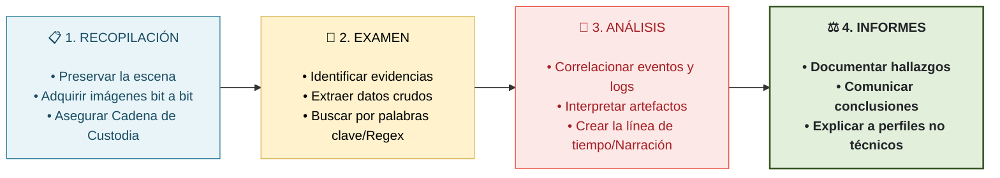
### Acerca de esta lección: El proceso forense digital

Cualquier persona que maneje evidencia en una investigación forense digital debe hacerlo con **cuidado**.

> De lo contrario, los abogados, jueces, jurados y otros responsables de la toma de decisiones relevantes podrían **ignorar las opiniones y recomendaciones** de los investigadores forenses digitales sobre el caso.

Los investigadores deben seguir un **proceso sólido y sistemático** para demostrar la **validez y confiabilidad** de sus hallazgos y conclusiones.

#### En esta lección aprenderás

- Las **fases del proceso forense digital**
- Los **pasos** que toman los investigadores en cada fase para garantizar la **integridad** de su evidencia y su investigación

---

### Las 4 fases del proceso forense digital

| Fase | Descripción |
|------|-------------|
| **1. Recopilación** | Reunir datos digitales de diversas fuentes, preservando la integridad |
| **2. Examen** | Revisión exhaustiva para identificar y extraer información relevante |
| **3. Análisis** | Correlacionar e interpretar datos para crear una narración cohesionada |
| **4. Informes** | Preparar un informe detallado de las conclusiones |

### Fases de la investigación forense digital

El número de fases de una investigación forense digital depende del investigador al que se le pregunte. La mayoría de los modelos incluyen de **cuatro a cinco fases**, mientras que otros incluyen hasta **nueve**. Los pasos específicos y la terminología empleada para describir cada fase también varían.

En cualquier caso, la mayoría de los modelos forenses digitales incluyen las tareas básicas y el proceso general que se encuentran en el siguiente modelo del **National Institute of Standards and Technology (NIST)**.

---

#### Las 4 fases del modelo NIST

| Fase | Nombre | Descripción |
|------|--------|-------------|
| **1** | **Colección** | Reunir datos digitales de diversas fuentes |
| **2** | **Examen** | Revisión exhaustiva para identificar información relevante |
| **3** | **Análisis** | Correlacionar e interpretar los datos |
| **4** | **Presentación de informes** | Preparar un informe detallado de las conclusiones |

---

```text
==========================================================================================
[ MARCO METODOLÓGICO: PROCESO FORENSE DIGITAL - NIST SP 800-86 ]
==========================================================================================

1. COLECCIÓN (Collection)
   • Definición NIST: Identificar, etiquetar, registrar y adquirir los datos de las fuentes 
                     de evidencia potenciales, resguardando su estado original.
   • Foco Técnico:   Aplicar técnicas de bloqueo de escritura y asegurar que los datos
                     no se alteren durante su manipulación o transporte.

2. EXAMEN (Examination)
   • Definición NIST: Procesar combinaciones de datos para identificar y extraer la 
                     información relevante, utilizando metodologías automatizadas o manuales.
   • Foco Técnico:   Visibilizar archivos en el espacio Slack, reconstruir particiones y 
                     descifrar volúmenes de datos sin alterar la imagen forense base.

3. ANÁLISIS (Analysis)
   • Definición NIST: Analizar los resultados del examen para obtener respuestas que 
                     permitan delinear las conclusiones de la investigación.
   • Foco Técnico:   Correlacionar marcas de tiempo (Timelines MAC), analizar registros 
                     de sistemas (Registry hives) y reconstruir la cadena de eventos del ataque.

4. INFORME (Reporting)
   • Definición NIST: Informar los resultados de la investigación, detallando las herramientas,
                     las metodologías aplicadas y las conclusiones obtenidas.
   • Foco Técnico:   Generar un reporte reproducible y auditable que pueda sostenerse como
                     prueba científica ante un comité de incidentes o un tribunal legal.
==========================================================================================
```

> **Nota:** El modelo del NIST es uno de los más utilizados como referencia en ciencia forense digital.

### Fase 1: Recopilación

La **recopilación** es la **primera fase** del proceso forense digital.

#### ¿Qué implica?

En la fase de recopilación, los investigadores:

- **Identifican** todas las posibles fuentes de datos
- **Etiquetan, codifican y recopilan** datos de todas las fuentes posibles
- **Preservan la integridad** de los datos

> Cualquier paso en falso podría **poner en peligro la credibilidad** de la investigación y la **relevancia legal** del caso.

#### Conocimientos necesarios para la recopilación

| Conocimiento | Descripción |
|--------------|-------------|
| **Tipos de datos** | Qué datos se pueden recopilar |
| **Métodos de recopilación** | Cómo recopilar sin comprometer la integridad |
| **Leyes y estándares éticos** | Normas para recopilar, estudiar y usar evidencia forense |

---

#### Los dos pasos de la recopilación

| Paso | Descripción |
|------|-------------|
| **1. Identificar** | Identificar las fuentes de datos digitales |
| **2. Recopilar** | Recopilar o crear imágenes de datos de esas fuentes |

---

### Paso 1: Identificar fuentes de datos digitales

**¿Cómo saben los investigadores por dónde empezar?**  
Su **conocimiento y experiencia** los guían.

**Ejemplo:** Cuando los investigadores ingresan a la oficina en casa de un sospechoso, pueden identificar fácilmente:

| Fuente | Ejemplos |
|--------|----------|
| **Unidades de disco duro** | Discos internos, externos |
| **Medios de almacenamiento extraíbles** | USB, tarjetas SD |
| **Registros de dispositivos de seguridad** | Cámaras, alarmas |
| **Datos volátiles** | Memoria RAM, sesiones activas |
| **Dispositivos de red** | Routers, firewalls |
| **Archivos de registro** | Logs de red |

> ⚠️ **Datos volátiles:** Se pierden cuando apagas el dispositivo. Si no se capturan a tiempo, pueden perderse para siempre.

---

### Paso 2: Recopilar datos de las fuentes

Según el **NIST**, la recopilación de datos implica **tres pasos**:

| Paso | Acción |
|------|--------|
| **1** | Elaborar un plan |
| **2** | Adquirir los datos |
| **3** | Verificar la integridad de los datos |

---

#### Subpaso 1: Elaborar un plan

**¿Por qué necesitan un plan?**  
Los datos relevantes pueden residir en muchas fuentes, por lo que los investigadores deben **priorizar**.

**Factores a considerar:**

| Factor | Descripción |
|--------|-------------|
| **Valor esperado** | ¿Qué tan importantes son los datos de esa fuente? |
| **Volatilidad** | ¿Los datos se pierden rápidamente? |
| **Esfuerzo** | ¿Cuánto trabajo implica recopilarlos? |

---

#### Subpaso 2: Adquirir los datos

**Métodos de adquisición:**

| Método | Descripción |
|--------|-------------|
| **Escaneo de discos duros** | Examinar el contenido del disco |
| **Extracción de bases de datos** | Recuperar datos de sistemas de bases de datos |
| **Extracción de memorias** | Recuperar datos de memorias de dispositivos |
| **Recuperación de archivos borrados** | Restaurar archivos eliminados |

**Copias de seguridad:**

- Los investigadores hacen **copias de seguridad** de los datos
- Pueden estudiar y manipular las copias sin poner en peligro el original
- La fuente original se **asegura** para que nadie la manipule

> ⚠️ **Datos volátiles:** Solo se pueden recopilar si el sistema sigue funcionando o si se creó una imagen de respaldo en ese estado.

---

#### Subpaso 3: Verificar la integridad de los datos

**¿Cómo se verifica la integridad?**  
Empleando **valores hash**.

##### ¿Qué es un valor hash?

| Concepto | Analogía |
|----------|----------|
| **Hash** | Una **huella dactilar digital** única |
| **Propósito** | Identificar de forma única un dato |
| **Si cambia un bit** | El hash cambia completamente |

> La única persona con la misma huella dactilar que tú es tu clon. Los clones humanos no existen. Del mismo modo, **el único dato con el mismo hash que el original es su copia exacta**.

##### ¿Cómo se usa el hash?

| Paso | Acción |
|------|--------|
| 1 | El software crea un **hash de la fuente original** |
| 2 | El software crea un **hash de la copia de seguridad** |
| 3 | Se **comparan** ambos hashes |
| 4 | Si coinciden → la copia es **idéntica**; si no → algo cambió ❌ |

---

### 📥 Metodología de la Fase 1: Recopilación Forense

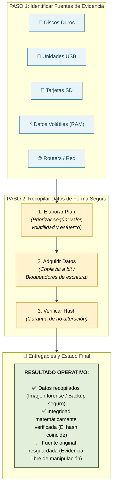


---

### Resumen de la Fase 1: Recopilación

| Actividad | Propósito |
|-----------|-----------|
| **Identificar fuentes** | Saber de dónde obtener los datos |
| **Elaborar plan** | Priorizar según valor, volatilidad y esfuerzo |
| **Adquirir datos** | Recopilar y hacer copias de seguridad |
| **Verificar hash** | Asegurar que la copia es idéntica al original |
| **Asegurar original** | Proteger la fuente de manipulación |

> **Regla de oro:** El original nunca se toca. Todo el trabajo se hace sobre **copias de seguridad verificadas**.

### Actividad: Aplicar la fase de recopilación del proceso forense digital

**Habilidades para la inserción laboral:** Agilidad de aprendizaje

---

#### Escenario: We Insure You

**Antecedentes**

**We Insure You**, una gran empresa de seguros, sospechaba que un empleado **robó información confidencial** de la red de la empresa. La dirección contactó a una empresa forense digital para identificar:

- El **origen** de la filtración de datos
- El **alcance** de los daños

---

#### Acciones del equipo forense en la fase de recopilación

| Paso | Acción | Detalle |
|------|--------|---------|
| **1. Identificar fuentes** | Analizaron la red para identificar posibles fuentes de datos | Descubrieron que el empleado accedió a archivos y carpetas confidenciales no relacionados con su trabajo |
| **2. Elaborar plan** | Planificaron la recopilación de datos | Decidieron recopilar datos de: computadora portátil del empleado, servidores y cuentas de correo electrónico |
| **3. Adquirir datos** | Recopilaron datos de la computadora portátil | Crearon una **imagen forense** del disco duro (el original quedó intacto) |
| **4. Adquirir datos** | Recopilaron datos de servidores y correos | Extrajeron información pertinente y verificaron integridad con **valores hash** |
| **5. Preservar integridad** | No comprometieron las fuentes originales | Hicieron **copias de seguridad** de todos los datos recopilados |
| **6. Verificar integridad** | Compararon valores hash | Usaron software especializado para asegurar que las copias eran **exactas** |

---

#### Resultado de la investigación

| Hallazgo | Acción |
|----------|--------|
| Confirmaron que el empleado **robó información confidencial** | Proporcionaron evidencia a la dirección |
| - | La dirección tomó las **medidas oportunas** contra el empleado |

---

## 🛡️ Caso Práctico (WEINSUREYOU): Fase 1 - Recopilación

El aseguramiento de la infraestructura ante un compromiso real en la organización **WeInsureYou** exige un despliegue metódico para capturar el estado técnico de los activos sin alterar la escena digital original.

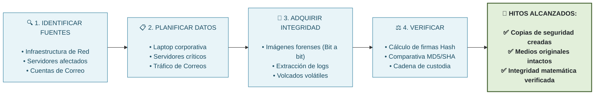
---

#### Preguntas de verificación (ejemplos)

**Pregunta 1:** ¿Qué descubrió el equipo forense al analizar la red?

<details>
<summary>Ver respuesta</summary>

El empleado accedió a **varios archivos y carpetas confidenciales no relacionados con sus responsabilidades laborales**.

</details>

---

**Pregunta 2:** ¿Qué método usaron para recopilar datos de la computadora portátil?

<details>
<summary>Ver respuesta</summary>

Crearon una **imagen forense del disco duro**, asegurando que los datos originales permanecieran intactos.

</details>

---

**Pregunta 3:** ¿Cómo verificaron la integridad de los datos recopilados?

<details>
<summary>Ver respuesta</summary>

Compararon los **valores hash** de las fuentes de datos y las copias de seguridad usando software especializado.

</details>

---

**Pregunta 4:** ¿Por qué hicieron copias de seguridad de los datos?

<details>
<summary>Ver respuesta</summary>

Para poder realizar análisis posteriores **sin poner en peligro las fuentes de datos originales**.

</details>

### Fase 2: Examen

El **examen** es la **segunda fase** del proceso forense digital.

#### ¿Qué implica?

En la fase de examen, los investigadores:

- **Examinan** los datos recopilados para determinar qué es **relevante**
- **Extraen** los datos relevantes para su posterior análisis

> Deben **documentar cada paso** e incluir fotos o capturas de pantalla de las tareas realizadas y de la evidencia adicional encontrada.

#### Conocimientos necesarios para el examen

| Conocimiento | Descripción |
|--------------|-------------|
| **Tipos de datos** | Qué datos se pueden extraer sin violar leyes de privacidad |
| **Métodos de examen** | Cómo examinar sin comprometer la integridad |
| **Estructuras de datos** | Tipos de archivos relevantes para la investigación |

#### Ejemplos de datos que pueden examinar

| Tipo de dato | Ejemplo |
|--------------|---------|
| **Registros de actividad** | Actividad de usuarios, inicios de sesión |
| **Registros de tráfico de red** | Conexiones entrantes/salientes |
| **Archivos de imagen** | Fotos, capturas de pantalla |
| **Metadatos** | Fechas de creación, modificación, acceso |

> **Ejemplo práctico:** Si un sospechoso borra un documento incriminatorio de su memoria USB, los investigadores podrían recuperar parte del contenido del documento a partir de los **metadatos** de la memoria.

---

### Desafíos del examen

| Desafío | Descripción |
|---------|-------------|
| **1. Eludir los controles** | Sistemas operativos y aplicaciones pueden tener cifrado o compresión que dificultan el acceso |
| **2. Examinar una gran cantidad de datos** | Un disco duro puede tener cientos de miles de archivos, no todos relevantes |

---

#### Desafío 1: Eludir los controles

**¿Qué dificulta el acceso?**
- Características de **cifrado** de archivos
- Características de **compresión** de archivos

**¿Cómo se eluden?**

| Herramienta/Técnica | Propósito |
|---------------------|-----------|
| **Herramientas de descifrado de contraseñas** | Desbloquear archivos cifrados |
| **Herramientas de extracción** | Extraer archivos de archivos comprimidos y cifrados |

> Con el **conocimiento, las habilidades y las herramientas** suficientes, los investigadores pueden eludir estas barreras.

---

#### Desafío 2: Examinar una gran cantidad de datos

**El problema:**
- Un disco duro puede tener **cientos de miles de archivos**
- Los registros del sistema pueden tener **millones de entradas**
- De esos millones, solo **siete o menos** pueden ser relevantes

**La solución: herramientas de filtrado**

| Herramienta/Técnica | Propósito |
|---------------------|-----------|
| **Aplicaciones de búsqueda de texto** | Buscar cadenas de texto específicas (ej. nombre de la víctima) |
| **Herramientas forenses** | Encontrar tipos de archivos específicos, nombres de usuario o correos electrónicos |
| **Herramientas de recuperación** | Descubrir datos ocultos o eliminados |

---

## 🔬 Fase 2: Examen - Procesamiento Técnico de Evidencia

Una vez recolectada la evidencia en la Fase 1 de forma inmutable, la **Fase de Examen** se encarga de procesar los volúmenes masivos de datos para visibilizar la información útil, superando las contramedidas lógicas del atacante.

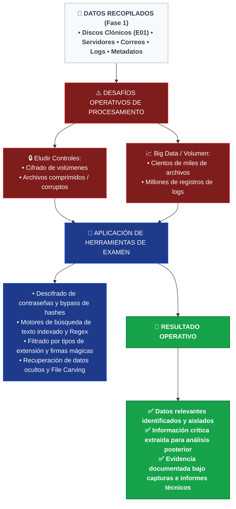
---

### Resumen de la Fase 2: Examen

| Actividad | Propósito |
|-----------|-----------|
| **Examinar datos recopilados** | Determinar qué es relevante para el caso |
| **Eludir controles** | Superar cifrado, compresión y otras barreras |
| **Filtrar grandes volúmenes** | Usar herramientas para encontrar agujas en pajar digitales |
| **Extraer datos relevantes** | Preparar para la fase de análisis |
| **Documentar** | Registrar cada paso con fotos o capturas de pantalla |

> **Regla de oro:** El examen debe realizarse sin comprometer la **integridad** de los datos originales. Todo el trabajo se hace sobre **copias de seguridad**.

### Actividad: Aplicar la fase de examen del proceso forense digital

**Habilidades para la inserción laboral:** Agilidad de aprendizaje

---

#### Escenario: We Insure You (continuación)

**Antecedentes**

**We Insure You**, una gran compañía de seguros, sufrió una **filtración de datos**. La empresa contrató a un equipo forense digital para investigar e identificar el origen del problema.

El equipo completó la **Fase 1: Recopilación** (identificar, etiquetar, codificar y recopilar datos de todas las fuentes posibles, preservando la integridad).

Luego pasó a la **Fase 2: Examen**.

---

#### Acciones del equipo forense en la fase de examen

| Desafío | Acción del equipo | Herramienta/Técnica |
|---------|-------------------|---------------------|
| **Eludir controles** (cifrado) | Desbloquear archivos cifrados | Herramientas de **descifrado de contraseñas** |
| **Eludir controles** (compresión) | Extraer archivos de archivos comprimidos y cifrados | Técnicas de **tallado de datos** |
| **Gran cantidad de datos** (cientos de miles de archivos) | Agilizar el filtrado | Aplicaciones de **búsqueda de texto** |
| **Gran cantidad de datos** | Identificar archivos, nombres de usuario, correos específicos | **Herramientas forenses** |
| **Datos ocultos o borrados** | Descubrir información no visible | **Herramientas de recuperación** |

#### Documentación

| Acción | Propósito |
|--------|-----------|
| Documentar **cada paso** del proceso | Para poder mostrar evidencia ante un tribunal |
| Incluir **fotos o capturas de pantalla** | Registrar tareas completadas y evidencia adicional |

#### Resultado de la fase de examen

| Logro | Importancia |
|-------|-------------|
| Identificaron **archivos de interés** | Determinar la causa de la filtración |
| Extrajeron **datos pertinentes** | Para análisis posterior |
| Identificaron **posibles sospechosos** | Avanzar en la investigación |

> La segunda fase del análisis forense digital fue **crucial** para determinar la causa de la filtración de datos e identificar a posibles sospechosos.

---

#### Resumen del proceso aplicado
┌─────────────────────────────────────────────────────────────────────────────┐
│ W E I N S U R E Y O U - FASE 2 │
│ EXAMEN │
├─────────────────────────────────────────────────────────────────────────────┤
│ │
│ ┌─────────────────────────────────────────────────────────────────────┐ │
│ │ DESAFÍOS Y SOLUCIONES │ │
│ │ │ │
│ │ Eludir controles: │ │
│ │ • Cifrado ──▶ Herramientas de descifrado │ │
│ │ • Compresión ──▶ Tallado de datos │ │
│ │ │ │
│ │ Gran volumen de datos: │ │
│ │ • Búsqueda de texto │ │
│ │ • Filtrado por tipo de archivo, usuario, correo │ │
│ │ • Descubrimiento de datos ocultos/borrados │ │
│ │ │ │
│ └─────────────────────────────────────────────────────────────────────┘ │
│ │ │
│ ▼ │
│ ┌─────────────────────────────────────────────────────────────────────┐ │
│ │ RESULTADO │ │
│ │ │ │
│ │ ✅ Archivos de interés identificados │ │
│ │ ✅ Datos pertinentes extraídos │ │
│ │ ✅ Posibles sospechosos identificados │ │
│ │ ✅ Documentación completa (fotos/capturas) │ │
│ │ │ │
│ └─────────────────────────────────────────────────────────────────────┘ │
│ │
└─────────────────────────────────────────────────────────────────────────────┘


---

#### Preguntas de verificación

**Pregunta 1:** ¿Qué herramientas usó el equipo para desbloquear archivos cifrados?

<details>
<summary>Ver respuesta</summary>

**Herramientas de descifrado de contraseñas.**

</details>

---

**Pregunta 2:** ¿Qué técnica usaron para extraer archivos de archivos comprimidos y cifrados?

<details>
<summary>Ver respuesta</summary>

Técnicas de **tallado de datos**.

</details>

---

**Pregunta 3:** ¿Qué usaron para agilizar el filtrado de cientos de miles de archivos?

<details>
<summary>Ver respuesta</summary>

**Aplicaciones de búsqueda de texto** y **herramientas forenses**.

</details>

---

**Pregunta 4:** ¿Por qué documentaron cada paso con fotos o capturas de pantalla?

<details>
<summary>Ver respuesta</summary>

Para poder **mostrar la evidencia ante un tribunal**.

</details>

---

**Pregunta 5:** ¿Cuál fue el resultado principal de la fase de examen?

<details>
<summary>Ver respuesta</summary>

Identificaron **archivos de interés**, extrajeron **datos pertinentes** e identificaron **posibles sospechosos**.

</details>

### Fase 3: Análisis

El **análisis** es la **tercera fase** del proceso forense digital.

#### ¿Qué implica?

En la fase de análisis, los investigadores:

- **Analizan** los datos relevantes (de la fase de examen) para sacar **conclusiones significativas**
- Siguen una **metodología estricta** (como científicos)
- Buscan responder **preguntas relevantes** para el caso

> A veces, la única conclusión es que **ninguna conclusión es posible** sin más datos. Pero los analistas pretenden proporcionar información más útil, como **qué o quién causó** un incidente.

#### Actividades clave del análisis

| Actividad | Descripción |
|-----------|-------------|
| **Identificar detalles notables** | Encontrar patrones, causa y efecto |
| **Construir líneas de tiempo** | Ordenar eventos cronológicamente |
| **Descubrir evidencia adicional** | Pistas en metadatos, datos ocultos |
| **Convertir datos complejos** | Usar visualización para revelar patrones |

---

### Análisis en acción: El caso de Rasha

#### Contexto

**Rasha**, una investigadora forense, está analizando datos relacionados con un incidente donde un **virus se propagó** por el sistema y los dispositivos de una empresa.

**Objetivo:** Determinar **cómo ocurrió** el incidente.

---

#### Paso 1: Buscar evidencia de actividad maliciosa

| Acción | Hallazgo |
|--------|----------|
| Rasha busca evidencia de actividad maliciosa | Encuentra **registros de red** con múltiples intentos de **acceso no autorizado** |

---

#### Paso 2: Examinar marcas de tiempo

| Acción | Hallazgo |
|--------|----------|
| Examina las **marcas de tiempo** | Detecta un **patrón inusual**: un intento a la misma hora cada día, desde la misma IP |
| Sigue analizando | Eventualmente, un intento tiene **éxito** |
| Observa | No se producen más intentos después del éxito |
| Descubre | La entrada exitosa ocurrió **varios días antes** de que TI descubriera el virus |

---

#### Paso 3: Formular preguntas clave

| Pregunta de Rasha | Implicación |
|-------------------|-------------|
| *"¿Por qué terminaron los intentos?"* | El atacante podría haber logrado todo lo que planeó poco después de entrar |

---

#### Paso 4: Examinar marcas de tiempo de archivos

| Acción | Hallazgo |
|--------|----------|
| Examina actividad del sistema en el momento de la entrada exitosa | Busca evidencia de **manipulación de archivos** (eliminados o modificados) |
| Analiza **fechas de archivos** (creación, modificación, acceso) | Descubre que alguien manipuló un archivo poco después del acceso |
| El archivo era... | Un **documento de capacitación** que se comparte regularmente con nuevos empleados |

---

#### Paso 5: Análisis detallado del archivo

| Acción | Hallazgo |
|--------|----------|
| Analiza el documento en detalle | El documento se infectó con **código malicioso** |
| Efecto del virus | Cada vez que alguien abría el documento, su dispositivo se infectaba |
| Propagación | El virus podía propagarse a otros dispositivos de la red |
| Evasión | El virus **interfería con el software antivirus** de la empresa |

> **Conclusión:** Esta información explica por qué el virus **no se detectó** mientras se propagaba por el sistema.

---

### 🕵️‍♂️ Línea de Investigación: El Método de Análisis de Rasha

```mermaid
graph TD
    %% Configuración de Estilos y Colores para el flujo de investigación
    classDef inicio fill:#e8f4f8,stroke:#2b7b9b,stroke-width:2px,color:#1a4d63;
    classDef patron fill:#fff3cd,stroke:#ffc107,stroke-width:2px,color:#856404;
    classDef pregunta fill:#f8d7da,stroke:#dc3545,stroke-width:2px,color:#721c24,font-weight:bold;
    classDef hallazgo fill:#f8f9fa,stroke:#6c757d,stroke-width:2px,color:#212529;
    classDef conclusion fill:#e2efda,stroke:#375623,stroke-width:2px,color:#212529;

    R1["<b>1. Registros de Red (Logs)</b><br><br>🔍 <i>Alerta inicial:</i><br>• Detección de múltiples intentos de acceso no autorizado."]:::inicio
    
    R2["<b>2. Marcas de Tiempo (Timelines)</b><br><br>📊 <i>Análisis cronológico:</i><br>• Patrón detectado: Misma hora y misma IP todos los días.<br>• Eventualmente: Ocurre un intento de inicio de sesión exitoso.<br>• ⚠️ El acceso ocurrió DÍAS ANTES de que se descubriera el incidente."]:::patron
    
    R3["<b>3. Pregunta Clave del Investigador</b><br><br>🤔 <i>¿Por qué terminaron los intentos repentinamente?</i><br>• Respuesta lógica: El atacante dejó de intentar porque ya logró entrar."]:::pregunta
    
    R4["<b>4. Marcas de Tiempo de Archivos</b><br><br>📂 <i>Análisis de artefactos:</i><br>• Se localiza un archivo manipulado poco después del acceso exitoso.<br>• El archivo era un documento de capacitación (compartido con todo el personal)."]:::hallazgo
    
    R5["<b>5. Análisis de Malware en el Archivo</b><br><br>🦠 <i>Ingeniería inversa / Análisis dinámico:</i><br>• El documento estaba infectado con código malicioso.<br>• Diseñado para infectar dispositivos automáticamente al abrirse.<br>• Ejecutaba comandos para desactivar el antivirus local."]:::hallazgo
    
    C["<b>🎯 CONCLUSIÓN FORENSE</b><br><br>✅ Se determinó con precisión el <b>CÓMO</b> ocurrió la intrusión (Acceso + Troyano en documento) y el por qué <b>NO SE DETECTÓ</b> a tiempo (Evasión de defensa mediante la desactivación del antivirus)."]:::conclusion

    %% Conexión del flujo deductivo
    R1 --> R2 --> R3 --> R4 --> R5 --> C

```


---

### Herramientas de análisis

| Tipo de herramienta | Propósito |
|---------------------|-----------|
| **Software de análisis de seguridad** | Descubrir evidencia oculta |
| **Software de visualización de datos** | Convertir datos complejos en imágenes simples que revelan patrones |

---

### Resumen de la Fase 3: Análisis

| Actividad | Propósito |
|-----------|-----------|
| **Analizar datos relevantes** | Sacar conclusiones significativas |
| **Identificar patrones** | Encontrar relaciones causa-efecto |
| **Construir líneas de tiempo** | Ordenar eventos cronológicamente |
| **Descubrir evidencia oculta** | Usar herramientas especializadas |
| **Responder preguntas clave** | Qué, quién, cómo, cuándo, por qué |

> **Regla de oro:** El análisis forense sigue una **metodología estricta** para llegar a **conclusiones razonables** que respalden los datos.

### Actividad: Aplicar la fase de análisis del proceso forense digital

**Habilidades para la inserción laboral:** Agilidad de aprendizaje

---

#### Escenario: We Insure You (continuación)

**Antecedentes**

**We Insure You**, la gran empresa de seguros, continúa su investigación forense. El equipo completó la **Fase 1: Recopilación** y la **Fase 2: Examen**, y ahora está en la **Fase 3: Análisis**.

---

#### Acciones del equipo forense en la fase de análisis

| Actividad | Acción del equipo | Hallazgo/Resultado |
|-----------|-------------------|-------------------|
| **Abordar preguntas relevantes** | ¿Cómo ocurrió el acceso no autorizado? ¿Qué empleado fue responsable? | Determinaron la causa y el responsable |
| **Identificar detalles notables** | Analizaron registros de actividad de usuarios | Patrón que indicaba acceso a archivos fuera del ámbito autorizado |
| **Construir cronología** | Ordenaron eventos cronológicamente | Secuencia que llevó al acceso no autorizado |
| **Determinar causa-efecto** | Relacionaron eventos entre sí | Entendieron cómo se produjo la violación |
| **Examinar metadatos** | Analizaron fechas, horas y archivos accedidos | Evidencia adicional: archivos específicos, fecha y hora del acceso |

---

#### Herramientas utilizadas

| Herramienta | Propósito |
|-------------|-----------|
| **Software de análisis de seguridad** | Descubrir **evidencia oculta** |
| **Software de visualización de datos** | Convertir datos complejos en **recursos visuales** que resaltan patrones difíciles de detectar |

---

#### Conclusiones del análisis

| Conclusión | Detalle |
|------------|---------|
| **Causa del robo de datos** | Un empleado **superó su nivel de acceso autorizado** para acceder a información confidencial de clientes |

---

#### Acciones tomadas por We Insure You

| Acción | Propósito |
|--------|-----------|
| Tomar medidas adecuadas | Evitar incidentes similares |
| Proteger sus datos | Prevenir accesos no autorizados futuros |

---

### 🧠 Caso WeInsureYou - Metodología de la Fase 3: Análisis Forense

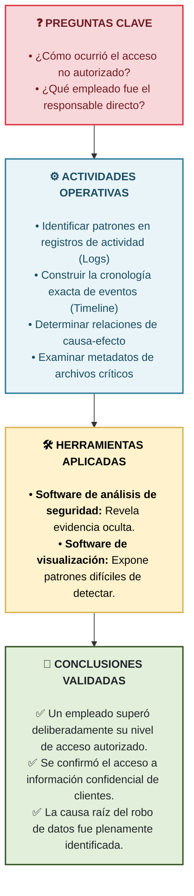

---

#### Preguntas de verificación

**Pregunta 1:** ¿Qué patrones identificó el equipo en los registros de actividad de los usuarios?

<details>
<summary>Ver respuesta</summary>

Un empleado accedió a **archivos fuera de su ámbito autorizado**.

</details>

---

**Pregunta 2:** ¿Qué construyeron los investigadores para entender la secuencia del acceso no autorizado?

<details>
<summary>Ver respuesta</summary>

Una **cronología de los acontecimientos** que llevaron al acceso no autorizado.

</details>

---

**Pregunta 3:** ¿Qué tipo de software ayudó a los investigadores a convertir datos complejos en recursos visuales?

<details>
<summary>Ver respuesta</summary>

**Software de visualización de datos**.

</details>

### Fase 4: Elaboración de informes

La **elaboración de informes** es la **cuarta fase** del proceso forense digital.

#### ¿Qué implica?

En la fase de elaboración de informes, los investigadores:

- **Crean** un informe detallado que describe **todos los hallazgos** de la investigación
- **Comparten** el informe con las partes relevantes (abogados, jueces, ejecutivos, etc.)

#### Características del informe

| Característica | Por qué es importante |
|----------------|----------------------|
| **Preciso** | Los datos deben ser correctos |
| **Completo** | No debe omitirse información relevante |
| **Conclusiones lógicamente sólidas** | Las conclusiones deben tener sentido basadas en la evidencia |
| **Basado en evidencia** | Todo hallazgo debe estar respaldado por pruebas |

> Para **resistir el escrutinio legal** y **persuadir a los lectores**, el informe debe cumplir con estos requisitos.

---

### Estructura típica del informe

| Sección | Descripción |
|---------|-------------|
| **1. Descripción general** | Contexto de la investigación, alcance, objetivos, roles |
| **2. Adquisición forense y preparación de exámenes** | Métodos, cadena de custodia, herramientas, condiciones |
| **3. Resultados e informe** | Hallazgos detallados, evidencia, capturas de pantalla, visualizaciones |
| **4. Conclusión** | Resumen, recomendaciones para acciones adicionales |

---

#### Sección 1: Descripción general

El investigador proporciona **contexto** para la investigación:

| Elemento | Descripción |
|----------|-------------|
| **Cómo se involucró** | Quién lo contactó, por qué motivo |
| **Estado del caso** | Qué se sabía al momento de iniciar |
| **Funciones de otros** | Qué roles desempeñaron otras personas en la investigación |
| **Alcance** | Límites de la investigación (qué se incluía y qué no) |
| **Objetivos** | Qué se pretendía lograr con la investigación |

---

#### Sección 2: Adquisición forense y preparación de exámenes

Los investigadores explican los **métodos empleados**:

| Aspecto | Detalles a incluir |
|---------|-------------------|
| **Dónde** | Dónde se recopilaron las pruebas |
| **Cómo** | Cómo se procesaron y preservaron (integridad) |
| **Cadena de custodia** | Detalles de quién manejó la evidencia y cuándo |
| **Procedimientos** | Métodos de recopilación, examen y análisis |
| **Herramientas** | Qué herramientas se usaron en cada fase |
| **Dispositivos examinados** | Cada dispositivo, herramientas usadas y condiciones del examen |

---

#### Sección 3: Resultados e informe (análisis forense)

Los investigadores describen sus **hallazgos en detalle**:

| Elemento | Descripción |
|----------|-------------|
| **Vulnerabilidades descubiertas** | Problemas de seguridad identificados |
| **Evidencia empleada** | Para cada hallazgo, ejemplos concretos |
| **Capturas de pantalla** | De archivos de texto, herramientas de análisis |
| **Visualizaciones** | Gráficos que muestran patrones |

> Esta sección también se conoce como **análisis forense**.

---

#### Sección 4: Conclusión

El investigador **resume** su análisis y hallazgos:

| Elemento | Descripción |
|----------|-------------|
| **Resumen** | Síntesis de los hallazgos principales |
| **Precisión técnica** | Ser conciso y técnicamente preciso |
| **Recomendaciones** | Acciones adicionales sugeridas (recopilar más datos, examinar más a fondo, etc.) |

---

### 📝 Estructura de la Fase 4: Elaboración de Informes Forenses

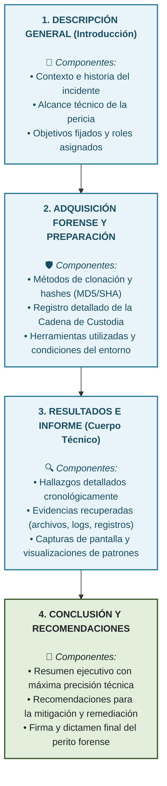
---

### Resumen de la Fase 4: Informes

| Requisito | Propósito |
|-----------|-----------|
| **Preciso y completo** | Asegurar credibilidad del informe |
| **Conclusiones lógicamente sólidas** | Que tengan sentido basadas en la evidencia |
| **Basado en evidencia** | Cada hallazgo respaldado por pruebas |
| **Cadena de custodia documentada** | Demostrar integridad de la evidencia |
| **Recomendaciones claras** | Guiar acciones futuras |

> **Regla de oro:** El informe debe ser comprensible para **audiencias no técnicas** (abogados, jueces, jurados, ejecutivos) sin perder **precisión técnica**.

### Fase de elaboración de informes: ejemplo de un informe forense digital

Ahora que estás familiarizado con la fase de elaboración de informes del proceso forense digital, examinemos un ejemplo de informe forense digital que el equipo que investiga la filtración de **We Insure You** podría haber creado.

---

#### Ejemplo de informe forense digital - We Insure You

**Título:** Informe de investigación forense digital - Filtración de datos

---

##### Sección 1: Descripción general

| Campo | Contenido |
|-------|-----------|
| **Caso** | Filtración de datos en We Insure You |
| **Investigador** | Equipo forense digital |
| **Fecha de inicio** | DD/MM/AAAA |
| **Contexto** | We Insure You sospechaba que un empleado robó información confidencial de la red |
| **Alcance** | Investigar el origen de la filtración y el alcance de los daños |
| **Objetivos** | Identificar qué datos se vieron comprometidos, quién fue responsable y cómo ocurrió |

---

##### Sección 2: Adquisición forense y preparación de exámenes

| Aspecto | Detalle |
|---------|---------|
| **Fuentes de datos** | Computadora portátil del empleado, servidores, cuentas de correo electrónico |
| **Método de recopilación** | Imagen forense del disco duro (laptop), extracción de datos de servidores y correos |
| **Preservación de integridad** | Valores hash (MD5/SHA) para verificar copias |
| **Cadena de custodia** | Documentación de quién manejó la evidencia, cuándo y con qué propósito |
| **Herramientas utilizadas** | Software de imagen forense, herramientas de descifrado, aplicaciones de búsqueda de texto |
| **Dispositivos examinados** | Laptop del empleado (modelo, número de serie), servidores corporativos, cuentas de correo |

---

##### Sección 3: Resultados e informe (análisis forense)

| Hallazgo | Evidencia |
|----------|-----------|
| **El empleado accedió a archivos fuera de su ámbito autorizado** | Registros de actividad de usuarios mostrando patrón de acceso no autorizado |
| **Acceso ocurrió en fechas/horas específicas** | Metadatos de archivos con marcas de tiempo |
| **Archivos confidenciales fueron accedidos** | Capturas de pantalla de los archivos y rutas de acceso |
| **El empleado superó su nivel de acceso** | Comparación de nivel de autorización vs. archivos accedidos |
| **No se detectó el acceso durante la ocurrencia** | El software antivirus estaba desactivado/evadido |

**Visualizaciones incluidas:**
- Capturas de pantalla de los registros de actividad
- Línea de tiempo de eventos (cronología)
- Tabla de archivos accedidos con fechas y horarios

---

##### Sección 4: Conclusión

| Elemento | Contenido |
|----------|-----------|
| **Resumen** | Un empleado superó su nivel de acceso autorizado para acceder a información confidencial de clientes |
| **Causa del incidente** | El empleado explotó sus privilegios para acceder a datos fuera de su ámbito laboral |
| **Recomendaciones** | 1. Revisar y actualizar políticas de control de acceso<br>2. Implementar monitoreo continuo de accesos no autorizados<br>3. Capacitar empleados sobre manejo de datos confidenciales<br>4. Considerar implementar MFA para acceso a datos sensibles |

---

### 📝 Caso WeInsureYou: Aplicación de la Estructura del Informe Forense

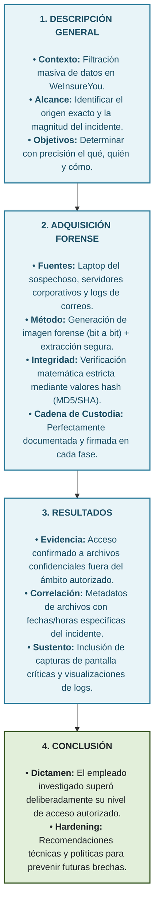
---

### Características clave del informe forense

| Característica | Propósito |
|----------------|-----------|
| **Descripción clara y concisa** | Explicar el proceso y metodología |
| **Resumen de evidencia** | Listar toda la evidencia reunida |
| **Descripción de análisis** | Explicar qué análisis se realizaron |
| **Conclusiones extraídas** | Presentar hallazgos de manera lógica |
| **Comprensible para no técnicos** | Abogados, jueces, jurados, ejecutivos deben entenderlo |

> **Regla de oro:** El informe forense debe ser **preciso, completo y comprensible** para audiencias no técnicas, sin perder **rigor técnico**.

### Preservación de datos

Las pruebas digitales pueden ser **muy frágiles**. El simple hecho de cambiar el formato de los archivos o abrir un archivo en un sistema operativo diferente puede provocar la **pérdida de datos**, lo que pone en peligro el alcance y la integridad de la investigación.

#### ¿Qué es la preservación de datos?

La **preservación de datos** se refiere al proceso de **proteger y salvaguardar** datos electrónicos para mantener su **integridad, autenticidad y usabilidad** para fines de investigación.

---

### Reglas generales para la preservación de datos

| Regla | Descripción |
|-------|-------------|
| **1. Crear una imagen de los datos** | Copia bit a bit exacta del dispositivo original |
| **2. Verificar la integridad de los datos** | Usar valores hash para confirmar que la copia es idéntica |
| **3. Seguir una cadena de custodia** | Documentar quién, cuándo y qué se hizo con la evidencia |

---

#### Regla 1: Crear una imagen de los datos

**¿Qué es una imagen forense?**
- Una copia **bit a bit** de **todos** los datos de un dispositivo
- Incluye: archivos visibles, **espacio libre** y **archivos eliminados**
- Es una **instantánea** exacta de lo que había en el dispositivo en ese momento

**Requisitos para crear la imagen:**

| Requisito | Por qué |
|-----------|---------|
| **Crear antes de abrir cualquier archivo** | Evita modificar los registros de acceso al sistema y archivos |
| **Almacenar en dispositivo cifrado** | Proteger la evidencia de accesos no autorizados |
| **Almacenar en lugar seguro** | Donde ninguna persona o cosa pueda alterar la evidencia |

> La imagen debe ser una **réplica exacta** de los datos originales sin modificaciones, ni siquiera en los registros de acceso.

---

#### Regla 2: Verificar la integridad de los datos

**¿Cómo se verifica?**
- Comparando los **valores hash** de los datos originales y la imagen
- Los **valores hash coincidentes** confirman que la imagen sigue siendo una copia auténtica del original

| Situación | Significado |
|-----------|-------------|
| Hash original = Hash de la imagen | ✅ La copia es **idéntica** (integridad confirmada) |
| Hash original ≠ Hash de la imagen | ❌ La copia **no es fiel** (algo cambió) |

> El equipo forense debe verificar la integridad de los datos **durante toda la investigación**, no solo al principio.

---

#### Regla 3: Seguir una cadena de custodia

**¿Qué debe documentarse?**

| Información | Descripción |
|-------------|-------------|
| **Quién** | La persona que accedió a la evidencia |
| **Cuándo** | Fecha y hora del acceso |
| **Qué** | Qué acción se realizó (transferir, copiar, analizar, etc.) |
| **Por qué** | Propósito de la manipulación |

> Los investigadores deben actualizar el formulario de cadena de custodia **cada vez que alguien manipula la evidencia**.

---

### 🛡️ Protocolo Esencial: Preservación de Datos y Reglas Generales

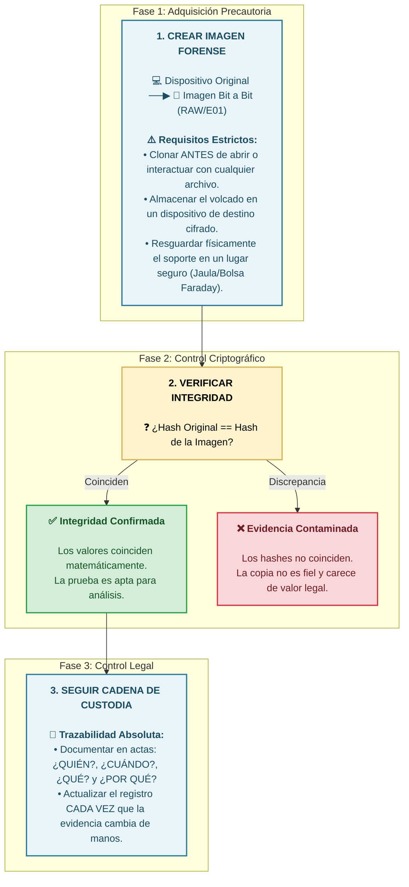
---

### Resumen de la preservación de datos

| Concepto | Explicación |
|----------|-------------|
| **Fragilidad de las pruebas digitales** | Cambiar formato, abrir archivos o usar diferente SO puede dañar los datos |
| **Preservación** | Proteger y salvaguardar datos para mantener integridad, autenticidad y usabilidad |
| **Imagen forense** | Copia bit a bit exacta, creada antes de manipular el original |
| **Verificación con hash** | Confirmar que la copia sigue siendo idéntica al original |
| **Cadena de custodia** | Registro detallado de cada manipulación de la evidencia |

> **Regla de oro:** Los investigadores nunca deben trabajar sobre el **original**. Siempre deben crear una **imagen forense verificada** y trabajar sobre esa copia, preservando el original intacto como evidencia irrefutable.

### Aspecto destacado de la gestión profesional: habilidades de resolución de problemas para expertos en análisis forense digital

#### Habilidades de gestión profesional

Para ser un investigador forense digital, necesitas habilidades de **resolución de problemas**.

---

#### ¿Qué es la resolución de problemas?

La **resolución de problemas** es el uso de la **lógica y la razón** para resolver un problema.

Implica usar:

| Habilidad | Descripción |
|-----------|-------------|
| **Pensamiento creativo** | Encontrar soluciones innovadoras |
| **Conocimiento** | Aplicar lo que se sabe |
| **Intuición** | Confiar en la experiencia |
| **Experiencia** | Aprender de casos anteriores |

> Los empleadores buscan candidatos que puedan **identificar problemas potenciales**, **formular metas**, **diseñar planes eficaces** y **tomar decisiones informadas**.

---

#### Resolución de problemas para el análisis forense digital

La capacidad de resolución de problemas es **esencial** para el análisis forense digital, ya que implica investigar problemas complejos, a menudo técnicos, en diversas circunstancias.

| Requisito | Descripción |
|-----------|-------------|
| **Abordar problemas críticamente** | Analizar con escepticismo profesional |
| **Método y lógica** | Seguir un proceso estructurado |
| **Identificar y definir problemas** | Saber exactamente qué se investiga |
| **Considerar información relevante** | Evaluar todas las fuentes de datos |
| **Seleccionar el mejor curso de acción** | Elegir la estrategia óptima |
| **Adaptarse rápidamente** | Responder a circunstancias cambiantes |
| **Anticipar obstáculos** | Prever problemas antes de que ocurran |
| **Comunicar conclusiones** | Explicar hallazgos a colegas y partes interesadas |

---

#### Combinación con atención al detalle

La resolución de problemas resulta **especialmente útil** cuando se combina con la **atención a los detalles**.

| Ejemplo | Aplicación |
|---------|-------------|
| **Analizar conjuntos de datos complejos** | Reconocer **pistas sutiles** que lleven a un descubrimiento |

---

#### Dependencia de conocimientos técnicos

La resolución de problemas en el análisis forense digital también depende de los **conocimientos técnicos**.

| Conocimiento necesario | Aplicación |
|------------------------|-------------|
| **Cómo funcionan los sistemas informáticos** | **Ingeniería inversa** de fuentes de datos para descubrir datos ocultos |
| **Estructura de los datos** | Entender cómo se organiza la información en los sistemas |
| **Almacenamiento de datos** | Saber cómo funciona en **dispositivos físicos** y en la **nube** |

> Estos conocimientos ayudan a los investigadores a decidir:
> - **Qué** datos recopilar
> - **Cómo** recopilarlos
> - **Cómo** examinarlos y analizarlos

---

### 🧠 Resolución de Problemas en Informática Forense Digital

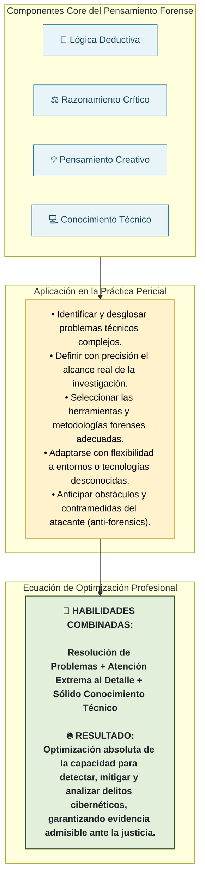
### Preguntas de autoevaluación

| Pregunta | Reflexión |
|----------|-----------|
| ¿Puedes identificar **problemas potenciales** antes de que surjan? | |
| ¿Puedes **formular metas y objetivos** y diseñar un plan eficaz para alcanzarlos? | |
| ¿Puedes **evaluar las opciones** y tomar decisiones informadas? | |

---

### Resumen

| Habilidad | Importancia en forense digital |
|-----------|-------------------------------|
| **Resolución de problemas** | Abordar investigaciones complejas de manera crítica y metódica |
| **Atención al detalle** | Reconocer pistas sutiles en conjuntos de datos complejos |
| **Conocimientos técnicos** | Entender sistemas, estructuras de datos y almacenamiento (físico y nube) |

> **Conclusión:** Al desarrollar y perfeccionar sus habilidades de resolución de problemas, los investigadores forenses digitales pueden **optimizar su capacidad** para detectar y analizar la ciberdelincuencia y ayudar a garantizar que se **haga justicia**.

### Mi respuesta a la actividad de reflexión

**Desafío:** Encuentro un nuevo método de cifrado que no esperaba durante una investigación forense digital.

**Cómo lo abordaría:**

1. **Reconozco el problema:** Identifico el cifrado como un obstáculo imprevisto y evalúo su alcance.

2. **Aplico pensamiento crítico:** No tomo decisiones apresuradas. Mantengo la integridad de la evidencia original (trabajo sobre copias forenses).

3. **Uso conocimientos técnicos:** Investigo qué tipo de cifrado podría ser y qué herramientas existen para tratarlo.

4. **Consulto con colegas:** Me comunico con otros investigadores forenses o expertos en criptografía.

5. **Investigación exhaustiva:** Busco documentación sobre métodos de cifrado similares.

6. **Evalúo opciones:** Reviso si hay software especializado, si puedo obtener la clave legalmente, o si puedo hacer ingeniería inversa.

7. **Documento el proceso:** Registro cada paso y mantengo la cadena de custodia actualizada.

8. **Anticipo obstáculos:** Si no puedo descifrarlo, busco fuentes alternativas de evidencia y planeo para futuras investigaciones.

**Conclusión:** Con resolución de problemas, atención al detalle y conocimientos técnicos, puedo sortear el desafío y seguir avanzando con precisión en la investigación.

## Resumen y perspectivas

### Resumen de la lección

En esta lección, aprendiste sobre las **cuatro fases del proceso forense digital**:

| Fase | Descripción |
|------|-------------|
| **1. Recopilación** | Identificar fuentes, recopilar datos, preservar integridad |
| **2. Examen** | Examinar datos recopilados, determinar relevancia, extraer información |
| **3. Análisis** | Analizar datos relevantes, sacar conclusiones, construir cronología |
| **4. Informes** | Crear informe detallado de hallazgos, compartir conclusiones |

#### Puntos clave aprendidos

Los investigadores forenses digitales emplean:

- **Conocimientos** (técnicos, legales, metodológicos)
- **Habilidades** (análisis, atención al detalle, resolución de problemas)
- **Herramientas** (software forense, visualización, descifrado)

> Un solo paso en falso en cualquier fase puede:
> - **Alterar** su evidencia
> - **Distorsionar** sus hallazgos
> - **Socavar** su investigación

---

### Perspectivas

**En la siguiente lección**, aprenderás sobre las **herramientas de análisis forense digital**.

Explorarás los **cuatro tipos de herramientas** que emplean los investigadores forenses digitales:

| Tipo de herramienta | Propósito |
|---------------------|-----------|
| **Adquisición y análisis** | Obtener y examinar datos forenses |
| **Análisis de clasificación** | Organizar y categorizar evidencia |
| **Creación de imágenes** | Crear copias bit a bit (imágenes forenses) |
| **Recuperación** | Restaurar datos borrados o dañados |

También practicarás su uso en un **escenario realista**.

---

## 🗺️ El Camino Defensivo: Clasificación de Herramientas Forenses

La siguiente fase se enfoca en la aplicación práctica y el despliegue operativo de soluciones de software forense dentro de escenarios e incidentes del mundo real.

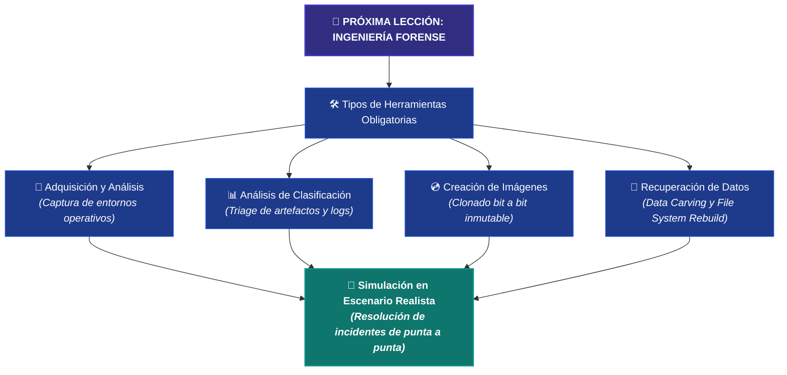

---


### Ciencia forense de sistemas digitales

| Lección | Temas cubiertos |
|---------|-----------------|
| **Introducción** | Definición, fuentes de datos, consideraciones legales |
| **Cadena de custodia** | Documentación, integridad, admisibilidad legal |
| **Preservación de datos** | Imagen forense, hash, verificación |
| **Fases del proceso** | Recopilación, examen, análisis, informes |
| **Habilidades** | Resolución de problemas, atención al detalle, comunicación |

### Acerca de esta lección: Herramientas forenses digitales

Para tener éxito en cualquier carrera profesional en ciberseguridad, debes conocer más que solo los conceptos clave relevantes para tu trabajo. Debes conocer **las herramientas adecuadas** para el trabajo y la **forma correcta de usarlas**.

Si aspiras a una carrera en análisis forense digital, tendrás **muchas herramientas** para elegir.

#### En esta lección aprenderás

- Las **herramientas que emplean los investigadores** a lo largo del proceso de análisis forense digital
- Los **propósitos** a los que sirven estas herramientas
- **Herramientas y técnicas específicas** para trabajar con datos
- Practicar el uso de **herramientas estándar** para analizar evidencia forense digital

---

### Tipos de herramientas forenses digitales

| Tipo | Propósito |
|------|-----------|
| **Adquisición y análisis** | Obtener y examinar datos forenses |
| **Análisis de clasificación** | Organizar y categorizar evidencia |
| **Creación de imágenes** | Crear copias bit a bit (imágenes forenses) |
| **Recuperación** | Restaurar datos borrados o dañados |

### Elegir las herramientas forenses digitales adecuadas

#### Evolución de la ciencia forense digital

La disciplina de la ciencia forense digital comenzó cuando los datos y dispositivos digitales (como las computadoras) se volvieron habituales. Al principio, analizar estos dispositivos era **sencillo**.

Pero la tecnología evolucionó en las últimas décadas:

| Avance tecnológico | Impacto en la forensia |
|--------------------|------------------------|
| **Teléfonos inteligentes** | Nuevas fuentes de datos |
| **Plataformas de redes sociales** | Datos en la nube, evidencia de comunicaciones |
| **Almacenamiento en la nube** | Datos remotos, acceso complejo |
| **Dispositivos IoT** | Múltiples fuentes de datos |
| **Multimedia** | Imágenes, videos, grabaciones de audio (no solo texto y números) |

> A medida que aumentaba la **cantidad y complejidad** de los datos, también aumentaba la necesidad de **herramientas especializadas**.

---

#### ¿Qué son las herramientas forenses digitales?

Las **herramientas forenses digitales** son **hardware o software** que:

| Función | Descripción |
|---------|-------------|
| **Recopilan** | Obtener evidencia digital de diversas fuentes |
| **Extraen** | Aislar datos relevantes |
| **Clasifican** | Organizar y categorizar evidencia |
| **Preservan** | Mantener la integridad de los datos |
| **Recuperan** | Restaurar datos borrados o dañados |

---

### Criterios para elegir herramientas forenses

| Criterio | Preguntas a considerar |
|----------|------------------------|
| **Características de la herramienta** | ¿Para qué se usará? ¿Con qué tipo de datos se trabajará? ¿En qué formato se almacenarán? |
| **Confiabilidad y precisión** | ¿La herramienta fue probada y avalada? ¿Tiene historial comprobado en investigaciones similares? ¿Confían en ella? |
| **Facilidad de uso** | ¿Qué conocimientos técnicos y experiencia se necesitan? ¿Tiene GUI o solo línea de comandos? |
| **Asequibilidad** | ¿Cuánto cuesta? ¿Está dentro del presupuesto? |

---

#### Ejemplo de aplicación de criterios

| Situación | Herramienta adecuada |
|-----------|---------------------|
| Extraer direcciones de correo electrónico de un archivo de imagen de disco y almacenarlas en un archivo de texto | Herramienta con capacidad de **búsqueda de palabras clave** y **exportación** |
| Realizar análisis de líneas de tiempo | Herramientas como **Autopsy** |
| Investigador con poca experiencia técnica | Herramienta con **interfaz gráfica (GUI)** fácil de usar |
| Investigador experto en línea de comandos | Herramienta CLI (puede ser más potente pero menos amigable) |

---

### Herramientas gratuitas vs. pagas

| Tipo | Ventajas | Desventajas |
|------|----------|-------------|
| **Código abierto / gratuitas** | ✅ Asequibles (sin costo)<br>✅ Buena para tareas básicas | ⚠️ Pueden tener menos funciones |
| **Comerciales / pagas** | ✅ Más complejas y potentes<br>✅ Soporte técnico | ❌ Pueden ser **costosas** |

---

### 🛠️ Matriz de Decisión: Selección de Herramientas Forenses

```mermaid
graph TD
    %% Configuración de Estilos y Colores para el proceso de selección
    classDef criterio fill:#e8f4f8,stroke:#2b7b9b,stroke-width:2px,color:#1a4d63;
    classDef validacion fill:#e2efda,stroke:#375623,stroke-width:2px,color:#212529;

    C1["<b>1. CARACTERÍSTICAS TÉCNICAS (¿Qué hace?)</b><br><br>• <b>Función:</b> ¿Recopilar (clonado), extraer artefactos o clasificar evidencia?<br>• <b>Tipo de datos:</b> Archivos de sistema, logs, volcado de RAM, imágenes, correos.<br>• <b>Entregable:</b> Formato de salida requerido para el reporte (Texto plano, CSV, reporte integrado)."]:::criterio
    
    C2["<b>2. CONFIABILIDAD Y VALIDEZ LEGAL (¿Es reproducible?)</b><br><br>• ¿La herramienta está probada y avalada por la comunidad internacional (NIST, CFTT)?<br>• ¿Tiene historial comprobado de aceptación en tribunales de justicia?<br>• ¿Mantiene la integridad de la prueba sin alterar un solo bit?"]:::criterio
    
    C3["<b>3. FACILIDAD DE USO Y CURVA DE APRENDIZAJE (¿Cómo se opera?)</b><br><br>• <b>Interfaz:</b> ¿Requiere entorno gráfico (GUI) o línea de comandos avanzada (CLI)?<br>• <b>Especialización:</b> ¿Qué nivel de capacitación técnica se necesita para operarla sin errores?"]:::criterio
    
    C4["<b>4. ASEQUIBILIDAD Y LICENCIAMIENTO (¿Es viable?)</b><br><br>• ¿Cuál es el costo del software y el mantenimiento de las firmas de soporte?<br>• ¿Se optará por herramientas comerciales (EnCase, FTK) o soluciones Open Source (Autopsy, SIFT)?<br>• ¿Se encuadra dentro del presupuesto anual del equipo de Incident Response?"]:::criterio

    ELEGIDA{{"🎯 HERRAMIENTA SELECCIONADA<br>e Incorporada al Kit Forense"}}:::validacion

    %% Flujo del embudo de decisión
    C1 --> C2 --> C3 --> C4 --> ELEGIDA

```
---

### Resumen de la selección de herramientas

| Criterio | Por qué es importante |
|----------|----------------------|
| **Características** | La herramienta debe hacer lo que se necesita |
| **Confiabilidad** | Los hallazgos deben ser defendibles en un tribunal |
| **Facilidad de uso** | Ahorra tiempo y reduce errores |
| **Asequibilidad** | Debe ajustarse al presupuesto del caso/organización |

> **Regla de oro:** La mejor herramienta es la que **cumple con los requisitos del caso**, es **confiable**, puede ser **utilizada correctamente por el investigador** y está **dentro del presupuesto**.

### Objetivos de las herramientas forenses digitales

Los investigadores emplean herramientas forenses digitales durante la mayor parte del proceso de análisis forense digital. Los **tipos y la cantidad** de herramientas necesarias dependen de:

- Los **objetivos** de la investigación
- Las **fuentes de datos** disponibles
- Los **datos** específicos a analizar

---

### Los 4 objetivos principales de las herramientas forenses

| Objetivo | Descripción | Herramientas de ejemplo |
|----------|-------------|------------------------|
| **1. Adquisición y análisis** | Recopilar y analizar evidencia digital de fuentes de datos (discos duros, tarjetas de memoria) | EnCase Forensic, Autopsy, FTK Imager, Volatility |
| **2. Clasificación** | Analizar rápidamente grandes cantidades de datos en busca de archivos o palabras clave importantes | Belkasoft Evidence Center, Bulk Extractor, EnCase Portable, BlackLight |
| **3. Creación de imágenes** | Crear una imagen digital (copia fiel al original) de discos duros, USBs u otros medios | X-Ways Forensics, Foremost, FTK Imager |
| **4. Recuperación** | Recuperar archivos eliminados o inaccesibles | PhotoRec, TestDisk, R-Studio, Recuva |

---

#### 1. Herramientas de adquisición y análisis

**Propósito:** Recopilar y analizar evidencia digital de fuentes de datos.

| Función | Ejemplo |
|---------|---------|
| Buscar palabras clave o cadenas de caracteres dentro de bloques de datos | EnCase Forensic |
| Descubrir archivos ocultos y eliminados | EnCase Forensic |
| Análisis forense general | Autopsy, FTK Imager, Volatility |

> **Herramienta estándar de la industria:** EnCase Forensic

---

#### 2. Herramientas de clasificación

**Propósito:** Analizar rápidamente **grandes cantidades** de datos adquiridos en busca de archivos o palabras clave importantes.

| Función | Ejemplo |
|---------|---------|
| Examinar espacio no asignado o volcados de memoria en busca de nombres de usuario, correos electrónicos y tipos de archivos específicos | Belkasoft Evidence Center |
| Clasificación de datos a gran escala | Bulk Extractor, Electronic Evidence Examiner, EnCase Portable, BlackLight |

---

#### 3. Herramientas de creación de imágenes

**Propósito:** Crear una **imagen digital (copia fiel al original)** de una unidad de disco duro, memoria USB u otro medio de almacenamiento.

| Función | Ejemplo |
|---------|---------|
| Obtener imágenes rápidas de cualquier medio de almacenamiento | X-Ways Forensics |
| Creación de imágenes forenses | Foremost, FTK Imager |

> La herramienta X-Ways Forensics es especialmente útil para **obtener imágenes rápidas** de cualquier medio de almacenamiento.

---

#### 4. Herramientas de recuperación

**Propósito:** Recuperar **archivos eliminados o inaccesibles**, proporcionando evidencia valiosa en algunos casos.

| Función | Ejemplo |
|---------|---------|
| Recuperar datos de imágenes dañadas o corruptas | PhotoRec |
| Recuperación de archivos eliminados | TestDisk, R-Studio, Recuva |

---

### 🛠️ Clasificación del Stack Tecnológico según Objetivos Forenses

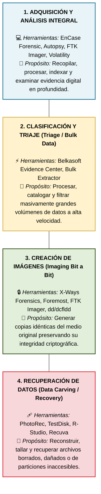
---

### Tabla resumen de herramientas por objetivo

| Objetivo | Herramientas clave | Uso principal |
|----------|-------------------|---------------|
| **Adquisición y análisis** | EnCase Forensic, Autopsy, FTK Imager, Volatility | Buscar palabras clave, descubrir archivos ocultos/eliminados |
| **Clasificación** | Belkasoft, Bulk Extractor, EnCase Portable | Examinar espacio no asignado, volcados de memoria |
| **Creación de imágenes** | X-Ways Forensics, Foremost, FTK Imager | Copia bit a bit de discos y USBs |
| **Recuperación** | PhotoRec, TestDisk, R-Studio, Recuva | Recuperar archivos dañados, corruptos o eliminados |

---

### Nota importante

> Las herramientas de **creación de imágenes** son fundamentales porque permiten trabajar sobre **copias exactas** (imágenes forenses) preservando el **original intacto** como evidencia irrefutable.


### Creación de imágenes - FTK Imager

#### Escenario de ejemplo

Imagina que eres un trabajador de TI. Tu jefa sospecha que un empleado resentido **borró archivos** que contenían datos importantes del cliente. Te asigna la tarea de encontrar y recuperar esos archivos.

**El problema:**  
Si los archivos aún existen, están en la unidad de disco duro de la computadora del empleado.

**El riesgo:**  
Puedes trabajar directamente en esa unidad, pero la recuperación de archivos puede complicarse. Si accidentalmente **sobrescribes o corrompes** estos archivos, podrías perder los datos **para siempre**.

**La solución:**  
Crear una **imagen** de la unidad y trabajar sobre esa imagen para recuperar los archivos.

---

#### ¿Por qué crear una imagen forense?

Una **imagen** es una copia **bit por bit** de **todos** los datos de un dispositivo, incluyendo:

| Tipo de dato | Incluido en la imagen |
|--------------|----------------------|
| Archivos visibles | ✅ Sí |
| Espacio libre | ✅ Sí |
| Archivos eliminados | ✅ Sí |

> Con una imagen, el investigador puede **estudiar y manipular** una copia precisa de los datos sin comprometer el original.

---

#### Bloqueadores de escritura

**¿Qué es un bloqueador de escritura?**  
Un dispositivo que **bloquea cualquier comando de escritura** enviado a un dispositivo de almacenamiento.

**¿Por qué es importante?**

| Con bloqueador de escritura | Sin bloqueador de escritura |
|----------------------------|----------------------------|
| ✅ Se asegura de no alterar accidentalmente la fuente de datos | ❌ Riesgo de modificar accidentalmente la evidencia original |
| ✅ Se puede crear la imagen sin comprometer la integridad | ❌ La evidencia podría ser inadmisible en un tribunal |

> Los investigadores suelen conectar la fuente de datos (disco duro) a un **bloqueador de escritura** antes de crear una imagen.

---

#### FTK Imager

**¿Qué es FTK Imager?**  
Una de las herramientas de creación de imágenes más **confiables**. Es una herramienta de **código abierto** para crear imágenes de disco sin riesgo de realizar cambios en la fuente de datos original.

**Disponibilidad:**

| Sistema operativo | Interfaz |
|-------------------|----------|
| **Microsoft Windows** | GUI (interfaz gráfica) y línea de comandos |
| **Linux** | Solo línea de comandos |

---

#### Tareas que puedes realizar con FTK Imager

| Tarea | Descripción |
|-------|-------------|
| **Crear imágenes** | De discos duros, disquetes, CD, DVD, carpetas y archivos |
| **Crear y comparar valores hash** | Confirmar la integridad de la imagen (coincidencia con el original) |
| **Vista previa de datos** | Ver los datos de la fuente sin riesgo de dañarla (ahorra tiempo al decidir si vale la pena analizar) |
| **Montar imagen** | Vista previa de solo lectura (similar a un dispositivo conectado a un bloqueador de escritura) |

---

### 🖥️ Guía de Procedimiento: Flujo de Trabajo con FTK Imager

```mermaid
graph TD
    %% Configuración de Estilos y Colores
    classDef hardware fill:#f8d7da,stroke:#dc3545,stroke-width:2px,color:#721c24,font-weight:bold;
    classDef proceso fill:#e8f4f8,stroke:#2b7b9b,stroke-width:2px,color:#1a4d63;
    classDef verificacion fill:#fff2cc,stroke:#d6b656,stroke-width:2px,color:#000000;
    classDef analisis fill:#e2efda,stroke:#375623,stroke-width:2px,color:#212529;

    P1["<b>1. CONECTAR BLOQUEADOR DE ESCRITURA (Write-Blocker)</b><br><br>🛡️ <i>Seguridad Física:</i><br>• Intercepta comandos de modificación a nivel de firmware.<br>• Protege la fuente de datos original contra alteraciones del S.O."]:::hardware
    
    P2["<b>2. CREAR IMAGEN FORENSE EN FTK IMAGER</b><br><br>💾 <i>Adquisición:</i><br>• Realiza una copia bit a bit (clonación exacta sector por sector).<br>• Formato recomendado: <b>E01 (Expert Witness Format)</b> o <b>RAW/DD</b>."]:::proceso
    
    P3["<b>3. CALCULAR HASH CRIPTOGRÁFICO</b><br><br>🧮 <i>Procesamiento:</i><br>• El software calcula automáticamente las firmas matemáticas.<br>• Algoritmos utilizados en el reporte: <b>MD5</b> y <b>SHA-1 / SHA-256</b>."]:::proceso
    
    P4["<b>4. VERIFICAR INTEGRIDAD</b><br><br>🔍 <i>Auditoría:</i><br>• Comparación estricta: Hash(Original) == Hash(Imagen Forense).<br>• Si coinciden: Se valida legalmente la copia fiel para el juzgado."]:::verificacion
    
    P5["<b>5. TRABAJAR EXCLUSIVAMENTE SOBRE LA IMAGEN</b><br><br>🔬 <i>Fase de Laboratorio:</i><br>• Montar la imagen para analizar, examinar artefactos y recuperar archivos.<br>• 🔒 <b>El dispositivo original permanece intacto, preservado y bajo llave.</b>"]:::analisis

    %% Flujo secuencial descendente
    P1 --> P2 --> P3 --> P4 --> P5
```
---

#### Ventaja clave de la vista previa

> Con FTK Imager, puedes obtener una **vista previa** de los datos de la fuente sin el riesgo de dañarlos. Esto te permite decidir si los datos merecen un análisis adicional, posiblemente **ahorrando tiempo y esfuerzo** en la obtención de imágenes de datos inservibles.

---

#### Montar una imagen

Montar una imagen permite una **vista previa de solo lectura**, similar a montar un dispositivo de almacenamiento conectado a un bloqueador de escritura. Con esta vista previa, puedes examinar el contenido de la imagen **tal como lo hizo el usuario** con la fuente de datos original.

---

### Resumen: Creación de imágenes con FTK Imager

| Concepto | Explicación |
|----------|-------------|
| **Bloqueador de escritura** | Dispositivo que evita modificaciones accidentales al original |
| **Imagen forense** | Copia bit a bit (incluye archivos eliminados y espacio libre) |
| **Hash** | Verifica que la imagen es idéntica al original |
| **FTK Imager** | Herramienta gratuita para crear imágenes forenses |
| **Vista previa** | Permite examinar datos sin comprometer el original |

> **Regla de oro:** Nunca trabajes directamente sobre el original. Siempre crea una **imagen forense verificada** y trabaja sobre esa copia.

### Recuperación de datos

#### Escenario de ejemplo (continuación)

Eres un informático que intenta encontrar **archivos borrados** en el disco duro de un empleado. Tras crear una **imagen** de la unidad, la examinas para determinar si puedes recuperar los archivos borrados.

#### ¿Qué es la recuperación de datos?

La **recuperación de datos** es un proceso para recuperar datos **perdidos, eliminados, dañados o inaccesibles**.

> La recuperación de datos ayuda a los investigadores a encontrar **todos los datos forenses relevantes** en un dispositivo.

#### Desafíos en la recuperación

| Desafío | Ejemplo |
|---------|---------|
| Archivos **borrados** | El sospechoso eliminó archivos incriminatorios |
| Archivos **cifrados** | El sospechoso protegió los archivos con contraseña |
| Datos **dañados** | El dispositivo sufrió daño físico o lógico |

> Con las **herramientas de recuperación**, los investigadores pueden descubrir esos archivos y cerrar el caso.

---

### Analogía: La casa de juguete de Felipe

Para explicar cómo funciona la recuperación de datos, usemos una analogía con un juego de construcción.

---

#### Paso 1: Construir la casa

| Situación | Analogía forense |
|-----------|------------------|
| Felipe recibe un juego de construcción y sigue el manual para construir una casa | Un usuario guarda un archivo en el disco duro (los datos se escriben de manera ordenada) |

---

#### Paso 2: La casa desaparece

| Situación | Analogía forense |
|-----------|------------------|
| La casa se cae del estante y se rompe | El archivo se **marca como borrado** (los datos aún existen, pero el sistema ya no los ve) |
| Las piezas se dispersan por la habitación | Los datos del archivo se esparcen por el disco |

---

#### Paso 3: Las piezas se mezclan con otras

| Situación | Analogía forense |
|-----------|------------------|
| La hermana guarda las piezas en un contenedor con cientos de piezas similares | Los datos del archivo se mezclan con otros datos (el espacio se marca como disponible y puede ser sobrescrito) |

---

#### Paso 4: Encontrar el manual

| Situación | Analogía forense |
|-----------|------------------|
| Felipe encuentra el manual de instrucciones | El **sistema de archivos** conserva la "receta" de cómo estaba organizado el archivo |

---

#### Paso 5: Reconstruir la casa

| Situación | Analogía forense |
|-----------|------------------|
| Felipe sigue el manual para encontrar y ensamblar las piezas | Un investigador usa **herramientas forenses** para recuperar y reconstruir el archivo borrado |

---

### 🧩 Analogía Conceptual: Recuperación de Datos vs. Casa de Juguete

```mermaid
chronology
    title Línea Comparativa: El Proceso de Reconstrucción de Datos
    box El Mundo Físico (Juguete)
        Casa construida
        La casa se rompe
        Piezas dispersas por el suelo
        Piezas mezcladas con otros juguetes
        Se encuentra el manual de instrucciones
        Casa reensamblada por completo
    end
    box El Mundo Digital (Disco Rígido)
        Archivo guardado en sectores
        Archivo "borrado" (Puntero eliminado)
        Datos esparcidos en los clústeres
        Espacio marcado como disponible (Slack/Unallocated)
        Sistema de archivos consultado (Firmas Mágicas)
        Archivo recuperado exitosamente
    end

```
---

### Lecciones de la analogía

| Concepto forense | Explicación |
|------------------|-------------|
| **Borrado no es eliminación** | Cuando un archivo se "borra", el sistema solo marca su espacio como disponible. Los datos siguen ahí hasta que se sobrescriben |
| **Importancia de actuar rápido** | Cuanto más tiempo pase, más probabilidad de que los datos borrados sean sobrescritos |
| **Sistema de archivos como manual** | El sistema de archivos conserva metadatos que ayudan a reconstruir la estructura original |
| **Herramientas forenses** | Permiten encontrar y reconstruir archivos incluso cuando están fragmentados o mezclados |

---

### Herramientas de recuperación comunes

| Herramienta | Tipo | Uso principal |
|-------------|------|---------------|
| **PhotoRec** | Gratuita | Recuperar datos de imágenes dañadas o corruptas |
| **TestDisk** | Gratuita | Recuperar particiones perdidas y reparar discos |
| **R-Studio** | Paga | Recuperación avanzada de datos |
| **Recuva** | Gratuita/Paga | Recuperación de archivos eliminados en Windows |

---

### Resumen de recuperación de datos

| Concepto | Explicación |
|----------|-------------|
| **Recuperación de datos** | Proceso para recuperar datos perdidos, eliminados, dañados o inaccesibles |
| **Archivo "borrado"** | El sistema solo marca el espacio como disponible; los datos permanecen hasta ser sobrescritos |
| **Importancia de la imagen forense** | Permite trabajar sobre una copia sin riesgo de dañar el original |
| **Herramientas de recuperación** | Permiten descubrir archivos que el sospechoso creía eliminados |

> **Regla de oro:** Actúa rápido. Cuanto más tiempo pase, mayor es el riesgo de que los datos borrados sean **sobrescritos** y se pierdan para siempre.

### Recuperación de datos - Conceptos avanzados y Autopsy

#### La analogía completa: Casa de juguete vs. archivo borrado

| Elemento de la analogía | Significado forense |
|------------------------|---------------------|
| **Casa de juguete** | Un archivo completo y funcional |
| **La casa se rompe** | El archivo se **marca como borrado** |
| **Piezas dispersas por la habitación** | Los datos del archivo se **esparcen** por el disco |
| **Contenedor grande con cientos de piezas** | El **sistema de archivos** (contiene miles o millones de piezas de otros archivos) |
| **Manual de instrucciones** | Los **metadatos** del archivo (indican dónde están las piezas y cómo ensamblarlas) |
| **Reconstruir la casa con el manual** | **Recuperar** el archivo usando herramientas forenses |

---

### ¿Qué ocurre cuando se borra un archivo?

Con los sistemas de archivos más comunes, **borrar un archivo no lo elimina por completo**, al menos no al principio.

| Proceso | Explicación |
|---------|-------------|
| **Marcar espacio como disponible** | El sistema de archivos marca el espacio que ocupaba el archivo como **libre** |
| **El archivo permanece** | Hasta que alguien **sobrescriba** ese espacio con nuevos datos, el archivo sigue ahí |
| **Se borran metadatos** | Borrar el archivo solo elimina **parte** de sus metadatos |

> Si nadie sobrescribió los metadatos, los investigadores pueden usarlos (junto con herramientas de recuperación) para **recuperar el archivo**.

---

### Tallado de datos (Data Carving)

#### ¿Qué es el tallado de datos?

El **tallado de datos** es el proceso de extraer datos de un dispositivo de almacenamiento **sin depender del sistema de archivos o los metadatos**.

#### ¿Cómo funciona?

| Paso | Explicación |
|------|-------------|
| 1 | El software busca en los **datos sin procesar** (raw data) del dispositivo |
| 2 | Los algoritmos buscan **encabezados y pies de página** exclusivos de tipos de archivo (.doc, .jpeg, .pdf) |
| 3 | Cuando identifica un patrón asociado con un tipo de archivo, **extrae y reconstruye** el archivo |

#### ¿Cuándo es más efectivo?

| Situación | Efectividad |
|-----------|-------------|
| **Archivo creado y almacenado de una sola vez** | ✅ Mejores resultados (se almacena en una gran parte contigua) |
| **Archivo almacenado en múltiples sesiones** | ⚠️ Menos eficaz (se propaga en fragmentos más pequeños) |

> El archivo recuperado puede no tener su **nombre original**, ni metadatos, e incluso pueden faltar algunas piezas. Pero **se podrá acceder a partes del archivo**.

---

### Autopsy - Herramienta de recuperación de código abierto

**Autopsy** es una herramienta de recuperación de datos de **código abierto** para Windows, Linux y macOS.

**¿Qué es Autopsy?**  
Es una **interfaz gráfica (GUI)** para **The Sleuth Kit (TSK)** , una colección diversa de aplicaciones de línea de comandos para investigar imágenes de disco.

---

#### Métodos de análisis con Autopsy

| Método | Descripción |
|--------|-------------|
| **Análisis del sistema de archivos** | Ver archivos, directorios y metadatos para identificar archivos sospechosos o datos borrados |
| **Análisis de imágenes** | Extraer metadatos de archivos gráficos (.jpg, .png) |
| **Análisis de cronología** | Ver historial cronológico de la actividad del sistema de archivos |
| **Búsqueda de palabras clave** | Buscar palabras específicas relevantes para la investigación |

---

#### 1. Análisis del sistema de archivos

| Información que se puede obtener | Aplicación forense |
|--------------------------------|-------------------|
| Fecha de creación del archivo | Identificar cuándo se generó la evidencia |
| Fecha de modificación | Detectar alteraciones |
| Fecha de acceso | Saber quién pudo haber visto el archivo |
| Archivos borrados | Recuperar evidencia eliminada |

> Esta información puede ayudar a identificar **usuarios no autorizados** que accedieron a datos o intentaron ocultar o borrar archivos robados.

---

#### 2. Análisis de imágenes

| Metadato que se puede extraer | Aplicación forense |
|------------------------------|-------------------|
| **Fecha y hora** | Cuándo se tomó la foto |
| **Ubicación geográfica (GPS)** | Dónde se tomó la foto |
| **Dispositivo** | Qué cámara o teléfono se usó |
| **Ediciones o manipulaciones** | Detectar si la imagen fue alterada |
| **Imágenes ocultas o borradas** | Recuperar evidencia que el sospechoso creía eliminada |

---

#### 3. Análisis de cronología

| Información que se puede obtener | Aplicación forense |
|--------------------------------|-------------------|
| Secuencia de eventos (modificación, copia, acceso) | Determinar **quién** tuvo acceso a los datos en ese momento |
| Patrones de comportamiento | Qué aplicaciones usaba o qué sitios web visitaba frecuentemente |
| Cómo se eliminaron los datos | Entender el método usado para borrar evidencia |

---

#### 4. Búsqueda de palabras clave

**¿Qué es una palabra clave?**  
Una palabra específica relevante para la investigación (ej. "transferencia", "transferencia bancaria", "pago", "cuenta").

**Ejemplo:** En un caso de posible fraude, se buscarían palabras clave relacionadas con transacciones financieras.

---

### 🔬 Métodos de Análisis e Ingesta en Autopsy Forensics

```mermaid
graph TD
    %% Configuración de Estilos y Colores por categoría analítica
    classDef filesys fill:#e8f4f8,stroke:#2b7b9b,stroke-width:2px,color:#000000;
    classDef img fill:#fff2cc,stroke:#d6b656,stroke-width:2px,color:#000000;
    classDef timeline fill:#e2efda,stroke:#375623,stroke-width:2px,color:#000000;
    classDef keyword fill:#f8d7da,stroke:#dc3545,stroke-width:2px,color:#000000;

    M1["<b>1. ANÁLISIS DEL SISTEMA DE ARCHIVOS</b><br><br>📁 <i>Alcance técnico:</i><br>• Reconstrucción de la estructura de directorios y volumen.<br>• Examen profundo de metadatos del sistema (Inodos/MFT).<br>• Identificación y filtrado de archivos sospechosos o eliminados."]:::filesys
    
    M2["<b>2. ANÁLISIS DE IMÁGENES Y MULTIMEDIA</b><br><br>📸 <i>Alcance técnico:</i><br>• Extracción de metadatos EXIF (Coordenadas GPS, modelo, marcas de tiempo).<br>• Detección de anomalías en firmas o compresión (Edición/Manipulación).<br>• Recuperación mediante tallado de datos (Carving) de archivos ocultos."]:::img
    
    M3["<b>3. ANÁLISIS DE CRONOLOGÍA (Timelining)</b><br><br>⏱️ <i>Alcance técnico:</i><br>• Consolidación del historial unificado de actividad (Fechas MACB).<br>• Correlación de eventos para modelar el comportamiento del usuario.<br>• Reconstrucción del vector de ataque y la ventana de eliminación de datos."]:::timeline
    
    M4["<b>4. BÚSQUEDA DE PALABRAS CLAVE (Keyword Search)</b><br><br>🔍 <i>Alcance técnico:</i><br>• Indexación de texto en tiempo real (archivos de texto, PDFs, correos, Slack).<br>• Consultas indexadas y expresiones regulares (Regex) a nivel binario.<br>• <i>Ejemplo:</i> Filtrado de 'transferencia', 'pago' o 'cuenta' en fraudes."]:::keyword

    %% Disposición apilada limpia
    M1 --- M2 --- M3 --- M4
```
---

### Resumen de conceptos clave

| Concepto | Explicación |
|----------|-------------|
| **Recuperación de archivos borrados** | El archivo permanece hasta ser sobrescrito; los metadatos ayudan a reconstruirlo |
| **Tallado de datos** | Extraer datos sin depender del sistema de archivos o metadatos |
| **Autopsy** | Herramienta GUI gratuita para análisis forense (basada en The Sleuth Kit) |
| **Análisis de sistema de archivos** | Ver archivos, directorios, metadatos |
| **Análisis de imágenes** | Extraer metadatos de fotos (fecha, GPS, dispositivo) |
| **Análisis de cronología** | Historial cronológico de actividad |
| **Búsqueda de palabras clave** | Buscar términos relevantes en los datos |

> **Regla de oro:** Cuanto más rápido se actúe después de la eliminación, mayor será la probabilidad de recuperar exitosamente los archivos borrados.

### Actividad práctica: Caso de George Smith - Happ Industries

#### Antecedentes del caso

| Elemento | Detalle |
|----------|---------|
| **Sospechoso** | George Smith, empleado de Happ Industries |
| **Situación** | Suspendido a la espera de investigación por conducta inapropiada |
| **Sospecha** | Robo de datos confidenciales de clientes (incluyendo números de tarjetas de crédito) |
| **Hallazgo** | Una memoria USB personal en el escritorio de George (contra las políticas de la empresa) |
| **Defensa de George** | Afirmó que formateó la USB para recuperación del sistema, pero que **no almacenó archivos** en ella |

#### Tarea asignada

> Analizar la memoria USB para encontrar **cualquier dato existente o eliminado** relevante para el caso.

---

### 🕵️‍♂️ Caso George Smith: Flujo de Trabajo en el Proceso Forense

```mermaid
graph TD
    %% Configuración de Estilos y Colores para el flujo del caso de estudio
    classDef recopilacion fill:#e8f4f8,stroke:#2b7b9b,stroke-width:2px,color:#1a4d63;
    classDef examen fill:#fff2cc,stroke:#d6b656,stroke-width:2px,color:#000000;
    classDef analisis fill:#f8d7da,stroke:#dc3545,stroke-width:2px,color:#721c24;
    classDef informe fill:#e2efda,stroke:#375623,stroke-width:2px,color:#212529;

    F1["<b>1. RECOPILACIÓN (Preservación)</b><br><br>• <b>Identificar fuente:</b> Memoria USB bajo investigación.<br>• <b>Protección:</b> Conexión estricta a un bloqueador de escritura físico.<br>• <b>Duplicación:</b> Creación de imagen forense idéntica bit a bit.<br>• <b>Integridad:</b> Cálculo de hash (MD5/SHA) para validación matemática."]:::recopilacion
    
    F2["<b>2. EXAMEN (Procesamiento de Datos)</b><br><br>• <b>Exploración:</b> Examinar exhaustivamente los datos dentro del contenedor.<br>• <b>Visibilidad:</b> Identificar tanto archivos existentes como eliminados (Carving).<br>• <b>Foco:</b> Filtrado y aislamiento de datos confidenciales relacionados con clientes."]:::examen
    
    F3["<b>3. ANÁLISIS (Correlación y Deducción)</b><br><br>• <b>Artefactos:</b> Analizar en profundidad los metadatos de los archivos (Fechas MAC).<br>• <b>Línea de tiempo:</b> Construir la cronología exacta de accesos y modificaciones.<br>• <b>Patrones:</b> Detectar comportamientos anómalos o actividad sospechosa del usuario."]:::analisis
    
    F4["<b>4. INFORMES (Sustento Legal)</b><br><br>• <b>Documentación:</b> Redacción formal de los hallazgos técnicos sin ambigüedades.<br>• <b>Garantía:</b> Preservar y adjuntar el acta de la cadena de custodia.<br>• <b>Presentación:</b> Exposición clara de la evidencia ante el comité o tribunal."]:::informe

    %% Flujo secuencial descendente
    F1 --> F2 --> F3 --> F4
```

---

### Preguntas clave de la investigación

| Pregunta | Método forense |
|----------|----------------|
| ¿George formateó realmente la USB? | Analizar sistema de archivos, buscar evidencia de formateo |
| ¿Almacenó datos confidenciales antes del formateo? | Recuperar archivos eliminados con herramientas como PhotoRec o Autopsy |
| ¿Qué datos estaban en la USB? | Examinar archivos existentes y recuperar los borrados |
| ¿Cuándo se almacenaron/accedieron? | Analizar metadatos (fechas de creación, modificación, acceso) |

---

### Herramientas forenses aplicables

| Fase | Herramienta | Propósito |
|------|-------------|-----------|
| **Adquisición** | FTK Imager | Crear imagen forense de la USB |
| **Adquisición** | Bloqueador de escritura | Proteger la evidencia original |
| **Recuperación** | Autopsy / PhotoRec / TestDisk | Recuperar archivos eliminados |
| **Análisis** | Autopsy | Análisis de sistema de archivos, metadatos, cronología |
| **Búsqueda** | Búsqueda de palabras clave | Buscar números de tarjetas de crédito, datos de clientes |

---

### ¿Qué buscar en la memoria USB?

| Tipo de evidencia | Dónde buscar |
|-------------------|--------------|
| **Archivos existentes** | Sistema de archivos actual |
| **Archivos eliminados** | Espacio no asignado (recuperación) |
| **Metadatos** | Fechas de creación, modificación, acceso |
| **Datos de clientes** | Búsqueda de palabras clave (números de tarjeta, nombres) |
| **Historial de accesos** | Análisis de cronología |

---

### Posibles hallazgos

| Hallazgo | Implicación |
|----------|-------------|
| ✅ Archivos con datos de clientes encontrados | George mintió sobre no almacenar archivos |
| ✅ Archivos recuperados de formateo | George intentó eliminar evidencia |
| ✅ Metadatos muestran acceso reciente | George accedió a los datos antes de la suspensión |
| ❌ No se encuentra evidencia | La versión de George podría ser cierta |

---

### Consideraciones legales

| Requisito | Acción necesaria |
|-----------|------------------|
| **Cadena de custodia** | Documentar cada paso del manejo de la evidencia |
| **Integridad** | Verificar hashes (imagen forense = original) |
| **Bloqueador de escritura** | Usar para no modificar la evidencia original |
| **Documentación** | Registrar todas las acciones y hallazgos |

---

### Resumen del caso

> **Objetivo:** Determinar si George Smith usó la memoria USB para almacenar datos robados de clientes.
> 
> **Desafío:** George afirma que formateó la USB y no almacenó archivos.
> 
> **Solución forense:** Crear imagen forense, recuperar archivos eliminados, analizar metadatos y buscar datos de clientes.
> 
> **Resultado esperado:** Evidencia para confirmar o refutar la versión de George.

### Actividad práctica: Verificación de integridad con FTK Imager

#### Pasos realizados

| Paso | Acción | Propósito |
|------|--------|-----------|
| **13/60** | Seleccionar **Next** en el cuadro de diálogo Evidence Item Information | Continuar con la configuración de la imagen |
| **21/60** | FTK Imager calcula los **valores hash** de la memoria USB (original) | Obtener hash de la fuente original |
| **22/60** | FTK Imager calcula los **valores hash** de la imagen del disco | Obtener hash de la copia creada |
| **23/60** | Verificar que los valores hash **coincidan** | Confirmar que la imagen es una copia idéntica al original |

---

¡Este es el reporte de verificación criptográfica definitivo! Representa el momento exacto en el que la herramienta (en este caso, el módulo de verificación de FTK Imager) valida matemáticamente que no se alteró, añadió ni eliminó un solo bit durante el proceso de volcado. En GitHub, los bloques apilados y los caracteres de flechas desalinean todo el cuadro.

Para que esta ventana de Verificación de Hash conserve un diseño limpio, simétrico y de alta calidad técnica en tu repositorio, te preparé la versión nativa con Mermaid.js, seguida de su alternativa en texto plano estructurado.

Copia y pega este bloque en tu README:

Markdown
### 🔒 Reporte de Verificación de Integridad Criptográfica (FTK Imager)

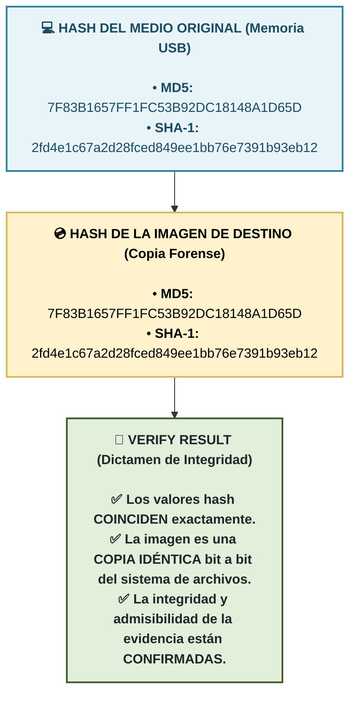
---

*Y si preferís mantener el formato homogéneo de **texto estructurado por bloques independientes (estilo consola)** para tu guía de estudio, acá tenés la alternativa limpia:*

```text
==========================================================================================
[ VERIFICACIÓN METROLÓGICA: REPORTE DE MATCH DE HASH - FTK IMAGER ]
==========================================================================================

[+] FUENTE ORIGEN: Dispositivo Físico (Memoria USB)
    ├── MD5:   7F83B1657FF1FC53B92DC18148A1D65D
    └── SHA-1: 2fd4e1c67a2d28fced849ee1bb76e7391b93eb12

         │
         ▼ [Cotejo Algorítmico Automatizado]
         │

[+] FUENTE DESTINO: Archivo Contenedor (Imagen Forense Lógica/Física)
    ├── MD5:   7F83B1657FF1FC53B92DC18148A1D65D
    └── SHA-1: 2fd4e1c67a2d28fced849ee1bb76e7391b93eb12

──────────────────────────────────────────────────────────────────────────────────────────
📌 ESTADO DE LA AUDITORÍA: VERIFY RESULT [SUCCESS]
──────────────────────────────────────────────────────────────────────────────────────────
  [✔] STATUS:           VALORES HASH EN PARIDAD ABSOLUTA.
  [✔] FIDELIDAD:        La estructura de datos clonada es idéntica bit a bit al soporte original.
  [✔] ADMISIBILIDAD:    Integridad confirmada. Certificado libre de contaminación o mutación.
======================================================================================
```

---

#### Significado de los resultados

| Resultado | Qué significa |
|-----------|---------------|
| **Los valores hash coinciden** | La imagen creada es **idéntica** al dispositivo original |
| **Los valores hash NO coinciden** | Algo alteró la copia (error en la creación, modificación accidental, etc.) |

---

#### Importancia de la verificación

| Razón | Por qué es crucial |
|-------|-------------------|
| **Integridad de la evidencia** | Confirma que la copia es exacta y no fue alterada |
| **Admisibilidad legal** | En un tribunal, se puede demostrar que la evidencia no fue manipulada |
| **Confianza en el análisis** | Los hallazgos sobre la copia reflejan fielmente el original |

---

## ⚖️ Proceso de Verificación de Integridad Criptográfica (FTK Imager)

Para garantizar que la imagen forense sea admisible en un entorno legal o auditoría interna, se debe demostrar de manera matemática que el clonado es una copia idéntica bit a bit del medio original y que no sufrió alteraciones durante el proceso.

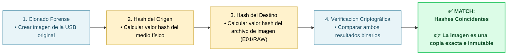

> **Regla de oro:** Siempre verificar los valores hash después de crear una imagen forense. Si los hashes no coinciden, la imagen no es válida y debe crearse nuevamente.

#### Ejercicio: Propósito del nombre de caso y directorio base en Autopsy

**Pregunta:** ¿Por qué es esencial proporcionar un **nombre de caso** y un **directorio base** al crear un nuevo caso en Autopsy?

- [ ] Para aumentar la seguridad del análisis
- [x] **Para organizar y almacenar los resultados del análisis de forma sistemática**
- [ ] Para garantizar un procesamiento más rápido de la imagen del disco
- [ ] Para que varios usuarios puedan trabajar simultáneamente en el caso

<details>
<summary>Ver explicación</summary>

La respuesta correcta es **Para organizar y almacenar los resultados del análisis de forma sistemática**. Autopsy utiliza el nombre del caso y el directorio base para crear una estructura ordenada donde se guardan todos los archivos, logs, reportes y hallazgos de la investigación. Esto permite que el análisis sea reproducible y fácil de revisar.

</details>

### Actividad práctica: Análisis de memoria USB con Autopsy - Selección de volumen

#### Contexto

George Smith afirma que **formateó** la memoria USB para recuperación del sistema. El formateo crea un nuevo volumen (volumen 2).

Si George almacenó archivos en la USB (como la empresa sospecha), lo más probable es que lo haya hecho en el **volumen formateado** (volumen 2).

---

#### Paso en Autopsy

| Acción | Propósito |
|--------|-----------|
| **Ampliar vol2** | Acceder al volumen formateado de la memoria USB para buscar archivos existentes o eliminados |

---

```text
==========================================================================================
[ TOPOLOGÍA DE ALMACENAMIENTO: MAPEO DE PARTICIONES EN AUTOPSY ]
==========================================================================================

[🗲] IDENTIFICADOR DEL SOPORTE: Imagen_USB_GeorgeSmith.E01
 │
 ├─── [📦 vol1] ESPACIO NO ASIGNADO / SISTEMA
 │     ├── Estado:    Sectores huérfanos, bloques de alineación o sectores de arranque (Boot).
 │     └── Táctica:   Reservado para análisis secundario (Búsqueda de fragmentos mediante Carving).
 │
 └─── [🎯 vol2] VOLUMEN PRINCIPAL (Partición Activa Formateada)
       ├── Estado:    Contiene el sistema de archivos principal legible por el Sistema Operativo.
       └── Táctica:   🎯 PUNTO DE ENTRADA E INICIO DE INGESTA DE DATOS.

──────────────────────────────────────────────────────────────────────────────────────────
📌 FUNDAMENTACIÓN METODOLÓGICA (Análisis Eficiente)
──────────────────────────────────────────────────────────────────────────────────────────
  ✔ FOCO OPERATIVO:  La actividad ordinaria del usuario (creación, edición y descarte de 
                     documentos de clientes) se registra sobre la partición lógica montada (vol2).
  ✔ CAPACIDAD SUITE: Autopsy procesará las tablas de asignación de este volumen para mapear
                     directorios actuales e identificar los punteros de archivos borrados recientes.
==========================================================================================
---

#### ¿Qué se puede encontrar en vol2?

| Tipo de evidencia | Descripción |
|-------------------|-------------|
| **Archivos existentes** | Archivos que George guardó y no eliminó |
| **Archivos eliminados** | Archivos que George borró pero que aún pueden recuperarse |
| **Metadatos** | Fechas de creación, modificación y acceso |
| **Carpetas** | Estructura de directorios que George pudo haber creado |
```
---

#### Importancia de la decisión

| Si se encuentra evidencia en vol2... | Implicación |
|--------------------------------------|-------------|
| ✅ Archivos con datos de clientes | George mintió sobre no almacenar archivos |
| ✅ Archivos recuperados (eliminados) | George intentó eliminar evidencia |
| ✅ Metadatos muestran actividad reciente | George accedió a los datos antes de la suspensión |

> **Regla de oro:** Siempre comenzar la búsqueda en el volumen donde el usuario tenía mayor probabilidad de almacenar datos (generalmente el volumen formateado o la partición principal).

### Actividad práctica: Resultados del análisis en Autopsy

#### Archivos encontrados en la memoria USB

El análisis de Autopsy en la carpeta `CarvedFiles` (archivos tallados) encontró **dos archivos**:

| Archivo | Tamaño | Estado |
|---------|--------|--------|
| **f0000000.fat** | 65,536 bytes | Archivo tallado (recuperado) |
| **f1048512.docx** | 13,241 bytes | Archivo tallado (recuperado) |

---

#### Interpretación de la vista de resultados

| Columna | Significado |
|---------|-------------|
| **Name** | Nombre del archivo (los archivos tallados pierden su nombre original) |
| **Modified Time** | Fecha y hora de última modificación |
| **Change Time** | Fecha y hora del último cambio de metadatos |
| **Access Time** | Fecha y hora del último acceso |
| **Created Time** | Fecha y hora de creación |
| **Size** | Tamaño del archivo en bytes |
| **Location** | Ubicación dentro de la imagen forense |

> **Nota importante:** Los archivos en `CarvedFiles` son archivos **recuperados mediante tallado de datos** (data carving). Estos archivos:
> - Pueden haber sido **eliminados** por el usuario
> - **Pierden sus nombres originales**
> - Pueden tener **metadatos incompletos** (fechas en 0000-00-00)

---

#### Significado de los hallazgos

| Hallazgo | Posible implicación |
|----------|---------------------|
| **f1048512.docx** (archivo .docx) | George pudo haber almacenado documentos en la USB |
| **Archivos en CarvedFiles** | Estos archivos fueron **recuperados** (probablemente eliminados previamente) |
| **Fechas en 0000-00-00** | Los metadatos se perdieron durante el tallado o la eliminación |

---

## 📁 ¿Qué es un Archivo Tallado (Data Carving)?

El tallado de datos es una técnica forense utilizada para recuperar archivos basados estrictamente en sus estructuras de datos internas, firmas mágicas (*headers* y *footers*) y contenido, **ignorando por completo la información del sistema de archivos** (la cual puede estar dañada, formateada o eliminada).

```mermaid
sequenceDiagram
    autonumber
    actor U as Usuario
    participant SA as Sistema de Archivos (FAT/NTFS)
    participant D as Almacenamiento Físico (Sectores/Clusters)
    participant A as Software Forense (Autopsy)

    U->>SA: Almacena archivo "Informe_Confidencial.docx"
    SA->>D: Escribe los datos binarios en clusters Libres
    SA->>SA: Registra Metadatos (Nombre, Ruta, Fechas MAC)
    
    Note over U,SA: --- ELIMINACIÓN O FORMATEO ---
    U->>SA: Elimina el archivo (.docx)
    SA->>SA: Borra el puntero/registro de metadatos (Nombre PERDIDO)
    SA->>D: Marca los clusters como "Disponibles" (Pero NO los borra)
    
    Note over SA,A: --- ANÁLISIS FORENSE (DATA CARVING) ---
    A->>D: Escanea el disco bit a bit de forma secuencial
    A->>D: Detecta Firma Mágica de Inicio (Header: 50 4B 03 04)
    A->>D: Detecta Firma Mágica de Cierre (Footer: 50 4B 05 06)
    A->>A: Extrae el bloque y lo reconstruye en la carpeta "CarvedFiles"
    A->>U: Entrega archivo recuperado como: "f1048512.docx"
```
---

#### Próximo paso

Ahora que se han identificado archivos tallados en la memoria USB, el siguiente paso es **examinar el contenido** de estos archivos (especialmente `f1048512.docx`) para determinar si contienen datos confidenciales de clientes (números de tarjetas de crédito, etc.).

#### Ejercicio: Interpretación de metadatos en Autopsy

**Escenario:**  
Autopsy recuperó un archivo `f1048512.docx` de 13,241 bytes (documento de Microsoft Word).

**Pregunta:** ¿Indican estos metadatos que George podría haber usado el archivo para almacenar datos?

- [ ] No, el tamaño del archivo es demasiado pequeño para almacenar datos significativos
- [x] **Sí, el tamaño y el tipo de archivo sugieren que puede almacenar datos sustanciales**
- [ ] No, el tipo de archivo es irrelevante para el almacenamiento de datos
- [ ] Sí, porque todos los archivos con la extensión .docx almacenan datos confidenciales

<details>
<summary>Ver explicación</summary>

La respuesta correcta es **Sí, el tamaño y el tipo de archivo sugieren que puede almacenar datos sustanciales**.

- El tamaño de 13 KB es suficiente para almacenar texto, incluyendo números de tarjeta de crédito (16 dígitos)
- La extensión .docx es un formato de documento común que puede contener información relevante para el caso
- El archivo fue recuperado mediante tallado (carving), lo que sugiere que fue eliminado (posible intento de ocultar evidencia)

No todos los .docx contienen datos confidenciales, pero el tamaño y tipo justifican una inspección más profunda.

</details>

```text
==========================================================================================
[ FICHA DE ARTEFACTO: ANÁLISIS DE METADATOS EN ARCHIVOS RECUPERADOS ]
==========================================================================================

[📄] IDENTIFICACIÓN LOGÍSTICA: f1048512.docx
 ├── Tipo de Archivo:  Documento de Microsoft Word (.docx)
 ├── Tamaño Real:      13,241 bytes
 └── Ruta Absoluta:    /img_GSmith USB Image.001/vol_vol2/CarvedFiles/

──────────────────────────────────────────────────────────────────────────────────────────
⏱️ CRONOLOGÍA DE METADATOS DEL SISTEMA DE ARCHIVOS (Timestamps MAC)
──────────────────────────────────────────────────────────────────────────────────────────
  ├── Fecha de Creación:     0000-00-00 00:00:00 [NULA / DESCONOCIDA]
  ├── Fecha de Modificación: 0000-00-00 00:00:00 [NULA / DESCONOCIDA]
  └── Fecha de Acceso:       0000-00-00 00:00:00 [NULA / DESCONOCIDA]

==========================================================================================
📌 DICTAMEN TÉCNICO FORENSE (Análisis del Hallazgo)
==========================================================================================
  ✔ ESTADO DEL ARCHIVO: Archivo huérfano recuperado mediante técnicas de "Data Carving".
  ✔ EXPLICACIÓN:        La ausencia de marcas de tiempo válidas (0000-00-00) confirma que los
                        metadatos lógicos de la tabla de asignación de archivos fueron 
                        destruidos. Autopsy extrajo el archivo basándose exclusivamente en 
                        sus firmas de cabecera (Magic Numbers: 'PK..' para archivos ZIP/DOCX).
  ✔ TIP DE CASO:        Para datar este archivo, el perito deberá inspeccionar los metadatos 
                        *internos* del propio documento (propiedades OLE/XML del .docx), los 
                        que a menudo conservan las fechas reales de autoría y guardado.
==========================================================================================
```
#### Ejercicio: Propósito del panel File Metadata en Autopsy

**Pregunta:** ¿Por qué verías el panel **File Metadata** (Metadatos de archivo) en Autopsy durante una investigación forense digital?

- [x] **Para examinar las propiedades y los detalles de un archivo, como la fecha de creación y el tamaño del archivo.**
- [ ] Para buscar palabras clave específicas dentro de los archivos, como nombres o términos.
- [ ] Para crear una línea de tiempo de las actividades de los archivos, como las fechas de acceso y modificación.
- [ ] Para ver imágenes en un formato de galería, como miniaturas de imágenes.

<details>
<summary>Ver explicación</summary>

La respuesta correcta es **Para examinar las propiedades y los detalles de un archivo, como la fecha de creación y el tamaño del archivo**.

El panel **File Metadata** está diseñado para mostrar información técnica del archivo:
- Fechas (creación, modificación, acceso)
- Tamaño
- Tipo de archivo
- Ubicación

Las otras funciones corresponden a otras herramientas de Autopsy:
- **Keyword Search** → buscar palabras clave
- **Timeline** → línea de tiempo
- **Gallery View** → ver imágenes en galería

</details>

#### Ejercicio: Propósito del panel File Metadata en Autopsy

**Pregunta:** ¿Por qué verías el panel **File Metadata** (Metadatos de archivo) en Autopsy durante una investigación forense digital?

- [x] **Para examinar las propiedades y los detalles de un archivo, como la fecha de creación y el tamaño del archivo.**
- [ ] Para buscar palabras clave específicas dentro de los archivos, como nombres o términos.
- [ ] Para crear una línea de tiempo de las actividades de los archivos, como las fechas de acceso y modificación.
- [ ] Para ver imágenes en un formato de galería, como miniaturas de imágenes.

<details>
<summary>Ver explicación</summary>

La respuesta correcta es **Para examinar las propiedades y los detalles de un archivo, como la fecha de creación y el tamaño del archivo**.

El panel **File Metadata** está diseñado para mostrar información técnica del archivo:
- Fechas (creación, modificación, acceso)
- Tamaño
- Tipo de archivo
- Ubicación

Las otras funciones corresponden a otras herramientas de Autopsy:
- **Keyword Search** → buscar palabras clave
- **Timeline** → línea de tiempo
- **Gallery View** → ver imágenes en galería

</details>


Este diagrama sintetiza perfectamente el flujo de interacción en la interfaz de Autopsy cuando pasamos del descubrimiento de un archivo al análisis de su carga útil (payload) o contenido interno. Es la secuencia típica que se usa para desentrañar fugas de información. En los repositorios de GitHub, las flechas y cajas de texto ASCII verticales tienden a descolocarse debido al renderizado de fuentes variables.

Para mantener la misma línea gráfica limpia, profesional y responsiva de tus apuntes anteriores, te preparé la versión adaptada con Mermaid.js, mapeando los componentes clave de la interfaz de la suite.

Copia y pega este bloque en tu README:

Markdown
### 🔍 Procedimiento Operativo: Análisis de Archivos y Contenido en Autopsy

```mermaid
graph TD
    %% Configuración de Estilos y Colores basados en la interfaz de la suite
    classDef interfaz fill:#e8f4f8,stroke:#2b7b9b,stroke-width:2px,color:#1a4d63;
    classDef visualizacion fill:#fff2cc,stroke:#d6b656,stroke-width:2px,color:#000000;
    classDef analisis fill:#e2efda,stroke:#375623,stroke-width:2px,color:#212529;
    classDef busqueda fill:#f8d7da,stroke:#dc3545,stroke-width:2px,color:#721c24;

    P1["<b>1. LOCALIZAR ARTEFACTO</b><br><br>🗂️ <i>Ubicación: Results Viewer (Panel Central)</i><br>• Navegar por el árbol de directorios o módulos de ingesta.<br>• Identificar el archivo sospechoso extraído de la imagen."]:::interfaz
    
    P2["<b>2. SELECCIONAR ELEMENTO</b><br><br>🖱️ <i>Ubicación: Content Viewer (Panel Inferior)</i><br>• Hacer clic sobre el archivo para activar la vista previa.<br>• El sistema carga los metadatos y firmas básicas."]:::interfaz
    
    P3["<b>3. CONMUTAR MODO DE VISTA</b><br><br>📄 <i>Acción técnica:</i><br>• Cambiar a la pestaña <b>TEXT</b> (o <i>Hex / String</i> si es binario).<br>• Fuerza a la suite a extraer cadenas de caracteres legibles."]:::visualizacion
    
    P4["<b>4. EXAMINAR PAYLOAD / CONTENIDO</b><br><br>🕵️‍♂️ <i>Auditoría de Datos:</i><br>• Buscar evidencias de exfiltración de datos confidenciales.<br>• Detectar patrones: Números de tarjetas (PAN), nombres, direcciones o credenciales."]:::analisis
    
    P5["<b>5. PIVOTAR CON PALABRAS CLAVE</b><br><br>🎯 <i>Optimización:</i><br>• Si el volumen de texto es masivo, ejecutar <b>Keyword Search</b>.<br>• Automatizar la localización mediante expresiones regulares (Regex)."]:::busqueda

    %% Flujo secuencial interactivo
    P1 --> P2 --> P3 --> P4 --> P5

```
---

*Y si preferís conservar la uniformidad en tus apuntes con el formato de **texto estructurado por bloques independientes estilo consola**, acá tenés la alternativa limpia para tu guía:*

```text
==========================================================================================
[ PROTOCOLO DE INTERFAZ: PASO A PASO PARA EL EXAMEN DE CONTENIDO EN AUTOPSY ]
==========================================================================================

1. SELECCIÓN DE LA PRUEBA (Results Viewer)
   ├── Acción:    Navegar por el panel jerárquico central o los reportes de extensión.
   └── Objetivo:  Aislar el archivo objetivo (ej. archivos de configuración, bases de datos o txt).

         │
         ▼
2. FOCO DE CONTENEDOR (Content Viewer)
   ├── Acción:    Seleccionar el archivo para habilitar el panel inferior de inspección.
   └── Objetivo:  Cargar el búfer del archivo en la memoria del analista sin exportarlo.

         │
         ▼
3. PARSEO DE CARACTERES (Pestaña TEXT)
   ├── Acción:    Hacer clic en la pestaña "Text" (o en su defecto, Strings / Hex).
   └── Objetivo:  Decodificar el archivo para filtrar el código de máquina y extraer texto plano.

         │
         ▼
4. ANÁLISIS DE EXFILTRACIÓN (Data Inspección)
   ├── Acción:    Lectura crítica orientada a la hipótesis del caso.
   └── Objetivo:  Cazar cadenas anómalas que comprometan información protegida o corporativa 
                  (estructuras de texto vinculadas a clientes, logs internos, etc.).

         │
         ▼
5. AUDITORÍA AVANZADA (Keyword Search)
   ├── Acción:    Pivotar hacia el módulo de búsqueda indexada en la esquina superior derecha.
   └── Objetivo:  Ingresar strings específicos o Regex para barrer la imagen completa en segundos
                  en caso de que el archivo seleccionado sea solo un fragmento del incidente.
=========================================================================================
```

#### Ejercicio: Cómo determinar si un archivo contiene datos confidenciales

**Escenario:**  
En Autopsy, encuentras un archivo llamado `f1048512.docx`. Necesitas determinar si contiene datos confidenciales del cliente.

**Pregunta:** ¿Cómo lo determinarás?

- [ ] Verifica la fecha de creación del archivo en el panel File Metadata
- [x] **Analiza el contenido del archivo en el panel Text (Texto) del visor Content (Contenido)**
- [ ] Mira el tamaño del archivo en el panel File Metadata
- [ ] Busca palabras clave relacionadas con el caso en la herramienta Keyword Search

<details>
<summary>Ver explicación</summary>

La respuesta correcta es **Analizar el contenido del archivo en el panel Text del visor Content**.

- **File Metadata** muestra propiedades (fechas, tamaño), pero NO el contenido real
- **Content Viewer (pestaña Text)** muestra el texto dentro del archivo
- **Keyword Search** es útil después de saber qué buscar, pero lo más directo es abrir el archivo

</details>

### 🔍 Workflow Avanzado: Inspección de Artefactos de Texto en Autopsy

```mermaid
graph TD
    %% Configuración de Estilos
    classDef panel fill:#eef2f7,stroke:#005a9c,stroke-width:2px,color:#000000;
    classDef accion fill:#fff2cc,stroke:#d6b656,stroke-width:2px,color:#000000;
    classDef meta fill:#e2efda,stroke:#375623,stroke-width:2px,color:#000000;

    subgraph Navegacion ["Navegación de la Interfaz"]
        N1["<b>1. Results Viewer</b><br>🔍 Localizar el archivo sospechoso en la grilla central."]:::panel
        N2["<b>2. Content Viewer</b><br>🖱️ Seleccionar el elemento para cargar su estructura en el panel inferior."]:::panel
    end

    subgraph Analisis ["Análisis Forense de Datos"]
        A1["<b>3. Conmutar a 'TEXT'</b><br>📄 Forzar el parseo de strings legibles, aislando el código binario."]:::accion
        A2["<b>4. Inspección de Carga Útil (Payload)</b><br>🕵️‍♂️ Buscar fugas: PII, tarjetas de crédito, hashes o rutas."]:::meta
        A3["<b>5. Keyword Search (Opcional)</b><br>🎯 Pivotar con Regex si el volumen de texto es masivo."]:::accion
    end

    %% Flujos
    N1 --> N2
    N2 --> A1
    A1 --> A2
    A2 --> A3
```
#### Ejercicio: Cómo determinar si un archivo contiene datos confidenciales

**Escenario:**  
En Autopsy, encuentras un archivo llamado `f1048512.docx`. Necesitas determinar si contiene datos confidenciales del cliente.

**Pregunta:** ¿Cómo lo determinarás?

- [ ] Verifica la fecha de creación del archivo en el panel File Metadata
- [x] **Analiza el contenido del archivo en el panel Text (Texto) del visor Content (Contenido)**
- [ ] Mira el tamaño del archivo en el panel File Metadata
- [ ] Busca palabras clave relacionadas con el caso en la herramienta Keyword Search

<details>
<summary>Ver explicación</summary>

La respuesta correcta es **Analizar el contenido del archivo en el panel Text del visor Content**.

- **File Metadata** muestra propiedades (fechas, tamaño), pero NO el contenido real
- **Content Viewer (pestaña Text)** muestra el texto dentro del archivo
- **Keyword Search** es útil después de saber qué buscar, pero lo más directo es abrir el archivo

</details>

#### Ejercicio: Próximo paso después de encontrar evidencia

**Escenario:**  
En Autopsy, recuperaste un archivo que contiene nombres, números de teléfono, números de Seguro Social y números de tarjetas de crédito.

**Pregunta:** ¿Cuál debería ser el próximo paso en la investigación?

- [ ] Cifrar el archivo recuperado para mayor seguridad y proteger la información confidencial
- [ ] Eliminar el archivo recuperado para proteger los datos y evitar el acceso no autorizado
- [x] **Notificar las conclusiones a tu supervisor y documentar la evidencia**

<details>
<summary>Ver explicación</summary>

La respuesta correcta es **Notificar las conclusiones a tu supervisor y documentar la evidencia**.

El procedimiento estándar en una investigación forense al encontrar evidencia relevante es:
1. **Documentar** los hallazgos (capturas, descripciones, ubicación)
2. **Preservar** la cadena de custodia
3. **Notificar** al supervisor o autoridad correspondiente

**No se debe** eliminar ni modificar la evidencia, ya que esto destruiría pruebas clave y podría tener consecuencias legales.

</details>

### Otras herramientas forenses digitales clave

Aprendiste sobre las herramientas forenses digitales estándar e incluso practicaste su uso en una investigación forense digital. Exploremos varias herramientas forenses digitales más que cualquier profesional de ciberseguridad debería conocer.

---

#### Volatility

**¿Qué es Volatility?**  
Volatility es una herramienta valiosa para **identificar y analizar software malicioso** (como un virus) en la **memoria de un sistema**.

**¿Qué la hace especial?**  
Muchas herramientas analizan datos en unidades de disco duro, memorias USB u otros dispositivos de almacenamiento estándar (memoria no volátil). Pero como su nombre lo indica, **Volatility analiza datos volátiles**, específicamente datos volátiles en **RAM**.

**¿Qué puede hacer un investigador con Volatility?**

| Función | Descripción |
|---------|-------------|
| **Extraer datos** | Del sistema operativo y los procesos que se ejecutan en la memoria |
| **Descubrir procesos ocultos** | El malware a menudo oculta procesos en segundo plano; Volatility puede detectarlos |
| **Identificar conexiones de red** | Descubrir conexiones de red asociadas al malware |
| **Identificar archivos abiertos** | Detectar qué archivos abrió el malware |

**Ejemplo de uso:**  
Un investigador estudia una infección de malware. El malware oculta procesos en segundo plano, dificultando su detección con herramientas básicas. Con Volatility, el investigador puede analizar el contenido de la memoria del sistema para descubrir estos procesos y las conexiones de red o archivos que abrió el malware.

---

#### Kali Linux

**¿Por qué aprender Linux?**  
Linux es una familia de sistemas operativos (SO) de **código abierto** que se ejecuta en la mayoría de los:
- Dispositivos de red
- Aplicaciones de seguridad
- Servidores basados en la nube

> Necesitarás conocer Linux para reforzar la seguridad o recopilar datos de seguridad de estos dispositivos, aplicaciones y servidores.

**¿Qué es Kali Linux?**  
Kali Linux es una de las **distribuciones más populares** para:
- **Pruebas de penetración**
- **Hacking ético**
- **Análisis forense digital**

**¿Qué incluye Kali Linux?**  
Viene con una serie de **herramientas estándar de ciberseguridad** preinstaladas:

| Categoría | Herramientas |
|-----------|--------------|
| **Análisis de redes** | Wireshark, tcpdump, Nmap |
| **Ingeniería inversa** | Varias herramientas |
| **Escaneo de vulnerabilidades** | Nessus, OpenVAS |
| **Explotación** | Metasploit |
| **Crackeo de contraseñas** | John the Ripper |
| **Forense digital** | Autopsy, Bulk Extractor, Foremost |

**Ventajas de Kali Linux:**

| Ventaja | Descripción |
|---------|-------------|
| **Actualizaciones periódicas** | Nuevas herramientas, exploits y funciones |
| **Fácil de usar** | Interfaz amigable |
| **Portable** | Puede ejecutarse desde Windows o macOS como **máquina virtual (VM)** |

> **Nota:** Una **máquina virtual (VM)** es una versión meramente basada en software de una computadora y un SO que se ejecuta dentro del sistema operativo real de un dispositivo. Las VM pueden ejecutar sus propias aplicaciones y otro software, al igual que las máquinas físicas.

---
## 🛠️ Herramientas Forenses Digitales Clave

El análisis de un incidente requiere el uso de herramientas especializadas según la capa de datos que se esté investigando (Memoria RAM vs. Almacenamiento Persistente y Red).

```mermaid
graph TD
    %% Estilos de herramientas
    classDef main fill:#312e81,stroke:#4338ca,stroke-width:2px,color:#ffffff,font-weight:bold;
    classDef vol fill:#064e3b,stroke:#059669,stroke-width:2px,color:#ffffff,font-weight:bold;
    classDef kali fill:#1e3a8a,stroke:#2563eb,stroke-width:2px,color:#ffffff,font-weight:bold;
    classDef cat fill:#f8f9fa,stroke:#cbd5e1,stroke-width:1px,color:#334155;

    Root["🛠️ ARSENAL FORENSE DIGITAL"]:::main

    %% Divisiones Principales
    Root --> VOL["🧠 VOLATILITY FRAMEWORK<br>(Análisis de Memoria RAM)"]:::vol
    Root --> KALI["🐉 KALI LINUX SUITE<br>(Entorno de Auditoría y Forense)"]:::kali

    %% Detalle Volatility
    VOL --> V1["🔍 Extracción de artefactos volátiles<br>🔍 Detección de inyecciones de código (Malware)<br>🔍 Reconstrucción de conexiones de red activas"]:::cat

    %% Detalle Kali
    KALI --> K1["🌐 Análisis de Red:<br>• Wireshark<br>• Tcpdump<br>• Nmap"]:::cat
    KALI --> K2["📁 Análisis de Disco:<br>• Autopsy<br>• Bulk Extractor<br>• Foremost"]:::cat
    KALI --> K3["🔑 Criptoanálisis / Pentesting:<br>• John the Ripper<br>• Metasploit Framework"]:::cat
```
---

### Comparación: Volatility vs. herramientas tradicionales

| Aspecto | Herramientas tradicionales | Volatility |
|---------|---------------------------|------------|
| **Tipo de datos** | No volátiles (disco, USB) | **Volátiles (RAM)** |
| **Detección de malware oculto** | Limitada | **Excelente** |
| **Análisis de procesos en memoria** | No | **Sí** |
| **Análisis de conexiones de red activas** | No | **Sí** |

---

### Resumen

| Herramienta | Propósito principal | Tipo de datos |
|-------------|---------------------|---------------|
| **Volatility** | Análisis de malware en memoria | Volátiles (RAM) |
| **Kali Linux** | Distribución todo-en-uno para pruebas de penetración y forense | No volátiles y volátiles |
| **Autopsy (en Kali)** | Análisis forense de discos | No volátiles |
| **Wireshark (en Kali)** | Análisis de tráfico de red | Datos en tránsito |

> **Regla de oro:** Para investigar malware activo o ataques en memoria, usa **Volatility**. Para una plataforma completa con múltiples herramientas forenses, usa **Kali Linux** (que incluye muchas de las herramientas que aprendiste, como Autopsy).

## Puntos para recordar - Conceptos clave

### Ciencia forense digital

| # | Concepto |
|---|----------|
| 1 | El **análisis forense digital** es la aplicación de la ciencia a la identificación, recopilación, examen y análisis de datos mientras se preserva la **integridad** de la información y se mantiene una estricta **cadena de custodia** |
| 2 | Los investigadores recopilan y extraen datos de **fuentes** como: medios de almacenamiento, dispositivos de seguridad físicos, dispositivos de red y archivos de registro (logs) |
| 3 | El análisis forense digital es cada vez más importante en la **aplicación de la ley**, las **investigaciones corporativas** y la **seguridad nacional** |

### Cadena de custodia y legalidad

| # | Concepto |
|---|----------|
| 4 | Los investigadores deben cumplir con las **leyes y regulaciones** pertinentes y seguir estrictamente una **cadena de custodia** para garantizar la integridad y la situación legal de sus investigaciones |
| 5 | La **cadena de custodia** es un proceso donde se documenta el **ciclo de vida de las pruebas**, incluyendo: fecha/hora/duración de manipulación, acciones realizadas y ubicación de almacenamiento |

### Las 4 fases del proceso forense digital

| # | Fase | Descripción |
|---|------|-------------|
| 6 | **Recopilación** | Identificar fuentes, etiquetar, codificar y adquirir datos preservando la integridad |
| 6 | **Examen** | Examinar datos recopilados para determinar relevancia y extraer información |
| 6 | **Análisis** | Analizar datos relevantes para extraer conclusiones significativas |
| 6 | **Elaboración de informes** | Crear y compartir informe detallado de todos los hallazgos |
| 7 | **Un solo paso en falso** en cualquier fase puede alterar la evidencia, distorsionar los hallazgos y socavar la credibilidad de la investigación |

### Preservación de datos

| # | Concepto |
|---|----------|
| 8 | Para preservar datos forenses, los investigadores deben: crear una **imagen** de la fuente original (antes de abrir cualquier archivo), verificar la **integridad** con valores hash, y seguir una **cadena de custodia** |

### Herramientas forenses digitales

| # | Concepto |
|---|----------|
| 9 | Los investigadores emplean herramientas forenses con **4 fines**: **Adquisición y análisis**, **Clasificación**, **Creación de imágenes**, **Recuperación** |
| 10 | Antes de crear una imagen de disco, se conecta la fuente a un **bloqueador de escritura** (dispositivo que evita ediciones accidentales) |
| 11 | Si quedan **metadatos** de un archivo eliminado, los investigadores pueden usarlos (junto con herramientas de recuperación) para **recuperar el archivo** |
| 12 | El **tallado de datos (data carving)** es el proceso de extraer datos de un dispositivo **sin depender del sistema de archivos ni de los metadatos** |
| 13 | **Kali Linux** es una distribución de Linux centrada en ciberseguridad con herramientas como Autopsy y otras aplicaciones forenses |

---

## Grandes ideas - Habilidades practicadas

| Habilidad | Aplicación en el módulo |
|-----------|-------------------------|
| **Pensamiento sistémico** | Explicar cómo diversas habilidades contribuyen a la integridad del proceso forense |
| **Comunicación escrita** | Describir habilidades necesarias para ser investigador forense digital |
| **Pensamiento analítico** | Analizar un ciberataque a través de la ciencia forense digital |
| **Mentalidad de crecimiento** | Aplicar las 4 fases de la ciencia forense digital a un escenario |
| **Pensamiento crítico** | Describir la aplicación de habilidades de resolución de problemas en forense |
| **Atención al detalle** | Identificar el propósito de las herramientas forenses digitales |
| **Resolución de problemas** | Analizar evidencia forense digital con FTK Imager y Autopsy |
| **Agilidad de aprendizaje** | Utilizar herramientas forenses en escenarios prácticos |

### Habilidades de gestión profesional

- Enumerar las **tareas típicas** que realiza un investigador forense digital
- Explicar por qué los investigadores forenses digitales necesitan **habilidades para resolver problemas**

---

## Objetivos de aprendizaje - Módulo 13 completado

Ahora que has completado este módulo, deberías poder:

- ✅ **Analizar un ciberataque mediante ciencia forense digital**
- ✅ **Aplicar las cuatro fases de la ciencia forense digital a un escenario**
- ✅ **Analizar la evidencia forense digital**

---

## Explora más recursos

Para explorar los conceptos cubiertos en este módulo con más profundidad, consulta estos recursos:

| Recurso | Descripción |
|---------|-------------|
| **What Is Digital Forensics?** (EC-Council) | Resumen detallado del campo de la ciencia forense digital (historia, requisitos laborales, desafíos) |
| **Digital and Multimedia Evidence** (NIST) | Enlaces a productos y servicios forenses digitales, catálogo de herramientas y técnicas |
| **Chances for data recovery** | Resumen de causas de pérdida de datos y cómo afectan las posibilidades de recuperación |
| **The Anatomy of an Att&ck** (IBM - Jeff Crume) | Video sobre cómo los atacantes irrumpen en sistemas (útil para identificar y recopilar datos forenses) |
| **Kali Linux** (sitio oficial) | Descargas, documentación, foros y cursos sobre esta distribución Linux |

---

## Referencias

**Lección 1: Introducción a la ciencia forense digital**

1. *digital forensics*. NIST, consultado el 30 de junio de 2024.

**Lección 2: El proceso forense digital**

1. Kent, Karen, Suzanne Chevalier, Tim Grance, and Hung Dang. *Guide to Integrating Forensic Techniques into Incident Response*. NIST, agosto de 2006.

---

## ¡Módulo 13 completado! 🎉

### Resumen del Módulo 13: Herramientas forenses digitales

| Herramienta | Propósito |
|-------------|-----------|
| **FTK Imager** | Crear imágenes forenses (copias bit a bit) |
| **Autopsy** | Análisis forense de discos (interfaz gráfica) |
| **The Sleuth Kit (TSK)** | Herramientas de línea de comandos para análisis forense |
| **PhotoRec / TestDisk** | Recuperación de archivos eliminados |
| **Volatility** | Análisis de memoria RAM (malware, procesos ocultos) |
| **Kali Linux** | Distribución todo-en-uno con herramientas forenses y de hacking ético |

## 📊 Comparativa de Enfoques en Recopilación Forense

Ante la detección de un incidente, la metodología aplicada determina la validez legal y técnica de los hallazgos.

```mermaid
graph TD
    %% Estilos de Estado Forense
    classDef alert fill:#7f1d1d,stroke:#b91c1c,stroke-width:2px,color:#ffffff,font-weight:bold;
    classDef error fill:#fee2e2,stroke:#ef4444,stroke-width:2px,color:#7f1d1d;
    classDef ok fill:#e2efda,stroke:#375623,stroke-width:2px,color:#212529,font-weight:bold;
    classDef step fill:#e8f4f8,stroke:#2b7b9b,stroke-width:1px,color:#1a4d63;
    classDef success fill:#16a34a,stroke:#15803d,stroke-width:2px,color:#ffffff,font-weight:bold;

    Incidente["🚨 INCIDENTE DETECTADO"]:::alert

    %% Bifurcación de Caminos
    Incidente --> |"Enfoque Reactivo / Incorrecto"| CaminoMal["❌ EL ERROR COMÚN"]:::error
    Incidente --> |"Enfoque Metodológico / Estándar"| CaminoBien["✅ EL PROTOCOLO CORRECTO"]:::ok

    %% Camino Erróneo
    CaminoMal --> F1["Zambullirse rápidamente:<br>Recopilar de todas las fuentes en simultáneo,<br>sin orden de volatilidad ni planificación."]:::error
    F1 --> ResultMal["⚠️ Evidencia Impugnada, Alterada o Inadmisible"]:::error

    %% Camino Correcto (Fases)
    CaminoBien --> P1["1. Planificación Inicial<br>• Estrategia según orden de volatilidad"]:::step
    P1 --> P2["2. Identificación Exhaustiva<br>• Localizar fuentes críticas (logs, ram, discos)"]:::step
    P2 --> P3["3. Aislamiento Físico/Lógico<br>• Bloqueadores de escritura de hardware"]:::step
    P3 --> P4["4. Preservación Bit a Bit<br>• Clonado forense (Jamás operar sobre el original)"]:::step
    P4 --> P5["5. Control Criptográfico<br>• Verificación de hashes (MD5, SHA-256)"]:::step
    P5 --> P6["6. Blindaje Legal<br>• Documentación estricta de Cadena de Custodia"]:::step
    
    P6 --> ResultBien["🎯 Evidencia Admisible, Inmutable y Resguardada"]:::success
```


```text
==========================================================================================
[ CONTROL DE CALIDAD: LECCIONES APRENDIDAS EN LA FASE DE RECOPILACIÓN ]
==========================================================================================

❌ ENFOQUE REACTIVO (Lo que se hizo mal)
   └── "Zambullirse de cabeza y recolectar datos a las apuradas de cualquier lado,
        manipulando los dispositivos en vivo y sin un plan de acción estructurado."
        👉 Consecuencia: Modificación de fechas MAC, alteración de logs y nulidad judicial.

         │
         ▼ [ Transformación Metodológica ]
         │

✅ ENFOQUE FORENSE (Lo que DEBIERON hacer)
   │
   ├── 1. PLANIFICAR:      Diseñar la estrategia de adquisición evaluando volatilidad y valor.
   ├── 2. IDENTIFICAR:     Mapear el ecosistema afectado (endpoints, correo, servidores, routers).
   ├── 3. PROTEGER:        Interponer bloqueadores de escritura (Write-Blockers) obligatoriamente.
   ├── 4. DUPLICAR:        Generar imágenes forenses idénticas (.E01 / .RAW). El original no se toca.
   ├── 5. AUDITAR:         Calcular firmas Hash para demostrar ante terceros que no hubo mutación.
   └── 6. TRAZAR:          Firmar las actas de cadena de custodia en cada relevo de la prueba.
=======================================================================================

==========================================================================================
[ PROYECTO CULMINANTE: INVESTIGAR UN INCIDENTE MEDIANTE ANÁLISIS FORENSE DIGITAL ]
==========================================================================================

🎯 OBJETIVOS DEL PROYECTO
   ├── 1. Aplicar el marco de respuesta a incidentes.
   ├── 2. Crear una imagen de una memoria USB.
   └── 3. Analizar la evidencia forense digital.

==========================================================================================
📌 ESCENARIO BASE
==========================================================================================
  Empresa:      Oceanix Living (manufactura)
  Incidente:    Datos corporativos comprometidos
  Contexto:     Se requiere respuesta rápida + investigación forense exhaustiva.
  Enfoque:      Aplicar marco de respuesta a incidentes + recuperación de evidencia digital.

==========================================================================================
📚 APRENDIZAJE PREVIO (Módulos requeridos)
==========================================================================================
  ✔ Respuesta a incidentes
  ✔ Análisis forense de sistemas digitales

==========================================================================================
✅ COMPETENCIAS AL FINALIZAR EL PROYECTO
==========================================================================================
  ✔ Investigar informes de incidentes mediante análisis forense digital.
  ✔ Crear una imagen forense de una memoria USB.
  ✔ Analizar evidencia digital recuperada.

==========================================================================================
🧠 HABILIDADES BLANDAS PRACTICADAS
==========================================================================================
  ├── Pensamiento analítico
  ├── Atención al detalle
  ├── Pensamiento crítico
  ├── Agilidad de aprendizaje
  └── Resolución de problemas

==========================================================================================
🔍 APLICACIÓN DE HABILIDADES EN EL PROYECTO
==========================================================================================
  🧠 Pensamiento analítico
      → Identificar pasos inmediatos según el contexto del incidente.
      → Elegir las herramientas forenses digitales correctas.

  🔎 Atención al detalle
      → Examinar los resultados de escaneo en busca de pistas clave.

  ⚖️ Pensamiento crítico
      → Interpretar y analizar los datos recuperados.
      → Extraer conclusiones significativas.

  ⚡ Agilidad de aprendizaje
      → Adaptarse rápidamente a distintos incidentes.
      → Seleccionar herramientas adecuadas según cada caso.

  🧩 Resolución de problemas
      → Identificar pasos posteriores al incidente.
      → Determinar una respuesta adecuada.

==========================================================================================


==========================================================================================
📋 ¿CÓMO TE EVALUARÁN?
==========================================================================================

Completarás dos evaluaciones en este proyecto culminante:

┌─────────────────────────────────────────────────────────────────────────────────────────┐
│  EVALUACIÓN 1: PROYECTO                                                                │
├─────────────────────────────────────────────────────────────────────────────────────────┤
│  • Responderás preguntas para demostrar tu conocimiento de operaciones y gestión de     │
│    seguridad.                                                                           │
│  • Puntaje mínimo requerido: 80%                                                        │
│  • Intentos: Puedes volver a intentarlo tantas veces como desees.                       │
│  • ⚠️ IMPORTANTE: No cierres el navegador mientras trabajas en el proyecto porque       │
│    perderás tu progreso y tendrás que empezar de nuevo.                                 │
└─────────────────────────────────────────────────────────────────────────────────────────┘

┌─────────────────────────────────────────────────────────────────────────────────────────┐
│  EVALUACIÓN 2: CUESTIONARIO (10 preguntas)                                             │
├─────────────────────────────────────────────────────────────────────────────────────────┤
│  • Demostrar los conocimientos y habilidades aplicados en el proyecto.                  │
│  • Puntaje mínimo requerido: 80%                                                        │
│  • Intentos: Puedes volver a intentarlo si es necesario.                                │
│  • Recibirás comentarios sobre tus respuestas.                                          │
└─────────────────────────────────────────────────────────────────────────────────────────┘

==========================================================================================
📌 PASOS PARA COMPLETAR EL PROYECTO
==========================================================================================

En la función de consultor de ciberseguridad, investigarás un informe de incidentes a través
de un análisis forense digital. Completarás este proyecto en un solo paso:

┌─────────────────────────────────────────────────────────────────────────────────────────┐
│  PASO 1: INVESTIGAR UN INCIDENTE A TRAVÉS DEL ANÁLISIS FORENSE DIGITAL                 │
├─────────────────────────────────────────────────────────────────────────────────────────┤
│  │                                                                                      │
│  ├── TAREA 1: Aplicar el marco de respuesta a incidentes                               │
│  │                                                                                      │
│  ├── TAREA 2: Crear una imagen de memoria USB                                          │
│  │                                                                                      │
│  └── TAREA 3: Analizar la evidencia forense digital                                    │
│                                                                                         │
└─────────────────────────────────────────────────────────────────────────────────────────┘

==========================================================================================

==========================================================================================
🔍 ROL DEL INVESTIGADOR FORENSE DIGITAL - PASOS CLAVE
==========================================================================================

Contexto: Te asignan investigar un incidente. Hay una memoria USB involucrada.

┌─────────────────────────────────────────────────────────────────────────────────────────┐
│  PASO 1: PLANIFICACIÓN (MARCO DE RESPUESTA A INCIDENTES)                               │
├─────────────────────────────────────────────────────────────────────────────────────────┤
│  • No tocar nada todavía.                                                              │
│  • Definir: ¿Qué pasó? ¿Qué fuentes de evidencia existen? (ej. USB, logs, servidor).   │
│  • Priorizar: Datos volátiles primero (RAM, procesos activos) si aplica.               │
│  • Armar un plan de recopilación.                                                      │
└─────────────────────────────────────────────────────────────────────────────────────────┘
                                      │
                                      ▼
┌─────────────────────────────────────────────────────────────────────────────────────────┐
│  PASO 2: RECOPILACIÓN DE EVIDENCIA                                                     │
├─────────────────────────────────────────────────────────────────────────────────────────┤
│  • Conectar la memoria USB a un bloqueador de escritura (write blocker).               │
│  • Crear una IMAGEN FORENSE de la USB (copia bit a bit).                               │
│  • Herramienta típica: FTK Imager.                                                     │
│  • Calcular HASH (MD5 o SHA) del original y la imagen para verificar integridad.       │
│  • Documentar cadena de custodia.                                                      │
└─────────────────────────────────────────────────────────────────────────────────────────┘
                                      │
                                      ▼
┌─────────────────────────────────────────────────────────────────────────────────────────┐
│  PASO 3: EXAMEN (ANÁLISIS DE LA EVIDENCIA)                                            │
├─────────────────────────────────────────────────────────────────────────────────────────┤
│  • Trabajar SIEMPRE sobre la imagen forense (nunca sobre la USB original).            │
│  • Usar herramientas como Autopsy, FTK Imager o Volatility.                            │
│  • Buscar: Archivos existentes, archivos borrados, metadatos, palabras clave.          │
│  • Recuperar archivos eliminados si es necesario (data carving).                        │
└─────────────────────────────────────────────────────────────────────────────────────────┘
                                      │
                                      ▼
┌─────────────────────────────────────────────────────────────────────────────────────────┐
│  PASO 4: ANÁLISIS Y CONCLUSIONES                                                       │
├─────────────────────────────────────────────────────────────────────────────────────────┤
│  • Interpretar los datos encontrados.                                                  │
│  • Relacionar hallazgos con el incidente (¿qué pasó? ¿quién? ¿cómo?).                 │
│  • Sacar conclusiones claras y basadas en evidencia.                                   │
└─────────────────────────────────────────────────────────────────────────────────────────┘
                                      │
                                      ▼
┌─────────────────────────────────────────────────────────────────────────────────────────┐
│  PASO 5: ELABORACIÓN DE INFORME                                                        │
├─────────────────────────────────────────────────────────────────────────────────────────┤
│  • Redactar informe forense con:                                                        │
│    - Descripción general del caso                                                      │
│    - Metodología usada (herramientas, procedimientos)                                  │
│    - Hallazgos encontrados (con capturas si es necesario)                              │
│    - Conclusiones y recomendaciones                                                    │
│  • Presentar a supervisor o cliente.                                                   │
└─────────────────────────────────────────────────────────────────────────────────────────┘

==========================================================================================
⚠️ REGLA DE ORO
==========================================================================================

NUNCA trabajes sobre la evidencia original. SIEMPRE:

    USB original ──(FTK Imager)──▶ Imagen forense (copia bit a bit)
                                        │
                                        └── Trabajar AQUÍ (análisis, recuperación)

==========================================================================================

==========================================================================================
📋 PLANIFICACIÓN FORENSE - ¿QUÉ HACER ANTES DE TOCAR CUALQUIER COSA?
==========================================================================================

Contexto: Te asignan investigar un incidente. Hay una memoria USB involucrada.
Regla de oro: TODAVÍA NO TOCAS NADA.

┌─────────────────────────────────────────────────────────────────────────────────────────┐
│  PASO 1: ENTENDER EL INCIDENTE                                                         │
├─────────────────────────────────────────────────────────────────────────────────────────┤
│  • ¿Qué pasó exactamente? (ej. robo de datos, infección por malware, etc.)            │
│  • ¿Cuándo pasó? (fecha y hora aproximada)                                            │
│  • ¿Qué sistemas o dispositivos están involucrados? (ej. USB, computadora, servidor)   │
│  • ¿Hay testigos o reportes iniciales?                                                 │
└─────────────────────────────────────────────────────────────────────────────────────────┘
                                      │
                                      ▼
┌─────────────────────────────────────────────────────────────────────────────────────────┐
│  PASO 2: IDENTIFICAR FUENTES DE EVIDENCIA                                              │
├─────────────────────────────────────────────────────────────────────────────────────────┤
│  • Listar TODOS los lugares donde podría haber evidencia:                              │
│    - Memoria USB (la que te dieron)                                                    │
│    - Computadora del sospechoso                                                        │
│    - Logs del servidor                                                                 │
│    - Correos electrónicos                                                              │
│    - Cámaras de seguridad (si aplica)                                                  │
│    - Registros de acceso                                                               │
└─────────────────────────────────────────────────────────────────────────────────────────┘
                                      │
                                      ▼
┌─────────────────────────────────────────────────────────────────────────────────────────┐
│  PASO 3: PRIORIZAR SEGÚN VOLATILIDAD (lo que se pierde más rápido primero)            │
├─────────────────────────────────────────────────────────────────────────────────────────┤
│  Orden de prioridad (de MÁS volátil a MENOS volátil):                                  │
│                                                                                         │
│  1. Memoria RAM (se pierde al apagar)                                                  │
│  2. Procesos activos, conexiones de red                                                │
│  3. Discos duros, USB (menos volátiles, se pueden apagar y analizar después)          │
│  4. Logs, backups (los más estables)                                                   │
│                                                                                         │
│  ⚠️ Si la USB es la evidencia principal, va en prioridad alta pero después de RAM.    │
└─────────────────────────────────────────────────────────────────────────────────────────┘
                                      │
                                      ▼
┌─────────────────────────────────────────────────────────────────────────────────────────┐
│  PASO 4: ELEGIR HERRAMIENTAS Y MÉTODOS                                                 │
├─────────────────────────────────────────────────────────────────────────────────────────┤
│  • ¿Con qué herramientas voy a trabajar?                                               │
│    - FTK Imager para crear imagen forense de la USB                                    │
│    - Write blocker (bloqueador de escritura) para proteger la USB original            │
│    - Autopsy para analizar la imagen                                                   │
│    - Volatility si hay que analizar RAM (si aplica)                                    │
│                                                                                         │
│  • ¿Cómo voy a documentar la cadena de custodia?                                       │
└─────────────────────────────────────────────────────────────────────────────────────────┘
                                      │
                                      ▼
┌─────────────────────────────────────────────────────────────────────────────────────────┐
│  PASO 5: ARMAR EL PLAN ESCRITO (antes de actuar)                                      │
├─────────────────────────────────────────────────────────────────────────────────────────┤
│  El plan debe responder:                                                               │
│                                                                                         │
│  • ¿Qué evidencia voy a recolectar?                                                    │
│  • ¿En qué orden? (por volatilidad)                                                    │
│  • ¿Con qué herramientas?                                                              │
│  • ¿Cómo voy a preservar la integridad? (write blocker, hash)                          │
│  • ¿Cómo voy a documentar todo? (cadena de custodia)                                   │
│  • ¿Qué hago si algo sale mal? (plan de contingencia)                                  │
└─────────────────────────────────────────────────────────────────────────────────────────┘

==========================================================================================
✅ QUÉ LOGRAS CON UNA BUENA PLANIFICACIÓN
==========================================================================================

  ✔ La evidencia NO se contamina
  ✔ La cadena de custodia es clara y defendible
  ✔ El caso se sostiene legalmente
  ✔ El análisis es más rápido porque ya sabés qué buscar
  ✔ No perdés tiempo recopilando cosas inútiles

==========================================================================================
❌ QUÉ PASA SI NO PLANIFICAS (error común)
==========================================================================================

  ✘ Agarrás la USB y la conectás directamente al PC → modificás la evidencia (fechas de acceso)
  ✘ No usás bloqueador de escritura → podés escribir accidentalmente en la USB
  ✘ No documentás nada → la cadena de custodia queda rota, la evidencia es inadmisible
  ✘ Recopilás todo sin orden → perdés datos volátiles importantes

==========================================================================================

* ¿Cómo sé qué pasó? ¿La empresa me dice o yo investigo?
==========================================================================================
🔍 ¿CÓMO SABÉS QUÉ PASÓ?
==========================================================================================

┌─────────────────────────────────────────────────────────────────────────────────────────┐
│  FUENTE 1: LA EMPRESA TE CUENTA (información inicial)                                  │
├─────────────────────────────────────────────────────────────────────────────────────────┤
│  • Te dan un reporte inicial: "Hubo un ataque", "Un empleado robó datos",               │
│    "Detectamos malware", etc.                                                           │
│  • Te indican qué dispositivos están involucrados (ej. esta memoria USB).              │
│  • Esto es el PUNTO DE PARTIDA, no la verdad final.                                    │
└─────────────────────────────────────────────────────────────────────────────────────────┘
                                      │
                                      ▼
┌─────────────────────────────────────────────────────────────────────────────────────────┐
│  FUENTE 2: VOS INVESTIGÁS (análisis forense)                                           │
├─────────────────────────────────────────────────────────────────────────────────────────┤
│  • Creás la imagen forense de la USB.                                                   │
│  • Analizás la imagen con Autopsy.                                                      │
│  • Encontrás evidencia: archivos borrados, logs, metadatos.                            │
│  • CONFIRMÁS o DESCARTÁS la hipótesis inicial.                                         │
│  • Podés descubrir cosas que la empresa no sabía.                                      │
└─────────────────────────────────────────────────────────────────────────────────────────┘

Ejemplo:
  La empresa dice: "Creemos que el empleado robó datos con esta USB".
  Vos analizás la USB y encontrás un archivo borrado con nombres de clientes.
  → Confirmás la hipótesis.

  O al revés: La USB está vacía y no hay rastros de datos.
  → Descartás la hipótesis.

==========================================================================================

**Cadena de custodia vs. imagen forense (son cosas distintas)**

==========================================================================================
🔐 CADENA DE CUSTODIA vs IMAGEN FORENSE
==========================================================================================

┌─────────────────────────────────────────────────────────────────────────────────────────┐
│  CADENA DE CUSTODIA (es un DOCUMENTO / PROCESO)                                        │
├─────────────────────────────────────────────────────────────────────────────────────────┤
│  • Es un REGISTRO ESCRITO de quién tuvo la evidencia y cuándo.                         │
│  • Se documenta CADA VEZ que alguien toca la evidencia.                                │
│  • Preguntas que responde:                                                             │
│    - ¿Quién la recolectó?                                                              │
│    - ¿Cuándo y dónde?                                                                  │
│    - ¿Quién la recibió?                                                                │
│    - ¿Dónde se guardó?                                                                 │
│    - ¿Quién la analizó?                                                                │
│                                                                                         │
│  • SIN cadena de custodia → la evidencia es INÚTIL en un juicio.                       │
└─────────────────────────────────────────────────────────────────────────────────────────┘

┌─────────────────────────────────────────────────────────────────────────────────────────┐
│  IMAGEN FORENSE (es un ARCHIVO / COPIA)                                                │
├─────────────────────────────────────────────────────────────────────────────────────────┤
│  • Es un archivo que contiene una COPIA EXACTA (bit a bit) de la memoria USB.          │
│  • Se crea con herramientas como FTK Imager.                                           │
│  • Se trabaja sobre la IMAGEN, no sobre la USB original.                               │
│  • Se verifica con HASH (MD5 o SHA) para asegurar que la copia es idéntica.            │
│                                                                                         │
│  • SIN imagen forense → trabajás sobre el original y lo destruís.                      │
└─────────────────────────────────────────────────────────────────────────────────────────┘

==========================================================================================
📌 ANALOGÍA FÁCIL
==========================================================================================

  CADENA DE CUSTODIA = el diario de a bordo de un barco.
                      Anota quién lo manejó, cuándo, dónde, por qué.

  IMAGEN FORENSE = una fotocopia IDÉNTICA del barco (con todos los detalles).
                   Trabajás sobre la fotocopia, el barco original queda guardado.

==========================================================================================

* ¿Cómo se documenta la cadena de custodia?

==========================================================================================
📄 EJEMPLO DE CADENA DE CUSTODIA (lo que anotás)
==========================================================================================

┌─────────────────────────────────────────────────────────────────────────────────────────┐
│  CASO: Oceanix Living - Incidente de robo de datos                                     │
├─────────────────────────────────────────────────────────────────────────────────────────┤
│                                                                                         │
│  Fecha: 10/06/2024  Hora: 09:00                                                        │
│  Acción: Recolección de la memoria USB                                                 │
│  Realizado por: Juan Pérez (Investigador forense)                                      │
│  Ubicación: Oficina de Oceanix Living, escritorio del empleado                         │
│  Descripción: Memoria USB marca Kingston, color negro, 32GB                           │
│  Estado: Sin daños visibles                                                            │
│  Almacenamiento: Bolsa de evidencia Nro. 001, sellada                                  │
│  Firma: Juan Pérez                                                                      │
│                                                                                         │
│  Fecha: 10/06/2024  Hora: 11:00                                                        │
│  Acción: Creación de imagen forense                                                    │
│  Realizado por: Juan Pérez                                                              │
│  Herramienta: FTK Imager v4.7.1                                                        │
│  Hash MD5 original: 7F83B1657FF1FC53B92DC18148A1D65D                                   │
│  Hash MD5 imagen: 7F83B1657FF1FC53B92DC18148A1D65D (coinciden)                         │
│  Almacenamiento: Disco forense Nro. 002, gabinete 3                                    │
│  Firma: Juan Pérez                                                                      │
│                                                                                         │
│  Fecha: 11/06/2024  Hora: 14:00                                                        │
│  Acción: Transferencia de imagen a Analista                                            │
│  Entregado por: Juan Pérez                                                              │
│  Recibido por: María Gómez (Analista forense)                                          │
│  Motivo: Análisis de evidencia                                                         │
│  Firmas: Juan Pérez / María Gómez                                                       │
│                                                                                         │
└─────────────────────────────────────────────────────────────────────────────────────────┘

## Resumen corto para tu proyecto

==========================================================================================
✅ PARA TU PROYECTO DE OCEANIX LIVING
==========================================================================================

  1. La empresa te da información inicial (hipótesis).
  2. Vos investigás y CONFIRMÁS o DESCARTÁS con evidencia.
  3. La CADENA DE CUSTODIA es el DOCUMENTO que registra quién tocó la evidencia.
  4. La IMAGEN FORENSE es el ARCHIVO que contiene la copia exacta de la USB.
  5. Trabajás sobre la IMAGEN, no sobre la USB original.
  6. Verificás con HASH que la imagen es idéntica al original.

==========================================================================================

==========================================================================================
📋 DESCRIPCIÓN GENERAL DEL PROYECTO
==========================================================================================

Oceanix Living - Investigación de incidente de ciberseguridad

┌─────────────────────────────────────────────────────────────────────────────────────────┐
│  TAREA 1: APLICAR EL MARCO DE RESPUESTA A INCIDENTES                                   │
├─────────────────────────────────────────────────────────────────────────────────────────┤
│  • Leerás el informe de incidente de Oceanix Living.                                   │
│  • Aplicarás el marco de respuesta a incidentes.                                       │
│  • Responderás preguntas sobre el incidente.                                           │
└─────────────────────────────────────────────────────────────────────────────────────────┘

                                      │
                                      ▼

┌─────────────────────────────────────────────────────────────────────────────────────────┐
│  TAREA 2: CREAR UNA IMAGEN DE MEMORIA USB                                              │
├─────────────────────────────────────────────────────────────────────────────────────────┤
│  • Pasarás a la fase de investigación.                                                 │
│  • Crearás una imagen forense completa de la memoria USB del sospechoso.               │
│  • Usarás herramientas como FTK Imager.                                                │
│  • Preservarás la integridad de la evidencia (hash, cadena de custodia).              │
└─────────────────────────────────────────────────────────────────────────────────────────┘

                                      │
                                      ▼

┌─────────────────────────────────────────────────────────────────────────────────────────┐
│  TAREA 3: ANALIZAR EVIDENCIA FORENSE DIGITAL                                          │
├─────────────────────────────────────────────────────────────────────────────────────────┤
│  • Analizarás la imagen forense de la memoria USB.                                     │
│  • Usarás herramientas de recuperación de datos (recuperar archivos borrados).         │
│  • Buscarás evidencia relevante para la investigación.                                 │
│  • Sacarás conclusiones sobre la naturaleza y el alcance de la violación.             │
└─────────────────────────────────────────────────────────────────────────────────────────┘

==========================================================================================
🎯 OBJETIVO FINAL
==========================================================================================

  Investigar el incidente, recuperar evidencia digital y determinar:
    • ¿Qué pasó?
    • ¿Qué datos se vieron comprometidos?
    • Quién pudo ser el responsable?

==========================================================================================

==========================================================================================
🏭 OCEANIX LIVING - INFORME DE INCIDENTE
==========================================================================================

┌─────────────────────────────────────────────────────────────────────────────────────────┐
│  EMPRESA                                                                               │
│  Oceanix Living - manufactura de viviendas flotantes                                   │
└─────────────────────────────────────────────────────────────────────────────────────────┘

┌─────────────────────────────────────────────────────────────────────────────────────────┐
│  PROYECTO CLAVE                                                                        │
│  AquaDome 3000 (alojamiento de lujo bajo el agua)                                      │
│  + dos tecnologías pendientes de patente:                                              │
│     • EcoHarmony                                                                       │
│     • AquaSphere                                                                       │
│  → Valor potencial: miles de millones de dólares en 30 años                           │
└─────────────────────────────────────────────────────────────────────────────────────────┘

┌─────────────────────────────────────────────────────────────────────────────────────────┐
│  MEDIDAS DE SEGURIDAD (antes del incidente)                                            │
│  • Planes confidenciales (todos firmaron acuerdos de confidencialidad).                │
│  • Sistemas aislados (sin acceso por Internet).                                        │
│  • Solo 6 personas con acceso a los sistemas.                                          │
└─────────────────────────────────────────────────────────────────────────────────────────┘

┌─────────────────────────────────────────────────────────────────────────────────────────┐
│  LO QUE PASÓ (incidente)                                                               │
│  • Se filtraron varios documentos protegidos a un competidor.                          │
│  • Se activaron los protocolos de respuesta a incidentes.                              │
└─────────────────────────────────────────────────────────────────────────────────────────┘

==========================================================================================
🔍 PREGUNTAS CLAVE PARA LA INVESTIGACIÓN
==========================================================================================

  • ¿Cómo se filtraron los documentos si los sistemas están aislados?
  • ¿Fue uno de los 6 empleados con acceso?
  • ¿Hubo copia de datos a un dispositivo externo (ej. memoria USB)?
  • ¿Hay evidencia digital que lo confirme?

==========================================================================================

==========================================================================================
❓ PREGUNTA - PRIMERA MEDIDA A TOMAR
==========================================================================================

Escenario: Filtración de datos de los planes del AquaDome 3000.
Solo 6 empleados tienen acceso a los sistemas.

Pregunta: ¿Qué medida debe tomar Oceanix Living INMEDIATAMENTE?

Opciones:
  ○ Llevar a cabo una reunión en toda la empresa.
  ● Confiscar la evidencia de todos los empleados con acceso al sistema. (CORRECTA)
  ○ Comenzar a mejorar la infraestructura de seguridad.
  ○ Preparar un informe para la junta directiva.

==========================================================================================
✅ RESPUESTA CORRECTA
==========================================================================================

Confiscar la evidencia de todos los empleados con acceso al sistema.

Motivo:
  • Solo 6 personas tienen acceso → grupo acotado y controlable.
  • Hay que preservar la evidencia antes de que pueda ser alterada o destruida.
  • La cadena de custodia comienza con la recolección de dispositivos (PC, USB, etc.).
  • Las otras acciones (reuniones, informes, mejoras) son posteriores.

==========================================================================================

==========================================================================================
❓ PREGUNTA - TIPO DE EVIDENCIA A RECOPILAR
==========================================================================================

Escenario: La empresa confiscó evidencia de los 6 empleados con acceso.

Pregunta: ¿Cuál de los siguientes tipos de evidencia debe recopilar la empresa?

Opciones:
  ○ Horarios de trabajo
  ○ Evaluaciones de desempeño
  ● Dispositivos personales (CORRECTO)
  ○ Verificación de antecedentes

==========================================================================================
✅ RESPUESTA CORRECTA
==========================================================================================

Dispositivos personales.

Motivo:
  • La evidencia digital forense se obtiene de dispositivos electrónicos.
  • Los documentos filtrados pueden estar en: memorias USB, discos externos, laptops.
  • También se deben confiscar: PC de escritorio, teléfonos, tablets.
  • Las otras opciones son documentos administrativos, no evidencia forense.

==========================================================================================

==========================================================================================
❓ PREGUNTA - SIGUIENTE PASO CON LA MEMORIA USB
==========================================================================================

Escenario:
  • Se confiscó una memoria USB perteneciente a Tuttle Leach.
  • El aprendiz dice que solo la usó para fotos submarinas.
  • La unidad podría contener datos incriminatorios.

Pregunta: ¿Cuál debe ser el siguiente paso del equipo?

Opciones:
  ○ Eliminar todos los datos de la memoria USB para evitar más filtraciones.
  ○ Entregar la memoria USB a las autoridades locales.
  ○ Usar la memoria USB para acceder a la computadora de Tuttle.
  ● Crear una imagen de la memoria USB para su análisis. (CORRECTO)

==========================================================================================
✅ RESPUESTA CORRECTA
==========================================================================================

Crear una imagen de la memoria USB para su análisis.

Motivo:
  • Preserva la evidencia original (no se modifica la USB).
  • La imagen es una copia bit a bit (forense) que se puede analizar sin riesgos.
  • Se verifica la integridad con hashes (MD5 o SHA).
  • El original queda resguardado para cadena de custodia.

==========================================================================================

* INFORME REALIZADO POR EL EQUIPO DE LA EMPRESA.
==========================================================================================
📄 INFORME DE INCIDENTES - OCEANIX LIVING
==========================================================================================

Número de caso interno: OLI-2022A-0098
Redactado por: Armida Albacore (gerente del equipo IR)
Fecha: 23 de junio de 2023

==========================================================================================
PARTE I - DESCRIPCIÓN GENERAL DEL INCIDENTE
==========================================================================================

┌─────────────────────────────────────────────────────────────────────────────────────────┐
│  FECHA: 22 de junio de 2023                                                            │
│  TIPO: Violación de seguridad grave                                                    │
│  QUÉ PASÓ: Robo y manipulación de archivos privados                                    │
│  DÓNDE: Sistemas informáticos aislados en instalaciones de I+D                        │
│  QUÉ ARCHIVOS: Tecnologías del AquaDome 3000 (sistemas AquaSphere y EcoHarmony)       │
│  QUIÉN DESCUBRIÓ: Un ingeniero de Oceanix Living                                       │
│  CAUSA: Acto deliberado de un infractor no identificado                               │
└─────────────────────────────────────────────────────────────────────────────────────────┘

==========================================================================================
PARTE II - ACCIONES DE RESPUESTA A INCIDENTES
==========================================================================================

┌─────────────────────────────────────────────────────────────────────────────────────────┐
│  1. CONFISCACIÓN DE EVIDENCIA                                                          │
│     • Se confiscaron dispositivos de los 6 usuarios con acceso al sistema.             │
│     • Se documentó todo en la cadena de custodia.                                      │
└─────────────────────────────────────────────────────────────────────────────────────────┘

┌─────────────────────────────────────────────────────────────────────────────────────────┐
│  2. NOTIFICACIÓN A AUTORIDADES                                                         │
│     • 22 de junio, 12:32 p.m. - se llamó a la policía local.                          │
│     • Detective llegó en 17 minutos.                                                   │
│     • Número de caso policial: PR-2023B-0145                                           │
│     • Oceanix cooperará con la investigación.                                          │
└─────────────────────────────────────────────────────────────────────────────────────────┘

┌─────────────────────────────────────────────────────────────────────────────────────────┐
│  3. CONTRATACIÓN DE EMPRESA EXTERNA                                                    │
│     • Se contrató a Ancira Consulting.                                                 │
│     • Funciones: recopilar inteligencia de amenazas y monitorear la dark web.          │
└─────────────────────────────────────────────────────────────────────────────────────────┘

┌─────────────────────────────────────────────────────────────────────────────────────────┐
│  4. INVESTIGACIÓN FORENSE EN CURSO                                                     │
│     • El equipo IR está analizando evidencia forense.                                  │
│     • Objetivo: determinar la fuente de la filtración.                                 │
└─────────────────────────────────────────────────────────────────────────────────────────┘

==========================================================================================
🔍 DATOS CLAVE PARA LA INVESTIGACIÓN
==========================================================================================

  • Solo 6 personas tenían acceso a los sistemas aislados.
  • La filtración fue un acto deliberado (no accidental).
  • El ingeniero que descubrió el incidente notó que FALTABAN DATOS (manipulación).
  • Hay una memoria USB confiscada (Tuttle Leach, aprendiz).
  • Se está investigando evidencia forense.

==========================================================================================

==========================================================================================
📌 TAREA 2: CREAR UNA IMAGEN DE MEMORIA USB
==========================================================================================

Escenario:
  • Eres miembro del equipo de IR de Oceanix Living.
  • Debes analizar la memoria USB de Tuttle Leach (aprendiz del Dr. Sebastian Trench).
  • Leach dice que solo guardaba fotos submarinas.
  • Antes de ver los archivos, debes crear una imagen idéntica de la USB.

==========================================================================================
✅ TIPO CORRECTO DE EVIDENCIA PARA CREAR UNA IMAGEN
==========================================================================================

  Opción correcta: Imagen forense (copia bit a bit)

┌─────────────────────────────────────────────────────────────────────────────────────────┐
│  ¿QUÉ ES UNA IMAGEN FORENSE?                                                           │
│                                                                                         │
│  • Es una copia EXACTA (bit a bit) de toda la memoria USB.                            │
│  • Incluye archivos visibles, archivos borrados y espacio no asignado.                 │
│  • Permite trabajar sobre la copia sin modificar la evidencia original.                │
│  • Se verifica con HASH (MD5 o SHA) para asegurar que es idéntica.                     │
└─────────────────────────────────────────────────────────────────────────────────────────┘

==========================================================================================
⚠️ IMPORTANTE
==========================================================================================

  • NUNCA se trabaja sobre la memoria USB original.
  • PRIMERO se crea la imagen forense.
  • LUEGO se analiza la imagen.
  • La USB original se guarda como evidencia (cadena de custodia).

==========================================================================================

==========================================================================================
📌 FTK IMAGER - CREAR IMAGEN DE MEMORIA USB
==========================================================================================

Pantalla: Evidence Item Information (Información del elemento de evidencia)

┌─────────────────────────────────────────────────────────────────────────────────────────┐
│  CAMPOS A COMPLETAR                                                                     │
├─────────────────────────────────────────────────────────────────────────────────────────┤
│                                                                                         │
│  Case Number:     OLI-2022A-0098                                                        │
│  Evidence Number: (se asigna automático o se completa después)                         │
│  Unique Description: Memoria USB - Tuttle Leach                                        │
│  Examiner:         tu_nombre                                                            │
│  Notes:            Creación de imagen forense de USB                                   │
│                                                                                         │
└─────────────────────────────────────────────────────────────────────────────────────────┘

==========================================================================================
✅ NÚMERO DE CASO CORRECTO
==========================================================================================

  Según el informe de incidentes OLI-2022A-0098:

  Número de caso: OLI-2022A-0098

  (incluir los guiones tal como está escrito)

==========================================================================================
📌 ¿DÓNDE SE OBTIENE ESTE DATO?
==========================================================================================

  El número de caso está en el informe de incidentes, Parte I:

  "Número de caso interno OLI-2022A-0098"

==========================================================================================

==========================================================================================
📌 FTK IMAGER - NÚMERO DE EVIDENCIA
==========================================================================================

Pantalla: Evidence Item Information (Información del elemento de evidencia)

┌─────────────────────────────────────────────────────────────────────────────────────────┐
│  CAMPOS COMPLETADOS HASTA AHORA                                                        │
├─────────────────────────────────────────────────────────────────────────────────────────┤
│                                                                                         │
│  Case Number:     OLI-2022A-0098                                                        │
│  Evidence Number: [completar con el número del formulario]                             │
│  Unique Description: Memoria USB - Tuttle Leach                                        │
│  Examiner:         tu_nombre                                                            │
│  Notes:            Creación de imagen forense de USB                                   │
│                                                                                         │
└─────────────────────────────────────────────────────────────────────────────────────────┘

==========================================================================================
✅ ¿CÓMO OBTENER EL NÚMERO DE EVIDENCIA?
==========================================================================================

  El número de evidencia está en el FORMULARIO DE SEGUIMIENTO DE CADENA DE CUSTODIA.

  Buscá en el formulario un campo que diga:
    • "Evidence Number"
    • "Número de evidencia"
    • "Número de pieza"

  Ejemplo típico: EVI-2023A-001

==========================================================================================
⚠️ IMPORTANTE
==========================================================================================

  • Incluir el guión si lo tiene (ej. EVI-2023A-001, no EVI2023A001).
  • Si no ves el número en el formulario, revisá las imágenes anteriores del laboratorio.
  • En algunos casos, el laboratorio asigna automáticamente el número al hacer clic en "Next".

==========================================================================================

==========================================================================================
📋 FORMULARIO DE CADENA DE CUSTODIA - DATOS CLAVE
==========================================================================================

┌─────────────────────────────────────────────────────────────────────────────────────────┐
│  Número de caso:        OLI-2022A-0098                                                  │
│  Elemento número:       0098-001                                                       │
│  Descripción:           Memoria USB AquaSync Trident X Marine                          │
│                         Número de serie: ASX-5213-KQ84                                 │
│  Lugar de incautación:  Departamento de I+D, oficina de Tuttle Leach                   │
│  Cadena de custodia:    Recolectada por Mehari Coralberg                               │
│                         Examinada por Jahn Dough (creación de imagen)                  │
└─────────────────────────────────────────────────────────────────────────────────────────┘

==========================================================================================
✅ EN FTK IMAGER - EVIDENCE ITEM INFORMATION
==========================================================================================

┌─────────────────────────────────────────────────────────────────────────────────────────┐
│  Case Number:       OLI-2022A-0098                                                      │
│  Evidence Number:   0098-001                                                            │
│  Unique Description: Memoria USB - Tuttle Leach (AquaSync Trident X Marine)            │
│  Examiner:          [tu nombre o Jahn Dough según corresponda]                         │
│  Notes:             Creación de imagen forense - Elemento 0098-001                     │
└─────────────────────────────────────────────────────────────────────────────────────────┘

==========================================================================================
📌 ELEMENTO NÚMERO CORRECTO
==========================================================================================

  Según la tabla de evidencia:

  Elemento núm. | Cantidad | Descripción
  ------------------------------------------------
  0098-001     |    1     | Memoria USB AquaSync Trident X Marine

  → Evidence Number: 0098-001

==========================================================================================

==========================================================================================
📋 FTK IMAGER - CAMPO EXAMINER (EXAMINADOR)
==========================================================================================

┌─────────────────────────────────────────────────────────────────────────────────────────┐
│  INFORMACIÓN DEL FORMULARIO DE CADENA DE CUSTODIA                                       │
├─────────────────────────────────────────────────────────────────────────────────────────┤
│                                                                                         │
│  Fecha: 23 de junio, 9:03 a.m.                                                         │
│  Entregado por: Mehari Coralberg (jefe de seguridad)                                   │
│  Recibido por: Jahn Dough (examinador de respuesta a incidentes)                       │
│  Propósito: Crear una imagen de disco USB                                              │
│  Ubicación: Laboratorio de seguridad                                                   │
│                                                                                         │
└─────────────────────────────────────────────────────────────────────────────────────────┘

==========================================================================================
✅ RESPUESTA CORRECTA
==========================================================================================

  Examiner (Examinador): Jahn Dough

  (incluir nombre y apellido exactamente como está escrito)

==========================================================================================
📌 CÓMO COMPLETAR EL FORMULARIO EN FTK IMAGER
==========================================================================================

  Case Number:       OLI-2022A-0098
  Evidence Number:   0098-001
  Unique Description: Tuttle Leach USB Drive Image
  Examiner:          Jahn Dough
  Notes:             (opcional, puede quedar vacío o poner "Imagen forense de USB")

==========================================================================================

==========================================================================================
✅ IMAGEN FORENSE CREADA CON ÉXITO
==========================================================================================

┌─────────────────────────────────────────────────────────────────────────────────────────┐
│  ESTADO: FTK Imager creó la imagen correctamente                                        │
│                                                                                         │
│  • La copia bit a bit (imagen forense) está lista.                                     │
│  • La evidencia original (memoria USB) está preservada.                                │
│  • Se puede proceder al análisis sobre la imagen.                                      │
└─────────────────────────────────────────────────────────────────────────────────────────┘

==========================================================================================
📋 COMPROBACIÓN FINAL DE LA TAREA 2
==========================================================================================

  ✔ Se confiscó la memoria USB de Tuttle Leach
  ✔ Se documentó la cadena de custodia (elemento 0098-001)
  ✔ Se creó la imagen forense (FTK Imager)
  ✔ Se verificó la integridad (hash, si aplicó)
  ✔ La imagen está lista para analizar

==========================================================================================
▶️ PRÓXIMO PASO
==========================================================================================

  TAREA 3: Analizar la evidencia forense digital

  • Usar herramientas de recuperación de datos.
  • Buscar archivos borrados o relevantes para la investigación.
  • Determinar si Tuttle Leach usó la USB para almacenar documentos del AquaDome 3000.

==========================================================================================

==========================================================================================
⚠️ CONSECUENCIAS DE NO VERIFICAR LA IMAGEN FORENSE
==========================================================================================

❌ Error: No verificar que la imagen coincide exactamente con el original
          (los hashes no son iguales)

==========================================================================================
✅ CONSECUENCIAS CORRECTAS (2)
==========================================================================================

┌─────────────────────────────────────────────────────────────────────────────────────────┐
│  1. INADMISIBLE EN EL TRIBUNAL POR SOSPECHA DE MANIPULACIÓN                            │
│                                                                                         │
│     • La evidencia pierde validez legal.                                               │
│     • El abogado contrario puede impugnar la prueba.                                   │
│     • El caso puede perderse por mala praxis.                                          │
└─────────────────────────────────────────────────────────────────────────────────────────┘

┌─────────────────────────────────────────────────────────────────────────────────────────┐
│  2. CONCLUSIONES INCORRECTAS DEBIDO A DATOS ALTERADOS                                  │
│                                                                                         │
│     • El análisis se basa en información falsa o incompleta.                           │
│     • Se pueden acusar a personas inocentes.                                           │
│     • Se pueden dejar ir a los verdaderos responsables.                                │
└─────────────────────────────────────────────────────────────────────────────────────────┘

==========================================================================================
❌ OPCIONES INCORRECTAS
==========================================================================================

  ○ Falta de evidencia para apoyar las conclusiones de la investigación
     → Esto no es exacto: evidencia hay, pero está alterada.

  ○ Error de cadena de custodia, ya que la imagen no es exacta
     → La cadena de custodia puede estar correctamente documentada.
       El error es de INTEGRIDAD, no de cadena de custodia.

==========================================================================================
✅ REGLA DE ORO
==========================================================================================

  SIEMPRE verificar los hashes (MD5 o SHA) del original y la copia.

  Si coinciden → la imagen es IDÉNTICA → se puede analizar.
  Si NO coinciden → la imagen NO es válida → hay que crearla de nuevo.

==========================================================================================

==========================================================================================
📌 ACTUALIZACIÓN DE CADENA DE CUSTODIA
==========================================================================================

┌─────────────────────────────────────────────────────────────────────────────────────────┐
│  INFORMACIÓN REGISTRADA                                                                │
├─────────────────────────────────────────────────────────────────────────────────────────┤
│                                                                                         │
│  Entregado por:     Jahn Dough (examinador)                                            │
│  Recibido por:      Mehari Coralberg (jefe de seguridad)                               │
│  Propósito:         Creación de imagen forense para análisis                           │
│                                                                                         │
└─────────────────────────────────────────────────────────────────────────────────────────┘

==========================================================================================
▶️ PRÓXIMO PASO: ANALIZAR ARCHIVOS ELIMINADOS
==========================================================================================

  Para buscar archivos eliminados en la imagen forense, se debe usar:

  ✅ Autopsy (herramienta de análisis forense)

  Otras herramientas posibles:
  • PhotoRec
  • TestDisk
  • FTK Imager (para vista previa, pero Autopsy es más completa)

==========================================================================================
✅ ¿CÓMO IDENTIFICAR EL ÍCONO CORRECTO?
==========================================================================================

  Buscar un ícono que represente:
  • Un dragón (logo de Autopsy)
  • Una lupa sobre una carpeta
  • Un escudo o herramienta de análisis forense

  Si el laboratorio muestra íconos específicos, seleccioná el que corresponda a Autopsy.

==========================================================================================

==========================================================================================
📌 AUTopsy - CÓMO VER ARCHIVOS ELIMINADOS
==========================================================================================

Pantalla: Autopsy con Data Sources

┌─────────────────────────────────────────────────────────────────────────────────────────┐
│  ESTRUCTURA EN AUTOPSY                                                                 │
├─────────────────────────────────────────────────────────────────────────────────────────┤
│                                                                                         │
│  Data Sources                                                                          │
│  │                                                                                      │
│  └── [+] Tuttle USB Drive   ← HACER CLIC EN EL SIGNO MÁS (+) AQUÍ                       │
│         │                                                                               │
│         ├── [ ] vol1                                                                   │
│         └── [+] vol2        ← Expandir el volumen para ver contenido                    │
│                │                                                                        │
│                ├── Deleted Files     ← Archivos eliminados                             │
│                ├── Carved Files      ← Archivos recuperados por tallado                │
│                └── ...                                                                │
│                                                                                         │
└─────────────────────────────────────────────────────────────────────────────────────────┘

==========================================================================================
✅ RESPUESTA CORRECTA
==========================================================================================

  Hacer clic en el signo MÁS (+) al lado de "Tuttle USB Drive" (o al lado del volumen)
  para expandir y acceder a los archivos eliminados.

==========================================================================================
📌 TIPOS DE ARCHIVOS QUE SE PUEDEN ENCONTRAR
==========================================================================================

  • Deleted Files: archivos que el usuario eliminó pero aún son recuperables.
  • Carved Files: archivos recuperados mediante tallado de datos (data carving).
  • Unallocated Space: espacio no asignado donde pueden quedar restos de datos.

==========================================================================================

==========================================================================================
🔍 ANÁLISIS FORENSE DE ARCHIVOS ELIMINADOS - MEMORIA USB DE TUTTLE LEACH
==========================================================================================

┌─────────────────────────────────────────────────────────────────────────────────────────┐
│  AFIRMACIONES DE LEACH                                                                │
├─────────────────────────────────────────────────────────────────────────────────────────┤
│                                                                                         │
│  • "Solo usé la memoria USB para almacenar fotos submarinas"                          │
│  • (archivos gráficos / imágenes)                                                      │
│                                                                                         │
└─────────────────────────────────────────────────────────────────────────────────────────┘

┌─────────────────────────────────────────────────────────────────────────────────────────┐
│  HALLAZGO DEL ANÁLISIS FORENSE (archivos eliminados)                                   │
├─────────────────────────────────────────────────────────────────────────────────────────┤
│                                                                                         │
│  • Se encontró un patrón de ARCHIVOS DE WORD                                           │
│  • (documentos de texto, no fotos)                                                     │
│                                                                                         │
└─────────────────────────────────────────────────────────────────────────────────────────┘

==========================================================================================
✅ RESPUESTA CORRECTA
==========================================================================================

  Opción: "Surge un patrón de archivos de Word, que no coincide con las afirmaciones de Leach."

==========================================================================================
🔍 CONCLUSIÓN
==========================================================================================

  Leach dijo:                     Solo fotos submarinas (archivos gráficos)
  La evidencia muestra:           Archivos de Word (documentos)
                                  ↓
                              NO COINCIDE con sus afirmaciones

==========================================================================================
⚠️ IMPLICANCIA
==========================================================================================

  • Leach podría no estar diciendo la verdad.
  • Los archivos de Word podrían contener documentos del AquaDome 3000.
  • Se debe seguir investigando el contenido de esos archivos de Word.

==========================================================================================
==========================================================================================
🔍 ANÁLISIS DE METADATOS - Kelp Study.docx
==========================================================================================

┌─────────────────────────────────────────────────────────────────────────────────────────┐
│  PREGUNTA                                                                              │
├─────────────────────────────────────────────────────────────────────────────────────────┤
│  ¿Puedes confirmar que este archivo es uno de los documentos privados filtrados        │
│  basándote ÚNICAMENTE en los metadatos?                                                │
└─────────────────────────────────────────────────────────────────────────────────────────┘

==========================================================================================
✅ RESPUESTA CORRECTA
==========================================================================================

  NO, porque la presencia de metadatos por sí sola no establece que este archivo sea
  uno de los documentos filtrados.

==========================================================================================
🔍 EXPLICACIÓN
==========================================================================================

  Los metadatos te pueden decir:
  • Quién creó el archivo.
  • Cuándo se creó o modificó.
  • El tamaño del archivo.

  Pero NO te dicen:
  ✘ Cuál es el CONTENIDO del archivo.
  ✘ Si ese contenido es confidencial o no.
  ✘ Si fue parte de la filtración.

==========================================================================================
📌 ENTONCES, ¿CÓMO SE CONFIRMA?
==========================================================================================

  1. Analizar el CONTENIDO del archivo (texto, planos, cifras).
  2. Compararlo con los documentos que se sabe que fueron robados.
  3. Correlacionar la información con otras fuentes (logs, etc.).

  Solo así se puede confirmar si es parte de los documentos filtrados.

==========================================================================================

==========================================================================================
🔍 CONCLUSIONES DEL ANÁLISIS FORENSE - MEMORIA USB DE TUTTLE LEACH
==========================================================================================

┌─────────────────────────────────────────────────────────────────────────────────────────┐
│  LO QUE DIJO LEACH                                                                     │
├─────────────────────────────────────────────────────────────────────────────────────────┤
│  "Solo usé la memoria USB para almacenar fotos submarinas"                             │
└─────────────────────────────────────────────────────────────────────────────────────────┘

┌─────────────────────────────────────────────────────────────────────────────────────────┐
│  LO QUE ENCONTRÓ EL ANÁLISIS FORENSE                                                   │
├─────────────────────────────────────────────────────────────────────────────────────────┤
│                                                                                         │
│  • Archivo: Kelp Study.docx (nombre engañoso)                                          │
│  • Contenido REAL: Documentación completa del AquaDome 3000                           │
│  • Incluye: AquaSphere, EcoHarmony, AquaBot, especificaciones técnicas                 │
│  • El archivo estaba ELIMINADO (intento de ocultar evidencia)                          │
│                                                                                         │
└─────────────────────────────────────────────────────────────────────────────────────────┘

┌─────────────────────────────────────────────────────────────────────────────────────────┐
│  IMPLICACIONES                                                                         │
├─────────────────────────────────────────────────────────────────────────────────────────┤
│                                                                                         │
│  ❌ Leach mintió sobre el contenido de la USB.                                         │
│  ❌ Almacenó documentos confidenciales del AquaDome 3000 en un dispositivo personal.   │
│  ❌ Intentó eliminar los archivos (posiblemente después de ser descubierto).           │
│  ✅ La evidencia forense confirma la filtración de datos.                              │
│                                                                                         │
└─────────────────────────────────────────────────────────────────────────────────────────┘

==========================================================================================
📌 EVIDENCIA QUE CONFIRMA LA FILTRACIÓN
==========================================================================================

  • Archivo recuperado (eliminado) con contenido del AquaDome 3000.
  • Tecnologías AquaSphere y EcoHarmony documentadas.
  • Leach mencionado como colaborador del proyecto.
  • Inconsistencia entre su declaración y la evidencia.

==========================================================================================

==========================================================================================
🔍 IDENTIFICACIÓN DE DOCUMENTO CONFIDENCIAL
==========================================================================================

Archivo: Kelp Study.docx (nombre engañoso)
Contenido real: Documentación del AquaDome 3000

┌─────────────────────────────────────────────────────────────────────────────────────────┐
│  ¿QUÉ SUGIERE QUE ES UN DOCUMENTO PRIVADO FILTRADO?                                    │
├─────────────────────────────────────────────────────────────────────────────────────────┤
│                                                                                         │
│  ✅ La introducción del AquaDome 3000                                                   │
│     • Presenta el proyecto como un "invento de última generación"                     │
│     • Menciona que es propiedad de Oceanix Living                                      │
│     • Describe las tecnologías pendientes de patente (AquaSphere, EcoHarmony)          │
│                                                                                         │
└─────────────────────────────────────────────────────────────────────────────────────────┘

==========================================================================================
📌 LAS OTRAS OPCIONES TAMBIÉN SON CONFIDENCIALES, PERO...
==========================================================================================

  ○ La descripción de la tecnología AquaSphere → también es confidencial
  ○ La mención de la participación de la Dra. Marina Deepwater → también es confidencial
  ○ La descripción general del sistema EcoHarmony → también es confidencial

  TODAS son partes del mismo documento filtrado.

  La introducción es la que REVELA LA NATURALEZA GENERAL del proyecto como
  un invento privado y patentado de Oceanix Living.

==========================================================================================
✅ CONCLUSIÓN
==========================================================================================

  El documento completo (Kelp Study.docx) es confidencial.
  La introducción establece que el AquaDome 3000 es un proyecto privado
  con tecnologías pendientes de patente.

==========================================================================================

==========================================================================================
📊 EVALUACIÓN DEL IMPACTO - PROYECTO AQUADOME 3000
==========================================================================================

┌─────────────────────────────────────────────────────────────────────────────────────────┐
│  ¿QUÉ ES LO MÁS VALIOSO PARA OCEANIX LIVING?                                           │
├─────────────────────────────────────────────────────────────────────────────────────────┤
│                                                                                         │
│  🏆 Tecnologías pendientes de patente:                                                 │
│     • AquaSphere (nanotecnología, autorreparación, patrón hexagonal)                   │
│     • EcoHarmony (energías renovables, IA, baterías de iones de litio)                │
│                                                                                         │
│  Estos sistemas podrían generar "miles de millones de dólares en 30 años".            │
│                                                                                         │
└─────────────────────────────────────────────────────────────────────────────────────────┘

==========================================================================================
✅ RESPUESTA CORRECTA
==========================================================================================

  Al evaluando el contenido para tecnologías patentadas.

  Motivo:
  • El impacto NO es solo que se filtraron archivos.
  • El impacto REAL es si las TECNOLOGÍAS CLAVE (patentes) quedaron expuestas.
  • Un competidor con esas especificaciones podría copiar los inventos.

==========================================================================================
❌ POR QUÉ LAS OTRAS OPCIONES SON MENOS RELEVANTES PARA EVALUAR EL IMPACTO
==========================================================================================

  ○ Al determinar si los archivos se compartieron externamente
     → Eso es parte de la investigación (cómo), no del impacto.

  ○ Al revisar la frecuencia de acceso a los archivos
     → Eso es parte del análisis forense (cuándo), no del impacto.

  ○ Al analizar los tipos de dispositivos donde se almacenaron
     → Eso es parte de la recolección de evidencia (dónde), no del impacto.

==========================================================================================
🔍 CONCLUSIÓN
==========================================================================================

  Para evaluar el IMPACTO, hay que responder:

  ¿Qué tan dañino es que estas tecnologías específicas estén en manos de un competidor?

  La respuesta está en el CONTENIDO de los archivos y su nivel de detalle técnico.

==========================================================================================

