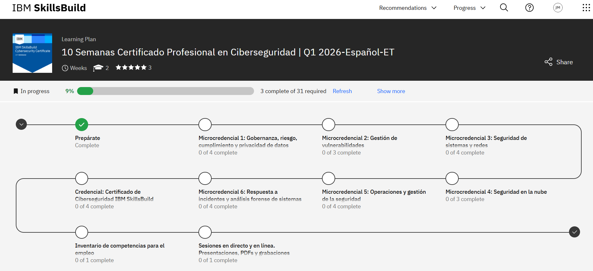

# 🛡️ Certificado Profesional en Ciberseguridad - IBM SkillsBuild

¡Bienvenido a mi repositorio de aprendizaje! Aquí documento mi camino hacia la certificación profesional de **IBM SkillsBuild**. Este programa consta de 10 semanas de formación intensiva divididas en microcredenciales clave para el sector de la seguridad informática.

---

## 📊 Estado del Progreso Actual

> **Última actualización:** Q1 2026 | **Completado:** 3 de 31 actividades (9%)

---

## 🗺️ Hoja de Ruta (Learning Plan)

A continuación, detallo los módulos del programa. Iré marcando cada uno conforme avance y suba mis notas y laboratorios:

### ✅ Etapa Inicial
- [x] **Prepárate:** Introducción al entorno de aprendizaje y herramientas.

### 🛡️ Microcredenciales (En curso)
- [ ] **1. Gobernanza, riesgo, cumplimiento y privacidad de datos:** Fundamentos legales y marcos de trabajo.
- [ ] **2. Gestión de vulnerabilidades:** Identificación y mitigación de debilidades en sistemas.
- [ ] **3. Seguridad de sistemas y redes:** Protección de infraestructura y protocolos.
- [ ] **4. Seguridad en la nube:** Mejores prácticas para entornos Cloud.
- [ ] **5. Operaciones y gestión de la seguridad:** El día a día en un SOC.
- [ ] **6. Respuesta a incidentes y análisis forense:** Investigación de brechas y recuperación.

### 🏁 Cierre y Empleabilidad
- [ ] **Credencial Final:** Certificado de Ciberseguridad IBM SkillsBuild.
- [ ] **Inventario de competencias:** Preparación para el mercado laboral.
- [ ] **Sesiones en directo:** Webinars y material complementario.

---

## 📂 Organización del Repositorio
* `img/`: Capturas de pantalla, diagramas y evidencias de progreso.
* `Microcredencial-X/`: Apuntes detallados, ejercicios y laboratorios de cada módulo.
* `Certificados/`: Mis insignias digitales y el diploma final.

---

## 🛠️ Herramientas Utilizadas
* **Plataforma:** IBM SkillsBuild
* **Documentación:** Markdown & VS Code
* **Control de Versiones:** Git & GitHub

---

*“La ciberseguridad no es un producto, es un proceso.”* – **Bruce Schneier**

# Clases :
*Clase intro* https://youtu.be/Hyj7B_7HJ2o
